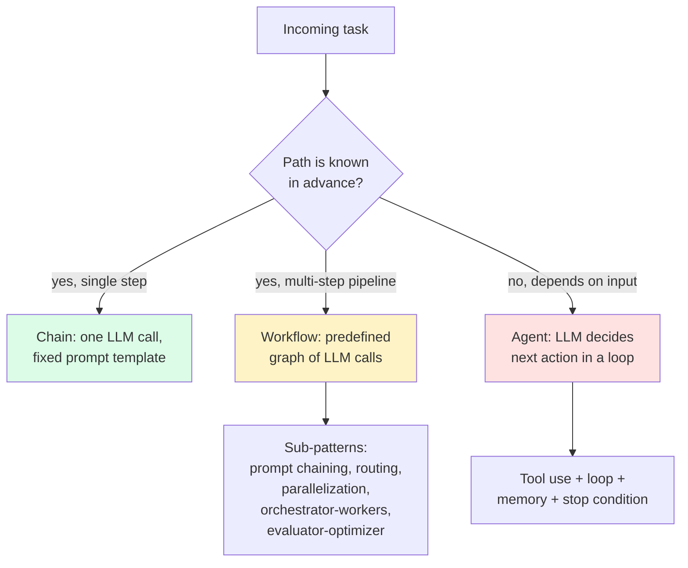

import { Cards, Card } from 'fumadocs-ui/components/card';
import { Callout } from 'fumadocs-ui/components/callout';

<Callout type="warn" title="TL;DR">
An **agent** is an LLM in a loop with tools and state — the model decides what to do next on each step. A **chain** is a fixed pipeline where every step is predetermined. Agents are strictly more powerful and strictly more dangerous: they hallucinate tool calls, loop forever, and bloat their own context until they fall over. **Start with a chain. Graduate to an agent only when you've measured a specific task where a fixed pipeline cannot adapt** — and even then, prefer Anthropic's "workflow" patterns (prompt chaining, routing, parallelization, orchestrator-workers) before reaching for a fully autonomous loop.
</Callout>

## The problem this solves

You can prompt a model to "answer the user's question." That's a chain — input goes in, one model call happens, output comes out. It works for FAQ bots, classification, summarization, and 70% of what people actually need from LLMs.

But the moment the task requires **looking things up, taking actions in the world, or reasoning over multiple steps where the next step depends on what the model found in the last step**, a single call is no longer enough. You need:

- A way for the model to ask the runtime to *do something* on its behalf (tool use / function calling).
- A way for the model to *see the result* and decide what to do next (the loop).
- A way for the runtime to *stop* (termination conditions: max-iter cap, "done" signal, budget exhausted).
- A way for the model to *remember* what it learned across iterations (state, conversation memory, scratchpads).

Add those four ingredients to a model and you have an agent. Anthropic's [Building Effective Agents](https://www.anthropic.com/research/building-effective-agents) (Dec 2024) draws a precise line: a **workflow** is "LLMs and tools orchestrated through predefined code paths," while an **agent** is a system where "LLMs dynamically direct their own processes and tool usage, maintaining control over how they accomplish tasks." The first is deterministic at the structure level; the second hands control of the structure itself to the model.

This tier is about when you need the second kind, what it looks like in production, and how to keep it from eating your AWS bill.

## The core insight

**The model is the controller, the runtime is the substrate, and the gap between them is where every agent bug lives.**

The model can decide to call a tool, but it cannot decide to *execute* one — your runtime does that. The model can decide to stop, but it cannot decide to *enforce* a stop — your runtime does that too. Every failure mode of an agent system reduces to a mismatch between what the model thought would happen and what the runtime actually did:

- The model emitted a tool call referencing a tool that doesn't exist → tool hallucination.
- The model kept asking to call the same tool with the same arguments → infinite loop.
- The model produced an action that worked, but the runtime appended 50KB of result to the next prompt → context bloat that destroys the next reasoning step.

Three failure modes, every one of them a runtime contract problem, not a "model isn't smart enough" problem. The hard part of shipping agents is **designing the runtime so the model can't get itself in trouble** — not picking the smartest model.

## Agents vs chains vs workflows



The colors are the budget signal: green is cheap and predictable, yellow is moderately expensive and mostly predictable, red is "you are now operating something stochastic that can run away from you."

## Anthropic's taxonomy: workflows vs agents

Anthropic's essay defines five **workflow** patterns and one **agent** pattern. Memorize this list — it's the most useful vocabulary in the space.

### 1. Prompt chaining

A fixed sequence of LLM calls. Output of step N is input to step N+1. Use when you have a clean decomposition that always applies — e.g. "first generate an outline, then write each section, then a final polish pass."

```python
outline = llm("Outline a blog post about: " + topic)
draft   = llm("Write a draft from this outline:\n" + outline)
final   = llm("Polish this draft for tone and concision:\n" + draft)
```

No agentic decision-making — the structure is yours. **Use this 80% of the time.**

### 2. Routing

A classifier LLM picks which downstream chain handles the request. Use when inputs fall into distinct categories with different optimal handling (refunds vs technical support vs sales). Cheap classifier (Haiku, Gemini Flash, GPT-4o-mini) at the front; specialized chains behind.

### 3. Parallelization

Run N LLM calls in parallel, either:
- **Sectioning** — split the task (different sections of a doc, different aspects of an analysis).
- **Voting** — same task N times, then majority-vote / pick-best.

The second is a poor man's self-consistency and works surprisingly well for moderation, code review, and ambiguous classifications.

### 4. Orchestrator-workers

A central orchestrator LLM **decides** which subtasks to spin up, then dispatches them to worker LLMs in parallel. Different from routing because the orchestrator generates the subtasks on the fly — it doesn't pick from a fixed menu. Claude Code's sub-agent pattern is this. So is Anthropic's [multi-agent research system](https://www.anthropic.com/engineering/built-multi-agent-research-system).

### 5. Evaluator-optimizer

One LLM generates, another LLM critiques, the first one revises. Loop until the evaluator approves or you hit a budget. Excellent for writing tasks, code generation with style constraints, and translation quality.

### 6. Agents (the actual agent pattern)

Now the model is in a loop with tools. It observes, thinks, picks a tool, gets a result, observes again. The structure of the loop and the choice of tools at each step is all decided by the model. Claude Code in `--auto` mode, Devin, Cursor's agent mode, Anthropic's computer use — these are the production examples.

The cost of going from workflow #5 to pattern #6 is enormous. **You give up determinism in exchange for adaptability.** Don't pay that cost unless you need adaptability.

## When you need an agent (and when you don't)

You need an agent when **all three** of these are true:

1. **The path is not known in advance.** You can't write a flowchart for "what the right next step is" because it depends on what the model finds when it looks.
2. **The cost of a wrong intermediate step is recoverable.** Code agents can `git reset`. A wire-transfer agent cannot un-send $50K.
3. **There's a clear termination condition.** "Tests pass," "user said done," "max 10 iterations," "budget of $0.50 exhausted." If you can't write the stop condition, you can't ship the agent.

If any of those is false, you want a workflow, not an agent. The autonomy is the dangerous part — only opt into it when you have to.

## The three failure modes that kill production agents

### Failure mode 1: tool hallucination

The model emits a tool call for a tool that doesn't exist, or with arguments that violate the schema. With strict mode (OpenAI structured outputs, Anthropic's recent tool API improvements), schema violations have dropped from ~5% to under 0.5% in our measurements. **Tool name hallucination still happens at ~1-2% even on frontier models**, especially when you have more than 20 tools in the toolset or use unclear tool names.

Mitigation: keep your toolset small (target ≤15 tools per prompt), use clear and distinctive names, validate every tool call against the schema before execution, and feed validation errors back as observations so the model can self-correct. Tool hallucination is also an attack surface — a malicious prompt can coerce the model into calling tools with forged arguments, so couple this with the input/output defenses in [Prompt injection](/ai/safety/prompt-injection). Full treatment in [Tool use & function calling](/ai/agents/tool-use).

### Failure mode 2: infinite loops

The model keeps choosing the same tool with the same arguments, or oscillates between two states without making progress. Reflexion-style patterns (give the model an explicit "I tried X, it didn't work" scratchpad) help. Hard caps don't help — they just turn an infinite loop into a max-iter loop that still wastes 10 iterations of tokens.

Mitigation: detect stagnation (same action repeated, no new information), inject a forced-reflection step ("you've called search(\"X\") three times. What different approach should you try?"), and only as a last line of defense, cap iterations. Full treatment in [Loops, planning, reflection](/ai/agents/loops-planning).

### Failure mode 3: context bloat

Every iteration appends tool results to the conversation. After 20 iterations of a code agent reading files, you have 200K tokens of file dumps in context. Cost goes up linearly. **More importantly, quality goes down**: lost-in-the-middle effects mean the model literally cannot find its own earlier reasoning, and the reasoning steps become incoherent.

Mitigation: aggressive summarization of intermediate tool results, structured memory (extract key facts into a separate scratchpad), and the MemGPT pattern (page tool results in and out of working context). Full treatment in [Memory & state management](/ai/agents/memory-state).

## The three sub-pages

<Cards>
  <Card title="Tool use & function calling" href="/ai/agents/tool-use" description="OpenAI / Anthropic / Gemini tool APIs, strict mode, designing focused tools, parallel calls, error handling. Why 'do_everything' tools fail." />
  <Card title="Loops, planning, reflection" href="/ai/agents/loops-planning" description="ReAct, Tree of Thoughts, Reflexion. The agent loop. Stopping conditions. Sub-agents and orchestrator-workers. Full code for a production loop." />
  <Card title="Memory & state management" href="/ai/agents/memory-state" description="Working memory, episodic memory, semantic memory. Conversation summarization. Vector store memory (Mem0, MemGPT/Letta). Checkpointing for long-running agents." />
</Cards>

## What we are NOT covering in this tier

- **Multi-agent debate / argumentation frameworks** as a generic pattern. The research is interesting; the production track record is weak compared to a single well-prompted agent with good tools. We mention orchestrator-workers because it ships in real systems (Claude Code, the Anthropic research system); we skip "AutoGen-style N-agent debate" because we haven't seen it earn its complexity in production.
- **Training agents end-to-end** (RLHF on agent trajectories, RL from execution feedback). This is frontier-lab work. If you're doing it, you're not reading docs.
- **GUI-only autonomous browsing as a separate topic.** That's in [2026 edges → browser agents](/ai/edges/browser-agents), because the failure modes are dominated by the browser substrate, not the agent loop.

## Mental model: the agent contract

Before you write a single line of agent code, fix the contract in your head:

| Contract field | Who owns it | What it controls |
|---|---|---|
| **Task scope** | You | What the agent is *allowed* to attempt. |
| **Toolset** | You | What actions are available. Small, focused, validated. |
| **System prompt** | You | The model's persona, the rules, the stop condition phrasing. |
| **Loop driver** | Your runtime | How many iterations, when to stop, what to log. |
| **State** | Your runtime | What survives across iterations, what gets summarized, what gets dropped. |
| **Tool execution** | Your runtime | The sandbox, the timeouts, the retry policy, the error formatting. |
| **Next action** | The model | Which tool to call with which arguments. |
| **Reasoning** | The model | Why this tool, why now, what it expects to learn. |

Everything except the last two rows is *your* job. New agent builders try to push more onto the model ("let the model decide the budget," "let the model decide when to stop"). This is always wrong. The model is the action-selector. The runtime is the everything-else.

## A 90-second example

A minimal Claude-based agent, in spirit, looks like this:

```python
import anthropic

client = anthropic.Anthropic()

TOOLS = [
    {
        "name": "search_codebase",
        "description": "Search the user's repo for symbols, file names, or content. Returns up to 20 matches.",
        "input_schema": {
            "type": "object",
            "properties": {"query": {"type": "string"}},
            "required": ["query"],
        },
    },
    {
        "name": "read_file",
        "description": "Read a file at the given absolute path. Returns its contents.",
        "input_schema": {
            "type": "object",
            "properties": {"path": {"type": "string"}},
            "required": ["path"],
        },
    },
    {
        "name": "done",
        "description": "Call when you have the final answer. Pass the answer as 'answer'.",
        "input_schema": {
            "type": "object",
            "properties": {"answer": {"type": "string"}},
            "required": ["answer"],
        },
    },
]

def run_agent(task: str, max_iters: int = 15) -> str:
    messages = [{"role": "user", "content": task}]

    for step in range(max_iters):
        response = client.messages.create(
            model="claude-opus-4-5",
            max_tokens=2048,
            tools=TOOLS,
            messages=messages,
        )

        if response.stop_reason == "end_turn":
            return "".join(b.text for b in response.content if b.type == "text")

        # Collect tool calls; execute each; feed results back
        messages.append({"role": "assistant", "content": response.content})
        tool_results = []
        for block in response.content:
            if block.type != "tool_use":
                continue
            if block.name == "done":
                return block.input["answer"]
            result = execute_tool(block.name, block.input)   # your runtime
            tool_results.append({
                "type": "tool_result",
                "tool_use_id": block.id,
                "content": result,
            })
        messages.append({"role": "user", "content": tool_results})

    return "AGENT_TIMEOUT"
```

That's the entire loop. Everything else in this tier is about making each piece of it not blow up under real traffic.

## Where to start in this tier

- If you've never built an agent: read in order. **Tool use → Loops → Memory.**
- If you have an agent that hallucinates tool calls or picks the wrong tool: jump to [Tool use](/ai/agents/tool-use).
- If you have an agent that loops or runs out of context: jump to [Loops, planning, reflection](/ai/agents/loops-planning).
- If you have an agent that "forgets" things from earlier in a session, or you need it to remember users across sessions: jump to [Memory & state management](/ai/agents/memory-state).

After this tier, the next thing that breaks is **evals** — once your agent works on the happy path, you need to know whether changes to the prompt, the tools, or the model regress it. That's the [Eval](/ai/eval) tier.

---

> Next page: [Tool use & function calling](/ai/agents/tool-use) — how the OpenAI / Anthropic / Gemini tool APIs actually work, how to design tools that don't get hallucinated, and the antipatterns that kill agent accuracy.
