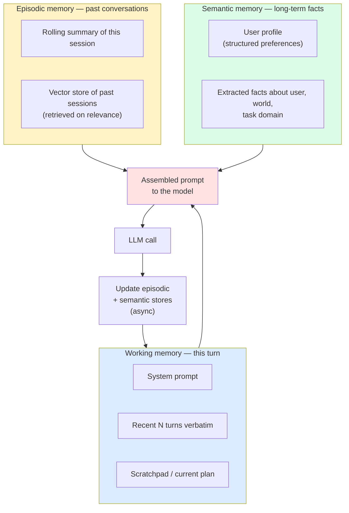
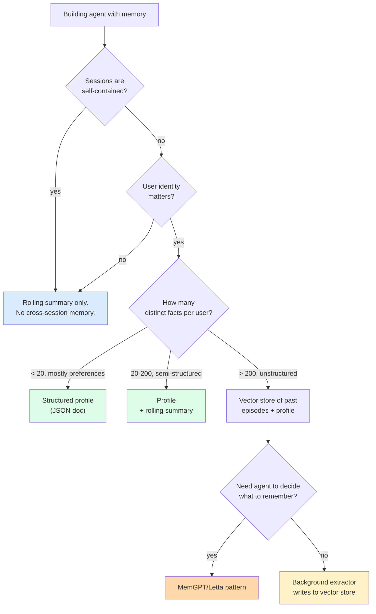
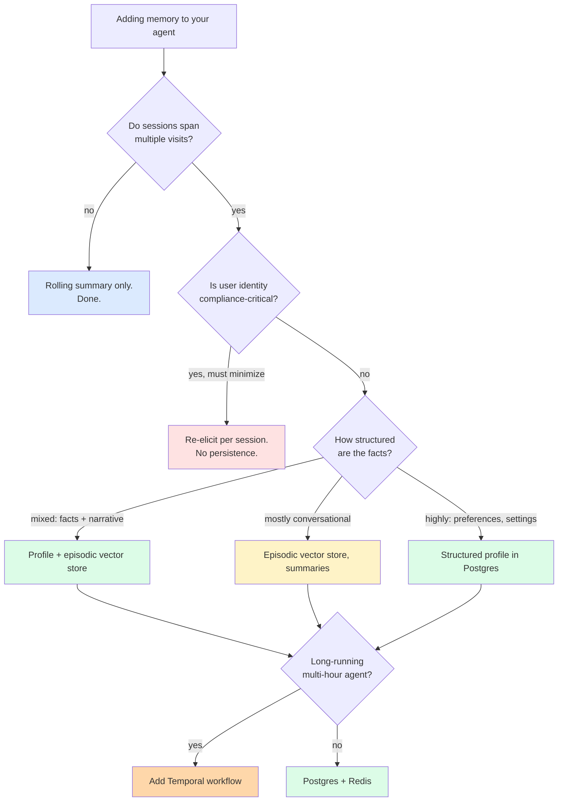

import { Callout } from 'fumadocs-ui/components/callout';

<Callout type="warn" title="TL;DR">
Agents have three memories: **working** (this turn's prompt), **episodic** (past conversations), **semantic** (long-term facts). Naive "stuff all history in context" fails on cost, latency, window size, and lost-in-the-middle. The default pattern: **rolling summary + structured fact extraction + vector store of past conversations + per-user profile doc, all assembled into the prompt at request time**. For long-running agents, persist state to Postgres or Redis (or Temporal for workflows), keyed by `user_id` / `session_id`. Redact PII before storing, and have a path to forget a user on request — GDPR is not optional.
</Callout>

## The problem this solves

Your agent worked great in the demo: one user, one session, ten turns, everything in context. Then you shipped it.

Now:

- A user comes back three weeks later and says "continue what we were working on." The model has no idea what they were working on.
- A user mentions their preferences in turn 3 ("I prefer Python over TypeScript"). The model uses TypeScript in turn 47 anyway because turn 3 was summarized out of context.
- A single session goes 200 turns and your prompt is 180K tokens. Latency is awful. Cost is awful. The model can't find anything in the middle of its own conversation.
- Your bill is dominated by the same intro tokens being re-sent on every turn for every user, because you're not caching or persisting anything.
- A user requests their data be deleted under GDPR. You realize you've embedded their utterances into a vector store you can't easily filter.

Each of these is a memory problem with a different shape. The naive answer — "just send the whole conversation history every turn" — fails on **all** of them simultaneously. You need an architecture, not a buffer.

## The core insight

**Memory is what you pass into context, not what the model knows.** The model is stateless. Every request is independent. What looks like "memory" from the user's perspective is your runtime assembling the right pieces — recent turns, distilled facts, retrieved past episodes, a user profile — into each request's prompt.

The job is to get the right facts in front of the model at the right time, without bloating the prompt and without storing data you shouldn't. The three-memory framework — working, episodic, semantic — is borrowed from cognitive science but it maps usefully onto the engineering problem.

## The three kinds of memory



Each memory has a different cost profile, a different retention policy, and a different update mechanism.

### Working memory (this turn's context)

- **What it is:** the system prompt, the tools, the recent N turns, the scratchpad.
- **Lifetime:** one request.
- **Storage:** assembled in-process per request.
- **Trade-off:** every token is paid for on every turn. Big working memory = big bill.

### Episodic memory (past conversations)

- **What it is:** a record of past turns. Either a running text summary of the current session, or a vector store of past sessions retrievable by relevance.
- **Lifetime:** weeks to forever, per your retention policy.
- **Storage:** Postgres + vector index, or a managed memory service (Mem0, Letta).
- **Trade-off:** retrieval has to be precise — pulling in 5 wrong past conversations is worse than pulling in none.

### Semantic memory (durable facts)

- **What it is:** extracted facts. The user's preferred name, language, timezone, technical stack, prior decisions, project state. Stored as structured fields or natural-language assertions.
- **Lifetime:** persistent until the fact is invalidated or the user is forgotten.
- **Storage:** structured doc in Postgres, or natural-language strings in a vector store.
- **Trade-off:** the *cost of being wrong is high* — a stale fact in semantic memory propagates into every future turn. Easier to add than to remove.

## Why "stuff all history in context" fails

The temptation is to just keep appending. It's the simplest possible implementation:

```python
# DON'T (past a few turns)
messages.append(new_user_message)
response = client.messages.create(model=..., messages=messages)
messages.append(response_to_message(response))
```

Four reasons this collapses:

### 1. Context window limits

Even with 200K (Claude Sonnet 4.5) or 1M (Gemini 2.5 Pro) token windows, you hit a wall. A 50-turn conversation with tool outputs can easily blow past 200K. Pushing into the 1M-token regime gets expensive fast (see the table in the Cost section).

### 2. Cost

Input tokens are billed every turn. A 50K-token conversation history costs you 50K input tokens **on every turn** to maintain it. With prompt caching, you can reduce this by 5-10× for the unchanging prefix — but the conversation history changes every turn, so most of it isn't cached.

```
Cost estimate (Claude Opus 4.5, $15/Mtok input):
  - Working memory 5K tokens, 30 turns: $2.25 per session
  - Working memory 50K tokens, 30 turns: $22.50 per session
  - Working memory 150K tokens, 30 turns: $67.50 per session

10K sessions/day at the third tier = $675K/month just on input.
```

### 3. Latency

Time-to-first-token scales with input length. A 5K prompt has TTFT of ~300ms on Claude Opus; a 100K prompt has TTFT of 2-3s. For chat UX, this is the difference between snappy and broken.

### 4. Lost in the middle

[Liu et al., 2023](https://arxiv.org/abs/2307.03172) showed that LLMs reliably recall information at the start and end of long contexts, but much worse from the middle. Your important fact from turn 7 of a 50-turn conversation is in a section the model effectively can't see anymore. The model literally "forgets."

The fix to all four is to **maintain the conversation outside of working memory** and retrieve only what's relevant each turn.

## Strategy 1: rolling summary

Maintain a running summary of the conversation. Each turn, update it. Use the summary instead of (or in addition to) the raw history.

```python
def update_summary(prior_summary: str, new_exchange: list) -> str:
    """Distill prior_summary + new_exchange into an updated summary."""
    prompt = f"""You are maintaining a running summary of an ongoing conversation.

Prior summary:
{prior_summary or '(no prior summary; this is the start of the conversation)'}

New exchange (most recent user message and assistant response):
{json.dumps(new_exchange)}

Produce an updated summary. Preserve:
- The user's original goal.
- Key decisions made.
- Facts the user has stated about themselves (preferences, names, contexts).
- Open questions or pending actions.

Don't preserve:
- Verbose tool outputs.
- Intermediate reasoning.
- Polite acknowledgments.

Cap the summary at 1000 tokens.
"""
    resp = client.messages.create(
        model="claude-haiku-4-5",   # cheap model is fine for summarization
        max_tokens=1500,
        messages=[{"role": "user", "content": prompt}],
    )
    return resp.content[0].text
```

At request time:

```python
system_with_summary = f"{base_system}\n\nConversation summary so far:\n{summary}"
recent_turns = messages[-6:]   # verbatim last 3 exchanges
response = client.messages.create(
    system=system_with_summary,
    messages=recent_turns,
)
```

**Pros:** simple, bounded prompt size, easy to debug.
**Cons:** summarization loses information — anything the summarizer judged unimportant is gone. The summarizer can be wrong.
**When to use:** chat agents with relatively short individual sessions where most context is in the recent few turns.

## Strategy 2: structured fact extraction (distillation)

A summary is unstructured prose. A **distilled fact set** is structured data. Each turn, extract any new facts the user revealed and store them in a structured doc.

```python
EXTRACTION_PROMPT = """Extract any new durable facts about the user from this exchange.

Existing facts:
{existing_facts}

Latest exchange:
{exchange}

Reply with a JSON object like:
{{
  "new_facts": [{{"category": "...", "fact": "..."}}],
  "updated_facts": [{{"category": "...", "old": "...", "new": "..."}}],
  "no_change": true|false
}}

Categories include: name, role, technical_stack, preferences, current_project, timezone, language.
Only include facts the user explicitly stated or strongly implied. Do not speculate.
"""
```

The fact store becomes a structured doc:

```python
user_facts = {
    "name": "Jane",
    "role": "Senior backend engineer at Acme",
    "technical_stack": ["Python", "Postgres", "AWS"],
    "preferences": ["concise code answers", "no unnecessary comments"],
    "current_project": "Migrating monolith to microservices",
    "timezone": "America/Los_Angeles",
}
```

Prepend it to every request:

```python
profile_text = "Known about user:\n" + "\n".join(f"- {k}: {v}" for k, v in user_facts.items())
system = base_system + "\n\n" + profile_text
```

**Pros:** the model sees a stable, easily-auditable profile. Easy to expose to the user ("here's what I remember about you"). Easy to GDPR-delete.
**Cons:** extraction can be wrong. Structure constrains expressiveness — some facts don't fit a category.
**When to use:** personal-assistant-style agents where user preferences matter across many sessions. The pattern Mem0 and Letta both implement, with their own ontologies.

## Strategy 3: vector store memory (episodic retrieval)

Treat every past conversation turn (or summary) as a document. Embed it. Store it in a vector DB keyed by `user_id`. At request time, retrieve the top-K most relevant past turns based on the current user query.

```python
# Storage (after each turn or at session end)
embedding = embed(exchange_summary)
vector_db.upsert({
    "id": f"{user_id}-{session_id}-{turn_idx}",
    "user_id": user_id,
    "embedding": embedding,
    "text": exchange_summary,
    "metadata": {"timestamp": now(), "session_id": session_id},
})

# Retrieval (at the start of a new turn)
query_embed = embed(current_user_message)
hits = vector_db.query(
    embedding=query_embed,
    filter={"user_id": user_id},
    top_k=5,
)
retrieved_episodes = "\n\n".join(h["text"] for h in hits)

system = base_system + "\n\nRelevant past conversations:\n" + retrieved_episodes
```

**Pros:** scales to thousands of past sessions per user. RAG-style relevance retrieval means the model only sees what matters.
**Cons:** retrieval can pull wrong / outdated episodes. Vector store is now critical infrastructure. PII implications are serious.
**When to use:** agents with long-lived per-user state across many sessions — customer-support agents that remember prior tickets, coding assistants that remember prior architectural decisions, companion-style apps.

## Strategy 4: MemGPT-style virtual context (Letta)

[MemGPT (Packer et al., 2023)](https://arxiv.org/abs/2310.08560) — now the [Letta](https://www.letta.com) framework — treats context like RAM and external storage like disk. The model has tools to **page memory in and out** of its working context.

The pattern:

- **Core memory** (always in context): a small structured block — user profile, current goal.
- **Recall memory** (paged in on demand): a vector store of past conversations, retrieved via a `recall_memory_search` tool.
- **Archival memory** (paged in on demand): a large vector store of arbitrary documents the agent has saved, retrieved via `archival_memory_search`.

The model itself decides when to search recall or archival memory — these are just tools in its toolset. When working memory gets too large, the model is prompted to **summarize** old turns into core memory and drop them.

This is a clever generalization. It pushes memory management into the model's tool choices. Letta's implementation handles the orchestration (when to compact, how to embed, how to retrieve) so you write higher-level agent code.

**When to use:** long-running agents where you genuinely want the agent to decide what to remember. The flexibility is real but the operational complexity is higher than the simpler patterns above.

## When to use which (decision rule)



## A full memory layer in Python

Putting it together. A memory layer that does rolling summarization, structured fact extraction, vector-store episodic retrieval, and prompt assembly. Designed to be the entire memory layer for a chat agent, sitting between your API and the LLM call.

```python
import anthropic, json, os
from dataclasses import dataclass, field, asdict
from typing import Optional
from datetime import datetime
import psycopg2
from psycopg2.extras import Json
# Assume `embed(text) -> list[float]` and `vector_db` (any vector DB client) are available.

client = anthropic.Anthropic()

@dataclass
class UserProfile:
    user_id: str
    name: Optional[str] = None
    role: Optional[str] = None
    timezone: Optional[str] = None
    preferences: list[str] = field(default_factory=list)
    technical_stack: list[str] = field(default_factory=list)
    current_project: Optional[str] = None

@dataclass
class SessionState:
    session_id: str
    user_id: str
    rolling_summary: str = ""
    recent_turns: list[dict] = field(default_factory=list)   # last 6 verbatim turns

def load_profile(conn, user_id: str) -> UserProfile:
    with conn.cursor() as cur:
        cur.execute("SELECT data FROM user_profiles WHERE user_id = %s", (user_id,))
        row = cur.fetchone()
        if not row:
            return UserProfile(user_id=user_id)
        return UserProfile(**row[0])

def save_profile(conn, profile: UserProfile):
    with conn.cursor() as cur:
        cur.execute(
            "INSERT INTO user_profiles (user_id, data, updated_at) VALUES (%s, %s, NOW()) "
            "ON CONFLICT (user_id) DO UPDATE SET data = EXCLUDED.data, updated_at = NOW()",
            (profile.user_id, Json(asdict(profile))),
        )
        conn.commit()

def load_session(conn, session_id: str) -> Optional[SessionState]:
    with conn.cursor() as cur:
        cur.execute("SELECT user_id, data FROM sessions WHERE session_id = %s", (session_id,))
        row = cur.fetchone()
        if not row:
            return None
        user_id, data = row
        return SessionState(session_id=session_id, user_id=user_id, **data)

def save_session(conn, state: SessionState):
    payload = {"rolling_summary": state.rolling_summary, "recent_turns": state.recent_turns}
    with conn.cursor() as cur:
        cur.execute(
            "INSERT INTO sessions (session_id, user_id, data, updated_at) VALUES (%s, %s, %s, NOW()) "
            "ON CONFLICT (session_id) DO UPDATE SET data = EXCLUDED.data, updated_at = NOW()",
            (state.session_id, state.user_id, Json(payload)),
        )
        conn.commit()

# ----- PII redaction (run BEFORE storing) -----
import re
PII_PATTERNS = [
    (re.compile(r"\b\d{3}-\d{2}-\d{4}\b"), "[SSN_REDACTED]"),
    (re.compile(r"\b\d{16}\b"), "[CC_REDACTED]"),
    (re.compile(r"\b[\w._%+-]+@[\w.-]+\.[A-Z]{2,}\b", re.I), "[EMAIL_REDACTED]"),
    (re.compile(r"\b\+?1?\d{10,11}\b"), "[PHONE_REDACTED]"),
]
def redact_pii(text: str) -> str:
    for pat, repl in PII_PATTERNS:
        text = pat.sub(repl, text)
    return text

# ----- Fact extraction (run async after each turn) -----
def extract_facts(profile: UserProfile, exchange: list[dict]) -> UserProfile:
    prompt = f"""Extract any new durable facts about the user from this exchange.

Existing profile (JSON):
{json.dumps(asdict(profile), indent=2)}

Latest exchange:
{json.dumps(exchange, indent=2)}

Reply with a JSON object matching this schema:
{{
  "updates": {{
    "name": "...", "role": "...", "timezone": "...",
    "preferences_to_add": ["..."], "preferences_to_remove": ["..."],
    "technical_stack_to_add": ["..."], "technical_stack_to_remove": ["..."],
    "current_project": "..."
  }}
}}

Only include keys with new information. Do not speculate beyond what the user explicitly stated.
"""
    resp = client.messages.create(
        model="claude-haiku-4-5",
        max_tokens=800,
        messages=[{"role": "user", "content": prompt}],
    )
    try:
        updates = json.loads(resp.content[0].text)["updates"]
    except Exception:
        return profile
    if "name" in updates: profile.name = updates["name"]
    if "role" in updates: profile.role = updates["role"]
    if "timezone" in updates: profile.timezone = updates["timezone"]
    if "current_project" in updates: profile.current_project = updates["current_project"]
    profile.preferences = list(set(profile.preferences + updates.get("preferences_to_add", []))
                               - set(updates.get("preferences_to_remove", [])))
    profile.technical_stack = list(set(profile.technical_stack + updates.get("technical_stack_to_add", []))
                                   - set(updates.get("technical_stack_to_remove", [])))
    return profile

# ----- Rolling summary update -----
def update_summary(prior_summary: str, new_exchange: list[dict]) -> str:
    prompt = f"""Update this running summary of a conversation.

Prior summary:
{prior_summary or '(none — this is the start)'}

New exchange:
{json.dumps(new_exchange, indent=2)}

Produce a new summary capped at 800 tokens. Preserve goals, decisions, and open questions. Drop verbose tool outputs."""
    resp = client.messages.create(
        model="claude-haiku-4-5",
        max_tokens=1200,
        messages=[{"role": "user", "content": prompt}],
    )
    return resp.content[0].text

# ----- Episodic retrieval -----
def retrieve_past_episodes(user_id: str, query: str, k: int = 3) -> list[str]:
    q_emb = embed(query)
    hits = vector_db.query(embedding=q_emb, filter={"user_id": user_id}, top_k=k)
    return [h["text"] for h in hits]

def store_episode(user_id: str, session_id: str, summary: str):
    text = redact_pii(summary)
    vector_db.upsert({
        "id": f"{user_id}-{session_id}-{datetime.utcnow().isoformat()}",
        "user_id": user_id,
        "embedding": embed(text),
        "text": text,
        "metadata": {"session_id": session_id, "ts": datetime.utcnow().isoformat()},
    })

# ----- The assembly step: build the prompt for the next turn -----
def assemble_prompt(profile: UserProfile, state: SessionState, user_message: str) -> tuple[str, list[dict]]:
    profile_block = "Known about user:\n" + "\n".join(
        f"- {k}: {v}" for k, v in asdict(profile).items() if v and k != "user_id"
    )
    past_episodes = retrieve_past_episodes(profile.user_id, user_message, k=3)
    episodes_block = ""
    if past_episodes:
        episodes_block = "Relevant past conversations:\n" + "\n---\n".join(past_episodes)

    summary_block = ""
    if state.rolling_summary:
        summary_block = f"This session so far:\n{state.rolling_summary}"

    system = "\n\n".join([
        "You are a helpful assistant. Use the user profile and past context to personalize your responses.",
        profile_block,
        episodes_block,
        summary_block,
    ])

    messages = state.recent_turns + [{"role": "user", "content": user_message}]
    return system, messages

# ----- The full per-turn flow -----
def handle_turn(conn, user_id: str, session_id: str, user_message: str) -> str:
    profile = load_profile(conn, user_id)
    state = load_session(conn, session_id) or SessionState(session_id=session_id, user_id=user_id)

    system, messages = assemble_prompt(profile, state, user_message)
    resp = client.messages.create(
        model="claude-opus-4-5",
        max_tokens=2048,
        system=system,
        messages=messages,
    )
    assistant_text = "".join(b.text for b in resp.content if b.type == "text")

    # Update working memory (recent_turns), bounded
    state.recent_turns.append({"role": "user", "content": user_message})
    state.recent_turns.append({"role": "assistant", "content": assistant_text})
    if len(state.recent_turns) > 6:
        # Spill older turns into the rolling summary
        spilled = state.recent_turns[:-6]
        state.rolling_summary = update_summary(state.rolling_summary, spilled)
        state.recent_turns = state.recent_turns[-6:]

    save_session(conn, state)

    # Async: extract new facts, store episode (do these on a worker, not in the request path)
    new_exchange = [{"role": "user", "content": user_message}, {"role": "assistant", "content": assistant_text}]
    updated_profile = extract_facts(profile, new_exchange)
    save_profile(conn, updated_profile)
    store_episode(user_id, session_id, redact_pii(f"User: {user_message}\nAssistant: {assistant_text}"))

    return assistant_text
```

What this gives you:

- **Bounded working memory.** `recent_turns` is capped at 6; everything older gets summarized.
- **Per-user profile.** Structured, durable, inspectable.
- **Episodic memory.** Embeddings of past summaries, retrieved by relevance.
- **PII redaction at the storage boundary.** Stops the SSN-in-vector-DB problem before it starts.
- **Async updates.** The extraction and episodic storage steps should run on a worker queue, not in the request path — they add 500ms-1s and the user shouldn't wait for them.

What this is missing (left as exercises):

- A user-facing "what do you remember about me?" view that surfaces the profile.
- A `DELETE` endpoint that removes the profile, all sessions, and all episodes for a `user_id` — the GDPR right-to-be-forgotten.
- A retention policy that ages out old episodes after N days.
- Versioning of the profile schema (you *will* change fields).
- Conflict resolution when concurrent requests update the profile (advisory locks or last-writer-wins with timestamps).

## Privacy: the part you can't skip

Once you're storing anything cross-session, you're a data controller under GDPR / CCPA / equivalent. Three concrete obligations:

### 1. Redact PII before storing

Run `redact_pii` (or a more sophisticated [Presidio-based](https://github.com/microsoft/presidio) pipeline) **before** the text touches your vector DB or summary store. Once an embedding has been computed over an SSN, that SSN is effectively in the embedding (and the original text is usually stored alongside for citation).

Standard redactions: SSN, credit card, phone, email, full physical address, government IDs. Domain-specific redactions for medical IDs, account numbers, etc.

### 2. Right to be forgotten

The GDPR right-to-erasure (Art. 17) means a user can request all their data be deleted. For an agent system that means:

```python
def forget_user(conn, user_id: str):
    with conn.cursor() as cur:
        cur.execute("DELETE FROM user_profiles WHERE user_id = %s", (user_id,))
        cur.execute("DELETE FROM sessions WHERE user_id = %s", (user_id,))
        conn.commit()
    vector_db.delete(filter={"user_id": user_id})
    # Also: search your logs, prompt-cache, fine-tuning datasets, eval sets.
```

The vector DB part is the tricky one. Pinecone, Weaviate, Qdrant all support metadata-filtered delete; make sure you've keyed everything by `user_id`. Cloud LLM providers cache prompts and log requests — check your provider's retention policy and request a per-user purge if you've sent the user's data to them. Anthropic and OpenAI both offer zero-data-retention options for enterprise tiers.

### 3. Don't store what you don't need

The cheapest privacy mitigation is **not collecting the data in the first place**. If your agent doesn't actually need to remember a user's home address, don't extract it into the profile. The fact extractor should have an explicit allow-list, not a permissive "extract anything interesting" prompt.

## State persistence for long-running agents

Chat agents persist between turns (minutes apart). Long-running agents persist across **hours** of execution — they're checking on a deploy, monitoring a build, doing overnight research. These need durable state, not just memory.

### Postgres + Redis (the boring default)

- **Postgres** for session state, profiles, episodic store metadata. JSONB columns work well.
- **Redis** for ephemeral working memory and pub-sub between worker processes.
- **Vector DB** for embeddings.

Three storage backends, all boring, all production-tested. Don't overthink it.

### Temporal (when the agent is a workflow)

If your agent is a long-running, durable, possibly-multi-hour workflow with checkpointing and replay (a code-deployment agent, a customer-onboarding agent), [Temporal](https://temporal.io) is the right primitive. Temporal workflows survive process restarts; your agent code can `await` a 4-hour sleep and pick back up where it left off when the process comes back.

```python
# Temporal-style pseudocode
@workflow.defn
class DeploymentAgent:
    @workflow.run
    async def run(self, task: str):
        plan = await workflow.execute_activity(generate_plan, task)
        for step in plan.steps:
            result = await workflow.execute_activity(execute_step, step)
            if not result.ok:
                # The workflow durably waits for human approval
                approval = await workflow.wait_condition(lambda: self.approval is not None)
                if not approval.approved:
                    return "ESCALATED"
        return "DONE"
```

The Temporal worker can restart, redeploy, scale out — the workflow state survives. The activities (each LLM call, each tool execution) are the units of retry. This is overkill for chat agents; it's exactly right for agents that look like background jobs.

### Checkpointing tradeoffs

Decide:

- **What survives:** which fields, which message history.
- **How often:** every turn? Every N seconds? At explicit checkpoints?
- **Serialization format:** JSON in Postgres is easy; Protobuf is fast; raw pickle is a trap (versioning issues).
- **Recovery semantics:** if the agent process dies mid-tool-call, what happens on recovery? Replay the tool? Skip and continue? Ask the user?

These are the same questions you'd ask for any stateful service. The "agent" part doesn't change them.

## Pitfalls

### Pitfall 1: storing the user's question verbatim in semantic memory

The user said "my email is jane@acme.com and my SSN is 123-45-6789, please look me up." Your extractor stores `{"name": "Jane", "email": "[EMAIL_REDACTED]"}` — good. But your vector store also got the embedding of the raw question, and the raw question is in your logs. Redact *before* embedding, *before* logging, *before* anything else.

### Pitfall 2: the stale-fact problem

Three months ago the user said "I'm working on Project Athena." You stored `current_project: "Project Athena"` in the profile. They've since moved on. Now every response references Project Athena. **Add timestamps to facts** and decay confidence over time. Or have the model explicitly verify ("Are you still working on Project Athena?") at session start when a fact is more than N days old.

### Pitfall 3: retrieval pulling wrong past sessions

Your episodic vector store does a cosine-similarity lookup. The user asks "how do I deploy?" — you retrieve a deploy conversation from 6 months ago about a completely different system. The model uses it and gives a stale answer. Filter by recency, filter by project / context tags, and **always show retrieved context to the model with timestamps** so it can discount old material.

### Pitfall 4: synchronous extraction in the request path

Extracting facts after every turn costs an extra LLM call (~$0.001-0.01 depending on model). If you do it in the request path, you add 500ms-1s to user-facing latency. **Push it to a worker queue** (SQS, Pub/Sub, Cloud Tasks) and update profile asynchronously. The next turn's profile will be one turn behind, which is fine.

### Pitfall 5: profile JSON growing unbounded

The model extracts a new "preference" every turn. After 100 sessions, the profile has 500 preferences, half contradictory. **Cap profile fields** (max 20 preferences, oldest evicted), and have a periodic consolidation step that compresses the profile into a shorter, deduplicated form.

### Pitfall 6: forgetting the GDPR delete path

You shipped the memory feature, but you didn't ship the corresponding delete API. A user requests deletion, you scramble. **Build deletion at the same time you build storage**, and exercise it in tests. Every storage backend has its own delete pattern; you want to know they all work before you're under a 30-day GDPR deadline.

### Pitfall 7: not testing memory with concurrent sessions

The same user opens two browser tabs and chats in both simultaneously. Both sessions extract facts and update the profile. Without locking or last-writer-wins with version vectors, you get lost updates. Use Postgres advisory locks per `user_id`, or version the profile and reject stale writes.

## Complexity and cost

| Strategy | Per-turn extra cost | Storage cost / user / mo | Latency overhead | When to use |
|---|---|---|---|---|
| Stuff history in context | 0 (just bigger prompt) | 0 | Big — TTFT scales with input | Never past 20-30 turns. |
| Rolling summary | ~$0.001 (Haiku summary) | Negligible | None (async) | Default for chat agents. |
| Structured fact extraction | ~$0.002 (Haiku extraction) | ~1 KB | None (async) | Personal-assistant style. |
| Profile + summary | ~$0.003 | ~1-2 KB | None (async) | Most production chat. |
| Vector store episodic memory | ~$0.001 per turn (embedding) | $0.01-0.10 (vector store + metadata) | ~50-200ms (retrieval) | Long-lived per-user agents. |
| MemGPT/Letta | Higher (model controls memory) | Similar | Higher (more turns) | When agent autonomy in memory matters. |
| Temporal-backed durable state | Workflow overhead | Workflow event history | Activity overhead | Long-running, possibly multi-hour agents. |

Concrete budgeting for 10K users / 30 turns / month with the "profile + summary + vector store" pattern:

- Summarization + extraction cost: ~$0.003 × 30 × 10K = **$900/month**.
- Embedding cost (OpenAI text-embedding-3-small at $0.02/Mtok, ~200 tokens / episode): ~$1.20/month for embeddings.
- Vector DB storage (Pinecone serverless or Qdrant cloud, ~30 episodes × 10K users × ~3KB each = ~1 GB): ~$50-100/month.
- Postgres: a few dollars.

Compared to the savings from *not* sending 50K tokens of history on every turn — easily $5K-50K/month at scale — this is a clear win.

## When NOT to add memory

1. **Single-session, anonymous agents.** A "ask the model a one-off question" UI doesn't need cross-session memory. Don't add it.
2. **High-compliance environments where retention is the liability.** Healthcare, legal, finance — if storing user data has regulatory cost, the right move may be no persistence at all. Re-elicit context each session.
3. **The task itself is stateless.** A code-formatter agent. A translation agent. A summarization agent. Memory adds nothing.

## Decision rule



## Real-world stacks

- **ChatGPT memory** (introduced 2024): user-facing structured memory — the model extracts facts, the user can view and delete them. Implementation is closed but the surface area matches the "profile + episodic" pattern. Critically, OpenAI gives the user direct UI control over what's stored.
- **Claude's projects / memory features**: per-project knowledge that's prepended to every conversation in that project, plus more recent personal preferences memory. Project knowledge is essentially a long-lived profile / scratchpad scoped to a workspace.
- **Cursor's `.cursorrules` and project-scoped memory**: the project carries persistent rules and context, but per-user cross-project memory is intentionally limited — the threat model of "I don't want my personal preferences leaking into work I do for a client" matters in dev tools.
- **Mem0** ([mem0.ai](https://mem0.ai)): a managed memory layer with extraction, vector storage, and retrieval baked in. Reports significant token savings over naive history-stuffing — they cite 90%+ token reduction in their benchmarks against full-history baselines. Use when you want the pattern without building it.
- **Letta** (formerly MemGPT — [letta.com](https://letta.com)): productionized the MemGPT virtual-context idea. The agent has tools to manage its own memory. Good fit when you want the agent to *decide* what to remember, less good when you want strict control over what's stored.
- **LangChain memory abstractions**: `ConversationBufferWindowMemory`, `ConversationSummaryMemory`, `VectorStoreRetrieverMemory`. The categories match the patterns above; the abstractions are leaky and you'll often want to write the layer yourself once you're past prototyping.
- **Devin** (Cognition): persistent VM state per task. Memory of "what I've done" is encoded in the file system of the VM — files written, commits made, terminal scrollback. A different memory model entirely, viable because the agent has a long-running compute substrate.
- **OpenAI Operator**: each task is a fresh session by default — limited cross-task memory, which matches the security model of "this agent operates your browser, don't let it accumulate state that bridges across user accounts."
- **Anthropic computer use** demos: stateless per task; the operator (you, calling the API) is responsible for any cross-task state. The reference implementation is a thin script over the API.

## Curated questions to practice

1. Your chat agent has 30-turn average sessions. You're sending 80K input tokens per turn (mostly cached intro, plus full history). What three changes would cut your input bill by 5× without hurting quality?
2. A user says "use my favorite framework" in turn 3. The extractor stores `preferred_framework: "Django"` in their profile. Six months later, they switch jobs and now use Rails. They mention it but the agent keeps suggesting Django code. How do you fix this — at the extractor, at the profile schema, or at the prompt-assembly step?
3. Your vector store has 50M embeddings across 500K users. A user requests deletion. List every place their data could live, and the API you'd call to purge each.
4. You're considering MemGPT/Letta vs a rolling-summary-plus-profile pattern. The Letta demo is impressive. What three production concerns would push you toward the simpler pattern despite Letta's elegance?
5. Your agent runs for 4 hours per task (an overnight code-review job). The process restarts every 1 hour for deploys. Sketch a state-persistence layer that lets the job survive restarts without re-doing completed work.

## Quick-reference card

| Question | Answer |
|---|---|
| **Default for short chat sessions?** | Rolling summary + recent 6 turns. |
| **Default for cross-session personal agent?** | Profile (structured) + rolling summary + episodic vector store. |
| **When to use MemGPT/Letta?** | When the agent should decide what to remember. |
| **When to use Temporal?** | Long-running, multi-hour agents with checkpointing needs. |
| **Where to do extraction & summarization?** | Async worker, not request path. |
| **PII redaction — when?** | Before storage, before embedding, before logging. |
| **GDPR delete — when?** | Build it the same day you build storage. |
| **How big is "recent turns" working memory?** | 4-8 turns verbatim; older turns into summary. |
| **Killer pitfall #1** | Stale facts (no timestamps, no decay). |
| **Killer pitfall #2** | Storing PII you don't need. |
| **Killer pitfall #3** | No GDPR delete path. |
| **Killer pitfall #4** | Synchronous extraction blocking the response. |
| **What to read next** | [Eval & observability](/ai/eval) |

---

> Next page: [Eval & observability](/ai/eval) — once your agent works on the happy path, how do you keep it working as you change prompts, swap models, and add tools? Golden sets, LLM-as-judge, traces, regression suites.
