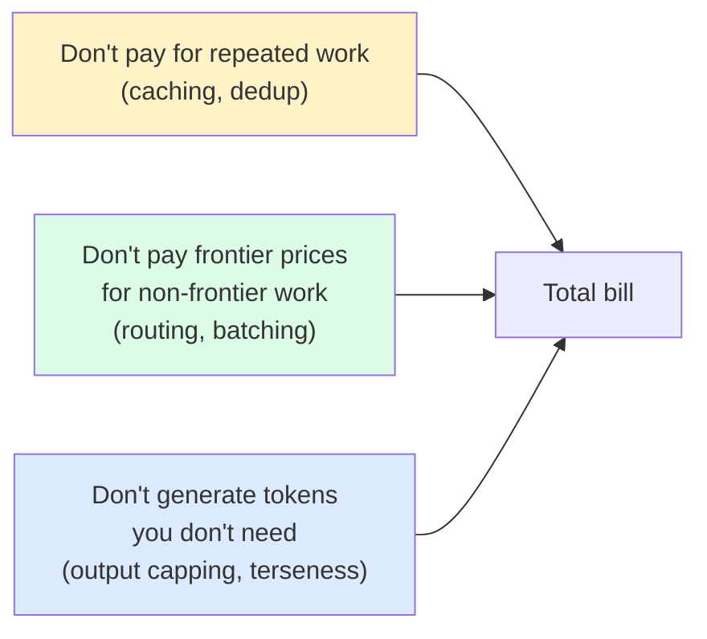
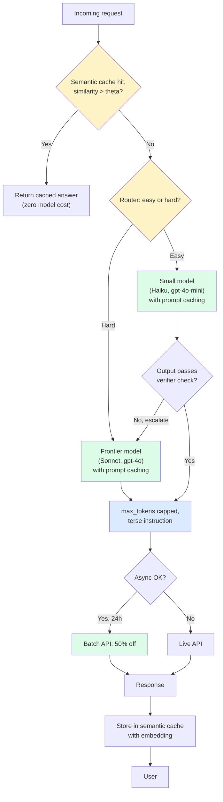
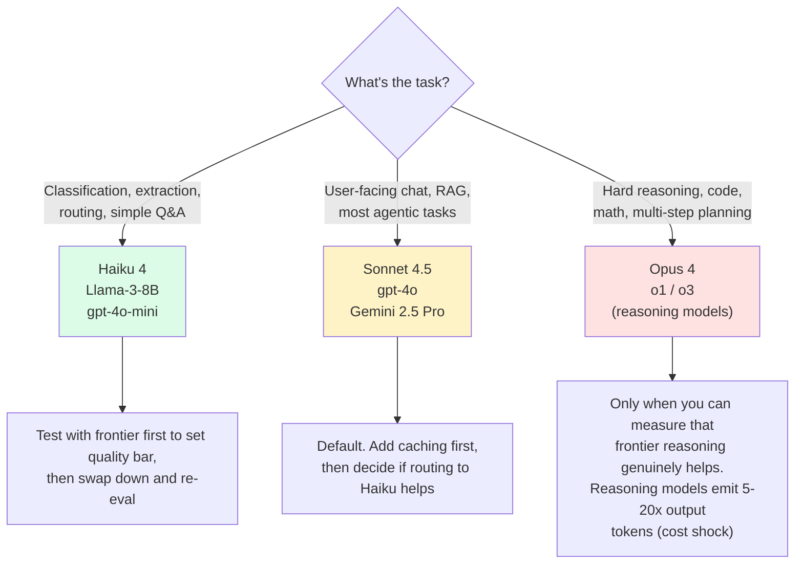
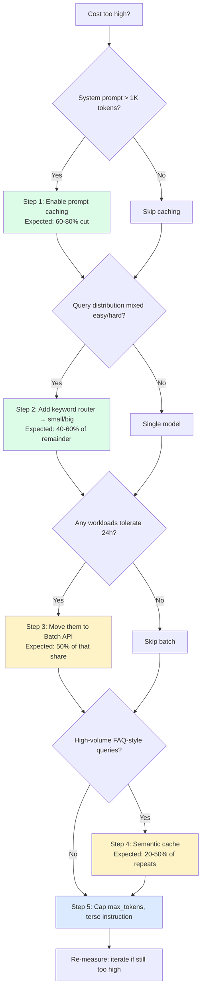

import { Callout } from 'fumadocs-ui/components/callout';

<Callout type="warn" title="TL;DR">
**Caching first** — enable Anthropic/OpenAI/Gemini prompt caching on any system prompt over 1K tokens; this is a 60-80% bill cut from a config change. **Then route** — small models for easy queries (classification, extraction, routing), big models only for hard ones; another 40-60% off. **Then batch** — anything tolerant of 24-hour latency goes through the Batch API at 50% off. **Then semantic-cache** — common queries return cached answers without a model call at all. **Then cap output** — `max_tokens` tight, "be concise" in the prompt, structured output that fails fast. Done in that order, a typical $100K/month bill turns into $8-15K/month with no quality regression.
</Callout>

## The problem this solves

You have an LLM workload that works. The bill is too high. You need to cut it 5-10× without breaking anything that the user can see.

That sentence describes 90% of the cost-engineering work at every company shipping LLMs in production. The techniques to actually do it are well known, mostly mechanical, and stack multiplicatively. This page is the playbook.

The techniques, in the order you should apply them:

1. **Prompt caching** — frontier model providers will cache your repeated prompt prefix and bill you a fraction of the input rate on cache hits. Largest single lever. Free.
2. **Model routing** — send easy queries to a cheap model, hard queries to an expensive one. Second-largest lever.
3. **Batch APIs** — async workloads get 50% off in exchange for up-to-24-hour latency. Free if your workload tolerates it.
4. **Semantic dedup / caching** — repeated and near-repeated queries return a stored answer without calling the model. Cuts the long tail.
5. **Context pruning** — strip irrelevant retrieved chunks, dedup, drop low-rerank-score hits. Modest but compounds with caching.
6. **Output-side discipline** — `max_tokens` tight, terse-output instructions, structured output. Often the biggest remaining lever once caching is on.

## The core insight

Every LLM cost optimization is one of three primitives:



Everything below is a specific implementation of one of these three primitives. When you're deciding what to do next on a real workload, ask which of the three buckets has the most slack — that's where the next dollar of optimization lives.

## Visual: the full cost-engineering pipeline



This is the architecture every mature LLM platform team converges on. The exact layers vary, but the shape is consistent: cache check → route → cached prefix → cap output → batch when possible → store result.

## Prompt caching in depth

Prompt caching is the single most impactful cost technique. Each provider implements it differently; the rules of thumb below come from production deployments at scale.

### Anthropic prompt caching

Anthropic exposes prompt caching as an explicit `cache_control` breakpoint that you place at one or more positions in your message structure. The cache is keyed on the *exact* token prefix up to and including the breakpoint.

```python
from anthropic import Anthropic

client = Anthropic()

response = client.messages.create(
    model="claude-sonnet-4-5",
    max_tokens=512,
    system=[
        {
            "type": "text",
            "text": LARGE_SYSTEM_PROMPT,  # 12K tokens of instructions + tools
            "cache_control": {"type": "ephemeral"},  # cache this prefix
        }
    ],
    messages=[
        {"role": "user", "content": user_message},
    ],
)
```

**Pricing (Q1 2026):**

| Operation | Cost vs base input rate |
|---|---|
| Cache write (first call, populates cache) | **1.25×** input rate (5-min TTL) or **2×** (1-hour beta) |
| Cache read (subsequent calls, hit) | **0.1×** input rate |
| Output | normal output rate |

**On Sonnet 4.5 ($3/$15):** cache write is $3.75/M, cache read is $0.30/M, output stays at $15/M.

**TTL:** default 5 minutes from last hit. 1-hour TTL available with `cache_control: {"type": "ephemeral", "ttl": "1h"}` (beta, 2× write premium). Cache extends each time it's hit — a busy endpoint keeps the cache warm indefinitely.

**The math for when it pays off:**

For a system prompt of `S` tokens, called `N` times in the cache window:

- **Without caching:** `N × S × $3 / 1M`
- **With caching:** `S × $3.75 / 1M + (N - 1) × S × $0.30 / 1M`

Break-even is at `N = 2` for any prompt size. After that you're saving 90% of the prefix cost on every call. For a 12K-token system prompt called 1000 times: without caching = $36, with caching = $3.69. **90% reduction.**

**Cache-key gotcha:** the cache key is the *exact byte sequence* of the prefix. Any change — a new timestamp in the system prompt, a different tool order, a swap of two messages — invalidates the cache. Most production failures of Anthropic caching come from inadvertent prefix mutation. Common offenders:

- `datetime.now().isoformat()` in the system prompt header.
- Tool definitions serialized in non-deterministic dict order.
- Per-user variables sprinkled into the system prompt instead of the user message.
- A/B-test variant strings injected at random positions.

The fix is mechanical: log the prefix hash and alert on hit-rate drops. Helicone, LangSmith, and Anthropic's own cache hit metrics in the response (`cache_creation_input_tokens` and `cache_read_input_tokens`) make this trivial.

### OpenAI prompt caching

OpenAI does prompt caching automatically — no `cache_control` headers required. Any prompt prefix of 1024+ tokens is eligible; the API checks for matches against recent traffic on its own.

**Pricing:** cache hits are **50% off** the input rate. No cache-write premium, no explicit TTL (typically 5-10 minutes; longer at off-peak hours).

```python
# Nothing special required — just send the same prefix repeatedly
response = openai.chat.completions.create(
    model="gpt-4o",
    messages=[
        {"role": "system", "content": LARGE_SYSTEM_PROMPT},  # 1024+ tokens
        {"role": "user", "content": user_message},
    ],
)
# Check response.usage.prompt_tokens_details.cached_tokens for hit count
```

**Trade-offs vs Anthropic:** the OpenAI flavor is simpler (no header needed) but the discount is shallower (50% vs 90%). And because the cache is implicit, you have less control over what gets cached. For workloads where the system prompt is shared across many users, OpenAI's discount is good enough. For workloads where you have a smaller pool of repeating prefixes and want maximum savings, Anthropic's explicit caching gives you a deeper discount but demands more discipline.

### Gemini context caching

Gemini takes yet another approach: you create an explicit cache object with an ID and a TTL, then reference it by ID in subsequent calls. Stored data is billed by the *hour*.

```python
from google import genai

client = genai.Client()

cache = client.caches.create(
    model="gemini-2.5-pro",
    config={
        "contents": [LARGE_KNOWLEDGE_BASE_CONTEXT],  # can be huge
        "ttl": "3600s",  # 1 hour
    }
)

response = client.models.generate_content(
    model="gemini-2.5-pro",
    contents=user_message,
    config={"cached_content": cache.name},
)
```

**Pricing:**
- Cache read: **25% of normal input cost** (so 75% discount).
- Cache storage: **$1.00/M tokens/hour** for Gemini 2.5 Pro, $0.25 for Flash.
- Minimum cached content: 1024 tokens for Flash, 4096 for Pro.

**When it pays off:** the storage fee makes the math sensitive to query volume. For a 200K-token cached context on Gemini 2.5 Pro:

- Storage: `200,000 × $1 / 1M = $0.20/hour = $4.80/day`.
- For one query: total cost ~= $5 (mostly storage). Bad deal.
- For 1000 queries in that hour: storage amortized to $0.0002/query, you save ~$0.50/query in input cost. Excellent deal.

**Gemini context caching is the right tool when:** you have a huge persistent context (full code repos, long documents, full knowledge bases) that gets queried frequently. The 1M+ token context window is *only* economical with caching for high-traffic workloads.

### Self-hosted: vLLM and SGLang prefix caching

If you're self-hosting, vLLM's **automatic prefix caching** (`--enable-prefix-caching`) and SGLang's **RadixAttention** both give you the same effect for free: the GPU keeps KV-cache state for repeated prefixes across requests, eliminating prefill compute.

```bash
# vLLM
vllm serve meta-llama/Llama-3.3-70B-Instruct --enable-prefix-caching

# SGLang gets prefix sharing automatically via RadixAttention
python -m sglang.launch_server --model meta-llama/Llama-3.3-70B-Instruct
```

The cost saving here is *latency and GPU time*, not API dollars, but the effect is the same: a 12K-token system prompt that would take 4 seconds of prefill on an H100 now takes ~50ms on a cache hit. See [the KV cache & continuous batching page](/ai/inference/kv-cache-batching) for the underlying mechanics.

### When prompt caching is worth it

You want caching when **all three** of these are true:

1. **The cached prefix is large** — at least 1K tokens (OpenAI minimum) or ideally 4K+ (where the break-even gets dramatic).
2. **The prefix is repeated** — at least 2 calls per cache window (5 min default). Production agent / RAG / chat workloads usually have hundreds.
3. **The prefix is stable** — you control it precisely. No timestamps, no per-user variables in the cached region.

You don't want it when:

- System prompts are short (< 500 tokens) — overhead dominates savings.
- Per-user prefixes — the cache hit rate will be near zero. Move user-specific content out of the cached prefix.
- Heavily dynamic system prompts (e.g. timestamp, session ID, A/B variant injected near the top).

### The cache-key design problem

The single biggest operational issue with prompt caching is **prefix mutation breaking cache hits silently**. Your hit rate drops from 95% to 5%, the bill quietly triples, and no alert fires because nothing crashed.

Architectural fix: design your prompt structure with a clear **cached region** and a clear **dynamic region**, with the cache breakpoint between them.

```python
def build_messages(user_message, user_context):
    # Cached region: everything stable for the lifetime of the deployment
    cached_system = [
        {"type": "text", "text": INSTRUCTIONS,        "cache_control": {"type": "ephemeral"}},
        {"type": "text", "text": TOOL_DEFINITIONS,    "cache_control": {"type": "ephemeral"}},
        {"type": "text", "text": KNOWLEDGE_BASE,      "cache_control": {"type": "ephemeral"}},
    ]
    # Dynamic region: per-user, per-request — never goes into the cached prefix
    dynamic_user = {
        "role": "user",
        "content": f"<context>{user_context}</context>\n\n{user_message}",
    }
    return cached_system, [dynamic_user]
```

Set up an alert: "cache_read_input_tokens / total_input_tokens < 0.7" pages. That single alert catches 90% of cache-regression bugs.

## Model routing in depth

Once caching is in place, the next lever is sending different queries to different models. The cost ratio between the cheapest and most expensive models in any given family is roughly 20-100×. Routing well captures most of that ratio.

### The routing techniques, ranked

#### 1. Keyword / rule routing (always start here)

Cheap, fast, debuggable. A regex on the user message decides the model.

```python
def route_keyword(user_message: str) -> str:
    msg = user_message.lower()
    # Hard signals
    if any(w in msg for w in ["why", "explain", "compare", "design", "architect"]):
        return "claude-sonnet-4-5"
    if any(w in msg for w in ["debug", "stack trace", "exception", "review my code"]):
        return "claude-sonnet-4-5"
    # Easy signals
    if any(w in msg for w in ["what is", "define", "translate", "summarize"]):
        return "claude-haiku-4"
    if len(msg.split()) < 8:  # short questions → small model
        return "claude-haiku-4"
    # Default
    return "claude-sonnet-4-5"
```

**Cost:** 0. **Latency:** ~microseconds. **Quality:** moderate — catches the obvious cases, misses anything ambiguous. Always do this *before* anything fancier; it filters out 30-50% of queries to the cheap path with no overhead.

#### 2. Embedding-similarity routing

Maintain a small labeled set of historical queries tagged "easy" or "hard". Embed the incoming query, find the nearest neighbors, route based on the majority label.

```python
import numpy as np
from sentence_transformers import SentenceTransformer

embedder = SentenceTransformer("all-MiniLM-L6-v2")

# Offline: precompute embeddings for labeled examples
LABELED_QUERIES = [
    ("what's the weather", "easy"),
    ("translate 'hello' to French", "easy"),
    ("explain the trade-offs between async/await and threads", "hard"),
    ("debug this stack trace: ...", "hard"),
    # ~200-1000 labeled examples
]
labeled_embeds = embedder.encode([q for q, _ in LABELED_QUERIES])
labels = [lab for _, lab in LABELED_QUERIES]

def route_embedding(user_message: str, k: int = 5) -> str:
    q = embedder.encode([user_message])[0]
    sims = labeled_embeds @ q / (np.linalg.norm(labeled_embeds, axis=1) * np.linalg.norm(q))
    top_k = np.argsort(sims)[-k:]
    votes = [labels[i] for i in top_k]
    return "claude-haiku-4" if votes.count("easy") > votes.count("hard") else "claude-sonnet-4-5"
```

**Cost:** ~$0.00001 per query (embedding call). **Latency:** ~5-30ms. **Quality:** decent — 85-92% routing accuracy on well-curated label sets. **Maintenance:** you have to keep adding examples as new query types emerge.

#### 3. Dedicated router model

A small fine-tuned classifier (Llama-3-8B, BERT, or even a logistic regression on embeddings) trained on labeled query-difficulty data. RouteLLM (Ong et al, 2024) showed this approach can match GPT-4 quality on routed-to-GPT-4 queries at 50-75% lower cost.

```python
# Conceptual — RouteLLM-style
from routellm.controller import Controller

router = Controller(
    routers=["mf"],  # matrix factorization router
    strong_model="claude-sonnet-4-5",
    weak_model="claude-haiku-4",
)

response = router.chat.completions.create(
    model="router-mf-0.5",  # 50% of queries to strong model
    messages=[{"role": "user", "content": user_message}],
)
```

**Cost:** ~$0.0001-0.0005/query (depending on router size). **Latency:** ~10-50ms. **Quality:** best of the lot when trained on representative data. **Maintenance:** highest — needs labeled training data, periodic retraining, and monitoring.

#### 4. LLM-as-router (cascade)

The simplest "fancy" router: call a cheap model first, ask it to either *answer* or *return ESCALATE*. If it escalates, call the expensive model.

```python
ROUTER_PROMPT = """You are a routing classifier. Read the user's question and decide:
- If it's simple (definition, lookup, basic translation, short factual question), answer it directly.
- If it requires reasoning, code generation, multi-step analysis, or domain expertise,
  respond with exactly "ESCALATE" and nothing else.

User question: {q}"""

def route_cascade(user_message: str) -> str:
    cheap = anthropic.messages.create(
        model="claude-haiku-4",
        max_tokens=200,
        messages=[{"role": "user", "content": ROUTER_PROMPT.format(q=user_message)}],
    )
    answer = cheap.content[0].text
    if "ESCALATE" in answer[:50]:
        big = anthropic.messages.create(
            model="claude-sonnet-4-5",
            max_tokens=1024,
            messages=[{"role": "user", "content": user_message}],
        )
        return big.content[0].text
    return answer
```

**Cost:** small model on every query + big model on ~30% of queries. For a typical workload, this works out to ~30-40% of pure-Sonnet cost. **Latency:** small-model latency for easy queries, sum of both for hard. **Quality:** as good as your prompt makes it; the classic failure mode is the cheap model trying to answer something it shouldn't.

### The classic cascade trap

LLM cascades have an asymmetric failure mode: when the cheap model *thinks* it can handle a hard query, you get a confidently wrong answer that the system ships to the user. The expensive model never sees the query.

Mitigations:

- **Self-consistency check**: have the cheap model answer 3 times with non-zero temperature; only ship if all 3 agree.
- **Verifier model**: a second cheap call grades the first cheap answer for confidence, escalates if low.
- **Schema validation for structured output**: if the cheap model's JSON doesn't validate, escalate.
- **Confidence threshold**: on models that expose logprobs, only ship if mean token logprob is above some θ.

The verifier pattern is what tools like Anyscale's RouteLLM, Martian's router, and Aviary all converge on under the hood.

### When routing breaks

Three failure modes you'll hit in production:

1. **The router itself becomes the cost.** If your router is an LLM call, and your average query is also one LLM call, you've doubled the per-query call count. Routing only saves money if the router is significantly cheaper than the savings it generates. Rule of thumb: router cost ≤ 10% of expected savings.

2. **Drift kills routing accuracy.** Query distributions shift over weeks. A router trained on Q3 data degrades 5-15% by Q1. Re-evaluate routers monthly.

3. **The router becomes a quality risk.** A bad routing decision sends a hard query to the cheap model and produces a wrong answer. Always measure end-to-end task quality (not just routing accuracy) when introducing or changing a router. See [LLM-as-judge](/ai/eval/llm-as-judge) for the eval harness.

## Batching for 50% off

If your workload doesn't need real-time responses, the batch APIs are 50% off and require zero quality compromise. Both Anthropic and OpenAI offer them.

### Anthropic Message Batches

```python
from anthropic import Anthropic

client = Anthropic()

batch = client.messages.batches.create(
    requests=[
        {
            "custom_id": f"req-{i}",
            "params": {
                "model": "claude-sonnet-4-5",
                "max_tokens": 1024,
                "messages": [{"role": "user", "content": prompt}],
            },
        }
        for i, prompt in enumerate(prompts)
    ]
)
# Batch completes within 24 hours, often much faster
# Pricing: 50% off the live API rate
```

### OpenAI Batch API

```python
# Upload a JSONL file, create a batch, poll for completion
batch_input = client.files.create(
    file=open("batch_requests.jsonl", "rb"),
    purpose="batch"
)
batch = client.batches.create(
    input_file_id=batch_input.id,
    endpoint="/v1/chat/completions",
    completion_window="24h",
)
# Pricing: 50% off live API
```

### When batching wins

Use the Batch API for anything where the user doesn't need a synchronous response:

- **Eval runs** — running 10K test prompts through the model. Always batch.
- **Content generation pipelines** — generating product descriptions, blog summaries, email drafts overnight.
- **Backfill jobs** — re-tagging or re-summarizing historical data.
- **Embedding generation** for indexing — though embeddings are usually cheap enough that this matters less.
- **Periodic report generation** — weekly summaries, daily digests.

A real example from a production team: their content-moderation classifier processed 8M items/day on the live API at $15K/month. Moving to a 6-hour batch window dropped it to $7.5K/month with no user-visible impact. That's a 50% cut from a single config change.

### When batching loses

- Anything in the user's interactive loop.
- Anything where 24h SLA isn't acceptable for stragglers.
- Workloads where you need to see the output to decide what to ask next (i.e., agents).

## Semantic dedup / semantic caching

The next layer is **never calling the model when a previous answer is good enough**. The mechanism is a vector cache: embed the incoming query, look up in a cache keyed by query embedding, return the cached answer if similarity > θ.

```python
import numpy as np
from sentence_transformers import SentenceTransformer

embedder = SentenceTransformer("all-MiniLM-L6-v2")

class SemanticCache:
    def __init__(self, threshold: float = 0.95, max_size: int = 10_000):
        self.threshold = threshold
        self.max_size = max_size
        self.embeddings = []  # list of np arrays
        self.answers = []     # parallel list of cached responses
        self.timestamps = []  # for TTL eviction

    def get(self, query: str, ttl_seconds: int = 3600) -> str | None:
        if not self.embeddings:
            return None
        q = embedder.encode([query])[0]
        embeds = np.array(self.embeddings)
        sims = embeds @ q / (np.linalg.norm(embeds, axis=1) * np.linalg.norm(q))
        best = int(np.argmax(sims))
        if sims[best] >= self.threshold:
            now = time.time()
            if now - self.timestamps[best] < ttl_seconds:
                return self.answers[best]
        return None

    def put(self, query: str, answer: str):
        q = embedder.encode([query])[0]
        self.embeddings.append(q)
        self.answers.append(answer)
        self.timestamps.append(time.time())
        if len(self.embeddings) > self.max_size:
            # Evict oldest
            self.embeddings.pop(0)
            self.answers.pop(0)
            self.timestamps.pop(0)
```

In production you'd put this in Redis with a vector module (RediSearch, Upstash Vector), or in a dedicated cache like GPTCache.

### Threshold tuning

The single most important parameter is the similarity threshold θ. Too high (0.99+) and you almost never hit; too low (0.85-) and you ship wrong answers.

| Threshold | Behavior | Use case |
|---|---|---|
| 0.99 | Near-exact dedup | Long-form, high-stakes (legal, medical) |
| 0.97 | Strict semantic match | Customer support FAQs, technical Q&A |
| 0.95 | Forgiving paraphrase | Search assistants, general chatbots |
| 0.90 | Loose dedup | Light analytics, casual queries |
| < 0.90 | Asking for trouble | Don't |

Always evaluate semantic cache hits with the same eval harness you use for the model itself — measure how often a cached answer was *wrong* for the new query.

### The stale-answer risk

The big failure mode of semantic caching: returning a cached answer for a question that is *semantically similar but contextually different*.

- "What's the weather in Paris?" cached → user later asks "What's the weather in Paris?" the next day → stale answer if you don't TTL.
- "What's our refund policy?" cached → policy changed → user gets old policy. **This is a compliance risk.**
- "How do I cancel my subscription?" cached for user A → user B asks the same → user-specific instructions leak.

Mitigations:

- **Aggressive TTLs** — minutes for time-sensitive content, hours for stable.
- **Cache invalidation hooks** — when source data (knowledge base, policies) changes, flush related cache entries.
- **Per-user or per-tenant cache namespaces** — never share cache across users for personalized content.
- **Conservative thresholds** for anything safety-relevant.

Semantic caching is a power tool. Use it where the cost-to-risk ratio justifies it (high-volume FAQ-style chatbots), not where it doesn't (personalized agent loops).

## Context pruning

Beyond caching and routing, the next lever is **shrinking each request's token count without losing the information the model needs**.

### Retrieved-chunk dedup

If you're doing RAG, your retriever often returns chunks that overlap heavily (the same paragraph indexed twice, two near-duplicate sentences across documents). Dedup before packing the context window.

```python
def dedup_chunks(chunks, similarity_threshold: float = 0.85):
    keep = []
    embeds = embedder.encode([c.text for c in chunks])
    for i, c in enumerate(chunks):
        is_dup = False
        for j, kept in enumerate(keep):
            sim = np.dot(embeds[i], embeds[kept.idx]) / (
                np.linalg.norm(embeds[i]) * np.linalg.norm(embeds[kept.idx])
            )
            if sim > similarity_threshold:
                is_dup = True
                break
        if not is_dup:
            c.idx = i
            keep.append(c)
    return keep
```

Typical savings: 15-30% of retrieved-context tokens. Compounds with caching because dedup happens *outside* the cached region.

### Reranker-score thresholding

After reranking, drop chunks below some absolute relevance score (not just the bottom of the top-K). A long-tail of low-scoring chunks adds tokens without information.

```python
reranked = reranker.rerank(query, candidates, top_k=20)
kept = [r for r in reranked if r.score > 0.3]  # threshold tuned on your data
```

Sometimes you keep 5, sometimes 15. Average ends up lower than naive top-K.

### Chat history compression

For multi-turn chats, summarize old turns into a single short summary so the recent turns get full fidelity.

```python
def compact_history(messages, keep_recent: int = 4, summarizer=anthropic.messages.create):
    if len(messages) <= keep_recent + 1:
        return messages
    old = messages[:-keep_recent]
    summary = summarizer(
        model="claude-haiku-4",
        max_tokens=300,
        messages=[{"role": "user", "content": f"Summarize this chat in 200 tokens:\n{old}"}],
    )
    return [{"role": "system", "content": f"Earlier summary: {summary}"}] + messages[-keep_recent:]
```

A 20-turn chat at 200 tokens/turn = 4000 tokens of history. Summarized: ~500 tokens. Multiply over a busy chat product and the savings are significant. Use a cheap model for the summarization.

## Output-side discipline

After caching, output tokens often become the largest cost line. Levers:

### `max_tokens` set tight

Set `max_tokens` to ~1.5× your realistic 95th-percentile output. Don't set it to 4096 "just in case" — you don't pay for unused budget, but it makes the model less terse and on some providers reserves rate-limit capacity.

### "Be concise" in the system prompt

Adding a single line like `"Respond in 2-3 sentences unless the user explicitly asks for detail."` to your system prompt typically cuts output length 30-50% with no user complaints. The model genuinely respects this instruction when it's specific.

### Structured output that fails fast

If you're using JSON mode or function calling for structured output, validate aggressively and reject malformed responses early. A model that emits 1500 tokens of "explanation" before the JSON is wasting half the response budget. Use strict schemas with `response_format={"type": "json_schema", "json_schema": ...}` on OpenAI, or `tool_use` on Anthropic, both of which force structured output without the prose preamble.

### Stop sequences

Set `stop_sequences` to the end-of-content marker your downstream parser expects. The model stops generating immediately instead of rambling.

```python
response = client.messages.create(
    model="claude-haiku-4",
    max_tokens=500,
    stop_sequences=["</answer>"],
    messages=[{"role": "user", "content": prompt + "\nRespond with <answer>...</answer>"}],
)
```

## The model-selection decision tree

The single most-asked question: "which model should I use for X?" The right answer depends on the task shape. The wrong answer is "always use the best one".



**The most common mistake:** defaulting to Opus or o1/o3 "to be safe". Reasoning models charge for reasoning tokens (the internal CoT they emit before the visible answer), often 5-20× more output tokens than non-reasoning models. A "safe default" of o1 can be 50× the cost of gpt-4o for the same observed answer.

## A Python wrapper that combines everything

Here's a minimal but production-shaped wrapper combining prompt caching, semantic cache, routing, and cost tracking. This is the shape of the "LLM client" layer every mature team eventually owns.

```python
from anthropic import Anthropic
from sentence_transformers import SentenceTransformer
import numpy as np, time, hashlib, json

embedder = SentenceTransformer("all-MiniLM-L6-v2")
anthropic = Anthropic()

# Pricing table — update quarterly
PRICES = {
    "claude-haiku-4":   {"in": 0.80, "out": 4.00,  "cache_read": 0.08, "cache_write": 1.00},
    "claude-sonnet-4-5":{"in": 3.00, "out": 15.00, "cache_read": 0.30, "cache_write": 3.75},
    "claude-opus-4":    {"in": 15.0, "out": 75.00, "cache_read": 1.50, "cache_write": 18.75},
}

class LLMClient:
    def __init__(self, system_prompt: str, cache_threshold: float = 0.97):
        self.system_prompt = system_prompt
        self.semantic_cache = []  # (embedding, query, answer, ts)
        self.cache_threshold = cache_threshold
        self.total_cost = 0.0
        self.calls = 0
        self.cache_hits = 0

    def _semantic_cache_get(self, query: str, ttl: int = 3600):
        if not self.semantic_cache:
            return None
        q_emb = embedder.encode([query])[0]
        for emb, cached_q, ans, ts in self.semantic_cache:
            sim = float(np.dot(q_emb, emb) / (np.linalg.norm(q_emb) * np.linalg.norm(emb)))
            if sim >= self.cache_threshold and time.time() - ts < ttl:
                self.cache_hits += 1
                return ans
        return None

    def _semantic_cache_put(self, query: str, answer: str):
        emb = embedder.encode([query])[0]
        self.semantic_cache.append((emb, query, answer, time.time()))
        if len(self.semantic_cache) > 10_000:
            self.semantic_cache.pop(0)

    def _route(self, query: str) -> str:
        # Cheap keyword router; replace with embedding/cascade as you scale
        q = query.lower()
        if len(q.split()) < 8 or any(w in q for w in ["what is", "define", "translate"]):
            return "claude-haiku-4"
        if any(w in q for w in ["debug", "design", "compare", "architect", "review"]):
            return "claude-sonnet-4-5"
        return "claude-sonnet-4-5"

    def _cost(self, model: str, usage) -> float:
        p = PRICES[model]
        c = (
            usage.input_tokens * p["in"]
            + usage.cache_creation_input_tokens * p["cache_write"]
            + usage.cache_read_input_tokens * p["cache_read"]
            + usage.output_tokens * p["out"]
        ) / 1_000_000
        return c

    def chat(self, user_message: str, max_tokens: int = 512) -> str:
        # 1. Semantic cache
        cached = self._semantic_cache_get(user_message)
        if cached is not None:
            return cached

        # 2. Route
        model = self._route(user_message)

        # 3. Call with prompt caching on the system prefix
        resp = anthropic.messages.create(
            model=model,
            max_tokens=max_tokens,
            system=[{
                "type": "text",
                "text": self.system_prompt,
                "cache_control": {"type": "ephemeral"},
            }],
            messages=[{"role": "user", "content": user_message}],
        )
        answer = resp.content[0].text

        # 4. Cost tracking
        self.total_cost += self._cost(model, resp.usage)
        self.calls += 1

        # 5. Store in semantic cache
        self._semantic_cache_put(user_message, answer)
        return answer

    def stats(self):
        return {
            "calls": self.calls,
            "cache_hits": self.cache_hits,
            "hit_rate": self.cache_hits / max(self.calls + self.cache_hits, 1),
            "total_cost_usd": round(self.total_cost, 4),
            "avg_cost_per_call_usd": round(self.total_cost / max(self.calls, 1), 6),
        }
```

About 100 lines and you have: semantic cache, model routing, prompt caching, and per-call cost tracking. Every mature platform eventually has a layer that looks roughly like this. Build it before your bill teaches you to.

## Pitfalls

### Pitfall 1: enabling caching but breaking the cache key

You add `cache_control` to your system prompt. Hit rate is 4%. Reason: the system prompt contains `f"Current time: {datetime.utcnow()}"` at the top, mutating every call. The fix is mechanical (move dynamic content out of the cached region), but you only notice it if you alert on cache hit rate. Log `cache_read_input_tokens / input_tokens` and page if it drops below your expected baseline.

### Pitfall 2: routing without measuring quality

You add a router. The bill drops 40%. Three weeks later, support tickets are up 30% and CSAT is down 8 points. You traced it: the cheap model handles "easy" queries adequately but ships subtly wrong answers on a long tail of cases the router misclassified. Mitigation: every router change goes through the same eval harness as a model change. See [eval-driven development](/ai/eval).

### Pitfall 3: semantic cache returning stale answers for time-sensitive queries

User asks "what's our pricing?" Cached. Pricing changes Monday. User asks again Tuesday → cached answer, wrong pricing, deal lost. Either set very short TTLs for time-sensitive intents, or invalidate the cache on source-data updates, or namespace caches by content-version.

### Pitfall 4: optimizing input tokens while output blooms

A team cuts their system prompt from 8K to 4K. They expect a 40% bill cut. They get an 8% cut. Why? Output tokens were 70% of the bill and they didn't touch them. Always check the input/output split before optimizing.

### Pitfall 5: cascading without escalation tracking

You set up a Haiku→Sonnet cascade. Bill drops. You think it's working. In reality, Haiku never escalates because the prompt is too forgiving — every query gets a confidently-wrong answer from Haiku, and quality silently degrades. Mitigation: track *escalation rate* as a first-class metric. If it's < 5% or > 80%, your router prompt is wrong.

### Pitfall 6: Batch API stragglers blowing your SLA

You move an "eventual consistency" job to the Batch API. 95% of batches complete in 4 hours, but 5% take the full 24-hour window. Your downstream dashboard breaks because it expected daily data. Either build for the 24h SLA properly, or split into a live API for the SLA-critical share and batch for the rest.

### Pitfall 7: paying for `max_tokens` reservation on some providers

While you're not billed for unused max_tokens, on some hosted providers the value is used for *rate-limiting accounting*. Setting `max_tokens=4096` everywhere means you exhaust your tokens-per-minute quota at 1/4 the actual request rate. Set it tight.

## Complexity and cost

| Technique | Implementation cost | Quality risk | Typical $ savings | When to do it |
|---|---|---|---|---|
| Anthropic prompt caching | 1-day config change | None | 60-80% | Always, if system prompt > 1K tokens |
| OpenAI prompt caching | Free (automatic) | None | 30-50% on cached prefix | Always |
| Gemini context caching | 1-2 day integration | None | 50-75% on cached prefix | When you have >100K cached context + high QPS |
| Keyword routing | Hours | Low | 20-40% | Always start here |
| Embedding routing | 2-3 days + labeling | Low-medium | 40-60% | Once keyword plateaus |
| LLM-as-router cascade | 1 day | Medium | 40-70% | When you can measure escalation rate |
| Trained router (RouteLLM) | Week+ training | Medium | 50-75% | At scale, with labeled data |
| Batch API | Hours per workload | None | 50% on batchable share | Any non-realtime workload |
| Semantic cache | 2-3 days | Medium-high | 20-50% on cacheable share | High-volume FAQ-style |
| Context dedup | 1 day | Low | 15-30% of context tokens | After RAG works |
| Output capping | Hours | Low | 20-50% of output spend | Always |

The pattern: do the **top of the table first** (free, no-risk, biggest savings), then work down as the marginal cost of each technique stops paying off.

## When NOT to use each

- **Don't cache** when system prompts are short, prefixes are per-user, or call frequency is low.
- **Don't route** when your workload is uniformly hard (e.g., always-on coding agents on complex codebases — Haiku won't survive). Or when latency budget is so tight you can't afford a router-then-call round trip.
- **Don't batch** anything in the user interactive loop, or anything where you need a response to decide the next call (agents).
- **Don't semantic-cache** personalized, time-sensitive, or compliance-relevant content. Or when the cache itself adds latency comparable to the cheap-model call (~50ms+).
- **Don't aggressively cap output** for tasks that legitimately need long outputs (drafting, summarizing long inputs, long-form generation).

## Decision rule



## Real-world stacks

- **Notion AI** — uses prompt caching on the per-workspace knowledge prefix; Notion published that prompt caching alone reduced their per-query cost by ~75% on RAG-heavy workloads.
- **Replit Ghostwriter / Agent** — multi-tier routing across Claude Haiku for autocomplete, Sonnet for chat, Opus for complex agent loops; aggressive prompt caching on the codebase-context prefix; published savings around 5-8× over single-model baselines.
- **GitHub Copilot** — Microsoft's published architecture uses a small "intent classifier" model to decide whether to invoke completions, edit, or chat, then routes to model tiers accordingly. The classifier alone reportedly cut inference cost ~40%.
- **Perplexity** — does query rewriting + small-model summarization of search results in parallel with larger-model synthesis; the small-model legs are batched where possible.
- **Anthropic's own MCP servers and agent demos** — extensively use prompt caching with `cache_control` breakpoints on tool definitions and persistent instructions; Anthropic's own published cost-engineering guidance is most of the source material for this page.
- **Cursor** — uses model routing across Claude Sonnet, gpt-4o, and a custom fast-edit model trained for inline rewrites; the fast-edit model handles ~70% of edit operations at a small fraction of frontier cost.
- **Codeium / Windsurf** — heavy use of self-hosted OSS models for autocomplete (cheapest path) and hosted frontier models for chat (highest quality), with a routing layer between them.

## Curated questions to practice

1. You enable Anthropic prompt caching on your 8K-token system prompt. Cache hit rate stabilizes at 12% after a week — far below the 80%+ you expected. Walk through the diagnostic steps to find the prefix mutation that's killing it.

2. Your bill is split 30% input / 70% output. You have budget for one optimization this sprint. Which one, and what's the expected savings?

3. You add a Haiku→Sonnet cascade router. Bill drops 45%. Three weeks later, ticket volume spikes. How do you tell whether the router is the cause vs. a coincidence? What metric should have caught this earlier?

4. You're considering moving a 5M-prompt-per-day eval workload to the Batch API. The eval team reports they need results "within a few hours". Should you do it? What's the deciding factor?

5. Your semantic cache hit rate is 35% with θ = 0.92. A QA engineer reports finding three cases where cached answers were wrong for new queries. How do you decide whether to raise θ, narrow the namespace, or kill the cache entirely?

## Quick-reference card

| Question | Answer |
|---|---|
| **Where do I start?** | Anthropic/OpenAI prompt caching, if system prompt > 1K tokens. |
| **Biggest single lever?** | Prompt caching. Typically 60-80% cut. |
| **Second-biggest lever?** | Model routing (small for easy, big for hard). 40-60% of remainder. |
| **Free 50% off?** | Batch API for anything tolerant of 24h SLA. |
| **Are output tokens or input tokens more expensive?** | Output. 3-5× more, on every frontier model. |
| **Default routing approach?** | Keyword router first, embedding/cascade once that plateaus. |
| **Default semantic cache threshold?** | 0.95-0.97 for most content. Higher for safety-critical. |
| **Right way to set `max_tokens`?** | ~1.5× the realistic 95th-percentile output length. Tight. |
| **Killer pitfall #1** | Mutating the cached prefix (timestamps, per-user variables). |
| **Killer pitfall #2** | Routing without measuring end-to-end quality. |
| **Killer pitfall #3** | Optimizing input tokens while ignoring 70% output share. |
| **Killer pitfall #4** | Stale semantic cache returning outdated info. |
| **What to read next** | [Voice agents](/ai/edges/voice) — where LLM cost engineering meets sub-second latency constraints. |

---

> Next page: [Voice agents](/ai/edges/voice) — the 2026 edge where every cost optimization in this tier collides with hard 500ms latency budgets, streaming-first architecture, and end-to-end audio model pricing.
