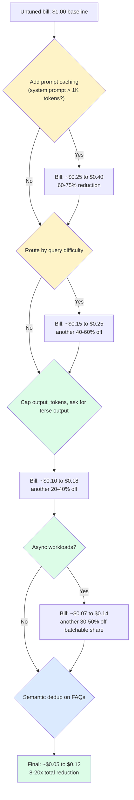
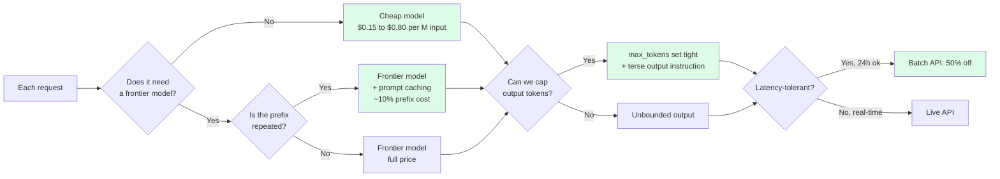

import { Cards, Card } from 'fumadocs-ui/components/card';
import { Callout } from 'fumadocs-ui/components/callout';

<Callout type="warn" title="TL;DR">
Your LLM bill is `requests × (system_prompt_tokens × cache_factor + user_input_tokens + output_tokens × output_multiplier) × $/token`. Output tokens are 3-5× the price of input tokens on every frontier model, which means most teams optimize the wrong side of the equation. The 80/20: **prompt caching alone usually cuts 60-80% of the bill**, then **model routing cuts another 40-60% of what's left**. Everything else — batching, semantic dedup, output capping — is the long tail. Do them in that order.
</Callout>

## The problem this tier solves

You shipped an LLM feature. It works. Then the bill arrived.

A real production scenario from a Series B SaaS company in mid-2025: a customer-support assistant on Claude Sonnet 4 (`$3/M input, $15/M output`), 12K-token system prompt with tool definitions and persistent knowledge, average user turn of 400 input tokens, average model response of 600 output tokens, 180K conversations per day at an average of 6 turns each. That's:

- **Input per turn:** `12,000 + 400 = 12,400 tokens`
- **Output per turn:** `600 tokens`
- **Turns per day:** `180,000 × 6 = 1,080,000`
- **Input cost/day:** `1,080,000 × 12,400 × $3 / 1,000,000 = $40,176`
- **Output cost/day:** `1,080,000 × 600 × $15 / 1,000,000 = $9,720`
- **Daily total:** `~$49,900`
- **Monthly:** `~$1.5M`

Their CFO did not approve $1.5M/month for a support assistant. The team spent a quarter cutting it to $180K/month — about a 9× reduction — without changing the user-facing behavior at all. Every lever they pulled is in this tier.

This is not a hypothetical. It is roughly the same shape of bill that every team running a meaningful LLM workload has seen at least once. The good news: the cost-cutting techniques are mechanical, well-documented, and don't require ML expertise. The bad news: most teams don't apply them until the CFO meeting.

## The cost equation, written out

Every LLM bill in production reduces to this:

```
total_$ = requests × per_request_$

per_request_$ = (
    system_prompt_tokens × cache_factor +
    user_input_tokens +
    output_tokens × output_multiplier
) × $/input_token
```

Three variables matter, ranked by leverage:

1. **`cache_factor`** — without caching, your full system prompt is billed at input rate on every request. With Anthropic prompt caching, cached prefix tokens cost ~10% of the input rate. With OpenAI automatic caching, ~50%. This single multiplier moves more dollars than anything else for the typical agent / RAG / chatbot workload.

2. **`output_multiplier`** — on every frontier model, output tokens are 3-5× the price of input tokens. Claude Sonnet 4: 5× (`$3 in, $15 out`). GPT-4o: 4× (`$2.50 in, $10 out`). Gemini 2.5 Pro: 8× on long context. Most teams obsess over input length and ignore output length, which is exactly backwards.

3. **`$/input_token`** — the model you choose. Routing 70% of your easy queries from Sonnet ($3/$15) to Haiku ($0.80/$4) or gpt-4o-mini ($0.15/$0.60) cuts that share of the bill by 4-20× with no quality regression *if you do the routing well*.

The remaining levers — batching for 50% off async workloads, semantic dedup for the long tail of repeat queries, context pruning to shrink user_input_tokens — chip away at the rest.

## The 80/20: where the money actually is

Here's the order to apply cost optimizations. Each one assumes the previous ones are already in place.



The yellow boxes are the two big levers — prompt caching and model routing — and they compound. Cut 70% with caching, then cut 50% of what's left with routing, and you're already at 15% of the original bill. The green and blue boxes are the long tail.

This is why teams that "tried to reduce cost" by switching from Sonnet to Haiku across the board often end up *more* expensive: they didn't cache, so they pay full price on a 12K-token system prompt for every turn, on every model. A cached Sonnet call beats an uncached Haiku call once the system prompt exceeds ~3K tokens.

## The hidden cost: output tokens are the silent killer

Most cost-engineering attention goes to shrinking the prompt: trimming the system message, pruning retrieved chunks, summarizing chat history. That's important. It's also the smaller of the two levers in most workloads.

Let's redo the support-assistant math but split input vs output:

| Component | Tokens/turn | $/M | $/turn |
|---|---|---|---|
| System prompt (uncached) | 12,000 | $3 | $0.036 |
| User input | 400 | $3 | $0.0012 |
| Output | 600 | $15 | $0.009 |
| **Total** | | | **$0.0462** |

At 1.08M turns/day = ~$49,900/day. Now apply each lever in isolation, holding everything else constant:

| Optimization | New $/turn | Daily $ | Reduction vs baseline |
|---|---|---|---|
| Baseline (no optimization) | $0.0462 | $49,896 | — |
| **Just** cut output from 600 to 200 tokens | $0.0402 | $43,416 | 13% |
| **Just** cut system prompt by half (6K) | $0.0282 | $30,456 | 39% |
| **Just** enable Anthropic prompt caching on 12K system prompt | $0.0143 | $15,444 | **69%** |
| Cache + cut output to 200 | $0.0083 | $8,964 | 82% |
| Cache + cut output + route 70% to Haiku | $0.0034 | $3,672 | **93%** |

Two things jump out:

1. **Prompt caching alone is the single biggest line-item win** — a 69% reduction from a config change. No quality regression. No code change beyond a few `cache_control` headers. It's free money sitting on the table.

2. **Output capping is small in isolation** (13%), but **stacks multiplicatively** with caching. After caching, output cost goes from ~20% of the bill to ~63% of the bill. *Now* output capping is the biggest remaining lever. Cost engineering is layered: the right next move depends on what you've already done.

This is why "what should we optimize?" is the wrong question. The right question is "given the optimizations we already have, what's the marginal cost of the next dollar of optimization?"

## Why "small model + retries" can beat "big model once"

There's a counterintuitive cost pattern that shows up once you start routing: it can be cheaper to call a small model twice than a big model once, even when you account for retry rates.

A quick worked example. Suppose 1000-token input, 200-token output, easy task (e.g. classification, extraction, simple Q&A).

| Strategy | $/call | Success rate | Effective $/success |
|---|---|---|---|
| Sonnet, one shot | $0.006 | 95% | $0.00632 |
| Haiku, one shot | $0.0016 | 88% | $0.00182 |
| Haiku, retry on failure with Sonnet | $0.0016 + 0.05 × $0.006 = $0.0019 | 99% | $0.00192 |
| gpt-4o-mini, retry on failure with Sonnet | $0.00027 + 0.10 × $0.006 = $0.00087 | 98% | $0.00089 |

The "small first, escalate on failure" pattern (sometimes called *cascade routing* or *LLM cascades* — see the FrugalGPT paper) gives you frontier-model quality at near-small-model cost, *if* you can detect failure cheaply. Detection patterns:

- **Confidence from logprobs** (only works on models that expose logprobs — OpenAI and most OSS, not Anthropic on the public API).
- **Self-consistency**: small model votes across N samples; if agreement is low, escalate.
- **Verifier model**: a tiny model (or rule-based check) reads the small model's output and decides whether to escalate.
- **Structured-output schema check**: did the small model produce valid JSON matching the schema? If no, escalate.

This is the foundational insight behind every modern routing system: **most queries are easy, and you don't need the expensive model to solve them — you just need a cheap way to know which queries are easy**.

## The model price landscape (Q1 2026)

Always check current pricing before designing — these change quarterly — but here's the shape as of early 2026.

| Model | $/M input | $/M output | Output multiplier | When to use |
|---|---|---|---|---|
| **Claude Opus 4** | $15.00 | $75.00 | 5× | Frontier reasoning, agentic loops, hard code |
| **Claude Sonnet 4.5** | $3.00 | $15.00 | 5× | Default for most user-facing tasks |
| **Claude Haiku 4** | $0.80 | $4.00 | 5× | Routing, extraction, classification, simple Q&A |
| **GPT-4o** | $2.50 | $10.00 | 4× | Default OpenAI tier |
| **GPT-4o-mini** | $0.15 | $0.60 | 4× | Cheapest mainstream; great for routing |
| **o1 / o3** | $15 / $60 | $60 / $240 | 4× | Hard reasoning only; reasoning tokens billed too |
| **Gemini 2.5 Pro** | $1.25 / $2.50 | $10 / $15 | 8-12× | Long context (1M+), Google ecosystem |
| **Gemini 2.5 Flash** | $0.30 | $2.50 | 8× | Cheap long-context, video understanding |
| **Llama-3.3-70B (Fireworks)** | $0.90 | $0.90 | 1× | Self-host alt; symmetric pricing is nice |
| **DeepSeek-V3** | $0.27 | $1.10 | 4× | Aggressive pricing; OSS weights |

Two patterns to notice:

- **Hosted OSS models often have 1× output multipliers** (input price = output price). On output-heavy workloads, this can be cheaper than gpt-4o-mini even though the per-token input price is higher.
- **The reasoning-model output multiplier is the same as the base model**, but they emit *far more* output tokens (often 5-20× more, due to internal chain-of-thought). Effective output cost is ~10× the headline rate. Use them only when you can measure that the extra reasoning genuinely helps.

## What's in this tier

This tier has one deep-dive page covering all the practical cost levers in detail. It's the only page because the topic is mechanical: there's a fixed set of techniques, and once you know them, you can apply them everywhere.

<Cards>
  <Card title="Prompt caching, model routing, batching, semantic dedup" href="/ai/cost/caching-routing" description="The full playbook. Anthropic / OpenAI / Gemini prompt caching mechanics and gotchas. Model routing patterns (classifier, embedding, LLM-as-router, cascade). Batch APIs for 50% off. Semantic caching with vector dedup. Output capping. The model-selection decision tree. A Python wrapper that does all of it with cost tracking." />
</Cards>

## How to think about it — a mental model

The frame that's most useful when you stare at a cost dashboard:



Every fork in that tree is a 30-90% cost lever. The compound is what gets you 10×.

## Pitfalls before you start

A few mistakes that show up in literally every team's first cost-reduction project:

1. **Optimizing without measuring.** You can't cut what you can't see. Before touching anything, instrument *per-request cost* tagged with feature, user, model, cached/uncached, input/output split. Most teams discover that 80% of their bill comes from one feature they didn't suspect. (Datadog LLM Observability, Helicone, LangSmith, and a 100-line custom wrapper all work.)

2. **Switching models without caching first.** Going from Sonnet to Haiku on an uncached 12K-token system prompt cuts your bill ~4×. Adding prompt caching to Sonnet on the *same* prompt cuts it ~3×. *Stacking* both cuts it 12×. Teams that swap models first often lose quality without realizing they left 70% of the cache savings on the table.

3. **Confusing input-token optimization with output-token optimization.** Output is 3-5× more expensive per token. A 10% reduction in output beats a 20% reduction in input. Always check the cost split before deciding which side to trim.

4. **Using `max_tokens=4096` everywhere "to be safe".** This doesn't cost you more directly (you only pay for what's generated), but it makes the model less likely to be terse — and on hosted self-serve tiers, large `max_tokens` increases the chance you hit rate limits because the provider reserves the budget. Set `max_tokens` to ~1.5× the realistic 95th-percentile output length.

5. **Treating caching TTL as "free".** Anthropic's 5-minute cache TTL means high-frequency endpoints cache nicely, but a chatbot with one user per day sees no benefit. The 1-hour beta cache helps but costs 2× the write premium. Match cache TTL to traffic shape.

6. **Routing without measuring router quality.** A bad router that sends hard queries to the cheap model degrades quality silently. A bad router that sends easy queries to the expensive model just wastes money. Always evaluate the router as its own model with its own confusion matrix.

## What you'll learn next

After the [caching-routing](/ai/cost/caching-routing) page you should be able to:

1. **Estimate** the cache hit rate of your current workload from logs in 10 minutes, and project the dollar savings of enabling caching.
2. **Design** a model router for your workload — pick between keyword routing, embedding similarity, dedicated router model, and LLM-as-router based on traffic shape and latency budget.
3. **Decide** which workloads can move to the Batch API for 50% off (eval runs, content generation, summarization pipelines, embedding generation), and which can't (anything user-facing).
4. **Implement** a semantic cache with the right similarity threshold, the right invalidation strategy, and the right stale-answer safety checks.
5. **Build** a Python or TypeScript wrapper that combines prompt caching, semantic caching, model routing, and per-request cost tracking — the kind of layer every mature LLM platform team eventually owns.

Read it next. Then go re-read your last AWS bill — it'll look very different.

---

> Next page: [Prompt caching, model routing, batching, semantic dedup](/ai/cost/caching-routing) — the full LLM cost-engineering playbook with code, prices, and the per-technique dollar math.
