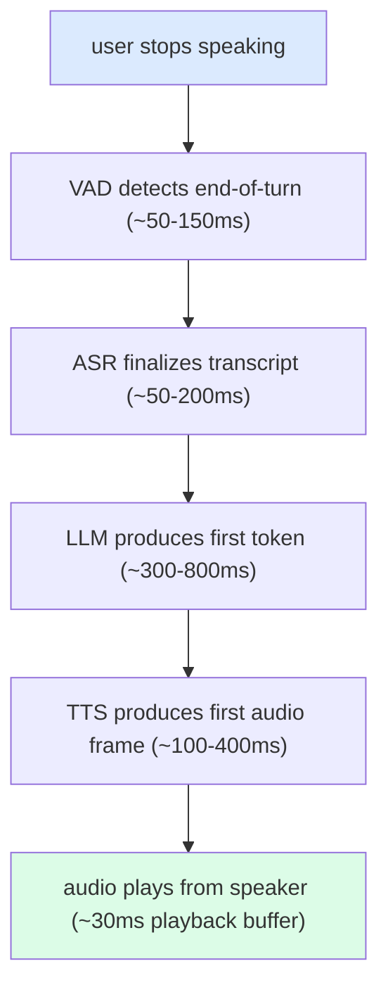
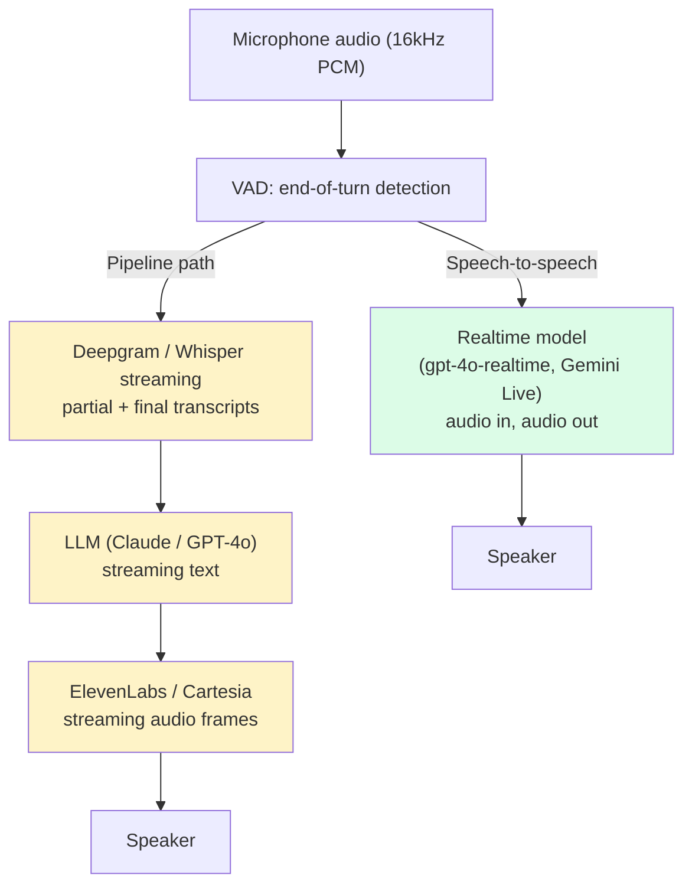
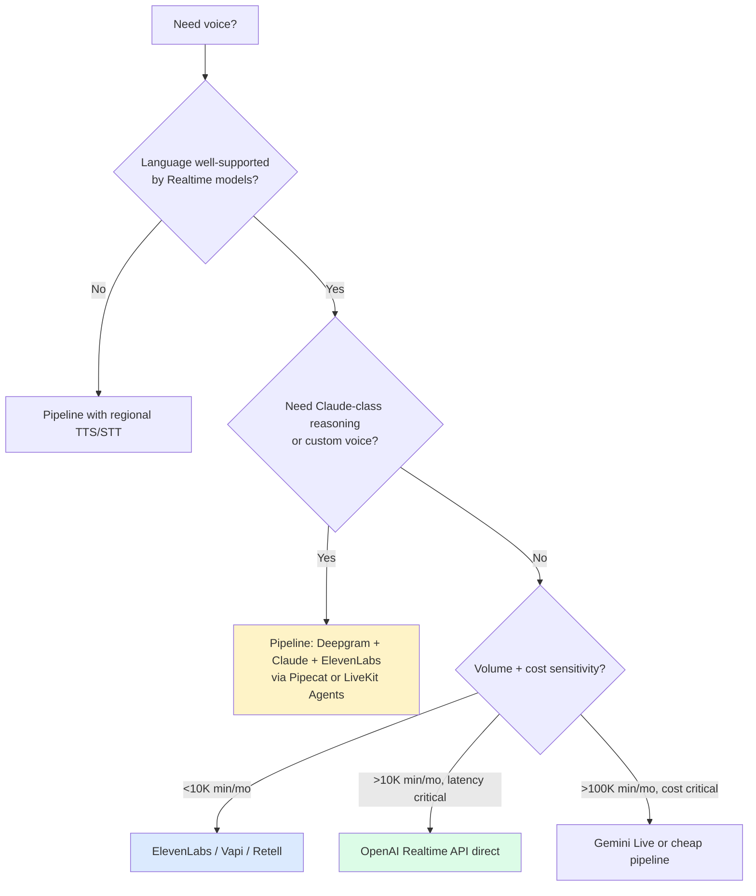

import { Callout } from 'fumadocs-ui/components/callout';

<Callout type="warn" title="TL;DR">
Human conversation has a **~300ms response budget**. A traditional STT → LLM → TTS pipeline runs at 1500-3000ms end-to-end and feels broken. Default to a **speech-to-speech model** (OpenAI `gpt-4o-realtime-preview-2025`, Gemini Live) when you can; fall back to a pipeline (Deepgram + Claude/GPT + ElevenLabs/Cartesia, orchestrated by Pipecat or LiveKit Agents) when you need tool calls, custom voices, or providers the realtime API doesn't support. Either way, **the hard problems are not transcription — they are turn-taking, interruption handling, and never letting the model hallucinate during a silence.**
</Callout>

## The problem this solves

Type "what's the weather?" into a chatbot. A 2-second response feels normal — you're reading text. Now ask the same thing out loud and wait 2 seconds in silence. It feels broken. The person on the other end is either thinking *really* hard, distracted, or dead.

This is the latency cliff that defines voice agents. Conversational research pegs the comfortable inter-turn gap at **200-300ms** in English (it varies by language and culture — Japanese sits closer to 7ms, Danish closer to 470ms — but English is roughly 250ms). Cross 500ms and the user perceives lag. Cross 1000ms and the user starts talking over you. Cross 2000ms and they hang up.

The total budget you have to play with, end-to-end, is:



Stack those up with a classic GPT-4 + ElevenLabs + Deepgram pipeline and you are at **1.5-2.0 seconds before the user hears the first phoneme**. That is the gap that ruined every Alexa/Siri-style assistant from 2014 to 2023, and the one that speech-to-speech models exist to close.

Latency is just one of three constraints. The other two are subtler:

- **Turn-taking** is a learned social behavior. Humans pre-signal end-of-turn with falling intonation, eye contact, breath patterns. None of this is in a transcript. A VAD just hears silence and guesses. Get this wrong and the agent either cuts the user off (false end-of-turn) or sits in awkward silence (missed end-of-turn). The bar your users measure against is *another human on a phone call*. They are extremely tuned to violations of normal turn-taking.
- **Backchannels** are the "uh-huh", "right", "mm" sounds humans make to acknowledge they're listening while someone else is talking. Voice agents that don't backchannel feel robotic. Voice agents that do but get the timing wrong feel deranged. Hume's EVI, Sesame, and recent updates to OpenAI Realtime have tried to crack this; nobody's nailed it yet.

These three — latency, turn-taking, and backchannels — are what make voice agents qualitatively different from chat. You can ship a chatbot that thinks for 5 seconds and people will tolerate it. The same model behind a phone call is unusable.

## The core insight

**Voice agents are a latency problem disguised as an AI problem.** The model quality bar is lower than for chat (you don't need GPT-5-class reasoning to book a haircut), but the latency bar is brutal: every additional 100ms of wall-clock makes the agent feel measurably worse.

Two architectural primitives close the gap:

1. **Speech-to-speech models** — a single model that takes audio in and emits audio out, skipping the STT and TTS hops entirely.
2. **Bidirectional streaming everywhere** — partial transcripts trigger LLM tokens which trigger TTS frames which play *before* the user has finished talking. The whole pipeline is a soft pipeline of overlapping work, not a sequence of waits.

Combine the two and you get sub-500ms first-audio-out latency. Get it wrong and you build the world's most expensive Speak & Spell.

## Visual — the pipeline vs the speech-to-speech path



The green path is one model; the yellow path is three. Every box on the yellow path is a place where buffering, retries, and head-of-line blocking can add 100-300ms. The green path also lets the model hear *how* you said something (sarcasm, hesitation, urgency) — information that is destroyed when you convert audio to text.

## Variants and strategies

### 1. Speech-to-speech (default for greenfield)

**OpenAI Realtime API** (`gpt-4o-realtime-preview` family, now stable as of 2025): WebSocket transport, sends and receives 24kHz PCM16 audio, plus a text/event channel for transcripts and function calls. Server-side VAD with configurable thresholds. Function calling works mid-conversation. Latency from end-of-user-speech to first-audio-out is **300-600ms** typical.

**Google Gemini Live API**: similar shape, available via the Gemini API and Vertex AI. Supports video input as well as audio (you can show the model a webcam feed). Lower-cost per minute than OpenAI as of late 2025 but slightly higher first-audio latency in our tests.

**Anthropic**: as of mid-2026, Claude's voice support is via the API in pipeline mode (Claude is the L in STT-L-TTS). No native speech-to-speech model has shipped. If you need Claude's reasoning quality on voice, you run a pipeline.

```python
# Minimal OpenAI Realtime agent — Python
import asyncio
import base64
import json
import websockets
import pyaudio

OPENAI_REALTIME_URL = "wss://api.openai.com/v1/realtime?model=gpt-4o-realtime-preview-2025-06-03"

async def voice_agent(api_key: str):
    headers = {
        "Authorization": f"Bearer {api_key}",
        "OpenAI-Beta": "realtime=v1",
    }
    async with websockets.connect(OPENAI_REALTIME_URL, extra_headers=headers) as ws:
        # 1. Configure session: instructions, voice, VAD, tools
        await ws.send(json.dumps({
            "type": "session.update",
            "session": {
                "modalities": ["audio", "text"],
                "voice": "alloy",
                "instructions": "You are a haircut booking agent. Be concise. Ask one question at a time.",
                "input_audio_format": "pcm16",
                "output_audio_format": "pcm16",
                "input_audio_transcription": {"model": "whisper-1"},
                "turn_detection": {
                    "type": "server_vad",
                    "threshold": 0.5,
                    "prefix_padding_ms": 300,
                    "silence_duration_ms": 500,
                },
                "tools": [{
                    "type": "function",
                    "name": "book_appointment",
                    "description": "Book a haircut for the given datetime",
                    "parameters": {
                        "type": "object",
                        "properties": {
                            "datetime_iso": {"type": "string"},
                            "service": {"type": "string"},
                        },
                        "required": ["datetime_iso", "service"],
                    },
                }],
            },
        }))

        # 2. Bidirectional audio loop
        pa = pyaudio.PyAudio()
        mic = pa.open(format=pyaudio.paInt16, channels=1, rate=24000, input=True, frames_per_buffer=480)
        spk = pa.open(format=pyaudio.paInt16, channels=1, rate=24000, output=True)

        async def send_audio():
            while True:
                frame = await asyncio.to_thread(mic.read, 480, exception_on_overflow=False)
                await ws.send(json.dumps({
                    "type": "input_audio_buffer.append",
                    "audio": base64.b64encode(frame).decode(),
                }))

        async def receive_events():
            async for raw in ws:
                evt = json.loads(raw)
                t = evt["type"]
                if t == "response.audio.delta":
                    spk.write(base64.b64decode(evt["delta"]))
                elif t == "response.function_call_arguments.done":
                    # Dispatch to your real booking system, then send the result back
                    result = await book_appointment(json.loads(evt["arguments"]))
                    await ws.send(json.dumps({
                        "type": "conversation.item.create",
                        "item": {
                            "type": "function_call_output",
                            "call_id": evt["call_id"],
                            "output": json.dumps(result),
                        },
                    }))
                    await ws.send(json.dumps({"type": "response.create"}))
                elif t == "input_audio_buffer.speech_started":
                    # User started talking — barge in: cancel current response
                    await ws.send(json.dumps({"type": "response.cancel"}))

        await asyncio.gather(send_audio(), receive_events())
```

A few things to notice in that snippet because they are non-obvious in the docs:

- **Server VAD** does end-of-turn detection for you. You can also do client-side VAD with Silero or WebRTC VAD and send explicit `input_audio_buffer.commit` events. Server VAD is easier; client VAD gives you more control.
- **`response.cancel` on `speech_started`** is the barge-in pattern. Without it, the agent keeps talking after the user interrupts.
- **`silence_duration_ms: 500`** is your end-of-turn knob. Lower = snappier but cuts off slow speakers. 500ms is a good default; 700ms for accessibility use cases.
- **Function calls** stream as `response.function_call_arguments.delta` events; you accumulate them and dispatch when `.done` fires.

### 2. Pipeline architecture (STT → LLM → TTS)

When you can't use a speech-to-speech model — because you need a model that doesn't have one (Claude, Llama-3.3, custom fine-tuned LLMs), a specific TTS voice (cloned celebrity voice, a particular accent), or fine-grained control over each stage — you build a pipeline.

The 2026 production stack looks like:

| Stage | Vendors | Latency budget |
|---|---|---|
| **VAD** | Silero VAD, WebRTC VAD (client-side); Deepgram/AssemblyAI built-in (server-side) | 50-150ms |
| **STT** | Deepgram Nova-3, AssemblyAI Universal-Streaming, OpenAI `whisper-large-v3-turbo` | 100-300ms (first partial), 200-500ms (final) |
| **LLM** | Claude 4.5 / GPT-5 / Llama-3.3, via streaming completions | 300-800ms (first token) |
| **TTS** | ElevenLabs Flash v2.5, Cartesia Sonic, OpenAI `gpt-4o-mini-tts`, PlayHT | 100-400ms (first audio frame) |
| **Orchestrator** | Pipecat, LiveKit Agents, Vocode, Retell SDK | 20-50ms framework overhead |

The orchestrator is where the magic happens — it overlaps these stages so you start TTS-ing the first sentence while the LLM is still generating the second sentence, and you keep STT running while TTS is playing back. **Pipecat** (Daily.co's open-source framework) and **LiveKit Agents** are the two dominant choices in 2026; Vocode is still around but development has slowed.

```python
# Minimal Pipecat-style pipeline (TypeScript-style pseudocode)
import { Pipeline, FrameProcessor } from "pipecat";
import { DeepgramSTT } from "pipecat/services/deepgram";
import { AnthropicLLM } from "pipecat/services/anthropic";
import { ElevenLabsTTS } from "pipecat/services/elevenlabs";

const pipeline = new Pipeline([
  new DailyTransport({ room, token }),     // WebRTC in/out
  new DeepgramSTT({ apiKey, model: "nova-3" }),
  new AnthropicLLM({ apiKey, model: "claude-sonnet-4-5" }),
  new ElevenLabsTTS({ apiKey, voiceId: "Rachel" }),
]);

await pipeline.run();
```

Pipecat's frame model means STT emits `TranscriptionFrame`s which the LLM consumes; LLM emits `TextFrame`s which TTS consumes; TTS emits `AudioFrame`s which the transport plays. Each processor can run concurrently and the framework handles backpressure.

### 3. Managed voice platforms

When you don't want to build any of this:

- **ElevenLabs Conversational AI**: bring your own LLM + system prompt, ElevenLabs runs the orchestration, TTS, and STT. Best when you need their voices and don't want to babysit infrastructure.
- **Vapi**: voice agents as a service, with native phone number integration (Twilio under the hood). Strong for outbound calling and IVR replacement.
- **Retell**: similar to Vapi, slightly different DX. Their `agent_id` + `phone_number` model is the simplest way to ship a voice agent to PSTN.
- **Bland**: aggressive on price-per-minute, less customizable.
- **LiveKit Cloud**: hosts your Pipecat / LiveKit Agents code with WebRTC infrastructure managed. The OpenAI Realtime API actually runs on LiveKit infrastructure under the hood.

Rule of thumb: if your voice agent is a CRUD-shaped feature in a larger product (booking, support deflection, lead qualification), use a managed platform. If voice *is* your product, you'll outgrow them and want Pipecat/LiveKit Agents.

### 4. Telephony integration

Most production voice agents eventually need to take or place phone calls. The PSTN landscape:

- **Twilio Voice + Media Streams**: the workhorse. You buy a number, point an inbound call at a TwiML bin, and `<Connect><Stream>` the audio into a WebSocket your server runs. From there you bridge to OpenAI Realtime / Pipecat / whatever. Outbound: REST API to place a call, then the same media-stream pattern.
- **Telnyx, Plivo, Vonage**: cheaper than Twilio at scale, similar shape. Telnyx has been particularly aggressive on voice-AI pricing.
- **SignalWire**: Twilio-compatible API, often picked for cost.
- **LiveKit SIP**: LiveKit added SIP trunking so a LiveKit room can connect directly to a PSTN call. If you're already on LiveKit Agents, this collapses one layer.

The non-obvious cost: **PSTN audio is 8kHz μ-law**, not 24kHz PCM. You upsample on the way into the model and downsample on the way out. Lose audio quality and re-create artifacts that confuse VAD and STT. Plan ~50ms of additional latency for transcoding.

### 5. Local / on-device voice

A small but growing fraction of voice agents need to run on-device: privacy-sensitive (legal, medical), regulated (children's toys, automotive), or just offline-capable (field tech, kiosks). The 2026 stack:

- **STT**: `whisper.cpp` on the edge, Vosk for legacy, Apple's `Speech` framework on iOS, Google's on-device speech on Android.
- **LLM**: Llama-3.3 8B or Phi-4 quantized to ~4-bit, running on a Mac M-series, Snapdragon mobile, or NVIDIA Jetson.
- **TTS**: Piper, Coqui XTTS-v2, Kokoro (open-source models that hit acceptable quality at modest CPU/GPU).
- **VAD**: Silero, which runs in ~5ms on a phone CPU.

Latency on a Mac M3 Max with Llama-3.3 8B Q4: first-audio in 500-900ms. Acceptable for some use cases; the model quality bar is the hard part — a smaller model will refuse and confabulate more than `gpt-4o-realtime`.

## Pitfalls

### Pitfall 1: trusting client-side VAD over a noisy line

WebRTC VAD and Silero work great on a clean mic. They fall apart on a real phone call with background traffic, a cafe, or a Bluetooth headset that does its own (often hostile) noise gating. Symptoms: the agent misses the end of your turn entirely, or it triggers a turn mid-sentence on cough/clear-throat.

**Fix**: use server-side VAD on the realtime API path (it sees both audio and the model's expectation of when speech is plausible), or pair Silero with a **silence-only fallback timer** so a 2s absolute silence forces a turn regardless of VAD.

### Pitfall 2: hallucinated speech in long silences

Speech-to-speech models occasionally generate a turn out of nowhere — "Hello? Are you there?" — when the user goes silent for 3-5 seconds. This is a real failure mode of `gpt-4o-realtime` we have seen in production. The model is RL-tuned to keep the conversation going, and silence is interpreted as an awkward pause.

**Fix**: detect prolonged silence on your side and explicitly send a `response.cancel` and skip the next `response.create`. Or set `turn_detection.create_response` to `false` and create responses manually only after a confirmed user turn.

### Pitfall 3: echo cancellation, the silent killer

If the same device plays the TTS audio out of the speaker and the same mic picks it up, the model hears itself, transcribes it as user speech, and goes into a loop. WebRTC's `echoCancellation: true` constraint handles this in the browser. On telephony you rely on the network's echo canceller (Twilio handles it). On a kiosk or a headless device, you must run an AEC library (Speex AEC, RNNoise, or Krisp's hosted API).

**Fix**: always assume echo is happening and validate. The smoking gun is the agent transcribing the *last 200ms of its own response* as the user's next turn. Bake an integration test that plays back recorded audio.

### Pitfall 4: not handling interruptions (barge-in)

If the user starts talking while the agent is mid-sentence and the agent just keeps talking, the conversation collapses. Both parties speak over each other for a few seconds, then the user gives up.

**Fix**: on `speech_started` (server VAD fires this as soon as it detects user audio with confidence), immediately stop the current TTS playback and send `response.cancel`. On the pipeline path, your TTS service must support an interrupt — ElevenLabs and Cartesia do; some self-hosted TTS engines don't.

### Pitfall 5: ignoring the time-to-first-audio metric

Engineers default to measuring p50 end-to-end latency. The metric that actually matters is **time-to-first-audio-frame** after the user stops speaking. The user perceives the conversation as snappy or laggy based on this number; total response duration matters much less because by the time the agent says "let me check" you've already perceived it as responsive.

**Fix**: instrument first-audio explicitly. Target < 600ms p50, < 1000ms p95.

### Pitfall 6: dropping context across long calls

A 20-minute support call accumulates 10K-30K tokens of conversation. If you naively send the full transcript on every turn, latency climbs as the context grows. If you truncate, you lose context.

**Fix**: rolling summary. Every ~3 minutes, run a cheap async summarization pass that compresses older turns into a 200-token "what happened so far" block. Keep the last 5-10 turns verbatim. Most voice frameworks (LiveKit Agents, Pipecat) ship a `MemoryProcessor` for this; if you're rolling your own, model the conversation as a `summary + recent_window` state.

### Pitfall 7: hot-mic'ing the model's "thinking" tokens

Speech-to-speech models occasionally vocalize their internal hesitations — "um, let me see…" — when really they should just respond. It feels human in moderation and unhinged in volume. Some teams have ended up filtering certain phonemes out of the output.

**Fix**: explicit system-prompt instructions ("respond directly, do not vocalize hesitation"), plus a TTS filter pass if you can afford the latency. Don't try to fix at the model layer alone; the RL-tuning of these models rewards conversational fillers.

### Pitfall 8: telephony jitter wrecks VAD

A jittery RTP stream (PSTN, weak cellular) delivers audio frames out-of-order or with gaps. Server VAD interprets the gaps as silence; client-side VAD locks up. Symptom: the agent thinks every utterance ends at every gap, replies prematurely, and talks over the user constantly.

**Fix**: jitter buffer (60-100ms) before the VAD. WebRTC handles this for you; raw RTP via Twilio Media Streams does not — you must buffer. Most production stacks tune this empirically per-region.

### Pitfall 9: tool calls during speech

User: "book it for Thursday at—" agent fires `book_appointment(datetime="Thursday")` mid-sentence. The model couldn't wait for the rest of the date.

**Fix**: configure the model to only fire tools after a complete turn, not on partial transcripts. On the Realtime API, this means waiting for `input_audio_buffer.committed` before allowing tool calls in `response.create`. Most pipeline frameworks default to this; speech-to-speech models occasionally don't.

### Pitfall 10: PII and recording compliance

Voice calls produce two streams of sensitive data: the audio and the transcript. Both are subject to GDPR / HIPAA / PCI / state two-party-consent recording laws. If you store either without disclosure and explicit consent, you're not just unethical — you're sued.

**Fix**: explicit consent at the start of every call ("This call may be recorded for quality and AI training"), region-specific routing (don't store EU calls in US-East), redaction of PII from transcripts before they touch any analytics pipeline. Twilio and LiveKit both have features for this; build them in from day one rather than retrofit.

## Complexity and cost

| Stack | First-audio p50 | Cost / minute (audio) | Customization | Best for |
|---|---|---|---|---|
| **OpenAI Realtime (gpt-4o-realtime)** | 350-500ms | $0.06 in + $0.24 out | Medium (no custom voices) | Greenfield, English-first |
| **Gemini Live** | 400-700ms | $0.04-0.10 (preview pricing) | Medium | Multimodal (video), cost-sensitive |
| **Pipeline (Deepgram + Claude + ElevenLabs)** | 800-1400ms | $0.03 STT + $0.05 LLM + $0.18 TTS = ~$0.26 | High | Claude-specific reasoning, custom voices |
| **Pipeline (Deepgram + GPT-4o-mini + Cartesia)** | 600-1000ms | $0.03 + $0.02 + $0.06 = ~$0.11 | High | Cost-optimized at scale |
| **ElevenLabs Conversational AI** | 500-900ms | $0.08-0.15 | Low (managed) | Voice-as-product, fast ship |
| **Vapi / Retell (managed)** | 700-1200ms | $0.05-0.15 + telco | Low | Phone-first deployments |

*Latencies measured on a US-east WebRTC connection in mid-2026. Pricing rounded; check vendor docs.*

The unspoken cost: a voice agent running 24/7 at 100 concurrent calls is 4.3M minutes/month. At $0.10/min that's $430K/month. Voice gets expensive fast.

## When NOT to use a voice agent

1. **The task has a complex form with many fields.** "Book a flight" with origin, destination, date, time, passengers, class, seat preference — voice is worse than a form. Voice excels at fewer-than-5 turn interactions or open-ended dialogue, not data entry.
2. **The user is in a quiet, sit-down context with a keyboard.** They will type faster and more accurately than they speak.
3. **You can't tolerate any hallucinations on the output.** If the agent says the wrong appointment time and the user doesn't catch it, that's a real-world error. Use a confirmation step ("did you say 3pm on Thursday?") at minimum.
4. **Your users speak languages with sparse voice model support.** OpenAI Realtime supports ~30 languages well, ~70 marginally. Edge languages (Welsh, Yoruba, many dialects) work badly. Check.
5. **The task is asynchronous.** Voice is inherently real-time. If the right interaction is "ask once, get an answer in 10 minutes," use chat or email.

## Decision rule



## Real-world stacks

- **Sierra (Bret Taylor's customer-support startup)**: pipeline architecture, multi-LLM (they have written about routing between models for different sub-tasks within a single call). Deep integration with customer CRMs is the moat, not the voice tech itself.
- **Hume AI's EVI**: focuses on emotional prosody — their model adjusts tone based on detected user emotion. Speech-to-speech in spirit, custom model trained on emotionally-labeled audio.
- **OpenAI Advanced Voice Mode (in ChatGPT)**: production deployment of `gpt-4o-realtime` at consumer scale. Confirms the model can hit < 320ms median latency at scale when colocated with the user.
- **Character.AI Voice**: hybrid — they use a fast neural TTS (cloned character voices) with a small fast LLM for snappy responses, switching to a larger model for complex turns. Latency-quality routing.
- **11x.ai (AI SDR)**: outbound sales calls. Pipecat-based pipeline, Twilio for PSTN, Deepgram for STT, ElevenLabs for TTS, Claude for reasoning. Reportedly 20-25K calls/day at sub-second first-audio.
- **Air.ai**: long-duration calls (10-40 min) with extensive memory management. They publicly described their "memory hierarchy" — short-term verbatim window plus a longer summarized state.
- **LiveKit + OpenAI partnership**: OpenAI Realtime is hosted on LiveKit's WebRTC infrastructure. If you're building serious voice, learn LiveKit's primitives — you're already using them transitively.
- **Klarna's customer service AI**: a public case study of LLM-driven voice support deflection at scale. Reported displacement of equivalent of 700 FT customer service agents within the first year. Pipeline (not realtime) architecture, multi-language.
- **Decagon, Parloa, PolyAI**: enterprise contact-center voice agents. All three published architectures that look variations on the same pipeline: cloud STT + their own orchestration layer + reasoning model (Claude or GPT) + commercial TTS. The moat is integrations with Salesforce / ServiceNow / Zendesk, not the voice tech.
- **AI receptionists (Goodcall, Numa, Slang.ai)**: small-business inbound voice agents that take reservations, answer FAQs, schedule appointments. Usually managed-platform stacks underneath, with the product surface being the integration with the small-business tools (Square, Toast, Booksy).
- **Tavus / HeyGen voice-with-video**: avatar + voice agents. Combine speech-to-speech with a video generation model that lip-syncs the avatar. Latency adds another 200-500ms for video frames; meaningful only for "human-like" use cases.
- **Wispr Flow (now defunct)**: tried to ship a wearable voice-control device. Hard to overstate how brutal the latency budget is when the user is *waiting on you to take an action*, not having a conversation. Wearable voice continues to be an open frontier into 2026.

## Curated questions to practice

1. Your voice agent's first-audio p50 is 1.2 seconds and users complain. You're on a Deepgram + GPT-4o + ElevenLabs pipeline. List four changes you'd try and the latency reduction you'd expect from each.
2. Users report the agent occasionally starts talking when there's a 4-second silence on their end. Trace this through the pipeline — at which layer(s) could this be happening, and how do you fix it without making the agent feel less responsive on normal turns?
3. Design a barge-in test you can run in CI. The agent must stop speaking within 200ms of detected user speech. What do you have to instrument?
4. You're forced to use a Llama-3.3 fine-tune for compliance reasons (the model must run in your own VPC). Sketch the voice stack you'd build around it and where the latency bottlenecks will be.
5. You have a Spanish-speaking user base in Mexico. Your QA team is American. How do you build the test suite that catches accent / dialect failures before they ship?

## Quick-reference card

| Question | Answer |
|---|---|
| **Default model for new voice agents?** | OpenAI Realtime (`gpt-4o-realtime-*`) via the Realtime API |
| **When to use a pipeline instead?** | Need Claude reasoning, custom voice, language not well-supported, or cost constraints |
| **Default orchestrator framework?** | Pipecat (open-source, Daily.co) or LiveKit Agents |
| **First-audio latency target?** | < 600ms p50, < 1000ms p95 |
| **VAD: client or server?** | Server VAD on the Realtime API path; Silero or WebRTC VAD on pipeline path |
| **End-of-turn silence threshold?** | 500ms default; 700ms for accessibility / slow speakers |
| **Barge-in handling?** | On `speech_started`, send `response.cancel` and stop TTS playback |
| **Long-call memory?** | Rolling summary every ~3 minutes + verbatim last 5-10 turns |
| **Killer pitfall #1** | Not instrumenting first-audio-frame latency |
| **Killer pitfall #2** | Echo loop — the model hears itself, transcribes it, replies to it |
| **Killer pitfall #3** | No barge-in support — user can't interrupt |
| **Killer pitfall #4** | Pipeline overhead with sequential (not pipelined) stages |
| **Managed platform for fast ship?** | Vapi (phone), ElevenLabs Conversational AI (custom voices), Retell |

---

> Next page: [Coding agents](/ai/edges/coding-agents) — how Claude Code, Cursor, Devin, and Aider actually work, and how to build your own coding-agent loop.
