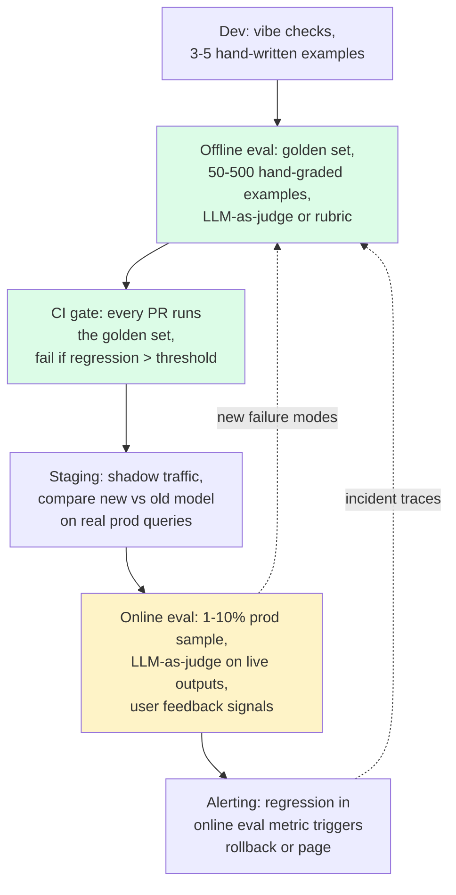
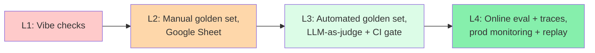
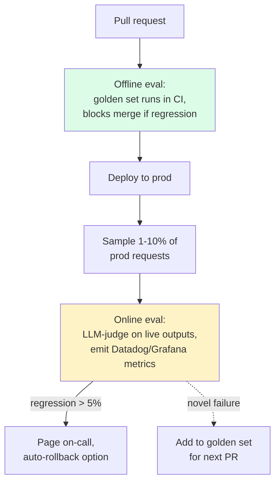
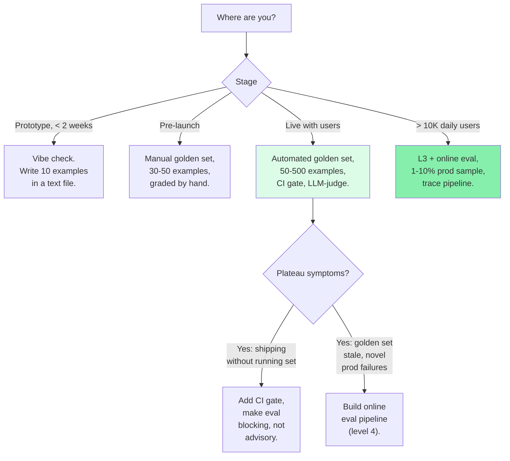

import { Cards, Card } from 'fumadocs-ui/components/card';
import { Callout } from 'fumadocs-ui/components/callout';

<Callout type="warn" title="TL;DR">
"Looks fine to me" is not an eval. If you don't have a **golden set of 50-500 hand-graded examples**, an **automated regression suite that runs them on every prompt change**, and a **production trace pipeline that lets you replay any failure**, you don't have evals — you have vibes. Every senior LLM team eventually builds the same three things; the only question is whether you build them before or after your first user-visible regression.
</Callout>

## The problem this solves

You ship a RAG-backed support chatbot. Internal demo works great. A week into production, a user shows you a screenshot where the bot confidently tells them "your refund will arrive in 5-7 business days" — except your refund policy is 30 days. You fix the prompt. The next week, a different user gets a different wrong answer. You fix the prompt again. Now changes to the prompt break the previous fixes. You're playing whack-a-mole.

Or: you upgrade from Claude 3.5 Sonnet to Claude 4 Sonnet because it's "better at reasoning." The eval team runs five queries by hand, says "looks good," and you ship. Two weeks later, support tickets spike — turns out the new model is also more verbose, exceeds your output token budget on 8% of queries, and the truncation produces malformed JSON that breaks your downstream parser.

Or: a teammate edits the system prompt to fix one customer's complaint. The fix works for that customer. It silently makes the answer worse for 12% of all other customers, and you don't find out until quarterly NPS drops.

**All three failures share the same root cause: there is no automated, repeatable, quantitative measurement of "is the model output good?" running on every change.** The fix is evals — but the word "eval" hides a stack of practices, none of which are optional once you're past prototype.

## The core insight

LLM outputs are a **distribution, not a value**. You can't write `assert output == "expected"` like you would for a deterministic function. Same input, same prompt, same temperature=0.7 — you still get different outputs. So your eval has to measure aggregate quality on a representative sample, not single-example correctness.

That means evals have three irreducible parts:

1. **A representative sample of inputs** — your *golden set*. 50 examples minimum, 500 is usually enough, 5000 if your input distribution is genuinely wide.
2. **A way to grade outputs at scale** — usually LLM-as-judge (a stronger model grading a weaker model's outputs against a rubric) plus periodic human spot-checks.
3. **A pipeline that runs the above on every code/prompt change** — so a regression shows up as a failing CI check, not as a customer complaint.

Once you have these three, the rest of the eval stack (online evals, A/B tests, trace-based debugging, prod alerting) is incremental. Without them, every other piece of observability is just expensive logging.

## Visual: the eval pipeline

The dashed arrows are the critical feedback loop. Every production failure becomes a new golden-set example. Every customer complaint becomes a regression test. Your eval coverage grows monotonically over time, which means **your worst customer is also your best eval contributor**.

## The four levels of eval maturity

Hamel Husain's essay ["Your AI product needs evals"](https://hamel.dev/blog/posts/evals/) put a name on what every senior team learns the hard way. There are roughly four levels, and most teams plateau at level 2.

### Level 1: vibe checks

You type a few queries into a chat window, eyeball the output, declare success. There is no written rubric. There is no record of what passed last week. When the prompt changes, you re-vibe.

**Cost to set up:** zero. **Cost to maintain:** infinite (humans don't scale). **When it's OK:** the first 3 days of a prototype. **When it isn't:** the moment a user touches the system.

### Level 2: manual golden set

You write down 30-50 "tricky" examples in a Google Sheet. Each row has an input, an expected output (or a list of must-haves and must-not-haves), and a manual pass/fail column. Before shipping a prompt change, an engineer pastes each input into the chat, copies the output, and grades it by hand.

This is where 70% of LLM teams sit. It works. But it has three lethal failure modes:
- Humans get bored. After example 20 they start rubber-stamping.
- Re-running is so painful that engineers skip it for "small" prompt changes.
- The golden set never grows past the original 30 examples because adding examples is also painful.

**Symptom that you've plateaued at level 2:** you ship a prompt change without running the full set "because it was just a typo fix."

### Level 3: automated golden set with code-based or LLM-as-judge graders

The golden set lives in a JSON or YAML file in your repo. A script reads it, calls your LLM pipeline for each example, applies graders, outputs a report. The graders are a mix of:

- **Exact-match / regex** for outputs with deterministic structure (JSON schemas, citations, refusal-detection).
- **Semantic similarity** (cosine sim of output vs reference) for free-form text.
- **LLM-as-judge** for nuanced qualities like "is this answer factually grounded in the retrieved context?" or "is the tone appropriately professional?"

Now you can run the full set in 3 minutes per PR. You can grow the set to 500 examples because each new example only costs the LLM API call. The CI pipeline blocks merges if the score regresses past a threshold.

This is the **minimum bar for a production LLM system**. Below this, you are flying blind.

### Level 4: continuous online eval + structured trace observability

You sample 1-10% of production traffic, run the same LLM-as-judge graders against live outputs, and emit metrics (pass rate, faithfulness score, refusal rate) to your observability stack. Regressions in these metrics page on-call. Every prod request emits a full structured trace — system prompt, retrieved context, tool calls, model parameters, latency, cost — that you can replay locally to debug.

This is where teams at OpenAI, Anthropic, Notion AI, Cursor, Perplexity, Glean live. It is not optional once you have > 10K daily users.

**Why teams plateau at level 2:** the jump from L2 to L3 requires writing a grader, and graders feel like throwaway work. The trick is to start with the dumbest possible grader (string contains, JSON schema validation) and add an LLM-as-judge as a second pass only where the dumb grader can't discriminate.

## Offline vs online evals

These are two different things that solve two different problems. You need both.

### Offline eval (golden set + regression suite)

- **What:** a fixed set of inputs with known-good outputs (or rubrics), graded by code or LLM-judge, run before every deploy.
- **Pro:** reproducible, fast feedback loop, blocks regressions before they hit users.
- **Con:** golden set is by definition a snapshot of the input distribution from when you wrote it. Real user traffic drifts. You will miss novel failure modes.

### Online eval (production sampling)

- **What:** sample 1-10% of live production requests, run LLM-as-judge on the outputs (or compute lightweight metrics: refusal rate, output length, tool-call success rate), emit time-series metrics.
- **Pro:** catches drift, catches new failure modes, gives you per-feature/per-user quality signals.
- **Con:** lags real-time (judge calls take seconds), can't block bad deploys (only detects them after the fact), costs money per sampled request.

The dotted arrow is how your offline eval set stays representative. Every novel failure mode you find in production becomes a regression test for future PRs.

## The tier in three pages

<Cards>
  <Card title="LLM-as-judge, golden sets, regression suites" href="/ai/eval/llm-as-judge" description="Building a 50-500 example golden set. Pointwise vs pairwise grading. G-Eval, RAGAS, DeepEval. The 'judge model is biased toward its own outputs' failure. Code: Python pipeline + CI integration." />
  <Card title="Traces, prompt versioning, debugging" href="/ai/eval/observability" description="OTel GenAI semantic conventions. LangSmith, Braintrust, Langfuse, Phoenix Arize, Helicone — what each is good at. Prompt versioning, sampling, PII scrubbing, alerting. Code: instrumented Anthropic/OpenAI SDK wrappers." />
</Cards>

## How this tier connects to the rest

- **Retrieval** failures (wrong chunks, missing context) show up as faithfulness-score regressions in your eval. You'll diagnose them from traces.
- **Inference** parameter changes (temperature, top-p, model swap) are the most common cause of overnight regressions. Your eval is the canary.
- **Agents** are 10× harder to eval than single-turn calls — multi-step trajectories, tool-call sequences, error recovery. You need trace-based evals (was each step correct?) plus end-to-end evals (did the agent achieve the goal?).
- **Safety** evals (jailbreak resistance, prompt-injection robustness, PII leakage) are a specific category of eval that runs alongside quality evals.
- **Cost** observability shares the same trace pipeline as quality observability — you log tokens and dollars on every request anyway.

## The pitfalls you'll hit at every level

### Pitfall 1: building evals after, not before

Engineers want to ship first, eval later. By the time you bolt on evals, the system is complex, prompts are deeply nested, retrieval has 4 stages, and the cognitive cost of writing 50 golden examples is enormous. **Write 10 golden examples before you write the first prompt.** They will be wrong; that's fine. They will sharpen as you build.

### Pitfall 2: golden set doesn't match the input distribution

You write 50 examples that are all "polite questions a customer might ask." Production traffic is 30% misspellings, 20% multi-language, 15% adversarial probes, 10% empty messages. Your golden set says you're at 95%; your real customers experience 60%. **Sample your golden set from real production logs, not from imagination.**

### Pitfall 3: judging the wrong thing

"Quality" is not a metric. Faithfulness is. Helpfulness is. Refusal-when-appropriate is. JSON-schema-validity is. Citation-presence is. Decompose "good" into 4-8 measurable rubric dimensions and grade each one separately. A single "is this good 1-5?" score from an LLM judge correlates with almost nothing.

### Pitfall 4: ignoring inter-rater reliability between judges and humans

Your LLM judge says 92% of outputs are good. You sample 20 of them and grade by hand. You agree on 14 of 20. Your judge is no better than coin-flipping on the disagreements. **Spot-check 10% of LLM-judge outputs against human grades, and recompute judge accuracy quarterly** — model upgrades silently change judge behavior.

## When NOT to invest heavily in evals

There are three legitimate cases for staying at level 1-2:

1. **You're in the first 2 weeks of a prototype** and you legitimately don't know what the product is yet. Premature evals encode the wrong assumptions. Vibe-check, get to a working demo, *then* write the golden set.
2. **The model is doing trivial transformation work** — translation, formatting, simple classification with a tiny output space. Code-based graders (string equality, label match) are sufficient; you don't need LLM-as-judge.
3. **You have less than 100 daily users and no quality SLA.** Online eval costs more than the failures it catches at this scale. Offline eval (level 3) is still required; online eval (level 4) can wait.

For literally every other production LLM system, the eval investment pays back within the first regression it catches.

## Decision rule: which eval to build first

## Real-world stacks

- **Anthropic** publishes evals like [Inspect](https://inspect.aisi.org.uk/) (originally UK AISI, used internally) — offline, golden-set-based, scriptable graders. Internal teams use a similar pattern with LLM-as-judge and human spot-checks.
- **OpenAI** open-sourced [OpenAI Evals](https://github.com/openai/evals) and the newer Eval API. Internal teams run thousands of evals per model release; each model card lists scores on dozens of benchmarks.
- **Notion AI** is on record (in their engineering posts) using offline regression suites that run on every prompt change, with LLM-as-judge for "is this summary accurate" and code-based graders for citation presence.
- **Cursor and Codeium** use end-to-end coding-task evals (SWE-bench, internal task sets) for model selection, plus per-feature offline regression suites.
- **Klarna** ([reported in their AI assistant case study](https://www.klarna.com/international/press/klarna-ai-assistant-handles-two-thirds-of-customer-service-chats-in-its-first-month/)) runs LLM-as-judge on a sample of every customer conversation, with humans grading a sample of the judge's grades. This is the level-4 pattern.
- **GitHub Copilot** has published that they use offline benchmarks (HumanEval, internal sets) for model selection and online metrics (acceptance rate, retention, completion length) for production quality monitoring.

## Curated questions to practice

1. You inherit an LLM-backed product with no evals. You have 1 week before the next release. What do you build first — a golden set, a trace pipeline, or online metrics? Defend the order.
2. Your LLM-as-judge says your new prompt is 8 points better than the old prompt on faithfulness. The same prompt has a 3-point lower user thumbs-up rate in production. What's likely happening, and how do you reconcile?
3. You want to upgrade from GPT-4o to GPT-5. Your offline eval on a 200-example golden set says +6 points on quality, no regression. Do you ship? What additional signal would you want before flipping the switch?
4. Your golden set has 50 examples. Adding example 51 produces a regression because the model gets that one wrong, and CI now blocks merges. Is this a real regression or a coverage problem? How do you decide?
5. You have offline eval at 92% pass rate but online eval at 78%. Name three plausible causes and the diagnostic for each.

## Quick-reference card

| Question | Answer |
|---|---|
| **Minimum golden set size?** | 50 examples. 500 is usually enough. 5000 if input distribution is wide. |
| **Where do golden examples come from?** | Production logs first, hand-written edge cases second. Never just imagination. |
| **Single grader or multiple?** | Multiple — decompose "good" into 4-8 rubric dimensions, grade each. |
| **When to use LLM-as-judge?** | Free-form text, nuanced qualities (faithfulness, tone, helpfulness). Not for JSON validity — use code. |
| **CI integration?** | Mandatory at L3+. Block merge on regression past threshold (typically -2 to -5%). |
| **Online sampling rate?** | 1-10% in prod, 100% of errors and explicit user feedback, 100% in staging. |
| **Inter-rater reliability check?** | Spot-check 10% of LLM-judge outputs against human grades. Recompute quarterly. |
| **Plateau symptom** | You ship a prompt change without running the full set. |
| **What to read next** | [LLM-as-judge & golden sets](/ai/eval/llm-as-judge) |

---

> Next page: [LLM-as-judge, golden sets, regression suites](/ai/eval/llm-as-judge) — building the 50-500 example golden set and the judge pipeline that grades it.
