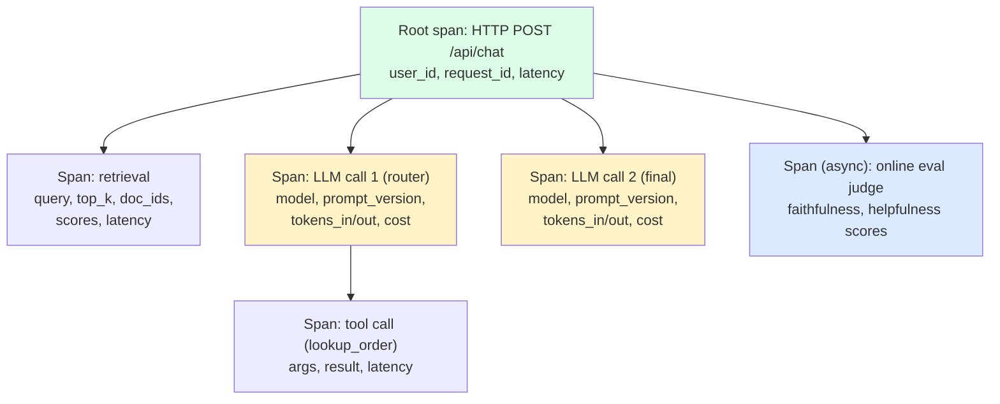
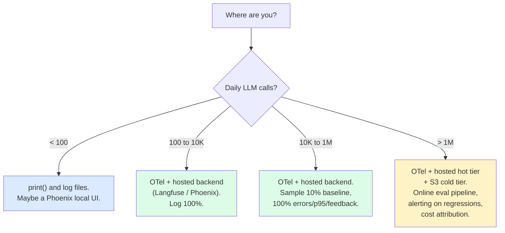

import { Callout } from 'fumadocs-ui/components/callout';

<Callout type="warn" title="TL;DR">
Log the full prompt (system + messages + tools), the model + parameters, the full response, latency breakdown, token counts in/out, cost, and a prompt version tag — on **every** request. Use **OpenTelemetry GenAI semantic conventions** (`gen_ai.*` attributes) so any backend can ingest your traces. Sample **100% in staging, 1-10% in prod, 100% of errors and explicit user feedback**. Scrub PII before traces leave your network. The replay loop — "click a trace, get an identical local reproduction" — is the difference between an hour of debugging and a week of guessing.
</Callout>

## The problem this solves

A customer pings support: "Your bot told me my package was lost when actually it's just delayed." You have:

- The customer's user ID.
- A vague timestamp ("sometime yesterday afternoon").
- No idea which version of the prompt was live yesterday.
- No idea which model snapshot the request hit.
- No idea what was in the retrieved context.
- No idea what tools were called.

To debug, you have to guess. You try a similar query in dev. You can't reproduce. You ship a "fix" that addresses your guess. The bug returns under different phrasing two weeks later.

Now the same scenario with proper observability:

- Click the customer's user ID in your dashboard. See every LLM request in the last 7 days.
- Click the suspect trace. See the full system prompt (tagged `prompt_v3.14`), the full message history, the retrieved chunks (with their doc IDs and scores), the tool calls, the model name and parameters, the full response, latency per stage, tokens in/out, cost.
- Copy a "reproduce locally" link. Get a Python script that calls the same model with the same prompt and the same retrieved context. Run it. Identical output.
- Diff against `prompt_v3.13`. See that someone removed the "if uncertain, say so" instruction yesterday.
- Roll back the prompt to v3.13. Add a golden-set example for this failure.

This page is about building the observability stack that turns the second scenario into your default.

## The core insight

**For LLM systems, the request and the program are the same thing.** In a normal web service, you log "request to /users/123 took 45ms, returned 200." The program is fixed; the request just hits it. In an LLM system, every request carries its own program (the prompt, the retrieved context, the tools available), and the program changes constantly (prompt edits, model upgrades, retrieval-index updates). You can't debug the system by looking at the system; you have to debug by looking at the specific request.

That means **every trace must be self-contained enough to replay**. If a trace only logs "called LLM, got response," you're back to vibes. The trace has to capture every input that determined the output — system prompt, user message, message history, tool definitions, retrieved context, model name, temperature, top-p, max-tokens, seed (if used), and the prompt version tag.

## Visual: a single LLM request as a span tree



The structure is OpenTelemetry — nested spans with the user request as the root and every model/tool call as a child. Each span carries enough attributes to debug it in isolation.

## What you need to log on every LLM call

This list is non-negotiable for production debugging. Drop any field and you'll hit a debugging dead end within weeks.

```python
{
    # Identity
    "request_id": "req_01J8KX...",
    "user_id": "user_94321",
    "session_id": "sess_abc...",
    "parent_span_id": "...",

    # The program
    "prompt_version": "v3.14",        # tag every prompt change
    "system_prompt": "You are a customer support...",  # FULL TEXT
    "messages": [
        {"role": "user", "content": "where's my order?"},
        ...
    ],
    "tools": [{"name": "lookup_order", "schema": {...}}, ...],

    # The model
    "model": "claude-sonnet-4-5",     # specific snapshot, not "claude"
    "params": {"temperature": 0.7, "max_tokens": 1024, "top_p": 0.95},

    # The response
    "response": {
        "content": "...",
        "stop_reason": "end_turn",
        "tool_calls": [...],
    },

    # The performance
    "latency_ms": {
        "total": 1840,
        "ttft": 320,        # time-to-first-token
        "tps": 84,          # tokens per second after first
    },

    # The cost
    "tokens": {
        "input": 4123,
        "output": 187,
        "cached_input": 3500,   # if using prompt caching
    },
    "cost_usd": 0.018,

    # Retrieved context (for RAG)
    "retrieved": [
        {"doc_id": "tos_v3.2", "chunk_id": 17, "score": 0.83},
        ...
    ],
}
```

If any of these is missing, you can identify a specific debug scenario you can't handle:

- Without `prompt_version`: you can't tell which prompt change broke things.
- Without full `system_prompt`: you can't reproduce the trace locally.
- Without `model` snapshot: you can't tell which model upgrade silently regressed.
- Without `retrieved` chunks: you can't tell whether the failure was retrieval or generation.
- Without `tokens` and `cost_usd`: you can't attribute cost to features or users.

## OpenTelemetry GenAI semantic conventions

[OpenTelemetry has a GenAI subgroup](https://opentelemetry.io/docs/specs/semconv/gen-ai/) that publishes a stable set of `gen_ai.*` attribute names. As of 2025-2026 this is the lingua franca for LLM tracing — every observability backend (Langfuse, Datadog, Phoenix, Braintrust, Helicone) accepts these names natively.

Use these attribute names religiously. Custom names mean your traces only work in the one backend you're using today.

| Attribute | Meaning |
|---|---|
| `gen_ai.system` | Provider (`anthropic`, `openai`, `vertex_ai`, `bedrock`) |
| `gen_ai.request.model` | Model snapshot (`claude-sonnet-4-5`, `gpt-4o-2024-11-20`) |
| `gen_ai.request.temperature` | Temperature |
| `gen_ai.request.max_tokens` | Max output tokens |
| `gen_ai.request.top_p` | Top-p |
| `gen_ai.response.id` | Provider request ID |
| `gen_ai.response.model` | Model that actually served (may differ from requested) |
| `gen_ai.response.finish_reasons` | `["end_turn", "tool_use", "max_tokens"]` |
| `gen_ai.usage.input_tokens` | Input token count |
| `gen_ai.usage.output_tokens` | Output token count |
| `gen_ai.prompt.{n}.role` | Per-message role (`system`, `user`, `assistant`, `tool`) |
| `gen_ai.prompt.{n}.content` | Per-message content |
| `gen_ai.completion.{n}.content` | Response content |
| `gen_ai.operation.name` | `chat`, `text_completion`, `embeddings` |

Span name convention: `{operation} {model}` — e.g. `chat claude-sonnet-4-5`.

## OTel instrumentation snippet for an Anthropic call

```python
from opentelemetry import trace
from opentelemetry.semconv._incubating.attributes import gen_ai_attributes as gai
from anthropic import Anthropic
import time

client = Anthropic()
tracer = trace.get_tracer("my-llm-app")


def traced_chat(system: str, messages: list, model: str, prompt_version: str):
    with tracer.start_as_current_span(f"chat {model}") as span:
        # Request attrs
        span.set_attribute(gai.GEN_AI_SYSTEM, "anthropic")
        span.set_attribute(gai.GEN_AI_REQUEST_MODEL, model)
        span.set_attribute(gai.GEN_AI_REQUEST_TEMPERATURE, 0.7)
        span.set_attribute(gai.GEN_AI_REQUEST_MAX_TOKENS, 1024)
        span.set_attribute(gai.GEN_AI_OPERATION_NAME, "chat")

        # Custom: prompt version (no standard attr yet)
        span.set_attribute("app.prompt.version", prompt_version)

        # Log messages as span events (recommended over attrs for long content)
        span.add_event("gen_ai.system.message", {"content": system})
        for i, m in enumerate(messages):
            span.add_event(f"gen_ai.{m['role']}.message", {"content": m["content"]})

        start = time.perf_counter()
        try:
            response = client.messages.create(
                model=model,
                max_tokens=1024,
                temperature=0.7,
                system=system,
                messages=messages,
            )
        except Exception as e:
            span.set_status(trace.Status(trace.StatusCode.ERROR, str(e)))
            span.record_exception(e)
            raise

        latency_ms = (time.perf_counter() - start) * 1000

        # Response attrs
        span.set_attribute(gai.GEN_AI_RESPONSE_ID, response.id)
        span.set_attribute(gai.GEN_AI_RESPONSE_MODEL, response.model)
        span.set_attribute(
            gai.GEN_AI_RESPONSE_FINISH_REASONS, [response.stop_reason]
        )
        span.set_attribute(gai.GEN_AI_USAGE_INPUT_TOKENS, response.usage.input_tokens)
        span.set_attribute(gai.GEN_AI_USAGE_OUTPUT_TOKENS, response.usage.output_tokens)

        # Custom: latency breakdown, cost
        span.set_attribute("app.latency_ms.total", latency_ms)
        span.set_attribute("app.cost_usd", estimate_cost(response, model))

        # Log response as event
        span.add_event(
            "gen_ai.assistant.message",
            {"content": response.content[0].text if response.content else ""},
        )

        return response


def estimate_cost(response, model: str) -> float:
    # Per-model pricing as of 2026; replace with your real table
    prices = {
        "claude-sonnet-4-5": (3.0, 15.0),    # input, output per 1M tokens
        "claude-opus-4-7": (15.0, 75.0),
        "gpt-4o-2024-11-20": (2.5, 10.0),
    }
    pin, pout = prices.get(model, (0, 0))
    return (
        response.usage.input_tokens * pin / 1_000_000
        + response.usage.output_tokens * pout / 1_000_000
    )
```

This emits OTel spans that any OTel-compatible backend can ingest. The same code works whether you send to Langfuse, Phoenix, Datadog, or your own Tempo/Jaeger.

## A reusable SDK wrapper

The above is verbose. Wrap it once per provider so the rest of your code stays clean.

```python
from contextlib import contextmanager
from anthropic import Anthropic
from openai import OpenAI
from opentelemetry import trace

tracer = trace.get_tracer("llm-wrapper")
_anthropic = Anthropic()
_openai = OpenAI()


@contextmanager
def llm_span(provider: str, model: str, prompt_version: str = "unversioned"):
    with tracer.start_as_current_span(f"chat {model}") as span:
        span.set_attribute("gen_ai.system", provider)
        span.set_attribute("gen_ai.request.model", model)
        span.set_attribute("gen_ai.operation.name", "chat")
        span.set_attribute("app.prompt.version", prompt_version)
        yield span


def anthropic_chat(system, messages, model="claude-sonnet-4-5", prompt_version="unversioned"):
    with llm_span("anthropic", model, prompt_version) as span:
        span.add_event("gen_ai.system.message", {"content": system})
        for m in messages:
            span.add_event(f"gen_ai.{m['role']}.message", {"content": m["content"]})
        resp = _anthropic.messages.create(
            model=model, max_tokens=1024, system=system, messages=messages,
        )
        span.set_attribute("gen_ai.usage.input_tokens", resp.usage.input_tokens)
        span.set_attribute("gen_ai.usage.output_tokens", resp.usage.output_tokens)
        span.set_attribute("gen_ai.response.id", resp.id)
        return resp


def openai_chat(messages, model="gpt-4o-2024-11-20", prompt_version="unversioned"):
    with llm_span("openai", model, prompt_version) as span:
        for m in messages:
            span.add_event(f"gen_ai.{m['role']}.message", {"content": m["content"]})
        resp = _openai.chat.completions.create(model=model, messages=messages)
        span.set_attribute("gen_ai.usage.input_tokens", resp.usage.prompt_tokens)
        span.set_attribute("gen_ai.usage.output_tokens", resp.usage.completion_tokens)
        return resp
```

Now every call site is `anthropic_chat(system, msgs, prompt_version="v3.14")` — one line, fully traced.

## Prompt versioning

Every prompt change is a code change. Treat it like one.

The minimum bar:

1. **Prompts live in the repo**, in files like `prompts/system_v3.14.txt`. Not in a database, not in admin UIs, not in environment variables.
2. **Every change increments a version tag.** Semver-style works: major (breaking behavior change), minor (new capability), patch (wording fix).
3. **Every LLM trace logs the version.** `app.prompt.version=v3.14` as a span attribute.
4. **Production can serve multiple versions simultaneously** for canary/A-B testing. Route a % of traffic to the new version, monitor the eval metrics, ramp up if good.

```python
PROMPT_REGISTRY = {
    "v3.13": open("prompts/system_v3.13.txt").read(),
    "v3.14": open("prompts/system_v3.14.txt").read(),
}

def get_prompt(version: str) -> str:
    return PROMPT_REGISTRY[version]


# A/B router
def pick_prompt_version(user_id: str) -> str:
    # 10% on v3.14, 90% on v3.13
    if hash(user_id) % 100 < 10:
        return "v3.14"
    return "v3.13"
```

Now in your dashboard you filter by `app.prompt.version=v3.14` and see exactly that version's quality metrics in isolation.

A more advanced pattern: **prompt registries with their own SDK** (Langfuse Prompts, LangSmith Hub, Braintrust Prompts). These let non-engineers edit prompts via a UI while still versioning them. The trade-off is operational complexity — now prompt deploys are decoupled from code deploys, which means a rogue prompt edit can break production without going through CI. Use this only if you have a real need (PMs editing prompts) and only with the same eval/CI gates as code changes.

## Sampling strategies

Logging 100% of prod traffic to a hosted tracing backend gets expensive fast. A typical LLM trace is 5-50 KB; 1M requests/day = 5-50 GB/day = $$$.

Standard sampling tiers:

| Environment | Sample rate | Why |
|---|---|---|
| Local dev | 100% | You're debugging. |
| Staging | 100% | Catch issues before prod. |
| Production: normal | 1-10% | Statistical sample for online eval and metrics. |
| Production: errors | 100% | Every error must be debuggable. |
| Production: explicit user feedback (thumbs down) | 100% | Highest signal data you have. |
| Production: cost > 95th percentile | 100% | The expensive requests are the most likely problem cases. |
| Production: latency > 95th percentile | 100% | Same logic. |

```python
import random

def should_sample(request, response, error) -> bool:
    if request.env != "prod":
        return True
    if error is not None:
        return True
    if request.user_feedback in ("thumbs_down", "report"):
        return True
    if response.cost_usd > P95_COST_THRESHOLD:
        return True
    if response.latency_ms > P95_LATENCY_THRESHOLD:
        return True
    return random.random() < 0.05    # 5% baseline
```

OTel supports this as a `Sampler` so the decision can be made at the span level. The `ParentBased` + `TraceIdRatioBased` samplers together give you deterministic-per-trace sampling.

## PII scrubbing in logs

Prompts and responses contain user data — names, emails, order numbers, support-ticket bodies, sometimes credit-card fragments. If your tracing backend is a SaaS, this data leaves your network. Most legal teams care; most security teams care more.

Three patterns, in increasing rigor:

1. **Scrub at the SDK wrapper before traces leave the process.** Run a PII detector (Presidio, AWS Comprehend, scapy-style regex pack) over message contents, replace matches with placeholders.
2. **Use a tracing backend with PII scrubbing built in.** Langfuse, Phoenix, Helicone all have this. Datadog does for non-LLM data but you'll need a custom rule.
3. **Self-host the tracing backend** so data never leaves your network. Phoenix Arize and Langfuse both have OSS / self-hosted modes.

```python
import re

PII_PATTERNS = [
    (r"\b\d{3}-\d{2}-\d{4}\b", "[SSN]"),
    (r"\b[\w.-]+@[\w.-]+\.\w+\b", "[EMAIL]"),
    (r"\b(?:\d[ -]*?){13,16}\b", "[CARD]"),
    (r"\b\+?1?[ -]?\(?\d{3}\)?[ -]?\d{3}[ -]?\d{4}\b", "[PHONE]"),
]

def scrub(text: str) -> str:
    for pattern, replacement in PII_PATTERNS:
        text = re.sub(pattern, replacement, text)
    return text
```

Apply `scrub` to message content before `add_event` calls in the wrapper. Caveat: regex-only PII detection misses names, addresses, locations. For high-stakes domains use Presidio or AWS Comprehend.

## The debugging workflow: from a trace to a fix

The whole point of the observability stack is this workflow:

1. **User reports a wrong answer.** They give you a user ID or session ID.
2. **Open dashboard, filter by user_id**, find the bad request. (10 seconds.)
3. **Open the trace.** See the full prompt, retrieved context, model, parameters, response. (30 seconds.)
4. **Click "reproduce locally."** Copy a Python script with the exact inputs. Run it. Get the same (or similar) output. (2 minutes.)
5. **Identify the root cause.** Was retrieval wrong? (Check retrieved docs.) Was the system prompt to blame? (Look at the version tag — what changed?) Was the model snapshot updated? (Compare `gen_ai.response.model` to last week.)
6. **Write a golden-set example** that fails on the current state. (5 minutes.)
7. **Fix.** Rerun the example to verify pass. Run the full golden set to verify no regression. (10 minutes.)
8. **Deploy.** Update the changelog with the trace ID + fix description.

From report to fix in under 30 minutes. Without observability the same workflow takes 2-5 days of guessing.

## Alerting on production eval regressions

The online eval pipeline (from the [tier landing](/ai/eval)) emits metrics like `faithfulness_pass_rate` per minute. Wire these into your monitoring stack like any other SLI.

```yaml
# Prometheus alerting rule (pseudo)
- alert: LLMFaithfulnessRegression
  expr: |
    avg_over_time(llm_faithfulness_pass_rate_5m[15m])
    < avg_over_time(llm_faithfulness_pass_rate_5m[7d] offset 1h) - 0.05
  for: 10m
  annotations:
    summary: "Faithfulness pass rate dropped > 5pp vs 7-day baseline"
    runbook: "Check recent prompt-version rollouts, model snapshot changes, retrieval-index updates"
```

Similar rules for: refusal rate (sudden spike = jailbreak attempt or overcautious prompt change), output length (sudden growth = cost regression), tool-call failure rate, cost per request.

The alert routes to whoever owns the LLM pipeline. The runbook tells them to check the three most likely causes — prompt version, model snapshot, retrieval index — first.

## Cost attribution

Every span carries `app.cost_usd`. Aggregate by:

- **User** — who are your most expensive users? Are they paying customers or free-tier abuse?
- **Feature** — which feature in your product is burning the budget? (Tag spans with `app.feature=summarize` or `app.feature=chat`.)
- **Endpoint** — which API endpoint? (Already in the root span.)
- **Prompt version** — did the new prompt version balloon costs?
- **Model** — what's the cost split across model tiers?

These rollups inform every cost-engineering decision in the [cost tier](/ai/cost). You can't optimize what you can't attribute.

## Pitfalls

### Pitfall 1: not logging the full prompt

"It's too big" or "it contains a 50KB system prompt" — these are tempting reasons to log just the user message. But a trace without the full prompt is unreproducible. Compress aggressively (gzip is fine) and log the lot. Tracing backends are typically priced per span count, not bytes, so this rarely changes the bill.

### Pitfall 2: model name is `"claude"` not `"claude-sonnet-4-5"`

Three months from now, "claude" means a different model than it did today. Always log the specific snapshot. The provider returns it; capture it.

### Pitfall 3: no prompt version tag

You change the prompt without bumping a version. Two weeks later, you can't tell from a trace whether the prompt at that moment was v3.14 or v3.15. Make the version a required argument in your SDK wrapper.

### Pitfall 4: PII in traces shipped to a SaaS

Your traces include user emails, addresses, ticket bodies. Your traces go to a US-based SaaS. Your customers are EU residents. GDPR violation. Scrub at the SDK wrapper, or self-host.

### Pitfall 5: spans without causal structure

Logging each LLM call as a separate top-level event, no parent-child link. Now when a request takes 8s, you can't tell which sub-call was the slow one. Use proper span nesting from the root HTTP request down.

### Pitfall 6: logging only the input, not the retrieved context

For RAG systems, the retrieved chunks are part of the program. A trace without them is unreproducible. Log doc IDs, chunk IDs, scores — and, in dev, the chunk text too.

### Pitfall 7: full logging in prod, blowing the bill

100% sampling of LLM traces at scale becomes a six-figure observability bill. Tier your sampling (errors 100%, p95 latency 100%, baseline 5%) and store full-fidelity traces in a colder, cheaper tier (S3 + Athena) with hot traces in your real backend.

### Pitfall 8: prompt registry decoupled from code deploys without eval gates

A PM edits a prompt in the admin UI. It goes straight to prod with no eval. It tanks quality for 3 hours before you notice. Either keep prompts in code (deployed via CI with eval gate), or gate the admin UI behind the same eval suite.

## Complexity and cost

| Component | Setup time | Marginal cost / month (1M requests) | Maintenance |
|---|---|---|---|
| OTel SDK wrapper, basic spans | 1-2 engineer-days | $0 (instrumentation) | low |
| Hosted tracing backend (Langfuse / Phoenix Cloud / Braintrust) | 1 day | $200-2000 depending on sample rate | low |
| Self-hosted Phoenix / Langfuse | 3-5 engineer-days | $50-200 (compute + storage) | medium |
| Datadog LLM observability | 1-2 days (already on Datadog) | $500-3000 | low |
| PII scrubbing (Presidio) | 2-3 engineer-days | (CPU) | medium |
| Prompt versioning (file-based) | 1 day | $0 | low |
| Prompt registry (Langfuse, LangSmith) | 2-3 days | included | low |
| Online eval pipeline + alerting | 3-5 days | $500-2000 in judge LLM calls at 5% sample | medium |
| Cost attribution dashboards | 1-2 days | $0 (already logged) | low |
| **Total: full L4 observability** | **2-3 engineer-weeks** | **$1K-5K/month at 1M req** | **~2 days/month** |

## When NOT to invest

1. **Pre-launch prototype.** Local print statements are fine. Don't build a trace pipeline for a thing that might not exist in 4 weeks.
2. **Internal tools with single-digit users.** Logging full requests to a file rotated daily is enough debug data.
3. **One-shot batch jobs.** Save the inputs and outputs to S3; you don't need OTel.
4. **Outputs are deterministic / non-LLM-shaped** (classification with tiny output space, embedding-only services). Standard APM is enough.

For any LLM system serving external users with quality SLAs, the observability investment pays back the first time you cut a real debugging session from days to minutes.

## Decision rule: how much observability does my system need?



## Real-world stacks

- **LangSmith** (LangChain) — tracing + eval + prompt hub in one. Great if you're already on LangChain. Auto-instruments LangChain and LangGraph calls. Hosted SaaS; self-host available on enterprise.
- **Braintrust** — eval-first, traces-second. Prebuilt graders (factuality, faithfulness, RAGAS-style), good diff-vs-baseline UI. Used by Notion AI, Vercel, others.
- **Langfuse** — open-source, self-hostable, OTel-native. Prompt management, trace UI, eval support. Strong choice when self-hosting is required.
- **Phoenix Arize** — open-source, OTel-native, ships RAGAS-style metrics built in. Has both local Python notebook UI and cloud version. Particularly popular in research/PoC settings that grow into production.
- **Helicone** — proxy-based instrumentation (you swap the OpenAI/Anthropic base URL). Zero code changes. Best DX for getting started; less flexible than OTel for custom spans.
- **Datadog LLM Observability** — integrated with the rest of your Datadog APM. If your company already runs on Datadog, this is the path of least resistance. Strong correlation between LLM traces and app traces.
- **Honeycomb** — supports OTel GenAI semantic conventions, excels at high-cardinality querying ("show me every trace with this specific user_id and this prompt_version where latency > 2s"). Great for engineers who already love Honeycomb.
- **Anthropic** ([their public engineering posts](https://www.anthropic.com/engineering)) describe internal use of OTel-style traces for their own Claude products, with structured spans across retrieval, planning, and tool-call stages.
- **OpenAI** uses an internal tracing platform; the public-facing equivalent is the [OpenAI Traces dashboard in their platform UI](https://platform.openai.com/traces), which logs Assistants/Responses-API calls automatically.
- **Notion AI** has described (engineering blog posts) using OTel + a hosted backend for full-trace observability with sampling tiers similar to the table above.

## Curated questions to practice

1. A customer reports a wrong answer from yesterday afternoon. They give you their user ID. Walk through the exact dashboard/IDE/replay steps that get you from report to root cause in under 15 minutes. Which logged fields does each step depend on?
2. Your tracing bill jumps from $300 to $3000/month after a 10× traffic increase. Without dropping quality of debugging, propose three changes to bring it back to $500.
3. You're choosing between Langfuse (self-hosted) and Braintrust (SaaS) for a healthcare LLM product. List the three considerations that should drive the decision and how each tool fares.
4. Your online eval shows faithfulness dropping from 91% to 84% over 3 hours. Name the four most likely root causes in order of likelihood, and the trace filter you'd run for each.
5. You're instrumenting a multi-step agent (5+ tool calls per request, 30s total latency). What span structure do you choose, and which attributes do you add to make each step independently debuggable?

## Quick-reference card

| Question | Answer |
|---|---|
| **What to log on every LLM call?** | Full prompt, model snapshot, params, full response, latency breakdown, tokens, cost, prompt version, retrieved context |
| **Standard for attribute names?** | OpenTelemetry GenAI semantic conventions (`gen_ai.*`) |
| **Sampling defaults?** | 100% dev/staging, 5-10% prod baseline, 100% errors / p95 / explicit feedback |
| **PII?** | Scrub at the SDK wrapper before traces leave the process, or self-host the backend |
| **Prompt versioning?** | Prompts in repo, semver tags, every trace logs `app.prompt.version` |
| **Span structure?** | Root = HTTP request; children = retrieval, each LLM call, each tool call |
| **Cost attribution dimensions?** | user, feature, endpoint, prompt version, model |
| **Alerting?** | Regressions in faithfulness, refusal rate, latency, cost — vs 7-day baseline |
| **Killer pitfall #1** | Logging `"claude"` instead of the snapshot |
| **Killer pitfall #2** | No `app.prompt.version` tag on traces |
| **Killer pitfall #3** | Logging just the user message, not the full system prompt |
| **Killer pitfall #4** | PII in traces shipped to a SaaS |
| **What to read next** | [Safety & guardrails](/ai/safety) — the next tier |

---

> Next page: [Safety & guardrails](/ai/safety) — prompt injection, output validation, PII handling, jailbreaks. The OWASP top-10 of LLMs.
