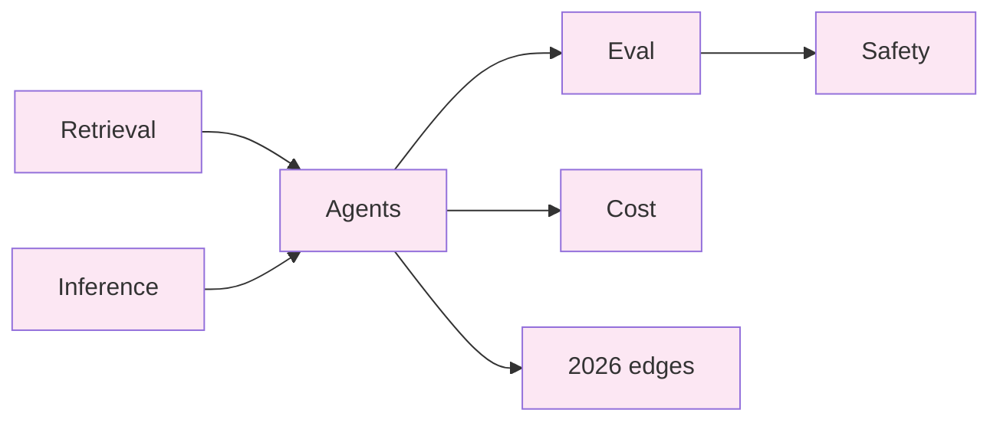

import { Cards, Card } from 'fumadocs-ui/components/card';
import { Callout } from 'fumadocs-ui/components/callout';

<Callout type="info" title="Who this is for">
You're shipping a real LLM-backed product. You don't need the 30th explainer of "what is RAG?" — you need to know why your chunk size is wrong, why your eval pipeline lies to you, why your inference is slow, and why your bill tripled last month. This section is the field manual.
</Callout>

## What's here

Twenty-six pages across seven tiers. Each page follows a fixed template: motivating problem → core insight → visual walkthrough → template code → variants → pitfalls → complexity & cost → when NOT to use → decision rule → real-world apps → curated practice questions → quick-reference card.

The voice is **production engineer**. Concrete numbers (tokens, ms, $), real failure modes from real outages, code in Python/TypeScript with the actual SDK call shapes. No "imagine if..." — every example is something you can copy-paste and adapt.

## The seven tiers

<Cards>
  <Card title="Retrieval depth" href="/ai/retrieval" description="5 pages. RAG that actually works: chunking trade-offs, embedding choice, hybrid search, rerankers, context engineering." />
  <Card title="Inference internals" href="/ai/inference" description="4 pages. Why your tokens-per-second is what it is: sampling, KV cache, batching, quantization, serving stacks." />
  <Card title="Agents" href="/ai/agents" description="4 pages. Tool use, ReAct loops, planning, memory — the patterns that turn an LLM into something that acts." />
  <Card title="Eval & observability" href="/ai/eval" description="3 pages. How you actually know it works: golden sets, LLM-as-judge, traces, regression suites." />
  <Card title="Safety & guardrails" href="/ai/safety" description="3 pages. Prompt injection, output validation, PII, jailbreaks. The OWASP top-10 of LLMs." />
  <Card title="Cost engineering" href="/ai/cost" description="2 pages. Cut your LLM bill 5-10×: prompt caching, model routing, batching, semantic dedup." />
  <Card title="2026 edges" href="/ai/edges/voice" description="5 pages. Where the field is moving NOW: voice agents, coding agents, browser agents, MCP, sandboxed execution." />
</Cards>

## How the tiers connect

You don't have to read in order — pick the tier that matches what's breaking right now. But the dependency graph is real: **retrieval** and **inference** are the substrate; **agents** is what you build on top; **eval** is how you keep it honest; **safety** and **cost** are the operational concerns that decide whether the thing lives or dies in production.

## How LLM systems differ from "regular" software

Three things that catch every team off guard the first time:

1. **The output is a distribution, not a value.** Same prompt, different answers. Your eval can't be a single equality check — you need golden sets, semantic similarity, and a tolerance for variance. [More in Eval](/ai/eval).
2. **Cost is per-token and non-linear.** A 50K-token system prompt × 10K requests/day × $3/M input tokens × 30 days = **$45,000/month** before you generate a single output token. Prompt caching, model routing, and context pruning aren't optimizations — they're the difference between a viable business and one that bleeds out. [More in Cost engineering](/ai/cost).
3. **The model is part of your attack surface.** Treat any text that flows into the model as potentially malicious — including text that came from your own database, because someone may have injected it upstream. Output is similarly untrusted: never `eval()` model output, never execute model-generated SQL without parameter binding, never trust model-emitted URLs. [More in Safety](/ai/safety).

## Mental models you'll see repeated

These appear across the tiers. Lock them in early:

- **The context is the program.** Anything you pack into the prompt — system prompt, retrieved docs, tool definitions, conversation history — IS your program. Bugs in production LLM systems are almost always context-engineering bugs, not model bugs.
- **Latency is a budget, not a number.** Voice agents have ~300ms total round-trip. Coding agents tolerate 30s. Knowing your latency budget tells you which model, which serving config, which retrieval depth.
- **Loose evals lie.** "Looks fine to me" is not an eval. If you don't have a golden set with at least 50 hand-graded examples and an automated pipeline that runs them on every prompt change, you don't have evals — you have vibes.
- **Cache before you think.** Anthropic's prompt caching, OpenAI's prompt caching, semantic dedup, embedding cache, KV cache — all of these compound. A system without caching is 5-10× more expensive AND 5-10× slower than the same system with caching.

## What's NOT here

- "How transformers work" — read the [Illustrated Transformer](https://jalammar.github.io/illustrated-transformer/) by Jay Alammar. We assume you know what attention does.
- "Should I use OpenAI vs Anthropic vs Gemini?" — depends on what you're building. Each tier discusses model choice in its own context.
- Training, fine-tuning, RLHF. This is an *application engineering* manual. If you're training base models, you're at a frontier lab and don't need this.
- Pure prompt-engineering hacks. There are 50 sites for that. We focus on patterns that survive contact with production traffic.

## Pick where to start

| If you... | Start here |
|---|---|
| Have a RAG system that returns plausible-looking-but-wrong answers | [Retrieval depth](/ai/retrieval) |
| Are getting 50 tok/s and need 500 tok/s | [Inference internals](/ai/inference) |
| Have an agent that loops forever or hallucinates tool calls | [Agents](/ai/agents) |
| Don't trust your model's outputs and need to prove they're correct | [Eval & observability](/ai/eval) |
| Are about to put a model in front of users on the open internet | [Safety & guardrails](/ai/safety) |
| Just got the AWS/OpenAI bill | [Cost engineering](/ai/cost) |
| Want to know what's actually new since GPT-4 | [2026 edges](/ai/edges/voice) |

---

> "Production LLM engineering is 90% retrieval, eval, and cost engineering, 10% prompts, and 0% prompt engineering hacks." — paraphrased from every senior AI engineer who has ever shipped.
