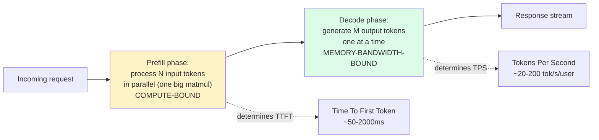
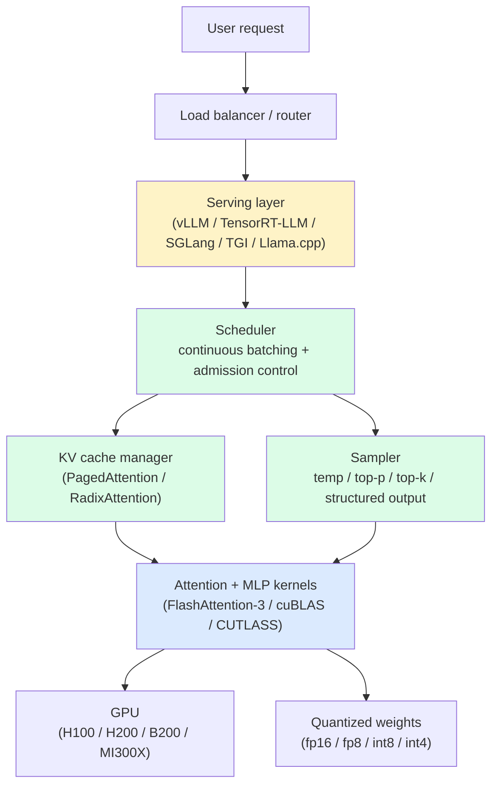
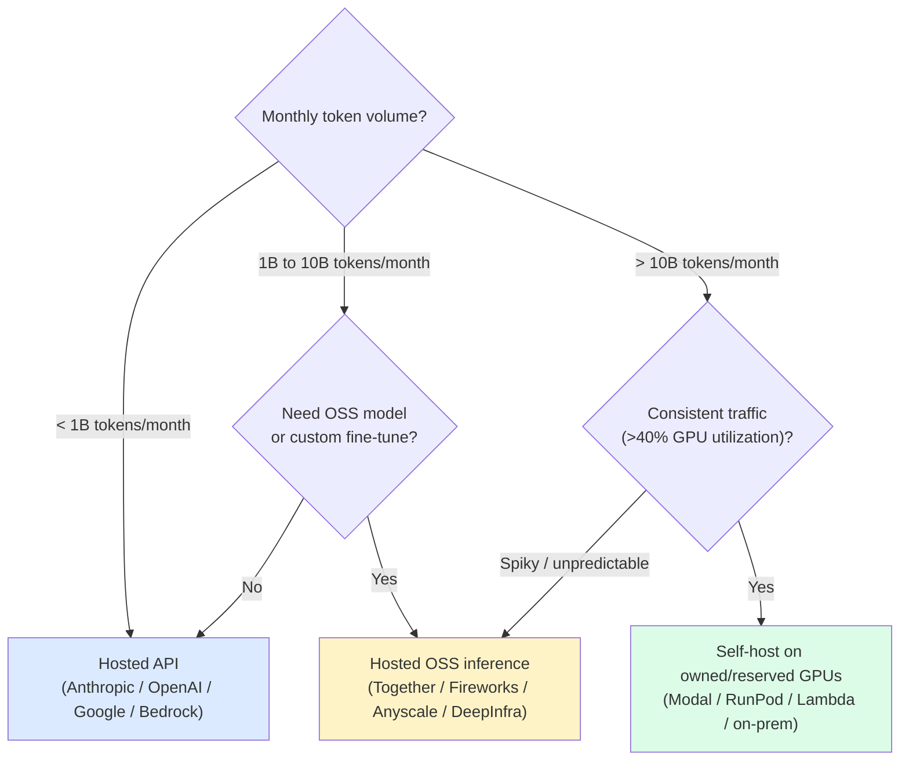

import { Cards, Card } from 'fumadocs-ui/components/card';
import { Callout } from 'fumadocs-ui/components/callout';

<Callout type="warn" title="TL;DR">
LLM inference is two completely different workloads stitched together: **prefill** (compute-bound, batched, parallelizable across tokens) and **decode** (memory-bandwidth-bound, sequential, one token at a time). TTFT is a prefill-dominated metric. Tokens/sec is a decode-dominated metric. Throughput is a batching-and-KV-cache problem. Cost-per-million is a quantization-and-GPU-choice problem. Optimize the wrong one and you'll burn three months tuning a knob that doesn't move your bill.
</Callout>

## The problem this tier solves

You shipped a feature that calls Claude or GPT-4o or a self-hosted Llama-3-70B. Now your CFO is asking why the inference bill is $40K/month. Or your PM is asking why P95 latency is 11 seconds. Or your on-call is paging because someone sent a 100K-token prompt and a single H100 fell over.

These are not "the model is slow" problems. They are **serving-stack** problems. Every one of them is a consequence of how transformer decoders actually run on GPUs — the KV cache that explodes with sequence length, the prefill phase that hammers compute while decode starves memory bandwidth, the batching scheduler that decides whose token gets generated next, the dtype the weights are stored in, the kernel that does the matmul.

If you're calling a hosted API and you never want to think about any of this — that's a legitimate choice. The numbers below tell you when that stops being economical. If you're self-hosting on Modal, Replicate, Together, Fireworks, Anyscale, RunPod, or your own H100s — every page in this tier is a lever you can pull.

## What determines throughput vs latency

The single most important distinction in inference:

**Prefill** is roughly `O(N^2 * d)` FLOPs for N input tokens and hidden dim d — but it's all one big batched matmul that saturates tensor cores. On an H100 SXM (989 TFLOPs of bf16), prefill on Llama-3-70B chews through ~3000 input tokens/sec/user. TTFT for a 2K-token prompt is ~700ms; for a 100K-token prompt it's ~33 seconds. Prefill is *compute-bound*.

**Decode** is `O(1)` per token in compute — you're doing one forward pass for one new token, with most of the attention matrix already cached. But every forward pass has to read **the entire model weights** from HBM into the SMs. On H100 (3.35 TB/s HBM bandwidth) and a 140GB fp16 Llama-3-70B, that's ~24 reads/sec, i.e. ~24 tokens/sec/user single-stream. Decode is *memory-bandwidth-bound*.

This single asymmetry explains nearly every weird production behavior:

- **"Our long-context queries are slow."** Prefill time scales near-linearly with input length. 32K-token prefill on a single H100 takes ~10 seconds before the first output token. There's no way around this without chunked prefill or speculative tricks.
- **"Tokens/sec stays the same whether we serve 1 user or 16."** Decode is bandwidth-bound and weights are shared — adding users *up to a point* is free. Eventually you saturate bandwidth or KV cache memory.
- **"Quantizing to int4 made everything ~2× faster."** Smaller weights = fewer bytes to read per token = bandwidth-bound decode goes faster proportionally. Prefill barely budges.
- **"Why does prompt caching help so much?"** Because you skip the prefill of cached prefix tokens entirely. A 50K-token system prompt cached saves ~15 seconds of TTFT per call.

## Why TTFT and tokens/sec are different problems

Most teams report one number for "latency" and it's wrong. The user experience for a chat product is governed by **two numbers**:

| Metric | What it controls | Optimized by |
|---|---|---|
| **TTFT (Time To First Token)** | Felt responsiveness — how long before the user sees *anything* | Prompt caching, chunked prefill, shorter system prompts, faster GPU (H100 → H200), tensor parallelism for prefill |
| **TPS (Tokens Per Second, decode)** | Streaming smoothness, total completion time | Quantization (smaller weights), speculative decoding, faster HBM (H100 → H200 → B200), smaller batch (less contention) |
| **Throughput (total tokens/sec across all users)** | Cost-per-million-tokens, GPU utilization | Continuous batching, larger batch sizes, PagedAttention, multi-tenant serving |
| **P99 latency** | Tail behavior — pager calls | Admission control, queue depth limits, separating prefill and decode pools |

Throughput and per-user latency *trade off*. A naive serving stack at batch size 1 gives you the lowest latency per user but ~5% GPU utilization and $50/M tokens. A maxed-out continuous-batching stack at effective batch 64 gives you 80% utilization and $0.50/M tokens — but each user sees lower TPS because they're competing for memory bandwidth. The whole job of an inference engineer is sitting at the right point on that curve.

## The inference stack at a glance

The yellow box is what you pick (vLLM vs TensorRT-LLM vs SGLang). The green boxes are what each engine does differently — the scheduler, the KV cache, and the sampler are where serving stacks compete. The blue boxes are the kernels and hardware they sit on top of.

This tier has three deep-dive pages covering the green and blue boxes:

<Cards>
  <Card title="Sampling, temperature, structured output" href="/ai/inference/sampling" description="Greedy vs sampling, temperature, top-p, top-k, min-p, frequency/presence penalties. JSON mode, constrained decoding (outlines, xgrammar, llguidance). Logprobs. Why temp=0 isn't deterministic on hosted APIs." />
  <Card title="KV cache & continuous batching" href="/ai/inference/kv-cache-batching" description="Prefill vs decode. KV cache memory math (Llama-3-70B = 327KB/token). PagedAttention, chunked prefill, prefix caching (Anthropic, vLLM, RadixAttention). Speculative decoding. Multi-LoRA serving." />
  <Card title="Quantization, speculative decoding, serving" href="/ai/inference/quantization-serving" description="fp16 → fp8 → int8 → int4. AWQ, GPTQ, SmoothQuant, EXL2, GGUF. KV cache quantization. Serving stack comparison. GPU choice (A100 / H100 / H200 / B200 / MI300X). Cost-per-million math and self-host break-even." />
</Cards>

## When to use a hosted API vs self-host

The cleanest decision rule anyone has published:

**Rough cost benchmarks (mid-2025)** for a Llama-3-70B-class workload:

| Path | $/M input tokens | $/M output tokens | Caveat |
|---|---|---|---|
| Hosted frontier (Claude Sonnet 4 / GPT-4o) | $3.00 | $15.00 | Best quality, no ops |
| Hosted OSS (Together / Fireworks, 70B) | $0.88 | $0.88 | Good quality, no ops, autoscales |
| Hosted OSS (Groq, 70B int8 on LPU) | $0.59 | $0.79 | Fastest TPS in the market |
| Self-host on H100 (Modal, reserved) | ~$0.30 | ~$0.30 | Needs >40% utilization to win |
| Self-host on H100 (on-prem, well-utilized) | ~$0.10 | ~$0.10 | Needs platform team |

The crossover where self-hosting beats a hosted OSS provider is roughly **40-50% sustained GPU utilization**. Below that, you're paying for idle GPUs; above that, you're amortizing fixed cost and the math swings in your favor. See [the quantization-serving page](/ai/inference/quantization-serving) for the full break-even math.

## What you'll learn in this tier

After reading the three deep-dive pages, you should be able to:

1. **Predict** the TTFT and decode TPS of a given model on a given GPU within ~20%. (You need the parameter count, the dtype, and the HBM bandwidth of the GPU. That's it.)
2. **Diagnose** which of prefill, decode, KV cache pressure, batching, or sampler overhead is the bottleneck of a given workload by looking at GPU utilization, HBM utilization, and per-request latency breakdowns.
3. **Choose** the right serving stack for a given workload — vLLM for general OSS, TensorRT-LLM for max throughput on NVIDIA, SGLang for high prefix-sharing workloads like agents and chat, TGI for HuggingFace ecosystem alignment, Llama.cpp for CPU/edge.
4. **Pick** the right quantization level — fp16 for max quality, fp8 for H100+ near-lossless, int8 for 2× memory savings, int4 for 4× memory savings with measurable quality drop on tasks that need precision (math, code, structured extraction).
5. **Decide** when a hosted API is the right answer (almost always, for under 1B tokens/month) and when self-hosting starts to pencil out.

## Pitfalls before you start

A few mistakes that show up in literally every team's first inference deployment:

1. **Benchmarking at batch size 1 and reporting "tokens/sec".** That's your *worst-case* throughput. Hosted providers run at effective batch sizes of 32-128. If you're comparing your self-hosted setup to a hosted API on a single-stream benchmark, you're measuring the wrong thing.
2. **Optimizing TTFT without separating prefill and decode.** If your TTFT is 4 seconds, the question is "how much of that is queue time, how much is prefill compute, how much is sampler/structured-output overhead?" The fix is completely different for each.
3. **Setting `max_tokens=4096` everywhere.** You're now reserving 4096 tokens of KV cache space per concurrent request, even for requests that finish in 50 tokens. KV cache memory is the single most contested resource in continuous batching. Set `max_tokens` tightly.
4. **Ignoring prompt caching.** Anthropic prompt caching, OpenAI prompt caching, Gemini context caching, vLLM prefix caching, SGLang RadixAttention — they all give 50-90% TTFT reductions for free on workloads with repeated prefixes (agents, RAG, chat). Most teams leave this on the table for months.
5. **Sampling at temperature 0 and expecting determinism.** It doesn't work that way. See [the sampling page](/ai/inference/sampling) for why batched inference is inherently non-deterministic on most hosted APIs.

## Where to start

If you only have time for one page in this tier, read **[KV cache & continuous batching](/ai/inference/kv-cache-batching)** — it's the single biggest mental-model upgrade for understanding any production inference system. The prefill/decode split, the KV cache memory math, and how continuous batching exploits that asymmetry are the foundation everything else builds on.

If you're tuning sampling for quality or latency (JSON outputs, agent tool calls, creative writing), start with **[Sampling, temperature, structured output](/ai/inference/sampling)**.

If you're self-hosting and choosing a quantization + GPU + serving stack, start with **[Quantization, speculative decoding, serving](/ai/inference/quantization-serving)**.

---

> Next page: [Sampling, temperature, structured output](/ai/inference/sampling) — greedy vs sampling, temperature, top-p, top-k, min-p, JSON mode, constrained decoding, and why temp=0 still isn't deterministic on most hosted APIs.
