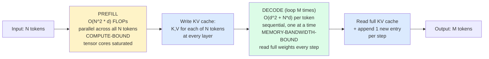
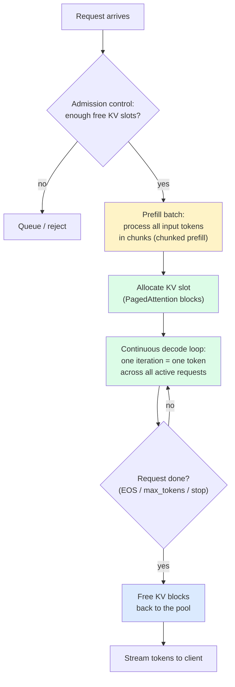
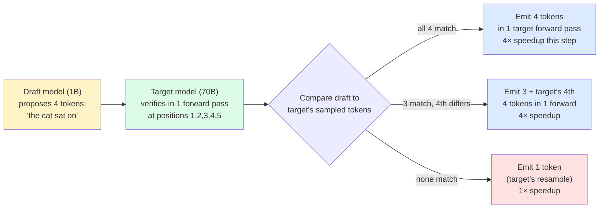
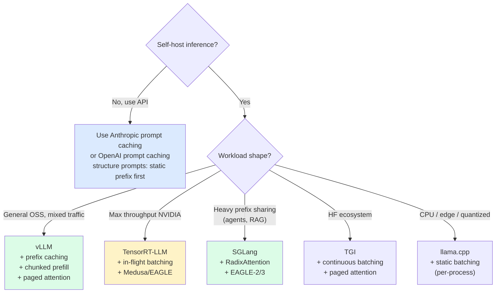

import { Callout } from 'fumadocs-ui/components/callout';

<Callout type="warn" title="TL;DR">
Decode is **memory-bandwidth-bound**: every generated token requires reading the full model weights from HBM. That's why throughput goes up when you batch (weights are shared across the batch) and why quantization speeds decode up roughly linearly with weight-byte reduction. The **KV cache** — cached keys and values from every previous token — is the second memory pressure point and the reason long-context inference is expensive. **PagedAttention** (vLLM) treats KV cache like virtual memory: paged, non-contiguous, allocated on demand. **Continuous batching** schedules at the iteration level so finished requests free their slots immediately. **Prefix caching** (Anthropic prompt caching, vLLM, SGLang RadixAttention) skips re-prefilling shared prefixes — the single biggest win for agents and RAG. **Speculative decoding** uses a draft model to propose K tokens that the target model verifies in one forward pass, giving 1.5-3× decode speedup with no quality loss.
</Callout>

## The problem this solves

You serve Llama-3-70B on a single H100 (80GB) with naive HuggingFace `transformers`. Single user, single request, the model spits out 25 tokens/sec. Looks fine. You add a second concurrent user — both users drop to 12 tokens/sec. You add a third — they all drop to 8. A user with a 32K-token prompt joins and immediately OOMs everyone else.

Now look at GPU utilization: ~8%. You have a $30K GPU running at 8% utilization producing 36 tokens/sec across three users. The hosted API equivalent gets ~200 tokens/sec/user at 80% GPU utilization. You are losing on every dimension at once.

The issue isn't the model or the hardware. It's that naive `transformers.generate` does **request-level static batching**: one batch per request, batch dimension 1, KV cache contiguously allocated to `max_length` regardless of actual length. Every architectural decision is the wrong one for serving.

This page is the fix. Understanding why production serving stacks (vLLM, TensorRT-LLM, SGLang) hit 70%+ GPU utilization on the same hardware comes down to four concepts: **prefill vs decode**, the **KV cache**, **continuous batching**, and **prefix caching**.

## The core insight

LLM inference is two fundamentally different workloads:



**Prefill** is one big matmul over all N input tokens. On H100 (989 TFLOPs bf16), prefill chews through ~3000-5000 input tokens/sec for a 70B model. Compute-bound. Adding more users to the batch doesn't help much during prefill — you're already saturating the tensor cores.

**Decode** is one forward pass per output token. Each pass reads the full model weights (140GB for Llama-3-70B fp16) from HBM. On H100 (3.35 TB/s HBM), that's ~24 reads/sec, i.e. ~24 tokens/sec single-user. Memory-bandwidth-bound. Adding more users to the batch is **nearly free in compute** — the weights only have to be read once and reused across the batch. This is the entire reason batching works.

The KV cache exists so that decode doesn't have to re-do prefill on every step. For each generated token, you only need to compute Q for the new token, then attend over the full cached K and V from all previous tokens. Without the cache, each decode step would cost O(N) prefill work.

## KV cache memory math

Here's the formula every inference engineer should have memorized:

```
KV cache size = 2 × num_layers × num_kv_heads × head_dim × seq_len × batch × dtype_bytes
```

Breaking it down:

- **2**: one for K, one for V.
- **num_layers**: every transformer layer has its own K/V tensors.
- **num_kv_heads**: with multi-head attention (MHA), this equals num_attention_heads. With grouped-query attention (GQA) — used by Llama-3, Mistral, Claude — it's smaller (Llama-3-70B uses 8 KV heads for 64 attention heads, so 8× memory savings vs MHA).
- **head_dim**: hidden_dim / num_attention_heads (Llama-3-70B = 8192/64 = 128).
- **seq_len**: how many tokens deep (input + generated so far).
- **batch**: how many requests share the cache (concurrent decode).
- **dtype_bytes**: 2 for fp16/bf16, 1 for fp8/int8, 0.5 for int4.

**Llama-3-70B, fp16, per-token KV cache:**

```
2 × 80 layers × 8 kv_heads × 128 head_dim × 2 bytes = 327,680 bytes ≈ 320 KB/token
```

A 128K-context session: 128,000 × 320KB = **41 GB just for one user's KV cache**. On an H100 (80GB), after the 140GB model that doesn't fit even with tensor parallelism — you need TP=2 to split the weights, then each H100 holds 70GB of weights + room for KV cache.

**Llama-3-8B, fp16:**

```
2 × 32 layers × 8 kv_heads × 128 head_dim × 2 bytes = 131,072 bytes = 128 KB/token
```

128K context = 16 GB. Fits on one H100 alongside the 16GB model. This is why small models are so much cheaper to serve at long context.

**GPT-3 175B (original, multi-head attention, no GQA):**

```
2 × 96 layers × 96 heads × 128 × 2 = 4.7 MB/token
```

This is why GQA was such a big deal. Multi-Query Attention (MQA, used in early Falcon and PaLM) takes this further: one shared KV head for all attention heads, so 96× less than MHA. GQA-8 is the modern compromise — most quality of MHA, ~8× less KV cache.

**MLA (Multi-head Latent Attention, DeepSeek-V2/V3)** is the new frontier: a low-rank compressed KV cache that's ~5-10× smaller than GQA. Why DeepSeek-V3 can serve 128K context at competitive cost.

## Visual: the lifecycle of a request in continuous batching



The two crucial properties:

1. The scheduler decides **at every iteration** which requests are in the batch. New requests join immediately; finished ones free their slots immediately. No request waits for the slowest one in its batch.
2. KV cache memory is allocated **per-block** (typically 16 tokens/block), not per-request. A 50-token response uses 4 blocks. A 5000-token response uses 313 blocks. Memory is reclaimed in 16-token increments.

This is what continuous batching gets you. The naive alternative — static batching, where you wait until you have batch_size requests, prefill them together, decode together, return together — wastes ~50% of compute waiting for the longest sequence in each batch.

## The four big ideas, ranked

### 1. Continuous (iteration-level) batching

Originally from the Orca paper (Yu et al., OSDI 2022). Adopted by vLLM, TGI, TensorRT-LLM, SGLang, every modern serving stack.

The mental model: instead of "process N requests as one batch from start to finish", schedule one **decode iteration** at a time. At each iteration, the scheduler picks the active requests from the pool, runs one forward pass to generate one token for each, then returns control to the scheduler. New requests can join the next iteration. Finished requests drop out the same iteration they hit EOS.

```python
# Conceptual pseudocode
while True:
    # Admit new requests until KV cache is full
    while can_admit_new_request():
        req = queue.pop()
        prefill(req)  # runs separately, often interleaved with decode

    # Decode one token for every active request, all in one forward pass
    active = scheduler.pick_active_requests()
    next_tokens = model.decode_step(active)  # one big batched matmul

    for req, tok in zip(active, next_tokens):
        req.append(tok)
        if req.is_done():
            scheduler.finish(req)  # frees KV blocks immediately
            stream_back(req)
```

**Throughput gain over static batching:** typically 4-10× depending on length variance.

### 2. PagedAttention (vLLM)

Kwon et al., SOSP 2023. The single most influential paper on inference serving.

**The problem PagedAttention solves:** naive serving allocates KV cache as one contiguous tensor of shape `[max_seq_len, kv_dim]` per request. If `max_seq_len=4096` but the request only generates 200 tokens, you've wasted ~95% of that allocation. Across many concurrent requests, this fragmentation can leave you with 60% of HBM wasted on padding.

**The fix:** treat KV cache like virtual memory in an OS. Break it into fixed-size **blocks** (typically 16 tokens). Maintain a **block table** per request mapping logical positions to physical blocks. Allocate blocks on demand, free them when done. Blocks don't have to be contiguous.

```
Request A (seq_len=50):  blocks = [12, 7, 28, 4]    # 4 blocks × 16 tokens = 64 capacity
Request B (seq_len=130): blocks = [3, 19, 8, 22, 11, 1, 14, 26, 9]  # 9 blocks × 16 = 144 capacity
```

The attention kernel is rewritten to gather K and V from a list of block addresses rather than assuming contiguous memory. Costs ~5% in kernel overhead vs contiguous, saves ~50%+ memory in practice, lets you fit 2-4× more concurrent requests in the same HBM.

**This is what made vLLM the OSS default.** TensorRT-LLM and SGLang have since implemented their own paged-KV variants.

### 3. Chunked prefill (sarathi-serve)

From the Sarathi-Serve paper (Agrawal et al., 2024). Now in vLLM, TensorRT-LLM, SGLang.

**The problem:** prefill for a 32K-token prompt takes ~10 seconds on H100. During those 10 seconds, decode requests sharing the same GPU stall. Their TPS goes to zero. P99 latency tanks.

**The fix:** split prefill into chunks (typically 1K-4K tokens per chunk). Each chunk runs as a "prefill mini-iteration" that's interleaved with decode iterations. Long prefill no longer blocks decode; the long-prompt request just takes longer to finish prefilling, but every other request keeps generating tokens.

Trade-off: chunked prefill is slightly less compute-efficient than full prefill (matmul tiles work better at large sizes), but the latency stability is worth it for multi-tenant serving. Most production vLLM and TensorRT-LLM deployments enable chunked prefill by default in 2025.

### 4. Prefix caching / prompt caching

If two requests share a prefix — system prompt, long context document, agent scratchpad — you can compute the KV cache for that prefix **once** and reuse it. The savings are enormous: a 50K-token system prompt that would take ~15 seconds to prefill is served in microseconds (just a KV cache lookup).

**Three implementations to know:**

**Anthropic prompt caching** (hosted): you mark a span of your prompt with `cache_control: {"type": "ephemeral"}`. Anthropic caches it for ~5 minutes. Subsequent calls within that window pay 10% of the input price for the cached portion (90% discount).

```python
import anthropic

client = anthropic.Anthropic()

response = client.messages.create(
    model="claude-sonnet-4-5-20250929",
    max_tokens=1024,
    system=[
        {
            "type": "text",
            "text": "You are an expert legal assistant.",
        },
        {
            "type": "text",
            "text": LONG_LEGAL_DOCUMENT,  # 50,000 tokens
            "cache_control": {"type": "ephemeral"},  # cache this
        },
    ],
    messages=[{"role": "user", "content": "Summarize section 12."}],
)
# First call: full input price + ~5s TTFT
# Subsequent calls within 5 min: 10% of input price + ~50ms TTFT
```

**OpenAI prompt caching** (hosted, automatic): caches prefixes of >=1024 tokens automatically. You get a 50% discount on cached input. No code change required, but it only triggers when the prefix is byte-for-byte identical. Order your messages carefully — put the long static system prompt first, then variable user content.

**vLLM prefix caching** (self-host, automatic): enable with `--enable-prefix-caching`. vLLM hashes prefix blocks and reuses cached KV blocks across requests that share prefixes. Works for both system prompts and shared context.

**SGLang RadixAttention** (self-host, the most sophisticated): organizes all active prefixes as a radix tree. Any prefix shared by any two requests gets its KV cache shared. Particularly effective for:
- Agents that fork from a shared trajectory (LATS, ToT, MCTS).
- Few-shot prompting where the few-shot examples are identical across calls.
- Batch evaluations where the system prompt is shared.

SGLang's published benchmarks show 2-6× throughput improvements on agent-style workloads vs vLLM, primarily from RadixAttention.

```python
# SGLang example showing shared prefix usage
import sglang as sgl

sgl.set_default_backend(sgl.RuntimeEndpoint("http://localhost:30000"))

@sgl.function
def multi_turn(s, history, question):
    s += sgl.system(SHARED_SYSTEM_PROMPT)  # Cached after first call
    s += sgl.user(question)
    s += sgl.assistant(sgl.gen("answer", max_tokens=512))

# Each call reuses the system prompt's KV cache automatically via RadixAttention.
```

**Practical advice:** any production workload with a system prompt > 1000 tokens should be using prefix caching. Forgetting this is the most common "we're paying 5× more than we should" mistake.

### 5. Speculative decoding

From Leviathan, Kalai, Matias 2023 ("Fast Inference from Transformers via Speculative Decoding") and Chen et al. 2023 ("Accelerating Large Language Model Decoding with Speculative Sampling") simultaneously.

**The idea:** use a small fast "draft" model to propose K candidate next tokens. Run the target model **once** on the draft + K, getting logits at every position in one forward pass. Accept the longest prefix of draft tokens that match what the target model would have sampled. Reject and re-sample at the first mismatch.



**Why it works:** the verify step is one forward pass at sequence length `current + K`, which is the *same* compute as a normal forward pass (memory-bandwidth-bound on weights, with K cheap extra positions). If the draft model is reasonably accurate (~70%+ token agreement with target), you accept on average 2-4 tokens per verify step. Net 1.5-3× decode speedup, **with the same output distribution as the target model alone** — provably lossless.

**Variants:**

- **Vanilla speculative decoding**: separate draft model (e.g. Llama-3-8B drafting for Llama-3-70B). Simple but adds memory overhead for the draft.
- **Medusa** (Cai et al., 2024): add multiple "Medusa heads" on top of the target model that predict tokens at offsets +1, +2, +3, +4. Same model, fine-tuned briefly. ~2× speedup with no draft model.
- **EAGLE / EAGLE-2 / EAGLE-3** (Li et al., 2024-2025): predict at the feature level (not token level), using a tiny autoregressive head over hidden states. Best published acceptance rates — EAGLE-3 reports ~3-4× speedup on Llama-3-70B.
- **Self-speculative decoding (Llama-3)** / **Lookahead decoding**: use the target model itself with a sliding-window technique to draft its own future tokens. No extra parameters but lower acceptance rates.
- **Multi-token prediction (Gloeckle et al., 2024)** — built into the training objective of newer models like DeepSeek-V3. The model natively predicts N tokens per forward pass.

**Real-world adoption:**
- TensorRT-LLM supports Medusa, EAGLE, draft-target, and lookahead.
- vLLM supports draft-target speculative decoding (Medusa support added in vLLM 0.6+).
- SGLang supports EAGLE-2/EAGLE-3.
- Anthropic and OpenAI almost certainly use some form of speculative decoding in production — neither has confirmed details publicly, but you can infer it from the suspiciously fast decode TPS on large models.

### 6. Multi-LoRA serving

If you've fine-tuned 50 LoRA adapters on top of one base model (different customers, different domains, different fine-grained tasks), you don't want 50 separate model deployments. Multi-LoRA serving keeps the **base weights loaded once** in HBM and **swaps small LoRA adapters per-request**. vLLM (`--enable-lora`), TensorRT-LLM, and SGLang all support this. LoRA adapters are small (typically 10-100MB each at rank 16-64) so you can hold hundreds of them in HBM simultaneously.

```python
# vLLM multi-LoRA example
from vllm import LLM
from vllm.lora.request import LoRARequest

llm = LLM(
    model="meta-llama/Llama-3.1-8B-Instruct",
    enable_lora=True,
    max_loras=8,
    max_lora_rank=32,
)

sql_lora = LoRARequest("sql-lora", 1, "/path/to/sql-lora")
medical_lora = LoRARequest("medical-lora", 2, "/path/to/medical-lora")

outputs = llm.generate(
    ["Translate this question to SQL: ..."],
    lora_request=sql_lora,
)
```

Throughput vs separate deployments: usually 5-10× better utilization at the cost of ~10-20% per-request latency (LoRA matmul overhead).

## A vLLM offline-batching example

The minimum useful vLLM script for benchmarking your model on your hardware:

```python
from vllm import LLM, SamplingParams

llm = LLM(
    model="meta-llama/Llama-3.1-70B-Instruct",
    tensor_parallel_size=2,           # 2× H100s, 4× H100s, etc.
    dtype="bfloat16",
    gpu_memory_utilization=0.92,      # leave a little headroom
    max_model_len=32768,              # cap context to control KV cache footprint
    enable_prefix_caching=True,       # FREE for shared prefixes
    enable_chunked_prefill=True,      # mix prefill with decode iterations
    max_num_batched_tokens=8192,      # tune for throughput vs latency
    max_num_seqs=256,                 # max concurrent requests
)

sampling = SamplingParams(temperature=0.7, top_p=0.95, max_tokens=512)
prompts = ["..."] * 1000

# Continuous batching is automatic — vLLM schedules these N requests
# as a single async stream and keeps GPU utilization high.
outputs = llm.generate(prompts, sampling)

for o in outputs:
    print(o.outputs[0].text)
```

For a serving deployment, run `vllm serve meta-llama/Llama-3.1-70B-Instruct --tensor-parallel-size 2 --enable-prefix-caching --enable-chunked-prefill` and hit it with the OpenAI-compatible API.

## Pitfalls

### Pitfall 1: setting `max_tokens` too high

`max_tokens=4096` reserves 4096 tokens of KV cache headroom per concurrent request. With 256 concurrent requests at Llama-3-70B (320KB/token), that's 256 × 4096 × 320KB = **335 GB of KV cache headroom**. Doesn't fit. The scheduler refuses to admit more than a few concurrent requests and your throughput collapses.

**The fix:** set `max_tokens` to roughly the 95th percentile of your actual response length, not the worst case. If 95% of responses are < 800 tokens, set `max_tokens=800` and let the rare long one truncate.

### Pitfall 2: long-tail prefill blocking decode

A user submits a 64K-token prompt. Your serving stack spends 20 seconds prefilling it. During those 20 seconds, every other user's TPS drops to ~zero. P99 latency spikes.

**The fix:** enable chunked prefill (`--enable-chunked-prefill` in vLLM). The long prefill is split into 2K-token chunks that interleave with decode iterations. Slightly worse compute efficiency, dramatically better P99 latency.

**Further fix:** separate prefill and decode pools entirely ("disaggregated prefill", coming in vLLM 0.7+, TensorRT-LLM, and SGLang). Long prefills run on a separate set of GPUs; decode runs on its own pool that's never blocked. Anthropic and DeepSeek-V3 are widely believed to use this pattern.

### Pitfall 3: forgetting prefix caching is byte-sensitive

Your prompt template is:

```
System: You are a helpful assistant. Today is 2025-06-14.
User: ...
```

Tomorrow your date string changes to `2025-06-15`. **The prefix cache invalidates.** Same for any timestamp, random session ID, or unique user identifier baked into the system prompt.

**The fix:** put variable content (dates, IDs) at the *end* of the prompt, after the cacheable prefix. Or use `{date}` placeholders that don't appear in the cached portion.

### Pitfall 4: not realizing GQA / MQA changed the KV cache math

If you grep an old blog post for "KV cache size", you'll find formulas using `num_attention_heads`. That was MHA-era. Modern models use GQA (Llama-3, Mistral, Gemma) or MLA (DeepSeek-V3). The right multiplier is `num_kv_heads`, not `num_attention_heads`. Llama-3-70B has 64 attention heads but only 8 KV heads — 8× less KV cache than the naive formula would suggest. Don't mis-size your hardware budget.

### Pitfall 5: assuming continuous batching is "free"

It's nearly free in the average case but introduces tail-latency variance. When the scheduler decides to admit a new long-prompt request, decode iterations for existing requests can stall for the duration of that request's chunked-prefill chunks. P99 latency under continuous batching is harder to reason about than under static batching.

**The fix:** set admission-control limits — `--max-num-seqs` and `--max-num-batched-tokens`. Refuse new requests when the system is saturated; let the load balancer queue them. Predictable rejection beats unpredictable stall.

### Pitfall 6: not using prefix caching on agents

An agent that calls `gen(scratchpad + step_i)` for `i = 1..N` re-prefills the entire scratchpad on every step. By step 5, you're re-processing 4000+ tokens that you already processed in step 4. Use prefix caching (Anthropic, vLLM, SGLang RadixAttention) or you're paying ~5× more than necessary on every agent.

### Pitfall 7: enabling speculative decoding without checking acceptance rate

If your draft model has under 40% token acceptance with the target, speculative decoding **slows you down** — you pay the verify-step overhead with no benefit. Always measure acceptance rate on your workload before turning it on. Code-generation workloads tend to have very high acceptance (tokens are very predictable: `def`, `(`, `self`, `,`); free-form chat has lower acceptance.

## Complexity and cost

| Technique | Implementation effort | Throughput gain | Latency impact | Quality impact |
|---|---|---|---|---|
| Static batching → continuous batching | Switch serving stack (vLLM) | 4-10× | Better mean, slightly worse tail | None |
| PagedAttention | Free with vLLM/TGI/SGLang | 2-3× (more concurrent requests) | None | None |
| Chunked prefill | Flag in vLLM/TensorRT-LLM | 1.1-1.3× | Much better P99 | None |
| Prefix caching (vLLM/SGLang) | Flag, plus prompt structure | 2-6× on agents/RAG | Much better TTFT | None |
| Anthropic prompt caching | `cache_control` annotation | N/A (hosted) | 90% TTFT reduction for cached portion | None |
| Speculative decoding (vanilla) | Configure draft model | 1.5-2× decode | Better TPS | None (provably) |
| Medusa / EAGLE | Fine-tune heads, wire in TensorRT-LLM | 2-3× decode | Better TPS | None |
| Multi-LoRA serving | Adapter management | 5-10× vs separate deployments | +10-20% per-req latency | None |
| MoE routing optimizations | Stack-dependent | 2-4× | Variable | None if implemented right |

## When NOT to use these

Three cases where the standard playbook doesn't apply:

1. **Batch size 1, hard real-time latency targets** — interactive voice agents, autocomplete. You don't *want* continuous batching dragging in other requests that contend for memory bandwidth. Run dedicated GPUs per user (expensive but predictable). Disable speculative decoding if the draft step adds even 5ms to TTFT.

2. **Tiny models on edge** (< 3B params, Phi-3, Gemma-2B) on CPU or mobile GPU. The serving stacks here are llama.cpp / MLX / ONNX Runtime; KV cache management is much simpler because you're already at batch 1 and bandwidth-bound on a much weaker memory subsystem. Most of the techniques above don't apply.

3. **Single-shot embedding/classifier workloads.** Continuous batching, prefix caching, speculative decoding all assume *autoregressive decoding*. Encoder-only or single-token-output models don't need any of this — use Triton Inference Server or HuggingFace TEI instead of vLLM.

## Decision rule



## Real-world stacks

- **vLLM**: the OSS default. Originated PagedAttention. Most permissive integration story (works with most HuggingFace models out of the box). `--enable-prefix-caching` and `--enable-chunked-prefill` are the two flags everyone forgets to turn on.
- **TensorRT-LLM**: NVIDIA's serving stack. Fastest throughput on NVIDIA hardware (H100, H200, B200). Steeper integration cost — you compile models into TRT engines per (model, GPU, batch, precision) combo. In-flight batching is NVIDIA's equivalent of continuous batching.
- **SGLang**: from LMSYS / Berkeley. RadixAttention is the winner for prefix-heavy workloads (agents, ToT, RAG). Sometimes faster than vLLM on long-context benchmarks. Their LLM-as-judge benchmarks (lmsys.org) run on SGLang.
- **TGI (Text Generation Inference)**: HuggingFace's serving stack. Lower OSS share than vLLM but tight integration with HF Hub. Used by HF Inference Endpoints, AWS SageMaker JumpStart.
- **Llama.cpp**: CPU and edge. GGUF format. The community-favorite for local-LLM tinkering and Mac inference. Doesn't do continuous batching (single-process model) but supports batched parallel decoding with `--parallel`.
- **MLC-LLM**: cross-platform (WebGPU, mobile). Less production share but interesting for client-side inference.
- **Anthropic**: prompt caching released April 2024, formalized August 2024. Cached prefix is 10% of input cost, 5-minute TTL. Almost certainly uses something like PagedAttention + chunked prefill + speculative decoding internally; specifics not public.
- **OpenAI**: prompt caching released October 2024, automatic on prefixes >=1024 tokens, 50% input discount. Almost certainly uses speculative decoding internally on `gpt-4o-mini` and `gpt-4o`; the cheap-and-fast `gpt-4o-mini` decode TPS is otherwise inexplicable.
- **Modal**: serverless GPU inference. Built-in support for vLLM, SGLang, TensorRT-LLM containers. Cold starts are the main concern — Modal has fast snapshot-based cold-start tech ("MemorySnapshot") to keep weights warm.
- **Replicate / Together / Fireworks / Anyscale / DeepInfra**: hosted OSS-model serving. Each picks a serving stack (Together heavily uses TensorRT-LLM and their proprietary "Together Inference Engine"; Fireworks uses their FireAttention forks of vLLM; Anyscale uses a Ray-based stack). All expose OpenAI-compatible APIs.
- **Groq**: not a serving stack but a custom LPU chip. Streams weights into SRAM at much higher bandwidth than HBM, so decode TPS dominates. Famous ~250 tokens/sec on Llama-3-70B int8.
- **DeepSeek-V3**: published their inference setup — uses disaggregated prefill/decode pools, MLA (Multi-head Latent Attention) to shrink KV cache ~7×, FP8 weights. Their inference is dramatically cheaper than expected for the 671B param count because of these architectural choices.

## Curated questions to practice

1. Your Llama-3-70B serving stack has 80% GPU utilization but P99 TTFT is 9 seconds. Walk through which knob you tune first, and why. (Hint: TTFT and throughput optimize differently.)
2. You enabled vLLM prefix caching but your hit rate is 5% on what you thought was a prefix-heavy agent workload. What are the three most likely root causes?
3. A user reports getting different responses to identical requests at `temperature=0`. They're using a self-hosted vLLM. Is this a sampling issue or a batching issue? How would you confirm?
4. You're sizing GPUs for a Llama-3-8B serving deployment that needs to handle 100 concurrent users at 32K context. Compute the minimum KV cache HBM you need (use the formula). Compare with and without GQA.
5. You enable Medusa speculative decoding and your throughput **drops** by 15%. What's the most likely explanation, and how do you diagnose it?

## Quick-reference card

| Topic | Answer |
|---|---|
| **KV cache size formula** | `2 × layers × kv_heads × head_dim × seq_len × batch × dtype_bytes` |
| **Llama-3-70B KV cache** | ~320 KB/token at fp16, 8 GQA heads |
| **Prefill profile** | Compute-bound, parallel, TTFT-dominated |
| **Decode profile** | Memory-bandwidth-bound, sequential, TPS-dominated |
| **Default OSS serving stack** | vLLM with `--enable-prefix-caching --enable-chunked-prefill` |
| **Max throughput on NVIDIA** | TensorRT-LLM |
| **Prefix-heavy (agents, RAG)** | SGLang RadixAttention |
| **Prompt caching savings (Anthropic)** | 90% of input price, ~50ms TTFT vs full prefill |
| **Prompt caching savings (OpenAI)** | 50% of input price, automatic on >=1024-token prefixes |
| **Speculative decoding speedup** | 1.5-3× on decode TPS, provably no quality loss |
| **Killer pitfall #1** | `max_tokens` too high — wastes KV cache budget |
| **Killer pitfall #2** | Prefix cache invalidated by a date or session ID in the system prompt |
| **Killer pitfall #3** | Forgetting chunked prefill — long prompts block all decode |
| **Killer pitfall #4** | Speculative decoding on a workload with low draft-acceptance rate |
| **What to read next** | [Quantization, speculative decoding, serving](/ai/inference/quantization-serving) |

---

> Next page: [Quantization, speculative decoding, serving](/ai/inference/quantization-serving) — fp16 vs fp8 vs int8 vs int4, AWQ/GPTQ/SmoothQuant, KV cache quantization, full serving-stack comparison, GPU choice, and self-host break-even math.
