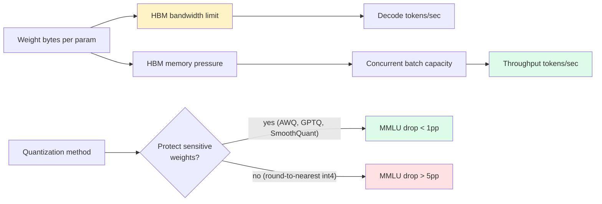
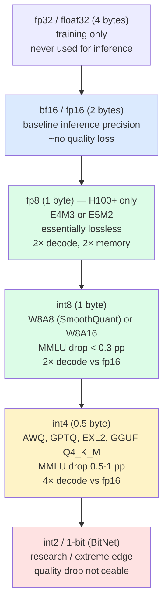
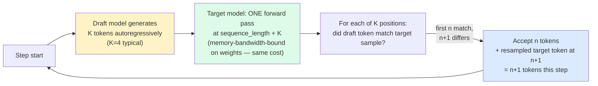
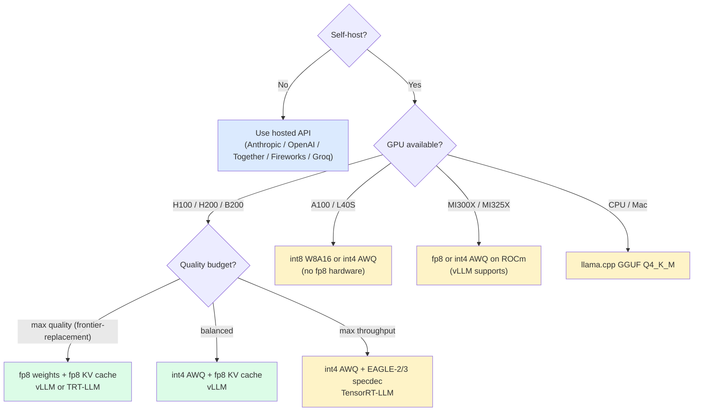

import { Callout } from 'fumadocs-ui/components/callout';

<Callout type="warn" title="TL;DR">
**Quantization speeds decode roughly linearly with weight-byte reduction** because decode is HBM-bandwidth-bound. fp16 → int8 ≈ 2× faster, fp16 → int4 ≈ 4× faster. Quality cost is small with modern methods: AWQ-int4 typically loses &lt;0.5 pp on MMLU, GPTQ-int4 ~0.5-1 pp, **fp8 on H100 is essentially lossless**. KV cache quantization (fp8 KV) saves another ~2× on memory at near-zero quality cost. Speculative decoding multiplies on top of quantization. **Serving stack picks**: vLLM for general OSS, TensorRT-LLM for max NVIDIA throughput, SGLang for prefix-heavy workloads, TGI for HF ecosystem, llama.cpp for CPU/edge. **GPU picks**: H100 is the workhorse, H200 doubles HBM (better for long context), B200 doubles compute + HBM bandwidth, MI300X has the most HBM (192GB) for the largest models. **Self-host beats hosted OSS APIs at ~40-50% sustained GPU utilization** — below that, just pay Together/Fireworks.
</Callout>

## The problem this solves

You self-host Llama-3-70B in fp16 on two H100s with tensor parallelism. Decode TPS per user is 22 tokens/sec. Throughput across the system at 16 concurrent users is 350 tokens/sec. The bill is $5/hour for the two H100s. Your cost-per-million-output-tokens works out to ~$4.00 — three times worse than Together's hosted Llama-3-70B at $0.88/M.

You're losing on two fronts. Quality is fine; the math is hostile. The fix is:

1. **Quantize** the model so each decode forward pass reads less data from HBM (decode is bandwidth-bound; less data = more tokens/sec).
2. **Speculative decoding** to issue multiple tokens per forward pass.
3. **Right-sized GPU** — running a 70B on two H100s when you could run it on one H200, or four 70Bs on one B200, changes the unit economics.
4. **Right serving stack** — TensorRT-LLM with int4 AWQ + EAGLE-2 specdec hits >3× the throughput of stock vLLM fp16 on the same hardware.

This page is the engineer's reference for all four levers.

## The core insight

Two facts dominate everything in this page:

1. **Decode is memory-bandwidth-bound.** Every generated token reads the model weights once. If you halve the weight size, you roughly double the decode TPS. This is why quantization is so powerful on the decode side.

2. **Quantization quality loss is non-uniform across layers.** Attention layers and the final LM head are sensitive (quantize them and quality collapses); MLP layers are forgiving. Modern methods (AWQ, GPTQ, EXL2, FP8) handle this by *protecting sensitive weights* — keeping some at higher precision while aggressively quantizing the bulk. This is why "int4" doesn't actually mean "every weight is 4 bits".



## The precision ladder

Five precision levels you'll see in practice, from highest quality to most aggressive:



The sweet spot for most production self-hosting in 2025 is **int4 weight-only (AWQ or GPTQ)** on H100/H200 for OSS models, or **fp8 weight + fp8 activation** on H100/H200 for frontier-quality serving.

## The six quantization methods, ranked

### 1. fp16 / bf16 (no quantization)

The baseline. bf16 has 8 exponent bits + 7 mantissa bits (vs fp16's 5+10). bf16 has the same dynamic range as fp32, less precision; it's the modern default because training is more stable with the wider exponent. For inference, bf16 and fp16 are interchangeable in quality. Llama-3, Mixtral, DeepSeek, Qwen are all distributed in bf16.

**Memory**: 70B × 2 bytes = 140 GB.
**Why use**: max quality, baseline for comparison, default for new model releases.

### 2. fp8 (H100+ only)

Two flavors: **E4M3** (4 exponent + 3 mantissa, used for weights and most activations) and **E5M2** (5+2, used for gradients in training and some activations in inference). Hardware-native on Hopper (H100, H200) and Blackwell (B100, B200). Older GPUs (A100, L40S) do not have fp8 tensor cores.

**Memory**: 70B × 1 byte = 70 GB. Fits on one H200 (141 GB HBM) with KV cache headroom.
**Speed**: ~2× decode TPS vs bf16 on H100.
**Quality**: essentially lossless on most benchmarks. NVIDIA, Mistral, DeepSeek (V3 is natively fp8) have published extensive numbers. fp8 is the new fp16 for Hopper-class hardware.

```bash
# vLLM with fp8 weights and activations on H100
vllm serve neuralmagic/Meta-Llama-3.1-70B-Instruct-FP8 \
  --tensor-parallel-size 2 \
  --enable-prefix-caching
```

NeuralMagic / Red Hat AI maintain a large library of fp8-quantized OSS models on HuggingFace.

### 3. int8 — W8A16 (weight-only) and W8A8 (SmoothQuant)

**W8A16** (weight-only int8): weights are int8 (1 byte), activations stay at fp16. Halves the weight memory and roughly doubles decode TPS. Simplest to implement; quality loss is tiny (~0.1-0.3 pp on MMLU).

**W8A8** (SmoothQuant, Xiao et al. 2022): both weights and activations are int8. The catch — activations have outliers that, when quantized naively, cause big quality drops. SmoothQuant pre-multiplies activations by a per-channel scaling factor that *smooths* the outliers, then quantizes. Used heavily in TensorRT-LLM and FBGEMM (the Meta inference stack).

**Memory**: 70B × 1 byte = 70 GB weights (same as fp8).
**Speed**: ~2× decode vs fp16. Slightly worse than fp8 on H100 because int8 doesn't use the new fp8 tensor cores.
**When to use**: A100 inference (no fp8 hardware support), older GPUs.

### 4. int4 weight-only — AWQ, GPTQ, EXL2

The most impactful quantization tier for self-hosting OSS. Weights are int4 (0.5 byte), activations stay at fp16 or fp8.

**GPTQ** (Frantar et al. 2022): post-training quantization that uses the Optimal Brain Surgeon idea — for each weight matrix, quantize one column at a time, then update the remaining columns to compensate for the rounding error. Slow to quantize (~1-4 hours for a 70B), fast to serve. Slightly higher quality loss than AWQ.

**AWQ** (Lin et al. 2023, "Activation-aware Weight Quantization"): identifies salient weight channels by examining which activations they multiply with. Protects the top ~1% of channels by keeping them at higher precision. Faster to quantize than GPTQ, ~equal or better quality. **The current consensus default for int4 OSS serving.**

**EXL2** (turboderp): GPTQ-derivative with variable bits-per-weight (some weights at 2 bits, some at 8, average ~4). Most flexible but specific to ExLlamaV2 runtime, mostly used by the local-LLM-on-consumer-GPU community.

**GGUF Q4_K_M** (llama.cpp): the de facto format for CPU + Mac inference. Uses k-quants — different bit-widths for different parts of each weight matrix. The Q4_K_M variant is the most popular "good enough" quantization for local use.

**Memory**: 70B × 0.5 byte = 35 GB. Fits on one H100 (80 GB) with substantial KV cache headroom. Or fits on one RTX 4090 (24 GB) if you use a 32B model.
**Speed**: ~3-4× decode vs fp16.
**Quality**: AWQ-int4 typically loses 0.5-1 pp on MMLU vs fp16; GPTQ-int4 loses ~0.5-1.5 pp. For agentic tasks that require precision (math, code, JSON tool calls), test before committing — the drop can be larger.

```python
# vLLM with AWQ
from vllm import LLM, SamplingParams

llm = LLM(
    model="hugging-quants/Meta-Llama-3.1-70B-Instruct-AWQ-INT4",
    tensor_parallel_size=1,           # fits on 1× H100
    dtype="auto",
    gpu_memory_utilization=0.9,
    quantization="awq",
    max_model_len=32768,
)

sampling = SamplingParams(temperature=0.7, top_p=0.95, max_tokens=512)
outputs = llm.generate(["Write a haiku about HBM bandwidth."], sampling)
```

### 5. KV cache quantization (fp8 KV)

Independent from weight quantization. The KV cache is fp16 by default; quantizing it to fp8 (or int8) halves the per-token KV cache memory, doubling the concurrent batch capacity at the same context length. Quality loss is essentially zero for fp8 KV; small but measurable for int8.

```bash
vllm serve meta-llama/Llama-3.1-70B-Instruct \
  --kv-cache-dtype fp8 \
  --tensor-parallel-size 2
```

This is one of the cheapest quality-neutral wins available. Always combine with weight quantization for compounding benefits.

### 6. MoE quantization gotchas

Mixture-of-experts models (Mixtral-8x22B, DeepSeek-V3, Qwen-MoE) have many small expert matrices instead of a few large ones. Naive quantization sometimes hurts experts that are rarely activated — they don't have enough calibration samples for AWQ or GPTQ to learn the right scaling.

DeepSeek-V3 sidesteps this by training natively in fp8. For other MoE models, use calibration sets that exercise all experts (random sampling rarely hits expert 117 of 256), or use FP8 instead of int4 to avoid the calibration sensitivity.

## Speculative decoding (deeper)

Speculative decoding multiplies with quantization. A 4× decode speedup from int4 + a 2× speedup from speculative decoding = 8× combined (in the best case). Recap from the [KV cache page](/ai/inference/kv-cache-batching) plus more detail:

### Vanilla draft-target speculative decoding



**Why it's lossless**: the rejection sampling math (in the original Leviathan paper) guarantees that the distribution of accepted tokens matches the target model's distribution *exactly*. You're not approximating; you're getting the same distribution faster.

**Draft model choice**: typically a same-architecture small model (Llama-3.1-8B drafting for Llama-3.1-70B; Qwen-0.5B drafting for Qwen-72B). Acceptance rates 60-80% on text, 80-95% on code.

### Medusa, EAGLE, lookahead

The progression:

- **Medusa** (Cai et al. 2024): bolt N "Medusa heads" on top of the target model. Each predicts one future token at offset +1, +2, ..., +N. No separate draft model. Heads trained briefly (~12 hours). Speedup: 2-2.5×.
- **EAGLE** (Li et al. 2024): predict at the *hidden-state* level — a small autoregressive head over the target's last-layer features. Higher acceptance than Medusa because hidden states carry richer information than tokens. Speedup: 2-3×.
- **EAGLE-2** (2024): adds dynamic draft-tree expansion. Speedup: 3-4×.
- **EAGLE-3** (early 2025): adds multi-layer feature fusion. Speedup: ~4× on Llama-3-70B.
- **Lookahead decoding** (Fu et al. 2024): no extra model — uses Jacobi iteration to draft from the target itself. Lower acceptance rates but zero extra memory.

**Multi-token prediction (MTP)**: DeepSeek-V3 and Llama-3 self-speculative variant train the model to predict N tokens per forward pass natively, then use sequential acceptance during inference. Baked into the model; no separate draft.

### When speculative decoding hurts

- Draft model acceptance < 40% on your workload (verify-step overhead > savings).
- Very small target models — the speedup is modest because decode was already fast.
- Batch sizes large enough that decode is compute-bound, not bandwidth-bound (then specdec adds compute, not savings).

Always benchmark before turning it on.

## Serving stack comparison

Pick one and commit; mixing stacks is operational debt.

| Stack | Strengths | Weaknesses | Best for |
|---|---|---|---|
| **vLLM** | OSS default, broad model support, easy to deploy, prefix caching, chunked prefill, multi-LoRA | Slightly slower than TRT-LLM on NVIDIA, MoE support lagged for a while | General OSS serving |
| **TensorRT-LLM** | Fastest throughput on NVIDIA, deep speculative-decoding support (Medusa, EAGLE), fp8 + int4 fused kernels | Per-model engine compilation, NVIDIA-only, steeper deploy story | Max throughput on NVIDIA, paid frontier infra |
| **SGLang** | RadixAttention is best-in-class for prefix sharing, fast structured output (XGrammar), EAGLE-2/3 native | Smaller community than vLLM, less doc coverage | Agents, RAG, multi-turn, prefix-heavy |
| **TGI (HuggingFace)** | Tight HF Hub integration, used by HF Inference Endpoints, AWS SageMaker JumpStart | Lower OSS share, less aggressive on perf than vLLM/TRT-LLM | HF-ecosystem-heavy teams |
| **Llama.cpp** | CPU + Mac + AMD + edge, GGUF ecosystem, low-RAM quantization | Not a multi-tenant server (run one per process), throughput is single-stream | Local LLM, edge, CPU fallback |
| **MLC-LLM** | WebGPU, iOS, Android | Smaller community | Client-side, mobile |
| **DeepSpeed-FastGen / vAttention** | Microsoft's stack | Less production share | Research / niche |

**A practical 2025 recommendation**:
- Default to **vLLM** unless you have a reason to switch.
- Move to **TensorRT-LLM** if you're serving NVIDIA hardware at scale and need every last tok/sec.
- Use **SGLang** if your workload is dominated by prefix-sharing (agents that fork from a trajectory, batch evaluations, multi-turn chat with shared system prompts).
- Use **llama.cpp / Ollama / LM Studio** for local development and edge.

## GPU selection

The shape of the inference market in mid-2025:

### NVIDIA Hopper / Blackwell

| GPU | HBM | HBM BW | bf16 TFLOPs | fp8 TFLOPs | Notes |
|---|---|---|---|---|---|
| A100 80GB | 80 GB | 2.0 TB/s | 312 | — | Pre-Hopper, no fp8. Cheap rentals. |
| L40S | 48 GB | 0.86 TB/s | 362 | 733 | Ada Lovelace, fp8 supported but limited HBM BW |
| H100 SXM | 80 GB | 3.35 TB/s | 989 | 1979 | Workhorse for 2024-2025 |
| H100 PCIe | 80 GB | 2.0 TB/s | 756 | 1513 | Lower bandwidth than SXM |
| H200 SXM | 141 GB | 4.8 TB/s | 989 | 1979 | Same compute as H100, 1.4× HBM BW, 1.76× HBM capacity. Big win for long context. |
| B100 / B200 | 192 GB | 8.0 TB/s | 1800 | 4500 | Blackwell, 2024-2025 release. ~2× over H100. |
| GB200 NVL72 | rack-scale | — | — | — | 72-GPU NVLink domain, for frontier inference at scale |

### AMD Instinct

| GPU | HBM | HBM BW | bf16 TFLOPs | fp8 TFLOPs | Notes |
|---|---|---|---|---|---|
| MI300X | 192 GB | 5.3 TB/s | 1307 | 2614 | Massive HBM — fits Llama-3-405B fp16 on a single GPU |
| MI325X | 256 GB | 6.0 TB/s | 1307 | 2614 | Even more HBM, late 2024 |

**The picks**:
- **H100 SXM** — the workhorse. Default unless you have specific constraints.
- **H200** — pick if your workload is long-context dominated. The extra 60 GB HBM lets you serve more concurrent long-context requests at the same throughput.
- **B200** — pick if you can get them, you need maximum throughput, and your serving stack supports the new ISA. Roughly 2× the perf of H100 at ~1.5× the price.
- **MI300X** — pick if you need the absolute largest single-GPU model (Llama-3.1-405B fp16 fits on 4× MI300X with TP=4; on H100 you need 8× with TP=8 even at fp8). AMD's ROCm software stack has improved dramatically but is still rougher than CUDA — vLLM, TGI, and llama.cpp support it; TensorRT-LLM does not.
- **A100** — pick if you need cheap rentals and don't need fp8. Still a fine inference GPU for fp16 / int8 / int4 workloads. Bandwidth-limited compared to H100.

## Cost-per-million-tokens math

The formula that matters:

```
$/M_output_tokens = (GPU_hourly_rate × num_GPUs × 3600) /
                    (output_tokens_per_second × utilization_fraction × 1_000_000)
```

Worked example: Llama-3-70B in int4 AWQ on a single H100 SXM (RunPod community: ~$3/hour). Empirical throughput from public LLMPerf benchmarks: ~1500 output tokens/sec at high concurrency on a well-tuned vLLM int4 deployment. At 60% sustained utilization:

```
$/M = (3 × 1 × 3600) / (1500 × 0.60 × 1_000_000)
    = 10,800 / 900,000,000
    = $0.012/M? — too low, must be a units error
    = recompute: 10,800 / 900,000,000 = 1.2e-5 dollars per token
    = $12 / 1_000_000 tokens... wait
```

Sanity check by re-grounding the units: 1 H100 at $3/hour producing 1500 tok/sec at 60% means 1500 × 0.6 × 3600 = 3.24M tokens/hour. $3 / 3.24M = **~$0.93/M output tokens**.

Compare to **Together's hosted price**: $0.88/M. They're at parity. The crossover is real.

Re-run with H100 at on-prem unit economics — typical depreciation gives ~$1/hour effective rate. $1 / 3.24M = **~$0.31/M**. Now self-hosting is ~3× cheaper than the hosted API. The break-even depends entirely on the underlying GPU rate.

### Hosted vs self-host break-even

| Monthly token volume | Recommendation | Why |
|---|---|---|
| < 100M tokens/month | Hosted frontier (Anthropic, OpenAI, Gemini) | Volume too low to justify any infra effort |
| 100M to 1B tokens/month | Hosted OSS (Together, Fireworks, Anyscale) if you need OSS model; otherwise frontier hosted | Operational simplicity beats marginal savings |
| 1B to 10B tokens/month | Hosted OSS if traffic is spiky; reserved hosted if traffic is predictable | Still hard to beat per-token economics of well-utilized hosted providers |
| > 10B tokens/month, predictable load | Self-host on reserved GPUs (Modal, RunPod, Lambda, on-prem) | Utilization is high enough to amortize fixed cost |
| > 10B tokens/month, spiky load | Hybrid — base load on reserved, spike on hosted | Don't pay for idle reserved capacity |

The dominant variable is **sustained GPU utilization**. Below ~40%, self-hosting almost always loses. Above ~60%, self-hosting almost always wins. The middle is where you do the math.

### Real-world cost benchmarks (mid-2025, Llama-3-70B-class)

Use these as anchors, then re-measure on your workload.

| Provider | $/M input | $/M output | TPS (typical) |
|---|---|---|---|
| Anthropic Claude Sonnet 4 | $3.00 | $15.00 | ~80 |
| OpenAI GPT-4o | $2.50 | $10.00 | ~100 |
| OpenAI GPT-4o-mini | $0.15 | $0.60 | ~150 |
| Google Gemini 2.5 Pro | $1.25 | $10.00 | ~120 |
| Together (Llama-3.1-70B) | $0.88 | $0.88 | ~70 |
| Fireworks (Llama-3.1-70B) | $0.90 | $0.90 | ~80 |
| Anyscale (Llama-3.1-70B) | $1.00 | $1.00 | ~70 |
| DeepInfra (Llama-3.1-70B) | $0.35 | $0.40 | ~50 |
| Groq (Llama-3.1-70B int8) | $0.59 | $0.79 | **~250** |
| Self-host RunPod H100 (int4 AWQ) | ~$0.30 | ~$0.30 | varies |
| Self-host on-prem H100 (int4 AWQ) | ~$0.10 | ~$0.10 | varies |

Numbers shift constantly. ArtificialAnalysis (artificialanalysis.ai) tracks live pricing and TPS; LLMPerf (Anyscale) is the most respected throughput benchmark methodology.

## Pitfalls

### Pitfall 1: quantizing without re-evaluating on your task

Generic benchmarks (MMLU, HellaSwag) lose 0.5 pp going from fp16 to int4 AWQ. Your specific task (e.g. SQL generation, multi-step math, JSON tool-calling) might lose 5 pp. Always re-run *your* evals after switching quantization. Code, math, and structured-output tasks are the most sensitive.

### Pitfall 2: assuming int4 is "4 bits per weight"

It's not. AWQ at "4-bit" actually stores ~4.5 bits per weight on average — there are scale factors per-group (e.g., one fp16 scale per 128 weights), zero-points, and protected high-precision channels. GPTQ similar. EXL2 explicitly mixes bit-widths within a model. When you size HBM, use the actual file size on disk as your number, not `params × 0.5`.

### Pitfall 3: KV cache fp8 with old kernels

If you turn on `--kv-cache-dtype fp8` but your attention kernel doesn't natively support fp8 KV (older FlashAttention versions), you pay a cast-to-fp16 cost on every read. Net: same memory savings but no speedup. Use FlashAttention-3 (Hopper) or vLLM's FlashInfer integration to get native fp8 KV reads.

### Pitfall 4: forgetting the calibration set during quantization

AWQ and GPTQ both require a calibration set — a few hundred to a few thousand representative samples used to compute the scaling factors. If your calibration set is C4 (web text) and your serving workload is code or math, the quantization is suboptimal. **Use a calibration set that matches your production distribution** when possible.

```python
# Calibrating AWQ with task-specific data
from awq import AutoAWQForCausalLM
from datasets import load_dataset

calib_data = load_dataset("your-org/your-task-calib", split="train").select(range(512))
calib_texts = [x["text"] for x in calib_data]

model = AutoAWQForCausalLM.from_pretrained("meta-llama/Llama-3.1-70B-Instruct")
model.quantize(
    tokenizer,
    quant_config={"zero_point": True, "q_group_size": 128, "w_bit": 4, "version": "GEMM"},
    calib_data=calib_texts,
)
model.save_quantized("./Llama-3.1-70B-AWQ-task-calib")
```

### Pitfall 5: tensor parallelism > model needs

TP=4 on a model that fits at TP=2 cuts your per-GPU batch capacity in half (each GPU has the same KV cache budget but half the model). Sometimes throughput goes *down* when you scale to more GPUs. Always benchmark — for a 70B model with fp8 weights, TP=1 on H200 often beats TP=2 on H100.

### Pitfall 6: speculative decoding misconfigured on batched workloads

Speculative decoding shines at batch size 1-4 (decode is bandwidth-bound). At batch size 32+, decode is approaching compute-bound, and the verify-step overhead can dominate the savings. Some stacks (TensorRT-LLM in 2024-2025) automatically disable specdec above a configurable batch size; if yours doesn't, do it manually.

### Pitfall 7: comparing self-host to hosted on the wrong metric

You self-host at $0.30/M and the hosted API charges $0.88/M and you celebrate. Then you tally: $5K/month in DevOps time, ~30% effective utilization because traffic is spiky, +20% in monitoring/observability tooling, and the on-call rotation. **All-in cost** is 2-4× the headline GPU rate. The hosted API at $0.88/M includes all of that. The honest break-even is at sustained utilization plus operational maturity, not just $/M.

### Pitfall 8: using fp8 on A100s

A100 doesn't have fp8 tensor cores. If you "quantize to fp8" and serve on A100, the runtime falls back to fp16 ops with fp8 storage — you get the memory savings but **no speed benefit** and a tiny precision penalty. Use int8 (works on A100 with INT8 tensor cores) or stay at fp16.

## Complexity and cost

| Optimization | Implementation effort | Memory savings | Decode speedup | Quality cost |
|---|---|---|---|---|
| fp16 → fp8 (H100+) | Switch model weights | 2× | ~2× | ~0 |
| fp16 → int8 W8A16 | Switch model weights | 2× | ~2× | &lt;0.3 pp MMLU |
| fp16 → int4 AWQ | One-time quantize step | 4× | ~3-4× | ~0.5-1 pp MMLU |
| fp16 → int4 GPTQ | One-time quantize step | 4× | ~3-4× | ~0.5-1.5 pp MMLU |
| KV cache fp16 → fp8 | Flag in serving stack | KV ÷2 | minor TPS, more concurrency | ~0 |
| KV cache fp16 → int8 | Flag in serving stack | KV ÷2 | minor TPS, more concurrency | small but measurable |
| Speculative decoding (Medusa) | Fine-tune heads (~12h) | small overhead | 2-2.5× | 0 (lossless) |
| Speculative decoding (EAGLE-2/3) | Fine-tune head + serving stack support | small overhead | 3-4× | 0 (lossless) |
| Move to better serving stack (vLLM → TRT-LLM) | Per-model engine compile | — | 1.2-1.5× | 0 |
| Move H100 → H200 | Hardware swap | 1.76× HBM capacity | 1.4× | 0 |
| Move H100 → B200 | Hardware swap, software support | 2.4× HBM | ~2× | 0 |

## When NOT to optimize

Three places where the engineering investment doesn't pay back:

1. **Volume below 100M tokens/month**. The total annual bill at hosted prices is < $20K. Don't spend three months of an engineer's time to save it. Pay Anthropic / OpenAI / Together and move on.

2. **Quality margin is the bottleneck, not throughput**. If your task is "extract structured information from 10K legal contracts" and accuracy matters more than dollars, stay at fp16 (or fp8) on the strongest model that fits. Saving 30% on inference cost at the price of 2 pp on extraction accuracy is the wrong trade.

3. **You're still on a frontier model that only the hosted providers offer**. Claude Sonnet, GPT-5, Gemini 2.5 Pro can't be self-hosted at any quantization. Don't burn cycles "quantizing" — just use the hosted API and shift the engineering effort to prompt design, [caching](/ai/inference/kv-cache-batching), and eval.

## Decision rule



## Real-world stacks

- **vLLM**: ships with native AWQ, GPTQ, Marlin (faster int4 kernels), fp8 (W8A8), KV cache fp8, FlashInfer attention, speculative decoding (draft-target, Medusa). The OSS reference.
- **TensorRT-LLM**: NVIDIA's serving stack. Fused fp8 + int4 kernels, in-flight batching, native Medusa/EAGLE/lookahead. Per-model TRT engine compilation is the hassle; the payoff is ~20-50% more throughput than vLLM on the same hardware.
- **SGLang**: ships RadixAttention, EAGLE-2/3, XGrammar structured output, FP8 KV cache. Best for prefix-heavy workloads.
- **TGI**: ships AWQ, GPTQ, EETQ, fp8. Used by HuggingFace Inference Endpoints, SageMaker JumpStart.
- **Llama.cpp**: GGUF format (k-quants from 2-bit through 8-bit), CPU, Mac (Metal), CUDA, Vulkan, AMD. Used by Ollama, LM Studio, llamafile, Jan.
- **MLC-LLM**: WebGPU, mobile (iOS/Android via TVM Unity).
- **ExLlamaV2 (turboderp)**: EXL2 format. Beloved by the local-LLM-on-consumer-GPU community for maximizing tokens/sec on RTX 4090s. Less production share.
- **Anthropic**: closed-source serving stack. Strong evidence (from their own statements) that they use fp8, speculative decoding, prompt caching, disaggregated prefill/decode. Specifics are not public.
- **OpenAI**: closed-source. GPT-4o decode speed strongly implies speculative decoding and fp8. GPT-4o-mini at $0.60/M output is most likely a heavily-quantized, heavily-spec-decoded distillation.
- **Google (Gemini, Vertex AI)**: serves on TPU v5p / TPU Trillium / TPU v6e. Different hardware entirely; quantization story is bf16-dominant with some int8 / fp8.
- **Together**: their proprietary Together Inference Engine (TIE) is heavily TensorRT-LLM derived. They publish performance numbers regularly. Best-in-class price for OSS frontier models.
- **Fireworks**: built on top of vLLM with their own "FireAttention" kernel forks. Strong on structured output. Their fp8 / int8 70B serving is competitive on price.
- **Anyscale**: built on top of Ray + vLLM. Strong observability. Slightly more expensive than Together / Fireworks but easier for teams already on Ray.
- **DeepInfra**: aggressive pricing, sometimes 30-50% cheaper than Together. Smaller team, more variable quality of service.
- **Groq**: custom LPU chip (not a GPU). Streams weights from SRAM at much higher bandwidth than HBM. Famous ~250 tok/sec on Llama-3-70B int8. Limited model selection (the chip is purpose-built; not every model maps cleanly).
- **Modal**: serverless GPU runner. Bring your own vLLM/SGLang container. Fast cold-start ("MemorySnapshot") to keep weights warm. Cost-effective at moderate scale.
- **Replicate**: model-as-API marketplace. Easy to deploy, ~moderate cost.
- **RunPod / Lambda Labs / Vast.ai**: raw GPU rentals. Cheapest GPU access if you want to manage the serving stack yourself. RunPod has community-priced H100s around $2-3/hour.
- **DeepSeek-V3**: open-weights, served by DeepSeek themselves at extremely low cost (~$0.27/M output for their hosted API as of early 2025). Uses MLA (cuts KV cache 7×), fp8 native training, multi-token prediction. Architecturally optimized end-to-end for inference cost.

## Curated questions to practice

1. You self-host Llama-3.1-70B on two H100s at fp16 and pay $4/M output tokens. Hosted Together charges $0.88/M for the same model. Walk through the three changes that move you below Together's price, in order of effort.
2. You quantize Llama-3.1-70B from fp16 to AWQ int4. MMLU drops by 0.6 pp (acceptable) but your SQL-generation eval drops by 5 pp (not acceptable). What three things do you try?
3. You enable speculative decoding with a Llama-3.1-8B draft for Llama-3.1-70B. Single-user benchmark shows 2.1× speedup. Multi-tenant production shows 0.95× — slower than baseline. What's the likely root cause and what's the fix?
4. You're sizing GPUs for a 100B-token/month batch-inference workload (no latency requirements). What stack maximizes your throughput-per-dollar? (Hint: this is not a real-time serving question.)
5. You have a budget for either (a) moving from H100 to H200, (b) implementing EAGLE-2 speculative decoding, (c) switching from vLLM to TensorRT-LLM. You can only afford one this quarter. How do you decide?

## Quick-reference card

| Topic | Answer |
|---|---|
| **Default quantization for OSS self-host (H100+)** | int4 AWQ + fp8 KV cache |
| **Default quantization for OSS self-host (A100)** | int8 W8A16 + fp16 KV cache |
| **fp8 vs int8 on H100** | fp8 if hardware supports it (native fp8 tensor cores) |
| **fp8 vs int8 on A100** | int8 only (A100 has no fp8 tensor cores) |
| **Best int4 method (mid-2025)** | AWQ (slight edge over GPTQ in quality) |
| **KV cache quantization** | fp8 KV is near-free quality cost, doubles concurrency |
| **Speculative decoding speedup** | 1.5-2× vanilla, 2-3× Medusa, 3-4× EAGLE-2/3 |
| **Throughput champion (NVIDIA)** | TensorRT-LLM |
| **OSS default** | vLLM |
| **Prefix-heavy workloads** | SGLang RadixAttention |
| **CPU / Mac / edge** | llama.cpp GGUF Q4_K_M |
| **GPU pick: workhorse** | H100 SXM |
| **GPU pick: long context** | H200 SXM (141 GB HBM) |
| **GPU pick: max throughput** | B200 |
| **GPU pick: largest single-GPU model** | MI300X (192 GB HBM) |
| **Self-host break-even** | ~40-50% sustained GPU utilization |
| **Killer pitfall #1** | Quantizing without re-evaluating on your task |
| **Killer pitfall #2** | Wrong calibration set for AWQ/GPTQ |
| **Killer pitfall #3** | fp8 on A100 (no native hardware) |
| **Killer pitfall #4** | Speculative decoding on large-batch workloads |
| **What to read next** | [Agent loops](/ai/agents) |

---

> Next page: [Agent loops](/ai/agents) — moving up the stack from how the model runs to how you wire it into a loop that takes actions, calls tools, and reasons over multi-step trajectories.
