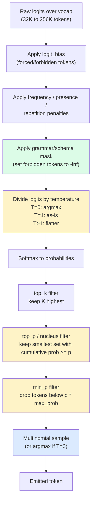
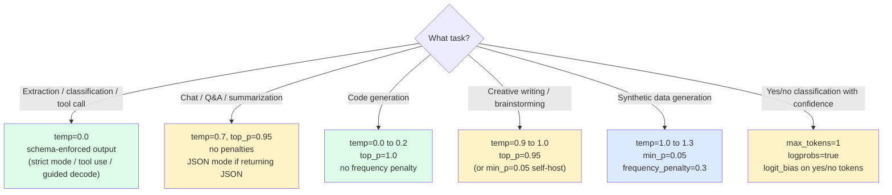

import { Callout } from 'fumadocs-ui/components/callout';

<Callout type="warn" title="TL;DR">
Set **temperature=0.0** for extraction, classification, tool-calling, and code (you want argmax). Set **temperature=0.7 with top-p=0.95** for chat and creative work. Use **min-p=0.05** as a more robust alternative to top-p when you have it. For structured output, prefer **schema-enforced decoding** (OpenAI `response_format`, Anthropic tool-use, vLLM/SGLang/Outlines guided JSON) over prompt-then-regex — it's faster, cheaper, and never produces invalid JSON. And `temperature=0` does **not** give you determinism on hosted APIs: batched inference, non-deterministic CUDA kernels, and floating-point reduction order all break it.
</Callout>

## The problem this solves

You ship a function-calling agent. In testing it returns `{"action": "search", "query": "weather"}` 100% of the time for the same input. In production it occasionally returns `{"action": "search","query":"weather"}` (no spaces), or `{ "action":"search","query":"the weather today"}` (different keys), or — once a day — `Let me search for that. {"action": "search", "query": "weather"}` (preamble before the JSON). Your downstream parser blows up. You add `try/except` and retries. The retries cost you 2× the bill.

This is a sampling problem, not a prompting problem. The model isn't broken; you didn't tell it which token to pick at each step. **Sampling is the policy that converts the model's probability distribution over the next token into the actual token that gets emitted.** Get the policy wrong and you get:

- Non-determinism when you want repeatability (extraction tasks, evals, regression tests).
- Mode collapse when you want diversity (creative writing, brainstorming, synthetic data).
- Invalid syntax when you want strict structure (JSON, SQL, function calls, tool args).
- Repetition loops ("the the the the the…") when you want fluency.

Every API knob — `temperature`, `top_p`, `top_k`, `frequency_penalty`, `presence_penalty`, `min_p`, `response_format`, `tools`, `stop` — is a lever on this single problem.

## The core insight

At every decoding step, the model outputs a **logit vector** over the entire vocabulary (typically 32K-256K tokens). Sampling is a two-stage pipeline applied to those logits:

1. **Distribution shaping** — temperature, repetition penalties, logit bias, grammar masks. Modifies the probabilities before you sample.
2. **Truncation + selection** — top-k, top-p, min-p. Chooses which tokens are *eligible*, then samples from that filtered set.

Every "sampling strategy" is just a particular configuration of these two stages. Understanding the pipeline lets you reason about why one set of knobs misbehaves and another doesn't — instead of cargo-culting `temperature=0.7, top_p=0.95` everywhere.

## Visual: the sampling pipeline



The order matters: temperature is applied *before* the truncation filters. That's why `temperature=0` makes top-p and top-k irrelevant (one token gets all the probability mass; the others are filtered out anyway).

## The seven knobs, ranked by impact

### 1. Temperature

The single most important knob. Divides the logits by `T` before softmax.

```python
import numpy as np

def apply_temperature(logits: np.ndarray, T: float) -> np.ndarray:
    if T == 0.0:
        # Argmax — pick the single highest-logit token
        out = np.full_like(logits, -np.inf)
        out[np.argmax(logits)] = 0.0
        return out
    return logits / T
```

**The mental model:** temperature controls how sharp the distribution is.

- `T=0.0` — argmax. Deterministic *in theory* (see pitfall 2). Use for extraction, classification, structured output, code completion, tool-calling, anything where there's a single right answer.
- `T=0.3` — slightly sampled. Use for code generation where you want the obvious completion but allow a small amount of exploration.
- `T=0.7` — balanced. Default for chat, summarization, Q&A. This is what most APIs default to.
- `T=1.0` — raw distribution as the model trained it. Best for creative writing where you want diversity but still want the model's natural preferences.
- `T=1.5+` — chaos. Useful for synthetic data generation where you want maximum diversity; you'll get more typos, weird tangents, occasional nonsense.

**Real-world calibration on Claude Sonnet 4 (informal benchmark, n=100 per setting on a JSON extraction task):**

| Temperature | Valid JSON | Same output 2× | Average tokens |
|---|---|---|---|
| 0.0 | 100% | 97% | 84 |
| 0.3 | 100% | 71% | 86 |
| 0.7 | 98% | 12% | 91 |
| 1.0 | 94% | 3% | 98 |
| 1.5 | 73% | 0% | 134 |

Note: even at `T=0`, two consecutive calls *don't always* match. That's batched-inference non-determinism — see pitfall 2.

### 2. Top-p (nucleus sampling)

Keeps the smallest set of tokens whose cumulative probability exceeds `p`. Introduced by Holtzman et al. 2019 ("The Curious Case of Neural Text Degeneration") — the single most influential paper on sampling.

```python
def top_p_filter(probs: np.ndarray, p: float) -> np.ndarray:
    sorted_idx = np.argsort(probs)[::-1]
    sorted_probs = probs[sorted_idx]
    cumsum = np.cumsum(sorted_probs)
    # Find the cutoff: smallest k such that cumsum[k] >= p
    cutoff = np.searchsorted(cumsum, p) + 1
    keep = np.zeros_like(probs, dtype=bool)
    keep[sorted_idx[:cutoff]] = True
    out = np.where(keep, probs, 0.0)
    return out / out.sum()
```

**Why it works:** unlike top-k, top-p adapts. When the model is confident (one token has 0.9 probability), top-p=0.95 keeps just that one. When the model is uncertain (probabilities spread across 50 tokens), top-p=0.95 keeps most of them. This matches intuition.

**Default:** `top_p=0.95`. Lower (0.8, 0.9) for less variation; rarely useful above 0.98.

### 3. Top-k

Keeps the `k` highest-probability tokens, zeros the rest. Cruder than top-p but useful as a safety net.

```python
def top_k_filter(probs: np.ndarray, k: int) -> np.ndarray:
    if k <= 0 or k >= len(probs):
        return probs
    threshold = np.partition(probs, -k)[-k]
    out = np.where(probs >= threshold, probs, 0.0)
    return out / out.sum()
```

**Default:** disabled (or `top_k=50`). Combine with top-p for belt-and-suspenders. Some providers (Anthropic, Google) expose `top_k`; OpenAI does not.

### 4. Min-p (the newer, often better default)

Drops any token whose probability is less than `p * max_prob`. Introduced in 2024 by Minh et al. ("Min P Sampling: Balancing Creativity and Coherence at High Temperature").

```python
def min_p_filter(probs: np.ndarray, p: float) -> np.ndarray:
    threshold = p * probs.max()
    out = np.where(probs >= threshold, probs, 0.0)
    return out / out.sum()
```

**Why it's better than top-p in many cases:** top-p has a pathology at high temperature — when temperature flattens the distribution, top-p starts admitting many low-quality tokens because they all contribute small amounts to the cumulative mass. Min-p stays anchored to the *peak* of the distribution, so it stays coherent even at `T=1.5`.

Widely supported in OSS serving stacks (vLLM, SGLang, Llama.cpp, EXL2) but **not by OpenAI or Anthropic hosted APIs**. If you self-host, try `min_p=0.05, top_p=1.0, temperature=1.0` — many local-LLM enthusiasts have switched to this as the new default.

### 5. Frequency penalty / presence penalty

Lowers the probability of tokens that have already appeared in the output.

- **Frequency penalty** — subtracts `α * count(token)` from the logit. Scales with how many times the token appeared.
- **Presence penalty** — subtracts `α` if the token appeared at all (binary).

```python
def apply_penalties(logits, output_tokens, freq_penalty=0.0, pres_penalty=0.0):
    from collections import Counter
    counts = Counter(output_tokens)
    for tok, n in counts.items():
        logits[tok] -= freq_penalty * n + pres_penalty
    return logits
```

**When to use:** open-ended generation where the model loops ("the the the the…"). Set `frequency_penalty=0.2` to break it. **Don't use** for code generation or structured output — you'll punish repeated keywords like `if`, `return`, `{`, which are *supposed* to repeat.

### 6. Repetition penalty (the older variant)

Divides positive logits by `r > 1` and multiplies negative logits by `r`. Used heavily in older models (GPT-2 era); largely superseded by frequency/presence penalties. Still useful in some Llama-family models that aren't well-calibrated under just frequency penalty.

### 7. Logit bias

Force-add a constant to the logit of specific tokens. Use for:

- **Banning tokens** — `logit_bias={token_id: -100}` effectively forbids the token.
- **Forcing tokens** — `logit_bias={token_id: 100}` near-guarantees the token.
- **Classification heads** — set the logits of {"yes", "no"} to +10 and everything else to -100, sample with `T=0`, get a guaranteed yes/no.

OpenAI exposes `logit_bias` directly. Anthropic doesn't, but Claude tool-use achieves a similar guarantee through schema enforcement.

### 8. Beam search (and why nobody uses it anymore)

Old-school NMT-era idea: maintain `B` candidate sequences at every step, expand each by the top-`B` next tokens (`B^2` candidates), prune back to the top-`B`. Pick the highest-scoring complete sequence at the end.

```python
def beam_step(beams, model, B):
    # beams: list of (sequence, cumulative_log_prob)
    candidates = []
    for seq, score in beams:
        logits = model(seq)
        log_probs = log_softmax(logits)
        topk = log_probs.topk(B)
        for tok, lp in zip(topk.indices, topk.values):
            candidates.append((seq + [tok], score + lp))
    return sorted(candidates, key=lambda x: -x[1])[:B]
```

**Why it's mostly dead for LLMs:** beam search optimizes for the highest-likelihood sequence under the model — which, empirically, leads to degenerate, repetitive output ("the cat sat on the mat. the cat sat on the mat. the cat..."). Holtzman's 2019 paper showed that humans don't actually pick max-likelihood — they pick something *near* the top but not exactly there. Sampling with top-p (or min-p) recovers this human-like diversity.

**Where beam search still shows up:** translation (where there is one approximately-correct answer), summarization with `num_beams=2-4` for slight quality boost, and inside speculative decoding implementations as a way to expand the draft tree (EAGLE-2 uses a beam-like tree expansion). Day-to-day LLM serving doesn't use beam search.

## Hosted-API sampling contracts

The hosted providers expose subtly different APIs. Knowing the contract saves debugging time.

| Knob | OpenAI | Anthropic | Google Gemini | Mistral / Together / Fireworks |
|---|---|---|---|---|
| `temperature` | 0.0 - 2.0 | 0.0 - 1.0 | 0.0 - 2.0 | 0.0 - 2.0 |
| `top_p` | yes | yes | yes | yes |
| `top_k` | no | yes | yes | yes |
| `min_p` | no | no | no | yes (most OSS providers) |
| `frequency_penalty` | yes | no | yes | yes (most) |
| `presence_penalty` | yes | no | yes | yes (most) |
| `logit_bias` | yes | no | no | yes (most) |
| `logprobs` | yes | no | yes | yes (most) |
| `seed` for determinism | yes (best-effort) | no | no | yes (most) |
| `response_format` (JSON mode) | yes | no (use tool-use) | yes (`response_mime_type`) | yes (most) |
| `response_format` (strict schema) | yes (`json_schema`) | yes (tool-use forced) | yes (`response_schema`) | varies (Fireworks: yes) |
| `stop` sequences | yes | yes (`stop_sequences`) | yes (`stop_sequences`) | yes |

Two big gotchas:

**Anthropic temperature is capped at 1.0**, not 2.0 like OpenAI. If you migrate code from OpenAI to Anthropic and were running at `temperature=1.5`, you have to renormalize — Claude at `temperature=1.0` is roughly the equivalent of GPT-4 at `temperature=1.3-1.5` because of differences in pre-softmax logit scale.

**Anthropic doesn't expose logprobs.** If you're scoring candidates by per-token likelihood, you have to use a different provider or self-host. The workaround for binary classification is to use forced tool-use with an enum-typed field — but you don't get a calibrated probability, just a class.

## Structured output: the four approaches

Sampling configuration alone doesn't guarantee well-formed JSON. For that you need to *constrain decoding* — modify the sampling pipeline so that only schema-valid tokens are allowed at each step.

### Approach A: Prompt-and-pray

```python
prompt = """Return a JSON object with keys 'action' and 'query'. Example:
{"action": "search", "query": "weather"}

User: What's the weather?
"""
response = client.chat.completions.create(model="gpt-4o", messages=[{"role": "user", "content": prompt}])
json.loads(response.choices[0].message.content)  # Might raise
```

Fails ~2-5% of the time on frontier models, ~10-30% on smaller models. Don't ship this in production.

### Approach B: JSON mode (the cheap fix)

```python
response = client.chat.completions.create(
    model="gpt-4o",
    messages=[...],
    response_format={"type": "json_object"},
)
```

Forces the output to be syntactically valid JSON — but **not necessarily your schema**. The model still has to "remember" to include the right keys. ~98% schema compliance on GPT-4o, lower on smaller models.

### Approach C: Schema-enforced decoding (the right answer)

OpenAI structured outputs (`response_format` with `json_schema` and `strict: true`):

```python
from pydantic import BaseModel

class SearchAction(BaseModel):
    action: str
    query: str

response = client.chat.completions.parse(
    model="gpt-4o-2024-08-06",
    messages=[...],
    response_format=SearchAction,
)
action = response.choices[0].message.parsed  # Guaranteed to be a SearchAction
```

OpenAI compiles the schema into a context-free grammar and masks the sampler at each step to only allow tokens that keep the output schema-valid. **100% schema compliance, guaranteed.**

Anthropic equivalent via tool use:

```python
response = anthropic.messages.create(
    model="claude-sonnet-4-5-20250929",
    max_tokens=1024,
    tools=[{
        "name": "search",
        "description": "Search for information",
        "input_schema": {
            "type": "object",
            "properties": {
                "query": {"type": "string"},
            },
            "required": ["query"],
        },
    }],
    tool_choice={"type": "tool", "name": "search"},  # Forces the model to use this tool
    messages=[{"role": "user", "content": "What's the weather?"}],
)
search_input = response.content[0].input  # Guaranteed to match the schema
```

Gemini equivalent via `response_schema`:

```python
from google.genai import types

response = client.models.generate_content(
    model="gemini-2.5-pro",
    contents="What's the weather?",
    config=types.GenerateContentConfig(
        response_mime_type="application/json",
        response_schema=SearchAction,
    ),
)
```

### Approach D: Grammar-constrained decoding (self-host)

If you're self-hosting, use one of:

- **Outlines** (`outlines-dev/outlines`) — Python library that compiles regex/JSON-schema/CFG into a token mask. Wraps vLLM, transformers, llama-cpp, MLX.
- **XGrammar** — used by SGLang, TensorRT-LLM, vLLM. ~10× faster than Outlines on average — does the FSM compilation lazily and caches.
- **llguidance** — Microsoft's grammar engine, used by Guidance. Supports rich Lark grammars.
- **lm-format-enforcer** — older, simpler. Just JSON schemas.

```python
# vLLM with guided decoding
from vllm import LLM, SamplingParams
from vllm.sampling_params import GuidedDecodingParams

llm = LLM(model="meta-llama/Llama-3.1-8B-Instruct")

sampling = SamplingParams(
    temperature=0.0,
    max_tokens=256,
    guided_decoding=GuidedDecodingParams(
        json={
            "type": "object",
            "properties": {
                "action": {"type": "string", "enum": ["search", "calculate", "respond"]},
                "query": {"type": "string"},
            },
            "required": ["action", "query"],
        },
    ),
)
output = llm.generate(["What's the weather?"], sampling)
```

The output is guaranteed valid JSON matching the schema, and the `action` field is guaranteed to be one of the enum values. **Performance cost:** ~3-15% throughput overhead for the masking pass (XGrammar is on the lower end), zero accuracy cost.

## Logprobs: the most underused feature

Most APIs let you ask for `logprobs` alongside the generated text. You get the per-token log-probability of the chosen token and (optionally) the top-K alternatives.

```python
response = client.chat.completions.create(
    model="gpt-4o",
    messages=[{"role": "user", "content": "Is this email spam? Reply yes or no."}],
    logprobs=True,
    top_logprobs=5,
    max_tokens=1,
)
top = response.choices[0].logprobs.content[0].top_logprobs
# top = [{"token": "no", "logprob": -0.001}, {"token": "yes", "logprob": -6.9}, ...]
import math
p_no = math.exp(top[0].logprob)   # ~1.0
p_yes = math.exp(top[1].logprob)  # ~0.001
```

**Use cases:**

1. **Classification with calibrated confidence.** Sample 1 token (`max_tokens=1`), read the logprob, get a calibrated probability instead of a binary label.
2. **Detect hallucinations / low-confidence answers.** If the chosen token had logprob below some threshold, flag the response.
3. **A/B comparing prompts.** Compute log-likelihood of the desired completion under prompt A vs prompt B without sampling.
4. **Reranking with model scores.** Generate N candidates, score each by sequence logprob, pick the highest.

Anthropic does not expose logprobs publicly. OpenAI, Google, Together, Fireworks, vLLM, TGI all do.

## Pitfalls

### Pitfall 1: setting temperature=0 and top-p simultaneously

`temperature=0` forces argmax — only one token has non-zero probability. `top_p=0.95` then keeps that single token. The two settings don't interact, but it confuses readers and makes your config look like the author didn't know what each knob did. Pick one source of determinism (temperature=0) and leave top-p at its default (1.0).

### Pitfall 2: expecting temperature=0 to be deterministic on hosted APIs

It isn't. Three reasons:

1. **Batched inference is non-deterministic.** When your request gets batched with others, the matmul reductions happen in a different order. Floating-point addition is not associative — `(a + b) + c` ≠ `a + (b + c)` at the last few bits. The argmax can flip if two tokens are within ~1e-6 of each other in logit space. This happens often.
2. **CUDA kernels are non-deterministic by default.** Atomics in attention/MLP backward (and sometimes forward) on H100 introduce non-determinism. You can opt into deterministic kernels in PyTorch but most serving stacks don't.
3. **MoE routing depends on batch composition.** Mixtral, GPT-4, DeepSeek-V3 are mixture-of-experts. Which expert your token goes to can depend on what else is in the batch.

OpenAI offers a `seed` parameter that gives best-effort determinism within a single model snapshot. Anthropic and Google don't. If you genuinely need bit-for-bit reproducibility, self-host with `enforce_eager=True` in vLLM and batch size 1 — and even then, expect occasional drift across software upgrades.

### Pitfall 3: using frequency_penalty for code or structured output

Code is full of repeated tokens: `def`, `return`, `if`, `{`, `}`, `;`, variable names. Frequency penalty actively makes code worse. Set it to 0 for any code or structured-output task. Save it for free-form prose where the model is looping.

### Pitfall 4: mixing prompt-based JSON and schema-enforced JSON

If you switch a production endpoint from "prompt the model to return JSON" to "use `response_format` with a strict schema", your outputs will change in subtle ways: the model used to emit a brief preamble; now it can't. The model used to add extra keys; now it can't. Re-run your evals after switching. The strict schema is correct; your tests just weren't testing what you thought.

### Pitfall 5: top_p too low for creative tasks

`top_p=0.5` cuts off the long tail of the distribution and gives you mode-collapsed, repetitive output — every story starts "Once upon a time in a quiet village…". Default to `top_p=0.95` for any creative work and lower it only if you measure a specific quality issue.

### Pitfall 6: not setting `stop` sequences for tool-style outputs

If you're generating `<answer>...</answer>` blocks or parsing fenced code, set `stop=["</answer>"]` or `stop=["```"]` to cut off generation the moment the model is done. Saves you tokens (= $) and prevents the model from rambling past the answer.

### Pitfall 7: assuming the same temperature works across model families

Llama-3 calibrates very differently from Claude or GPT-4o at `T=0.7`. Open-weights models trained with heavy RLHF often have *sharper* distributions, so `T=0.7` on Llama-3-70B feels like `T=1.0` on GPT-4. Always re-tune temperature when you switch model family.

## Complexity and cost

| Strategy | Setup effort | Token overhead | Failure mode | Best for |
|---|---|---|---|---|
| Prompt-and-pray JSON | 0 | 0% | 2-30% invalid output | Quick prototypes only |
| `response_format: json_object` | Trivial | ~0% | Wrong keys, ~2% on GPT-4o | Loose JSON contracts |
| OpenAI strict structured outputs | Define a Pydantic schema | 0% | None (100% schema-valid) | Production extraction/tools |
| Anthropic tool-use (forced) | Define `input_schema` | 0% | None (100% schema-valid) | Production agents |
| Gemini `response_schema` | Define a Pydantic schema | 0% | None | Production extraction on Gemini |
| Outlines / XGrammar (self-host) | Wire grammar into sampler | 3-15% latency | None | Self-hosted OSS |
| Logit bias hack | Token-id math | 0% | Brittle to tokenizer changes | Yes/no classification |
| `T=0` + careful prompt | Trivial | 0% | Drifts under load (batched non-det) | Internal evals only |

## When NOT to use schema-enforced decoding

Three cases:

1. **The output is genuinely free-form.** Conversational chat, creative writing, summaries. Schema enforcement is overhead with no benefit.
2. **The schema is too complex to express as a grammar.** Recursive schemas with `$ref`, polymorphic union types with hundreds of variants — XGrammar and Outlines can compile these but the FSM blows up and you pay 30%+ in latency. Sometimes prompt + retry is cheaper.
3. **You're using the model to *generate the schema*.** If your task is "given this CSV, propose a JSON schema", you can't enforce a schema you don't have yet. Use plain JSON mode and validate post-hoc.

## Decision rule



## Real-world stacks

- **OpenAI Structured Outputs** (August 2024): the gold standard. Compiles JSON schemas into context-free grammars, masks the sampler. 100% schema compliance, ~no latency hit. Backed by their internal serving stack (rumored to be a fork of TensorRT-LLM + custom).
- **Anthropic Tool Use**: schema enforcement via `input_schema` on tool definitions. Used by every production Claude agent. Combined with `tool_choice={"type": "tool", "name": "..."}` to force a specific tool call.
- **Gemini structured output**: `response_schema` + `response_mime_type: "application/json"`. Supports Pydantic models directly.
- **vLLM guided decoding**: pluggable backends — `outlines`, `xgrammar`, `lm-format-enforcer`. XGrammar is the new default in vLLM 0.6+ and is dramatically faster than the older outlines backend.
- **SGLang**: ships XGrammar for structured output, plus a grammar DSL where you write the output template inline with the prompt. The fastest structured-output stack in the OSS ecosystem as of mid-2025.
- **TensorRT-LLM**: integrates XGrammar for guided decoding. NVIDIA's serving stack is the throughput champion for NVIDIA hardware.
- **Together / Fireworks / Anyscale**: hosted OSS APIs that expose JSON mode and (in Fireworks' case) full JSON-schema constraints.
- **Groq**: their LPU hardware does sampling on-chip and exposes JSON mode + tool use. Famously fast at ~250 tokens/sec on Llama-3-70B.
- **Outlines**: the OG of constrained decoding. Still widely used because it integrates with everything (vLLM, transformers, llama-cpp, MLX, exllama).
- **Local-LLM enthusiasts (Llama.cpp, Ollama, LM Studio, EXL2)**: heavy adopters of min-p sampling and dynamic temperature ("DRY" sampler, Mirostat). Worth watching — these communities tend to discover good defaults before they propagate to commercial APIs.

## Curated questions to practice

1. Your tool-calling agent emits valid JSON 98% of the time but the keys occasionally swap order. You're parsing with `json.loads`. Does order matter? If yes, what fix? If no, why does it look like it does?
2. You're running an extraction job at `temperature=0` on Claude Sonnet and getting different outputs for the same input 3% of the time. Walk through the three root causes and which ones you can mitigate.
3. A user reports that GPT-4o "refuses" to follow their custom JSON schema. The schema has a `oneOf` with five variants. What's the most likely failure mode, and what's the workaround?
4. You're generating synthetic training data with `temperature=1.0, top_p=0.95`. The data is too repetitive — same opening lines, same vocabulary. What two knobs do you change, and in what order?
5. You want to score 1000 candidate answers and pick the best one by perplexity. The hosted API charges per token. How do you minimize the bill while still getting a reliable score?

## Quick-reference card

| Task | Settings | Notes |
|---|---|---|
| **JSON extraction (frontier)** | `temp=0`, schema-enforced output | OpenAI `response_format` strict; Anthropic forced tool-use |
| **JSON extraction (self-host)** | `temp=0`, XGrammar guided decoding | vLLM 0.6+ or SGLang |
| **Chat / Q&A** | `temp=0.7, top_p=0.95` | Default everywhere |
| **Code generation** | `temp=0 to 0.2, top_p=1.0` | Never use frequency_penalty |
| **Creative writing** | `temp=0.9, top_p=0.95` or `temp=1.0, min_p=0.05` | min-p only on self-host |
| **Synthetic data** | `temp=1.0 to 1.3, frequency_penalty=0.3` | Watch for nonsense at T > 1.3 |
| **Yes/no with confidence** | `max_tokens=1, logprobs=true, logit_bias` on yes/no | Read logprob, exp it |
| **Killer pitfall #1** | Expecting temp=0 to be deterministic on hosted APIs | Batched inference breaks this |
| **Killer pitfall #2** | Frequency penalty on code | Punishes `if`, `return`, `{` |
| **Killer pitfall #3** | Top-p too low for creative | Mode collapse |
| **Killer pitfall #4** | Re-using temperatures across model families | Llama vs Claude vs GPT calibrate very differently |
| **What to read next** | [KV cache & continuous batching](/ai/inference/kv-cache-batching) | |

---

> Next page: [KV cache & continuous batching](/ai/inference/kv-cache-batching) — prefill vs decode, the KV cache memory math, PagedAttention, chunked prefill, prefix caching, and speculative decoding.
