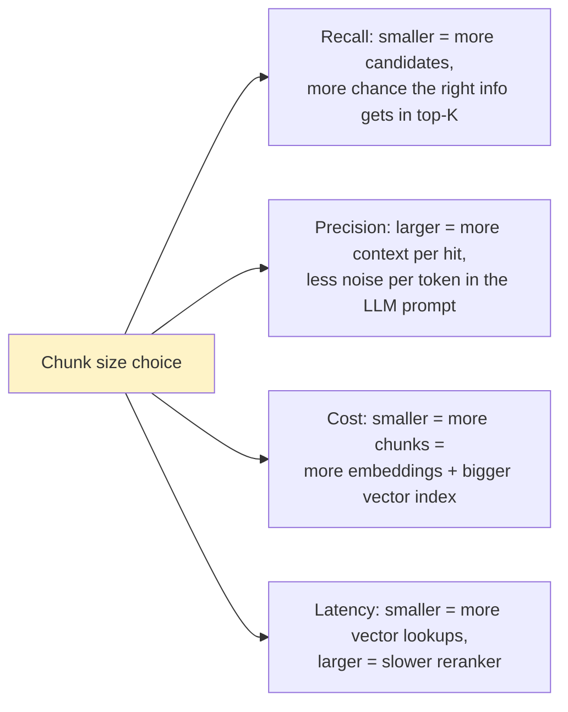
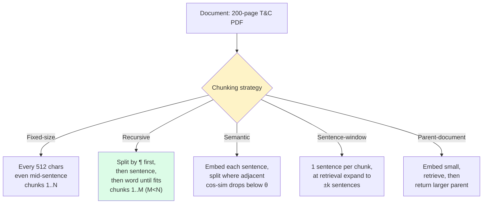
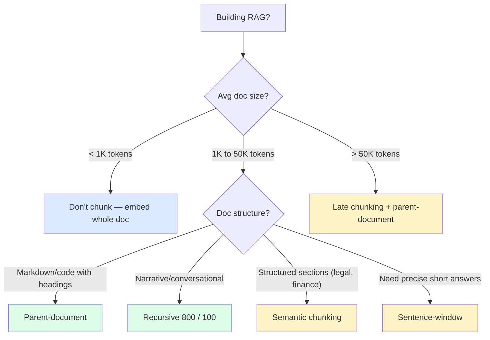

import { Callout } from 'fumadocs-ui/components/callout';

<Callout type="warn" title="TL;DR">
Default to **recursive character splitting** with 800-token chunks, 100-token overlap, and a `\n\n` / `\n` / `. ` / ` ` hierarchy. This single change from naive 512-token fixed chunking typically gives +8-12 Recall@10 on real corpora. Only graduate to semantic, sentence-window, or parent-document chunking when you've measured a specific failure mode that recursive can't fix.
</Callout>

## The problem chunking solves

Your knowledge base is a 50,000-document corpus. The user asks "what's our refund policy for B2B customers?" The right answer is in a single paragraph buried on page 47 of a 200-page terms-of-service PDF.

You can't embed the whole 200-page PDF as one vector — embedding models truncate at 512 or 8192 tokens, and even if they didn't, one vector representing "everything in the document" is a useless average. You have to **split documents into smaller pieces, embed each piece, and retrieve at piece-level granularity**. Those pieces are chunks.

Chunking is a four-way trade-off:



Pick wrong and you either miss the right document (recall failure) or retrieve a chunk so small the LLM has no surrounding context to answer with (precision failure).

## The core insight

**Chunks should respect semantic boundaries, not character counts.** If you split a Markdown heading from its first paragraph, or a function signature from its body, or a sentence in the middle of a clause, the embedding will be of fragments that don't represent any coherent idea. Embeddings of incoherent text retrieve poorly.

Every chunking strategy is an attempt to find boundaries that are both:
1. **Coherent** — the chunk represents one idea.
2. **Compact** — small enough that retrieving it at top-K returns something useful.

## Visual: how a single document gets chunked



The green path — recursive — is your default. The other three are escalations for specific failure modes you've measured.

## The five strategies, ranked

### 1. Fixed-size character splitting (DON'T USE)

```python
def fixed_size_chunk(text: str, size: int = 512, overlap: int = 50):
    chunks = []
    i = 0
    while i < len(text):
        chunks.append(text[i:i+size])
        i += size - overlap
    return chunks
```

Why it's bad: ignores all structure. Splits sentences in the middle of clauses, separates headings from their content, breaks code blocks. Every LangChain "hello world" tutorial uses this. It is the default that you should change first.

**Recall@10 on a corpus of 5K Notion docs:** 0.62.

### 2. Recursive character splitting (THE DEFAULT)

```python
from langchain.text_splitter import RecursiveCharacterTextSplitter

splitter = RecursiveCharacterTextSplitter(
    chunk_size=800,
    chunk_overlap=100,
    separators=["\n\n", "\n", ". ", " ", ""],  # try paragraph break first, then line, then sentence, then word, then character
    length_function=lambda x: len(tiktoken.encoding_for_model("gpt-4o").encode(x)),  # measure in tokens, not chars
)
chunks = splitter.split_text(document)
```

**Why this is the default:** the `separators` hierarchy respects document structure — it splits on paragraph boundaries when it can, falling back to sentence boundaries, then word, then character. The 100-token overlap means each chunk has 100 tokens of context from its neighbor, so a sentence that straddles a boundary still gets indexed in both chunks. Measuring length in *tokens* (not characters) is critical: 1 char ≠ 1 token, and your embedding model has a token limit, not a char limit.

**Recall@10 on the same Notion corpus:** 0.74 (+12 points over fixed-size).

**Cost:** ~1.4× more chunks than fixed (overlap), so embedding bill goes up 1.4×. Worth it.

### 3. Semantic chunking

Idea: don't pick chunk boundaries by length — pick them where the *meaning* changes.

```python
import numpy as np
from sentence_transformers import SentenceTransformer

def semantic_chunk(text: str, threshold: float = 0.5):
    sentences = re.split(r'(?<=[.!?])\s+', text)
    model = SentenceTransformer("all-MiniLM-L6-v2")
    embeddings = model.encode(sentences)

    # Compute cosine distance between adjacent sentences
    distances = [
        1 - np.dot(embeddings[i], embeddings[i+1]) /
        (np.linalg.norm(embeddings[i]) * np.linalg.norm(embeddings[i+1]))
        for i in range(len(sentences) - 1)
    ]

    # Split where the distance exceeds the threshold (or 95th percentile)
    cutoff = np.percentile(distances, 95)
    breakpoints = [i for i, d in enumerate(distances) if d > cutoff]

    chunks, start = [], 0
    for bp in breakpoints:
        chunks.append(" ".join(sentences[start:bp+1]))
        start = bp + 1
    chunks.append(" ".join(sentences[start:]))
    return chunks
```

**When it helps:** documents with sharply distinct sections (financial reports with separate "revenue", "risks", "outlook" sections; legal contracts with numbered clauses; long-form blog posts with topical pivots). When semantic chunking finds the natural breaks, chunks become more coherent.

**When it doesn't help:** narrative text where every sentence flows into the next (novels, news articles, conversational transcripts). The cosine distances are uniformly small and the algorithm picks arbitrary breakpoints.

**Recall@10 on Notion corpus:** 0.76 (+2 over recursive). Modest gain.
**Recall@10 on 10-K financial filings:** 0.81 vs 0.71 for recursive. **+10 — big win.**

**Cost:** you have to embed every sentence (extra inference call) to find boundaries — about 3× the chunking cost. Acceptable as a one-time index-build cost.

### 4. Sentence-window retrieval

Idea: embed individual sentences (tiny chunks) for high *recall*, but at retrieval time return the surrounding ±N sentences for *context*.

```python
# Indexing: store each sentence with its neighbors
sentences = nltk.sent_tokenize(document)
for i, s in enumerate(sentences):
    chunk = {
        "id": f"{doc_id}-{i}",
        "embed_text": s,                              # what gets embedded
        "context_text": " ".join(sentences[max(0,i-2):i+3]),  # what gets returned
        "doc_id": doc_id,
        "sentence_idx": i,
    }
    vector_db.insert(chunk)

# Retrieval: embed query, find nearest sentences, return their context windows
hits = vector_db.query(query_embedding, top_k=10)
contexts = [hit["context_text"] for hit in hits]
```

**Why it works:** sentence-level embeddings are more precise (a query matches the most relevant single sentence, not a paragraph that happens to contain it). But returning just that sentence gives the LLM no context. The window solves both.

**Recall@10:** 0.78.
**Precision impact:** the LLM gets 5-sentence windows so it has enough surrounding context to answer, but only one sentence per window is "the answer" — much less noise than retrieving a full 800-token chunk.

**Cost:** **5-10× more chunks** in your vector DB (one per sentence vs one per 800 tokens). Vector index storage and query latency both inflate. Best for high-value, low-volume corpora where accuracy matters more than $.

### 5. Parent-document retrieval

Idea: embed *small* (precise retrieval) but return *large* (good context).

```python
# Indexing: every doc has two chunkings — fine (for retrieval) and coarse (for context)
for doc in documents:
    fine_chunks = recursive_split(doc, size=200)  # small for embedding
    coarse_chunks = recursive_split(doc, size=2000)  # large for return

    for fc in fine_chunks:
        parent = find_parent_coarse_chunk(fc, coarse_chunks)
        vector_db.insert({
            "embed_text": fc.text,
            "parent_id": parent.id,
            "doc_id": doc.id,
        })

    document_store.put(coarse_chunks)  # key-value store, no embeddings needed

# Retrieval: nearest fine chunk → look up its parent → return the parent
hits = vector_db.query(query_embedding, top_k=10)
parent_ids = list({hit["parent_id"] for hit in hits})  # dedup
contexts = [document_store.get(pid) for pid in parent_ids]
```

**Why it works:** same insight as sentence-window but cleaner. The 200-token "fine" chunks retrieve precisely. The 2000-token "coarse" parents give the LLM rich context. The dedup step matters — multiple fine chunks often point to the same parent.

**Recall@10:** 0.79.
**Best for:** documents with natural hierarchy (Markdown with headings, code files with functions, books with chapters). LangChain's `ParentDocumentRetriever` and LlamaIndex's `AutoMergingRetriever` both implement this. Pair this with a cross-encoder reranker — see [Rerankers & context engineering](/ai/retrieval/rerankers-context) — and you're at production quality.

## The new kid: late chunking

Published by Jina AI in late 2024. Idea: instead of chunking text and *then* embedding each chunk, embed the *entire long document* with a long-context embedding model (Jina embeddings v3, Voyage 3, BGE-M3), then derive chunk embeddings by pooling over token-level outputs *after* the model has seen the full context.

```python
# Conceptual — late chunking
full_document_tokens = tokenizer(doc, return_tensors="pt")
token_embeddings = embedding_model(full_document_tokens).last_hidden_state[0]

# Now derive chunk embeddings by mean-pooling token slices
chunks = recursive_split_by_token_indices(doc, size=800)
chunk_embeddings = []
for chunk_token_range in chunks:
    start, end = chunk_token_range
    chunk_emb = token_embeddings[start:end].mean(dim=0)
    chunk_embeddings.append(chunk_emb)
```

**Why it works:** each chunk's embedding now "knows" what came before and after in the document. A chunk about "operating expenses" in a financial filing carries the context that it's Q3 2025 results for company X, even though the chunk text itself doesn't mention that explicitly.

**Recall@10 on financial filings:** Jina reports 0.84 vs 0.78 for parent-document.
**Cost:** embedding the full document is one big call instead of many small ones — about the same total compute, but you need a model that supports long context (8K-32K tokens minimum).

**When to use:** specialized corpora where document-level context matters (legal, medical, financial). Less benefit on chat-message-scale text.

## Pitfalls

### Pitfall 1: measuring length in characters

`chunk_size=1000` in your splitter probably means 1000 characters. Your embedding model truncates at 8192 *tokens*. A 1000-char English chunk is ~250 tokens (4 chars/token average); a 1000-char code or non-Latin-script chunk can be 2000+ tokens. Always set `length_function` to a tokenizer.

```python
import tiktoken
enc = tiktoken.encoding_for_model("gpt-4o")
length_function = lambda x: len(enc.encode(x))
```

### Pitfall 2: forgetting to strip boilerplate before chunking

If every page in your corpus ends with the same 200-token footer ("© 2025 Acme Corp...", legal disclaimers, navigation menus), every chunk near a page boundary contains 200 tokens of garbage. Run boilerplate removal (e.g. `trafilatura`, `readability-lxml`) *before* chunking, not after.

### Pitfall 3: not chunking tables, code, and lists differently

A 30-row table chunked mid-row produces useless embeddings. A code function split across two chunks is incomprehensible to the embedding model. Detect these structures and treat them as atomic units:

```python
# Pseudocode
def smart_chunk(text):
    blocks = parse_markdown(text)
    chunks = []
    for block in blocks:
        if block.type == "code":
            chunks.append(block)  # atomic
        elif block.type == "table":
            chunks.append(block)  # atomic
        elif block.type == "list":
            chunks.append(block)  # atomic
        else:
            chunks.extend(recursive_split(block.text, size=800))
    return chunks
```

### Pitfall 4: not including metadata in the chunk

A chunk is "the lease agreement allows pet ownership with a $300 deposit." Which agreement? Which property? Without that context, the chunk retrieves correctly but the LLM can't ground its answer to a specific document.

Prepend metadata to every chunk:

```python
chunk_with_metadata = f"""[Document: {doc.title}]
[Section: {section.heading}]
[Last updated: {doc.updated_at}]

{chunk.text}"""
```

This costs you ~30-50 tokens per chunk but adds context for both retrieval (the doc title is searchable) and generation (the LLM can cite the source).

### Pitfall 5: re-chunking without re-embedding

Changing your chunk size from 512 to 800 means **every chunk in your vector DB is now wrong**. The embeddings were computed on different text. You have to re-index. Plan for periodic re-indexes; budget the embedding cost in advance — and consider whether a cheaper embedder ([Embedding models](/ai/retrieval/embeddings)) gets you most of the way at a fraction of the bill ([Cost engineering](/ai/cost)).

## Complexity and cost

| Strategy | Indexing time (1M docs) | Indexing $ (OpenAI embed-3-small) | Storage (vector index) | Retrieval latency |
|---|---|---|---|---|
| Fixed-size | 1× | $20 | 1× | 1× |
| Recursive | 1.05× | $28 | 1.4× | 1× |
| Semantic | 4× (need to embed sentences first) | $80 | 1.4× | 1× |
| Sentence-window | 2× | $40 | **8×** (many more chunks) | 1.2× |
| Parent-document | 1.5× | $30 | 1.5× | 1× |
| Late chunking | 1× | $30 | 1.4× | 1× (but needs long-context model) |

*Numbers are order-of-magnitude. Your corpus will vary.*

## When NOT to chunk

Three cases where chunking adds noise:

1. **Documents are already short.** If 95% of your "documents" are < 1000 tokens (tweets, support tickets, product descriptions, individual emails), embed each one whole. No chunking needed.

2. **You're using a long-context model for retrieval.** Some teams now skip RAG entirely and just stuff the entire corpus (Gemini 1.5 Pro / 2.0 Flash, 1M-2M tokens) into the prompt. Works for corpora under ~500K tokens, breaks for anything bigger. Watch for [lost-in-the-middle](/ai/retrieval/rerankers-context).

3. **You have a knowledge graph instead of text.** Structured data goes into a SQL database or graph DB and is queried directly. Don't chunk it; query it.

## Decision rule



## Real-world stacks

- **Notion AI:** recursive chunking on Notion blocks, with block hierarchy preserved (heading → paragraph → child block becomes a parent-document setup). They report ~150-token chunks for retrieval, returning the parent block.
- **GitHub Copilot / Cursor:** function-level and file-level chunking with AST-aware splitting (a function is one chunk). Imports and class declarations get treated as atomic. Modern editors use tree-sitter for the parse.
- **Perplexity:** for web search results, they use a combination of sentence-window (for direct quote citations) and full-page parent context.
- **Glean (enterprise search):** document-level chunking with metadata-heavy headers (author, last-edited, ACL groups) prepended to every chunk for both retrieval and filtering.
- **Anthropic's "Contextual Retrieval"** (Sept 2024): they prepend a 50-100 token *contextual summary* generated by Claude to each chunk before embedding. Reduced retrieval failures by 35% in their measurements. This is essentially chunk-level prompt engineering on top of recursive chunking.

## Curated questions to practice

1. You have 100K PDFs of medical research papers. Naive recursive chunking gives Recall@10 of 0.65. What three changes would you try first, and in what order?
2. Your RAG returns *wrong* chunks 20% of the time even though the right chunk is in your index. Is this a chunking problem, an embedding problem, or a reranker problem? How would you diagnose which?
3. A user complains that searching for "Q3 2024 revenue" returns Q3 2023 revenue. Trace the failure through the retrieval pipeline and identify which layers could be at fault.
4. You chunk at 800 tokens, retrieve top-5, and pack 4000 tokens of context. The model still misses obvious answers. Is this a chunking problem or a context-engineering problem?
5. Your chunk count goes from 50K to 800K after switching to sentence-window. Vector DB query latency p95 doubles. How do you regain latency without giving up the recall gains?

## Quick-reference card

| Question | Answer |
|---|---|
| **Default strategy?** | Recursive, 800 tokens, 100 overlap, tokenizer-based length |
| **First thing to change after default?** | Add metadata header (doc title, section, last-updated) |
| **For Markdown / code?** | Parent-document with structure-aware splits |
| **For financial/legal docs?** | Semantic chunking + late chunking if budget allows |
| **For tiny docs (< 1K tokens)?** | Don't chunk — embed whole |
| **Killer pitfall #1** | Measuring length in chars not tokens |
| **Killer pitfall #2** | Forgetting to strip boilerplate before chunking |
| **Killer pitfall #3** | Forgetting to re-embed after changing chunk size |
| **Killer pitfall #4** | Not adding metadata to each chunk |
| **What to read next** | [Embedding models](/ai/retrieval/embeddings) |

---

> Next page: [Embedding models](/ai/retrieval/embeddings) — picking the right embedder for your domain, and when (rarely) to fine-tune.
