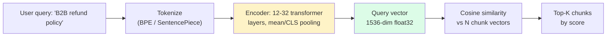
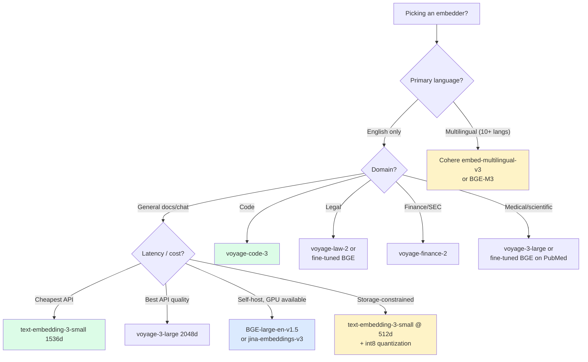

import { Callout } from 'fumadocs-ui/components/callout';

<Callout type="warn" title="TL;DR">
Default to **`text-embedding-3-small` at 1536d** ($0.02 / 1M tokens) for English-heavy general corpora. Switch to **Voyage `voyage-3` or `voyage-code-3`** if you're code-heavy or want top-of-MTEB without self-hosting. Switch to **Cohere `embed-multilingual-v3`** if you need 100+ languages. Reach for open-source (BGE-large, NV-Embed-v2, jina-embeddings-v3) only when (a) data residency forces it, (b) you've measured a domain failure, or (c) you can amortize the GPU. **Do not fine-tune** unless you have 1000+ labeled (query, doc) pairs *and* off-the-shelf has plateaued.
</Callout>

## The problem this solves

You've shipped chunking. Every chunk is now a string of ~800 tokens. To search at scale you need to convert each string into a fixed-size vector that captures its meaning — so that `cosine(query_vec, chunk_vec)` is high when the chunk answers the query. That conversion is the embedding model.

Concrete scenario: a B2B SaaS support bot indexes 2.3M Zendesk articles. You pick `text-embedding-ada-002` (the 2022 OpenAI default) because that's what every Medium tutorial uses. Six months later your CSAT is stuck at 71% — users keep getting answers from the wrong product line because the embeddings can't distinguish "Acme Cloud Storage" from "Acme Cloud Compute." You swap to `text-embedding-3-large` with a 256d Matryoshka projection. CSAT moves to 78% in two weeks. Same chunks, same reranker, same prompt. Just a better embedding model.

**The embedding model is the single biggest determinant of retrieval quality after chunking.** Get this wrong and no amount of hybrid search, reranking, or context engineering can fully recover.

This page covers:

- The shipping options in 2026 (OpenAI, Cohere, Voyage, open-source) with prices, dimensions, context windows, and MTEB scores.
- The cost spread: `text-embedding-3-large` at $0.13/1M tokens is **6.5× the price** of `-small`, and that's before storage cost on a 3072-d index. We'll cover when the accuracy gains justify (or don't justify) the premium. Full cost engineering in [Cost engineering](/ai/cost).
- How to read MTEB / BEIR without being misled.
- Dimensionality vs accuracy (Matryoshka Representation Learning).
- When fine-tuning is worth it (rarely) and what it costs.
- The migration path when you switch embedders.

## The core insight

**An embedding model is a learned compression of "meaning" into a vector.** Two passages with the same meaning should land near each other; two passages with different meanings should land far apart. *Near* and *far* are measured by cosine similarity (or dot product, or Euclidean distance — they're equivalent up to normalization).

Everything downstream — your vector DB, your reranker, your prompt — operates on these vectors. If the model puts "refund policy for B2B" close to "B2C billing FAQ" because it can't tell the segments apart, no retrieval algorithm can untangle it. **The geometry of your embedding space is your retrieval ceiling.**

The corollary: leaderboard scores (MTEB, BEIR) are useful but they measure averages across many tasks. Your corpus is one task. The right way to evaluate is on your data, not theirs. We'll get to that.

## Visual: how a query becomes a top-K result



The encoder is the only learned component. Tokenization is deterministic, similarity is arithmetic, top-K is sorting. **Picking an embedding model = picking an encoder.**

## The shipping options in 2026

### 1. OpenAI: `text-embedding-3-small` and `text-embedding-3-large`

```python
from openai import OpenAI
client = OpenAI()

resp = client.embeddings.create(
    model="text-embedding-3-small",   # or "text-embedding-3-large"
    input=["B2B refund policy", "How do I export my workspace?"],
    dimensions=1536,                  # MRL: can drop to 256, 512, 768
)
vectors = [d.embedding for d in resp.data]   # list of 1536-d float lists
```

| Variant | Native dim | MRL min | Context | Price (per 1M tok) | MTEB avg |
|---|---|---|---|---|---|
| `text-embedding-3-small` | 1536 | 256 | 8191 | **$0.02** | 62.3 |
| `text-embedding-3-large` | 3072 | 256 | 8191 | $0.13 | 64.6 |
| `text-embedding-ada-002` (legacy) | 1536 | — | 8191 | $0.10 | 61.0 |

**Why `-3-small` is the modern default:** it beats `ada-002` on every benchmark, costs **5× less**, and supports Matryoshka — you can ship 1536d for accuracy or 512d for storage with the *same* model and re-project on the fly. `-3-large` is worth the 6.5× cost premium only when MTEB matters more than money (legal / medical search where every recall point pays for itself).

**Watch out for:** the `dimensions` parameter is a request to truncate-and-renormalize, not a separately trained model. It works because OpenAI trained `-3` with MRL (see Kusupati et al. 2022) — the prefix of the vector is itself a usable embedding. If you skip the `dimensions` arg you get full 1536d / 3072d.

### 2. Cohere: `embed-english-v3.0` and `embed-multilingual-v3.0`

```python
import cohere
co = cohere.Client(api_key="...")

# IMPORTANT: input_type matters — Cohere trained asymmetric query/doc encoders
doc_vecs = co.embed(
    texts=["chunks here..."],
    model="embed-english-v3.0",
    input_type="search_document",
).embeddings

query_vec = co.embed(
    texts=["B2B refund policy"],
    model="embed-english-v3.0",
    input_type="search_query",
).embeddings[0]
```

| Variant | Dim | Context | Price | MTEB avg | Notes |
|---|---|---|---|---|---|
| `embed-english-v3.0` | 1024 | 512 | $0.10 / 1M tok | 64.5 | English-only, strong on retrieval |
| `embed-multilingual-v3.0` | 1024 | 512 | $0.10 / 1M tok | 64.0 | **100+ languages, same vector space** |
| `embed-english-light-v3.0` | 384 | 512 | $0.10 / 1M tok | 62.0 | Cheaper-to-store |

**Why pick Cohere:** the `input_type` distinction is the killer feature. Cohere trained the query side and document side asymmetrically — passing `search_query` for queries and `search_document` for chunks gives meaningfully better retrieval than treating them symmetrically. OpenAI's models are symmetric.

**The multilingual model puts every language in a *shared* vector space.** A French query can retrieve English documents (or vice versa) without translation. This is the best off-the-shelf multilingual embedder in 2026.

**Watch out for:** the 512-token context is short. If your chunks exceed 512 tokens, Cohere truncates silently. Either chunk smaller or use a longer-context model.

### 3. Voyage AI: `voyage-3`, `voyage-code-3`, `voyage-multimodal-3`

Voyage (acquired by MongoDB in 2024) ships the highest-MTEB API-accessible embedders. They specialize:

```python
import voyageai
vo = voyageai.Client()

# General-purpose
result = vo.embed(
    texts=["chunks..."],
    model="voyage-3",
    input_type="document",   # or "query"
    output_dimension=1024,   # MRL: 256 / 512 / 1024 / 2048
)
vectors = result.embeddings
```

| Model | Native dim | Context | Price (per 1M tok) | Specialty |
|---|---|---|---|---|
| `voyage-3` | 1024 | 32K | $0.06 | General, top of MTEB |
| `voyage-3-large` | 2048 | 32K | $0.18 | Highest accuracy |
| `voyage-3-lite` | 512 | 32K | $0.02 | Cheap / fast |
| `voyage-code-3` | 1024 | 32K | $0.06 | **Code retrieval (Python, TS, Go, Rust...)** |
| `voyage-multimodal-3` | 1024 | 32K | $0.10 / 1M tok + $0.10 / 1K images | Text + images in one space |
| `voyage-law-2` | 1024 | 16K | $0.12 | Legal corpora |
| `voyage-finance-2` | 1024 | 32K | $0.12 | SEC filings / earnings |

**Why pick Voyage:**
1. **`voyage-code-3` is the best code embedder.** It outperforms `text-embedding-3-large` on code-search benchmarks by 8-15 points (CodeSearchNet, CoIR). Cursor, Sourcegraph, and several IDE startups use it.
2. **32K context** lets you embed long chunks (whole code files, multi-page legal sections) without further chunking — synergizes with late chunking.
3. **Domain models** (`voyage-law-2`, `voyage-finance-2`) are post-trained on domain corpora and consistently outperform general models on those domains by 5-10 points.

**Watch out for:** Voyage's pricing changed twice in 2024-2025. Always re-check before committing budget.

### 4. Open-source: BGE, E5, NV-Embed, jina-embeddings-v3

If you self-host (data residency, GPU sitting idle, or sub-millisecond latency requirements), the open-source landscape is solid:

| Model | Dim | Context | License | MTEB avg | Notes |
|---|---|---|---|---|---|
| `BAAI/bge-large-en-v1.5` | 1024 | 512 | MIT | 64.2 | Workhorse OSS embedder |
| `BAAI/bge-m3` | 1024 | **8192** | MIT | 63.8 | Dense + sparse + multi-vector in one model |
| `intfloat/e5-large-v2` | 1024 | 512 | MIT | 63.6 | Microsoft Research, very strong |
| `intfloat/multilingual-e5-large` | 1024 | 512 | MIT | 63.2 | 100+ languages |
| `nvidia/NV-Embed-v2` | 4096 | 32K | CC-BY-NC | **72.3** | SOTA on MTEB but **non-commercial** |
| `jinaai/jina-embeddings-v3` | 1024 | **8192** | CC-BY-NC | 65.5 | **Late chunking native**, task-specific LoRAs |
| `mixedbread-ai/mxbai-embed-large-v1` | 1024 | 512 | Apache 2.0 | 64.7 | Solid Apache-2.0 option |

```python
from sentence_transformers import SentenceTransformer

# Most OSS embedders share this API
model = SentenceTransformer("BAAI/bge-large-en-v1.5", device="cuda")
# BGE asymmetric: prepend "Represent this sentence for searching relevant passages: "
# to queries only — model card has details.
doc_vecs = model.encode(["chunks..."], normalize_embeddings=True, batch_size=64)
query_vec = model.encode(
    ["Represent this sentence for searching relevant passages: B2B refund policy"],
    normalize_embeddings=True,
)[0]
```

**Why pick open-source:**
- **Cost at scale**: at 100M tokens/day, OpenAI `-3-small` costs $2K/day, BGE on an A10G runs ~$50/day.
- **Latency**: on-prem batch encoding hits 5K docs/sec on an A100. OpenAI's API caps at ~3K rpm and adds 50-150ms network overhead per request.
- **Data residency / privacy**: nothing leaves your VPC.
- **Specialization**: `jina-embeddings-v3` has LoRAs you can switch at inference (`retrieval.query`, `retrieval.passage`, `classification`, `separation`, `text-matching`) — best-in-class flexibility.

**Watch out for:**
- `NV-Embed-v2` is non-commercial. Most teams can't ship it.
- "MTEB 72.3" looks great until you discover the model is 7.5B params and needs an H100 to run at production latency.
- OSS pooling conventions differ. BGE uses CLS token, E5 uses mean pooling. Use the model card's exact recipe or your scores will be 5-10 points lower than reported.

### 5. The legacy options (don't pick these in 2026)

| Model | Why not |
|---|---|
| `text-embedding-ada-002` | Beaten by `-3-small` on every metric for 5× the price |
| `all-MiniLM-L6-v2` | 384d / 256-token context — great for prototyping, weak for production |
| `text-embedding-3-large` at 3072d | Use `-3-large` at 1024d (MRL) — 67% storage savings, &lt;1 MTEB point loss |
| Universal Sentence Encoder (TF-Hub) | TensorFlow ecosystem, no longer competitive |

## Reading MTEB and BEIR honestly

[MTEB](https://huggingface.co/spaces/mteb/leaderboard) (Massive Text Embedding Benchmark) reports an average across 56 datasets — retrieval, classification, clustering, STS, reranking, summarization. **Most of those are not your task.** A model with MTEB-avg 68 might be MTEB-retrieval 55. Always filter to the *Retrieval* sub-leaderboard if RAG is what you're building.

BEIR is the retrieval-specific benchmark (18 retrieval datasets: MS MARCO, FiQA, SciFact, etc.). Look at:
- **nDCG@10** on a domain similar to yours.
- The **gap between the top model and `bge-large`** — usually &lt;3 points. If the model claiming +5 points only tested on one dataset, be suspicious.

Three traps:

1. **Train-test contamination.** Some recent OSS models (notably some 2024 leaderboard climbers) were trained on a corpus that included MTEB eval sets. Their numbers don't generalize. Cross-reference with a held-out eval.
2. **Reranker conflation.** Some "embedding" benchmarks bundle a reranker — the score isn't reflecting the encoder alone. Read the methodology.
3. **Task asymmetry.** Several leaderboard models post-trained on asymmetric retrieval — they crush BEIR but underperform on STS (sentence-similarity) tasks where queries and docs look alike. Match the benchmark to your usage.

**Build a 200-query, 50-doc-per-query labeled set on your data.** That eval is worth more than the entire MTEB leaderboard. Spend the engineering week. We'll cover eval methodology in /ai/observability.

## Dimensionality: storage vs accuracy

A 1M-document corpus at 1536d float32 = 6 GB of vectors. At 3072d = 12 GB. At 256d (MRL) = 1 GB. For a single index, this is a rounding error. For a billion-vector multi-tenant SaaS index, it's the difference between 1 TB and 12 TB of RAM.

Three knobs:

### 1. Native dimension

Pick a model whose native dimension matches your budget. `voyage-3-lite` (512d) and `text-embedding-3-small` (1536d at default, 512d via MRL) are the sweet spot for most production loads.

### 2. Matryoshka Representation Learning (MRL)

Kusupati et al. 2022 showed you can train an embedding model so that the *first 256 dimensions* are themselves a valid (shorter) embedding. OpenAI's `-3` family and Voyage `-3` family ship with MRL.

```python
# OpenAI MRL — pick dimensions you actually need
resp = client.embeddings.create(
    model="text-embedding-3-large",
    input=texts,
    dimensions=512,   # 6× storage savings vs native 3072
)
```

The accuracy drop is sublinear. OpenAI's data: `-3-large` at 256d ≈ `ada-002` at 1536d. Use MRL aggressively when storage is the bottleneck.

### 3. Quantization

Orthogonal to MRL. Most vector DBs (Qdrant, Pinecone, pgvector) support `int8` or `binary` quantization on top of MRL:

| Format | Bytes / dim | 1536d vector size | Accuracy hit (typical) |
|---|---|---|---|
| float32 | 4 | 6.0 KB | baseline |
| float16 | 2 | 3.0 KB | &lt;0.5% |
| int8 (scalar) | 1 | 1.5 KB | 1-2% |
| binary (1-bit, with rerank) | 0.125 | 192 B | 3-5% on first pass, recovered with rerank |

**Binary quantization + cosine rerank** (Qdrant's "rescoring") gives you 32× storage compression with &lt;2% Recall@10 loss on most corpora. That's how Pinecone, Qdrant, and Weaviate ship trillion-vector indices.

## When (rarely) to fine-tune

90% of the teams I've seen attempt embedding fine-tuning would have gotten more uplift from a better off-the-shelf model + a reranker. Before you fine-tune:

1. **Have you tried `voyage-3-large` and Cohere `embed-english-v3` with the right `input_type`?**
2. **Have you added a cross-encoder reranker?** (Next page in this tier.)
3. **Have you measured a *specific* failure mode that's clearly a representation issue, not a retrieval-pipeline issue?**

If you've done all three and you still need more, fine-tuning makes sense when:

- You have **1000+ labeled (query, relevant-doc, [hard-negatives]) triples**. Below ~500, you'll overfit.
- Your corpus is **highly domain-specific** — esoteric jargon (semiconductor process nodes, niche medical specialties, in-house product names) that the base model never saw.
- You can afford ongoing **maintenance**: every base-model upgrade forces you to re-finetune.

The recipe most teams use:

```python
from sentence_transformers import SentenceTransformer, losses, InputExample
from torch.utils.data import DataLoader

# 1. Start from a strong base (don't fine-tune from a weak one)
model = SentenceTransformer("BAAI/bge-large-en-v1.5")

# 2. Build triplets: (query, positive_doc, [hard_negatives])
#    Hard negatives = docs that the base model ranks highly but are wrong.
#    Mining them from your retrieval logs is where the gains come from.
train_examples = [
    InputExample(texts=["query text", "positive chunk", "hard negative chunk"])
    for q, p, n in load_triples()
]
loader = DataLoader(train_examples, shuffle=True, batch_size=32)

# 3. MultipleNegativesRankingLoss is the standard contrastive loss
loss = losses.MultipleNegativesRankingLoss(model)

# 4. Train 1-3 epochs at low LR — overfitting is the main risk
model.fit(
    train_objectives=[(loader, loss)],
    epochs=2,
    warmup_steps=100,
    show_progress_bar=True,
    output_path="bge-finetuned",
)
```

Typical lift: +3 to +8 nDCG@10 over the base. If you're seeing +15 you're probably overfitting to your eval set — check with a held-out test corpus.

**Cost**: ~$50-200 in GPU on a single A100 for a few hours, plus the labeling cost. Labeling 1000 triplets takes a domain expert 4-8 hours.

**An alternative that often wins**: instead of fine-tuning the encoder, fine-tune a **cross-encoder reranker** on the same triplets. Less data needed, easier to swap, doesn't invalidate your vector index. Covered in the next page.

## Pitfalls

### Pitfall 1: forgetting the asymmetric query/doc convention

Cohere, BGE, E5, and Voyage all train queries and documents asymmetrically. If you pass `input_type="document"` to a query (or skip the BGE "Represent this sentence..." prefix), you lose 5-10 points of nDCG silently.

```python
# WRONG — symmetric usage on an asymmetric model
co.embed(texts=[query], model="embed-english-v3.0")  # no input_type

# RIGHT
co.embed(texts=[query], model="embed-english-v3.0", input_type="search_query")
co.embed(texts=docs,    model="embed-english-v3.0", input_type="search_document")
```

OpenAI's `-3` family is symmetric — no prefix or input_type needed. That's a feature and a footgun: you can mix them up without an error, and your retrieval just quietly degrades.

### Pitfall 2: normalizing some vectors but not others

If your indexer normalizes (divides by L2 norm) but your query encoder doesn't, your cosine math is wrong. Worse: most vector DBs default to inner-product or L2 distance, and "cosine similarity" only equals "inner product" when both inputs are unit-norm.

```python
import numpy as np

def normalize(v):
    return v / (np.linalg.norm(v) + 1e-12)

# Either normalize everywhere, or use a vector DB metric that handles it for you.
```

Pinecone's `cosine` metric normalizes implicitly. pgvector's `<=>` operator computes raw cosine distance. Qdrant requires you to declare metric per collection. **Pick one convention and assert it.**

### Pitfall 3: mixing embedding models across an index

Your team upgrades from `ada-002` to `text-embedding-3-small`. The migration is "we'll re-embed new docs in `-3`, leave old docs alone, mix the two."

**Don't.** The two models project into different vector spaces. Cosine distance between a `-3` query vector and an `ada-002` doc vector is meaningless. Recall collapses. The migration is binary: every vector in the index must be the same model.

The fix: dual-write during migration. Embed every new doc with both models, store both vectors, query both indices, A/B the results. Once you're confident, cut over.

### Pitfall 4: ignoring the token limit, getting silent truncation

`embed-english-v3.0` truncates at 512 tokens. `text-embedding-3-*` at 8191. `voyage-3` at 32000. Pass an 8000-token chunk to Cohere and the last 7488 tokens are silently dropped.

```python
import tiktoken
enc = tiktoken.encoding_for_model("gpt-4o")

for chunk in chunks:
    if len(enc.encode(chunk)) > 512:
        # for Cohere, either split further or pick a longer-context model
        raise ValueError("Chunk exceeds Cohere context window")
```

Assert chunk length against the model's limit at index time. Don't trust your chunker.

### Pitfall 5: re-embedding without versioning

You re-embed your 50M-doc corpus with `voyage-3` to test it. You forget which Pinecone namespace got the new vectors. Three weeks later production is querying a mixed index.

Always **version the namespace** by `(model, version, dim, chunk-config-hash)`. E.g. `index:openai:te3-small:1536:chunk-v4`. Roll forward by creating new namespaces; never overwrite.

### Pitfall 6: assuming benchmarks generalize to your corpus

You read `voyage-3-large` is +2 MTEB over `text-embedding-3-large`. You migrate. Your domain Recall@10 drops 4 points.

MTEB averages don't tell you about *your* corpus. Always run a side-by-side on 100-500 labeled queries from your production logs before committing to a model swap.

## Complexity and cost

For a corpus of 10M chunks at ~500 tokens/chunk = 5B tokens total:

| Model | Embed once (5B tok) | Storage (10M × dim × 4B) | Per-query latency | Best for |
|---|---|---|---|---|
| `text-embedding-3-small` 1536d | **$100** | 60 GB | 50-150ms (API) | English general default |
| `text-embedding-3-small` 512d (MRL) | $100 | 20 GB | 50-150ms (API) | Storage-constrained |
| `text-embedding-3-large` 3072d | $650 | 120 GB | 80-200ms (API) | Highest API quality |
| `embed-english-v3.0` | $500 | 40 GB | 60-150ms (API) | Asymmetric, multilingual |
| `voyage-3` | $300 | 40 GB | 60-200ms (API) | Top MTEB API |
| `voyage-code-3` | $300 | 40 GB | 60-200ms (API) | Code retrieval |
| `bge-large-en-v1.5` (self-host A10G) | ~$80 GPU-hr | 40 GB | 5-20ms (in-VPC) | Self-host workhorse |
| `NV-Embed-v2` (self-host H100) | ~$300 GPU-hr | 160 GB | 30-100ms | SOTA, non-commercial only |

The dominant production cost isn't the **first embed** — it's **storage** (vector DB billing per GB-month) and **re-embeds** (every model upgrade or chunking change re-incurs the first column).

## When NOT to use a general-purpose embedder

1. **Pure exact-match retrieval.** Product codes, IDs, SKUs, error codes. BM25 beats every dense embedder. Just use Elastic or Tantivy. (Covered in the next page on hybrid search.)

2. **Structured/relational data.** SQL rows, knowledge-graph triples, time-series. Embed the *natural-language description* of the row if you must, but the right primitive is a query language, not vector search.

3. **You need explainable retrieval.** Compliance-heavy domains (healthcare claims, regulated finance) sometimes mandate that you can explain *why* a document was retrieved. Dense embeddings are opaque; BM25 has interpretable term overlaps.

## Decision rule



## Real-world stacks

- **Notion AI**: OpenAI `text-embedding-3-small` at full 1536d for general content; switched from `ada-002` in early 2024, saw ~12% retrieval-NDCG improvement. They re-embed nightly for changed pages.
- **Perplexity**: a multi-encoder mix — they encode web page content with a fine-tuned dense model and use a separate sparse signal (SPLADE-style) for exact-match queries. Hybrid covered in the next page.
- **Cursor**: `voyage-code-3` for repo indexing (chosen after a 2024 bake-off against `text-embedding-3-large` and `nomic-embed-code`); 32K context lets them embed whole files for small repos and chunked functions for large ones.
- **GitHub Copilot Workspace**: a custom code embedder fine-tuned on GitHub's internal data, with an OpenAI fallback. They've published that domain-fine-tuning gave +8 nDCG over `text-embedding-3-large` on their internal eval.
- **Glean**: hybrid dense (proprietary fine-tuned encoder on enterprise corpora) + BM25. They've shared that fine-tuning per-tenant gave +5-12 nDCG depending on how much ACL'd training data each customer had.
- **Anthropic Contextual Retrieval (Sept 2024)**: uses Voyage embeddings + BM25 + Cohere rerank. The encoder choice is less important than the *contextual chunk preamble* (Claude-generated 50-100 token context summary prepended before embedding). Reduced retrieval failure 35-49%.
- **Stripe Docs Search**: `text-embedding-3-large` at 1024d (MRL) + a fine-tuned cross-encoder reranker, served via Pinecone with int8 quantization.
- **Shopify**: BGE-large self-hosted on internal infrastructure for catalog search; published they evaluated 14 embedders before picking BGE for the cost/perf ratio.

## Curated questions to practice

1. Your team is debating `text-embedding-3-small` vs `text-embedding-3-large`. What three measurements would you take on your corpus before making a 6.5× cost commitment? What's the threshold accuracy gap that justifies the upgrade?
2. You ship `embed-english-v3.0` but your engineer forgot the `input_type` parameter. nDCG@10 is 0.61. What's your prediction for nDCG@10 once the bug is fixed, and what's the diagnostic that would have caught the bug pre-prod?
3. You're indexing 800M chunks of legal case law. Storage is the bottleneck. Walk through the dimensionality + quantization stack you'd ship, and the expected Recall@10 cost of each step.
4. A teammate proposes fine-tuning `bge-large` on 50 labeled query/doc pairs from your support corpus. What's the most likely outcome, and what would you tell them to do instead?
5. You migrate from `ada-002` to `text-embedding-3-small`. Two weeks later a PM reports search quality "feels worse" on some queries. The model is objectively better on MTEB. What are three failure modes that could explain this, and how would you isolate them?

## Quick-reference card

| Question | Answer |
|---|---|
| **Default API embedder?** | `text-embedding-3-small` at 1536d |
| **Best general-purpose API?** | `voyage-3-large` (highest MTEB-retrieval, $0.18/1M) |
| **Multilingual?** | `embed-multilingual-v3.0` (Cohere) |
| **Code?** | `voyage-code-3` |
| **Self-hosted workhorse?** | `BAAI/bge-large-en-v1.5` |
| **Long context (>8K)?** | `voyage-3` (32K), `jina-embeddings-v3` (8K), `bge-m3` (8K) |
| **Storage-constrained?** | MRL down to 256-512d + int8 quantization |
| **Should I fine-tune?** | Only with 1000+ labels, a domain-specific corpus, and after exhausting better off-the-shelf options |
| **Killer pitfall #1** | Forgetting `input_type` / asymmetric query prefix |
| **Killer pitfall #2** | Mixing embedding models in the same index |
| **Killer pitfall #3** | Trusting MTEB averages instead of your corpus eval |
| **Killer pitfall #4** | Silent truncation when chunk > model context |
| **What to read next** | [Hybrid search](/ai/retrieval/hybrid-search) |

---

> Next page: [Hybrid search](/ai/retrieval/hybrid-search) — why dense alone misses product codes and version numbers, and how to fuse BM25 + dense + ColBERT with RRF.
