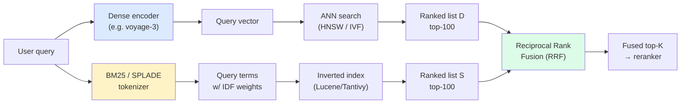
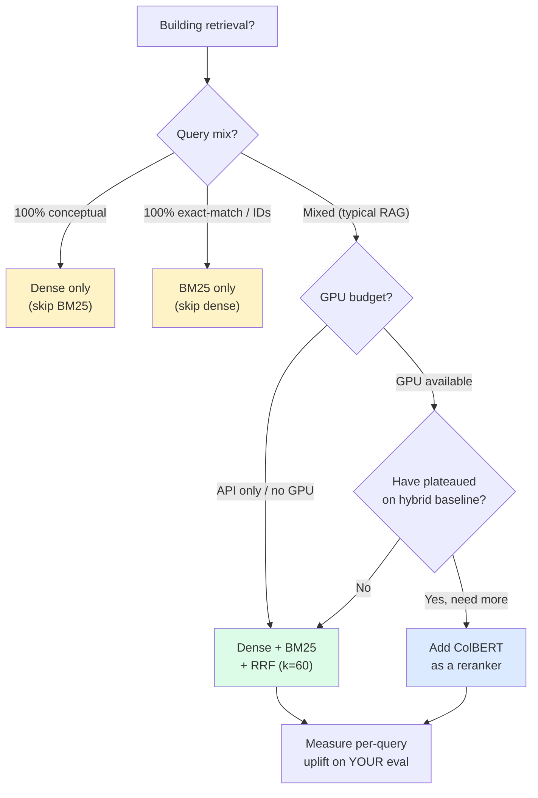

import { Callout } from 'fumadocs-ui/components/callout';

<Callout type="warn" title="TL;DR">
Dense embeddings lose to **BM25** on exact-match queries (product codes, person names, version strings, legal references, error codes, SKUs). Fix it with **dense + BM25 fused by Reciprocal Rank Fusion (RRF), k=60**. Adds 10-20ms latency and ~30% storage; lifts Recall@10 by 8-15 points on mixed-intent corpora. **ColBERT** (late interaction) is a third signal worth adding only when you have GPU budget and the fused dense+BM25 baseline has plateaued. Sparse-only is rarely enough except for pure-ID lookup.
</Callout>

## The problem this solves

Your customer support RAG is running `text-embedding-3-large` with recursive chunking and a reranker. nDCG@10 on your eval set is 0.78. Then a user types:

> "How do I fix error code AUTH-4031 in SDK v2.7.1?"

Your retriever returns chunks about authentication errors, OAuth flows, and SDK upgrade guides — none of which mention `AUTH-4031` or `2.7.1`. The relevant chunk does exist (it's a release note paragraph). The dense embedder couldn't match it because:

- `AUTH-4031` tokenizes to `["AUTH", "-", "40", "31"]`. Those tokens carry no semantic signal — they're rare strings the model has barely seen during pretraining.
- `2.7.1` tokenizes similarly. The embedding for "SDK v2.7.1" lives in roughly the same neighborhood as "SDK v2.6.1" and "SDK v3.0.0".

This is the **lexical blind spot** of dense embeddings. The fix is hybrid search: run a lexical retriever (BM25, the 1994 workhorse) in parallel, fuse the two ranked lists, and recover the queries dense retrieval can't see.

The general pattern:

- **Dense (semantic)** wins on paraphrase, synonym, and conceptual queries: "how do I cancel?" → "termination policy".
- **Sparse (lexical)** wins on rare-token queries: error codes, names, version numbers, SQL identifiers, regex patterns, citation numbers.
- **Fusion** is how you get both without having to predict the query type in advance.

## The core insight

**Every retrieval signal has a failure surface. Hybrid search ensembles complementary failure surfaces.**

- Dense models fail on rare tokens (because rare tokens get squashed into low-information embeddings).
- BM25 fails on paraphrase (because it can only match terms that appear literally).
- ColBERT fails on neither but costs 10-100× more compute.

If you can run two cheap retrievers whose failure modes don't overlap, fusion gives you most of the recall of an expensive single retriever for a fraction of the cost. This is the same insight as ensemble models in ML — diversity matters more than individual accuracy.

The corollary: hybrid search is **not** a free win. If your queries are 100% conceptual (no exact-match intent at all), the BM25 channel adds noise. Measure on your traffic.

## Visual: the hybrid pipeline



Two channels, run in parallel, fused at the rank level. The fusion is rank-based (not score-based) which is why it's robust to the two retrievers using totally different score scales (cosine in [0,1] vs BM25 in [0, ∞)).

## BM25 review (the 30-year-old champion)

If you haven't touched BM25 since grad school, the refresher: it scores a document `D` for a query `Q` as a sum over query terms of three quantities — term frequency in the document, inverse document frequency in the corpus, and a length-normalization factor.

```text
score(D, Q) = Σ_{t in Q}  IDF(t) * (f(t, D) * (k1 + 1)) /
                          (f(t, D) + k1 * (1 - b + b * |D| / avgdl))

where:
  f(t, D)  = count of term t in D
  IDF(t)   = log((N - df(t) + 0.5) / (df(t) + 0.5) + 1)
  N        = total docs in corpus
  df(t)    = number of docs containing t
  |D|      = length of D in tokens
  avgdl    = average doc length in corpus
  k1       ≈ 1.2 to 2.0   (term-frequency saturation knob)
  b        ≈ 0.75         (length normalization knob)
```

What each term does:

- **IDF(t)** down-weights terms that appear in many documents. "the" gets ~0 weight; "AUTH-4031" gets a huge weight.
- **TF saturation** (`(f * (k1+1)) / (f + k1 * ...)`) prevents one repeated term from dominating the score. After ~5 mentions of "refund", the 6th doesn't help much.
- **Length normalization** (`b`) reduces the score of long documents so a 100-token chunk doesn't get penalized vs a 10K-token doc when both mention the term once.

The reference Python implementation (read the source, it's 50 lines):

```python
from rank_bm25 import BM25Okapi
import re

def tokenize(text: str) -> list[str]:
    # lowercase + simple word-split; production uses a stemmer + stopword list
    return re.findall(r"[a-z0-9\-]+", text.lower())

corpus_tokens = [tokenize(chunk) for chunk in chunks]
bm25 = BM25Okapi(corpus_tokens, k1=1.5, b=0.75)

query_tokens = tokenize("error code AUTH-4031 SDK v2.7.1")
scores = bm25.get_scores(query_tokens)
top_idx = scores.argsort()[::-1][:100]
```

`rank_bm25` is fine for prototypes. In production you want **Tantivy** (Rust, used by Quickwit and many vector DBs), **Lucene/Elasticsearch/OpenSearch**, or your vector DB's built-in sparse channel (Qdrant, Weaviate, and Pinecone all ship one).

**Tokenization is the secret sauce.** The default behavior (lowercase + whitespace-split) loses hyphenation. Make sure your tokenizer keeps `AUTH-4031` and `2.7.1` as single tokens (or as recoverable multi-token sequences). This is one of the highest-leverage knobs in a production sparse index.

## Variants and strategies

### 1. Dense + BM25 with Reciprocal Rank Fusion (the default)

RRF (Cormack, Clarke, Büttcher 2009) is the workhorse fusion algorithm. Given two ranked lists, it scores each doc as:

```text
RRF(d) = Σ_{retrievers r} 1 / (k + rank_r(d))

where k = 60 is the standard constant.
```

The key property: the score depends on **rank position**, not the retrievers' raw scores. You can fuse a cosine-similarity list and a BM25 list without normalizing anything.

```python
from collections import defaultdict
import numpy as np
from sentence_transformers import SentenceTransformer
from rank_bm25 import BM25Okapi

def rrf(rank_lists: list[list[str]], k: int = 60) -> list[tuple[str, float]]:
    """Each rank_list is a list of doc_ids in rank order (best first)."""
    scores = defaultdict(float)
    for rl in rank_lists:
        for rank, doc_id in enumerate(rl):
            scores[doc_id] += 1.0 / (k + rank + 1)   # +1 to make rank 1-indexed
    return sorted(scores.items(), key=lambda x: -x[1])

# --- Build retrievers ---
encoder = SentenceTransformer("BAAI/bge-large-en-v1.5", device="cuda")
doc_vecs = encoder.encode(chunks, normalize_embeddings=True, batch_size=64)

corpus_tokens = [tokenize(c) for c in chunks]
bm25 = BM25Okapi(corpus_tokens)

# --- Query time ---
def hybrid_search(query: str, top_k: int = 20, fetch_k: int = 100):
    # Dense channel
    qv = encoder.encode(
        [f"Represent this sentence for searching relevant passages: {query}"],
        normalize_embeddings=True,
    )[0]
    dense_scores = doc_vecs @ qv
    dense_ranked = np.argsort(-dense_scores)[:fetch_k]
    dense_list = [str(i) for i in dense_ranked]

    # Sparse channel
    sparse_scores = bm25.get_scores(tokenize(query))
    sparse_ranked = np.argsort(-sparse_scores)[:fetch_k]
    sparse_list = [str(i) for i in sparse_ranked]

    # Fuse
    fused = rrf([dense_list, sparse_list], k=60)
    return fused[:top_k]
```

**Why k=60?** Empirical. The Cormack et al. paper sweeps k=10..1000 and finds 60 robust across TREC corpora. Lower k (e.g. 10) gives more weight to the top of each list — useful if you trust the top-1 of each retriever. Higher k (e.g. 200) smooths the contributions — useful if you have many retrievers. Most teams set k=60 and never touch it.

**Recall@10 lift over dense alone**: 8-15 points on mixed-intent corpora. Examples from published benchmarks:

| Corpus | Dense only | + BM25 (RRF) | Gain |
|---|---|---|---|
| BEIR/MS MARCO | 0.41 | 0.47 | +6 |
| BEIR/FiQA (finance Q&A) | 0.42 | 0.49 | +7 |
| BEIR/SciFact | 0.66 | 0.72 | +6 |
| Cohere internal e-commerce | 0.61 | 0.73 | **+12** |
| Anthropic Contextual Retrieval | 0.49 | 0.59 | +10 |

The gain is biggest on corpora with lots of rare entities (product names, codes, version numbers).

### 2. Weighted score fusion (when you have ground truth)

If RRF feels coarse and you have labeled data, you can normalize scores and combine with weights:

```python
def weighted_fuse(
    dense_scores: dict[str, float],
    sparse_scores: dict[str, float],
    alpha: float = 0.6,
) -> dict[str, float]:
    # Min-max normalize each channel
    def norm(d):
        if not d: return {}
        lo, hi = min(d.values()), max(d.values())
        if hi == lo: return {k: 0.5 for k in d}
        return {k: (v - lo) / (hi - lo) for k, v in d.items()}

    dn, sn = norm(dense_scores), norm(sparse_scores)
    ids = set(dn) | set(sn)
    return {i: alpha * dn.get(i, 0) + (1 - alpha) * sn.get(i, 0) for i in ids}
```

`alpha` is the dense weight. Tune on a held-out eval set. Typical values: 0.5-0.7 (dense slightly dominates).

**When to prefer weighted over RRF**: when you've measured that *score magnitudes* are meaningful for your retrievers — i.e. a doc with cosine 0.92 is meaningfully better than one with cosine 0.85, not just one rank apart. Most teams find RRF wins because it's parameter-free; weighted wins by 1-3 nDCG points if you tune carefully.

**When weighted fails**: when one channel has a much wider score distribution than the other, min-max normalization gets distorted by outliers. Switch to z-score normalization or just use RRF.

### 3. Learned sparse: SPLADE

SPLADE (Formal et al. 2021, v2 2022) is a dense-network-output-as-sparse-vector. The model outputs a 30K-dim sparse vector (one dim per BERT vocab token) where each non-zero indicates an *expanded* query term — including synonyms and morphological variants the literal query didn't contain.

```python
# Conceptual — SPLADE output
splade_query("error AUTH-4031")
# → {"error": 1.4, "errors": 0.6, "failure": 0.3, "AUTH": 2.1, "4031": 1.9,
#    "authentication": 0.4, "code": 0.5, "401": 0.3, ...}
```

You store this expanded representation in an inverted index just like BM25. Lookup is the same — but you get the synonym/expansion benefit of dense models at the latency and interpretability of sparse retrieval.

**Why it matters**: SPLADE beats BM25 by 5-10 nDCG on MS MARCO. It's a serious alternative to dense + BM25 if you want one retriever instead of two.

**Why it's not the default**: index size is ~5× BM25, inference cost is ~10× (you run a BERT forward pass on every query, and on every doc at index time). Setup is non-trivial — you need to host a SPLADE model and have a vector DB that supports learned sparse (Qdrant, Vespa, OpenSearch with neural-sparse plugin).

```python
# Real-world: Qdrant + SPLADE
from qdrant_client import QdrantClient
from qdrant_client.models import (
    SparseVector, SparseVectorParams, VectorParams, Distance,
)

client = QdrantClient(":memory:")
client.create_collection(
    collection_name="hybrid",
    vectors_config={"dense": VectorParams(size=1024, distance=Distance.COSINE)},
    sparse_vectors_config={"sparse": SparseVectorParams()},
)
# Upload docs with both dense vec and SPLADE sparse vec; Qdrant fuses with RRF at query time.
```

### 4. ColBERT and late interaction

ColBERT (Khattab & Zaharia 2020, v2 2022) doesn't produce a single vector per document. It produces **one vector per token** and computes similarity as **MaxSim**: for each query token, find the closest document token, then sum those.

```text
score(Q, D) = Σ_{q in Q}  max_{d in D}  cos(emb(q), emb(d))
```

Pros:
- Captures fine-grained matches dense (single-vector) loses to averaging.
- nDCG@10 typically +3 to +8 over a strong dense model on BEIR.

Cons:
- Storage explodes: 100-token chunk × 128d ≈ 50 KB. A 1M-doc index is ~50 GB instead of ~5 GB.
- Query latency: 32 query tokens × N doc-token dot products. Production needs PLAID (ColBERTv2's indexing trick) to get sub-100ms latency.

**Where it earns its keep**: as a **reranker** over a dense+BM25 candidate pool. Don't run ColBERT as a first-stage retriever; let it score the top-50 from your fused index.

```python
# Sketch: ColBERT as a second-stage reranker
from colbert.infra import ColBERTConfig
from colbert import Indexer, Searcher  # ColBERT.ai code

candidates = hybrid_search(query, top_k=50)  # dense + BM25 RRF
candidate_docs = [chunks[int(c[0])] for c in candidates]

# Re-score with ColBERT
colbert = Searcher(index="colbert-index", config=ColBERTConfig(nbits=2))
final = colbert.search_provided(query, candidate_docs, k=10)
```

ColBERTv2 numbers on BEIR (single-stage retrieval): nDCG@10 of 0.51 vs `bge-large` dense at 0.47 and dense+BM25-RRF at 0.50. As a reranker over hybrid candidates, it adds another 1-3 points but costs significantly more than a Cohere cross-encoder rerank.

### 5. Sparse-only (when it's actually fine)

Counter-intuitively, **pure BM25** is the right answer for some corpora:

- **ID lookup workloads.** "Find ticket #12345." "What's the changelog for v3.2.1?" Dense embeddings add noise.
- **Legal citation search.** "Brown v. Board of Education, 347 U.S. 483." Citations are exact-match by nature.
- **Code search by symbol.** "Where is `compute_loss_v2` defined?" Lucene + a code tokenizer beats dense embedders for symbol queries.
- **Audit / compliance** where retrieval must be explainable.

You don't need dense for any of these. A well-tuned Elastic or Tantivy cluster is faster, cheaper, and more interpretable.

### 6. Query routing (the underrated optimization)

Instead of *always* running both channels in parallel, classify the query intent first and route to the right retriever:

```python
def classify_query(q: str) -> str:
    # Cheap heuristics first
    if re.search(r"\b[A-Z]{2,}-\d{3,}\b", q):           return "exact"   # error code
    if re.search(r"\bv?\d+\.\d+(\.\d+)?\b", q):          return "exact"   # version
    if re.search(r"#\d+\b", q):                          return "exact"   # issue/ticket
    if len(q.split()) <= 3 and q.isupper():              return "exact"   # SKU/symbol
    if any(w in q.lower() for w in ("how", "why", "explain", "what is")):
        return "semantic"
    return "hybrid"   # default — run both
```

Routing wins three things:
1. **Latency**: skipping a channel saves 5-15ms.
2. **Quality**: noise from the wrong channel doesn't dilute the right one.
3. **Cost**: 50% less retrieval compute on the routed paths.

The trap: a misclassified query goes to one channel, misses entirely, and there's no fallback. **Always include a "hybrid" default**, and consider running hybrid in shadow mode to detect routing mistakes.

More sophisticated routers use a small classifier (a distilled BERT or even an LLM call). DSPy, LlamaIndex, and LangChain all ship `RouterRetriever` abstractions.

## Pitfalls

### Pitfall 1: comparing raw scores from different retrievers

```python
# WRONG
combined = 0.5 * dense_score + 0.5 * bm25_score
```

Cosine similarity is bounded in `[-1, 1]`. BM25 is unbounded — for a long query against a long document, scores can hit 50+. The "combination" is dominated entirely by BM25. Always either:
- Use rank-based RRF (no score comparison needed), **or**
- Min-max or z-score normalize each channel before weighting.

### Pitfall 2: separate tokenizers for query and index

Your indexer lowercases and stems with Snowball. Your query path lowercases but skips stemming. `"running"` in a document gets indexed as `"run"`. `"running"` in a query stays `"running"`. They never match.

Always use **the same analyzer** for indexing and querying. Elasticsearch and OpenSearch let you set a `default_search_analyzer`; in custom Python pipelines, refactor so there's a single `tokenize()` function used in both paths.

### Pitfall 3: not allocating enough candidates per channel

You set `fetch_k=20` per channel, fuse, return top-10. If BM25's top-20 and dense's top-20 don't overlap much (which is the *point* of hybrid), you're throwing away the long tail that contains the right answer.

Rule of thumb: `fetch_k_per_channel >= 5 * top_k_final`. For top-10, fetch 50-100 per channel. The cost is small (sorting 100 floats); the recall is much better.

### Pitfall 4: turning off BM25 because "dense is better"

A team's dense-only nDCG is 0.78. They add BM25 + RRF and dense-only nDCG@10 drops to 0.77 on their eval. They decide hybrid "isn't worth it."

**Look at the per-query breakdown**, not just the average. Hybrid typically:
- Boosts a small fraction of queries by a *lot* (the exact-match ones).
- Slightly hurts a small fraction (paraphrase queries where BM25 noise dilutes dense).
- Is a wash on the majority.

If you weight all queries equally, the boost gets averaged away. **In production, the exact-match queries are often the high-frustration ones** (a user typing an error code is angrier than one asking a conceptual question). Look at user-impact-weighted metrics or P95-worst-query metrics.

### Pitfall 5: not preserving rare tokens through your tokenizer

Default WordPiece / BPE tokenizers split `AUTH-4031` into `["AUTH", "-", "40", "31"]`. The hyphen and the numbers become low-IDF noise. Your custom tokenizer should preserve token shapes like:

- `[A-Z]+-[A-Z0-9]+` (error codes: `AUTH-4031`, `ERR-500`)
- `v?\d+\.\d+(\.\d+)?` (versions: `v2.7.1`, `3.2`)
- `#\d+` (issue numbers)
- domain regexes for SKUs, ISBNs, citations

```python
import re
TOKEN_PATTERNS = [
    r"[A-Z]{2,}[-_][A-Z0-9]{2,}",   # error codes
    r"v?\d+\.\d+(?:\.\d+)?",        # versions
    r"#\d+",                         # issue refs
    r"[a-z0-9]+",                    # standard tokens
]
PAT = re.compile("|".join(TOKEN_PATTERNS), re.IGNORECASE)

def tokenize(text: str) -> list[str]:
    return [m.group(0).lower() for m in PAT.finditer(text)]
```

Same tokenizer for index and query. Test on representative queries.

### Pitfall 6: not deduplicating fused results

If both channels return `doc_42` at different ranks, RRF correctly adds the two contributions. But if you accidentally insert the same doc twice into one channel (e.g. duplicate chunks in your index), you'll over-weight that channel. Deduplicate by `doc_id` before fusion.

## Complexity and cost

For a 10M-chunk corpus, p50 query latency in a typical hybrid stack:

| Component | Storage | Per-query latency | Per-query cost |
|---|---|---|---|
| Dense ANN (HNSW, 1024d float32) | 40 GB | 5-15ms | &lt;$0.0001 |
| BM25 inverted index (Tantivy) | 4-8 GB | 3-10ms | &lt;$0.0001 |
| RRF fusion (in-memory) | — | &lt;1ms | — |
| Reranker cross-encoder (top-50) | — | 50-150ms | $0.001 (Cohere) |
| **Total (dense + BM25 + rerank)** | **~50 GB** | **60-175ms** | **~$0.001** |
| ColBERT (added) | 50-100 GB | 50-200ms | self-host GPU |
| SPLADE (replaces BM25) | 20-50 GB | 30-80ms | self-host GPU |

Hybrid adds about 30% storage and 5-15ms latency over dense-only. **The reranker dominates latency**, not the fusion. We cover that in the next page.

## When NOT to use hybrid

1. **Pure conceptual / paraphrase queries.** Customer-facing chatbots where users type natural-language questions ("how do I get a refund?") rarely benefit from BM25. The exact-match channel adds noise.

2. **Cost-constrained read-heavy systems.** Running two retrievers doubles the storage and roughly doubles the indexing cost. If your query volume is huge and your retrieval quality is already acceptable, the marginal nDCG@10 from hybrid may not justify the AWS bill.

3. **Pure ID / lookup workloads.** As noted above, sparse-only is correct here. Don't bolt on dense for theater.

## Decision rule



## Real-world stacks

- **Anthropic Contextual Retrieval (Sept 2024)**: dense (Voyage) + BM25 with RRF, plus a per-chunk LLM-generated context preamble. Their published numbers: BM25 alone 0.36 retrieval failure rate, dense alone 0.32, contextual dense + contextual BM25 + RRF + Cohere rerank = 0.067. Order-of-magnitude improvement.
- **Glean (enterprise search)**: BM25 + custom dense embedder fine-tuned per tenant + a learned linear fuser (not RRF). They published they tried RRF, scored 2-3 points lower than tuned linear fusion on their internal eval, so they keep the learned weights.
- **Vespa.ai**: ships hybrid as a single ranking expression. Used by Spotify (podcast search), Yahoo Mail (search), and several large news sites. Their default: BM25 + ColBERT-v2 + dense + a learned XGBoost reranker.
- **Elastic / OpenSearch**: hybrid search shipped GA in 2023. Default fusion is RRF. Most enterprise customers use BM25 + dense (their own ML model or OpenAI), not learned sparse.
- **Pinecone Sparse-Dense**: ships SPLADE under the hood as a hosted sparse index. Customers can write a single query against `(sparse_vec, dense_vec)` and Pinecone returns a fused list.
- **Perplexity**: hybrid for web search — dense embedder for the page content, BM25 (Lucene) for the URL + title + anchor text. Fusion is RRF, then a transformer reranker.
- **Cursor (codebase search)**: ColBERT-style late interaction for fine-grained symbol matching, blended with dense for natural-language queries ("the function that handles auth refresh"). They've described this in engineering talks.
- **Stripe Docs**: BM25 (Lucene) + `text-embedding-3-large` dense + cross-encoder rerank, fused with weighted scores after min-max normalization. They publish that their `alpha` is roughly 0.55 dense / 0.45 sparse.
- **Notion AI**: predominantly dense, but they've described adding a sparse channel for the "find by exact title" subset of queries.

## Curated questions to practice

1. Your dense retriever scores 0.74 nDCG@10. You add BM25 + RRF and the score drops to 0.73. A product manager wants to ship dense-only. What's your case for shipping hybrid anyway, and what additional metric would prove it?
2. A user reports that searching `"AUTH-4031"` returns generic auth troubleshooting articles instead of the specific release note. Trace the failure through tokenization, indexing, and fusion. At which step is the bug most likely?
3. You're considering SPLADE to replace BM25. What three measurements would you need to take before committing? What's the threshold gain that justifies the 10× indexing cost?
4. Your fusion uses RRF with k=60. A teammate proposes k=10 to weight top results more heavily. What's the expected effect on (a) Recall@10, (b) Recall@100, (c) eval-set robustness? When would you actually want k=10?
5. ColBERT gives +3 nDCG@10 over your hybrid baseline but costs 8× more storage. You have a $500K/year vector DB bill. Walk through the decision and the dollar threshold at which ColBERT is worth it.

## Quick-reference card

| Question | Answer |
|---|---|
| **Default hybrid setup?** | Dense + BM25, fused with RRF, k=60 |
| **`fetch_k` per channel?** | 5-10× your final top-K (e.g. 100 if returning 10) |
| **Score-based vs rank-based fusion?** | RRF first (no tuning); weighted only if you have labels and have measured the gain |
| **When BM25 only?** | Pure ID / citation / exact-symbol lookup |
| **When dense only?** | 100% conceptual queries, cost-sensitive |
| **When to add SPLADE?** | You have GPU budget and want one retriever instead of two |
| **When to add ColBERT?** | Reranker stage, after dense+BM25 has plateaued |
| **Killer pitfall #1** | Different tokenizers for query and index |
| **Killer pitfall #2** | Comparing raw scores from different retrievers |
| **Killer pitfall #3** | Tokenizer that breaks error codes / versions / IDs |
| **Killer pitfall #4** | Judging hybrid on the mean, not the per-query distribution |
| **What to read next** | [Rerankers & context engineering](/ai/retrieval/rerankers-context) |

---

> Next page: [Rerankers & context engineering](/ai/retrieval/rerankers-context) — cross-encoder rerankers, lost-in-the-middle, and packing context the LLM can actually use.
