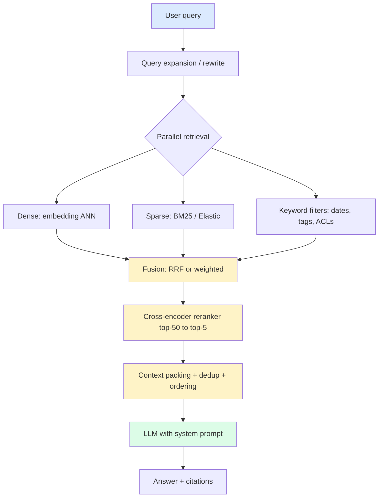

import { Cards, Card } from 'fumadocs-ui/components/card';
import { Callout } from 'fumadocs-ui/components/callout';

<Callout type="info" title="The honest truth about RAG">
"Just embed your docs and stick it in a vector DB" gets you to a demo. It does NOT get you to production. Real RAG systems at companies like Perplexity, Notion AI, Glean, and Cursor are *layered*: smart chunking → multiple retrievers in parallel → fusion → reranking → context packing. This tier walks each layer end-to-end with the numbers that actually matter.
</Callout>

## The retrieval problem in one paragraph

Your LLM has a ~200K token context window (or maybe 1M with Gemini). Your knowledge base has 50 million tokens. You need to surface the **right 5-20K tokens** for each query so the model has enough context to answer correctly without getting lost in noise. That's the retrieval problem. Every page in this tier is about a sharper tool for solving it.

## The five pages

<Cards>
  <Card title="Chunking" href="/ai/retrieval/chunking" description="Why fixed-size chunking destroys recall. Recursive, semantic, sentence-window, parent-document, late-chunking — when each wins and what they cost." />
  <Card title="Embedding models" href="/ai/retrieval/embeddings" description="OpenAI text-embedding-3 vs Cohere embed-v3 vs Voyage vs open-source. MTEB scores, dimensionality, domain fit, fine-tuning when it actually helps." />
  <Card title="Hybrid search" href="/ai/retrieval/hybrid-search" description="Dense retrieval misses exact-match queries; BM25 misses semantic ones. RRF, reciprocal rank fusion, weighted fusion, ColBERT — the recipes that beat either alone." />
  <Card title="Rerankers & context engineering" href="/ai/retrieval/rerankers-context" description="Cross-encoder rerankers (Cohere rerank-v3, BGE, Jina). Context packing, lost-in-the-middle, contextual compression. Where 20% of your accuracy gains live." />
</Cards>

## A typical production retrieval stack

The yellow boxes — fusion, rerank, pack — are where the accuracy gains live. Most "we built RAG" tutorials skip all three. That's why they don't work.

## The metrics that actually matter

Forget cosine similarity on the validation set. The numbers production teams track:

| Metric | What it measures | What to target |
|---|---|---|
| **Recall@K** | % of queries where the right doc is in top-K | 90%+ at K=20 before reranking; 95%+ at K=5 after reranking |
| **MRR (Mean Reciprocal Rank)** | How high the right doc ranks on average | 0.7+ after reranking |
| **Answer faithfulness** | % of generated claims grounded in retrieved context | 95%+ (use [LLM-as-judge](/ai/eval/llm-as-judge)) |
| **End-to-end latency p95** | Total time from query to first token | 800ms for chat; 200ms for autocomplete |
| **Retrieval cost per query** | $ on embeddings + vector DB + reranker | Track separately — reranker is often the dominant cost |

If you don't track these, you can't improve. See [Eval & observability](/ai/eval) for the harness that makes this tractable.

## The progression

Start with **Chunking** — the cheapest win and the single biggest lever. Most teams ship with 512-token fixed chunks and never revisit. Moving to recursive or semantic chunking alone often gives +10-15 points of Recall@10.

Then **Embeddings** — picking the right model for your domain. Generic OpenAI embeddings vs Cohere domain-tuned vs Voyage code-specific can swing Recall@10 by 20 points on technical content.

Then **Hybrid search** — adding BM25 in parallel with dense retrieval. This step alone tends to add another 5-10 points of recall and is the single biggest accuracy win for exact-keyword queries (product codes, person names, legal references).

Then **Rerankers & context engineering** — cross-encoder reranking on the top-50 from hybrid search, then careful context packing. This is where you go from "decent" to "this is actually good".

Each page tells you the cost of every step (in $/query and latency p50/p95) so you can decide what to skip.
