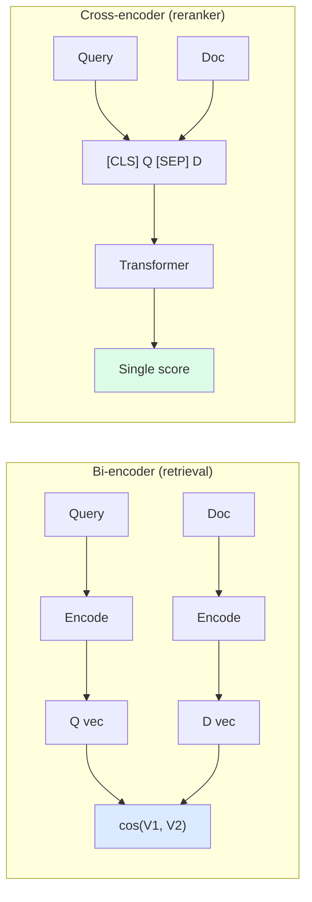
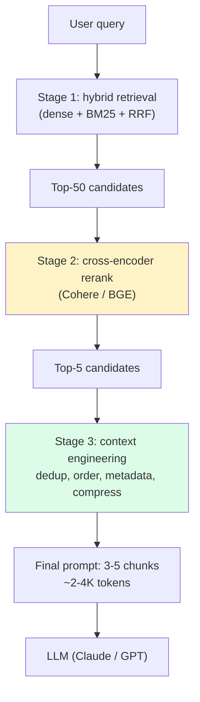
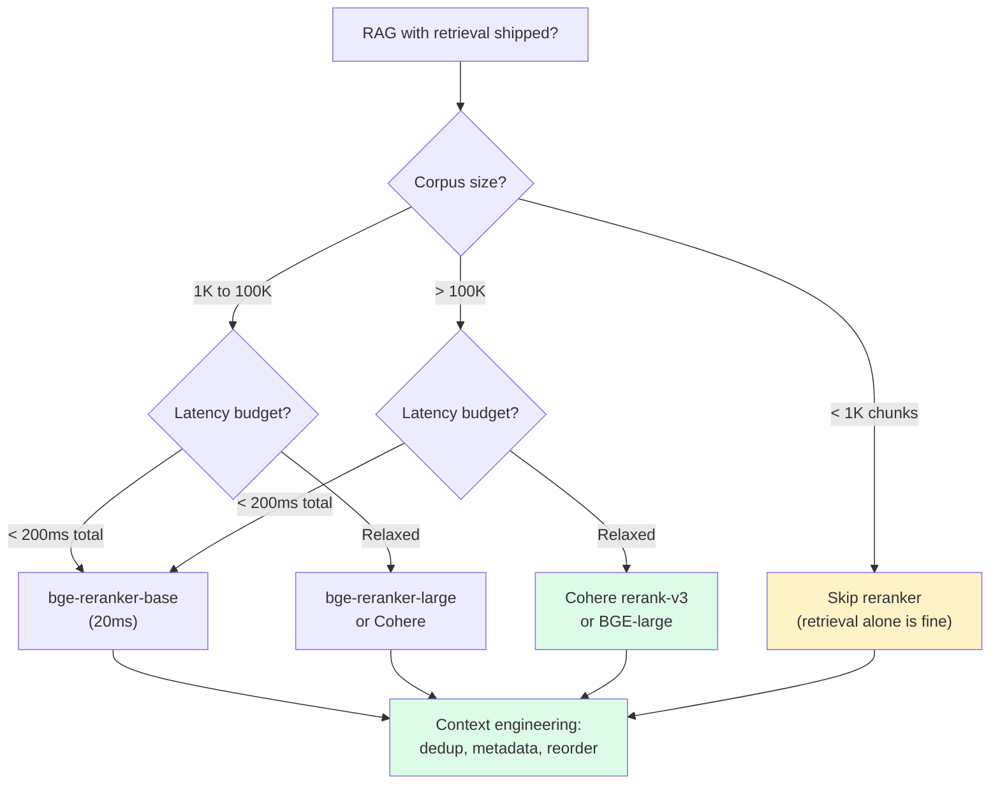

import { Callout } from 'fumadocs-ui/components/callout';

<Callout type="warn" title="TL;DR">
Add a **cross-encoder reranker** to any retrieval pipeline serving more than ~100K docs. Cohere `rerank-v3.0` ($1 / 1K queries, ~100ms p50 over top-50) or self-hosted **BGE-reranker-large** (~50ms on a single L4 GPU) routinely add **+5 to +12 nDCG@10** over a dense+BM25 baseline. Then engineer the context: pack the top-3 to top-5 chunks **with the strongest hit at the start *and* end** (mitigates lost-in-the-middle), prepend chunk metadata, deduplicate, and budget for ~3K tokens of retrieved context, not 30K.
</Callout>

## The problem this solves

You've shipped chunking, picked a great embedder, fused dense + BM25 with RRF. nDCG@10 is 0.82. You're feeling good. Then production traffic comes in:

- A user asks "summarize last week's incidents." You retrieve top-10 chunks. Three of them are the *same* paragraph from the same incident postmortem, duplicated across chunk overlap regions. The LLM ignores the unique chunks and over-weights the repeated one.
- A user asks "what does our SLA say about uptime credits?" You retrieve a 4000-token context with the answer at chunk #5 (in the middle of the prompt). The model returns "I couldn't find specific information" — even though the chunk is right there. This is the **lost-in-the-middle** failure (Liu et al. 2023).
- A user asks a question whose answer requires combining two facts from two chunks. The top-10 contains both, but ranked at positions 1 and 8. The LLM picks up the first one, ignores the eighth, and gives a partial answer.

Retrieval got the right *candidates* into the top-20. **Reranking and context engineering decide which 3-5 of those candidates actually reach the model, and in what order.** This is the last 20% of RAG quality, and it's where most teams leave free uplift on the table.

This page covers:

- Bi-encoder vs cross-encoder fundamentals.
- The shipping rerankers (Cohere, BGE, Jina, mxbai) with prices and latencies.
- Lost-in-the-middle and how to mitigate it.
- Contextual compression (LLMLingua, Anthropic's contextual chunks).
- Context-pack engineering: metadata, dedup, instruction placement, citation hints.

## The core insight

**Bi-encoders are fast and approximate; cross-encoders are slow and accurate. Use the bi-encoder to filter to a candidate set, then use the cross-encoder to rank within it.**



The bi-encoder embeds query and document **separately** — vectors can be precomputed and indexed. The cross-encoder embeds the **concatenation** [query, doc] in one transformer forward pass — every (query, doc) pair is a fresh inference, no caching possible. For N documents and one query: bi-encoder is N vector lookups (fast), cross-encoder is N transformer passes (slow).

Cross-encoders are dramatically more accurate because attention can flow between query and document tokens. Bi-encoders compress each side to a vector before they meet; the cross-encoder lets them interact at every transformer layer.

**Use the bi-encoder to get from 10M docs to top-50. Use the cross-encoder to get from top-50 to top-5.** That's the rerank pattern.

## Visual: the full retrieval stack



The bi-encoder gives you 10M → 50 in ~10ms. The cross-encoder gives you 50 → 5 in ~50-150ms. Context engineering is free (CPU work on a handful of strings) but pays back enormously.

## Variants and strategies

### 1. Cohere `rerank-v3.0` — the API default

```python
import cohere
co = cohere.Client(api_key="...")

results = co.rerank(
    model="rerank-v3.0",                       # or "rerank-multilingual-v3.0"
    query="what does our SLA say about uptime credits?",
    documents=[chunk.text for chunk in top_50_chunks],
    top_n=5,
    return_documents=False,
)
# results.results is sorted by relevance_score, highest first
reranked = [top_50_chunks[r.index] for r in results.results]
```

| Variant | Multilingual | Context | Price | Latency p50 |
|---|---|---|---|---|
| `rerank-english-v3.0` | English | 4096 tokens | **$1 / 1K queries** | ~80ms (top-50) |
| `rerank-multilingual-v3.0` | 100+ langs | 4096 tokens | $1 / 1K queries | ~100ms (top-50) |

**Why it's the API default:**
- One line of code. No GPU to manage.
- Trained on a massive proprietary mix of retrieval data — better out-of-domain generalization than most OSS rerankers.
- 4096-token context per (query, doc) — accommodates long chunks. (For longer docs, Cohere chunks internally and aggregates.)

**Watch out for:**
- $1/1K queries adds up. At 10 QPS sustained, that's ~$2.6K/month just for rerank.
- The API charges per *query* but accepts arbitrary numbers of documents per query (up to 1000). Always batch — sending 50 docs per query is the same price as sending 5.
- Latency is dominated by network + serverside batching. Self-hosted is faster if you have GPU.

Recall@10 uplift over a dense+BM25 baseline: typically +5 to +12 nDCG points on real corpora. Cohere's own published numbers show +10-15 on BEIR.

### 2. BGE rerankers — the self-hosted workhorse

```python
from sentence_transformers import CrossEncoder

# Pick a size for your latency budget
model = CrossEncoder(
    "BAAI/bge-reranker-large",     # 560M params, ~50ms top-50 on L4
    device="cuda",
    max_length=512,
)

# Score pairs in batch
pairs = [(query, chunk.text) for chunk in top_50_chunks]
scores = model.predict(pairs, batch_size=32)

# Sort and take top-5
top_5_idx = scores.argsort()[::-1][:5]
reranked = [top_50_chunks[i] for i in top_5_idx]
```

The BGE reranker family from BAAI:

| Model | Params | Max length | Approx GPU latency (top-50) | Notes |
|---|---|---|---|---|
| `bge-reranker-base` | 278M | 512 | ~20ms (L4) | Fast, weakest accuracy |
| `bge-reranker-large` | 560M | 512 | ~50ms (L4) | **Default OSS choice** |
| `bge-reranker-v2-m3` | 568M | **8192** | ~80ms (L4) | Long context, multilingual |
| `bge-reranker-v2-gemma` | 2B | 8192 | ~200ms (A100) | Highest OSS accuracy |
| `bge-reranker-v2-minicpm-layerwise` | 2.7B | 8192 | ~150ms (A100) | Skip-layer inference for speed |

**Why pick BGE:**
- Free, Apache 2.0 / MIT licensed.
- `bge-reranker-large` is roughly on par with Cohere `rerank-english-v3.0` on BEIR (within 1-2 nDCG).
- Lower latency than the Cohere API in many setups (no network hop).
- Cost: a single L4 GPU ($0.50/hr on most clouds) handles ~10 QPS reranking comfortably.

**Watch out for:**
- 512-token limit on the older variants. If your chunks are longer, you'll silently truncate. Use `bge-reranker-v2-m3` for 8K context.
- Batching matters a lot. Sending pairs one-at-a-time is 10× slower than batching 32. Use a request queue + micro-batcher (Triton, Ray Serve, BentoML).

### 3. Jina reranker

```python
import requests

resp = requests.post(
    "https://api.jina.ai/v1/rerank",
    headers={"Authorization": f"Bearer {JINA_API_KEY}"},
    json={
        "model": "jina-reranker-v2-base-multilingual",
        "query": query,
        "documents": [c.text for c in top_50_chunks],
        "top_n": 5,
    },
).json()
```

`jina-reranker-v2-base-multilingual` (278M, multilingual, 1024-token context) is the main one. Pricing: ~$0.02 / 1M tokens of input (cheaper than Cohere on long documents; comparable on short ones). Quality: BEIR nDCG within 0.5-1.5 of Cohere `rerank-v3.0` and BGE-large.

**Why pick Jina**: cheaper than Cohere at long-document workloads; same one-line API; native multilingual.

### 4. mxbai-rerank, MS MARCO MiniLM, and others

| Model | Why you'd pick it |
|---|---|
| `mixedbread-ai/mxbai-rerank-large-v1` | Apache 2.0, competitive with BGE-large on BEIR, easy to fine-tune |
| `cross-encoder/ms-marco-MiniLM-L-6-v2` | 22M params, 5ms latency — great for ultra-cheap dev or edge |
| `castorini/monoT5-3b-msmarco` | LLM-based reranker, top-of-BEIR but slow |
| OpenAI `omni-moderation-rerank` (rumored, 2026) | Not GA at time of writing — watch for it |

### 5. LLM-as-reranker (use sparingly)

You can also use a small LLM to rerank by prompting it to score relevance:

```python
prompt = f"""Score the relevance of each document to the query on a 0-10 scale.
Query: {query}
Documents:
1. {doc1}
2. {doc2}
...
Respond with JSON: [{{"id": 1, "score": 7}}, ...]"""
```

This is what RankGPT (Sun et al. 2023) and several research systems do. It works but it's slow and expensive — typically 5-50× the cost of a cross-encoder rerank for marginal gain. Use only when you need to explain the rerank, or for offline/eval workloads where latency doesn't matter.

## Lost-in-the-middle

Liu et al. (Stanford, July 2023, "Lost in the Middle: How Language Models Use Long Contexts") showed that LLMs systematically underuse information placed in the middle of their context window. Recall accuracy as a function of the relevant info's position is U-shaped — best at the start, second-best at the end, much worse in the middle.

Replicated in dozens of follow-up studies:
- **GPT-3.5**: accuracy drops from ~75% (start) to ~50% (middle) on multi-document QA.
- **Claude 2 / Claude 3**: less affected than GPT but still U-shaped. Claude 3.5 Sonnet drops ~10 points middle vs ends.
- **GPT-4o / GPT-4 Turbo**: improved but not solved. Anthropic's "needle in a haystack" eval shows the issue persists at 100K+ contexts.

The implication for RAG: **the order in which you concatenate retrieved chunks matters.** Don't dump top-5 chunks in rerank order if rerank-rank-1 happens to land in the middle of the prompt.

Two mitigations:

### Mitigation A: re-order chunks "start-end-middle" after rerank

```python
def reorder_for_attention(chunks_in_rerank_order: list) -> list:
    """Place strongest hits at the start and end; weakest in the middle.
    Effectively reverses the lost-in-the-middle curve."""
    n = len(chunks_in_rerank_order)
    reordered = [None] * n
    # Pop strongest from front, alternate placing at start and end
    left, right = 0, n - 1
    for i, chunk in enumerate(chunks_in_rerank_order):
        if i % 2 == 0:
            reordered[left] = chunk
            left += 1
        else:
            reordered[right] = chunk
            right -= 1
    return reordered

# Example: rerank order [A, B, C, D, E]
# → reordered [A, C, E, D, B]   (A at start, B at end, middle gets the weakest)
```

LlamaIndex ships this as `LongContextReorder`. Reported gains: 2-5 points on multi-hop QA with GPT-3.5; smaller (1-2 points) on Claude 3.

### Mitigation B: don't over-pack the context

The lost-in-the-middle effect is worst when the prompt is huge. If you pack 30K tokens of retrieved context, the middle 20K is mostly wasted. **Most production RAG works best with 2-4K tokens of retrieved context** — top 3-5 chunks at ~800 tokens each — regardless of model context window.

The temptation is to "give the model everything." Resist it. Smaller, better-ranked context outperforms larger, dilute context.

## Contextual compression

When you have many high-quality candidates and a tight token budget, *compress* the context. Two approaches:

### LLMLingua / LongLLMLingua (Microsoft Research, 2023-24)

LLMLingua uses a small LLM (a 7B model) to identify and remove tokens that contribute least to the downstream task. Compression rates of 2-20× with minimal accuracy loss on Q&A benchmarks.

```python
from llmlingua import PromptCompressor

llm_lingua = PromptCompressor(model_name="microsoft/llmlingua-2-xlm-roberta-large-meetingbank")

compressed = llm_lingua.compress_prompt(
    context=concatenated_chunks,
    instruction="Answer the user's question.",
    question=query,
    target_token=1500,   # compress down to ~1500 tokens
    rank_method="longllmlingua",
)
# compressed["compressed_prompt"] is the shorter context
```

**When it pays off**: corpora with redundant or verbose chunks (legal docs, regulatory filings, transcripts), tight cost constraints. Compression ratio 3-5× typically loses &lt;1 nDCG of downstream accuracy.

**When it doesn't**: short, dense chunks where every token matters (code, structured data). The compressor strips meaningful information.

### Anthropic "Contextual Retrieval" preamble (Sept 2024)

A *generative* compression-in-reverse: prepend a Claude-generated 50-100 token *contextual summary* before each chunk **at index time** that gives the chunk its document context. The chunk then both retrieves better (more context in the embedding) and reads better (LLM understands what document the chunk is from).

```python
preamble_prompt = f"""<document>{full_doc}</document>
<chunk>{chunk_text}</chunk>
Please give a short, 50-100 token context describing what the chunk is about
in the context of the full document, to improve retrieval and grounding."""

context = claude.messages.create(
    model="claude-3-haiku-20240307",   # cheap; chunked at index time
    messages=[{"role": "user", "content": preamble_prompt}],
).content[0].text

embedding_input = f"{context}\n\n{chunk_text}"
# Then embed and store. Use the SAME concatenation at query time.
```

Anthropic's published numbers: combining contextual embeddings + contextual BM25 + RRF + Cohere rerank reduced retrieval-failure rate from 5.7% (baseline) to 1.9% (contextual + rerank) on their evals. Cost: ~$1.02 per million tokens of doc with prompt caching. Comparable to embedding cost.

### Other compression patterns

- **Summarization fallback**: when retrieved context exceeds your budget, replace overflow with a 1-paragraph LLM summary. Useful for "show me everything about X" queries.
- **Selective dropping**: rank chunks by reranker score, drop the lowest-scoring ones until under budget. Simple and works.
- **Tree summarization** (LlamaIndex `TreeSummarize`): recursively summarize pairs of chunks bottom-up. Good for "summarize everything" intent.

## Context window engineering

The "free uplift" most teams miss. Beyond rerank and compression, these CPU-cheap moves consistently move metrics:

### 1. Deduplicate

Your top-5 reranked chunks often include 2 chunks from the same document with overlapping content (because of chunk overlap, or because the document repeats itself). Dedup by:

```python
def dedup(chunks, sim_threshold: float = 0.85):
    keep = []
    for c in chunks:
        if all(jaccard(c.text, k.text) < sim_threshold for k in keep):
            keep.append(c)
    return keep
```

Use Jaccard on token sets for speed. Or embed each chunk and use cosine; threshold 0.85-0.92 catches most overlap. Drops one chunk on average per query, freeing a slot for genuinely new information.

### 2. Prepend metadata

Each chunk should ship with the breadcrumbs the LLM needs to ground its answer:

```python
def format_chunk(chunk) -> str:
    return f"""[Source: {chunk.doc_title} | Section: {chunk.heading} | Updated: {chunk.updated_at}]
{chunk.text}"""
```

Costs ~30-50 tokens per chunk. Buys:
- The LLM can cite which source it's quoting (huge for trust and observability).
- For multi-tenant or multi-product corpora, the LLM can tell which product an answer is about.
- "Updated" lets the LLM prefer recent info when chunks conflict.

### 3. Place the instruction *after* the context (for Claude/GPT)

Both Anthropic and OpenAI have published that placing the user's query *after* the retrieved context — not before — improves grounding:

```python
# Less effective
prompt = f"""Answer this question: {query}

Context:
{context}"""

# More effective
prompt = f"""<context>
{context}
</context>

Based on the context above, answer: {query}"""
```

Anthropic's docs explicitly recommend the latter pattern. Reported gains: 2-5 points on grounded-QA benchmarks. Claude 3.5/4 especially benefits from XML-tag delineation.

### 4. Add citation hints

If you want the model to cite sources inline, instruct it explicitly *and* give chunks numeric IDs:

```python
formatted = "\n\n".join(
    f"[{i+1}] [Source: {c.doc_title}]\n{c.text}"
    for i, c in enumerate(chunks)
)

prompt = f"""<context>
{formatted}
</context>

Answer the question. When making a claim, cite the source by its number, e.g. [2].
If the context doesn't contain the answer, say so.

Question: {query}"""
```

This dramatically improves citation accuracy (Perplexity, Notion AI, and most enterprise RAGs use this pattern).

### 5. Negative-evidence instruction

Tell the model it's allowed to say "I don't know":

```text
If the context doesn't contain the answer, respond exactly with:
"I don't have that information in the provided sources."
Do not speculate or use external knowledge.
```

Reduces hallucination on out-of-coverage queries by 30-60% in published benchmarks. Pair it with retrieval-quality monitoring (if you see "I don't know" rates rising, your retrieval has regressed).

## Pitfalls

### Pitfall 1: reranking on the wrong field

You retrieved chunks that include a prepended metadata header (`[Source: ...] [Section: ...]`). You pass the *full* chunk including the header to the reranker. The reranker scores partially on the metadata text, which is noise. Either:

- Strip metadata before reranking, re-add it before sending to the LLM, **or**
- Train a reranker that knows to ignore the header (Cohere's API handles this implicitly because they trained on metadata-prefixed chunks; most OSS rerankers don't).

### Pitfall 2: not pre-filtering with retrieval

You ship a reranker and feed it your top-1000 retrieval candidates. Latency explodes to 2+ seconds. Reranker latency scales linearly with candidates. **Always pre-filter to top-50 to top-100** with the bi-encoder before reranking.

```python
# WRONG
candidates = vector_db.query(qv, top_k=1000)
reranked = reranker.rerank(query, candidates, top_n=5)   # 2s latency

# RIGHT
candidates = vector_db.query(qv, top_k=50)
reranked = reranker.rerank(query, candidates, top_n=5)   # 80ms latency
```

50-100 is the sweet spot for most rerankers. If you find yourself wanting to rerank 1000+, the bug is upstream — your retrieval recall is poor and you're papering over it with brute force.

### Pitfall 3: silently truncating long chunks

`bge-reranker-large` has a 512-token limit on the concatenated (query, doc) pair. If your chunks are 800 tokens, the reranker sees only the first ~480 tokens of each doc. The most relevant sentence might be in the tail and you'd never know.

Either:
- Chunk smaller (so each chunk fits in the reranker's limit), or
- Use a long-context reranker (`bge-reranker-v2-m3` is 8K).

Always assert chunk length against your reranker's context at index time.

### Pitfall 4: forgetting that rerankers are query-dependent

You cache embeddings. You cache the retrieval result. You try to cache the rerank score. But the rerank score is a function of `(query, doc)` — there's nothing to cache across queries. Don't bother caching rerank; cache retrieval.

### Pitfall 5: stuffing the prompt

You have a 200K-token Claude context window. You retrieve top-50 chunks. "Why not just send all of them?" Because:

- Lost-in-the-middle gets worse with prompt size.
- Cost scales with input tokens (Claude 3.5 Sonnet: $3/M input, $15/M output — 50 chunks × 800 tokens × $3/M = $0.12 per query just for retrieval input).
- Most rerankers' top-5 carry 90%+ of the useful signal; positions 6-50 are mostly noise.
- The LLM gets distracted by tangentially-relevant chunks.

Production RAGs converge on 3-5 chunks regardless of context window. Use the context window for system prompt, user turn history, and tool definitions — not for retrieved chunks.

### Pitfall 6: ignoring chunk order after rerank

You rerank, get [A, B, C, D, E] in score order, then concat them as-is. The LLM gives more weight to A and E, less to C (lost-in-the-middle). Either reorder ("start-end-middle" pattern) or — even simpler — return only top-3, where positional effects are negligible.

### Pitfall 7: forgetting to revisit your reranker as the corpus drifts

Your corpus was 1M docs when you picked `bge-reranker-large`. It's now 50M docs. The reranker was trained on data with a different domain distribution, and over time its calibration drifts. Re-benchmark rerankers every 6 months against a refreshed eval set.

## Complexity and cost

For a single query with hybrid retrieval (10ms) + rerank (50-150ms) + LLM (~1500ms) on a 10M-chunk corpus:

| Stage | p50 latency | Per-query cost (10M chunks, 1K QPS) |
|---|---|---|
| Hybrid retrieve (top-50) | 10-20ms | &lt;$0.0001 (vector DB amortized) |
| Cohere rerank (top-50 → top-5) | 80-100ms | $0.001 |
| BGE rerank self-hosted (top-50 → top-5) | 50-80ms (L4) | ~$0.0001 amortized |
| Context engineering (dedup, reorder, format) | &lt;5ms | $0 |
| LLM call (Claude 3.5 Sonnet, ~3K input tokens) | ~1500ms | $0.009 input + output |
| **Total** | **~1700ms** | **~$0.01** |

A Cohere-based rerank stack adds about $0.001/query and ~100ms over no rerank. For typical retrieval gains (+5-12 nDCG), that's almost always worth it.

Self-hosting BGE on a single L4 (~$300/month on AWS/GCP) handles ~10-20 QPS sustained. At higher load, batch across multiple GPUs.

## When NOT to use a reranker

1. **Very small corpora (< 1000 chunks).** Just retrieve top-K from a good bi-encoder. The marginal nDCG gain doesn't justify the latency.

2. **Hard-real-time UX (< 200ms total budget).** Some autocomplete or in-IDE retrieval flows can't afford a 50ms reranker. Use a strong bi-encoder + tight tokenization + carefully tuned k.

3. **Pure exact-match workloads.** If your top hits from BM25 are already "the answer" (ID lookup, citation search), reranking is wasted compute. The retriever has already won.

## Decision rule



## Real-world stacks

- **Anthropic Contextual Retrieval (Sept 2024)**: Voyage embeddings + BM25 (contextual) + RRF + **Cohere `rerank-v3.0`**. Reduced top-20 retrieval-failure rate from 5.7% to 1.9% on their evals.
- **Perplexity**: dense + BM25 + custom transformer reranker (in-house, distilled from a larger teacher). They've shared in talks that their reranker is the highest-leverage component in their pipeline.
- **Notion AI**: dense retrieval + Cohere `rerank-multilingual-v3.0` + chunk-metadata-aware prompt formatting. Public engineering blog (2024) details the move from no-reranker to reranker, citing a ~30% reduction in "wrong-answer" CSAT complaints.
- **Glean**: in-house cross-encoder reranker fine-tuned per-tenant on click-through data (clicks treated as positive signal). They claim +10-15 nDCG on tenant-tuned models over off-the-shelf.
- **Cursor**: ColBERT-style late interaction acts as both retriever and reranker for codebase search. They additionally apply a context-packing step that prioritizes (a) the function the user's cursor is in, (b) imports, (c) recently-edited files.
- **GitHub Copilot Workspace**: retrieval + reranker over the active repo. Uses a custom code-specific cross-encoder. Public docs describe lost-in-the-middle mitigations: imports always at the top of the context window, current file context always at the bottom (closest to the generation point).
- **OpenAI ChatGPT Retrieval (Knowledge files)**: rerank step is undocumented but observed in latency profiles. Public guidance emphasizes context-window discipline: ~3-5 chunks is the sweet spot even with GPT-4o's 128K window.
- **Stripe Docs Search**: hybrid retrieval + Cohere rerank + an engineered prompt with strict citation requirements. Their published "good chunk" guidelines: 400-800 tokens, metadata header, dedup at query time.
- **LinkedIn search**: published in 2024 that they use a multi-stage rerank — first a small cross-encoder (fast), then a larger LLM-based reranker for the top-20. Cascading rerankers is a common pattern at very high QPS.

## Curated questions to practice

1. Your nDCG@10 with hybrid retrieval is 0.79. You add Cohere rerank-v3 and it becomes 0.83. P95 latency went from 200ms to 320ms. A PM asks if it's worth shipping. What additional measurements would you bring to that meeting?
2. A user reports the model answered "I couldn't find that" but the right chunk is in your top-5 retrieved list. Walk through the failure modes between "chunk retrieved" and "chunk used." Where would you instrument to localize the issue?
3. You're considering a self-hosted BGE reranker vs Cohere's API. Your traffic is 50 QPS sustained, peak 200 QPS. Walk through the cost / latency / operational trade-off. What's your decision and why?
4. Your context contains the top-5 reranked chunks, in score order. The LLM consistently misses information in chunk #3 even when it's clearly the answer. Diagnose and propose two fixes.
5. You're shipping Anthropic-style contextual retrieval. Indexing cost (the per-chunk LLM preamble) is $4K for the initial run. The PM wants to know what gain to expect. What's your honest answer based on published numbers, and what would you measure post-launch to validate?

## Quick-reference card

| Question | Answer |
|---|---|
| **Default API reranker?** | Cohere `rerank-v3.0` ($1 / 1K queries) |
| **Default self-hosted reranker?** | `BAAI/bge-reranker-large` on a single L4 GPU |
| **How many candidates to rerank?** | Top-50 from retrieval; never more than 100 |
| **How many chunks to send to LLM?** | 3-5 for almost all production cases |
| **Best chunk ordering?** | "Start-end-middle" reorder (LlamaIndex `LongContextReorder`) — or just top-3 |
| **Lost-in-the-middle mitigation?** | Smaller context (2-4K tokens), place query *after* context, reorder strongest to ends |
| **Should I add citation hints?** | Yes — number chunks `[1], [2], ...` and ask the model to cite |
| **Killer pitfall #1** | Reranking too many candidates (> 100) |
| **Killer pitfall #2** | Silently truncating long chunks at the reranker context limit |
| **Killer pitfall #3** | Stuffing the full context window — quality drops |
| **Killer pitfall #4** | Ignoring chunk order after rerank (LITM effect) |
| **What to read next** | [Inference](/ai/inference) — model serving, batching, KV cache, structured output |

---

> Next page: [Inference](/ai/inference) — once retrieval is solid, the next bottleneck is generation: KV cache, batching, structured output, and the latency/cost knobs that actually move the dial.
