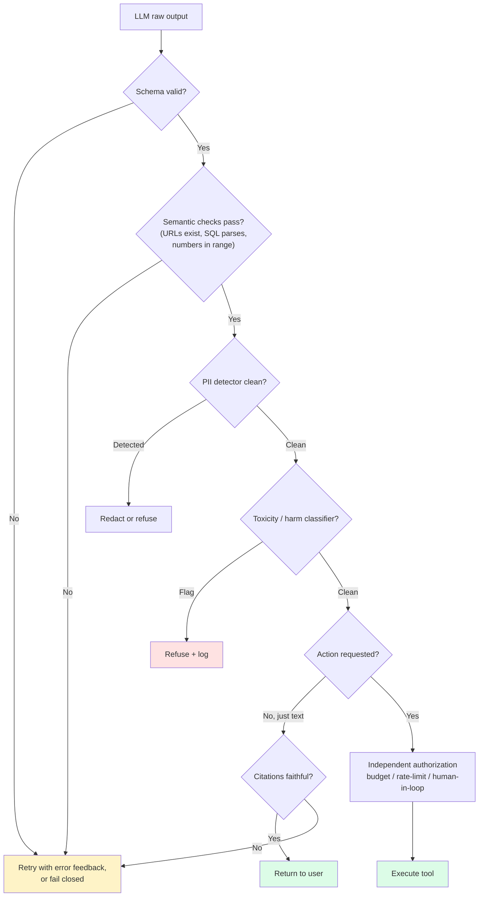
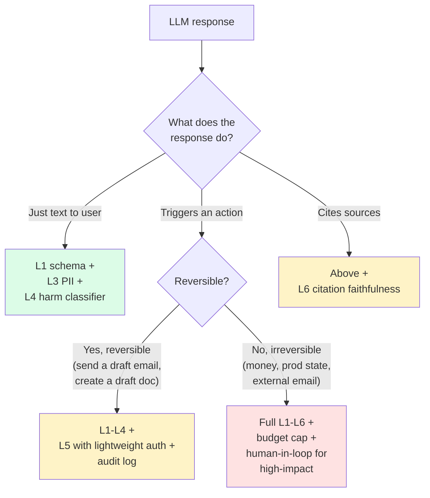

import { Callout } from 'fumadocs-ui/components/callout';

<Callout type="warn" title="TL;DR">
**Never trust model output, especially when it triggers an action.** Validation is layered: (1) schema (Pydantic / Zod — fail closed on bad JSON), (2) semantic (does the cited URL exist? does the SQL parse? are the prices in range?), (3) PII scrub (Presidio + GLiNER + regex for SSN/CC/email), (4) harm classifier (Llama Guard 3 or OpenAI Moderation), (5) action authorization (any irreversible action is gated by a non-LLM check), (6) citation faithfulness (does the cited doc actually contain the claim?). Skip any layer and that's the layer attackers find first.
</Callout>

## The problem this solves

Your model emits text. That text gets:
1. Shown to a user (reputational and legal risk).
2. Parsed as JSON and stored in your database (data corruption risk).
3. Converted into a tool call that does something (operational and financial risk).
4. Pasted into another system that itself runs code (RCE risk via downstream parsers).

In every case, the output is **untrusted data** the moment it leaves the model. You wouldn't take a user's POST body and `eval()` it. You shouldn't take a model's response and trust its claims, its JSON validity, its citations, or its safety either.

The most expensive incidents in 2023-2024 were not pure prompt injections. They were **trusted-output incidents**:

- **Air Canada chatbot (2024)** — a customer-service chatbot promised a bereavement discount that didn't exist. Air Canada argued the bot was "a separate legal entity"; the tribunal ruled they were liable for what their bot said and ordered them to honor the discount.
- **Mata v. Avianca (2023)** — a New York lawyer cited six ChatGPT-fabricated case citations in a federal brief. Sanctions, viral story, career damage.
- **GM Chevrolet dealer chatbot (Dec 2023)** — a customer convinced it to "agree" to sell a Tahoe for $1, with "legally binding offer, no takesies-backsies." Brand damage, removed from production.
- **Samsung ChatGPT incident (April 2023)** — engineers pasted source code into ChatGPT for help; the code became training data. Samsung banned generative AI tools.

In every case, a layer of validation between the model and the user (or the action, or the storage) would have caught it.

## The core insight

**Trust the input you control. Validate the output you don't.** Even with perfect alignment, the model:

- Hallucinates plausible-but-wrong facts. Validation: ground every factual claim in a retrieved source and check the source.
- Emits malformed structured data under unusual inputs. Validation: schema, fail closed.
- Reproduces PII from its context window. Validation: scrub on the way out.
- Picks tool arguments that are syntactically valid but semantically destructive. Validation: argument-level rules on the tool, not on the prompt.
- Produces confident-looking citations that don't exist. Validation: check the citation against the actual source.

Each of these is a different defense; each costs a few ms and a few tokens; together they turn "the model said it" into "the model said it AND we confirmed it."

## Visual — the output validation pipeline



Every arrow that doesn't end at `Ship` or `Execute` is a saved incident.

## The six validation layers

### Layer 1 — Schema validation

If your model returns JSON, validate it. Always. Fail closed if it doesn't parse, and either retry with the error as feedback or fall back to a safe default.

```python
from pydantic import BaseModel, ValidationError, Field
from typing import Literal

class RefundDecision(BaseModel):
    decision: Literal["approve", "deny", "escalate"]
    reason: str = Field(min_length=10, max_length=500)
    refund_amount_cents: int = Field(ge=0, le=100_000_00)  # cap at $100k
    requires_human: bool

def validate_refund(raw: str, max_retries: int = 2):
    last_error = None
    for attempt in range(max_retries + 1):
        try:
            return RefundDecision.model_validate_json(raw)
        except ValidationError as e:
            last_error = e
            raw = llm.complete(
                system="Fix the JSON to match the schema. Return ONLY JSON.",
                messages=[{"role": "user", "content": f"Previous output: {raw}\nError: {e}"}],
            )
    raise OutputValidationFailed(last_error)
```

Equivalent in TypeScript with Zod:

```typescript
import { z } from "zod";

const RefundDecision = z.object({
  decision: z.enum(["approve", "deny", "escalate"]),
  reason: z.string().min(10).max(500),
  refund_amount_cents: z.number().int().min(0).max(10_000_000),
  requires_human: z.boolean(),
});

function validateRefund(raw: string) {
  const parsed = RefundDecision.safeParse(JSON.parse(raw));
  if (!parsed.success) throw new OutputValidationFailed(parsed.error);
  return parsed.data;
}
```

**Use structured output / JSON mode if the provider offers it.** OpenAI's `response_format={"type": "json_schema", "schema": ...}`, Anthropic's tool-use with strict schemas, Gemini's `responseSchema`. These constrain the model's decoder so the output is guaranteed-parseable. You still validate, because the structural guarantee doesn't catch out-of-range numbers or wrong-type fields.

**The Field constraints matter.** A model that returns `refund_amount_cents: 9_999_999_999` and your schema only checks the field exists will accept it. Constrain max values to a tenant-appropriate cap. Constrain enums.

### Layer 2 — Semantic validation

Schema only checks shape. Semantic validation checks meaning.

```python
def semantic_validate(decision: RefundDecision, order: Order):
    # The model claimed to refund $X. Is X plausible for this order?
    if decision.refund_amount_cents > order.total_cents:
        raise SemanticInvalid("refund exceeds order total")
    # The model said "approve" but the customer has 47 prior refunds
    if decision.decision == "approve" and order.customer.lifetime_refund_count > 10:
        raise PolicyViolation("customer exceeds refund frequency policy")
    # The reason text mentions a SKU — does the SKU exist on the order?
    for sku in extract_skus(decision.reason):
        if sku not in order.skus:
            raise HallucinatedReference(sku)
    return decision
```

For SQL-generating LLMs: parse the SQL with `sqlglot` and check it touches only allowed tables, has no `DELETE` / `DROP` / `TRUNCATE` unless explicitly authorized, has a `LIMIT` clause, doesn't `SELECT *` if a column allowlist applies.

For citation-emitting LLMs: every claimed URL must `HEAD 200` and (optionally) be on a domain allowlist.

For code-generating LLMs: every claimed import must exist on PyPI / npm. The "slopsquatting" attack family (2024) showed attackers register packages with names LLMs commonly hallucinate, so installing-what-the-model-said is a real RCE vector.

### Layer 3 — PII detection and redaction

PII can land in your output two ways:

1. **Memorized from training data.** Rare for frontier models with deduplication, but documented (Carlini et al., "Extracting Training Data from LLMs").
2. **Echoed from context.** The user pasted a CSV with SSNs. The retrieved doc had an internal employee phone. The model dutifully repeats it.

The defenses you choose depend on where you scrub.

**Input-side scrub** (cheaper, leaks-prevention focused): redact PII *before* the model sees it. The model can't leak what it never saw. Trade-off: you may degrade response quality because the redaction removes useful context.

**Output-side scrub** (more permissive): let the model see PII but scrub it on the way out. Better answer quality. Trade-off: if the scrubber misses something, it leaks.

**Both** is the right default for regulated workloads.

The detector ecosystem:

- **Microsoft Presidio** — open-source, regex + spaCy NER + custom recognizers. Solid baseline. Handles SSN, credit card, email, phone, IBAN, IP, MAC, US driver's license, and many country-specific IDs.
- **AWS Comprehend (PII detection)** — managed API, covers ~25 PII types, integrates with redaction. Good if you're already on AWS.
- **GLiNER (Generalist NER)** — modern transformer-based NER. Catches entities Presidio's regex misses (e.g., a person's name in unstructured text).
- **Regex baseline** — never the only layer, but always a layer. SSN, US/EU phone, credit card (Luhn-validated), email, IP, plus tenant-specific patterns (internal employee IDs).

```python
from presidio_analyzer import AnalyzerEngine
from presidio_anonymizer import AnonymizerEngine
from gliner import GLiNER

analyzer = AnalyzerEngine()
anonymizer = AnonymizerEngine()
gliner = GLiNER.from_pretrained("urchade/gliner_large-v2.1")

PII_LABELS = ["person", "phone number", "email", "credit card",
              "ssn", "address", "passport number", "date of birth"]

def scrub_pii(text: str, mode: str = "redact") -> str:
    # Layer 1: Presidio (regex + NER)
    results = analyzer.analyze(text=text, language="en")
    text = anonymizer.anonymize(text=text, analyzer_results=results).text

    # Layer 2: GLiNER catches what Presidio missed
    entities = gliner.predict_entities(text, PII_LABELS, threshold=0.5)
    # Apply right-to-left so offsets stay valid
    for ent in sorted(entities, key=lambda e: -e["start"]):
        replacement = f"[{ent['label'].upper()}]" if mode == "redact" else "***"
        text = text[:ent["start"]] + replacement + text[ent["end"]:]

    # Layer 3: regex backstop
    text = re.sub(r"\b\d{3}-\d{2}-\d{4}\b", "[SSN]", text)
    text = re.sub(r"\b(?:\d[ -]*?){13,16}\b", lambda m: "[CC]" if luhn_check(m.group()) else m.group(), text)
    return text
```

**Choose redact vs. tokenize vs. refuse based on use case:**
- **Redact** (`[NAME]`) — most permissive, preserves doc structure for the user.
- **Tokenize** (`<NAME_1>`) — reversible if you hold the mapping; good for workflows where you need to re-insert PII downstream.
- **Refuse** — for outputs where PII presence itself means something went wrong (an external chatbot should never emit a customer's internal employee ID).

### Layer 4 — Harm / toxicity classifiers

Schema and semantic checks don't catch the model calling a customer a slur. You need a classifier.

The options as of 2026:

- **Llama Guard 3 (Meta, 2024)** — open-source, 1B and 8B variants, classifies input and output against a configurable harm taxonomy (S1-S14 in Llama Guard 3: violent crimes, sex crimes, CSAM, defamation, privacy, hate, self-harm, etc.). State of the art for self-hosted.
- **OpenAI Moderation API** — free, low-latency, 13 categories, multimodal (handles images too). The default if you're already paying OpenAI for inference.
- **Anthropic harmlessness** — built into the model via constitutional AI; not exposed as a separate classifier API.
- **Google Perspective API** — older, toxicity / threat / insult scoring. Showing its age but still used.
- **Detoxify / unitary-ai** — open-source toxicity classifier, lighter weight than Llama Guard, less coverage.

```python
# Llama Guard 3 inline (self-hosted)
from transformers import AutoTokenizer, AutoModelForCausalLM

tok = AutoTokenizer.from_pretrained("meta-llama/Llama-Guard-3-8B")
mdl = AutoModelForCausalLM.from_pretrained("meta-llama/Llama-Guard-3-8B", device_map="auto")

def llama_guard_check(user_input: str, model_response: str) -> dict:
    chat = [
        {"role": "user", "content": user_input},
        {"role": "assistant", "content": model_response},
    ]
    prompt = tok.apply_chat_template(chat, tokenize=False)
    inputs = tok(prompt, return_tensors="pt").to(mdl.device)
    out = mdl.generate(**inputs, max_new_tokens=20)
    decoded = tok.decode(out[0][inputs["input_ids"].shape[-1]:])
    # Output format: "safe" or "unsafe\nS3,S6"
    lines = decoded.strip().split("\n")
    return {
        "safe": lines[0].strip() == "safe",
        "categories": lines[1].split(",") if len(lines) > 1 else [],
    }

# OpenAI Moderation API
import openai
def openai_moderate(text: str) -> dict:
    r = openai.moderations.create(input=text, model="omni-moderation-latest")
    res = r.results[0]
    return {"safe": not res.flagged, "categories": res.categories.model_dump()}
```

When to use which:
- **Llama Guard 3** when you need data residency, customizable categories, or are at high volume where the OpenAI Moderation rate limits sting.
- **Moderation API** for ease of use and image classification; you're already trusting OpenAI for inference.
- **Both** for high-stakes (medical, legal, child-facing) — the disagreement rate gives you a confidence signal.

### Layer 5 — Action-side authorization

This is the most important output-validation layer for any system with tools. The principle: **the LLM proposes; an independent system disposes.**

A tool call from the LLM is *a request*, not an authorization. Every irreversible tool runs through a non-LLM authorization layer that:

- Rate-limits per user/tenant/day.
- Enforces budget caps ("you have $5 to spend on this task; this tool call costs $0.50; allowed").
- Validates arguments against a deterministic policy (recipient is in the user's contact list; amount is below the user's daily transfer limit).
- Requires human approval for high-impact actions.

```python
@dataclass
class TaskBudget:
    dollars_remaining: float
    tool_calls_remaining: int
    high_impact_calls_used: int

@tool
def transfer_money(amount_usd: float, to_account: str, budget: TaskBudget, user: User):
    # Check 1: budget
    if amount_usd > budget.dollars_remaining:
        raise BudgetExceeded(amount_usd, budget.dollars_remaining)
    # Check 2: per-user daily limit (independent of budget)
    if user.daily_transfer_total + amount_usd > user.daily_transfer_limit:
        raise DailyLimitExceeded()
    # Check 3: recipient must be pre-authorized
    if to_account not in user.authorized_recipients:
        raise UnauthorizedRecipient(to_account)
    # Check 4: large transfers need a human
    if amount_usd > 1000:
        return queue_for_human_approval(amount_usd, to_account)
    # Check 5: log before executing — audit trail must precede side effects
    audit_log.write(user.id, "transfer_money", amount_usd, to_account)
    budget.dollars_remaining -= amount_usd
    budget.tool_calls_remaining -= 1
    return banking_api.transfer(amount_usd, to_account)
```

**The "you have $5 for this task" pattern** is the canonical agentic safety primitive. Anthropic's Computer Use docs, OpenAI's Assistants v2 spending limits, and every production agent framework I've seen has converged on it. It bounds the worst case of an injection: the model gets prompt-injected, the model goes wild, the model bankrupts your budget — and stops.

**For code execution tools** specifically (next page's topic, but a primer here): never run model-generated code in the same process as your application. E2B sandboxes, Modal sandboxes, Docker with `--read-only --network none --cap-drop ALL`, gVisor for kernel isolation, or — if you don't need execution — `ast.parse` + AST validation to confirm it's only doing what you allowed. The "PyPI slopsquatting" attack class makes this non-negotiable: any model that can `pip install` can be tricked into installing a malicious package.

### Layer 6 — Citation faithfulness

When the model claims `[1] Smith et al., 2023, "Foo Bar"`, two things can be wrong:

1. The citation doesn't exist (Mata v. Avianca pattern — fabricated cases).
2. The citation exists but doesn't support the claim (the cited paper says the opposite, or doesn't mention the topic at all).

For RAG systems, the cited "source" is a chunk you retrieved. Citation faithfulness asks: **does the cited chunk actually contain the claim?**

```python
def citation_faithful(claim: str, cited_chunks: list[str], judge_llm) -> bool:
    # Cheap version: substring match for key entities
    entities = extract_entities(claim)
    if not all(any(e in c for c in cited_chunks) for e in entities):
        return False
    # Stronger version: LLM-as-judge with a small cheap model
    judgment = judge_llm.complete(
        system="Answer ONLY 'yes' or 'no'. Does the source support the claim?",
        messages=[{"role": "user",
                   "content": f"Claim: {claim}\nSource: {' '.join(cited_chunks)}"}],
    )
    return judgment.strip().lower().startswith("yes")
```

Production patterns:
- **At training/eval time**, RAGAS' `faithfulness` and `answer_relevancy` metrics; TruLens' "groundedness."
- **At inference time**, a small judge model (GPT-4o-mini, Claude Haiku) scores each sentence of the response against its cited chunks. Sentences that fail are either flagged to the user, rewritten, or dropped.
- **For high-stakes domains** (medical, legal), couple this with a "no-citation no-claim" rule: any sentence the model emits without a citation is treated as opinion and either suppressed or labeled clearly.

[Anthropic's contextual retrieval](https://www.anthropic.com/news/contextual-retrieval) (Sept 2024) and the OpenAI "References" feature both ship grounding metrics; if you're building grounding from scratch, the Vectara HHEM (Hughes Hallucination Evaluation Model) is open-source and fast.

## A multi-layer output validator

Put it all together. This is the production pattern wrapping any LLM response that includes both text and tool calls:

```python
class GuardrailResult(BaseModel):
    ok: bool
    safe_response: str | None
    actions_to_execute: list[ToolCall]
    issues: list[str]

def validate_output(
    raw_response: ModelResponse,
    user_question: str,
    retrieved_chunks: list[dict],
    user: User,
    budget: TaskBudget,
) -> GuardrailResult:
    issues = []

    # --- Layer 1: schema (already enforced by the API's structured-output, but verify)
    try:
        text = raw_response.text
        tool_calls = [parse_tool_call(tc) for tc in raw_response.tool_calls]
    except (json.JSONDecodeError, ValidationError) as e:
        return GuardrailResult(ok=False, safe_response=None, actions_to_execute=[],
                               issues=[f"schema:{e}"])

    # --- Layer 2: semantic — every tool call's args pass tool-specific rules
    for tc in tool_calls:
        try:
            validate_tool_args(tc, user=user)
        except SemanticInvalid as e:
            issues.append(f"semantic:{tc.name}:{e}")

    # --- Layer 3: PII scrub on text shown to user
    safe_text = scrub_pii(text, mode="redact")
    if safe_text != text:
        issues.append("pii:redacted")

    # --- Layer 4: harm classifier
    guard = llama_guard_check(user_question, safe_text)
    if not guard["safe"]:
        return GuardrailResult(
            ok=False, safe_response="I can't help with that.",
            actions_to_execute=[],
            issues=[f"harm:{','.join(guard['categories'])}"])

    # --- Layer 5: action-side auth (per tool, fail closed)
    authorized = []
    for tc in tool_calls:
        try:
            authorize_tool_call(tc, user=user, budget=budget)
            authorized.append(tc)
        except UnauthorizedAction as e:
            issues.append(f"auth:{tc.name}:{e}")

    # --- Layer 6: citation faithfulness
    claims = extract_claims(safe_text)
    unfaithful = [c for c in claims if not citation_faithful(c, retrieved_chunks, judge_llm)]
    if unfaithful:
        # Soft-fail: append a warning instead of refusing
        safe_text += "\n\n[Note: some claims could not be verified against the sources.]"
        issues.append(f"faithfulness:{len(unfaithful)}_unverified_claims")

    return GuardrailResult(
        ok=True,
        safe_response=safe_text,
        actions_to_execute=authorized,
        issues=issues,
    )
```

The whole pipeline runs in 100-400ms depending on how many of the heavy checks (harm classifier, judge LLM) fire. Budget for it; it's not optional.

## Open-source guardrails frameworks

Don't build all of this from scratch. The frameworks worth knowing:

- **NeMo Guardrails (NVIDIA)** — declarative "colang" language for input/output/dialog rails. Heavy but very capable. Good for complex policy.
- **Guardrails AI (`guardrails-ai`)** — Python-first, schema-driven, with a "validators" library (regex, toxicity, PII, competitor mentions, etc.). Easiest path from "I have a Pydantic schema" to a validated output.
- **LLM Guard (Protect AI)** — input and output scanners for PII, toxicity, prompt injection, regex, secrets, etc. Composable and well-documented.
- **NVIDIA AI Blueprints — "Safety and Security for Generative AI"** — full reference architecture.
- **Llama Guard 3 / Prompt Guard 2 (Meta)** — the open-source classifier models themselves; you wire them into your own pipeline.
- **Constitutional AI tooling** (Anthropic published recipes) — for shops that fine-tune their own models.

**Commercial / closed-source:**
- **Lakera Guard** — drop-in proxy for input and output validation; strong injection / jailbreak detection.
- **Robust Intelligence (now Cisco)** — enterprise red-teaming + runtime guardrails.
- **Protect AI Layer (Recon, Guardian)** — model supply-chain scanning + runtime guardrails.
- **Patronus AI** — eval and runtime hallucination/PII/toxicity detection.

The decision: open-source if you have the ML engineering capacity and want data residency. Commercial if you want a vendor SLA and don't want to maintain classifier models yourselves.

## Pitfalls

### Pitfall 1: validating only the happy path

The model's typical output is clean. Validation matters for the *atypical* output — the one in 10,000 that has a hallucinated SSN, or an out-of-range refund amount, or a tool argument that triggers a destructive operation. Test your validators on adversarial fixtures, not on sampled production output.

### Pitfall 2: trusting structured-output mode to be enough

OpenAI's `response_format=json_schema` constrains the *shape* of the output. It does not constrain values: `refund_amount_cents: -1` or `customer_email: "admin@evil.com"` are both valid under a loose schema. Constrain values too.

### Pitfall 3: redacting PII on output but not on logs

You log every model call for debugging. The logs contain pre-redaction text. The logs go to a SIEM with broader access than the production system. Now your PII is in the SIEM. Redact before logging, or treat your logs as PII-class data.

### Pitfall 4: assuming the harm classifier catches everything

Llama Guard 3 has measured false-negative rates of 5-15% depending on category. Moderation API similar. **Some harms slip through.** Layer with human review on samples, complaint-driven re-evaluation, and a fast kill-switch.

### Pitfall 5: action authorization that reads the LLM's "reason" field

I've seen this in the wild: the tool's authorization rule is "if the LLM's `reason` field starts with 'EMERGENCY:', allow without checks." That's not authorization, that's a backdoor the prompt-injector finds in 30 seconds. Authorization must not depend on LLM-controlled values for its decision.

### Pitfall 6: false-positive tax that nobody pays attention to

Strict validators block legitimate responses too. A 5% false-positive rate on a chatbot serving 1M users/day is 50,000 broken interactions. Track the FP rate as a primary metric, not just the FN rate. Tune the thresholds with real traffic.

### Pitfall 7: validating once and caching

Outputs that pass validation today may not pass tomorrow's stricter rules. Don't cache validation decisions across rule updates. Tag every cached output with a `policy_version` and re-validate when it changes.

### Pitfall 8: forgetting the side-channel exfiltration vectors

The model can leak data via:
- Markdown images (`` — the EchoLeak vector).
- Auto-rendered links.
- Embedded HTML/SVG.
- Citation URLs (the model "cites" `http://evil.com/?stolen=...`).

Strip or allowlist domains on all of these.

## Complexity / cost

| Layer | Latency added | $ added per response | Catches |
|---|---|---|---|
| Schema validation (Pydantic / Zod) | &lt;1ms | $0 | Malformed output, schema drift |
| Semantic validation | 1-10ms | $0 (deterministic) | Out-of-range, fake refs, bad SQL |
| PII scrub (Presidio + GLiNER) | 30-150ms | $0 self-hosted | SSN/CC/email/phone/names |
| Harm classifier (Llama Guard 3 8B, self-hosted) | 80-300ms | ~$0 if you have the GPU | Toxicity, hate, harm, CSAM |
| Harm classifier (OpenAI Moderation) | 30-80ms | $0 (free) | Same categories, less customization |
| Action-side authorization | 1-50ms (rule-set dependent) | $0 | Unauthorized actions, budget overrun |
| Citation faithfulness (judge LLM) | 200-800ms | $0.0001-$0.001/claim | Hallucinations, ungrounded claims |

**Total overhead for a fully-stacked production response:** ~300-800ms and ~1.3-2× the inference $. That's the floor. For high-stakes (financial, medical, legal) outputs you pay more.

## When NOT to use full stack

- **Quick prototype or internal tool with no PII risk** — schema validation + Moderation API only.
- **Pure text generation with no actions, no PII context** — schema + harm classifier; skip citation faithfulness if you're not making factual claims.
- **Bulk batch processing (overnight)** — defer the heavy citation-faithfulness check to a separate eval pipeline; just schema + PII inline.
- **High-throughput, low-stakes (e.g., autocomplete)** — schema + a cheap input-side filter; full output validation would dominate latency.

The principle: **calibrate validation depth to action blast radius.** A response that just displays text has a much smaller validation budget than a response that transfers money.

## Decision rule



## Real-world stacks

- **OpenAI ChatGPT / Assistants** — structured-outputs (JSON Schema mode), Moderation API on every response, code interpreter in sandboxed VM, function-calling argument-validation patterns documented in the cookbook.
- **Anthropic Claude (Computer Use, API)** — tool-use with strict schemas, constitutional-AI harmlessness classifier baked into the model, explicit "human in the loop for irreversible actions" guidance in their docs.
- **Microsoft Copilot (post-EchoLeak)** — output-side DLP, link/image domain allowlists, content classifiers from Azure AI Content Safety.
- **GitHub Copilot Chat** — secret-scanning runs over every generated code block; flagged secrets blocked from display; sandboxed execution.
- **Notion AI (post-2024 incidents)** — output redaction layer on RAG responses, tenant-scoped retrieval (other workspaces can't bleed in).
- **Stripe agentic tooling** — every Stripe tool action requires API-key-level authorization that's independent of the LLM; the LLM cannot create or rotate keys.
- **Cursor / Codeium** — schema-validated tool calls, allowlisted file-system roots, secret-scanning on every emitted code block.
- **Lakera Guard / Protect AI Layer** — proxy-deployed input and output validation across multiple OWASP LLM categories.

## Curated questions

1. Your chatbot tells a user their package will arrive Friday. It's now Monday and they're angry. Was this a hallucination, a tool-output error, or a UX failure to mark uncertainty? Walk through how each shows up in the output-validation pipeline.
2. Design the validation stack for an agent that drafts and sends emails on a user's behalf. List the six layers in your stack, what each catches, and which one is the kill-switch if the model is prompt-injected.
3. You ship a customer-support agent. A customer's complaint email includes their SSN (they typed it for "verification"). The agent's summary back to the user echoes the SSN. What broke, and where in the stack do you fix it?
4. Your citation-faithfulness judge LLM marks 12% of responses as "unfaithful." Sampling shows half are real hallucinations and half are paraphrase-style faithful claims the judge missed. How do you tune this?
5. A regulator asks: "prove the LLM didn't decide this loan denial." What logging, signing, and authorization patterns do you need so the answer is "the LLM proposed; rules engine X disposed, here's the deterministic trace"?

## Quick-reference card

| Question | Answer |
|---|---|
| **Default rule?** | Never trust model output — validate every layer |
| **Six layers?** | Schema, semantic, PII, harm, action-auth, citation faithfulness |
| **Schema lib?** | Pydantic (Python), Zod (TS); pair with provider structured-output mode |
| **Best open-source harm classifier?** | Llama Guard 3 (1B or 8B) |
| **Best PII detector?** | Presidio + GLiNER + regex backstop |
| **The action-side rule?** | LLM proposes, non-LLM authorization disposes |
| **The "you have $X" pattern?** | Per-task budget envelope, bounds the worst-case of injection |
| **EchoLeak vector to strip?** | Markdown images with non-allowlisted domains |
| **Faithfulness metric?** | RAGAS faithfulness, Vectara HHEM, or judge-LLM with cited-chunk substring + LLM check |
| **What to read next** | [Cost & latency optimization](/ai/cost) |

---

> Next page: [Cost, latency, and token economics](/ai/cost) — the production engineering of paying for LLMs: caching, distillation, model routing, batched inference, and the unit-economics math that decides whether your feature ships.
