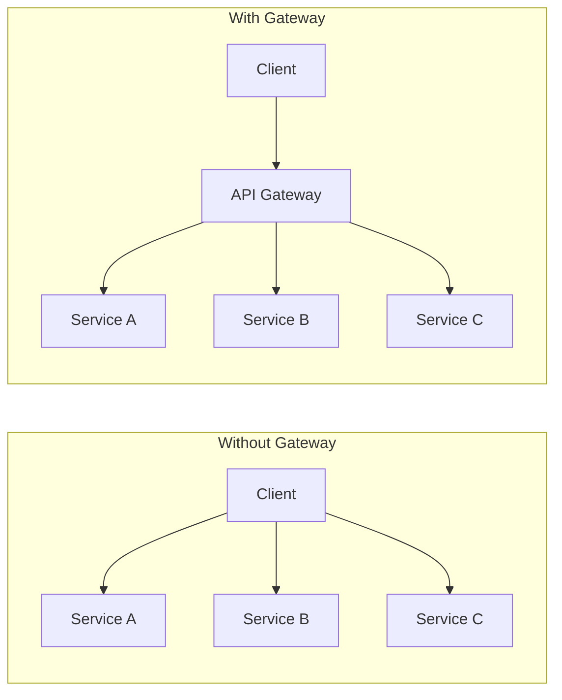
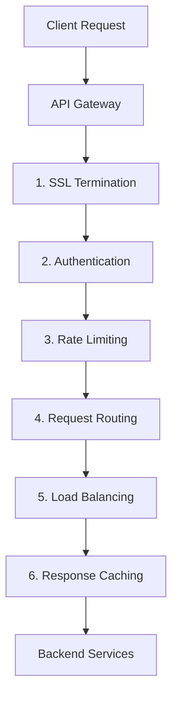
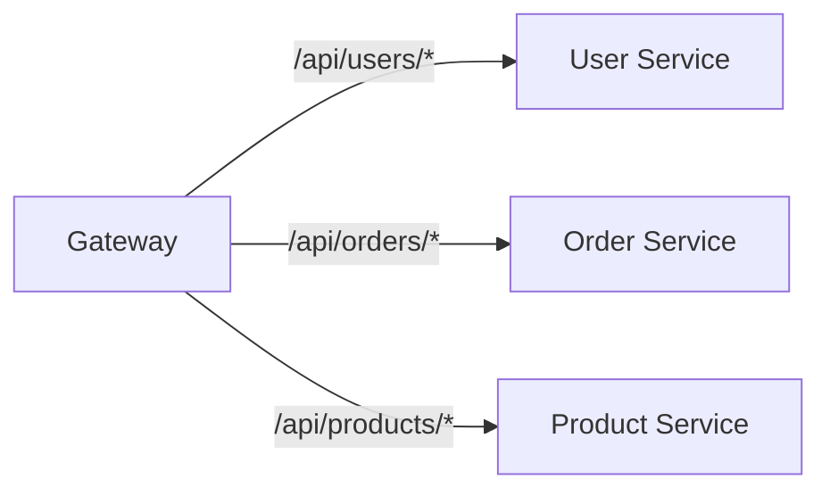
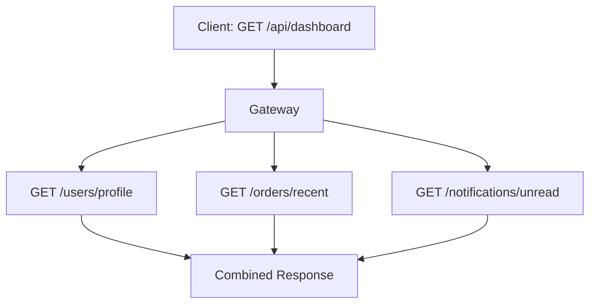
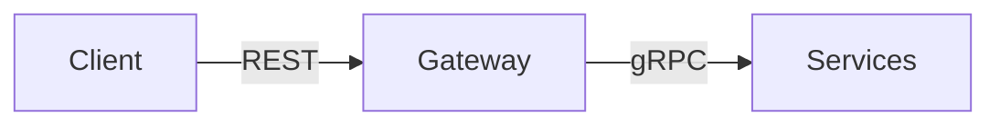

## What is an API Gateway?

An **API Gateway** is a single entry point for all client requests. It handles cross-cutting concerns like authentication, rate limiting, and request routing.

---

## Without vs With API Gateway

---

## Key Functions

| **Function** | **Description** |
|-------------|-----------------|
| Routing | Route requests to appropriate services |
| Authentication | Verify identity (JWT, OAuth) |
| Authorization | Check permissions |
| Rate Limiting | Prevent abuse |
| Load Balancing | Distribute traffic |
| Caching | Cache responses |
| Request Transformation | Modify requests/responses |
| SSL Termination | Handle HTTPS |
| Monitoring | Log and trace requests |

---

## Request Flow

---

## Patterns

### Request Routing

### Request Aggregation

Combine multiple service calls into one response:

### Protocol Translation

---

## Popular API Gateways

| **Gateway** | **Type** | **Features** |
|------------|---------|-------------|
| Kong | Open source | Plugin ecosystem |
| AWS API Gateway | Managed | AWS integration |
| NGINX | Web server | High performance |
| Envoy | Service mesh | Advanced routing |
| Traefik | Container-native | Auto-discovery |

---

## Rate Limiting Strategies

| **Strategy** | **Description** |
|-------------|-----------------|
| Token Bucket | Tokens refill over time |
| Leaky Bucket | Constant rate output |
| Fixed Window | Count per time window |
| Sliding Window | Rolling time window |

---

## Considerations

### Pros

- Single entry point
- Centralized cross-cutting concerns
- Protocol translation
- Response aggregation

### Cons

- Single point of failure
- Added latency
- Additional complexity
- Can become bottleneck

---

## Interview Tips

- Explain the main functions (routing, auth, rate limiting)
- Discuss aggregation pattern for BFF (Backend for Frontend)
- Know popular solutions: Kong, AWS API Gateway
- Mention as potential bottleneck/SPOF
- Compare with service mesh
