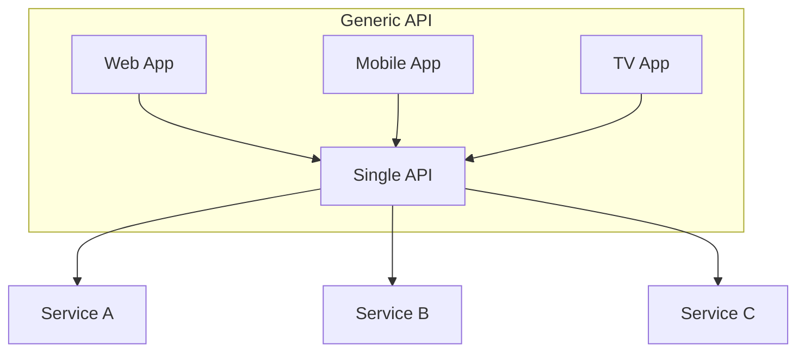
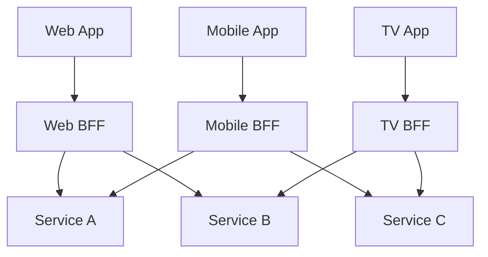
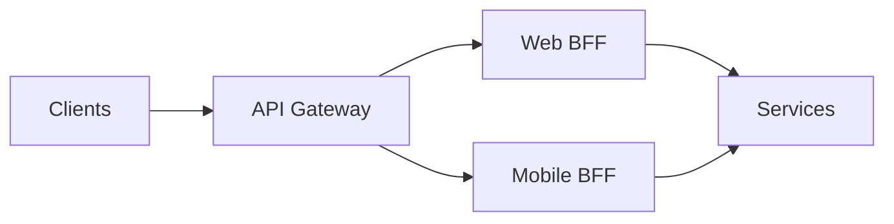

## What is BFF?

The **Backend for Frontend (BFF)** pattern creates separate backend services for each frontend application. Each BFF is tailored to the specific needs of its client (web, mobile, IoT).

---

## The Problem

A single generic API struggles to serve different clients:



**Issues:**
- Mobile needs less data but web needs more
- Different authentication flows
- API becomes bloated serving all clients
- Changes for one client risk breaking others

---

## The BFF Solution



Each BFF:
- Aggregates data for its specific client
- Returns only what the client needs
- Handles client-specific auth
- Transforms responses to optimal format

---

## What a BFF Does

| **Function** | **Example** |
|-------------|------------|
| Response shaping | Mobile gets thumbnails, web gets full images |
| Data aggregation | Combine 3 API calls into 1 response |
| Auth translation | OAuth for web, biometric for mobile |
| Protocol adaptation | GraphQL for web, REST for mobile |
| Caching strategy | Different TTLs per client |

---

## Example: E-Commerce Dashboard

### Web BFF Response

```json
{
  "user": { "name": "Alice", "avatar": "full-size.jpg" },
  "orders": [
    {
      "id": 1,
      "items": [{ "name": "Widget", "price": 29.99, "image": "widget-lg.jpg" }],
      "tracking": { "carrier": "FedEx", "eta": "2026-03-18", "map_url": "..." }
    }
  ],
  "recommendations": [{ "id": 5, "name": "Gadget", "reviews": 142 }]
}
```

### Mobile BFF Response

```json
{
  "user": { "name": "Alice", "avatar": "thumb.jpg" },
  "orders": [
    { "id": 1, "status": "In Transit", "eta": "Mar 18" }
  ]
}
```

Same data, different shape — each optimized for its client.

---

## BFF vs API Gateway

| **Aspect** | **API Gateway** | **BFF** |
|-----------|----------------|---------|
| Purpose | Routing, auth, rate limiting | Client-specific logic |
| Scope | All clients share one | One per client type |
| Logic | Cross-cutting concerns | Business aggregation |
| Ownership | Platform team | Frontend team |

They can work together:



---

## When to Use BFF

**Good fit:**
- Multiple client types with different needs
- Frontend teams want autonomy
- Significant response shaping per client
- Different authentication per platform

**Avoid when:**
- Single client type
- Clients have similar data needs
- Small team (overhead not justified)
- GraphQL already solves data shaping

---

## Trade-offs

| **Pros** | **Cons** |
|---------|---------|
| Optimized per client | More services to maintain |
| Frontend team ownership | Potential code duplication |
| Independent deployments | Increased infrastructure cost |
| Simpler client code | Need clear service boundaries |

---

## Interview Tips

- Explain why a single API is problematic for diverse clients
- Describe how BFF aggregates and shapes data
- Compare with API Gateway (they complement each other)
- Mention that GraphQL can sometimes replace BFF
- Discuss ownership: frontend teams own their BFF
