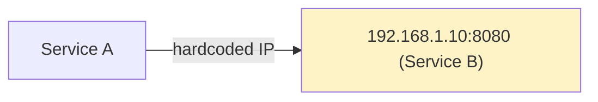
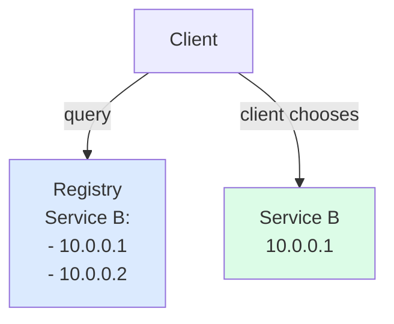
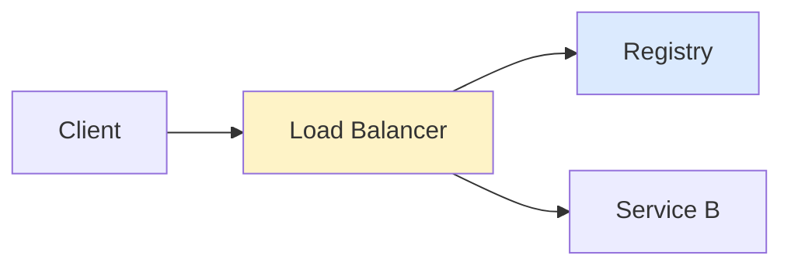
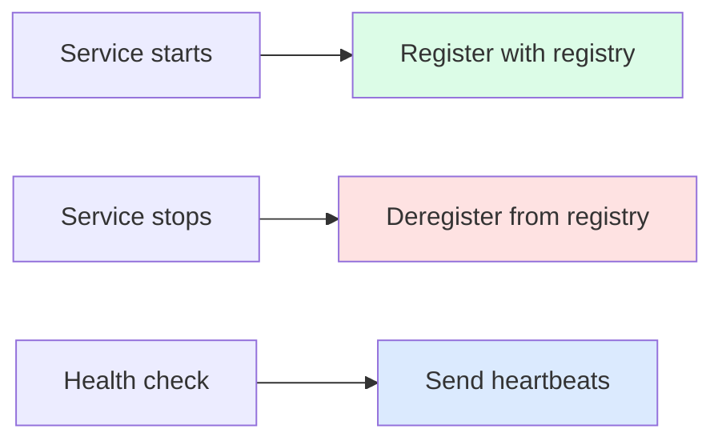
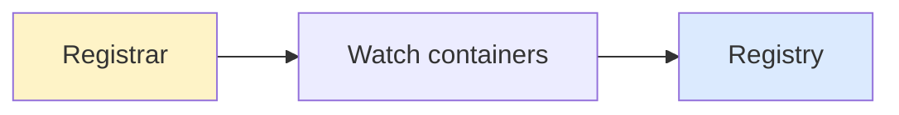

## What is Service Discovery?

**Service Discovery** is the mechanism by which services locate each other in a distributed system. In dynamic environments where services scale up/down and IP addresses change, hardcoding addresses is impractical.

---

## The Problem



What if Service B scales or moves?

---

## Service Discovery Types

### Client-Side Discovery

Client queries registry and chooses which instance to call:



**Examples**: Netflix Eureka, Consul (client mode)

### Server-Side Discovery

Load balancer queries registry and routes request:



**Examples**: AWS ALB, Kubernetes Services

---

## Service Registry

Central database of service instances:

| **Service** | **Instance** | **Status** | **Metadata** |
|------------|-------------|-----------|--------------|
| user-svc | 10.0.0.1:8080 | Healthy | v2.1 |
| user-svc | 10.0.0.2:8080 | Healthy | v2.1 |
| order-svc | 10.0.0.3:8080 | Healthy | v1.5 |

---

## Registration Patterns

### Self-Registration

Service registers itself on startup:



### Third-Party Registration

Separate registrar watches and registers services:



---

## Health Checking

Ensure only healthy instances receive traffic:

| **Method** | **Description** |
|-----------|-----------------|
| Heartbeat | Service sends periodic "I'm alive" |
| Active probe | Registry pings service endpoint |
| TTL | Entry expires if not renewed |

---

## Popular Solutions

| **Tool** | **Type** | **Features** |
|---------|---------|-------------|
| Consul | General purpose | Service mesh, KV store |
| etcd | Key-value | Kubernetes backing store |
| ZooKeeper | Coordination | Leader election |
| Eureka | Netflix OSS | Java-focused |
| Kubernetes DNS | Native | Built into K8s |

---

## Kubernetes Service Discovery

```yaml
# Service definition
apiVersion: v1
kind: Service
metadata:
  name: user-service
spec:
  selector:
    app: user
  ports:
    - port: 80
      targetPort: 8080
```

Access via DNS: `user-service.namespace.svc.cluster.local`

---

## Interview Tips

- Explain client-side vs server-side discovery
- Describe service registry and health checks
- Know tools: Consul, etcd, Kubernetes DNS
- Discuss registration patterns (self vs third-party)
- Mention challenges: consistency, availability of registry
