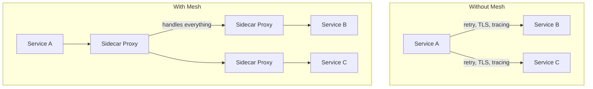
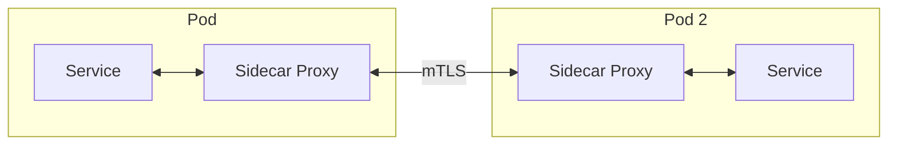
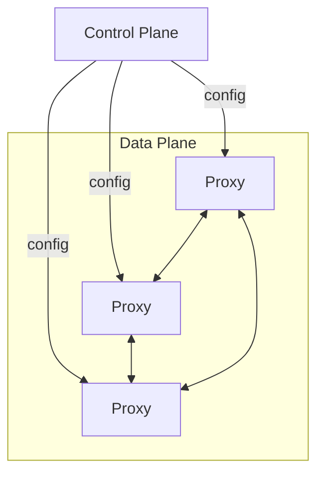
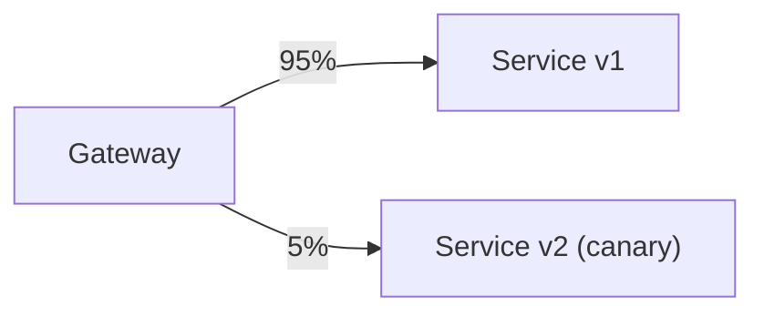
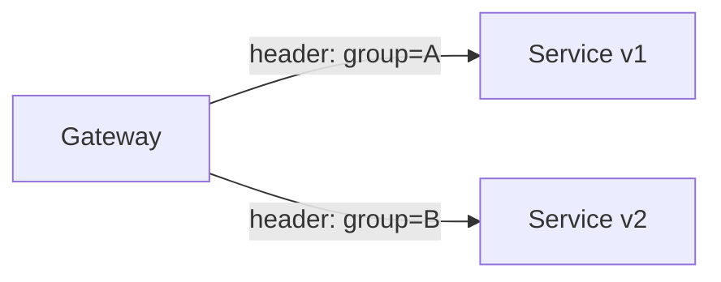
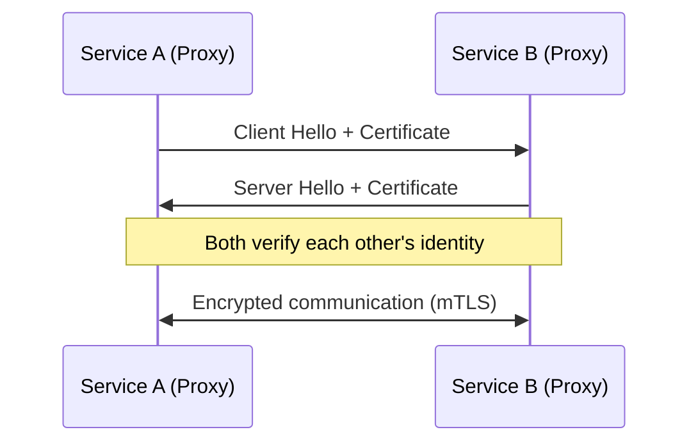

## What is a Service Mesh?

A **Service Mesh** is a dedicated infrastructure layer that handles service-to-service communication. It manages traffic, security, and observability without changing application code.

---

## Without vs With Service Mesh

---

## Architecture

### Sidecar Pattern

Every service instance gets a sidecar proxy. All traffic flows through the proxy.

### Data Plane vs Control Plane

| **Component** | **Role** |
|--------------|---------|
| Data Plane | Sidecar proxies handling actual traffic |
| Control Plane | Manages proxy configuration and policies |

---

## Key Features

| **Feature** | **Description** |
|------------|-----------------|
| Traffic management | Load balancing, routing, canary deployments |
| Security | mTLS, authorization policies |
| Observability | Metrics, tracing, logging |
| Resilience | Retries, timeouts, circuit breaking |
| Rate limiting | Control request rates between services |

---

## Traffic Management

### Canary Deployment

### A/B Testing

---

## Security: Mutual TLS

All service-to-service traffic is encrypted and authenticated automatically.

---

## Popular Service Meshes

| **Mesh** | **Proxy** | **Notes** |
|---------|----------|----------|
| Istio | Envoy | Most popular, feature-rich |
| Linkerd | linkerd2-proxy | Lightweight, Rust-based |
| Consul Connect | Envoy / built-in | HashiCorp ecosystem |
| AWS App Mesh | Envoy | AWS-managed |

---

## Service Mesh vs API Gateway

| **Aspect** | **API Gateway** | **Service Mesh** |
|-----------|----------------|-----------------|
| Scope | North-south (external → internal) | East-west (internal → internal) |
| Position | Edge of network | Between all services |
| Focus | External API management | Internal service communication |
| Auth | API keys, OAuth | mTLS, RBAC |

---

## When to Use

**Good fit:**
- Many microservices (50+)
- Need consistent security policies
- Complex traffic routing requirements
- Polyglot services (different languages)

**Avoid when:**
- Few services (< 10)
- Monolithic architecture
- Team unfamiliar with Kubernetes
- Latency is extremely critical

---

## Trade-offs

| **Pros** | **Cons** |
|---------|---------|
| Zero code changes for cross-cutting concerns | Added latency (proxy hop) |
| Consistent security (mTLS everywhere) | Operational complexity |
| Rich observability out of the box | Resource overhead (sidecar per pod) |
| Language-agnostic | Steep learning curve |

---

## Interview Tips

- Explain sidecar proxy pattern
- Distinguish data plane vs control plane
- Compare with API gateway (north-south vs east-west)
- Discuss mTLS for zero-trust networking
- Know when to use (many services) vs when to avoid (simple setups)
