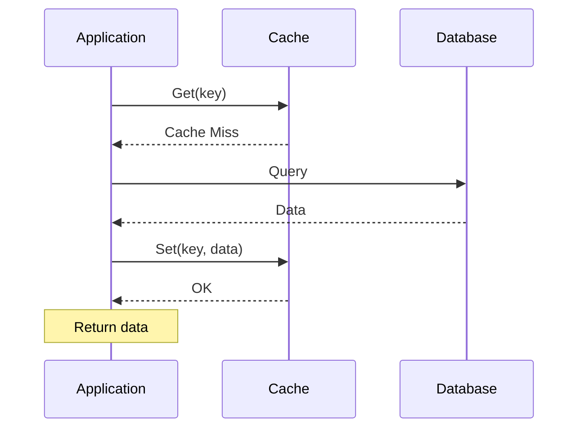
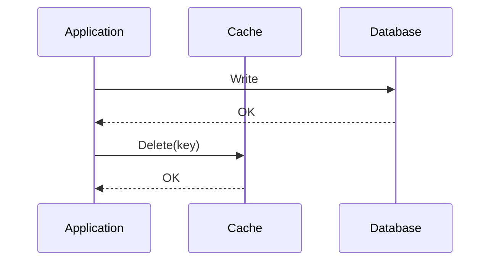
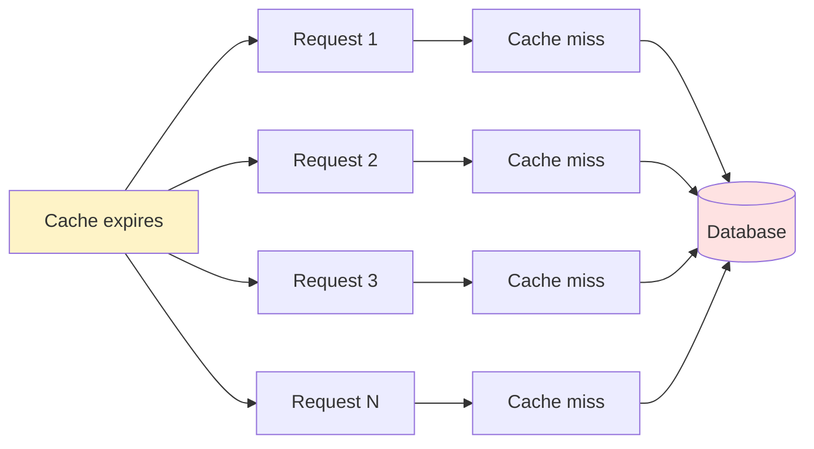

## What is Cache-Aside?

**Cache-Aside** (also called Lazy Loading) is a caching pattern where the application is responsible for reading from and writing to both the cache and the database.

---

## How It Works

### Read Path



### Write Path



---

## Code Example

```python
def get_user(user_id):
    # 1. Check cache
    user = cache.get(f"user:{user_id}")
    if user:
        return user  # Cache hit

    # 2. Cache miss - read from DB
    user = db.query("SELECT * FROM users WHERE id = ?", user_id)

    # 3. Store in cache
    cache.set(f"user:{user_id}", user, ttl=3600)

    return user

def update_user(user_id, data):
    # 1. Update database
    db.execute("UPDATE users SET ... WHERE id = ?", data, user_id)

    # 2. Invalidate cache
    cache.delete(f"user:{user_id}")
```

---

## Advantages

| **Benefit** | **Description** |
|------------|-----------------|
| Only cache what's needed | No wasted cache space |
| Resilient to cache failure | Falls back to database |
| Simple to implement | Application controls logic |
| Lazy population | Cache fills on demand |

---

## Disadvantages

| **Drawback** | **Description** |
|-------------|-----------------|
| Cache miss penalty | First request is slow |
| Stale data possible | Between DB write and cache invalidate |
| Application complexity | Must manage both cache and DB |

---

## Cache Stampede Problem

When cache expires, many requests hit DB simultaneously:



All hit DB at once!

### Solutions

1. **Lock/Mutex**: Only one request fetches from DB
2. **Early refresh**: Refresh before TTL expires
3. **Probabilistic expiration**: Random TTL variation

---

## Interview Tips

- Explain the read and write flows clearly
- Discuss invalidation: delete vs update cache
- Mention cache stampede and solutions
- Compare with read-through and write-through
