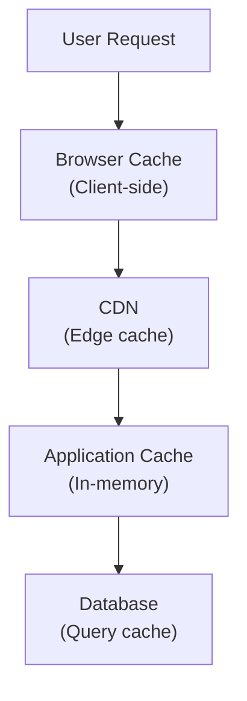
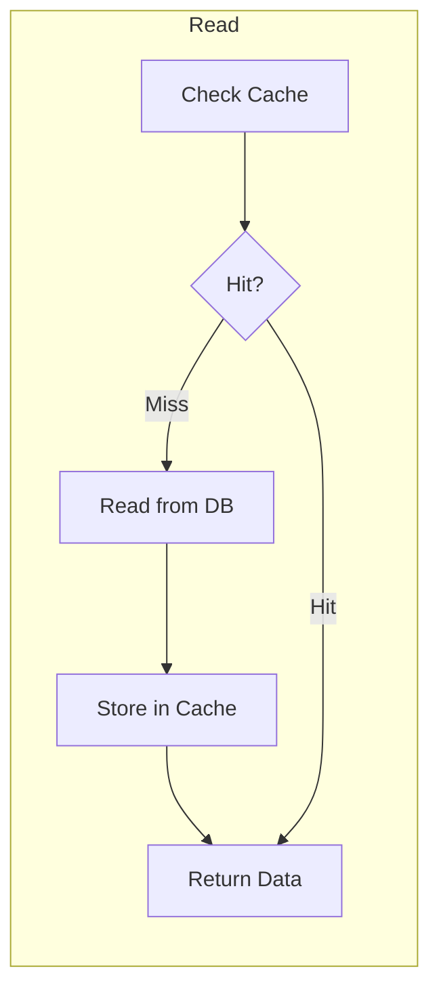
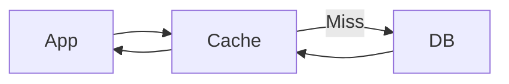
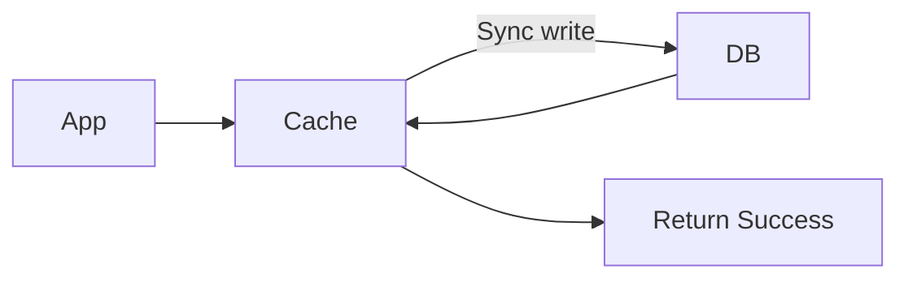
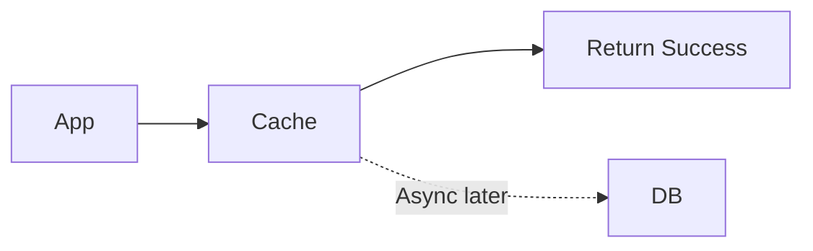

## What is Caching?

**Caching** stores copies of frequently accessed data in a faster storage layer (like memory) to reduce latency and database load.

---

## Cache Layers

---

## Caching Patterns

### Cache-Aside (Lazy Loading)

Application manages cache explicitly:

**Pros**: Only requested data cached, resilient to cache failures
**Cons**: Initial requests slow (cache miss)

### Read-Through

Cache sits between app and DB:

**Pros**: Simpler application code
**Cons**: Cache must understand data source

### Write-Through

Writes go through cache to DB:

**Pros**: Cache always consistent, data not lost
**Cons**: Higher write latency

### Write-Behind (Write-Back)

Writes to cache, async to DB:

**Pros**: Low write latency
**Cons**: Risk of data loss if cache fails

---

## Cache Eviction Policies

| **Policy** | **How It Works** | **Best For** |
|-----------|------------------|--------------|
| LRU | Evict least recently used | General purpose |
| LFU | Evict least frequently used | Stable access patterns |
| FIFO | Evict oldest first | Simple, predictable |
| TTL | Evict after time expires | Time-sensitive data |

---

## Cache Invalidation

> "There are only two hard things in Computer Science: cache invalidation and naming things."

### Strategies

1. **TTL (Time-to-Live)**: Auto-expire after duration
2. **Event-based**: Invalidate on data change
3. **Version-based**: Include version in cache key

---

## Common Caching Solutions

| **Solution** | **Type** | **Use Case** |
|-------------|---------|--------------|
| Redis | In-memory, distributed | Sessions, leaderboards |
| Memcached | In-memory, distributed | Simple key-value |
| Browser Cache | Client-side | Static assets |
| CDN | Edge | Global content delivery |

---

## Interview Tips

- Know the four main patterns and trade-offs
- Explain cache invalidation strategies
- Discuss eviction policies (LRU vs LFU)
- Mention cache stampede and how to prevent it
- Give examples: Redis, Memcached, CDN
