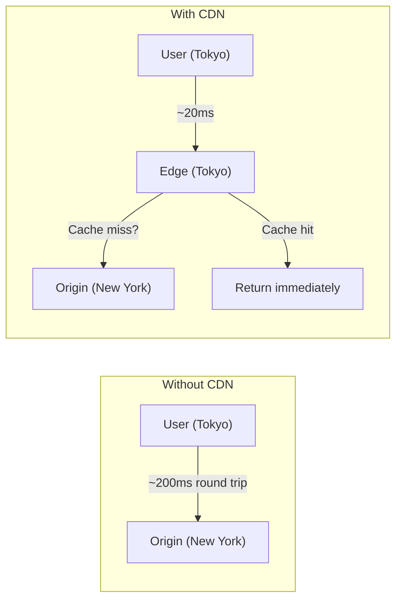
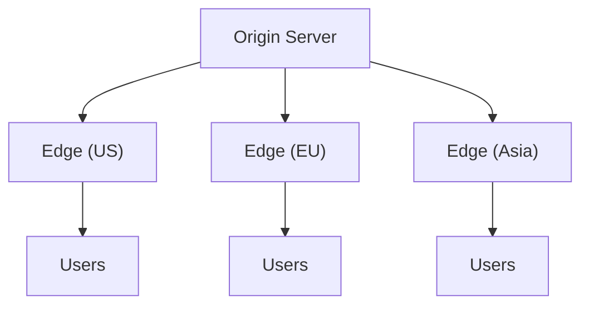

## What is a CDN?

A **Content Delivery Network (CDN)** is a geographically distributed network of servers that delivers content to users from the nearest location, reducing latency and improving load times.

---

## How CDN Works



---

## CDN Architecture



---

## Content Types

| **Type** | **Examples** | **Cacheability** |
|----------|-------------|------------------|
| Static | Images, CSS, JS, fonts | High (days/weeks) |
| Semi-dynamic | Product pages, articles | Medium (minutes/hours) |
| Dynamic | User-specific content | Low (not cached) |

---

## CDN Features

### Caching Strategies

- **Pull**: CDN fetches from origin on cache miss
- **Push**: Origin pushes content to CDN proactively

### Cache Invalidation

```
1. Time-based (TTL expiration)
2. Purge API (immediate invalidation)
3. Versioned URLs (styles.v2.css)
```

### Additional Features

- **DDoS protection**: Absorb attack traffic at edge
- **SSL/TLS termination**: Handle encryption at edge
- **Compression**: Gzip/Brotli at edge
- **Image optimization**: Resize, convert formats

---

## Popular CDNs

| **Provider** | **Strengths** |
|-------------|--------------|
| Cloudflare | Free tier, security features |
| AWS CloudFront | AWS integration |
| Akamai | Enterprise, largest network |
| Fastly | Real-time purging, edge compute |

---

## Interview Tips

- Know push vs pull CDN models
- Understand cache invalidation strategies
- Discuss edge locations and latency benefits
- Mention CDN for static vs dynamic content
