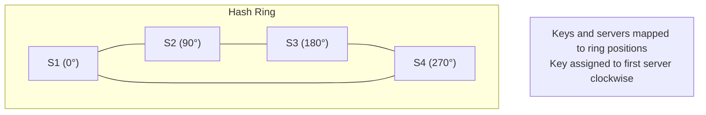
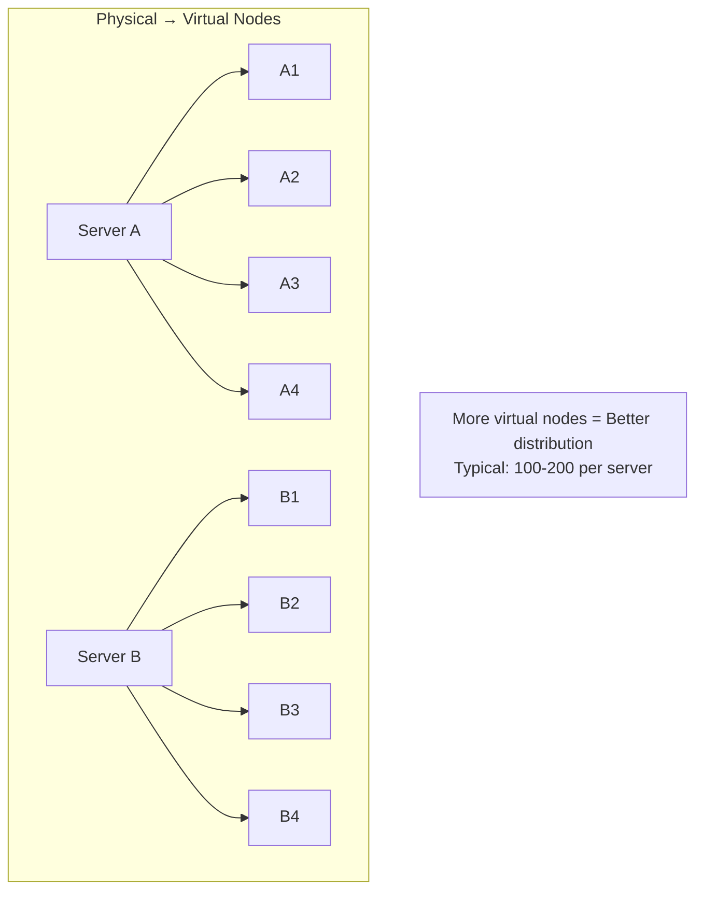
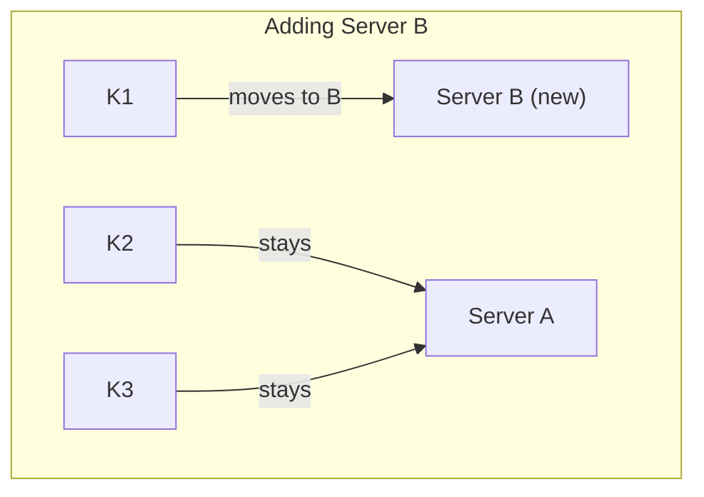
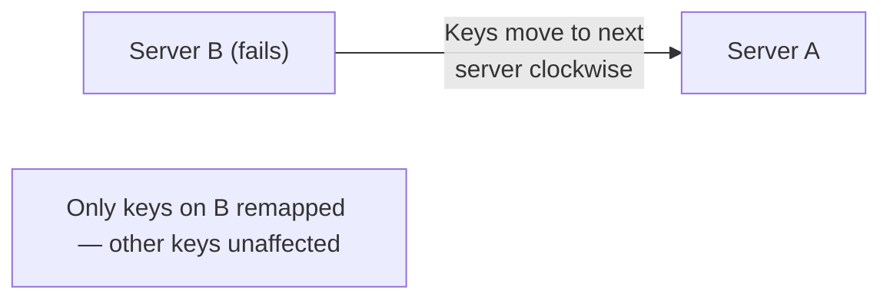

## What is Consistent Hashing?

**Consistent Hashing** is a distributed hashing technique that minimizes key remapping when nodes are added or removed. Unlike traditional hashing, only K/n keys need to be remapped (K = total keys, n = nodes).

---

## The Problem with Traditional Hashing

```
Traditional: hash(key) % n

Server assignment: hash("user123") % 4 = 2 → Server 2

When server added (n=5):
hash("user123") % 5 = 3 → Server 3  ← Key moved!

Result: Most keys remapped, cache invalidation storm
```

---

## How Consistent Hashing Works

### The Hash Ring



### Key Assignment

```
1. Hash server IDs to positions on ring
2. Hash keys to positions on ring
3. Walk clockwise to find first server

Example:
- Key K1 at position 45° → Assigned to S2 (at 90°)
- Key K2 at position 200° → Assigned to S4 (at 270°)
```

---

## Virtual Nodes

To ensure even distribution, each physical server has multiple virtual nodes:



---

## Adding/Removing Nodes

### Adding a Node



### Removing a Node



---

## Implementation

```python
import hashlib
from bisect import bisect_right

class ConsistentHash:
    def __init__(self, nodes=None, replicas=100):
        self.replicas = replicas  # Virtual nodes per server
        self.ring = {}            # hash -> node mapping
        self.sorted_keys = []     # Sorted hash positions

        if nodes:
            for node in nodes:
                self.add_node(node)

    def _hash(self, key):
        return int(hashlib.md5(key.encode()).hexdigest(), 16)

    def add_node(self, node):
        for i in range(self.replicas):
            virtual_key = f"{node}:{i}"
            hash_val = self._hash(virtual_key)
            self.ring[hash_val] = node
            self.sorted_keys.append(hash_val)
        self.sorted_keys.sort()

    def remove_node(self, node):
        for i in range(self.replicas):
            virtual_key = f"{node}:{i}"
            hash_val = self._hash(virtual_key)
            del self.ring[hash_val]
            self.sorted_keys.remove(hash_val)

    def get_node(self, key):
        if not self.ring:
            return None

        hash_val = self._hash(key)
        # Find first node clockwise
        idx = bisect_right(self.sorted_keys, hash_val)
        if idx == len(self.sorted_keys):
            idx = 0  # Wrap around

        return self.ring[self.sorted_keys[idx]]
```

---

## Real-World Usage

| **System** | **Use Case** |
|-----------|-------------|
| Amazon DynamoDB | Partition key distribution |
| Apache Cassandra | Data partitioning |
| Memcached | Distributed caching |
| Discord | Message routing |
| Akamai CDN | Content distribution |

---

## Benefits

| **Benefit** | **Description** |
|------------|-----------------|
| Minimal remapping | Only K/n keys move on node change |
| Horizontal scaling | Easy to add/remove nodes |
| Even distribution | Virtual nodes ensure balance |
| Fault tolerance | Automatic failover to next node |

---

## Considerations

| **Challenge** | **Solution** |
|--------------|-------------|
| Hotspots | More virtual nodes |
| Node heterogeneity | Vary virtual node count by capacity |
| Replication | Store on N consecutive nodes |

---

## Interview Tips

- Explain the hash ring concept
- Discuss why virtual nodes are needed
- Know the K/n remapping formula
- Mention real-world systems using it
- Compare with traditional mod hashing
