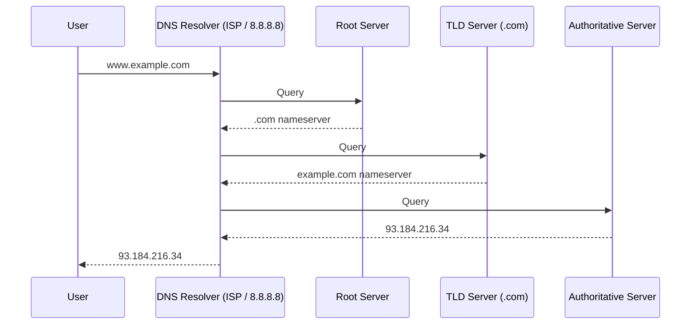
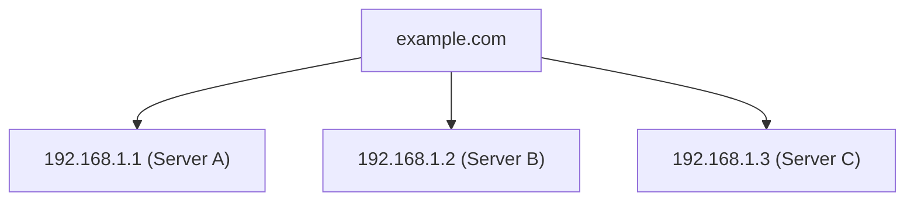

## What is DNS?

**DNS (Domain Name System)** is the phonebook of the internet. It translates human-readable domain names (like `google.com`) into IP addresses (like `142.250.185.78`) that computers use to communicate.

---

## How DNS Works

---

## DNS Record Types

| **Record** | **Purpose** | **Example** |
|-----------|------------|-------------|
| A | Maps domain to IPv4 | `example.com → 93.184.216.34` |
| AAAA | Maps domain to IPv6 | `example.com → 2001:db8::1` |
| CNAME | Alias to another domain | `www.example.com → example.com` |
| MX | Mail server | `example.com → mail.example.com` |
| TXT | Text data (verification, SPF) | `"v=spf1 include:_spf.google.com"` |
| NS | Nameserver delegation | `example.com → ns1.example.com` |

---

## DNS in System Design

### Load Distribution

DNS can distribute traffic across multiple servers using Round-Robin:

### Geographic Routing

Route users to nearest datacenter based on location.

### TTL (Time To Live)

- **Low TTL (60s)**: Quick changes, more DNS queries
- **High TTL (86400s)**: Fewer queries, slower propagation

---

## Interview Tips

- Know the resolution process: Root → TLD → Authoritative
- Understand record types: A, AAAA, CNAME, MX
- TTL trade-offs: Low for flexibility, high for performance
- DNS for load balancing: Round-robin, geographic routing
