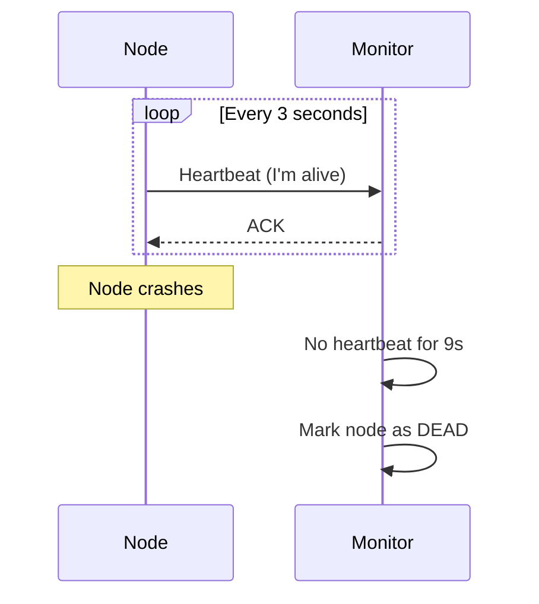
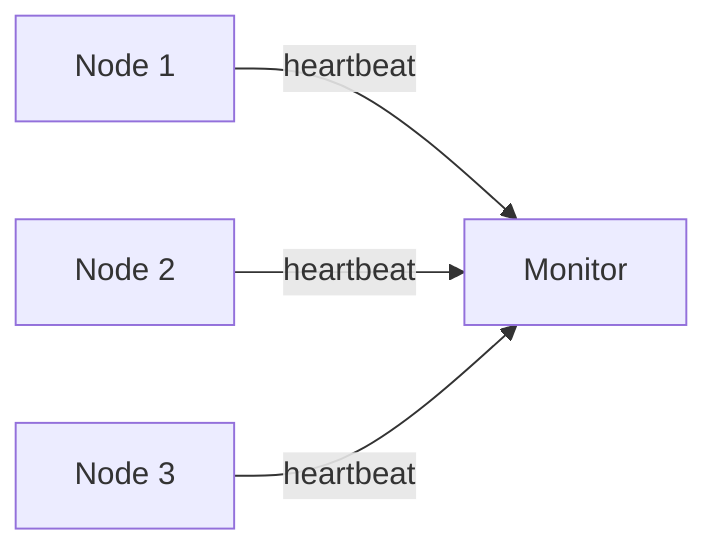
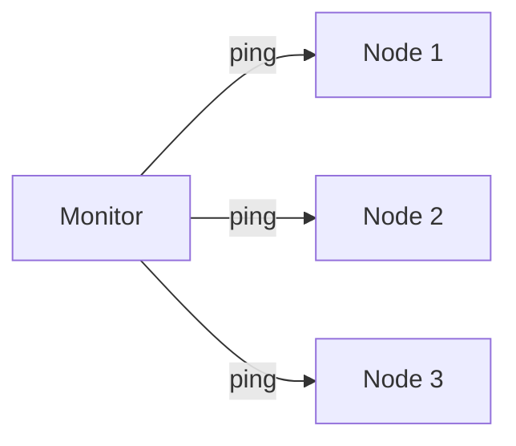
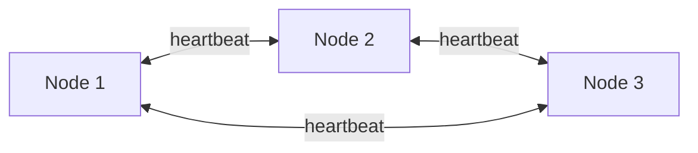
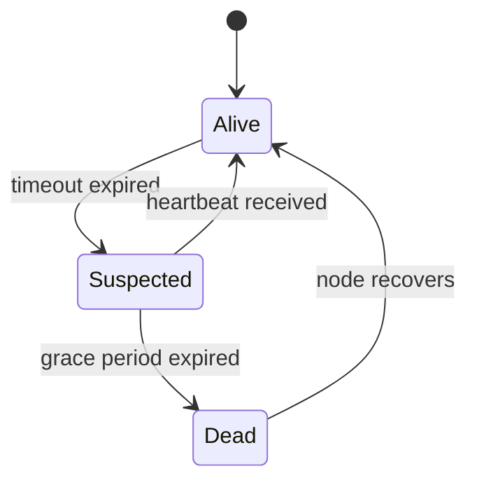

## What is a Heartbeat?

A **Heartbeat** is a periodic signal sent between nodes in a distributed system to indicate they are alive and functioning. If a node stops sending heartbeats, other nodes assume it has failed.

---

## How It Works



---

## Heartbeat Types

### Push-Based

Node sends heartbeats to monitor:



### Pull-Based (Polling)

Monitor polls nodes for status:



### Peer-to-Peer

Nodes monitor each other:



---

## Key Parameters

| **Parameter** | **Description** | **Typical Value** |
|--------------|-----------------|-------------------|
| Interval | Time between heartbeats | 1-5 seconds |
| Timeout | Missed beats before failure | 3x interval |
| Grace period | Buffer before action | 5-15 seconds |

---

## Failure Detection



### False Positives

A slow network can cause false failure detection:

| **Cause** | **Mitigation** |
|-----------|---------------|
| Network partition | Increase timeout |
| GC pause | Use longer grace period |
| CPU overload | Adaptive thresholds |
| Packet loss | Require multiple missed beats |

---

## Heartbeat with Metadata

Heartbeats often carry useful information:

```json
{
  "node_id": "node-3",
  "timestamp": 1710432000,
  "status": "healthy",
  "cpu_usage": 45,
  "memory_usage": 72,
  "active_connections": 1250,
  "version": "2.1.0"
}
```

This enables load balancers and orchestrators to make routing decisions.

---

## Real-World Examples

| **System** | **Mechanism** |
|-----------|--------------|
| Kubernetes | kubelet → API server (10s default) |
| ZooKeeper | Session heartbeats (ephemeral nodes) |
| Cassandra | Gossip protocol (1s interval) |
| Redis Sentinel | PING/PONG every 1s |
| Consul | TCP/HTTP health checks |

---

## Heartbeat vs Health Check

| **Aspect** | **Heartbeat** | **Health Check** |
|-----------|--------------|-----------------|
| Direction | Node → Monitor | Monitor → Node |
| Content | "I'm alive" | "Are you healthy?" |
| Depth | Liveness only | Liveness + readiness |
| Overhead | Low | Higher (runs checks) |

---

## Best Practices

1. **Set timeout > 2x interval** to tolerate occasional delays
2. **Include metadata** for smarter load balancing
3. **Use adaptive timeouts** based on network conditions
4. **Avoid single monitor** — use distributed failure detection
5. **Distinguish slow from dead** — don't kill overloaded nodes

---

## Interview Tips

- Explain push vs pull heartbeat models
- Discuss false positive problem and mitigations
- Know typical intervals (1-5s) and timeout multipliers
- Mention use in leader election and cluster membership
- Give examples: Kubernetes, ZooKeeper, Cassandra gossip
