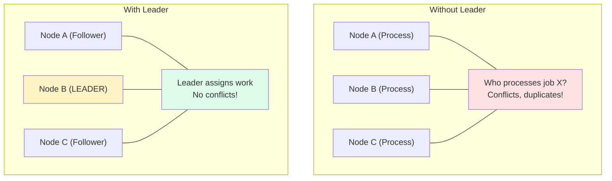
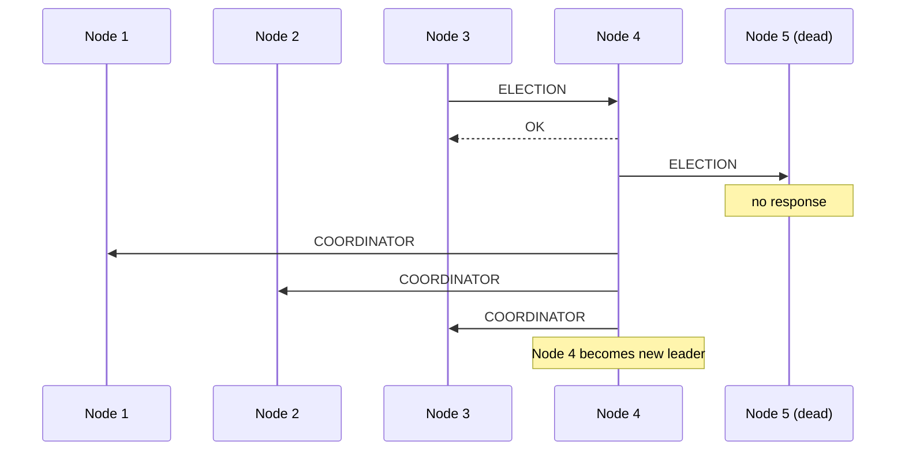
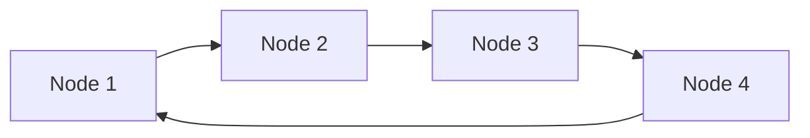
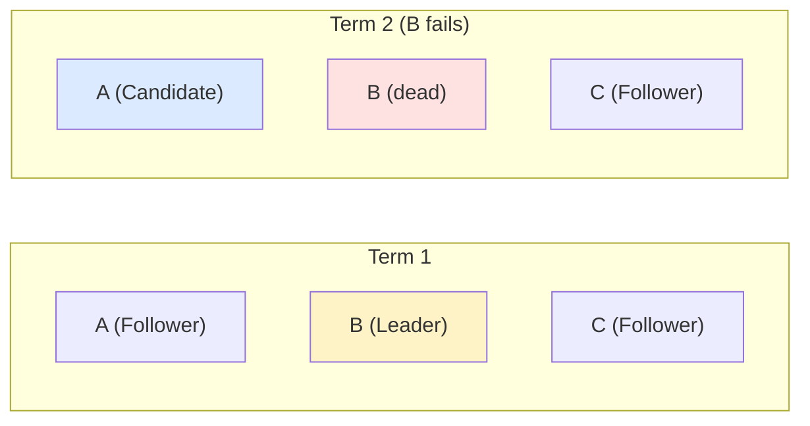
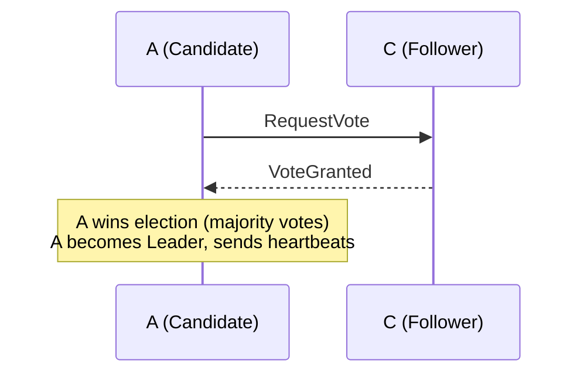
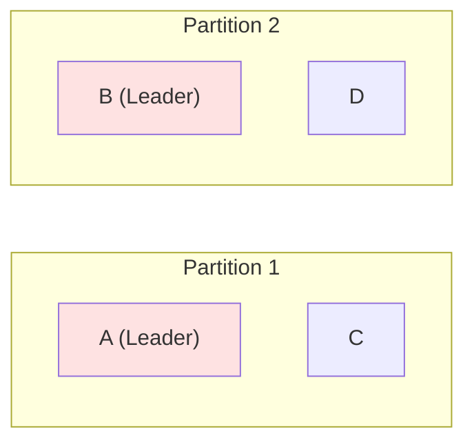

## What is Leader Election?

**Leader Election** is a process where distributed nodes agree on one node to act as the coordinator/leader. The leader handles coordination tasks that require a single point of control.

---

## Why Leader Election?



---

## Use Cases

| **Use Case** | **Example** |
|-------------|-------------|
| Database writes | Single master for writes |
| Job scheduling | One scheduler assigns tasks |
| Configuration | One node pushes config changes |
| Distributed locks | Lock manager coordination |

---

## Leader Election Algorithms

### 1. Bully Algorithm

When a node detects leader failure:

1. Send ELECTION to all higher-ID nodes
2. Wait for OK response
3. If no OK received, become leader, send COORDINATOR
4. If OK received, wait for COORDINATOR from higher node

Example (Node 3 detects failure). Node IDs: `[1, 2, 3, 4, 5]`. Current Leader: 5 (failed).



### 2. Ring Algorithm

Nodes arranged in logical ring:



Election:
1. Node sends ELECTION with its ID around ring
2. Each node adds its ID to message
3. When message returns to initiator
4. Highest ID in message becomes leader

---

## ZooKeeper Leader Election

```
Using ZooKeeper ephemeral sequential nodes:

/election
├── node_0000000001 (Node A)
├── node_0000000002 (Node B)
├── node_0000000003 (Node C)

Rules:
- Lowest sequence number = Leader
- Watch previous node for changes
- If previous node deleted → Check if now leader

Process:
1. Node A creates /election/node_ (gets 001)
2. Node B creates /election/node_ (gets 002)
3. Node C creates /election/node_ (gets 003)

Node A (001) = Leader
Node B watches 001
Node C watches 002

If Node A dies:
- 001 deleted (ephemeral)
- Node B notified
- Node B (002) becomes leader
```

---

## etcd Leader Election

```go
// Using etcd lease and campaign
func electLeader(client *clientv3.Client) {
    // Create session with TTL
    session, _ := concurrency.NewSession(client, concurrency.WithTTL(10))
    defer session.Close()

    // Create election on prefix
    election := concurrency.NewElection(session, "/leader")

    // Campaign to become leader (blocks until elected)
    ctx := context.Background()
    election.Campaign(ctx, "node-1")

    // Now leader - do leader work
    fmt.Println("I am the leader!")

    // Resign leadership
    election.Resign(ctx)
}
```

---

## Raft Consensus (Leader Election Part)

States: Follower -> Candidate -> Leader.



When B fails:
1. Election timeout expires on A
2. A becomes Candidate, increments term
3. A votes for itself
4. A requests votes from C



---

## Split Brain Prevention

Problem: Network partition causes two leaders.



Solutions:
1. Quorum requirement (majority needed)
   - 4 nodes -> Need 3 to elect
   - One partition can't have majority
2. Fencing tokens
   - Increment token on election
   - Resources reject old tokens
3. STONITH (Shoot The Other Node In The Head)
   - Force kill old leader

---

## Lease-Based Leadership

```
Leader holds lease (time-limited token):

┌─────────────────────────────────────────────┐
│  Lease: expires at T+30s                    │
│  Leader: Node A                             │
│  Token: 42                                  │
└─────────────────────────────────────────────┘

Node A must renew before expiry:
├── T+0s:  Acquire lease (30s TTL)
├── T+10s: Renew lease (reset to 30s)
├── T+20s: Renew lease (reset to 30s)
├── T+25s: Node A crashes
├── T+55s: Lease expires
└── T+55s: New election begins

Benefits:
- Automatic leader failover
- Bounded time for stale leader
```

---

## Comparison

| **Method** | **Complexity** | **Consistency** | **Use Case** |
|-----------|---------------|-----------------|--------------|
| Bully | Simple | Weak | Small clusters |
| ZooKeeper | Medium | Strong | General purpose |
| etcd | Medium | Strong | Kubernetes |
| Raft | Complex | Strong | Databases |

---

## Interview Tips

- Explain why single leader is needed
- Know ZooKeeper/etcd election mechanism
- Discuss split-brain and prevention
- Mention lease-based failover
- Cover trade-offs: availability vs consistency
