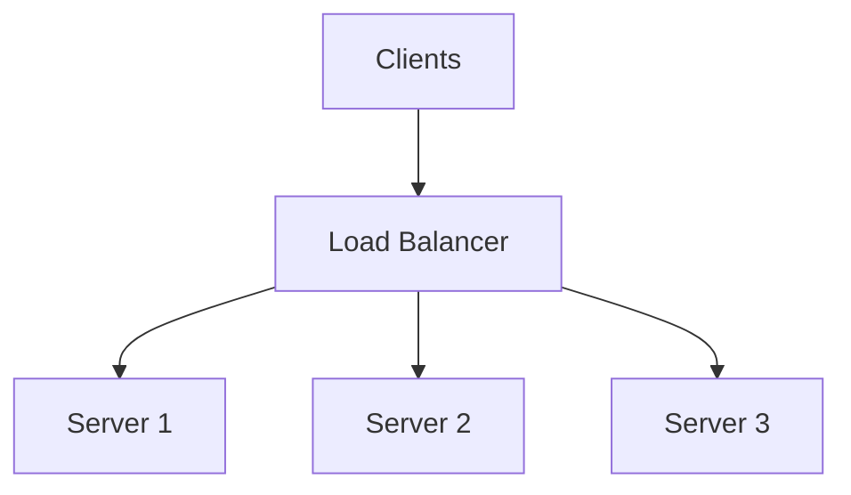
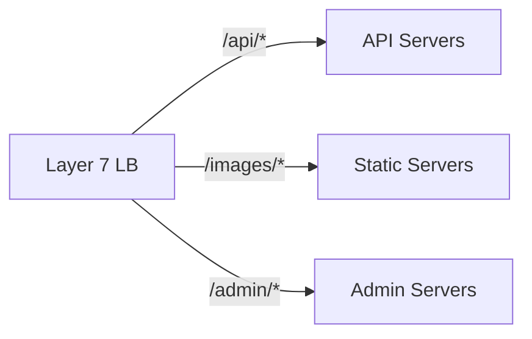
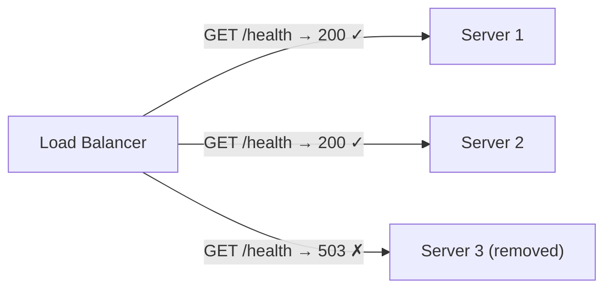
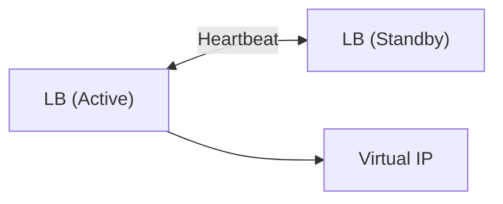

## What is a Load Balancer?

A **Load Balancer** distributes incoming network traffic across multiple servers to ensure no single server bears too much load, improving reliability and performance.

---

## Load Balancer Architecture

---

## Load Balancing Algorithms

| **Algorithm** | **How It Works** | **Best For** |
|--------------|------------------|--------------|
| Round Robin | Rotate through servers sequentially | Equal server capacity |
| Weighted Round Robin | More traffic to higher-weight servers | Varying server capacity |
| Least Connections | Route to server with fewest connections | Long-lived connections |
| IP Hash | Same client IP → same server | Session persistence |
| Least Response Time | Route to fastest responding server | Performance optimization |

---

## Types of Load Balancers

### Layer 4 (Transport)

- Operates on TCP/UDP
- Fast, simple routing
- No content inspection

### Layer 7 (Application)

- Operates on HTTP/HTTPS
- Content-based routing
- Can inspect headers, cookies, URLs

---

## Health Checks

---

## High Availability

---

## Popular Load Balancers

| **Type** | **Examples** |
|----------|-------------|
| Hardware | F5, Citrix ADC |
| Software | HAProxy, NGINX |
| Cloud | AWS ALB/NLB, GCP Load Balancer |

---

## Interview Tips

- Know L4 vs L7 differences
- Explain common algorithms and when to use each
- Discuss health checks and failover
- Mention sticky sessions for stateful applications
