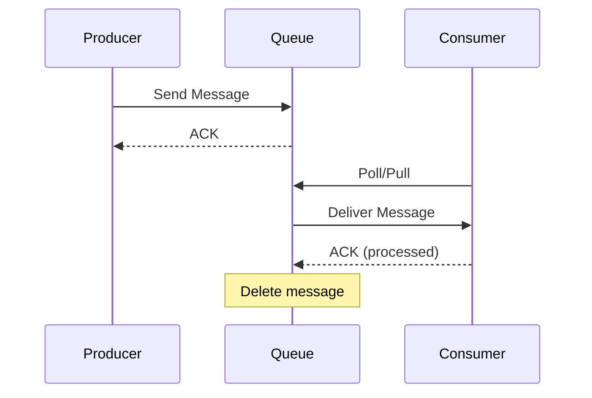
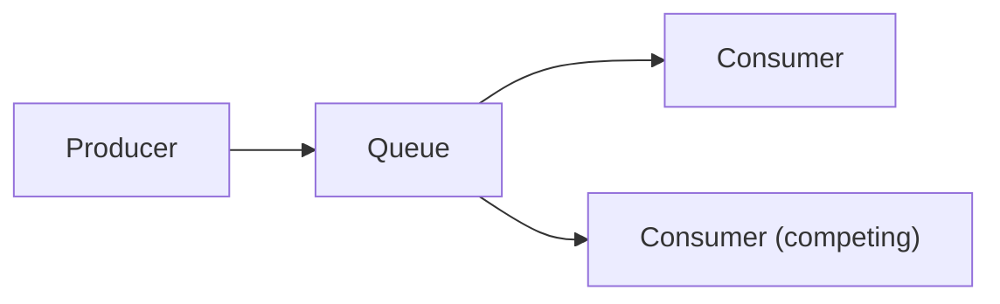
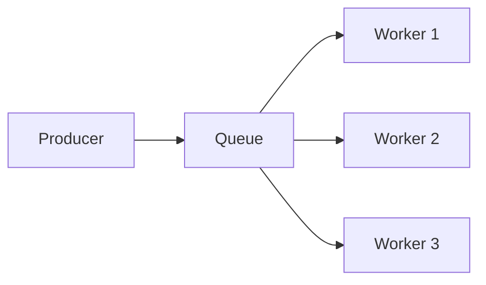

## What is a Message Queue?

A **Message Queue** is a form of asynchronous service-to-service communication. Messages are stored in a queue until they are processed and deleted by a consumer.

---

## How It Works

---

## Key Concepts

| **Concept** | **Description** |
|------------|-----------------|
| Producer | Sends messages to queue |
| Consumer | Receives and processes messages |
| Queue | Stores messages until consumed |
| Message | Unit of data being transferred |
| ACK | Acknowledgment of receipt/processing |

---

## Delivery Guarantees

| **Guarantee** | **Description** | **Use Case** |
|--------------|-----------------|--------------|
| At-most-once | May lose messages | Metrics, logs |
| At-least-once | May duplicate messages | Most applications |
| Exactly-once | No loss, no duplicates | Financial transactions |

---

## Benefits

| **Benefit** | **How** |
|------------|---------|
| Decoupling | Producers don't need to know consumers |
| Resilience | Messages persist if consumer down |
| Scalability | Add more consumers for throughput |
| Load leveling | Absorb traffic spikes |
| Async processing | Non-blocking operations |

---

## Message Queue Patterns

### Point-to-Point

One message → one consumer:

### Work Queue

Distribute tasks among workers:

---

## Popular Message Queues

| **System** | **Strengths** |
|-----------|--------------|
| RabbitMQ | Flexible routing, multiple protocols |
| Amazon SQS | Managed, serverless |
| Redis (Lists) | Simple, in-memory |
| ActiveMQ | Enterprise features |

---

## Use Cases

- Email sending
- Image/video processing
- Order processing
- Log aggregation
- Background jobs

---

## Interview Tips

- Explain producer-consumer pattern
- Discuss delivery guarantees and trade-offs
- Mention dead letter queues for failed messages
- Compare with pub/sub pattern
- Give examples: order processing, email sending
