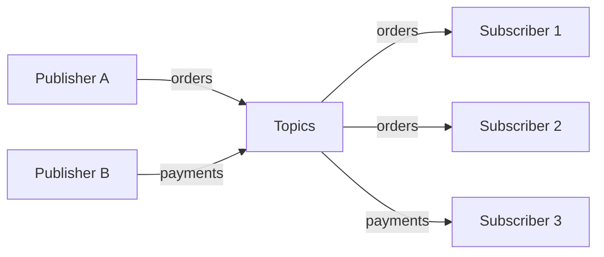
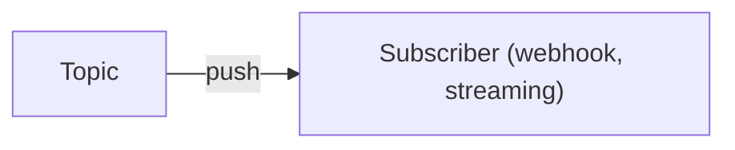
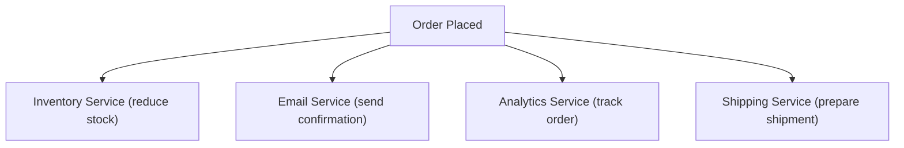

## What is Pub/Sub?

**Pub/Sub (Publish-Subscribe)** is a messaging pattern where publishers send messages to topics, and subscribers receive messages from topics they're interested in. Publishers and subscribers are decoupled.

---

## How It Works

---

## Pub/Sub vs Message Queue

| **Aspect** | **Message Queue** | **Pub/Sub** |
|-----------|------------------|-------------|
| Delivery | One consumer per message | All subscribers get message |
| Pattern | Point-to-point | Broadcast |
| Use case | Task distribution | Event notification |
| Message removal | After consumption | After delivery to all |

---

## Key Concepts

| **Concept** | **Description** |
|------------|-----------------|
| Publisher | Produces messages to topics |
| Subscriber | Consumes messages from topics |
| Topic | Named channel for messages |
| Subscription | Connection between topic and subscriber |
| Fan-out | One message to many subscribers |

---

## Delivery Models

### Push

Messages pushed to subscribers:

### Pull

Subscribers poll for messages:

---

## Use Cases

| **Use Case** | **Example** |
|-------------|------------|
| Event-driven architecture | Order placed → inventory, shipping, notification |
| Real-time updates | Stock prices, live scores |
| Log aggregation | Multiple services → central logging |
| Cache invalidation | DB update → invalidate caches |
| Microservices communication | Service events |

---

## Popular Pub/Sub Systems

| **System** | **Type** | **Strengths** |
|-----------|---------|--------------|
| Apache Kafka | Log-based | High throughput, replay |
| Google Pub/Sub | Managed | Serverless, global |
| AWS SNS | Managed | AWS integration |
| Redis Pub/Sub | In-memory | Simple, fast |
| RabbitMQ | Broker | Flexible routing |

---

## Kafka vs Traditional Pub/Sub

| **Aspect** | **Kafka** | **Traditional (Redis)** |
|-----------|----------|------------------------|
| Persistence | Messages stored on disk | Messages in memory |
| Replay | Can replay old messages | Messages lost after delivery |
| Ordering | Ordered within partition | Best effort |
| Throughput | Very high | High |

---

## Fan-out Pattern

One event triggers multiple actions:

---

## Interview Tips

- Explain difference from message queues
- Discuss fan-out and event-driven architecture
- Compare push vs pull delivery
- Mention Kafka for ordered, persistent events
- Give real-world examples: notifications, event sourcing
