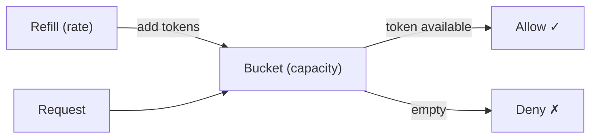
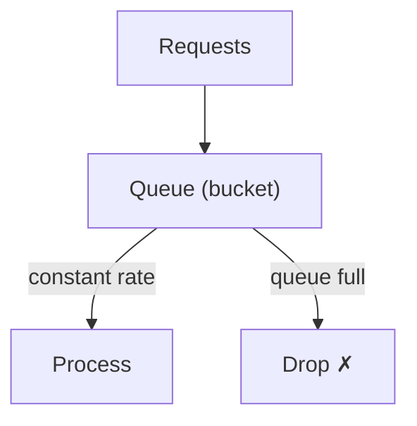

## What is Rate Limiting?

**Rate Limiting** controls the number of requests a client can make to a service within a given time window. It protects systems from abuse, ensures fair usage, and prevents overload.

---

## Why Rate Limit?

| **Reason** | **Example** |
|-----------|------------|
| Prevent abuse | Stop DDoS attacks |
| Fair usage | No single user monopolizes resources |
| Cost control | Limit expensive API calls |
| Stability | Prevent cascading failures |
| Compliance | Enforce API plan limits |

---

## Algorithms

### Token Bucket



- Bucket holds up to N tokens
- Tokens added at a fixed rate
- Each request consumes one token
- Allows bursts up to bucket capacity

```
Capacity: 10 tokens
Refill: 2 tokens/second

T=0: Bucket=10, 5 requests → Bucket=5 ✓
T=1: Bucket=7 (refilled 2), 3 requests → Bucket=4 ✓
T=2: Bucket=6 (refilled 2)
```

### Leaky Bucket



- Requests enter a queue (bucket)
- Processed at a fixed rate
- Overflow is dropped
- Smooths out bursts

### Fixed Window Counter

```
Window: 1 minute
Limit: 100 requests

12:00:00 - 12:00:59 → Counter: 87/100 ✓
12:01:00 - 12:01:59 → Counter: 0 (reset)
```

**Problem**: Burst at window boundary

```
Window 1 (12:00:30-12:00:59): 100 requests
Window 2 (12:01:00-12:01:30): 100 requests
→ 200 requests in 60 seconds!
```

### Sliding Window Log

Track timestamps of each request:

```
Limit: 100 per minute
Current time: 12:01:30

Remove entries before 12:00:30
Count remaining entries
If count < 100 → Allow
```

Accurate but memory-intensive.

### Sliding Window Counter

Combines fixed window and sliding window:

```
Previous window count: 80
Current window count: 30
Current position: 40% into window

Weighted count = 80 × 0.6 + 30 = 78
Limit: 100 → Allow ✓
```

---

## Algorithm Comparison

| **Algorithm** | **Burst** | **Memory** | **Accuracy** |
|--------------|----------|-----------|-------------|
| Token Bucket | Allows controlled bursts | Low | Good |
| Leaky Bucket | Smooths output | Low | Good |
| Fixed Window | Boundary burst problem | Low | Approximate |
| Sliding Log | No bursts | High | Exact |
| Sliding Counter | Minimal bursts | Low | Approximate |

---

## Where to Rate Limit


| **Layer** | **What to Limit** |
|----------|------------------|
| CDN / Edge | IP-based, geographic |
| API Gateway | API key, user ID |
| Service | Business logic limits |

---

## Implementation

### Redis-Based (Token Bucket)

```lua
-- Redis Lua script (atomic)
local key = KEYS[1]
local capacity = tonumber(ARGV[1])
local rate = tonumber(ARGV[2])
local now = tonumber(ARGV[3])

local data = redis.call('HMGET', key, 'tokens', 'last_refill')
local tokens = tonumber(data[1]) or capacity
local last_refill = tonumber(data[2]) or now

-- Refill tokens
local elapsed = now - last_refill
tokens = math.min(capacity, tokens + elapsed * rate)

if tokens >= 1 then
  tokens = tokens - 1
  redis.call('HMSET', key, 'tokens', tokens, 'last_refill', now)
  redis.call('EXPIRE', key, 60)
  return 1  -- allowed
else
  redis.call('HMSET', key, 'tokens', tokens, 'last_refill', now)
  redis.call('EXPIRE', key, 60)
  return 0  -- denied
end
```

---

## Response Headers

```http
HTTP/1.1 200 OK
X-RateLimit-Limit: 100
X-RateLimit-Remaining: 67
X-RateLimit-Reset: 1710432060

HTTP/1.1 429 Too Many Requests
Retry-After: 30
```

---

## Rate Limiting Strategies

| **Strategy** | **Key** | **Example** |
|-------------|--------|------------|
| Per user | User ID / API key | 1000 req/hour |
| Per IP | Client IP | 100 req/minute |
| Per endpoint | Path + method | 10 POST/minute |
| Global | Total across all users | 10,000 req/second |

---

## Distributed Rate Limiting

Challenge: Multiple servers need shared counters.

| **Approach** | **Trade-off** |
|-------------|--------------|
| Centralized (Redis) | Accurate, single point of failure |
| Local + sync | Fast, eventually consistent |
| Token bucket per node | Simple, less accurate |

---

## Interview Tips

- Know all 5 algorithms and their trade-offs
- Token bucket is most commonly used (AWS, Stripe)
- Explain the fixed window boundary burst problem
- Discuss distributed rate limiting challenges
- Mention HTTP 429 and rate limit headers
