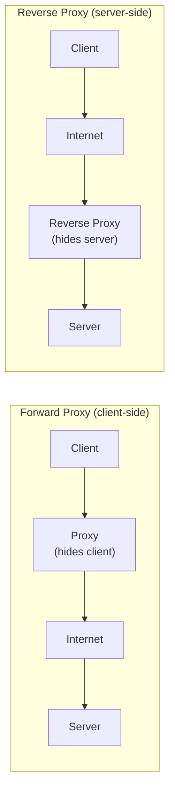
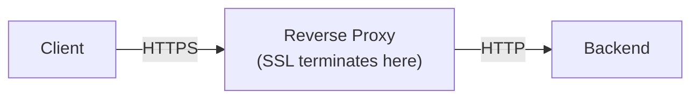
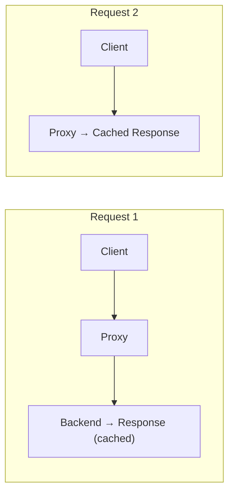

## What is a Reverse Proxy?

A **Reverse Proxy** sits in front of backend servers and forwards client requests to them. Unlike a forward proxy (which acts on behalf of clients), a reverse proxy acts on behalf of servers.

---

## Forward vs Reverse Proxy



---

## Reverse Proxy Functions

### 1. Load Balancing

Distribute requests across multiple backend servers.

### 2. SSL Termination

Handle HTTPS encryption/decryption at the proxy:



### 3. Caching

Cache responses to reduce backend load:



### 4. Compression

Compress responses before sending to clients.

### 5. Security

- Hide backend server details
- Filter malicious requests
- Rate limiting
- Web Application Firewall (WAF)

---

## Common Use Cases

| **Use Case** | **How Reverse Proxy Helps** |
|-------------|---------------------------|
| API Gateway | Route to different microservices |
| Static content | Serve cached files |
| SSL offloading | Centralized certificate management |
| A/B testing | Route traffic to different versions |

---

## Popular Reverse Proxies

| **Software** | **Strengths** |
|-------------|--------------|
| NGINX | High performance, widely used |
| HAProxy | Load balancing focus |
| Traefik | Container-native, auto-discovery |
| Envoy | Service mesh, observability |

---

## NGINX Example

```nginx
server {
    listen 80;
    server_name example.com;

    location /api/ {
        proxy_pass http://backend-servers;
    }

    location /static/ {
        root /var/www/static;
    }
}
```

---

## Interview Tips

- Differentiate forward vs reverse proxy
- Know common functions: SSL termination, caching, load balancing
- Mention security benefits
- Give examples: NGINX, HAProxy, cloud load balancers
