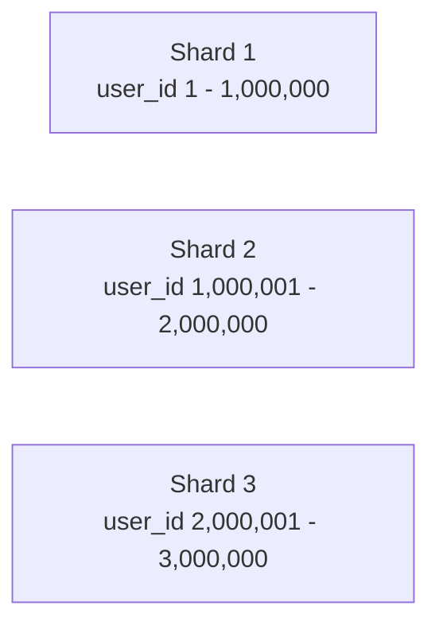
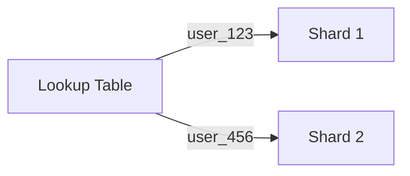
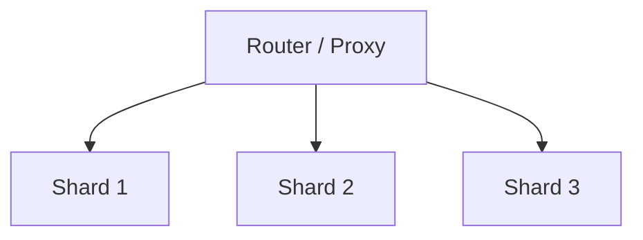
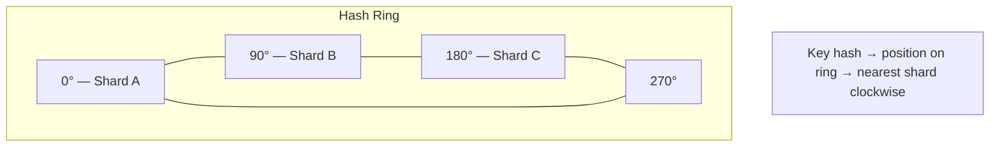

## What is Sharding?

**Sharding** (also called horizontal partitioning) splits a database into smaller pieces called shards, each stored on a separate server. It enables horizontal scaling when a single database can't handle the load.

---

## Why Shard?

| **Problem** | **How Sharding Helps** |
|------------|----------------------|
| Data too large for one server | Split across multiple servers |
| Too many read/write operations | Distribute load |
| Single point of failure | Each shard independent |
| Geographic latency | Place shards near users |

---

## Sharding Strategies

### 1. Range-Based Sharding

Partition by ranges of a key:



**Pros**: Simple, range queries efficient
**Cons**: Hotspots if data skewed, rebalancing hard

### 2. Hash-Based Sharding

Use hash function to determine shard:

```
shard = hash(user_id) % num_shards
```

**Pros**: Even distribution, no hotspots
**Cons**: Range queries require hitting all shards

### 3. Directory-Based Sharding

Lookup table maps keys to shards:



**Pros**: Flexible, easy rebalancing
**Cons**: Lookup table is bottleneck/SPOF

### 4. Geographic Sharding

Partition by location:

```
US users → US shard
EU users → EU shard
Asia users → Asia shard
```

---

## Sharding Architecture



---

## Challenges

### Cross-Shard Queries

```sql
-- This is hard when users are on different shards:
SELECT * FROM orders
JOIN users ON orders.user_id = users.id
```

**Solutions**: Denormalize, application-level joins, avoid cross-shard queries

### Rebalancing

Moving data when adding/removing shards:

- Consistent hashing minimizes data movement
- Virtual shards allow gradual migration

### Transactions

ACID transactions across shards are complex:

- Use two-phase commit (slow)
- Design to avoid cross-shard transactions
- Accept eventual consistency

---

## Consistent Hashing

Minimizes data movement when shards change:



---

## Interview Tips

- Know when to shard vs when to scale vertically
- Explain different sharding strategies and trade-offs
- Discuss consistent hashing for rebalancing
- Mention cross-shard query challenges
- Give examples: MongoDB, Cassandra, Vitess (MySQL)
