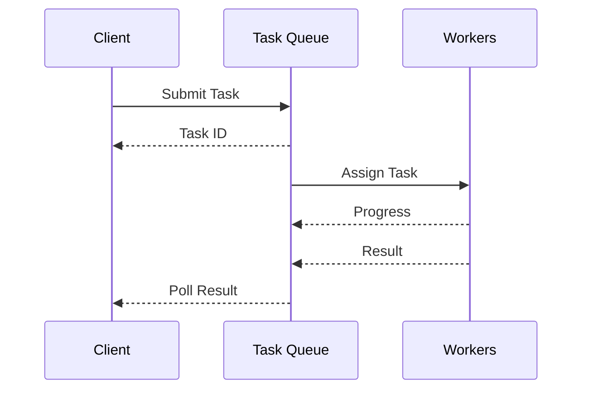
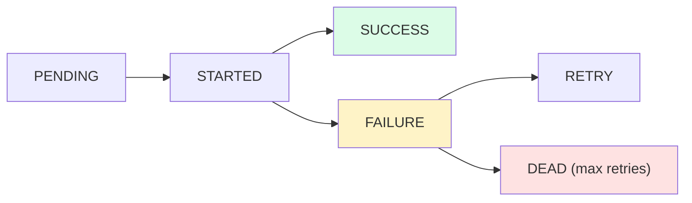

## What is a Task Queue?

A **Task Queue** is a mechanism for distributing work across multiple workers. Unlike simple message queues, task queues typically focus on job execution with features like retries, scheduling, and progress tracking.

---

## Task Queue vs Message Queue

| **Aspect** | **Message Queue** | **Task Queue** |
|-----------|------------------|----------------|
| Focus | Message delivery | Job execution |
| Features | Basic delivery | Retries, scheduling, results |
| Semantics | Data transfer | Work processing |
| Examples | RabbitMQ, SQS | Celery, Sidekiq, Bull |

---

## How It Works



---

## Key Features

| **Feature** | **Description** |
|------------|-----------------|
| Retries | Automatically retry failed tasks |
| Scheduling | Run tasks at specific times |
| Priority | High-priority tasks first |
| Rate limiting | Control task execution rate |
| Result storage | Store and retrieve task results |
| Progress tracking | Monitor task completion |

---

## Common Use Cases

| **Use Case** | **Example** |
|-------------|------------|
| Background jobs | Send emails, generate reports |
| Scheduled tasks | Daily cleanup, cron jobs |
| Long-running tasks | Video encoding, data processing |
| Distributed computation | Map-reduce operations |
| Webhooks | Process incoming webhook payloads |

---

## Task States



---

## Popular Task Queues

| **System** | **Language** | **Backend** |
|-----------|-------------|------------|
| Celery | Python | Redis, RabbitMQ |
| Sidekiq | Ruby | Redis |
| Bull | Node.js | Redis |
| BullMQ | Node.js | Redis |
| Hangfire | .NET | SQL Server, Redis |

---

## Code Example (Celery)

```python
from celery import Celery

app = Celery('tasks', broker='redis://localhost:6379')

@app.task(bind=True, max_retries=3)
def process_order(self, order_id):
    try:
        # Process the order
        result = do_processing(order_id)
        return result
    except Exception as e:
        # Retry with exponential backoff
        raise self.retry(exc=e, countdown=2 ** self.request.retries)

# Submit task
task = process_order.delay(order_id=123)

# Check result
result = task.get(timeout=30)
```

---

## Interview Tips

- Differentiate from simple message queues
- Explain retry strategies and dead letter handling
- Discuss idempotency for at-least-once delivery
- Mention scheduling and priority features
- Give examples: email sending, report generation
