## High-Level Architecture

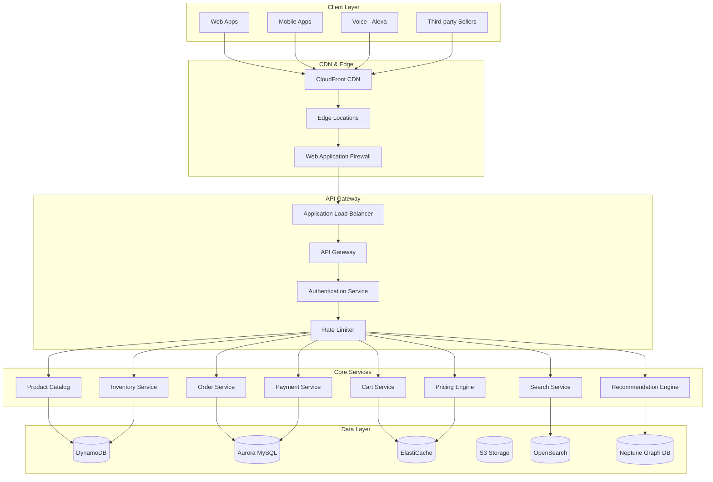
```mermaid
graph TB
    subgraph "Client Layer"
        WEB[Web Apps]
        MOBILE[Mobile Apps]
        ALEXA[Voice - Alexa]
        API_CLIENTS[Third-party Sellers]
    end

    subgraph "CDN & Edge"
        CLOUDFRONT[CloudFront CDN]
        EDGE[Edge Locations]
        WAF[Web Application Firewall]
    end

    subgraph "API Gateway"
        ALB[Application Load Balancer]
        API_GW[API Gateway]
        AUTH[Authentication Service]
        RATE[Rate Limiter]
    end

    subgraph "Core Services"
        CATALOG[Product Catalog]
        SEARCH[Search Service]
        CART[Cart Service]
        ORDER[Order Service]
        PAYMENT[Payment Service]
        INVENTORY[Inventory Service]
        RECOMMENDATION[Recommendation Engine]
        PRICING[Pricing Engine]
    end

    subgraph "Data Layer"
        DYNAMODB[(DynamoDB)]
        AURORA[(Aurora MySQL)]
        REDIS[(ElastiCache)]
        S3[(S3 Storage)]
        OPENSEARCH[(OpenSearch)]
        NEPTUNE[(Neptune Graph DB)]
    end

    WEB --> CLOUDFRONT
    MOBILE --> CLOUDFRONT
    ALEXA --> CLOUDFRONT
    API_CLIENTS --> CLOUDFRONT

    CLOUDFRONT --> EDGE
    EDGE --> WAF
    WAF --> ALB

    ALB --> API_GW
    API_GW --> AUTH
    AUTH --> RATE

    RATE --> CATALOG
    RATE --> SEARCH
    RATE --> CART
    RATE --> ORDER
    RATE --> PAYMENT
    RATE --> INVENTORY
    RATE --> RECOMMENDATION
    RATE --> PRICING

    CATALOG --> DYNAMODB
    SEARCH --> OPENSEARCH
    CART --> REDIS
    ORDER --> AURORA
    PAYMENT --> AURORA
    INVENTORY --> DYNAMODB
    RECOMMENDATION --> NEPTUNE
    PRICING --> REDIS
```

## Core Components

### 1. Product Catalog Service

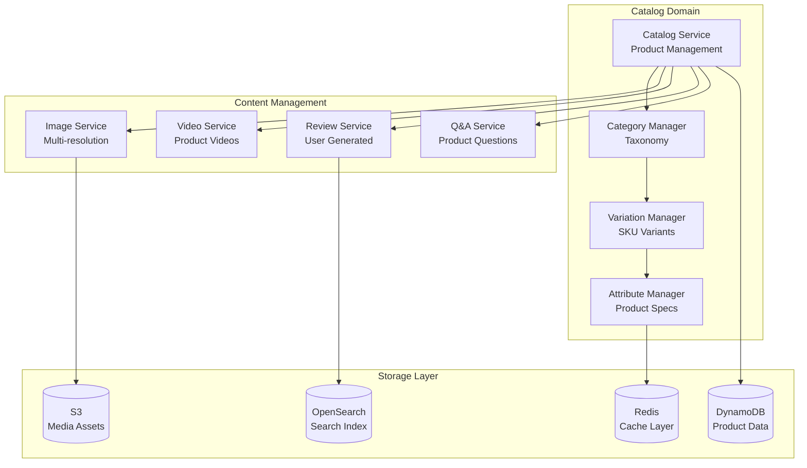
```mermaid
graph TD
    subgraph "Catalog Domain"
        CS[Catalog Service<br/>Product Management]
        CM[Category Manager<br/>Taxonomy]
        VM[Variation Manager<br/>SKU Variants]
        AM[Attribute Manager<br/>Product Specs]
    end

    subgraph "Content Management"
        IMAGES[Image Service<br/>Multi-resolution]
        VIDEOS[Video Service<br/>Product Videos]
        REVIEWS[Review Service<br/>User Generated]
        QA[Q&A Service<br/>Product Questions]
    end

    subgraph "Storage Layer"
        DYNAMODB_CAT[(DynamoDB<br/>Product Data)]
        S3_MEDIA[(S3<br/>Media Assets)]
        OPENSEARCH_CAT[(OpenSearch<br/>Search Index)]
        REDIS_CAT[(Redis<br/>Cache Layer)]
    end

    CS --> CM
    CM --> VM
    VM --> AM

    CS --> IMAGES
    CS --> VIDEOS
    CS --> REVIEWS
    CS --> QA

    CS --> DYNAMODB_CAT
    IMAGES --> S3_MEDIA
    REVIEWS --> OPENSEARCH_CAT
    AM --> REDIS_CAT
```

**Key Features:**
- 350+ million products across global marketplaces
- Real-time inventory synchronization
- Multi-marketplace product variants
- Rich media support (360° images, videos)
- Technologies: Java, DynamoDB, S3, OpenSearch

### 2. Search & Discovery Engine

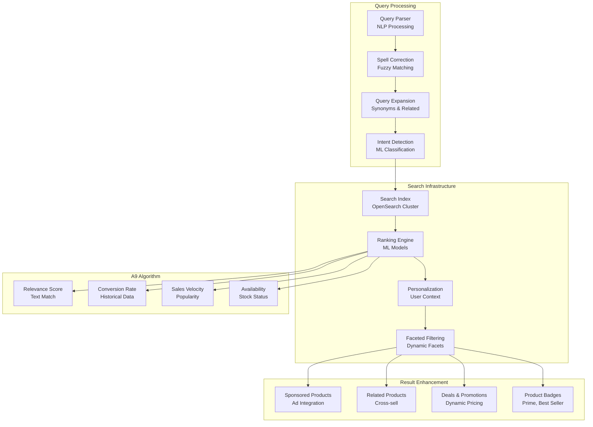
```mermaid
graph TD
    subgraph "Query Processing"
        QUERY[Query Parser<br/>NLP Processing]
        SPELL[Spell Correction<br/>Fuzzy Matching]
        EXPAND[Query Expansion<br/>Synonyms & Related]
        INTENT[Intent Detection<br/>ML Classification]
    end

    subgraph "Search Infrastructure"
        INDEX[Search Index<br/>OpenSearch Cluster]
        RANKING[Ranking Engine<br/>ML Models]
        PERSONALIZE[Personalization<br/>User Context]
        FILTER[Faceted Filtering<br/>Dynamic Facets]
    end

    subgraph "Result Enhancement"
        SPONSORED[Sponsored Products<br/>Ad Integration]
        RELATED[Related Products<br/>Cross-sell]
        DEALS[Deals & Promotions<br/>Dynamic Pricing]
        BADGES[Product Badges<br/>Prime, Best Seller]
    end

    subgraph "A9 Algorithm"
        RELEVANCE[Relevance Score<br/>Text Match]
        CONVERSION[Conversion Rate<br/>Historical Data]
        SALES[Sales Velocity<br/>Popularity]
        AVAILABILITY[Availability<br/>Stock Status]
    end

    QUERY --> SPELL
    SPELL --> EXPAND
    EXPAND --> INTENT

    INTENT --> INDEX
    INDEX --> RANKING
    RANKING --> PERSONALIZE
    PERSONALIZE --> FILTER

    FILTER --> SPONSORED
    FILTER --> RELATED
    FILTER --> DEALS
    FILTER --> BADGES

    RANKING --> RELEVANCE
    RANKING --> CONVERSION
    RANKING --> SALES
    RANKING --> AVAILABILITY
```

**A9 Search Algorithm:**
- Text relevance matching with NLP
- Conversion rate optimization
- Sales velocity and popularity scoring
- Inventory availability weighting
- Personalization based on user history

### 3. Shopping Cart & Checkout

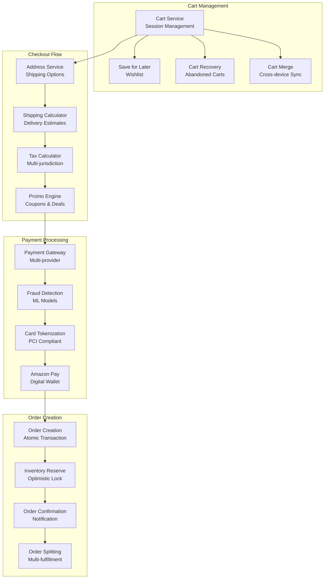
```mermaid
graph TD
    subgraph "Cart Management"
        CART_SERVICE[Cart Service<br/>Session Management]
        SAVE_LATER[Save for Later<br/>Wishlist]
        ABANDON[Cart Recovery<br/>Abandoned Carts]
        MERGE[Cart Merge<br/>Cross-device Sync]
    end

    subgraph "Checkout Flow"
        ADDRESS[Address Service<br/>Shipping Options]
        SHIPPING[Shipping Calculator<br/>Delivery Estimates]
        TAX[Tax Calculator<br/>Multi-jurisdiction]
        PROMO[Promo Engine<br/>Coupons & Deals]
    end

    subgraph "Payment Processing"
        PAYMENT_GW[Payment Gateway<br/>Multi-provider]
        FRAUD[Fraud Detection<br/>ML Models]
        TOKENIZE[Card Tokenization<br/>PCI Compliant]
        WALLET[Amazon Pay<br/>Digital Wallet]
    end

    subgraph "Order Creation"
        ORDER_CREATE[Order Creation<br/>Atomic Transaction]
        INVENTORY_RESERVE[Inventory Reserve<br/>Optimistic Lock]
        CONFIRM[Order Confirmation<br/>Notification]
        SPLIT[Order Splitting<br/>Multi-fulfillment]
    end

    CART_SERVICE --> SAVE_LATER
    CART_SERVICE --> ABANDON
    CART_SERVICE --> MERGE

    CART_SERVICE --> ADDRESS
    ADDRESS --> SHIPPING
    SHIPPING --> TAX
    TAX --> PROMO

    PROMO --> PAYMENT_GW
    PAYMENT_GW --> FRAUD
    FRAUD --> TOKENIZE
    TOKENIZE --> WALLET

    WALLET --> ORDER_CREATE
    ORDER_CREATE --> INVENTORY_RESERVE
    INVENTORY_RESERVE --> CONFIRM
    CONFIRM --> SPLIT
```

**Checkout Features:**
- One-click ordering with saved preferences
- Real-time inventory verification
- Dynamic shipping options (Prime, Same-day)
- Multi-payment method support
- Fraud prevention with ML models

### 4. Order Management System

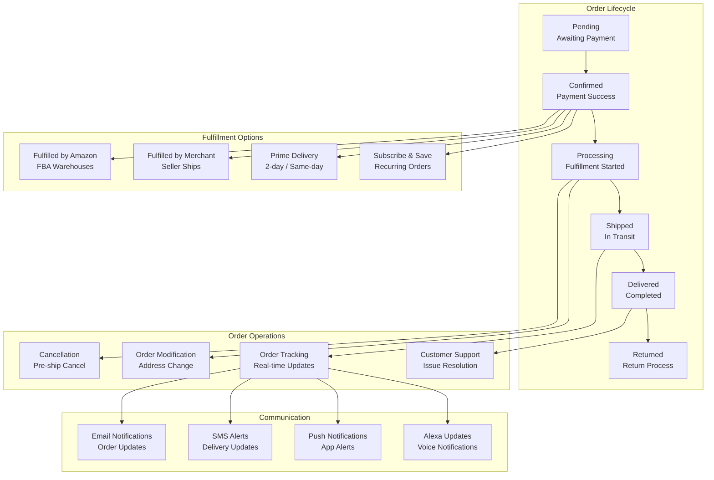
```mermaid
graph TD
    subgraph "Order Lifecycle"
        PENDING[Pending<br/>Awaiting Payment]
        CONFIRMED[Confirmed<br/>Payment Success]
        PROCESSING[Processing<br/>Fulfillment Started]
        SHIPPED[Shipped<br/>In Transit]
        DELIVERED[Delivered<br/>Completed]
        RETURNED[Returned<br/>Return Process]
    end

    subgraph "Fulfillment Options"
        FBA[Fulfilled by Amazon<br/>FBA Warehouses]
        FBM[Fulfilled by Merchant<br/>Seller Ships]
        PRIME[Prime Delivery<br/>2-day / Same-day]
        SUBSCRIBE[Subscribe & Save<br/>Recurring Orders]
    end

    subgraph "Order Operations"
        CANCEL[Cancellation<br/>Pre-ship Cancel]
        MODIFY[Order Modification<br/>Address Change]
        TRACK[Order Tracking<br/>Real-time Updates]
        SUPPORT[Customer Support<br/>Issue Resolution]
    end

    subgraph "Communication"
        EMAIL_NOTIF[Email Notifications<br/>Order Updates]
        SMS_NOTIF[SMS Alerts<br/>Delivery Updates]
        PUSH_NOTIF[Push Notifications<br/>App Alerts]
        ALEXA_NOTIF[Alexa Updates<br/>Voice Notifications]
    end

    PENDING --> CONFIRMED
    CONFIRMED --> PROCESSING
    PROCESSING --> SHIPPED
    SHIPPED --> DELIVERED
    DELIVERED --> RETURNED

    CONFIRMED --> FBA
    CONFIRMED --> FBM
    CONFIRMED --> PRIME
    CONFIRMED --> SUBSCRIBE

    PROCESSING --> CANCEL
    PROCESSING --> MODIFY
    SHIPPED --> TRACK
    DELIVERED --> SUPPORT

    TRACK --> EMAIL_NOTIF
    TRACK --> SMS_NOTIF
    TRACK --> PUSH_NOTIF
    TRACK --> ALEXA_NOTIF
```

### 5. Inventory Management

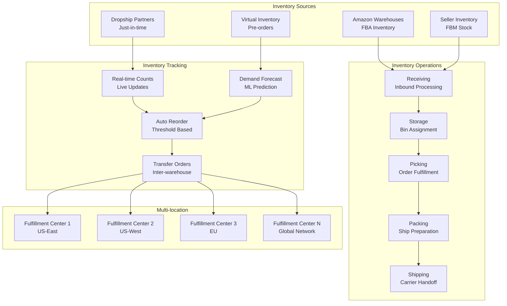
```mermaid
graph TD
    subgraph "Inventory Sources"
        WAREHOUSE[Amazon Warehouses<br/>FBA Inventory]
        SELLER[Seller Inventory<br/>FBM Stock]
        DROPSHIP[Dropship Partners<br/>Just-in-time]
        VIRTUAL[Virtual Inventory<br/>Pre-orders]
    end

    subgraph "Inventory Operations"
        RECEIVE[Receiving<br/>Inbound Processing]
        STORE[Storage<br/>Bin Assignment]
        PICK[Picking<br/>Order Fulfillment]
        PACK[Packing<br/>Ship Preparation]
        SHIP[Shipping<br/>Carrier Handoff]
    end

    subgraph "Inventory Tracking"
        REALTIME[Real-time Counts<br/>Live Updates]
        FORECAST[Demand Forecast<br/>ML Prediction]
        REORDER[Auto Reorder<br/>Threshold Based]
        TRANSFER[Transfer Orders<br/>Inter-warehouse]
    end

    subgraph "Multi-location"
        FC1[Fulfillment Center 1<br/>US-East]
        FC2[Fulfillment Center 2<br/>US-West]
        FC3[Fulfillment Center 3<br/>EU]
        FC4[Fulfillment Center N<br/>Global Network]
    end

    WAREHOUSE --> RECEIVE
    SELLER --> RECEIVE
    DROPSHIP --> REALTIME
    VIRTUAL --> FORECAST

    RECEIVE --> STORE
    STORE --> PICK
    PICK --> PACK
    PACK --> SHIP

    REALTIME --> REORDER
    FORECAST --> REORDER
    REORDER --> TRANSFER

    TRANSFER --> FC1
    TRANSFER --> FC2
    TRANSFER --> FC3
    TRANSFER --> FC4
```

**Inventory Features:**
- 175+ fulfillment centers globally
- Real-time inventory synchronization
- Predictive demand forecasting
- Multi-channel inventory allocation
- Automated replenishment

### 6. Recommendation Engine

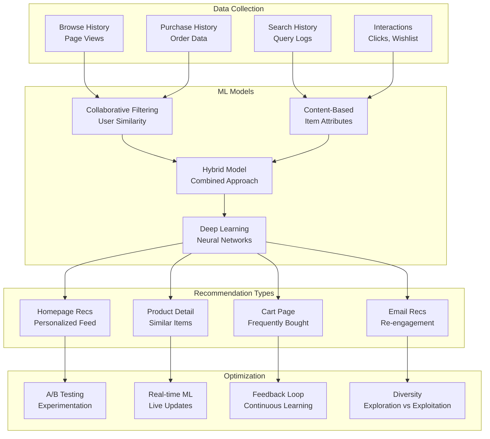
```mermaid
graph TD
    subgraph "Data Collection"
        BROWSE[Browse History<br/>Page Views]
        PURCHASE[Purchase History<br/>Order Data]
        SEARCH_HIST[Search History<br/>Query Logs]
        INTERACT[Interactions<br/>Clicks, Wishlist]
    end

    subgraph "ML Models"
        COLLABORATIVE[Collaborative Filtering<br/>User Similarity]
        CONTENT[Content-Based<br/>Item Attributes]
        HYBRID[Hybrid Model<br/>Combined Approach]
        DEEP[Deep Learning<br/>Neural Networks]
    end

    subgraph "Recommendation Types"
        HOMEPAGE[Homepage Recs<br/>Personalized Feed]
        PDP[Product Detail<br/>Similar Items]
        CART_REC[Cart Page<br/>Frequently Bought]
        EMAIL_REC[Email Recs<br/>Re-engagement]
    end

    subgraph "Optimization"
        AB_TEST[A/B Testing<br/>Experimentation]
        REALTIME_ML[Real-time ML<br/>Live Updates]
        FEEDBACK[Feedback Loop<br/>Continuous Learning]
        DIVERSITY[Diversity<br/>Exploration vs Exploitation]
    end

    BROWSE --> COLLABORATIVE
    PURCHASE --> COLLABORATIVE
    SEARCH_HIST --> CONTENT
    INTERACT --> CONTENT

    COLLABORATIVE --> HYBRID
    CONTENT --> HYBRID
    HYBRID --> DEEP

    DEEP --> HOMEPAGE
    DEEP --> PDP
    DEEP --> CART_REC
    DEEP --> EMAIL_REC

    HOMEPAGE --> AB_TEST
    PDP --> REALTIME_ML
    CART_REC --> FEEDBACK
    EMAIL_REC --> DIVERSITY
```

**Recommendation Algorithms:**
- Item-to-item collaborative filtering
- User-based recommendations
- "Customers who bought X also bought Y"
- Personalized rankings based on behavior
- Real-time model updates

## Data Architecture

### 1. DynamoDB (Primary NoSQL)

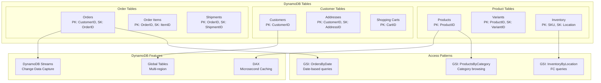
```mermaid
graph TD
    subgraph "DynamoDB Tables"
        subgraph "Product Tables"
            PRODUCTS[Products<br/>PK: ProductID]
            VARIANTS[Variants<br/>PK: ProductID, SK: VariantID]
            INVENTORY_TBL[Inventory<br/>PK: SKU, SK: Location]
        end

        subgraph "Customer Tables"
            CUSTOMERS[Customers<br/>PK: CustomerID]
            ADDRESSES[Addresses<br/>PK: CustomerID, SK: AddressID]
            CARTS[Shopping Carts<br/>PK: CartID]
        end

        subgraph "Order Tables"
            ORDERS[Orders<br/>PK: CustomerID, SK: OrderID]
            ORDER_ITEMS[Order Items<br/>PK: OrderID, SK: ItemID]
            SHIPMENTS[Shipments<br/>PK: OrderID, SK: ShipmentID]
        end
    end

    subgraph "Access Patterns"
        GSI1[GSI: OrdersByDate<br/>Date-based queries]
        GSI2[GSI: ProductsByCategory<br/>Category browsing]
        GSI3[GSI: InventoryByLocation<br/>FC queries]
    end

    subgraph "DynamoDB Features"
        STREAMS[DynamoDB Streams<br/>Change Data Capture]
        DAX[DAX<br/>Microsecond Caching]
        GLOBAL[Global Tables<br/>Multi-region]
    end

    PRODUCTS --> GSI2
    ORDERS --> GSI1
    INVENTORY_TBL --> GSI3

    ORDERS --> STREAMS
    PRODUCTS --> DAX
    CUSTOMERS --> GLOBAL
```

### 2. Aurora MySQL (Relational)

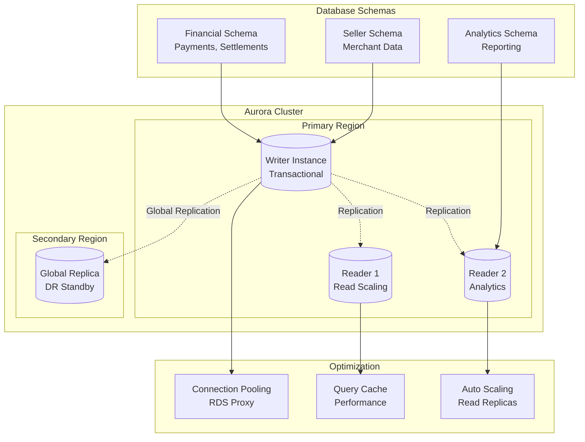
```mermaid
graph TD
    subgraph "Aurora Cluster"
        subgraph "Primary Region"
            WRITER[(Writer Instance<br/>Transactional)]
            READER1[(Reader 1<br/>Read Scaling)]
            READER2[(Reader 2<br/>Analytics)]
        end

        subgraph "Secondary Region"
            REPLICA[(Global Replica<br/>DR Standby)]
        end
    end

    subgraph "Database Schemas"
        FINANCIAL[Financial Schema<br/>Payments, Settlements]
        SELLER[Seller Schema<br/>Merchant Data]
        ANALYTICS[Analytics Schema<br/>Reporting]
    end

    subgraph "Optimization"
        CONN_POOL[Connection Pooling<br/>RDS Proxy]
        QUERY_CACHE[Query Cache<br/>Performance]
        AUTO_SCALE[Auto Scaling<br/>Read Replicas]
    end

    WRITER -.->|Replication| READER1
    WRITER -.->|Replication| READER2
    WRITER -.->|Global Replication| REPLICA

    FINANCIAL --> WRITER
    SELLER --> WRITER
    ANALYTICS --> READER2

    WRITER --> CONN_POOL
    READER1 --> QUERY_CACHE
    READER2 --> AUTO_SCALE
```

### 3. ElastiCache Redis

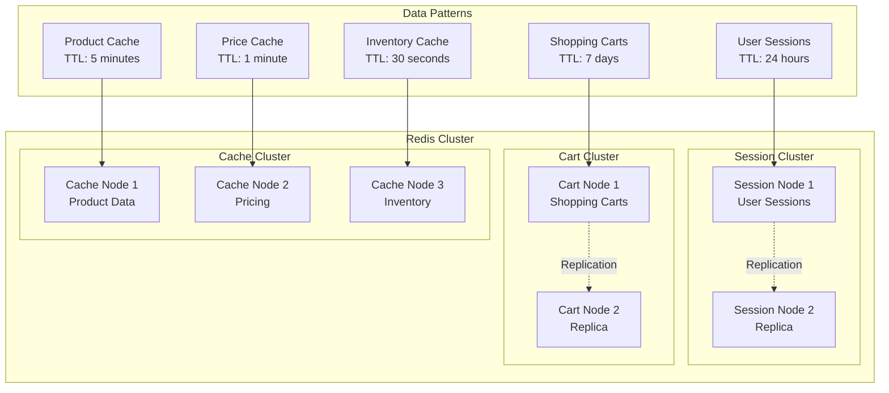
```mermaid
graph TD
    subgraph "Redis Cluster"
        subgraph "Session Cluster"
            SESSION1[Session Node 1<br/>User Sessions]
            SESSION2[Session Node 2<br/>Replica]
        end

        subgraph "Cart Cluster"
            CART1[Cart Node 1<br/>Shopping Carts]
            CART2[Cart Node 2<br/>Replica]
        end

        subgraph "Cache Cluster"
            CACHE1[Cache Node 1<br/>Product Data]
            CACHE2[Cache Node 2<br/>Pricing]
            CACHE3[Cache Node 3<br/>Inventory]
        end
    end

    subgraph "Data Patterns"
        SESSIONS[User Sessions<br/>TTL: 24 hours]
        CARTS_DATA[Shopping Carts<br/>TTL: 7 days]
        PRODUCT_CACHE[Product Cache<br/>TTL: 5 minutes]
        PRICE_CACHE[Price Cache<br/>TTL: 1 minute]
        INVENTORY_CACHE[Inventory Cache<br/>TTL: 30 seconds]
    end

    SESSION1 -.->|Replication| SESSION2
    CART1 -.->|Replication| CART2

    SESSIONS --> SESSION1
    CARTS_DATA --> CART1
    PRODUCT_CACHE --> CACHE1
    PRICE_CACHE --> CACHE2
    INVENTORY_CACHE --> CACHE3
```

### 4. OpenSearch (Search Infrastructure)

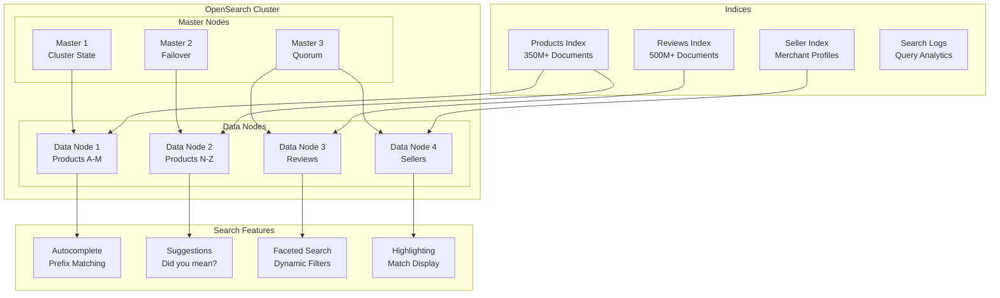
```mermaid
graph TD
    subgraph "OpenSearch Cluster"
        subgraph "Master Nodes"
            M1[Master 1<br/>Cluster State]
            M2[Master 2<br/>Failover]
            M3[Master 3<br/>Quorum]
        end

        subgraph "Data Nodes"
            D1[Data Node 1<br/>Products A-M]
            D2[Data Node 2<br/>Products N-Z]
            D3[Data Node 3<br/>Reviews]
            D4[Data Node 4<br/>Sellers]
        end
    end

    subgraph "Indices"
        PRODUCT_IDX[Products Index<br/>350M+ Documents]
        REVIEW_IDX[Reviews Index<br/>500M+ Documents]
        SELLER_IDX[Seller Index<br/>Merchant Profiles]
        LOG_IDX[Search Logs<br/>Query Analytics]
    end

    subgraph "Search Features"
        AUTOCOMPLETE[Autocomplete<br/>Prefix Matching]
        SUGGEST[Suggestions<br/>Did you mean?]
        FACETS[Faceted Search<br/>Dynamic Filters]
        HIGHLIGHT[Highlighting<br/>Match Display]
    end

    M1 --> D1
    M2 --> D2
    M3 --> D3
    M3 --> D4

    PRODUCT_IDX --> D1
    PRODUCT_IDX --> D2
    REVIEW_IDX --> D3
    SELLER_IDX --> D4

    D1 --> AUTOCOMPLETE
    D2 --> SUGGEST
    D3 --> FACETS
    D4 --> HIGHLIGHT
```

## Fulfillment Architecture

### 1. Fulfillment Center Operations

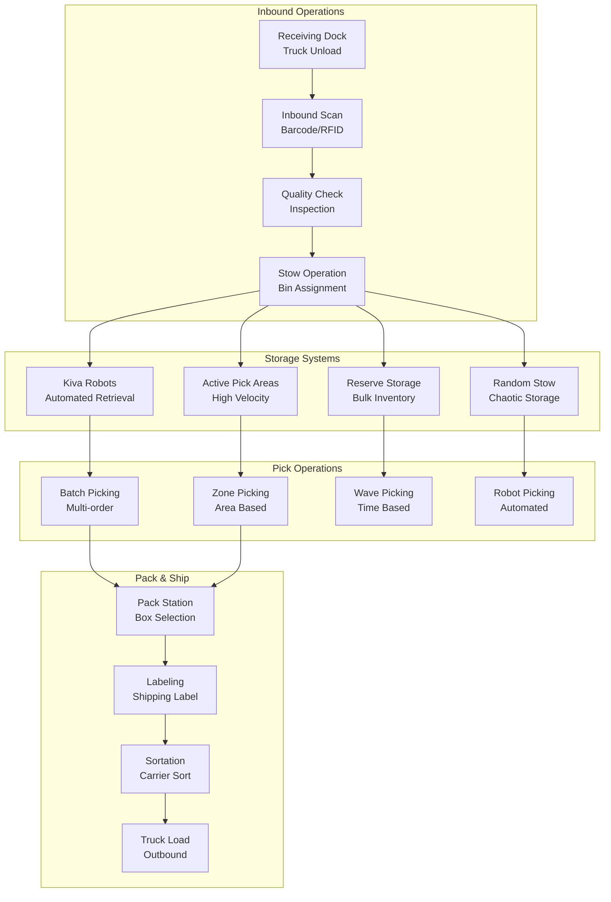
```mermaid
graph TD
    subgraph "Inbound Operations"
        RECEIVE_DOCK[Receiving Dock<br/>Truck Unload]
        SCAN_IN[Inbound Scan<br/>Barcode/RFID]
        QUALITY[Quality Check<br/>Inspection]
        STOW[Stow Operation<br/>Bin Assignment]
    end

    subgraph "Storage Systems"
        RANDOM[Random Stow<br/>Chaotic Storage]
        KIVA[Kiva Robots<br/>Automated Retrieval]
        RESERVE[Reserve Storage<br/>Bulk Inventory]
        ACTIVE[Active Pick Areas<br/>High Velocity]
    end

    subgraph "Pick Operations"
        BATCH_PICK[Batch Picking<br/>Multi-order]
        ZONE_PICK[Zone Picking<br/>Area Based]
        WAVE_PICK[Wave Picking<br/>Time Based]
        ROBOT_PICK[Robot Picking<br/>Automated]
    end

    subgraph "Pack & Ship"
        PACK_STATION[Pack Station<br/>Box Selection]
        LABEL[Labeling<br/>Shipping Label]
        SORT[Sortation<br/>Carrier Sort]
        LOAD[Truck Load<br/>Outbound]
    end

    RECEIVE_DOCK --> SCAN_IN
    SCAN_IN --> QUALITY
    QUALITY --> STOW

    STOW --> RANDOM
    STOW --> KIVA
    STOW --> RESERVE
    STOW --> ACTIVE

    KIVA --> BATCH_PICK
    ACTIVE --> ZONE_PICK
    RESERVE --> WAVE_PICK
    RANDOM --> ROBOT_PICK

    BATCH_PICK --> PACK_STATION
    ZONE_PICK --> PACK_STATION
    PACK_STATION --> LABEL
    LABEL --> SORT
    SORT --> LOAD
```

### 2. Delivery Network

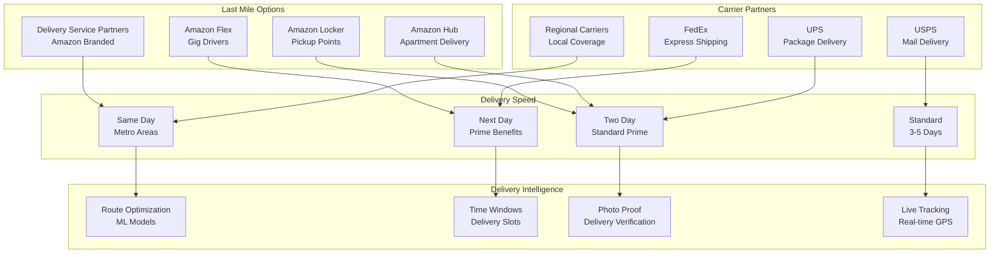
```mermaid
graph TD
    subgraph "Last Mile Options"
        DSP[Delivery Service Partners<br/>Amazon Branded]
        FLEX[Amazon Flex<br/>Gig Drivers]
        LOCKER[Amazon Locker<br/>Pickup Points]
        HUB[Amazon Hub<br/>Apartment Delivery]
    end

    subgraph "Carrier Partners"
        USPS[USPS<br/>Mail Delivery]
        UPS[UPS<br/>Package Delivery]
        FEDEX[FedEx<br/>Express Shipping]
        REGIONAL[Regional Carriers<br/>Local Coverage]
    end

    subgraph "Delivery Speed"
        SAME_DAY[Same Day<br/>Metro Areas]
        NEXT_DAY[Next Day<br/>Prime Benefits]
        TWO_DAY[Two Day<br/>Standard Prime]
        STANDARD[Standard<br/>3-5 Days]
    end

    subgraph "Delivery Intelligence"
        ROUTE_OPT[Route Optimization<br/>ML Models]
        TIME_WINDOW[Time Windows<br/>Delivery Slots]
        PHOTO_PROOF[Photo Proof<br/>Delivery Verification]
        LIVE_TRACK[Live Tracking<br/>Real-time GPS]
    end

    DSP --> SAME_DAY
    FLEX --> NEXT_DAY
    LOCKER --> TWO_DAY
    HUB --> TWO_DAY

    USPS --> STANDARD
    UPS --> TWO_DAY
    FEDEX --> NEXT_DAY
    REGIONAL --> SAME_DAY

    SAME_DAY --> ROUTE_OPT
    NEXT_DAY --> TIME_WINDOW
    TWO_DAY --> PHOTO_PROOF
    STANDARD --> LIVE_TRACK
```

## Scalability & Performance

### 1. Auto-Scaling Architecture

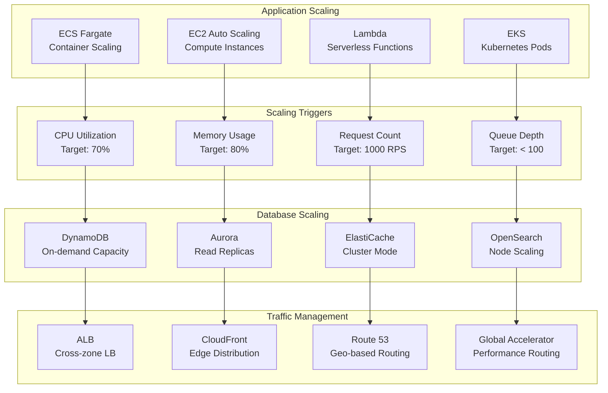
```mermaid
graph TD
    subgraph "Application Scaling"
        ECS[ECS Fargate<br/>Container Scaling]
        LAMBDA[Lambda<br/>Serverless Functions]
        EC2_ASG[EC2 Auto Scaling<br/>Compute Instances]
        EKS[EKS<br/>Kubernetes Pods]
    end

    subgraph "Scaling Triggers"
        CPU[CPU Utilization<br/>Target: 70%]
        MEMORY[Memory Usage<br/>Target: 80%]
        REQUEST[Request Count<br/>Target: 1000 RPS]
        QUEUE[Queue Depth<br/>Target: < 100]
    end

    subgraph "Database Scaling"
        DYNAMO_SCALE[DynamoDB<br/>On-demand Capacity]
        AURORA_SCALE[Aurora<br/>Read Replicas]
        REDIS_SCALE[ElastiCache<br/>Cluster Mode]
        OPENSEARCH_SCALE[OpenSearch<br/>Node Scaling]
    end

    subgraph "Traffic Management"
        ALB_SCALE[ALB<br/>Cross-zone LB]
        CLOUDFRONT_SCALE[CloudFront<br/>Edge Distribution]
        ROUTE53[Route 53<br/>Geo-based Routing]
        GLOBAL_ACC[Global Accelerator<br/>Performance Routing]
    end

    ECS --> CPU
    LAMBDA --> REQUEST
    EC2_ASG --> MEMORY
    EKS --> QUEUE

    CPU --> DYNAMO_SCALE
    MEMORY --> AURORA_SCALE
    REQUEST --> REDIS_SCALE
    QUEUE --> OPENSEARCH_SCALE

    DYNAMO_SCALE --> ALB_SCALE
    AURORA_SCALE --> CLOUDFRONT_SCALE
    REDIS_SCALE --> ROUTE53
    OPENSEARCH_SCALE --> GLOBAL_ACC
```

### 2. Caching Strategy

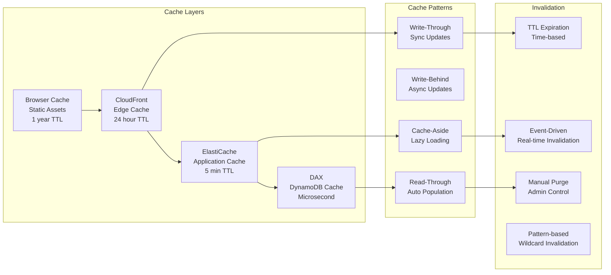
```mermaid
graph LR
    subgraph "Cache Layers"
        L1[Browser Cache<br/>Static Assets<br/>1 year TTL]
        L2[CloudFront<br/>Edge Cache<br/>24 hour TTL]
        L3[ElastiCache<br/>Application Cache<br/>5 min TTL]
        L4[DAX<br/>DynamoDB Cache<br/>Microsecond]
    end

    subgraph "Cache Patterns"
        WRITE_THROUGH[Write-Through<br/>Sync Updates]
        WRITE_BEHIND[Write-Behind<br/>Async Updates]
        CACHE_ASIDE[Cache-Aside<br/>Lazy Loading]
        READ_THROUGH[Read-Through<br/>Auto Population]
    end

    subgraph "Invalidation"
        TTL_EXPIRE[TTL Expiration<br/>Time-based]
        EVENT_DRIVEN[Event-Driven<br/>Real-time Invalidation]
        MANUAL[Manual Purge<br/>Admin Control]
        PATTERN_BASED[Pattern-based<br/>Wildcard Invalidation]
    end

    L1 --> L2
    L2 --> L3
    L3 --> L4

    L2 --> WRITE_THROUGH
    L3 --> CACHE_ASIDE
    L4 --> READ_THROUGH

    WRITE_THROUGH --> TTL_EXPIRE
    CACHE_ASIDE --> EVENT_DRIVEN
    READ_THROUGH --> MANUAL
```

### 3. Prime Day Architecture

```mermaid
graph TD
    subgraph "Capacity Planning"
        FORECAST[Traffic Forecast<br/>ML Prediction]
        PRE_SCALE[Pre-scaling<br/>Capacity Buffer]
        LOAD_TEST[Load Testing<br/>Stress Validation]
        RUNBOOK[Runbooks<br/>Incident Response]
    end

    subgraph "Traffic Management"
        THROTTLE[Request Throttling<br/>Rate Limiting]
        QUEUE_TRAFFIC[Traffic Queuing<br/>Virtual Waiting Room]
        PRIORITY[Priority Traffic<br/>VIP Handling]
        SHED[Load Shedding<br/>Graceful Degradation]
    end

    subgraph "Feature Toggles"
        DISABLE_SEARCH[Disable Features<br/>Non-critical]
        SIMPLIFIED_UI[Simplified UI<br/>Reduced Complexity]
        ASYNC_OPS[Async Operations<br/>Deferred Processing]
        STATIC_PAGES[Static Fallback<br/>Cached Content]
    end

    subgraph "Monitoring"
        REALTIME_DASH[Real-time Dashboard<br/>Command Center]
        AUTO_REMEDIATE[Auto Remediation<br/>Self-healing]
        WAR_ROOM[War Room<br/>Incident Management]
        COMMS[Communication<br/>Status Updates]
    end

    FORECAST --> PRE_SCALE
    PRE_SCALE --> LOAD_TEST
    LOAD_TEST --> RUNBOOK

    RUNBOOK --> THROTTLE
    THROTTLE --> QUEUE_TRAFFIC
    QUEUE_TRAFFIC --> PRIORITY
    PRIORITY --> SHED

    SHED --> DISABLE_SEARCH
    DISABLE_SEARCH --> SIMPLIFIED_UI
    SIMPLIFIED_UI --> ASYNC_OPS
    ASYNC_OPS --> STATIC_PAGES

    STATIC_PAGES --> REALTIME_DASH
    REALTIME_DASH --> AUTO_REMEDIATE
    AUTO_REMEDIATE --> WAR_ROOM
    WAR_ROOM --> COMMS
```

## Security Architecture

### 1. Multi-Layer Security

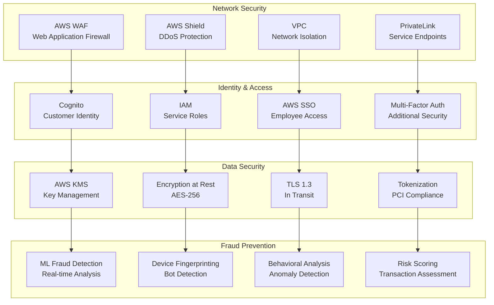
```mermaid
graph TB
    subgraph "Network Security"
        WAF_SEC[AWS WAF<br/>Web Application Firewall]
        SHIELD[AWS Shield<br/>DDoS Protection]
        VPC[VPC<br/>Network Isolation]
        PRIVATE_LINK[PrivateLink<br/>Service Endpoints]
    end

    subgraph "Identity & Access"
        COGNITO[Cognito<br/>Customer Identity]
        IAM[IAM<br/>Service Roles]
        SSO[AWS SSO<br/>Employee Access]
        MFA[Multi-Factor Auth<br/>Additional Security]
    end

    subgraph "Data Security"
        KMS[AWS KMS<br/>Key Management]
        ENCRYPTION[Encryption at Rest<br/>AES-256]
        TLS[TLS 1.3<br/>In Transit]
        TOKENIZATION[Tokenization<br/>PCI Compliance]
    end

    subgraph "Fraud Prevention"
        ML_FRAUD[ML Fraud Detection<br/>Real-time Analysis]
        DEVICE_FP[Device Fingerprinting<br/>Bot Detection]
        BEHAVIOR[Behavioral Analysis<br/>Anomaly Detection]
        RISK_SCORE[Risk Scoring<br/>Transaction Assessment]
    end

    WAF_SEC --> COGNITO
    SHIELD --> IAM
    VPC --> SSO
    PRIVATE_LINK --> MFA

    COGNITO --> KMS
    IAM --> ENCRYPTION
    SSO --> TLS
    MFA --> TOKENIZATION

    KMS --> ML_FRAUD
    ENCRYPTION --> DEVICE_FP
    TLS --> BEHAVIOR
    TOKENIZATION --> RISK_SCORE
```

### 2. PCI DSS Compliance

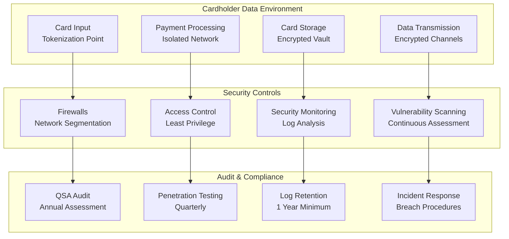
```mermaid
graph TD
    subgraph "Cardholder Data Environment"
        CARD_INPUT[Card Input<br/>Tokenization Point]
        PROCESSING[Payment Processing<br/>Isolated Network]
        STORAGE[Card Storage<br/>Encrypted Vault]
        TRANSMISSION[Data Transmission<br/>Encrypted Channels]
    end

    subgraph "Security Controls"
        FIREWALL[Firewalls<br/>Network Segmentation]
        ACCESS_CONTROL[Access Control<br/>Least Privilege]
        MONITORING_SEC[Security Monitoring<br/>Log Analysis]
        VULN_SCAN[Vulnerability Scanning<br/>Continuous Assessment]
    end

    subgraph "Audit & Compliance"
        QSA[QSA Audit<br/>Annual Assessment]
        PEN_TEST[Penetration Testing<br/>Quarterly]
        LOG_RETENTION[Log Retention<br/>1 Year Minimum]
        INCIDENT_RESP[Incident Response<br/>Breach Procedures]
    end

    CARD_INPUT --> FIREWALL
    PROCESSING --> ACCESS_CONTROL
    STORAGE --> MONITORING_SEC
    TRANSMISSION --> VULN_SCAN

    FIREWALL --> QSA
    ACCESS_CONTROL --> PEN_TEST
    MONITORING_SEC --> LOG_RETENTION
    VULN_SCAN --> INCIDENT_RESP
```

## Monitoring & Observability

### 1. Monitoring Stack

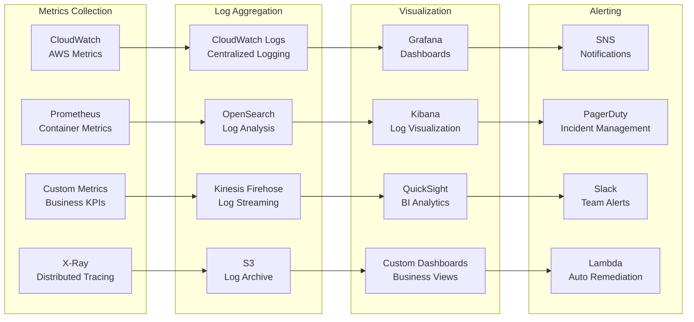
```mermaid
graph LR
    subgraph "Metrics Collection"
        CLOUDWATCH[CloudWatch<br/>AWS Metrics]
        PROMETHEUS[Prometheus<br/>Container Metrics]
        CUSTOM[Custom Metrics<br/>Business KPIs]
        APM[X-Ray<br/>Distributed Tracing]
    end

    subgraph "Log Aggregation"
        CLOUDWATCH_LOGS[CloudWatch Logs<br/>Centralized Logging]
        OPENSEARCH_LOGS[OpenSearch<br/>Log Analysis]
        KINESIS[Kinesis Firehose<br/>Log Streaming]
        S3_LOGS[S3<br/>Log Archive]
    end

    subgraph "Visualization"
        GRAFANA[Grafana<br/>Dashboards]
        QUICKSIGHT[QuickSight<br/>BI Analytics]
        KIBANA[Kibana<br/>Log Visualization]
        CUSTOM_DASH[Custom Dashboards<br/>Business Views]
    end

    subgraph "Alerting"
        SNS[SNS<br/>Notifications]
        PAGERDUTY_ALERT[PagerDuty<br/>Incident Management]
        SLACK_ALERT[Slack<br/>Team Alerts]
        LAMBDA_ALERT[Lambda<br/>Auto Remediation]
    end

    CLOUDWATCH --> CLOUDWATCH_LOGS
    PROMETHEUS --> OPENSEARCH_LOGS
    CUSTOM --> KINESIS
    APM --> S3_LOGS

    CLOUDWATCH_LOGS --> GRAFANA
    OPENSEARCH_LOGS --> KIBANA
    KINESIS --> QUICKSIGHT
    S3_LOGS --> CUSTOM_DASH

    GRAFANA --> SNS
    KIBANA --> PAGERDUTY_ALERT
    QUICKSIGHT --> SLACK_ALERT
    CUSTOM_DASH --> LAMBDA_ALERT
```

### 2. Key Performance Indicators

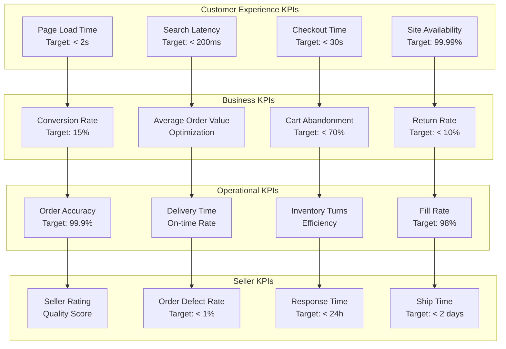
```mermaid
graph TD
    subgraph "Customer Experience KPIs"
        PAGE_LOAD[Page Load Time<br/>Target: < 2s]
        SEARCH_LATENCY[Search Latency<br/>Target: < 200ms]
        CHECKOUT_TIME[Checkout Time<br/>Target: < 30s]
        AVAILABILITY[Site Availability<br/>Target: 99.99%]
    end

    subgraph "Business KPIs"
        CONVERSION[Conversion Rate<br/>Target: 15%]
        AOV[Average Order Value<br/>Optimization]
        CART_ABANDON[Cart Abandonment<br/>Target: < 70%]
        RETURN_RATE[Return Rate<br/>Target: < 10%]
    end

    subgraph "Operational KPIs"
        ORDER_ACCURACY[Order Accuracy<br/>Target: 99.9%]
        DELIVERY_TIME[Delivery Time<br/>On-time Rate]
        INVENTORY_TURNS[Inventory Turns<br/>Efficiency]
        FILL_RATE[Fill Rate<br/>Target: 98%]
    end

    subgraph "Seller KPIs"
        SELLER_RATING[Seller Rating<br/>Quality Score]
        DEFECT_RATE[Order Defect Rate<br/>Target: < 1%]
        RESPONSE_TIME[Response Time<br/>Target: < 24h]
        SHIP_TIME[Ship Time<br/>Target: < 2 days]
    end

    PAGE_LOAD --> CONVERSION
    SEARCH_LATENCY --> AOV
    CHECKOUT_TIME --> CART_ABANDON
    AVAILABILITY --> RETURN_RATE

    CONVERSION --> ORDER_ACCURACY
    AOV --> DELIVERY_TIME
    CART_ABANDON --> INVENTORY_TURNS
    RETURN_RATE --> FILL_RATE

    ORDER_ACCURACY --> SELLER_RATING
    DELIVERY_TIME --> DEFECT_RATE
    INVENTORY_TURNS --> RESPONSE_TIME
    FILL_RATE --> SHIP_TIME
```

## Stream Processing Architecture

### 1. Real-time Data Pipeline

```mermaid
graph LR
    subgraph "Data Sources"
        CLICK[Clickstream<br/>User Behavior]
        ORDER[Order Events<br/>Transactions]
        INVENTORY[Inventory Updates<br/>Stock Changes]
        SELLER[Seller Events<br/>Listings]
    end

    subgraph "Message Queue"
        KINESIS[Amazon Kinesis<br/>Data Streams]
        SQS[Amazon SQS<br/>Message Queue]
    end

    subgraph "Stream Processing"
        KDA[Kinesis Data Analytics<br/>Real-time SQL]
        FLINK[Apache Flink<br/>Complex Processing]
        LAMBDA_STREAM[Lambda<br/>Event Processing]
    end

    subgraph "Data Storage"
        S3_LAKE[S3 Data Lake<br/>Raw Events]
        REDSHIFT[Redshift<br/>Data Warehouse]
        ELASTICSEARCH[OpenSearch<br/>Search Index]
        DYNAMODB_STREAM[(DynamoDB<br/>Real-time State)]
    end

    subgraph "ML Pipeline"
        SAGEMAKER[SageMaker<br/>Model Training]
        PERSONALIZE[Amazon Personalize<br/>Recommendations]
        FORECAST[Amazon Forecast<br/>Demand Prediction]
    end

    CLICK --> KINESIS
    ORDER --> KINESIS
    INVENTORY --> SQS
    SELLER --> SQS

    KINESIS --> KDA
    KINESIS --> FLINK
    SQS --> LAMBDA_STREAM

    KDA --> S3_LAKE
    FLINK --> REDSHIFT
    LAMBDA_STREAM --> ELASTICSEARCH
    FLINK --> DYNAMODB_STREAM

    S3_LAKE --> SAGEMAKER
    SAGEMAKER --> PERSONALIZE
    SAGEMAKER --> FORECAST
```

### 2. Apache Kafka / Kinesis
- Real-time event streaming at billions of events per day
- Order processing events and state changes
- Inventory level updates across fulfillment centers
- Clickstream data for personalization

### 3. Stream Processing Use Cases
- **Real-time inventory**: Cross-FC stock synchronization
- **Fraud detection**: Transaction pattern analysis
- **Dynamic pricing**: Demand-based price adjustments
- **Personalization**: Real-time recommendation updates

## Event-Driven Architecture

### 1. Event Streaming Platform

```mermaid
graph TD
    subgraph "Event Producers"
        ORDER_EVENTS[Order Events<br/>Created, Updated, Shipped]
        INVENTORY_EVENTS[Inventory Events<br/>Stock Changes]
        CUSTOMER_EVENTS[Customer Events<br/>Actions, Preferences]
        SELLER_EVENTS[Seller Events<br/>Listings, Fulfillment]
    end

    subgraph "Event Bus"
        EVENTBRIDGE[EventBridge<br/>Event Router]
        KINESIS_STREAM[Kinesis Data Streams<br/>High Volume]
        SNS_FANOUT[SNS<br/>Pub/Sub Fanout]
        SQS_QUEUE[SQS<br/>Queue Processing]
    end

    subgraph "Event Consumers"
        SEARCH_UPDATE[Search Update<br/>Index Refresh]
        ANALYTICS[Analytics<br/>Data Pipeline]
        NOTIFICATION[Notifications<br/>Customer Alerts]
        FRAUD_CHECK[Fraud Detection<br/>Real-time Analysis]
    end

    subgraph "Event Store"
        S3_EVENTS[S3<br/>Event Archive]
        REDSHIFT[Redshift<br/>Analytics Warehouse]
        TIMESTREAM[Timestream<br/>Time Series]
    end

    ORDER_EVENTS --> EVENTBRIDGE
    INVENTORY_EVENTS --> KINESIS_STREAM
    CUSTOMER_EVENTS --> SNS_FANOUT
    SELLER_EVENTS --> SQS_QUEUE

    EVENTBRIDGE --> SEARCH_UPDATE
    KINESIS_STREAM --> ANALYTICS
    SNS_FANOUT --> NOTIFICATION
    SQS_QUEUE --> FRAUD_CHECK

    ANALYTICS --> S3_EVENTS
    ANALYTICS --> REDSHIFT
    ANALYTICS --> TIMESTREAM
```

### 2. Saga Pattern for Orders

```mermaid
sequenceDiagram
    participant Customer
    participant OrderSvc as Order Service
    participant PaymentSvc as Payment Service
    participant InventorySvc as Inventory Service
    participant ShippingSvc as Shipping Service
    participant NotifySvc as Notification Service

    Customer->>OrderSvc: Place Order
    OrderSvc->>OrderSvc: Create Order (PENDING)

    OrderSvc->>InventorySvc: Reserve Inventory
    InventorySvc-->>OrderSvc: Reserved

    OrderSvc->>PaymentSvc: Process Payment
    PaymentSvc-->>OrderSvc: Payment Success

    OrderSvc->>ShippingSvc: Create Shipment
    ShippingSvc-->>OrderSvc: Shipment Created

    OrderSvc->>OrderSvc: Update Order (CONFIRMED)
    OrderSvc->>NotifySvc: Send Confirmation
    NotifySvc-->>Customer: Order Confirmed

    Note over OrderSvc,ShippingSvc: Compensation on Failure

    alt Payment Fails
        OrderSvc->>InventorySvc: Release Inventory
        OrderSvc->>OrderSvc: Update Order (CANCELLED)
        OrderSvc->>NotifySvc: Send Cancellation
    end
```

## Global Infrastructure

### 1. Multi-Region Deployment

```mermaid
graph TB
    subgraph "North America"
        NA_PRIMARY[US-East-1<br/>Primary]
        NA_SECONDARY[US-West-2<br/>Secondary]
        NA_CDN[CloudFront<br/>Edge POPs]
    end

    subgraph "Europe"
        EU_PRIMARY[EU-West-1<br/>Primary]
        EU_SECONDARY[EU-Central-1<br/>Secondary]
        EU_CDN[CloudFront<br/>Edge POPs]
    end

    subgraph "Asia Pacific"
        APAC_PRIMARY[AP-Northeast-1<br/>Primary]
        APAC_SECONDARY[AP-Southeast-1<br/>Secondary]
        APAC_CDN[CloudFront<br/>Edge POPs]
    end

    subgraph "Global Services"
        ROUTE53_GLOBAL[Route 53<br/>Global DNS]
        GLOBAL_TABLE[DynamoDB<br/>Global Tables]
        S3_REPLICATION[S3<br/>Cross-Region Replication]
    end

    ROUTE53_GLOBAL --> NA_PRIMARY
    ROUTE53_GLOBAL --> EU_PRIMARY
    ROUTE53_GLOBAL --> APAC_PRIMARY

    NA_PRIMARY -.->|Failover| NA_SECONDARY
    EU_PRIMARY -.->|Failover| EU_SECONDARY
    APAC_PRIMARY -.->|Failover| APAC_SECONDARY

    GLOBAL_TABLE --> NA_PRIMARY
    GLOBAL_TABLE --> EU_PRIMARY
    GLOBAL_TABLE --> APAC_PRIMARY

    S3_REPLICATION --> NA_CDN
    S3_REPLICATION --> EU_CDN
    S3_REPLICATION --> APAC_CDN
```

### 2. Disaster Recovery

```mermaid
flowchart TD
    subgraph "DR Strategy"
        ACTIVE_ACTIVE[Active-Active<br/>Multi-region Traffic]
        PILOT_LIGHT[Pilot Light<br/>Minimal Standby]
        WARM_STANDBY[Warm Standby<br/>Reduced Capacity]
        BACKUP_RESTORE[Backup & Restore<br/>Cold Recovery]
    end

    subgraph "Recovery Metrics"
        RTO[Recovery Time Objective<br/>< 15 minutes]
        RPO[Recovery Point Objective<br/>< 1 minute]
        MTTR[Mean Time to Repair<br/>< 30 minutes]
    end

    subgraph "Failover Process"
        DETECT[Failure Detection<br/>Health Checks]
        ROUTE[Traffic Rerouting<br/>DNS Failover]
        SCALE[Capacity Scaling<br/>Auto Scale Up]
        VALIDATE[Service Validation<br/>Health Verification]
    end

    subgraph "Data Protection"
        BACKUP[Automated Backups<br/>Point-in-time]
        REPLICATION[Cross-region Replication<br/>Real-time Sync]
        ARCHIVE[Long-term Archive<br/>S3 Glacier]
    end

    ACTIVE_ACTIVE --> RTO
    PILOT_LIGHT --> RPO
    WARM_STANDBY --> MTTR

    RTO --> DETECT
    DETECT --> ROUTE
    ROUTE --> SCALE
    SCALE --> VALIDATE

    VALIDATE --> BACKUP
    BACKUP --> REPLICATION
    REPLICATION --> ARCHIVE
```

## Deployment and DevOps

### 1. Continuous Integration/Continuous Deployment

```mermaid
gitGraph
    commit id: "Feature Dev"
    branch feature-branch
    checkout feature-branch
    commit id: "Code Changes"
    commit id: "Unit Tests"
    checkout main
    merge feature-branch
    commit id: "Integration Tests" type: HIGHLIGHT
    commit id: "Build & Package"
    commit id: "Canary Deploy" type: HIGHLIGHT
    commit id: "Production Deploy" type: REVERSE
```

```mermaid
flowchart LR
    subgraph "Development"
        CODE[Code Commit]
        BUILD[Build & Test]
        ARTIFACT[Create Artifact]
    end

    subgraph "Deployment Pipeline"
        CANARY[Canary Deployment<br/>1% Traffic]
        MONITOR[Monitor Metrics]
        ROLLOUT[Regional Rollout<br/>Phased Deploy]
    end

    subgraph "Rollback Strategy"
        ALERT[Alert Triggered]
        ROLLBACK[Automatic Rollback]
        INVESTIGATE[Investigate Issues]
    end

    CODE --> BUILD
    BUILD --> ARTIFACT
    ARTIFACT --> CANARY
    CANARY --> MONITOR
    MONITOR --> ROLLOUT
    MONITOR --> ALERT
    ALERT --> ROLLBACK
    ROLLBACK --> INVESTIGATE
```

- **Apollo**: Amazon's internal deployment system
- **One-box deployment**: Single instance testing
- **Regional rollout**: Phased geographic deployment
- **Automated rollback**: Metric-triggered reversal

### 2. Infrastructure as Code
- **AWS CloudFormation**: Infrastructure provisioning
- **CDK (Cloud Development Kit)**: Programmatic infrastructure
- **Service Catalog**: Standardized service templates

### 3. Chaos Engineering

```mermaid
flowchart TD
    subgraph "Chaos Tools"
        FIS[AWS Fault Injection<br/>Simulator]
        GAMEDAY[GameDay<br/>Simulated Outages]
        LOAD[Load Testing<br/>Traffic Simulation]
    end

    subgraph "Target Systems"
        MS[Microservices]
        DB[Databases]
        NETWORK[Network]
        AZ[Availability Zones]
    end

    subgraph "Monitoring"
        METRICS[System Metrics]
        ALERTS[Alert System]
        DASH[Dashboards]
    end

    subgraph "Response"
        AUTO[Auto-Recovery]
        MANUAL[Manual Intervention]
        LEARN[Learn & Improve]
    end

    FIS --> MS
    FIS --> DB
    GAMEDAY --> NETWORK
    LOAD --> AZ

    MS --> METRICS
    DB --> METRICS
    NETWORK --> METRICS

    METRICS --> ALERTS
    ALERTS --> DASH
    DASH --> AUTO
    DASH --> MANUAL

    AUTO --> LEARN
    MANUAL --> LEARN
```

- **GameDay exercises**: Quarterly resilience testing
- **Fault injection**: Controlled failure scenarios
- **Load testing**: Traffic spike simulation
- **Recovery validation**: RTO/RPO verification

## Cost Optimization

### 1. Cost Management

```mermaid
pie title Amazon E-Commerce Infrastructure Cost Distribution
    "Compute (EC2, ECS, Lambda)" : 30
    "Storage (S3, EBS)" : 20
    "Database (DynamoDB, Aurora)" : 20
    "Network (CloudFront, Data Transfer)" : 15
    "Search (OpenSearch)" : 10
    "Other Services" : 5
```

```mermaid
graph TD
    subgraph "Compute Optimization"
        SPOT[Spot Instances<br/>70% Savings]
        RESERVED[Reserved Capacity<br/>40% Savings]
        SAVINGS_PLAN[Savings Plans<br/>Flexible Commitment]
        GRAVITON[Graviton Processors<br/>40% Better Price-Performance]
    end

    subgraph "Storage Optimization"
        S3_TIERS[S3 Storage Tiers<br/>Intelligent Tiering]
        EBS_OPT[EBS Optimization<br/>Right-sizing]
        DATA_LIFECYCLE[Data Lifecycle<br/>Auto Archive]
        COMPRESSION[Compression<br/>Reduced Storage]
    end

    subgraph "Database Optimization"
        DYNAMO_ONDEMAND[DynamoDB On-demand<br/>Pay per Request]
        AURORA_SERVERLESS[Aurora Serverless<br/>Auto Scaling]
        CACHING[Aggressive Caching<br/>Reduced DB Load]
        RESERVED_DB[Reserved Instances<br/>Database Savings]
    end

    subgraph "Network Optimization"
        CDN_CACHING[CDN Caching<br/>Reduced Origin Load]
        COMPRESSION_NET[Content Compression<br/>Bandwidth Savings]
        REGIONAL[Regional Endpoints<br/>Reduced Transfer]
        PRIVATELINK[PrivateLink<br/>No NAT Costs]
    end

    SPOT --> S3_TIERS
    RESERVED --> EBS_OPT
    SAVINGS_PLAN --> DATA_LIFECYCLE
    GRAVITON --> COMPRESSION

    S3_TIERS --> DYNAMO_ONDEMAND
    EBS_OPT --> AURORA_SERVERLESS
    DATA_LIFECYCLE --> CACHING
    COMPRESSION --> RESERVED_DB

    DYNAMO_ONDEMAND --> CDN_CACHING
    AURORA_SERVERLESS --> COMPRESSION_NET
    CACHING --> REGIONAL
    RESERVED_DB --> PRIVATELINK
```

## Future Architecture Considerations

### 1. Emerging Technologies

```mermaid
graph TD
    subgraph "AI/ML Enhancements"
        GPT_SEARCH[AI-Powered Search<br/>Natural Language]
        VISUAL_SEARCH[Visual Search<br/>Image Recognition]
        VOICE_COMMERCE[Voice Commerce<br/>Alexa Shopping]
        PERSONALIZATION_AI[Deep Personalization<br/>Individual Experiences]
    end

    subgraph "Next-Gen Delivery"
        DRONE[Drone Delivery<br/>Prime Air]
        AUTONOMOUS[Autonomous Vehicles<br/>Self-driving Delivery]
        ROBOT_DELIVERY[Robot Delivery<br/>Last Mile]
        PREDICTIVE_SHIP[Predictive Shipping<br/>Pre-positioning]
    end

    subgraph "Shopping Experience"
        AR_SHOPPING[AR Shopping<br/>Virtual Try-on]
        JUST_WALK_OUT[Just Walk Out<br/>Cashierless Stores]
        LIVE_SHOPPING[Live Shopping<br/>Streaming Commerce]
        SOCIAL_COMMERCE[Social Commerce<br/>Influencer Integration]
    end

    subgraph "Infrastructure Evolution"
        EDGE_COMPUTE[Edge Computing<br/>Ultra-low Latency]
        QUANTUM[Quantum Computing<br/>Optimization Problems]
        SUSTAINABILITY[Sustainability<br/>Carbon Neutral]
        BLOCKCHAIN[Blockchain<br/>Supply Chain Transparency]
    end

    GPT_SEARCH --> DRONE
    VISUAL_SEARCH --> AUTONOMOUS
    VOICE_COMMERCE --> ROBOT_DELIVERY
    PERSONALIZATION_AI --> PREDICTIVE_SHIP

    DRONE --> AR_SHOPPING
    AUTONOMOUS --> JUST_WALK_OUT
    ROBOT_DELIVERY --> LIVE_SHOPPING
    PREDICTIVE_SHIP --> SOCIAL_COMMERCE

    AR_SHOPPING --> EDGE_COMPUTE
    JUST_WALK_OUT --> QUANTUM
    LIVE_SHOPPING --> SUSTAINABILITY
    SOCIAL_COMMERCE --> BLOCKCHAIN
```

## Conclusion

Amazon's e-commerce architecture represents the pinnacle of large-scale distributed systems, demonstrating how to build and operate a platform serving hundreds of millions of customers worldwide. The system successfully manages:

- **Massive Scale**: 350+ million products, billions of transactions
- **Global Reach**: Operations in 20+ countries with localized experiences
- **High Availability**: 99.99% uptime through multi-region architecture
- **Real-time Operations**: Inventory, pricing, and personalization updates
- **Complex Fulfillment**: 175+ fulfillment centers with sophisticated logistics

### Key Architectural Principles:

1. **Service-Oriented Architecture**
   - Microservices with clear boundaries
   - API-first design for extensibility
   - Event-driven communication

2. **Scalability by Design**
   - Horizontal scaling at every layer
   - Caching strategies for performance
   - Auto-scaling for demand fluctuations

3. **Data-Driven Decisions**
   - Real-time analytics and ML
   - A/B testing for optimization
   - Personalization at scale

4. **Operational Excellence**
   - Comprehensive monitoring
   - Automated incident response
   - Continuous deployment

5. **Security & Compliance**
   - Multi-layer security controls
   - PCI DSS compliance
   - Fraud prevention with ML

The architecture continues to evolve with emerging technologies like AI-powered search, drone delivery, and augmented reality shopping experiences, maintaining Amazon's position as the leader in e-commerce innovation.

> This architecture represents Amazon's known systems and best practices. Actual implementation details may vary as the platform continues to evolve.
