## High-Level Architecture

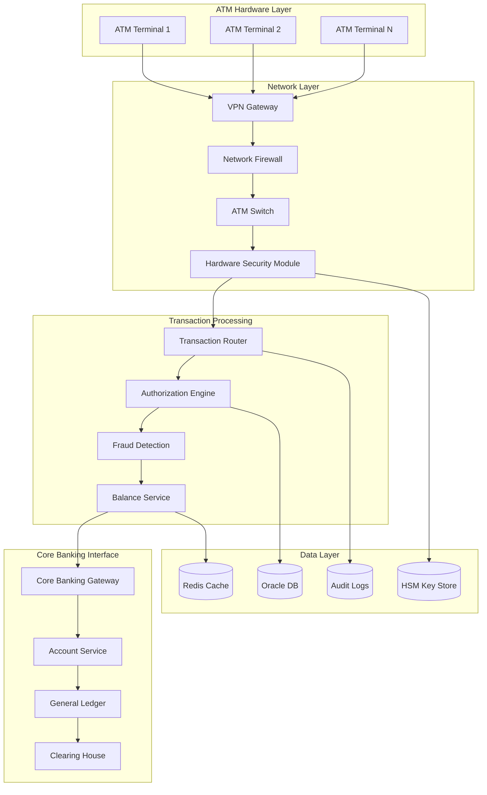

## Core Components

### 1. ATM Terminal Architecture

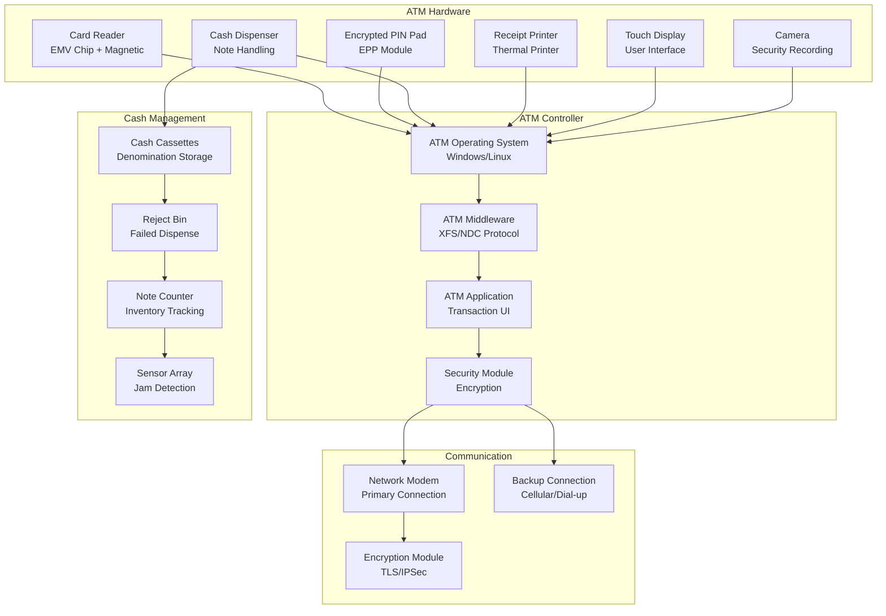

**ATM Hardware Features:**
- EMV chip and contactless card support
- Triple DES encrypted PIN pad (EPP)
- Multi-denomination cash dispensing
- Real-time cash inventory tracking
- Technologies: Windows 10 IoT, XFS standard, NDC/DDC protocols

### 2. Card Authentication System

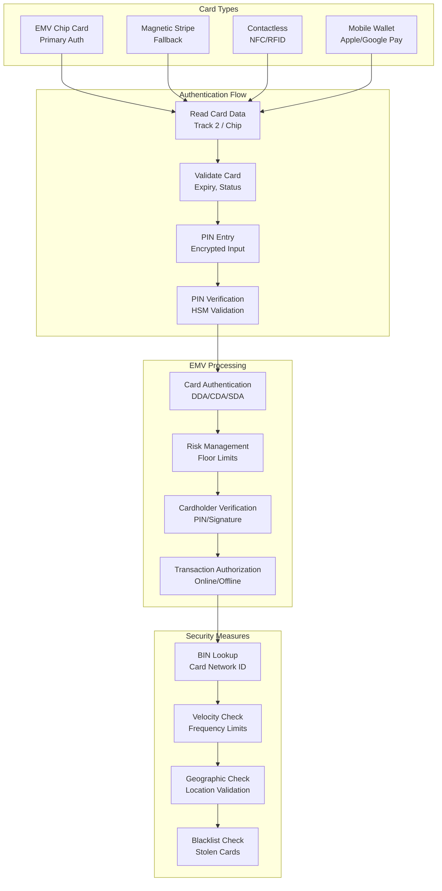

### 3. PIN Security Architecture

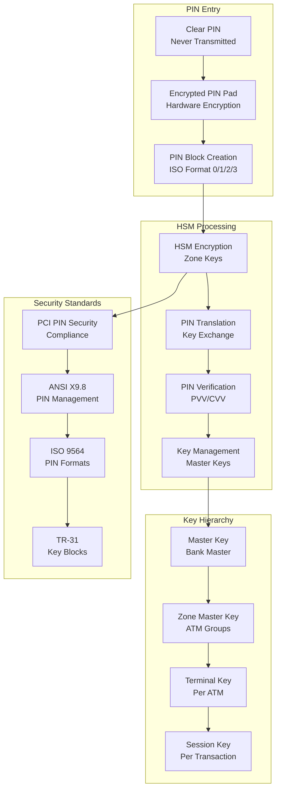

**PIN Security Features:**
- Hardware encryption in EPP
- Triple DES/AES encryption
- Secure key injection
- PIN translation for network routing
- No clear PIN transmission

### 4. Transaction Processing Engine

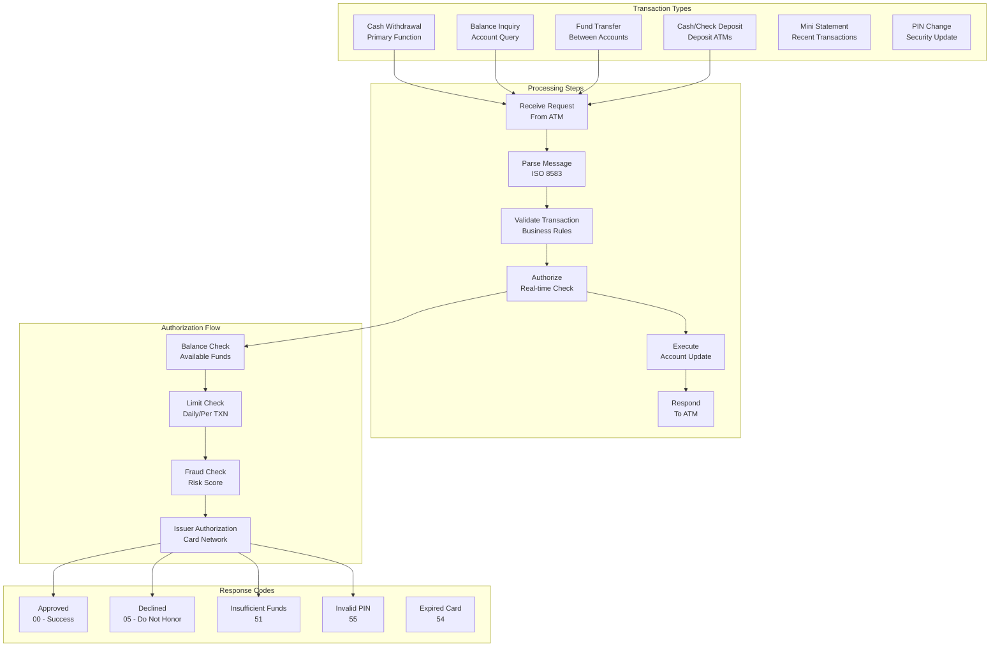

### 5. Cash Inventory Management

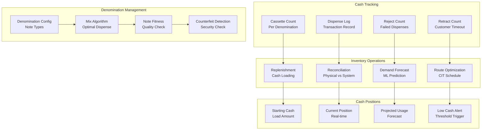

**Cash Management Features:**
- Real-time inventory tracking
- Predictive replenishment
- Denomination optimization
- Reconciliation automation
- CIT (Cash-in-Transit) scheduling

### 6. Fraud Detection System

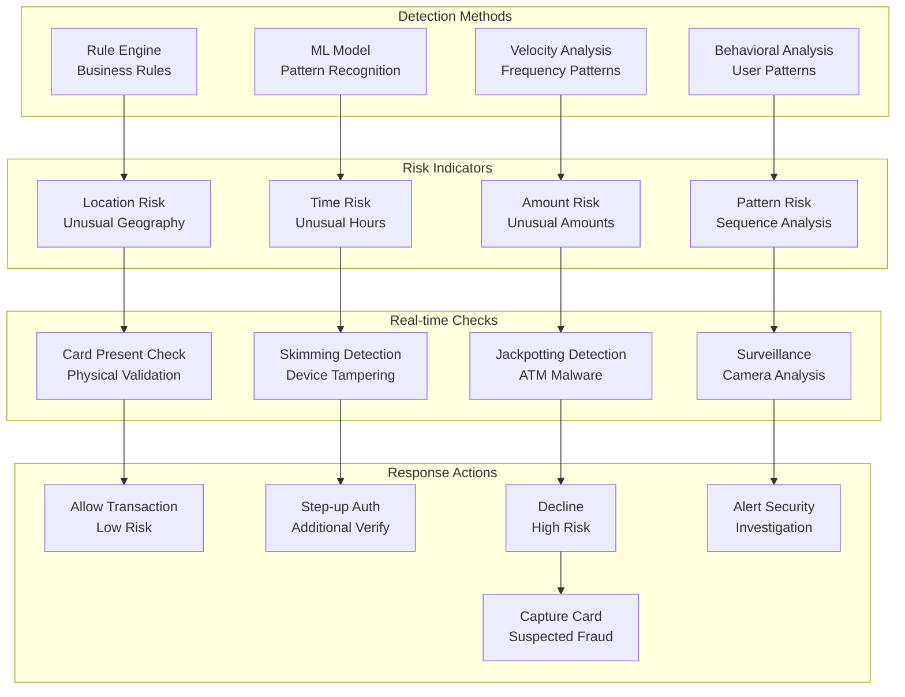

## ISO 8583 Message Processing

### 1. Message Format

```mermaid
graph TD
    subgraph "Message Structure"
        MTI[Message Type Indicator<br/>4 digits]
        BITMAP[Bitmap<br/>Primary + Secondary]
        DATA_ELEM[Data Elements<br/>Fields 1-128]
    end

    subgraph "Common MTIs"
        MTI_0100[0100<br/>Authorization Request]
        MTI_0110[0110<br/>Authorization Response]
        MTI_0200[0200<br/>Financial Request]
        MTI_0210[0210<br/>Financial Response]
        MTI_0400[0400<br/>Reversal Request]
        MTI_0420[0420<br/>Reversal Advice]
    end

    subgraph "Key Data Elements"
        DE2[DE2: PAN<br/>Card Number]
        DE3[DE3: Processing Code<br/>Transaction Type]
        DE4[DE4: Amount<br/>Transaction Amount]
        DE11[DE11: STAN<br/>Trace Number]
        DE22[DE22: POS Entry Mode<br/>How Card Read]
        DE35[DE35: Track 2 Data<br/>Card Data]
        DE52[DE52: PIN Data<br/>Encrypted PIN]
    end

    subgraph "Response Elements"
        DE38[DE38: Auth Code<br/>Approval Code]
        DE39[DE39: Response Code<br/>Result Code]
        DE54[DE54: Balances<br/>Account Balance]
    end

    MTI --> MTI_0100
    MTI --> MTI_0200
    MTI --> MTI_0400

    BITMAP --> DE2
    BITMAP --> DE3
    BITMAP --> DE4
    BITMAP --> DE11

    DATA_ELEM --> DE38
    DATA_ELEM --> DE39
    DATA_ELEM --> DE54
```

### 2. Transaction Flow

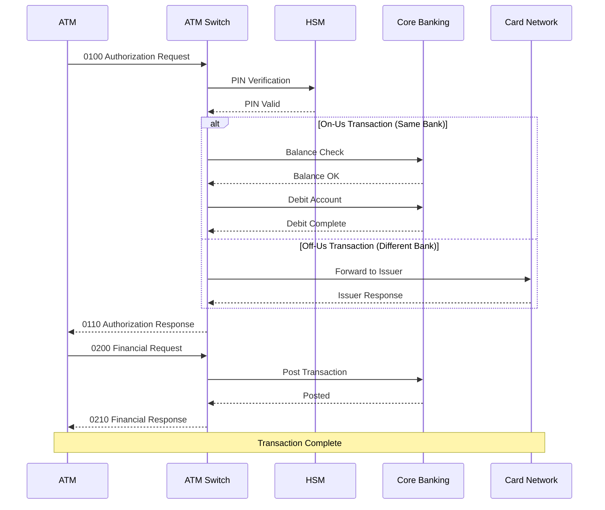

## Data Architecture

### 1. Oracle Database (Primary)

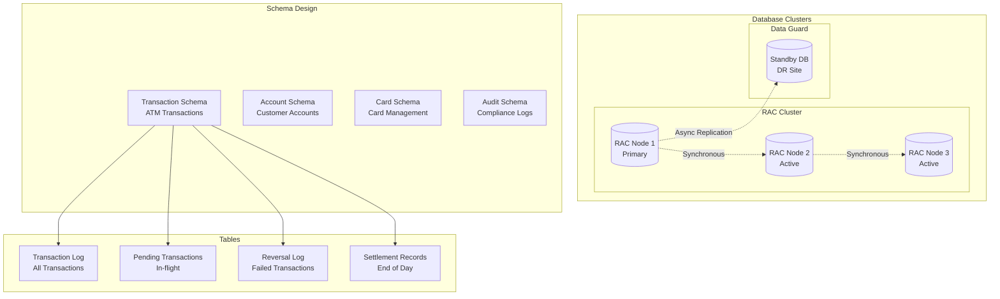

### 2. Redis Cache Layer

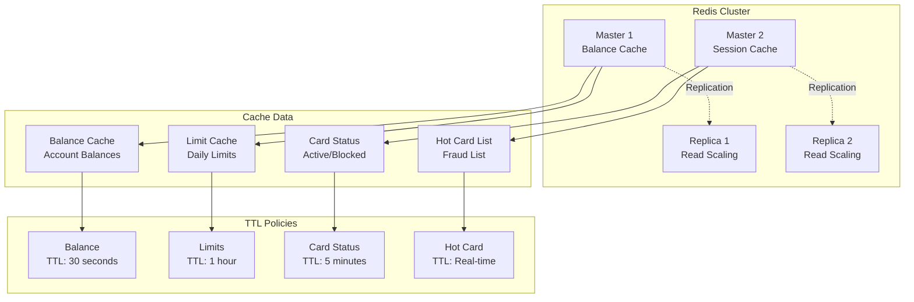

### 3. Audit Logging

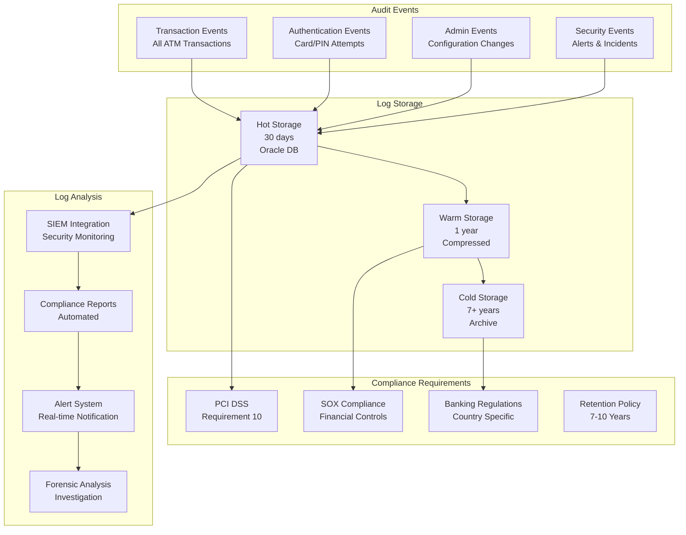

## Network Architecture

### 1. ATM Network Topology

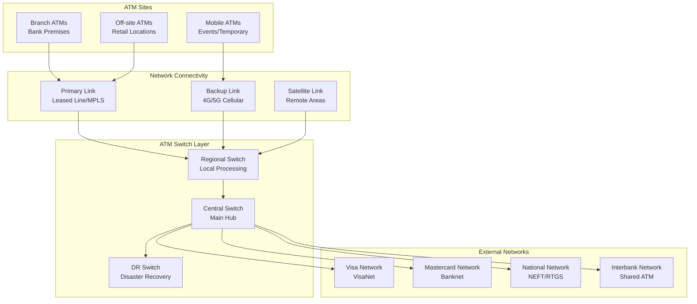

### 2. Security Architecture

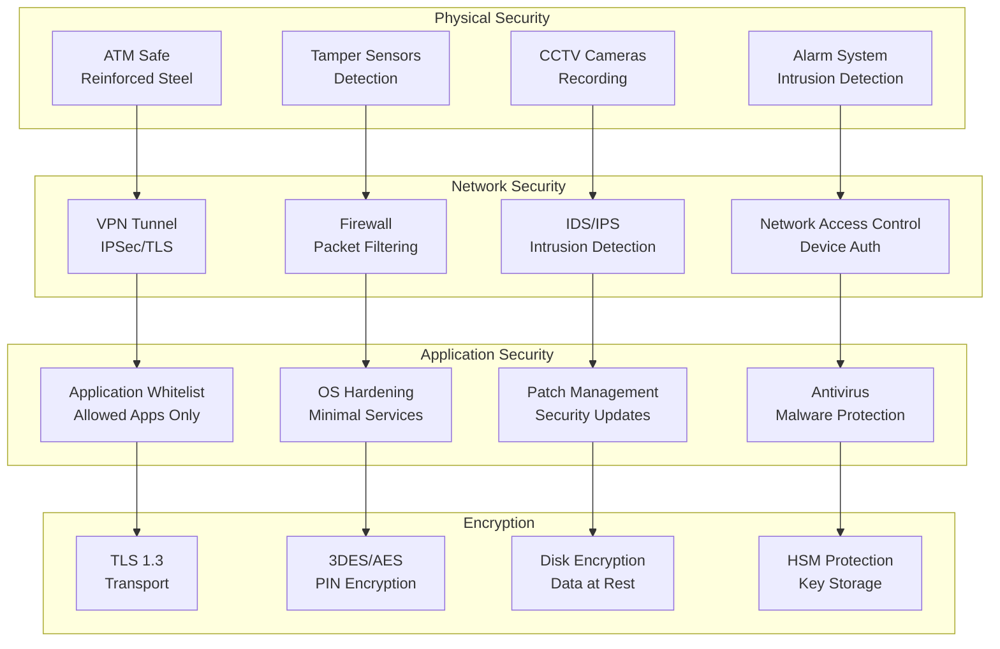

## High Availability & Disaster Recovery

### 1. HA Architecture

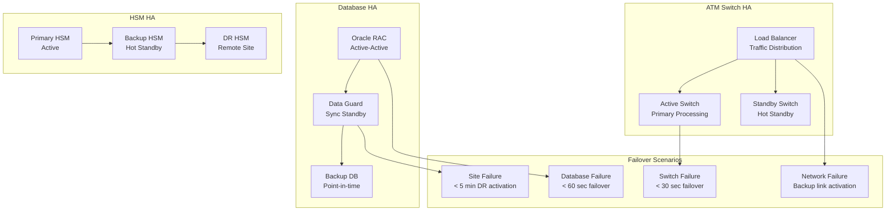

### 2. Disaster Recovery

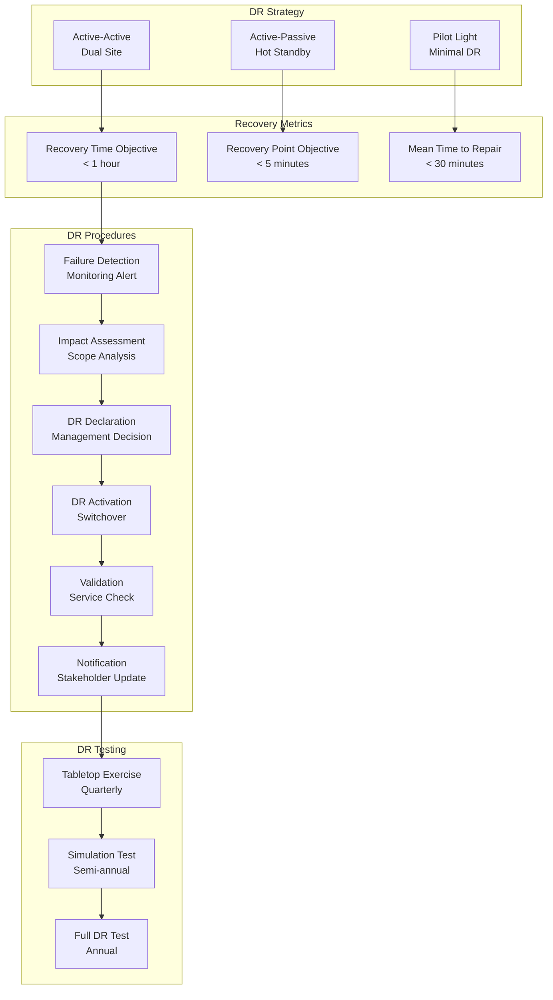

## Monitoring & Operations

### 1. Monitoring Dashboard

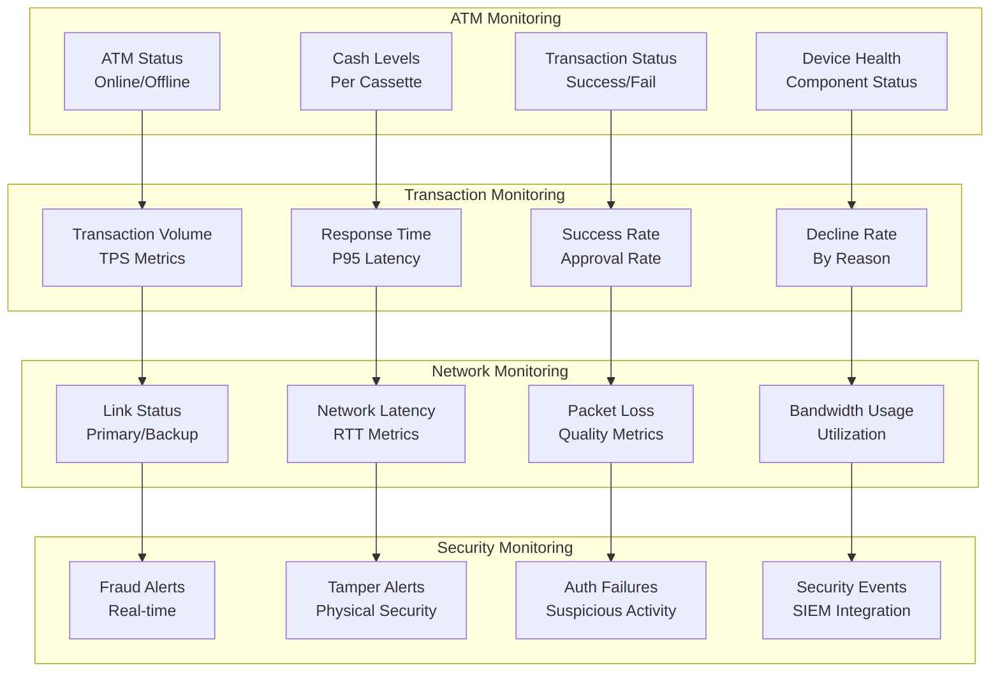

### 2. Key Performance Indicators

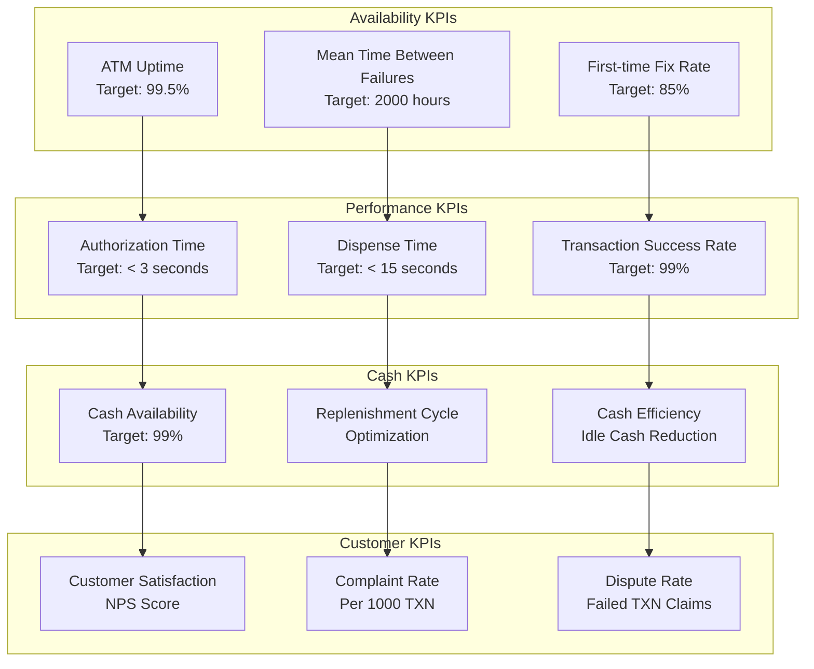

## Compliance & Regulatory

### 1. PCI DSS Compliance

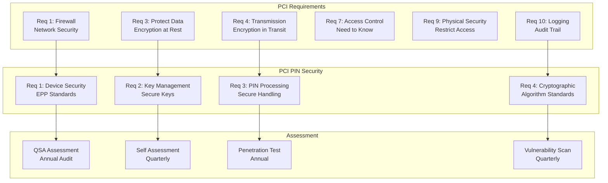

### 2. Settlement & Reconciliation

```mermaid
graph TD
    subgraph "Settlement Process"
        EOD[End of Day<br/>Cutoff Time]
        EXTRACT[Extract Transactions<br/>Daily File]
        NETTING[Netting<br/>Calculate Net Position]
        SETTLEMENT[Settlement<br/>Funds Transfer]
    end

    subgraph "Reconciliation"
        ATM_RECON[ATM Reconciliation<br/>Cash vs Transactions]
        SWITCH_RECON[Switch Reconciliation<br/>Messages Match]
        NETWORK_RECON[Network Reconciliation<br/>External Networks]
        ACCOUNT_RECON[Account Reconciliation<br/>Ledger Balance]
    end

    subgraph "Exception Handling"
        UNMATCHED[Unmatched Items<br/>Investigation]
        DISPUTES[Disputes<br/>Customer Claims]
        CHARGEBACKS[Chargebacks<br/>Network Rules]
        ADJUSTMENTS[Adjustments<br/>Manual Corrections]
    end

    subgraph "Reports"
        DAILY_REPORT[Daily Settlement<br/>Summary]
        EXCEPTION_REPORT[Exception Report<br/>Reconciliation]
        AUDIT_REPORT[Audit Report<br/>Compliance]
        MANAGEMENT_REPORT[Management Report<br/>KPIs]
    end

    EOD --> EXTRACT
    EXTRACT --> NETTING
    NETTING --> SETTLEMENT

    SETTLEMENT --> ATM_RECON
    ATM_RECON --> SWITCH_RECON
    SWITCH_RECON --> NETWORK_RECON
    NETWORK_RECON --> ACCOUNT_RECON

    ACCOUNT_RECON --> UNMATCHED
    UNMATCHED --> DISPUTES
    DISPUTES --> CHARGEBACKS
    CHARGEBACKS --> ADJUSTMENTS

    ADJUSTMENTS --> DAILY_REPORT
    DAILY_REPORT --> EXCEPTION_REPORT
    EXCEPTION_REPORT --> AUDIT_REPORT
    AUDIT_REPORT --> MANAGEMENT_REPORT
```

## Deployment and DevOps

### 1. Software Deployment Pipeline

```mermaid
gitGraph
    commit id: "Feature Dev"
    branch feature-branch
    checkout feature-branch
    commit id: "Code Changes"
    commit id: "Security Review"
    checkout main
    merge feature-branch
    commit id: "Integration Tests" type: HIGHLIGHT
    commit id: "Certification" type: HIGHLIGHT
    commit id: "Staged Rollout" type: REVERSE
```

```mermaid
flowchart LR
    subgraph "Development"
        CODE[Code Commit]
        SECURITY_REV[Security Review<br/>Code Analysis]
        BUILD[Build & Test]
    end

    subgraph "Certification"
        LAB_TEST[Lab Testing<br/>EMV Certification]
        VENDOR_CERT[Vendor Certification<br/>Hardware Compat]
        NETWORK_CERT[Network Certification<br/>Visa, Mastercard]
    end

    subgraph "Deployment"
        PILOT[Pilot Deployment<br/>Select ATMs]
        MONITOR[Monitor<br/>Error Rates, Success]
        ROLLOUT[Phased Rollout<br/>Region by Region]
    end

    subgraph "Rollback"
        ALERT[Alert Triggered]
        ROLLBACK[Rollback<br/>Previous Version]
        INVESTIGATE[Investigation<br/>Root Cause]
    end

    CODE --> SECURITY_REV
    SECURITY_REV --> BUILD
    BUILD --> LAB_TEST
    LAB_TEST --> VENDOR_CERT
    VENDOR_CERT --> NETWORK_CERT
    NETWORK_CERT --> PILOT
    PILOT --> MONITOR
    MONITOR --> ROLLOUT
    MONITOR --> ALERT
    ALERT --> ROLLBACK
```

- **EMV Certification**: Mandatory card network certification
- **Phased rollout**: Geographic region deployment
- **Fallback capability**: Maintain previous version
- **Remote update**: Secure OTA updates

### 2. Infrastructure as Code
- **Configuration management**: Centralized ATM configuration
- **Version control**: All configuration changes tracked
- **Change management**: ITIL-based change process

### 3. Resilience Testing

```mermaid
flowchart TD
    subgraph "Test Scenarios"
        NETWORK_FAIL[Network Failure<br/>Primary Link Down]
        HOST_FAIL[Host Failure<br/>Switch Unavailable]
        POWER_FAIL[Power Failure<br/>UPS Testing]
        SECURITY_TEST[Security Test<br/>Penetration Testing]
    end

    subgraph "Target Systems"
        ATM_TEST[ATM Software]
        SWITCH_TEST[ATM Switch]
        HSM_TEST[HSM Systems]
        NETWORK_TEST[Network Links]
    end

    subgraph "Validation"
        FAILOVER_VAL[Failover Validation<br/>< 30 seconds]
        RECOVERY_VAL[Recovery Validation<br/>Data Integrity]
        TXN_VAL[Transaction Validation<br/>No Loss]
    end

    NETWORK_FAIL --> ATM_TEST
    HOST_FAIL --> SWITCH_TEST
    POWER_FAIL --> HSM_TEST
    SECURITY_TEST --> NETWORK_TEST

    ATM_TEST --> FAILOVER_VAL
    SWITCH_TEST --> RECOVERY_VAL
    HSM_TEST --> TXN_VAL
```

## Cost Optimization

### 1. Infrastructure Cost Distribution

```mermaid
pie title ATM Network Cost Distribution
    "ATM Hardware & Maintenance" : 35
    "Network & Connectivity" : 20
    "Cash Management & CIT" : 20
    "Software Licensing" : 10
    "Security & Compliance" : 10
    "Operations & Support" : 5
```

### 2. Cost Optimization Strategies

```mermaid
graph TD
    subgraph "Hardware Optimization"
        LIFECYCLE[Lifecycle Management<br/>7-10 Year Refresh]
        MULTI_VENDOR[Multi-vendor<br/>Price Competition]
        REFURBISH[Refurbishment<br/>Extend Life]
        RECYCLERS[Cash Recyclers<br/>Reduce CIT]
    end

    subgraph "Cash Optimization"
        FORECAST[Cash Forecasting<br/>ML Prediction]
        DYNAMIC_LOAD[Dynamic Loading<br/>Demand-based]
        DENOMINATION[Denomination Mix<br/>Optimize Notes]
        FLOAT_REDUCE[Float Reduction<br/>Working Capital]
    end

    subgraph "Operations Optimization"
        REMOTE_MGMT[Remote Management<br/>Reduce Visits]
        PREDICTIVE[Predictive Maintenance<br/>Reduce Downtime]
        SELF_HEALING[Self-healing<br/>Auto Recovery]
        SHARED_SERVICES[Shared Services<br/>Multi-bank ATMs]
    end

    subgraph "Network Optimization"
        COMPRESSION_ATM[Message Compression<br/>Bandwidth Savings]
        FAILOVER_OPT[Failover Optimization<br/>Cost-effective Backup]
        CLOUD_HYBRID[Cloud Hybrid<br/>Variable Capacity]
    end

    LIFECYCLE --> FORECAST
    MULTI_VENDOR --> DYNAMIC_LOAD
    REFURBISH --> DENOMINATION
    RECYCLERS --> FLOAT_REDUCE

    FORECAST --> REMOTE_MGMT
    DYNAMIC_LOAD --> PREDICTIVE
    DENOMINATION --> SELF_HEALING
    FLOAT_REDUCE --> SHARED_SERVICES

    REMOTE_MGMT --> COMPRESSION_ATM
    PREDICTIVE --> FAILOVER_OPT
    SELF_HEALING --> CLOUD_HYBRID
```

## Future Architecture Considerations

### 1. Emerging Technologies

```mermaid
graph TD
    subgraph "Cardless & Digital"
        MOBILE_FIRST[Mobile-First<br/>App-based Banking]
        QR_WITHDRAW[QR Withdrawal<br/>No Card Required]
        DIGITAL_WALLET[Digital Wallet<br/>Apple/Google Pay]
        CBDC[CBDC Support<br/>Digital Currency]
    end

    subgraph "Biometric Evolution"
        PALM_VEIN[Palm Vein<br/>Contactless Biometric]
        FACE_RECOG[Face Recognition<br/>Video Analytics]
        VOICE_AUTH[Voice Authentication<br/>Natural Language]
        MULTI_MODAL[Multi-modal<br/>Combined Biometrics]
    end

    subgraph "AI & Analytics"
        PREDICTIVE_CASH[Predictive Cash<br/>ML Forecasting]
        ANOMALY_ML[Anomaly Detection<br/>Real-time ML]
        CUSTOMER_AI[Customer Analytics<br/>Personalization]
        CHATBOT[AI Chatbot<br/>On-screen Assistance]
    end

    subgraph "Infrastructure Evolution"
        CLOUD_NATIVE[Cloud-native<br/>ATM as a Service]
        EDGE_COMPUTE[Edge Computing<br/>Local Processing]
        API_BANKING[Open Banking<br/>API Integration]
        BLOCKCHAIN_AUDIT[Blockchain<br/>Immutable Audit]
    end

    MOBILE_FIRST --> PALM_VEIN
    QR_WITHDRAW --> FACE_RECOG
    DIGITAL_WALLET --> VOICE_AUTH
    CBDC --> MULTI_MODAL

    PALM_VEIN --> PREDICTIVE_CASH
    FACE_RECOG --> ANOMALY_ML
    VOICE_AUTH --> CUSTOMER_AI
    MULTI_MODAL --> CHATBOT

    PREDICTIVE_CASH --> CLOUD_NATIVE
    ANOMALY_ML --> EDGE_COMPUTE
    CUSTOMER_AI --> API_BANKING
    CHATBOT --> BLOCKCHAIN_AUDIT
```

## Modern ATM Innovations

### 1. Next-Gen ATM Features

```mermaid
graph TD
    subgraph "Cardless ATM"
        QR_CODE[QR Code<br/>Mobile App Scan]
        NFC[NFC Tap<br/>Contactless]
        BIOMETRIC[Biometric Auth<br/>Fingerprint/Face]
        OTP[OTP Withdrawal<br/>One-time Password]
    end

    subgraph "Enhanced Services"
        VIDEO_TELLER[Video Teller<br/>Remote Assistance]
        COIN_DISPENSE[Coin Dispensing<br/>Exact Change]
        MULTI_CURRENCY[Multi-Currency<br/>Foreign Exchange]
        BILL_PAY[Bill Payment<br/>Utility Services]
    end

    subgraph "Smart ATM"
        RECYCLER[Cash Recycling<br/>Accept & Dispense]
        AI_ANALYTICS[AI Analytics<br/>Predictive Maintenance]
        DYNAMIC_PRICING[Dynamic Pricing<br/>Fee Optimization]
        PERSONALIZATION[Personalization<br/>User Preferences]
    end

    subgraph "Security Innovations"
        BEHAVIORAL[Behavioral Biometrics<br/>Continuous Auth]
        JITTER[Anti-Skimming<br/>Card Jittering]
        AI_FRAUD[AI Fraud Detection<br/>Real-time ML]
        ZERO_TRUST[Zero Trust<br/>Verify Everything]
    end

    QR_CODE --> VIDEO_TELLER
    NFC --> COIN_DISPENSE
    BIOMETRIC --> MULTI_CURRENCY
    OTP --> BILL_PAY

    VIDEO_TELLER --> RECYCLER
    COIN_DISPENSE --> AI_ANALYTICS
    MULTI_CURRENCY --> DYNAMIC_PRICING
    BILL_PAY --> PERSONALIZATION

    RECYCLER --> BEHAVIORAL
    AI_ANALYTICS --> JITTER
    DYNAMIC_PRICING --> AI_FRAUD
    PERSONALIZATION --> ZERO_TRUST
```

## Conclusion

ATM system architecture represents a critical infrastructure for banking operations, requiring exceptional reliability, security, and compliance. The system successfully manages:

- **Transaction Processing**: Millions of daily transactions with sub-3-second authorization
- **Security**: Multi-layer encryption and fraud detection
- **Availability**: 99.5%+ uptime with automatic failover
- **Compliance**: PCI DSS, PCI PIN, and banking regulations
- **Cash Management**: Efficient inventory and replenishment

### Key Architectural Principles:

1. **Security First**
   - HSM-protected cryptographic operations
   - End-to-end encryption
   - Multi-factor authentication
   - Real-time fraud detection

2. **High Availability**
   - Active-active switch clusters
   - Oracle RAC for database
   - Multiple network paths
   - Automatic failover

3. **Regulatory Compliance**
   - PCI DSS certification
   - PCI PIN security
   - Comprehensive audit logging
   - Settlement and reconciliation

4. **Operational Excellence**
   - Real-time monitoring
   - Predictive cash management
   - Automated reconciliation
   - 24/7 support operations

5. **Modern Innovation**
   - Cardless transactions
   - Biometric authentication
   - Cash recycling technology
   - AI-powered analytics

The architecture continues to evolve with contactless technology, biometric authentication, and AI-powered fraud detection, while maintaining the foundational principles of security and reliability.

> This architecture represents typical ATM network systems and industry best practices. Actual implementations may vary by institution.
