## High-Level Architecture

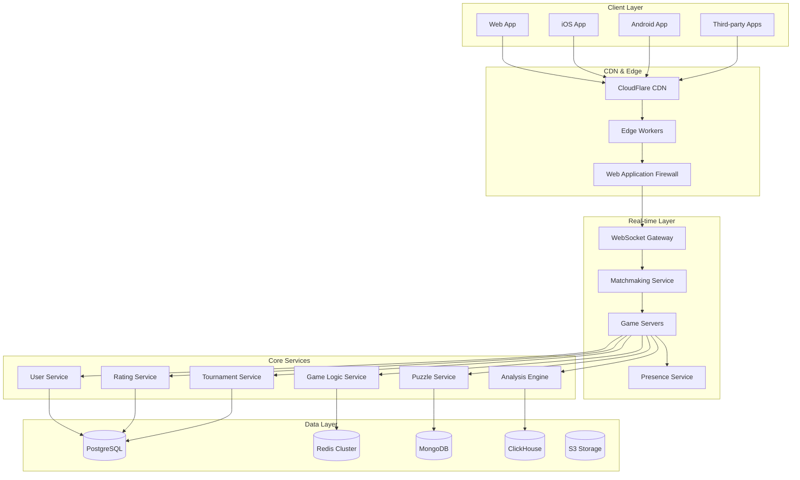
```mermaid
graph TB
    subgraph "Client Layer"
        WEB[Web App]
        IOS[iOS App]
        ANDROID[Android App]
        API_CLIENTS[Third-party Apps]
    end

    subgraph "CDN & Edge"
        CLOUDFLARE[CloudFlare CDN]
        EDGE_COMPUTE[Edge Workers]
        WAF[Web Application Firewall]
    end

    subgraph "Real-time Layer"
        WEBSOCKET[WebSocket Gateway]
        MATCHMAKING[Matchmaking Service]
        GAME_SERVER[Game Servers]
        PRESENCE[Presence Service]
    end

    subgraph "Core Services"
        USER[User Service]
        GAME_LOGIC[Game Logic Service]
        RATING[Rating Service]
        PUZZLE[Puzzle Service]
        ANALYSIS[Analysis Engine]
        TOURNAMENT[Tournament Service]
    end

    subgraph "Data Layer"
        POSTGRES[(PostgreSQL)]
        REDIS[(Redis Cluster)]
        MONGODB[(MongoDB)]
        CLICKHOUSE[(ClickHouse)]
        S3[(S3 Storage)]
    end

    WEB --> CLOUDFLARE
    IOS --> CLOUDFLARE
    ANDROID --> CLOUDFLARE
    API_CLIENTS --> CLOUDFLARE

    CLOUDFLARE --> EDGE_COMPUTE
    EDGE_COMPUTE --> WAF
    WAF --> WEBSOCKET

    WEBSOCKET --> MATCHMAKING
    MATCHMAKING --> GAME_SERVER
    GAME_SERVER --> PRESENCE

    GAME_SERVER --> USER
    GAME_SERVER --> GAME_LOGIC
    GAME_SERVER --> RATING
    GAME_SERVER --> PUZZLE
    GAME_SERVER --> ANALYSIS
    GAME_SERVER --> TOURNAMENT

    USER --> POSTGRES
    GAME_LOGIC --> REDIS
    RATING --> POSTGRES
    PUZZLE --> MONGODB
    ANALYSIS --> CLICKHOUSE
    TOURNAMENT --> POSTGRES
```

## Core Components

### 1. Real-time Game Engine

```mermaid
graph TD
    subgraph "Game Connection"
        CONNECT[Player Connection<br/>WebSocket Handshake]
        AUTH_WS[Authentication<br/>Token Validation]
        SESSION[Session Management<br/>Connection Pool]
        HEARTBEAT[Heartbeat<br/>Keep-alive]
    end

    subgraph "Game State Machine"
        WAITING[Waiting<br/>Player Queue]
        PLAYING[Playing<br/>Active Game]
        PAUSED[Paused<br/>Disconnection]
        FINISHED[Finished<br/>Game Complete]
        ABORTED[Aborted<br/>Abandoned]
    end

    subgraph "Move Processing"
        RECEIVE[Receive Move<br/>Client Input]
        VALIDATE[Validate Move<br/>Legal Check]
        APPLY[Apply Move<br/>State Update]
        BROADCAST[Broadcast<br/>Opponent Sync]
        PERSIST[Persist Move<br/>Game History]
    end

    subgraph "Time Management"
        CLOCK[Game Clock<br/>Per Player]
        INCREMENT[Time Increment<br/>Per Move Bonus]
        FLAG[Time Flag<br/>Timeout Detection]
        SYNC[Clock Sync<br/>Latency Compensation]
    end

    CONNECT --> AUTH_WS
    AUTH_WS --> SESSION
    SESSION --> HEARTBEAT

    WAITING --> PLAYING
    PLAYING --> PAUSED
    PAUSED --> PLAYING
    PLAYING --> FINISHED
    PLAYING --> ABORTED

    RECEIVE --> VALIDATE
    VALIDATE --> APPLY
    APPLY --> BROADCAST
    BROADCAST --> PERSIST

    CLOCK --> INCREMENT
    INCREMENT --> FLAG
    FLAG --> SYNC
```

**Key Features:**
- Sub-100ms move latency globally
- Support for 1M+ concurrent games
- Automatic reconnection handling
- Clock synchronization with latency compensation
- Technologies: Golang, WebSocket, Redis Pub/Sub

### 2. WebSocket Gateway

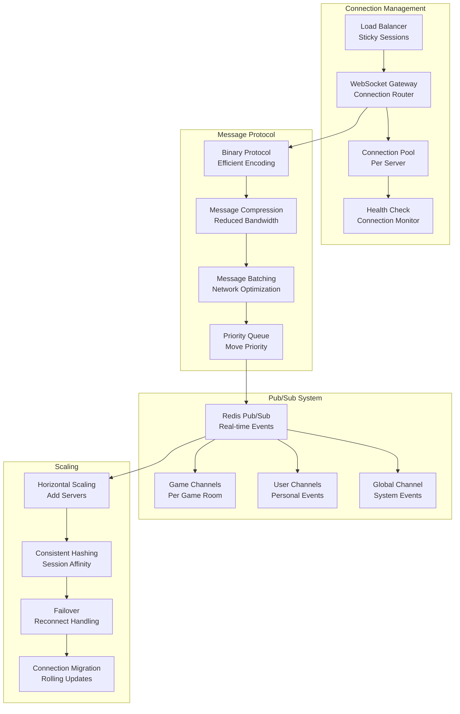
```mermaid
graph TD
    subgraph "Connection Management"
        LB[Load Balancer<br/>Sticky Sessions]
        GATEWAY[WebSocket Gateway<br/>Connection Router]
        POOL[Connection Pool<br/>Per Server]
        HEALTH[Health Check<br/>Connection Monitor]
    end

    subgraph "Message Protocol"
        BINARY[Binary Protocol<br/>Efficient Encoding]
        COMPRESS[Message Compression<br/>Reduced Bandwidth]
        BATCH[Message Batching<br/>Network Optimization]
        PRIORITY[Priority Queue<br/>Move Priority]
    end

    subgraph "Pub/Sub System"
        REDIS_PUBSUB[Redis Pub/Sub<br/>Real-time Events]
        GAME_CHANNEL[Game Channels<br/>Per Game Room]
        USER_CHANNEL[User Channels<br/>Personal Events]
        GLOBAL_CHANNEL[Global Channel<br/>System Events]
    end

    subgraph "Scaling"
        HORIZONTAL[Horizontal Scaling<br/>Add Servers]
        CONSISTENT_HASH[Consistent Hashing<br/>Session Affinity]
        FAILOVER[Failover<br/>Reconnect Handling]
        MIGRATION[Connection Migration<br/>Rolling Updates]
    end

    LB --> GATEWAY
    GATEWAY --> POOL
    POOL --> HEALTH

    GATEWAY --> BINARY
    BINARY --> COMPRESS
    COMPRESS --> BATCH
    BATCH --> PRIORITY

    PRIORITY --> REDIS_PUBSUB
    REDIS_PUBSUB --> GAME_CHANNEL
    REDIS_PUBSUB --> USER_CHANNEL
    REDIS_PUBSUB --> GLOBAL_CHANNEL

    REDIS_PUBSUB --> HORIZONTAL
    HORIZONTAL --> CONSISTENT_HASH
    CONSISTENT_HASH --> FAILOVER
    FAILOVER --> MIGRATION
```

**WebSocket Features:**
- Sticky sessions for connection persistence
- Binary protocol for efficiency
- Redis Pub/Sub for cross-server communication
- Automatic failover and reconnection

### 3. Matchmaking System

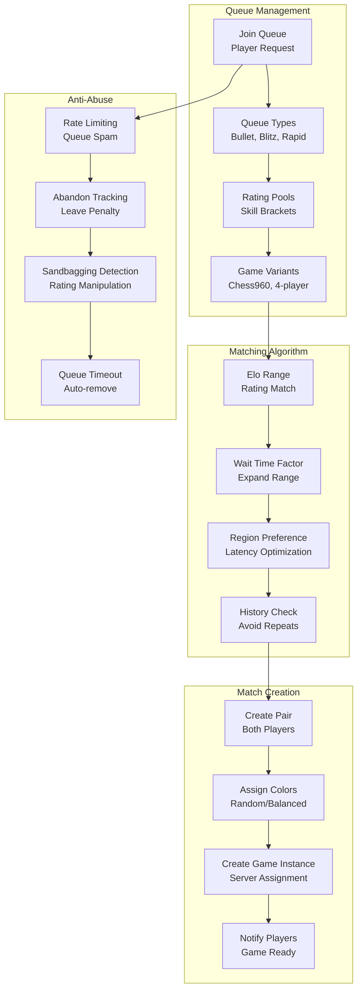
```mermaid
graph TD
    subgraph "Queue Management"
        JOIN_QUEUE[Join Queue<br/>Player Request]
        QUEUE_TYPE[Queue Types<br/>Bullet, Blitz, Rapid]
        RATING_POOL[Rating Pools<br/>Skill Brackets]
        VARIANT[Game Variants<br/>Chess960, 4-player]
    end

    subgraph "Matching Algorithm"
        ELO_RANGE[Elo Range<br/>Rating Match]
        WAIT_TIME[Wait Time Factor<br/>Expand Range]
        REGION[Region Preference<br/>Latency Optimization]
        HISTORY[History Check<br/>Avoid Repeats]
    end

    subgraph "Match Creation"
        PAIR[Create Pair<br/>Both Players]
        ASSIGN_COLOR[Assign Colors<br/>Random/Balanced]
        CREATE_GAME[Create Game Instance<br/>Server Assignment]
        NOTIFY[Notify Players<br/>Game Ready]
    end

    subgraph "Anti-Abuse"
        RATE_LIMIT[Rate Limiting<br/>Queue Spam]
        ABANDON_TRACK[Abandon Tracking<br/>Leave Penalty]
        SANDBAG[Sandbagging Detection<br/>Rating Manipulation]
        TIMEOUT[Queue Timeout<br/>Auto-remove]
    end

    JOIN_QUEUE --> QUEUE_TYPE
    QUEUE_TYPE --> RATING_POOL
    RATING_POOL --> VARIANT

    VARIANT --> ELO_RANGE
    ELO_RANGE --> WAIT_TIME
    WAIT_TIME --> REGION
    REGION --> HISTORY

    HISTORY --> PAIR
    PAIR --> ASSIGN_COLOR
    ASSIGN_COLOR --> CREATE_GAME
    CREATE_GAME --> NOTIFY

    JOIN_QUEUE --> RATE_LIMIT
    RATE_LIMIT --> ABANDON_TRACK
    ABANDON_TRACK --> SANDBAG
    SANDBAG --> TIMEOUT
```

**Matchmaking Features:**
- Rating-based matching (Glicko-2)
- Dynamic range expansion based on wait time
- Region-aware for latency optimization
- Anti-abuse and fair play measures

### 4. Rating System (Glicko-2)

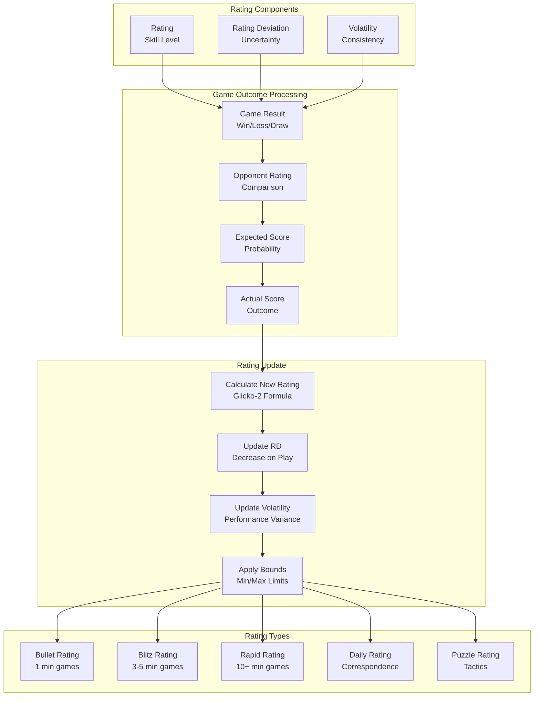
```mermaid
graph TD
    subgraph "Rating Components"
        RATING[Rating<br/>Skill Level]
        RD[Rating Deviation<br/>Uncertainty]
        VOLATILITY[Volatility<br/>Consistency]
    end

    subgraph "Game Outcome Processing"
        RESULT[Game Result<br/>Win/Loss/Draw]
        OPPONENT_RATING[Opponent Rating<br/>Comparison]
        EXPECTED[Expected Score<br/>Probability]
        ACTUAL[Actual Score<br/>Outcome]
    end

    subgraph "Rating Update"
        CALCULATE[Calculate New Rating<br/>Glicko-2 Formula]
        UPDATE_RD[Update RD<br/>Decrease on Play]
        UPDATE_VOL[Update Volatility<br/>Performance Variance]
        APPLY_BOUNDS[Apply Bounds<br/>Min/Max Limits]
    end

    subgraph "Rating Types"
        BULLET[Bullet Rating<br/>1 min games]
        BLITZ[Blitz Rating<br/>3-5 min games]
        RAPID[Rapid Rating<br/>10+ min games]
        DAILY[Daily Rating<br/>Correspondence]
        PUZZLE[Puzzle Rating<br/>Tactics]
    end

    RATING --> RESULT
    RD --> RESULT
    VOLATILITY --> RESULT

    RESULT --> OPPONENT_RATING
    OPPONENT_RATING --> EXPECTED
    EXPECTED --> ACTUAL

    ACTUAL --> CALCULATE
    CALCULATE --> UPDATE_RD
    UPDATE_RD --> UPDATE_VOL
    UPDATE_VOL --> APPLY_BOUNDS

    APPLY_BOUNDS --> BULLET
    APPLY_BOUNDS --> BLITZ
    APPLY_BOUNDS --> RAPID
    APPLY_BOUNDS --> DAILY
    APPLY_BOUNDS --> PUZZLE
```

**Glicko-2 Algorithm:**
- More accurate than traditional Elo
- Rating deviation decreases with more games
- Volatility tracks performance consistency
- Separate ratings per time control

### 5. Game Analysis Engine

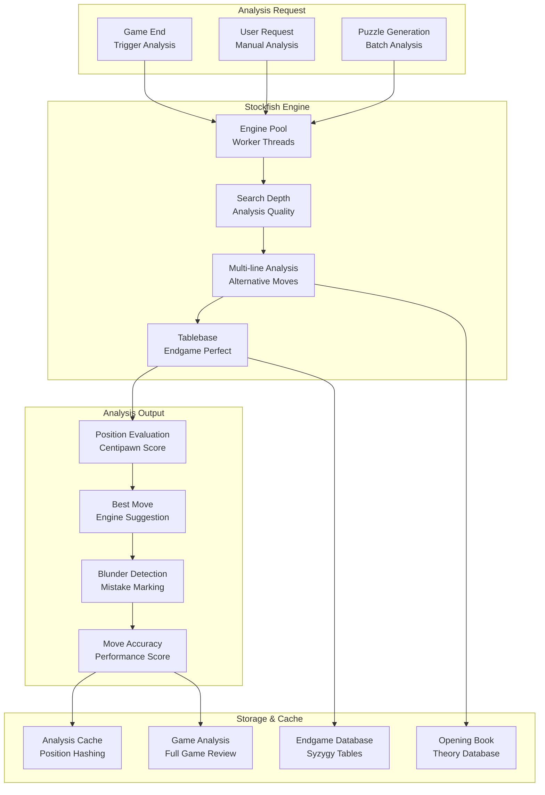
```mermaid
graph TD
    subgraph "Analysis Request"
        GAME_END[Game End<br/>Trigger Analysis]
        USER_REQUEST[User Request<br/>Manual Analysis]
        PUZZLE_GEN[Puzzle Generation<br/>Batch Analysis]
    end

    subgraph "Stockfish Engine"
        ENGINE_POOL[Engine Pool<br/>Worker Threads]
        DEPTH[Search Depth<br/>Analysis Quality]
        MULTILINE[Multi-line Analysis<br/>Alternative Moves]
        TABLEBASE[Tablebase<br/>Endgame Perfect]
    end

    subgraph "Analysis Output"
        EVAL[Position Evaluation<br/>Centipawn Score]
        BEST_MOVE[Best Move<br/>Engine Suggestion]
        BLUNDER[Blunder Detection<br/>Mistake Marking]
        ACCURACY[Move Accuracy<br/>Performance Score]
    end

    subgraph "Storage & Cache"
        ANALYSIS_CACHE[Analysis Cache<br/>Position Hashing]
        GAME_ANALYSIS[Game Analysis<br/>Full Game Review]
        OPENING_BOOK[Opening Book<br/>Theory Database]
        ENDGAME_DB[Endgame Database<br/>Syzygy Tables]
    end

    GAME_END --> ENGINE_POOL
    USER_REQUEST --> ENGINE_POOL
    PUZZLE_GEN --> ENGINE_POOL

    ENGINE_POOL --> DEPTH
    DEPTH --> MULTILINE
    MULTILINE --> TABLEBASE

    TABLEBASE --> EVAL
    EVAL --> BEST_MOVE
    BEST_MOVE --> BLUNDER
    BLUNDER --> ACCURACY

    ACCURACY --> ANALYSIS_CACHE
    ACCURACY --> GAME_ANALYSIS
    MULTILINE --> OPENING_BOOK
    TABLEBASE --> ENDGAME_DB
```

**Analysis Features:**
- Stockfish 16 integration
- Cloud-based analysis for premium
- Move accuracy calculation
- Blunder and mistake detection
- Opening and endgame databases

### 6. Tournament System

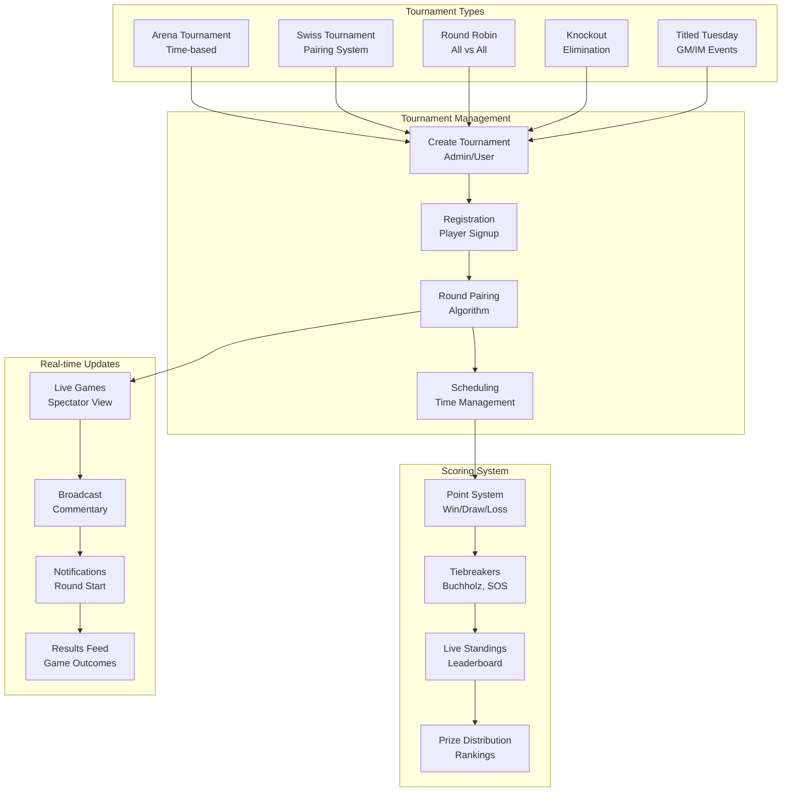
```mermaid
graph TD
    subgraph "Tournament Types"
        ARENA[Arena Tournament<br/>Time-based]
        SWISS[Swiss Tournament<br/>Pairing System]
        ROUND_ROBIN[Round Robin<br/>All vs All]
        KNOCKOUT[Knockout<br/>Elimination]
        TITLED[Titled Tuesday<br/>GM/IM Events]
    end

    subgraph "Tournament Management"
        CREATE[Create Tournament<br/>Admin/User]
        REGISTER[Registration<br/>Player Signup]
        PAIR_ROUND[Round Pairing<br/>Algorithm]
        SCHEDULE[Scheduling<br/>Time Management]
    end

    subgraph "Scoring System"
        POINTS[Point System<br/>Win/Draw/Loss]
        TIEBREAK[Tiebreakers<br/>Buchholz, SOS]
        STANDINGS[Live Standings<br/>Leaderboard]
        PRIZES[Prize Distribution<br/>Rankings]
    end

    subgraph "Real-time Updates"
        LIVE_GAMES[Live Games<br/>Spectator View]
        BROADCAST[Broadcast<br/>Commentary]
        NOTIFICATIONS[Notifications<br/>Round Start]
        RESULTS[Results Feed<br/>Game Outcomes]
    end

    ARENA --> CREATE
    SWISS --> CREATE
    ROUND_ROBIN --> CREATE
    KNOCKOUT --> CREATE
    TITLED --> CREATE

    CREATE --> REGISTER
    REGISTER --> PAIR_ROUND
    PAIR_ROUND --> SCHEDULE

    SCHEDULE --> POINTS
    POINTS --> TIEBREAK
    TIEBREAK --> STANDINGS
    STANDINGS --> PRIZES

    PAIR_ROUND --> LIVE_GAMES
    LIVE_GAMES --> BROADCAST
    BROADCAST --> NOTIFICATIONS
    NOTIFICATIONS --> RESULTS
```

**Tournament Features:**
- Multiple tournament formats
- Automated pairing algorithms
- Live standings and tiebreakers
- Prize pool management
- Spectator mode with commentary

## Data Architecture

### 1. PostgreSQL (Primary Database)

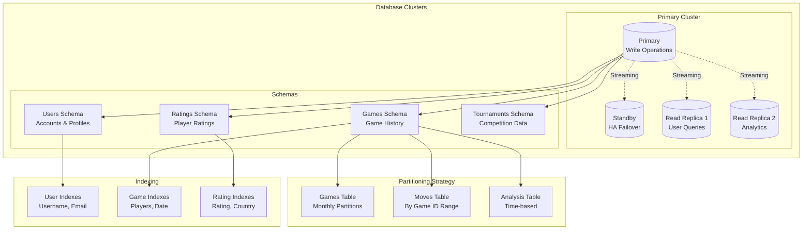
```mermaid
graph TD
    subgraph "Database Clusters"
        subgraph "Primary Cluster"
            PRIMARY[(Primary<br/>Write Operations)]
            STANDBY[(Standby<br/>HA Failover)]
            READ1[(Read Replica 1<br/>User Queries)]
            READ2[(Read Replica 2<br/>Analytics)]
        end

        subgraph "Schemas"
            USERS_SCHEMA[Users Schema<br/>Accounts & Profiles]
            GAMES_SCHEMA[Games Schema<br/>Game History]
            RATINGS_SCHEMA[Ratings Schema<br/>Player Ratings]
            TOURNAMENTS_SCHEMA[Tournaments Schema<br/>Competition Data]
        end
    end

    subgraph "Partitioning Strategy"
        GAMES_PART[Games Table<br/>Monthly Partitions]
        MOVES_PART[Moves Table<br/>By Game ID Range]
        ANALYSIS_PART[Analysis Table<br/>Time-based]
    end

    subgraph "Indexing"
        USER_IDX[User Indexes<br/>Username, Email]
        GAME_IDX[Game Indexes<br/>Players, Date]
        RATING_IDX[Rating Indexes<br/>Rating, Country]
    end

    PRIMARY -.->|Streaming| STANDBY
    PRIMARY -.->|Streaming| READ1
    PRIMARY -.->|Streaming| READ2

    PRIMARY --> USERS_SCHEMA
    PRIMARY --> GAMES_SCHEMA
    PRIMARY --> RATINGS_SCHEMA
    PRIMARY --> TOURNAMENTS_SCHEMA

    GAMES_SCHEMA --> GAMES_PART
    GAMES_SCHEMA --> MOVES_PART
    GAMES_SCHEMA --> ANALYSIS_PART

    USERS_SCHEMA --> USER_IDX
    GAMES_SCHEMA --> GAME_IDX
    RATINGS_SCHEMA --> RATING_IDX
```

### 2. Redis (Real-time State)

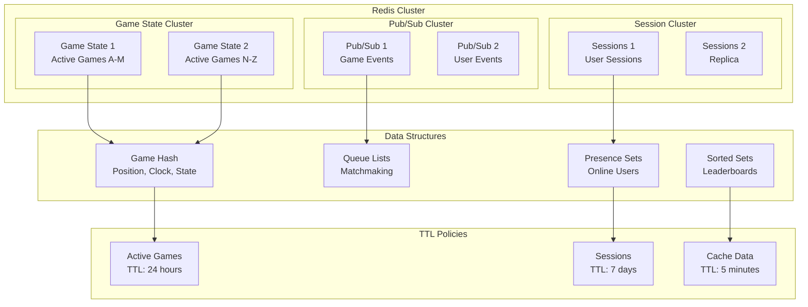
```mermaid
graph TD
    subgraph "Redis Cluster"
        subgraph "Game State Cluster"
            GAME1[Game State 1<br/>Active Games A-M]
            GAME2[Game State 2<br/>Active Games N-Z]
        end

        subgraph "Session Cluster"
            SESSION1[Sessions 1<br/>User Sessions]
            SESSION2[Sessions 2<br/>Replica]
        end

        subgraph "Pub/Sub Cluster"
            PUBSUB1[Pub/Sub 1<br/>Game Events]
            PUBSUB2[Pub/Sub 2<br/>User Events]
        end
    end

    subgraph "Data Structures"
        GAME_HASH[Game Hash<br/>Position, Clock, State]
        QUEUE_LIST[Queue Lists<br/>Matchmaking]
        PRESENCE_SET[Presence Sets<br/>Online Users]
        LEADERBOARD[Sorted Sets<br/>Leaderboards]
    end

    subgraph "TTL Policies"
        GAME_TTL[Active Games<br/>TTL: 24 hours]
        SESSION_TTL[Sessions<br/>TTL: 7 days]
        CACHE_TTL[Cache Data<br/>TTL: 5 minutes]
    end

    GAME1 --> GAME_HASH
    GAME2 --> GAME_HASH
    SESSION1 --> PRESENCE_SET
    PUBSUB1 --> QUEUE_LIST

    GAME_HASH --> GAME_TTL
    PRESENCE_SET --> SESSION_TTL
    LEADERBOARD --> CACHE_TTL
```

### 3. MongoDB (Content Storage)

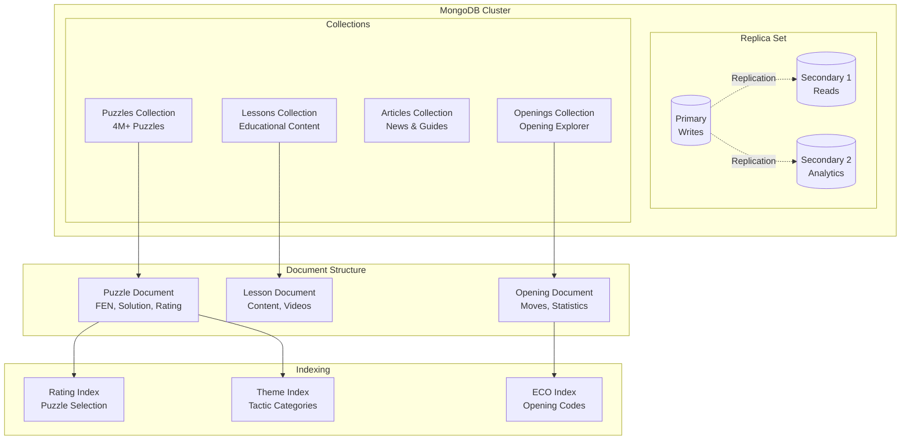
```mermaid
graph TD
    subgraph "MongoDB Cluster"
        subgraph "Replica Set"
            MONGO_PRIMARY[(Primary<br/>Writes)]
            MONGO_SEC1[(Secondary 1<br/>Reads)]
            MONGO_SEC2[(Secondary 2<br/>Analytics)]
        end

        subgraph "Collections"
            PUZZLES[Puzzles Collection<br/>4M+ Puzzles]
            LESSONS[Lessons Collection<br/>Educational Content]
            ARTICLES[Articles Collection<br/>News & Guides]
            OPENINGS[Openings Collection<br/>Opening Explorer]
        end
    end

    subgraph "Document Structure"
        PUZZLE_DOC[Puzzle Document<br/>FEN, Solution, Rating]
        LESSON_DOC[Lesson Document<br/>Content, Videos]
        OPENING_DOC[Opening Document<br/>Moves, Statistics]
    end

    subgraph "Indexing"
        RATING_MONGO_IDX[Rating Index<br/>Puzzle Selection]
        THEME_IDX[Theme Index<br/>Tactic Categories]
        ECO_IDX[ECO Index<br/>Opening Codes]
    end

    MONGO_PRIMARY -.->|Replication| MONGO_SEC1
    MONGO_PRIMARY -.->|Replication| MONGO_SEC2

    PUZZLES --> PUZZLE_DOC
    LESSONS --> LESSON_DOC
    OPENINGS --> OPENING_DOC

    PUZZLE_DOC --> RATING_MONGO_IDX
    PUZZLE_DOC --> THEME_IDX
    OPENING_DOC --> ECO_IDX
```

### 4. ClickHouse (Analytics)

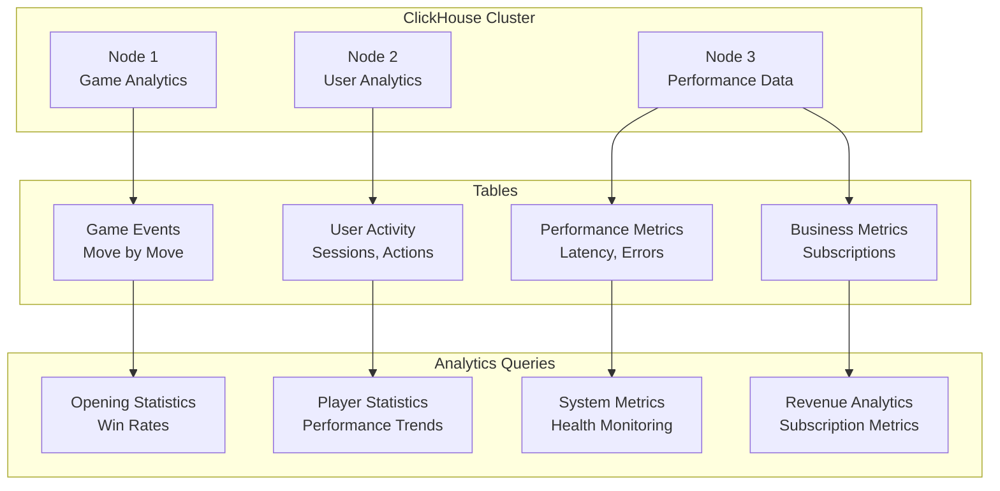
```mermaid
graph TD
    subgraph "ClickHouse Cluster"
        CH_NODE1[Node 1<br/>Game Analytics]
        CH_NODE2[Node 2<br/>User Analytics]
        CH_NODE3[Node 3<br/>Performance Data]
    end

    subgraph "Tables"
        GAME_EVENTS[Game Events<br/>Move by Move]
        USER_ACTIVITY[User Activity<br/>Sessions, Actions]
        PERFORMANCE[Performance Metrics<br/>Latency, Errors]
        BUSINESS[Business Metrics<br/>Subscriptions]
    end

    subgraph "Analytics Queries"
        OPENING_STATS[Opening Statistics<br/>Win Rates]
        PLAYER_STATS[Player Statistics<br/>Performance Trends]
        SYSTEM_METRICS[System Metrics<br/>Health Monitoring]
        REVENUE[Revenue Analytics<br/>Subscription Metrics]
    end

    CH_NODE1 --> GAME_EVENTS
    CH_NODE2 --> USER_ACTIVITY
    CH_NODE3 --> PERFORMANCE
    CH_NODE3 --> BUSINESS

    GAME_EVENTS --> OPENING_STATS
    USER_ACTIVITY --> PLAYER_STATS
    PERFORMANCE --> SYSTEM_METRICS
    BUSINESS --> REVENUE
```

## Anti-Cheat System

### 1. Cheat Detection Architecture

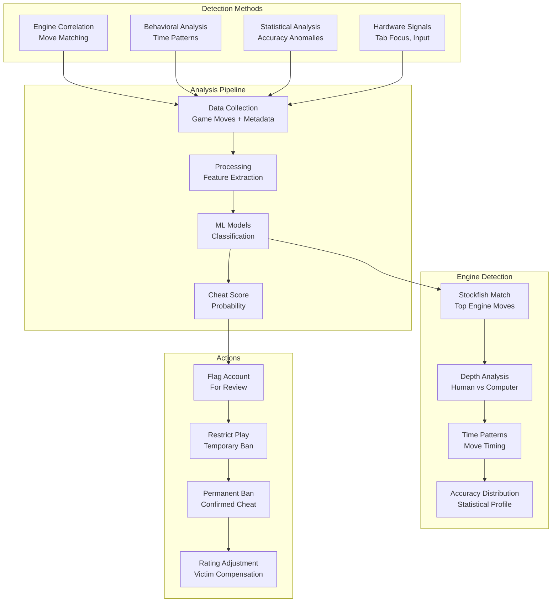
```mermaid
graph TD
    subgraph "Detection Methods"
        ENGINE_MATCH[Engine Correlation<br/>Move Matching]
        BEHAVIOR[Behavioral Analysis<br/>Time Patterns]
        STATISTICAL[Statistical Analysis<br/>Accuracy Anomalies]
        HARDWARE[Hardware Signals<br/>Tab Focus, Input]
    end

    subgraph "Analysis Pipeline"
        COLLECT[Data Collection<br/>Game Moves + Metadata]
        PROCESS[Processing<br/>Feature Extraction]
        MODEL[ML Models<br/>Classification]
        SCORE[Cheat Score<br/>Probability]
    end

    subgraph "Engine Detection"
        STOCKFISH_MATCH[Stockfish Match<br/>Top Engine Moves]
        DEPTH_ANALYSIS[Depth Analysis<br/>Human vs Computer]
        TIME_PATTERN[Time Patterns<br/>Move Timing]
        ACCURACY_CHECK[Accuracy Distribution<br/>Statistical Profile]
    end

    subgraph "Actions"
        FLAG[Flag Account<br/>For Review]
        RESTRICT[Restrict Play<br/>Temporary Ban]
        BAN[Permanent Ban<br/>Confirmed Cheat]
        RATING_ADJUST[Rating Adjustment<br/>Victim Compensation]
    end

    ENGINE_MATCH --> COLLECT
    BEHAVIOR --> COLLECT
    STATISTICAL --> COLLECT
    HARDWARE --> COLLECT

    COLLECT --> PROCESS
    PROCESS --> MODEL
    MODEL --> SCORE

    MODEL --> STOCKFISH_MATCH
    STOCKFISH_MATCH --> DEPTH_ANALYSIS
    DEPTH_ANALYSIS --> TIME_PATTERN
    TIME_PATTERN --> ACCURACY_CHECK

    SCORE --> FLAG
    FLAG --> RESTRICT
    RESTRICT --> BAN
    BAN --> RATING_ADJUST
```

**Anti-Cheat Features:**
- Real-time move correlation with engines
- Behavioral pattern analysis
- Statistical anomaly detection
- Machine learning classification
- Human review for edge cases

### 2. Fair Play Monitoring

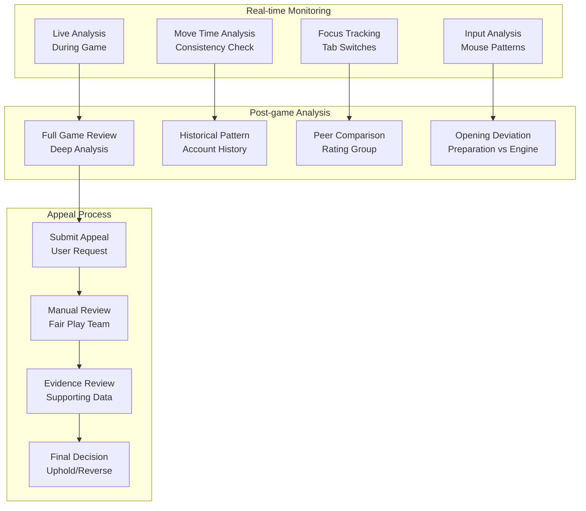
```mermaid
graph TD
    subgraph "Real-time Monitoring"
        LIVE_ANALYSIS[Live Analysis<br/>During Game]
        MOVE_TIME[Move Time Analysis<br/>Consistency Check]
        FOCUS_TRACK[Focus Tracking<br/>Tab Switches]
        INPUT_ANALYSIS[Input Analysis<br/>Mouse Patterns]
    end

    subgraph "Post-game Analysis"
        FULL_GAME[Full Game Review<br/>Deep Analysis]
        HISTORICAL[Historical Pattern<br/>Account History]
        COMPARISON[Peer Comparison<br/>Rating Group]
        OPENING_MATCH[Opening Deviation<br/>Preparation vs Engine]
    end

    subgraph "Appeal Process"
        APPEAL_SUBMIT[Submit Appeal<br/>User Request]
        MANUAL_REVIEW[Manual Review<br/>Fair Play Team]
        EVIDENCE[Evidence Review<br/>Supporting Data]
        DECISION[Final Decision<br/>Uphold/Reverse]
    end

    LIVE_ANALYSIS --> FULL_GAME
    MOVE_TIME --> HISTORICAL
    FOCUS_TRACK --> COMPARISON
    INPUT_ANALYSIS --> OPENING_MATCH

    FULL_GAME --> APPEAL_SUBMIT
    APPEAL_SUBMIT --> MANUAL_REVIEW
    MANUAL_REVIEW --> EVIDENCE
    EVIDENCE --> DECISION
```

## Puzzle System

### 1. Puzzle Generation & Rating

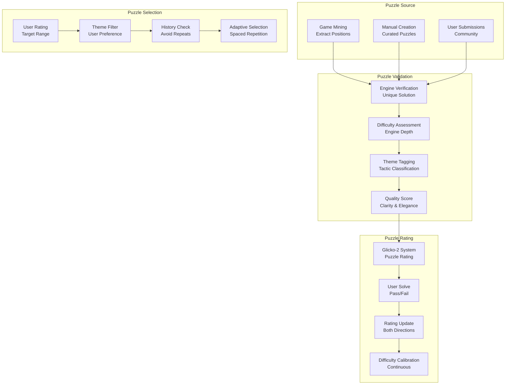
```mermaid
graph TD
    subgraph "Puzzle Source"
        GAME_MINING[Game Mining<br/>Extract Positions]
        MANUAL_CREATE[Manual Creation<br/>Curated Puzzles]
        USER_SUBMIT[User Submissions<br/>Community]
    end

    subgraph "Puzzle Validation"
        ENGINE_VERIFY[Engine Verification<br/>Unique Solution]
        DIFFICULTY[Difficulty Assessment<br/>Engine Depth]
        THEME_TAG[Theme Tagging<br/>Tactic Classification]
        QUALITY[Quality Score<br/>Clarity & Elegance]
    end

    subgraph "Puzzle Rating"
        GLICKO_PUZZLE[Glicko-2 System<br/>Puzzle Rating]
        USER_SOLVE[User Solve<br/>Pass/Fail]
        RATING_UPDATE[Rating Update<br/>Both Directions]
        DIFFICULTY_ADJUST[Difficulty Calibration<br/>Continuous]
    end

    subgraph "Puzzle Selection"
        USER_RATING[User Rating<br/>Target Range]
        THEME_FILTER[Theme Filter<br/>User Preference]
        HISTORY[History Check<br/>Avoid Repeats]
        ADAPTIVE[Adaptive Selection<br/>Spaced Repetition]
    end

    GAME_MINING --> ENGINE_VERIFY
    MANUAL_CREATE --> ENGINE_VERIFY
    USER_SUBMIT --> ENGINE_VERIFY

    ENGINE_VERIFY --> DIFFICULTY
    DIFFICULTY --> THEME_TAG
    THEME_TAG --> QUALITY

    QUALITY --> GLICKO_PUZZLE
    GLICKO_PUZZLE --> USER_SOLVE
    USER_SOLVE --> RATING_UPDATE
    RATING_UPDATE --> DIFFICULTY_ADJUST

    USER_RATING --> THEME_FILTER
    THEME_FILTER --> HISTORY
    HISTORY --> ADAPTIVE
```

**Puzzle Features:**
- 4+ million rated puzzles
- Adaptive difficulty selection
- Theme-based training
- Spaced repetition for learning
- Daily puzzle challenges

## Scalability & Performance

### 1. Horizontal Scaling

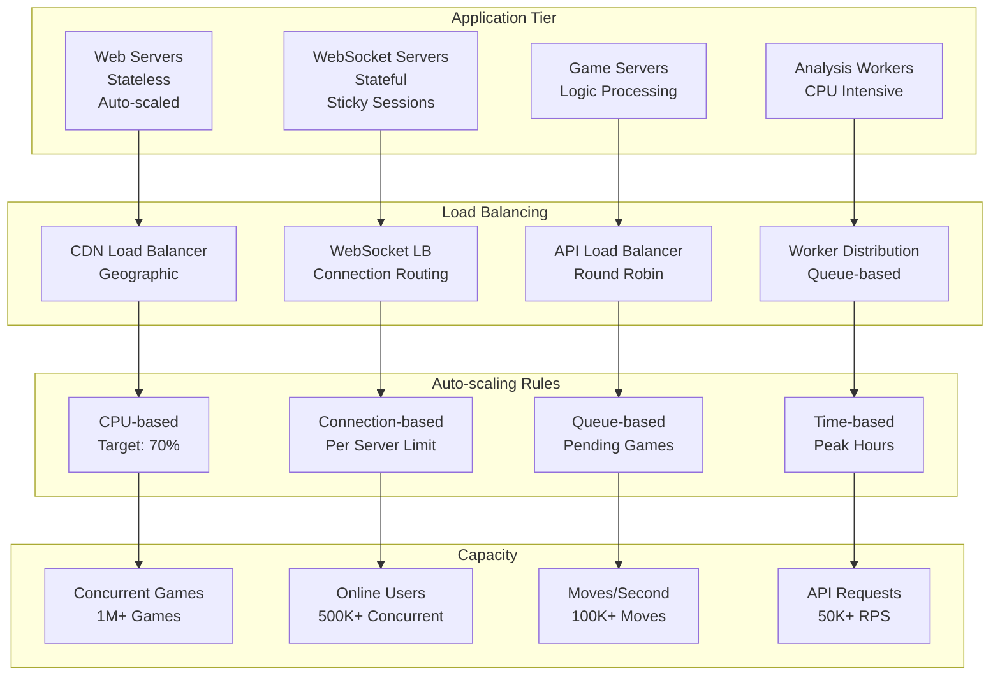
```mermaid
graph TD
    subgraph "Application Tier"
        WEB_SERVERS[Web Servers<br/>Stateless<br/>Auto-scaled]
        WS_SERVERS[WebSocket Servers<br/>Stateful<br/>Sticky Sessions]
        GAME_SERVERS[Game Servers<br/>Logic Processing]
        ANALYSIS_WORKERS[Analysis Workers<br/>CPU Intensive]
    end

    subgraph "Load Balancing"
        CDN_LB[CDN Load Balancer<br/>Geographic]
        WS_LB[WebSocket LB<br/>Connection Routing]
        API_LB[API Load Balancer<br/>Round Robin]
        WORKER_LB[Worker Distribution<br/>Queue-based]
    end

    subgraph "Auto-scaling Rules"
        CPU_SCALE[CPU-based<br/>Target: 70%]
        CONNECTION_SCALE[Connection-based<br/>Per Server Limit]
        QUEUE_SCALE[Queue-based<br/>Pending Games]
        TIME_SCALE[Time-based<br/>Peak Hours]
    end

    subgraph "Capacity"
        CONCURRENT[Concurrent Games<br/>1M+ Games]
        USERS[Online Users<br/>500K+ Concurrent]
        MOVES[Moves/Second<br/>100K+ Moves]
        REQUESTS[API Requests<br/>50K+ RPS]
    end

    WEB_SERVERS --> CDN_LB
    WS_SERVERS --> WS_LB
    GAME_SERVERS --> API_LB
    ANALYSIS_WORKERS --> WORKER_LB

    CDN_LB --> CPU_SCALE
    WS_LB --> CONNECTION_SCALE
    API_LB --> QUEUE_SCALE
    WORKER_LB --> TIME_SCALE

    CPU_SCALE --> CONCURRENT
    CONNECTION_SCALE --> USERS
    QUEUE_SCALE --> MOVES
    TIME_SCALE --> REQUESTS
```

### 2. Latency Optimization

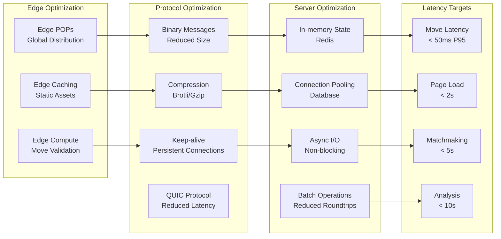
```mermaid
graph LR
    subgraph "Edge Optimization"
        EDGE_POP[Edge POPs<br/>Global Distribution]
        EDGE_CACHE[Edge Caching<br/>Static Assets]
        EDGE_COMPUTE[Edge Compute<br/>Move Validation]
    end

    subgraph "Protocol Optimization"
        BINARY_MSG[Binary Messages<br/>Reduced Size]
        COMPRESSION[Compression<br/>Brotli/Gzip]
        KEEPALIVE[Keep-alive<br/>Persistent Connections]
        QUIC[QUIC Protocol<br/>Reduced Latency]
    end

    subgraph "Server Optimization"
        MEMORY_OPT[In-memory State<br/>Redis]
        CONNECTION_POOL[Connection Pooling<br/>Database]
        ASYNC_IO[Async I/O<br/>Non-blocking]
        BATCH[Batch Operations<br/>Reduced Roundtrips]
    end

    subgraph "Latency Targets"
        MOVE_LATENCY[Move Latency<br/>< 50ms P95]
        PAGE_LOAD[Page Load<br/>< 2s]
        MATCHMAKING[Matchmaking<br/>< 5s]
        ANALYSIS[Analysis<br/>< 10s]
    end

    EDGE_POP --> BINARY_MSG
    EDGE_CACHE --> COMPRESSION
    EDGE_COMPUTE --> KEEPALIVE

    BINARY_MSG --> MEMORY_OPT
    COMPRESSION --> CONNECTION_POOL
    KEEPALIVE --> ASYNC_IO

    MEMORY_OPT --> MOVE_LATENCY
    CONNECTION_POOL --> PAGE_LOAD
    ASYNC_IO --> MATCHMAKING
    BATCH --> ANALYSIS
```

## Monitoring & Observability

### 1. Monitoring Stack

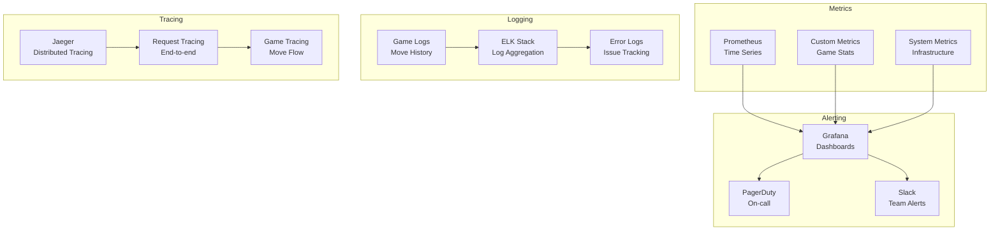
```mermaid
graph TD
    subgraph "Metrics"
        PROMETHEUS[Prometheus<br/>Time Series]
        CUSTOM_METRICS[Custom Metrics<br/>Game Stats]
        SYSTEM_METRICS[System Metrics<br/>Infrastructure]
    end

    subgraph "Logging"
        ELK[ELK Stack<br/>Log Aggregation]
        GAME_LOGS[Game Logs<br/>Move History]
        ERROR_LOGS[Error Logs<br/>Issue Tracking]
    end

    subgraph "Tracing"
        JAEGER[Jaeger<br/>Distributed Tracing]
        REQUEST_TRACE[Request Tracing<br/>End-to-end]
        GAME_TRACE[Game Tracing<br/>Move Flow]
    end

    subgraph "Alerting"
        GRAFANA[Grafana<br/>Dashboards]
        PAGERDUTY[PagerDuty<br/>On-call]
        SLACK_ALERTS[Slack<br/>Team Alerts]
    end

    PROMETHEUS --> GRAFANA
    CUSTOM_METRICS --> GRAFANA
    SYSTEM_METRICS --> GRAFANA

    ELK --> ERROR_LOGS
    GAME_LOGS --> ELK

    JAEGER --> REQUEST_TRACE
    REQUEST_TRACE --> GAME_TRACE

    GRAFANA --> PAGERDUTY
    GRAFANA --> SLACK_ALERTS
```

### 2. Key Metrics

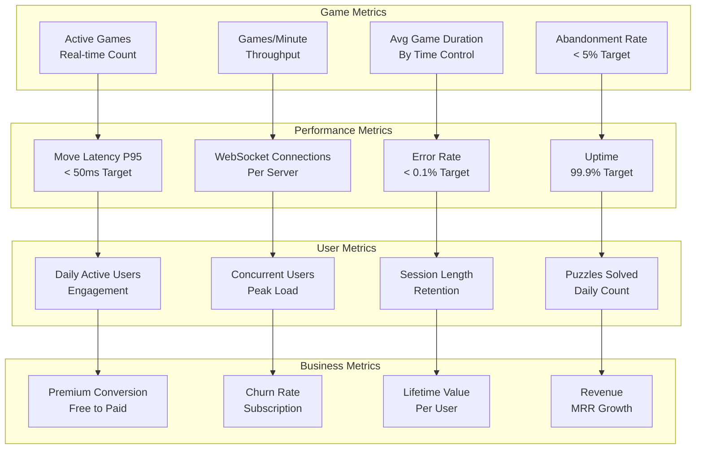
```mermaid
graph TD
    subgraph "Game Metrics"
        ACTIVE_GAMES[Active Games<br/>Real-time Count]
        GAMES_PER_MIN[Games/Minute<br/>Throughput]
        GAME_DURATION[Avg Game Duration<br/>By Time Control]
        ABANDONMENT[Abandonment Rate<br/>< 5% Target]
    end

    subgraph "Performance Metrics"
        MOVE_P95[Move Latency P95<br/>< 50ms Target]
        WS_CONNECTIONS[WebSocket Connections<br/>Per Server]
        ERROR_RATE[Error Rate<br/>< 0.1% Target]
        UPTIME[Uptime<br/>99.9% Target]
    end

    subgraph "User Metrics"
        DAU[Daily Active Users<br/>Engagement]
        CONCURRENT[Concurrent Users<br/>Peak Load]
        SESSION_LENGTH[Session Length<br/>Retention]
        PUZZLE_SOLVED[Puzzles Solved<br/>Daily Count]
    end

    subgraph "Business Metrics"
        PREMIUM_CONV[Premium Conversion<br/>Free to Paid]
        CHURN[Churn Rate<br/>Subscription]
        LTV[Lifetime Value<br/>Per User]
        REVENUE[Revenue<br/>MRR Growth]
    end

    ACTIVE_GAMES --> MOVE_P95
    GAMES_PER_MIN --> WS_CONNECTIONS
    GAME_DURATION --> ERROR_RATE
    ABANDONMENT --> UPTIME

    MOVE_P95 --> DAU
    WS_CONNECTIONS --> CONCURRENT
    ERROR_RATE --> SESSION_LENGTH
    UPTIME --> PUZZLE_SOLVED

    DAU --> PREMIUM_CONV
    CONCURRENT --> CHURN
    SESSION_LENGTH --> LTV
    PUZZLE_SOLVED --> REVENUE
```

## Deployment and DevOps

### 1. Continuous Deployment Pipeline

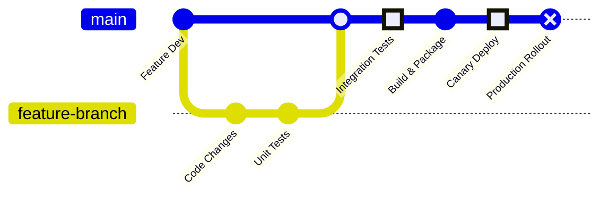
```mermaid
gitGraph
    commit id: "Feature Dev"
    branch feature-branch
    checkout feature-branch
    commit id: "Code Changes"
    commit id: "Unit Tests"
    checkout main
    merge feature-branch
    commit id: "Integration Tests" type: HIGHLIGHT
    commit id: "Build & Package"
    commit id: "Canary Deploy" type: HIGHLIGHT
    commit id: "Production Rollout" type: REVERSE
```

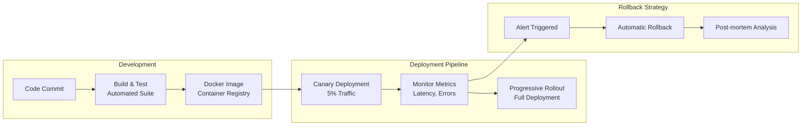
```mermaid
flowchart LR
    subgraph "Development"
        CODE[Code Commit]
        BUILD[Build & Test<br/>Automated Suite]
        ARTIFACT[Docker Image<br/>Container Registry]
    end

    subgraph "Deployment Pipeline"
        CANARY[Canary Deployment<br/>5% Traffic]
        MONITOR[Monitor Metrics<br/>Latency, Errors]
        ROLLOUT[Progressive Rollout<br/>Full Deployment]
    end

    subgraph "Rollback Strategy"
        ALERT[Alert Triggered]
        ROLLBACK[Automatic Rollback]
        POSTMORTEM[Post-mortem Analysis]
    end

    CODE --> BUILD
    BUILD --> ARTIFACT
    ARTIFACT --> CANARY
    CANARY --> MONITOR
    MONITOR --> ROLLOUT
    MONITOR --> ALERT
    ALERT --> ROLLBACK
    ROLLBACK --> POSTMORTEM
```

- **Kubernetes**: Container orchestration
- **Canary releases**: Traffic percentage splitting
- **Feature flags**: Gradual feature rollout
- **Automated rollback**: Error-rate triggered

### 2. Infrastructure as Code
- **Terraform**: Infrastructure provisioning
- **Helm charts**: Kubernetes deployments
- **GitOps**: Configuration as code

### 3. Chaos Engineering

```mermaid
flowchart TD
    subgraph "Chaos Scenarios"
        WS_KILL[WebSocket Server Kill<br/>Connection Drop]
        REDIS_FAIL[Redis Failure<br/>Cache Miss]
        DB_LAG[Database Lag<br/>Latency Injection]
        NETWORK_CHAOS[Network Partition<br/>Region Split]
    end

    subgraph "Target Systems"
        GAME_SERVERS[Game Servers]
        MATCHMAKING[Matchmaking Service]
        ANALYSIS_SVC[Analysis Service]
        RATING_SVC[Rating Service]
    end

    subgraph "Monitoring"
        GAME_METRICS[Game Metrics]
        LATENCY_TRACK[Latency Tracking]
        ERROR_RATES[Error Rates]
    end

    subgraph "Response"
        AUTO_RECONNECT[Auto Reconnect<br/>Client Recovery]
        FALLBACK[Fallback Mode<br/>Degraded Service]
        LEARN[System Improvement]
    end

    WS_KILL --> GAME_SERVERS
    REDIS_FAIL --> MATCHMAKING
    DB_LAG --> ANALYSIS_SVC
    NETWORK_CHAOS --> RATING_SVC

    GAME_SERVERS --> GAME_METRICS
    MATCHMAKING --> LATENCY_TRACK
    ANALYSIS_SVC --> ERROR_RATES

    GAME_METRICS --> AUTO_RECONNECT
    LATENCY_TRACK --> FALLBACK
    AUTO_RECONNECT --> LEARN
```

- **Connection resilience testing**: WebSocket failure scenarios
- **Cache failure drills**: Redis cluster issues
- **Load testing**: Tournament peak traffic
- **Recovery validation**: Reconnection flows

## Analytics and Machine Learning

### 1. Data Pipeline

```mermaid
flowchart TD
    subgraph "Data Sources"
        GAME_DATA[Game Data<br/>Moves, Results]
        USER_BEHAVIOR[User Behavior<br/>Sessions, Actions]
        PUZZLE_DATA[Puzzle Data<br/>Attempts, Success]
        CHEAT_SIGNALS[Cheat Signals<br/>Detection Features]
    end

    subgraph "Processing"
        KAFKA_STREAM[Kafka<br/>Event Streaming]
        SPARK_PROC[Spark<br/>Batch Processing]
        CLICKHOUSE_QUERY[ClickHouse<br/>Analytics Queries]
    end

    subgraph "ML Models"
        CHEAT_DETECT[Cheat Detection<br/>Engine Correlation]
        PUZZLE_RATING[Puzzle Rating<br/>Difficulty Prediction]
        MATCHMAKING_ML[Smart Matchmaking<br/>Player Pairing]
        OPENING_ANALYSIS[Opening Analysis<br/>Win Rate Prediction]
    end

    subgraph "Applications"
        FAIR_PLAY[Fair Play System<br/>Account Actions]
        PUZZLE_SELECT[Puzzle Selection<br/>Personalized]
        INSIGHTS[Player Insights<br/>Performance Analytics]
    end

    GAME_DATA --> KAFKA_STREAM
    USER_BEHAVIOR --> KAFKA_STREAM
    PUZZLE_DATA --> KAFKA_STREAM
    CHEAT_SIGNALS --> KAFKA_STREAM

    KAFKA_STREAM --> SPARK_PROC
    SPARK_PROC --> CLICKHOUSE_QUERY

    CLICKHOUSE_QUERY --> CHEAT_DETECT
    CLICKHOUSE_QUERY --> PUZZLE_RATING
    CLICKHOUSE_QUERY --> MATCHMAKING_ML
    CLICKHOUSE_QUERY --> OPENING_ANALYSIS

    CHEAT_DETECT --> FAIR_PLAY
    PUZZLE_RATING --> PUZZLE_SELECT
    MATCHMAKING_ML --> PUZZLE_SELECT
    OPENING_ANALYSIS --> INSIGHTS
```

### 2. ML Use Cases
- **Cheat detection**: Engine correlation analysis
- **Puzzle difficulty**: Rating calibration
- **Opening explorer**: Move popularity and win rates
- **Player insights**: Performance patterns
- **Matchmaking optimization**: Queue time vs rating match

## Cost Optimization

### 1. Infrastructure Cost Distribution

```mermaid
pie title Chess.com Infrastructure Cost Distribution
    "Compute (Game Servers, API)" : 35
    "Database (PostgreSQL, Redis)" : 25
    "Analysis (Stockfish Workers)" : 15
    "CDN & Network" : 12
    "Storage (Games, Puzzles)" : 8
    "Monitoring & Operations" : 5
```

### 2. Cost Optimization Strategies

```mermaid
graph TD
    subgraph "Compute Optimization"
        SPOT_INSTANCES[Spot Instances<br/>Analysis Workers]
        AUTOSCALE[Auto-scaling<br/>Demand-based]
        CONTAINER_OPT[Container Efficiency<br/>Resource Limits]
        SERVERLESS[Serverless<br/>Burst Workloads]
    end

    subgraph "Database Optimization"
        READ_REPLICAS[Read Replicas<br/>Query Distribution]
        CONNECTION_POOL[Connection Pooling<br/>Resource Reuse]
        QUERY_OPT[Query Optimization<br/>Index Tuning]
        CACHE_LAYER[Cache Layer<br/>Reduce DB Load]
    end

    subgraph "Analysis Optimization"
        DEPTH_LIMIT[Depth Limiting<br/>Free vs Premium]
        RESULT_CACHE[Result Caching<br/>Position Hash]
        BATCH_ANALYSIS[Batch Analysis<br/>Off-peak Processing]
        TABLEBASE_CDN[Tablebase CDN<br/>Edge Distribution]
    end

    subgraph "Network Optimization"
        WS_COMPRESSION[WebSocket Compression<br/>Binary Protocol]
        CDN_CACHE[CDN Caching<br/>Static Assets]
        REGIONAL[Regional Servers<br/>Reduce Latency]
    end

    SPOT_INSTANCES --> READ_REPLICAS
    AUTOSCALE --> CONNECTION_POOL
    CONTAINER_OPT --> QUERY_OPT
    SERVERLESS --> CACHE_LAYER

    READ_REPLICAS --> DEPTH_LIMIT
    CONNECTION_POOL --> RESULT_CACHE
    QUERY_OPT --> BATCH_ANALYSIS
    CACHE_LAYER --> TABLEBASE_CDN

    DEPTH_LIMIT --> WS_COMPRESSION
    RESULT_CACHE --> CDN_CACHE
    BATCH_ANALYSIS --> REGIONAL
```

## Future Architecture Considerations

### 1. Emerging Technologies

```mermaid
graph TD
    subgraph "AI & Chess"
        AI_COACH[AI Coach<br/>Personalized Training]
        NEURAL_ENGINE[Neural Engine<br/>Leela Chess Zero]
        VOICE_MOVES[Voice Moves<br/>Natural Language]
        AI_COMMENTARY[AI Commentary<br/>Game Analysis]
    end

    subgraph "Immersive Experience"
        VR_CHESS[VR Chess<br/>3D Board]
        AR_ANALYSIS[AR Analysis<br/>Board Overlay]
        LIVE_3D[Live 3D Broadcast<br/>Tournament Viewing]
        HAPTIC[Haptic Feedback<br/>Move Confirmation]
    end

    subgraph "Social & Community"
        CLUB_FEATURES[Club Features<br/>Team Competitions]
        STREAMING[Streaming Integration<br/>Twitch, YouTube]
        SOCIAL_FEATURES[Social Features<br/>Friends, Chat]
        ESPORTS[Esports Platform<br/>Pro Tournaments]
    end

    subgraph "Technical Evolution"
        WASM_ENGINE[WASM Engine<br/>Browser Analysis]
        EDGE_COMPUTE[Edge Computing<br/>Lower Latency]
        P2P_GAMES[P2P Gaming<br/>Decentralized]
        BLOCKCHAIN[Blockchain<br/>NFT Collectibles]
    end

    AI_COACH --> VR_CHESS
    NEURAL_ENGINE --> AR_ANALYSIS
    VOICE_MOVES --> LIVE_3D
    AI_COMMENTARY --> HAPTIC

    VR_CHESS --> CLUB_FEATURES
    AR_ANALYSIS --> STREAMING
    LIVE_3D --> SOCIAL_FEATURES
    HAPTIC --> ESPORTS

    CLUB_FEATURES --> WASM_ENGINE
    STREAMING --> EDGE_COMPUTE
    SOCIAL_FEATURES --> P2P_GAMES
    ESPORTS --> BLOCKCHAIN
```

## Mobile Architecture

### 1. Mobile App Architecture

```mermaid
graph TD
    subgraph "Mobile Platforms"
        IOS_APP[iOS App<br/>Swift/SwiftUI]
        ANDROID_APP[Android App<br/>Kotlin]
    end

    subgraph "Core Features"
        GAME_VIEW[Game Board<br/>Interactive UI]
        CLOCK_VIEW[Clock Display<br/>Real-time]
        NOTATION[Move Notation<br/>PGN Display]
        ANALYSIS_VIEW[Analysis Board<br/>Engine Lines]
    end

    subgraph "Offline Support"
        OFFLINE_PUZZLES[Offline Puzzles<br/>Downloaded Sets]
        OFFLINE_ANALYSIS[Offline Analysis<br/>Local Engine]
        DAILY_SYNC[Daily Sync<br/>Content Updates]
        GAME_CACHE[Game Cache<br/>Recent Games]
    end

    subgraph "Push Notifications"
        GAME_START[Game Start<br/>Match Found]
        YOUR_TURN[Your Turn<br/>Daily Chess]
        TOURNAMENT[Tournament<br/>Round Start]
        FRIEND_ONLINE[Friend Online<br/>Social]
    end

    IOS_APP --> GAME_VIEW
    ANDROID_APP --> GAME_VIEW
    GAME_VIEW --> CLOCK_VIEW
    CLOCK_VIEW --> NOTATION
    NOTATION --> ANALYSIS_VIEW

    ANALYSIS_VIEW --> OFFLINE_PUZZLES
    OFFLINE_PUZZLES --> OFFLINE_ANALYSIS
    OFFLINE_ANALYSIS --> DAILY_SYNC
    DAILY_SYNC --> GAME_CACHE

    GAME_CACHE --> GAME_START
    GAME_START --> YOUR_TURN
    YOUR_TURN --> TOURNAMENT
    TOURNAMENT --> FRIEND_ONLINE
```

## Conclusion

Chess.com's architecture demonstrates expertise in building real-time, low-latency gaming platforms at massive scale. The system successfully manages:

- **Real-time Gaming**: Sub-100ms move latency for millions of concurrent games
- **Scalable Infrastructure**: Horizontal scaling for peak traffic
- **Fair Play**: Sophisticated anti-cheat detection systems
- **Rich Features**: Analysis, puzzles, tournaments, and lessons
- **Global Reach**: Low-latency access worldwide

### Key Architectural Principles:

1. **Real-time First**
   - WebSocket-based communication
   - In-memory game state with Redis
   - Edge computing for latency reduction

2. **Scalability**
   - Stateless application servers
   - Consistent hashing for session affinity
   - Auto-scaling based on demand

3. **Data Integrity**
   - Glicko-2 rating system
   - Comprehensive game history
   - Immutable move logs

4. **User Experience**
   - Adaptive matchmaking
   - Personalized puzzle selection
   - Cross-platform synchronization

5. **Fair Play**
   - Multi-layered cheat detection
   - Real-time and post-game analysis
   - Human review for appeals

The platform continues to evolve with new features like improved AI opponents, enhanced analysis tools, and expanded educational content, maintaining its position as the world's largest online chess platform.

> This architecture represents Chess.com's known systems and best practices. Actual implementation details may vary.
