## High-Level Architecture

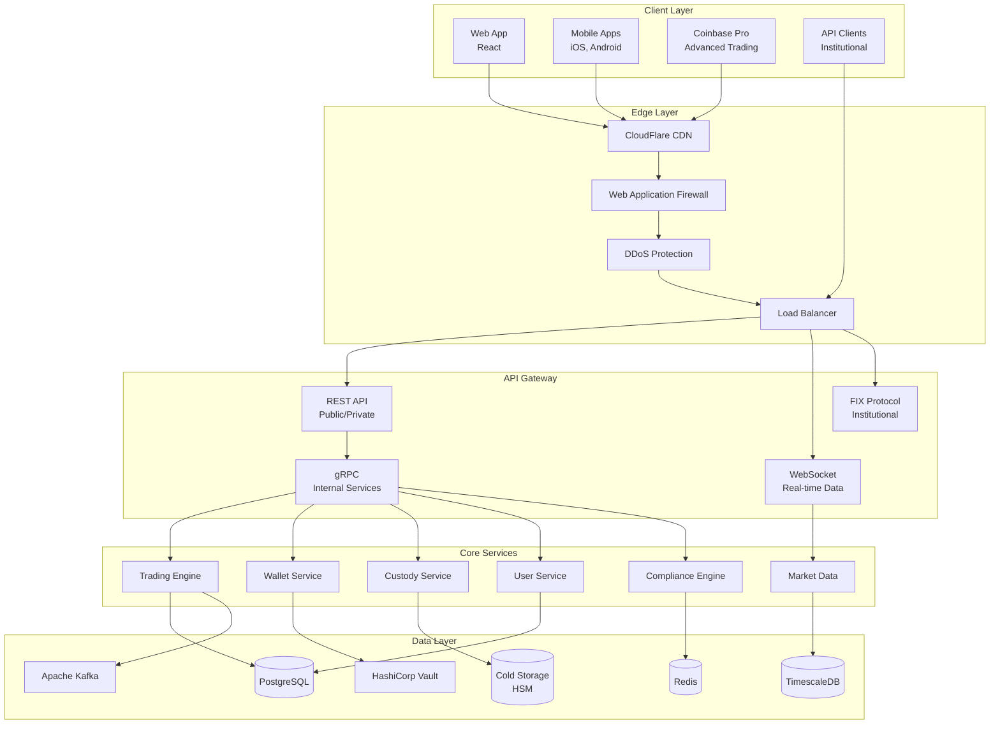
```mermaid
graph TB
    subgraph "Client Layer"
        WEB[Web App<br/>React]
        MOBILE[Mobile Apps<br/>iOS, Android]
        PRO[Coinbase Pro<br/>Advanced Trading]
        API_CLIENT[API Clients<br/>Institutional]
    end

    subgraph "Edge Layer"
        CDN[CloudFlare CDN]
        WAF[Web Application Firewall]
        DDOS[DDoS Protection]
        LB[Load Balancer]
    end

    subgraph "API Gateway"
        REST[REST API<br/>Public/Private]
        WEBSOCKET[WebSocket<br/>Real-time Data]
        FIX[FIX Protocol<br/>Institutional]
        GRPC[gRPC<br/>Internal Services]
    end

    subgraph "Core Services"
        TRADE[Trading Engine]
        WALLET[Wallet Service]
        CUSTODY[Custody Service]
        MARKET[Market Data]
        USER[User Service]
        COMPLIANCE[Compliance Engine]
    end

    subgraph "Data Layer"
        POSTGRES[(PostgreSQL)]
        REDIS[(Redis)]
        KAFKA[Apache Kafka]
        TIMESCALE[(TimescaleDB)]
        VAULT[HashiCorp Vault]
        COLD[(Cold Storage<br/>HSM)]
    end

    WEB --> CDN
    MOBILE --> CDN
    PRO --> CDN
    API_CLIENT --> LB

    CDN --> WAF
    WAF --> DDOS
    DDOS --> LB

    LB --> REST
    LB --> WEBSOCKET
    LB --> FIX
    REST --> GRPC

    GRPC --> TRADE
    GRPC --> WALLET
    GRPC --> CUSTODY
    WEBSOCKET --> MARKET
    GRPC --> USER
    GRPC --> COMPLIANCE

    TRADE --> POSTGRES
    TRADE --> KAFKA
    WALLET --> VAULT
    CUSTODY --> COLD
    MARKET --> TIMESCALE
    USER --> POSTGRES
    COMPLIANCE --> REDIS
```

## Core Components

### 1. Trading Engine (Matching Engine)

Coinbase's order matching engine processes millions of trades with microsecond latency.

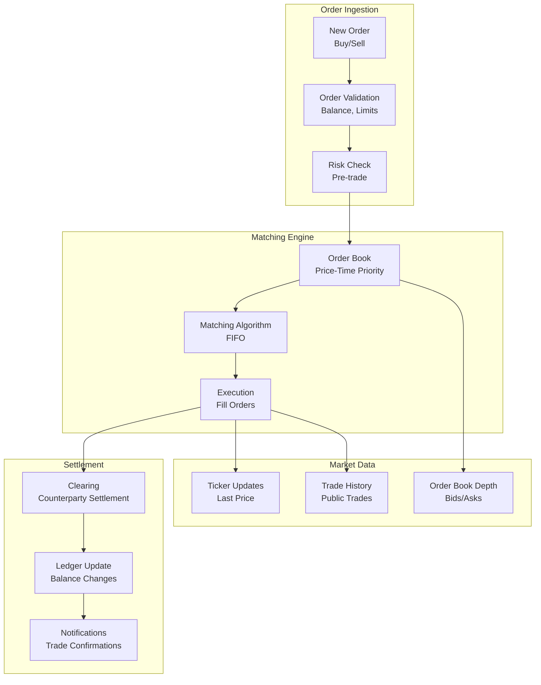
```mermaid
flowchart TD
    subgraph "Order Ingestion"
        ORDER[New Order<br/>Buy/Sell]
        VALIDATE[Order Validation<br/>Balance, Limits]
        RISK[Risk Check<br/>Pre-trade]
    end

    subgraph "Matching Engine"
        BOOK[Order Book<br/>Price-Time Priority]
        MATCH[Matching Algorithm<br/>FIFO]
        EXECUTE[Execution<br/>Fill Orders]
    end

    subgraph "Settlement"
        CLEAR[Clearing<br/>Counterparty Settlement]
        LEDGER[Ledger Update<br/>Balance Changes]
        NOTIFY[Notifications<br/>Trade Confirmations]
    end

    subgraph "Market Data"
        TICKER[Ticker Updates<br/>Last Price]
        DEPTH[Order Book Depth<br/>Bids/Asks]
        TRADES[Trade History<br/>Public Trades]
    end

    ORDER --> VALIDATE
    VALIDATE --> RISK
    RISK --> BOOK

    BOOK --> MATCH
    MATCH --> EXECUTE

    EXECUTE --> CLEAR
    CLEAR --> LEDGER
    LEDGER --> NOTIFY

    EXECUTE --> TICKER
    BOOK --> DEPTH
    EXECUTE --> TRADES
```

**Trading Features:**
- **Order Types**: Market, Limit, Stop, Stop-Limit
- **Matching**: Price-time priority (FIFO)
- **Latency**: Sub-millisecond matching
- **Throughput**: 100K+ orders per second

### 2. Wallet Infrastructure

Secure cryptocurrency storage with hot and cold wallet segregation.

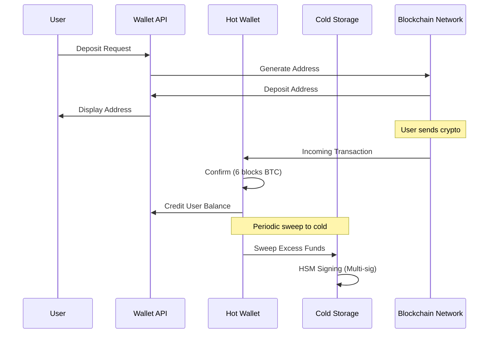
```mermaid
sequenceDiagram
    participant User
    participant API as Wallet API
    participant Hot as Hot Wallet
    participant Cold as Cold Storage
    participant Blockchain as Blockchain Network

    User->>API: Deposit Request
    API->>Blockchain: Generate Address
    Blockchain->>API: Deposit Address
    API->>User: Display Address

    Note over Blockchain: User sends crypto

    Blockchain->>Hot: Incoming Transaction
    Hot->>Hot: Confirm (6 blocks BTC)
    Hot->>API: Credit User Balance

    Note over Hot,Cold: Periodic sweep to cold

    Hot->>Cold: Sweep Excess Funds
    Cold->>Cold: HSM Signing (Multi-sig)
```

**Wallet Architecture:**
- **Hot Wallets**: Online, for immediate withdrawals (~2% of assets)
- **Cold Storage**: Offline, HSM-secured (~98% of assets)
- **Multi-signature**: Requires multiple approvals
- **Geographic Distribution**: Keys spread across locations

### 3. Custody Solution

Institutional-grade custody with insurance and compliance.

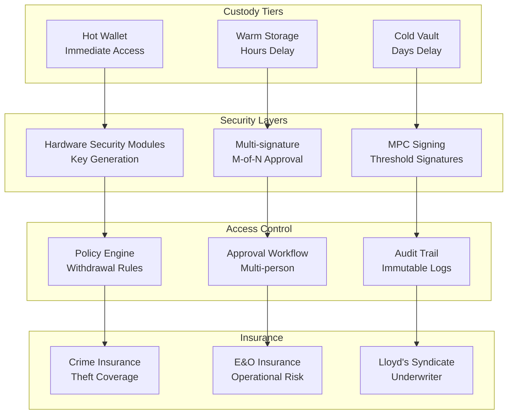
```mermaid
graph TD
    subgraph "Custody Tiers"
        HOT[Hot Wallet<br/>Immediate Access]
        WARM[Warm Storage<br/>Hours Delay]
        COLD[Cold Vault<br/>Days Delay]
    end

    subgraph "Security Layers"
        HSM[Hardware Security Modules<br/>Key Generation]
        MULTISIG[Multi-signature<br/>M-of-N Approval]
        MPC[MPC Signing<br/>Threshold Signatures]
    end

    subgraph "Access Control"
        POLICY[Policy Engine<br/>Withdrawal Rules]
        APPROVAL[Approval Workflow<br/>Multi-person]
        AUDIT[Audit Trail<br/>Immutable Logs]
    end

    subgraph "Insurance"
        CRIME[Crime Insurance<br/>Theft Coverage]
        E_AND_O[E&O Insurance<br/>Operational Risk]
        LLOYD[Lloyd's Syndicate<br/>Underwriter]
    end

    HOT --> HSM
    WARM --> MULTISIG
    COLD --> MPC

    HSM --> POLICY
    MULTISIG --> APPROVAL
    MPC --> AUDIT

    POLICY --> CRIME
    APPROVAL --> E_AND_O
    AUDIT --> LLOYD
```

### 4. Blockchain Integration

Multi-chain support with transaction monitoring.

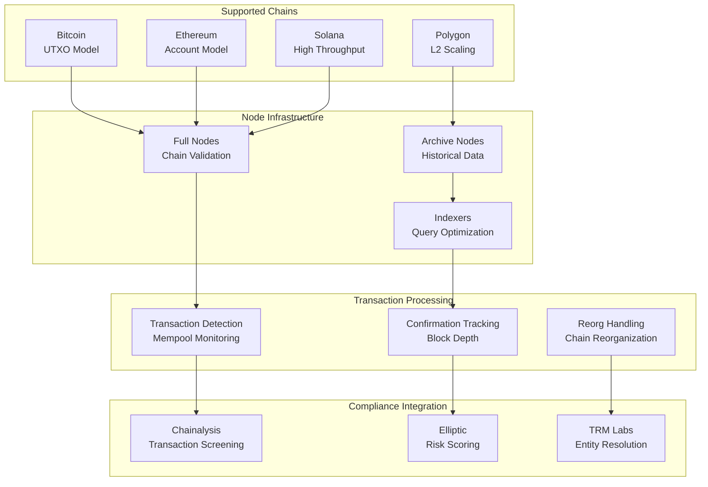
```mermaid
graph TD
    subgraph "Supported Chains"
        BTC[Bitcoin<br/>UTXO Model]
        ETH[Ethereum<br/>Account Model]
        SOL[Solana<br/>High Throughput]
        POLYGON[Polygon<br/>L2 Scaling]
    end

    subgraph "Node Infrastructure"
        FULL[Full Nodes<br/>Chain Validation]
        ARCHIVE[Archive Nodes<br/>Historical Data]
        INDEX[Indexers<br/>Query Optimization]
    end

    subgraph "Transaction Processing"
        DETECT[Transaction Detection<br/>Mempool Monitoring]
        CONFIRM[Confirmation Tracking<br/>Block Depth]
        REORG[Reorg Handling<br/>Chain Reorganization]
    end

    subgraph "Compliance Integration"
        CHAINALYSIS[Chainalysis<br/>Transaction Screening]
        ELLIPTIC[Elliptic<br/>Risk Scoring]
        TRM[TRM Labs<br/>Entity Resolution]
    end

    BTC --> FULL
    ETH --> FULL
    SOL --> FULL
    POLYGON --> ARCHIVE

    FULL --> DETECT
    ARCHIVE --> INDEX
    INDEX --> CONFIRM

    DETECT --> CHAINALYSIS
    CONFIRM --> ELLIPTIC
    REORG --> TRM
```

## Data Storage Architecture

### PostgreSQL (Primary Database)

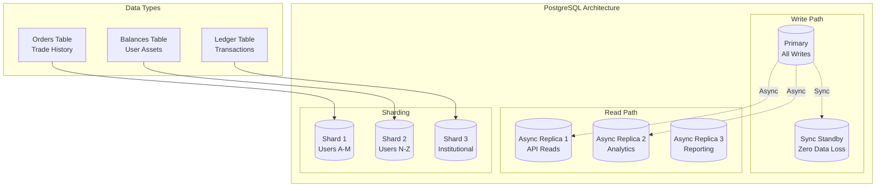
```mermaid
graph TD
    subgraph "PostgreSQL Architecture"
        subgraph "Write Path"
            PRIMARY[(Primary<br/>All Writes)]
            SYNC[(Sync Standby<br/>Zero Data Loss)]
        end

        subgraph "Read Path"
            ASYNC1[(Async Replica 1<br/>API Reads)]
            ASYNC2[(Async Replica 2<br/>Analytics)]
            ASYNC3[(Async Replica 3<br/>Reporting)]
        end

        subgraph "Sharding"
            SHARD1[(Shard 1<br/>Users A-M)]
            SHARD2[(Shard 2<br/>Users N-Z)]
            SHARD3[(Shard 3<br/>Institutional)]
        end
    end

    subgraph "Data Types"
        ORDERS[Orders Table<br/>Trade History]
        BALANCES[Balances Table<br/>User Assets]
        LEDGER[Ledger Table<br/>Transactions]
    end

    PRIMARY -.->|Sync| SYNC
    PRIMARY -.->|Async| ASYNC1
    PRIMARY -.->|Async| ASYNC2

    ORDERS --> SHARD1
    BALANCES --> SHARD2
    LEDGER --> SHARD3
```

### TimescaleDB (Market Data)

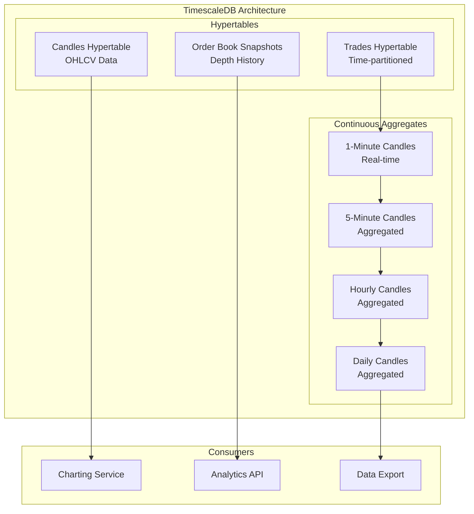
```mermaid
graph TD
    subgraph "TimescaleDB Architecture"
        subgraph "Hypertables"
            TRADES_HT[Trades Hypertable<br/>Time-partitioned]
            CANDLES_HT[Candles Hypertable<br/>OHLCV Data]
            ORDERBOOK_HT[Order Book Snapshots<br/>Depth History]
        end

        subgraph "Continuous Aggregates"
            MIN_1[1-Minute Candles<br/>Real-time]
            MIN_5[5-Minute Candles<br/>Aggregated]
            HOUR_1[Hourly Candles<br/>Aggregated]
            DAY_1[Daily Candles<br/>Aggregated]
        end
    end

    subgraph "Consumers"
        CHARTS[Charting Service]
        ANALYTICS[Analytics API]
        EXPORT[Data Export]
    end

    TRADES_HT --> MIN_1
    MIN_1 --> MIN_5
    MIN_5 --> HOUR_1
    HOUR_1 --> DAY_1

    CANDLES_HT --> CHARTS
    ORDERBOOK_HT --> ANALYTICS
    DAY_1 --> EXPORT
```

### Redis (Caching & Real-time)

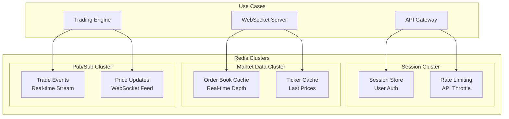
```mermaid
graph TD
    subgraph "Redis Clusters"
        subgraph "Session Cluster"
            S1[Session Store<br/>User Auth]
            S2[Rate Limiting<br/>API Throttle]
        end

        subgraph "Market Data Cluster"
            M1[Order Book Cache<br/>Real-time Depth]
            M2[Ticker Cache<br/>Last Prices]
        end

        subgraph "Pub/Sub Cluster"
            P1[Trade Events<br/>Real-time Stream]
            P2[Price Updates<br/>WebSocket Feed]
        end
    end

    subgraph "Use Cases"
        API[API Gateway]
        WEBSOCKET[WebSocket Server]
        TRADING[Trading Engine]
    end

    API --> S1
    API --> S2
    WEBSOCKET --> M1
    WEBSOCKET --> M2
    TRADING --> P1
    TRADING --> P2
```

## Stream Processing Architecture

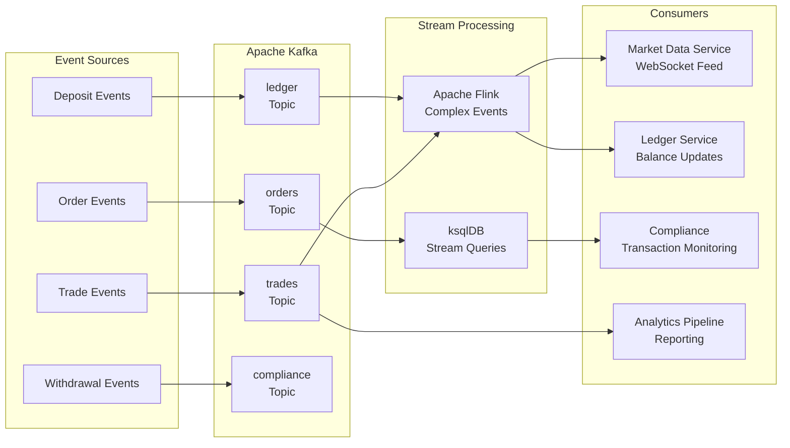
```mermaid
graph LR
    subgraph "Event Sources"
        TRADE_EVT[Trade Events]
        ORDER_EVT[Order Events]
        DEPOSIT_EVT[Deposit Events]
        WITHDRAW_EVT[Withdrawal Events]
    end

    subgraph "Apache Kafka"
        TOPIC_TRADE[trades<br/>Topic]
        TOPIC_ORDER[orders<br/>Topic]
        TOPIC_LEDGER[ledger<br/>Topic]
        TOPIC_COMPLIANCE[compliance<br/>Topic]
    end

    subgraph "Stream Processing"
        FLINK[Apache Flink<br/>Complex Events]
        KSQL[ksqlDB<br/>Stream Queries]
    end

    subgraph "Consumers"
        MARKET_DATA[Market Data Service<br/>WebSocket Feed]
        LEDGER_SVC[Ledger Service<br/>Balance Updates]
        COMPLIANCE_SVC[Compliance<br/>Transaction Monitoring]
        ANALYTICS[Analytics Pipeline<br/>Reporting]
    end

    TRADE_EVT --> TOPIC_TRADE
    ORDER_EVT --> TOPIC_ORDER
    DEPOSIT_EVT --> TOPIC_LEDGER
    WITHDRAW_EVT --> TOPIC_COMPLIANCE

    TOPIC_TRADE --> FLINK
    TOPIC_ORDER --> KSQL
    TOPIC_LEDGER --> FLINK

    FLINK --> MARKET_DATA
    FLINK --> LEDGER_SVC
    KSQL --> COMPLIANCE_SVC
    TOPIC_TRADE --> ANALYTICS
```

### Real-time Processing
- **Trade Streaming**: Sub-second trade distribution
- **Order Book Updates**: Real-time depth changes
- **Balance Updates**: Instant ledger synchronization
- **Compliance Monitoring**: Real-time transaction screening

## Scalability Patterns

### 1. Order Book Management

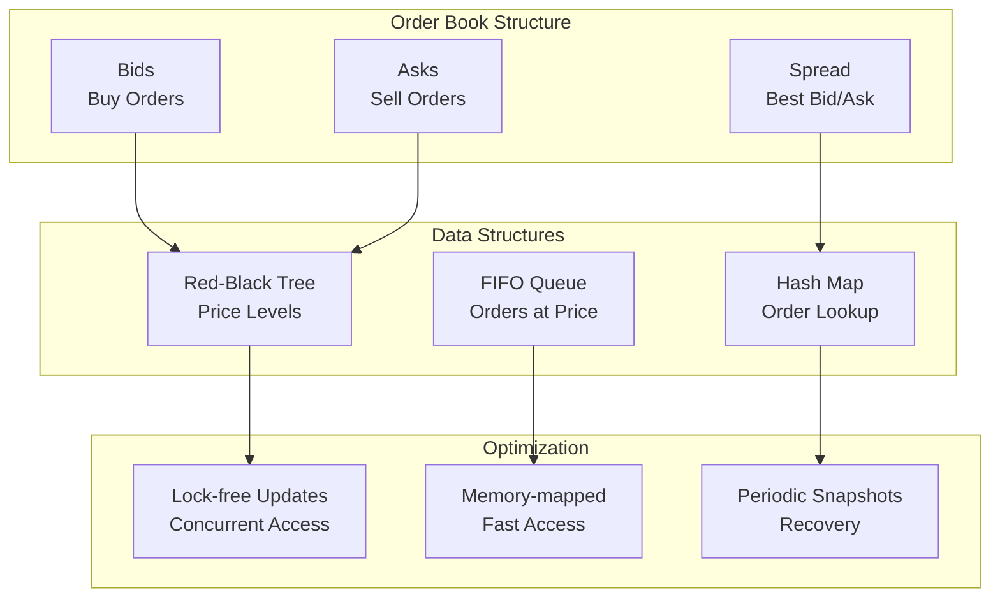
```mermaid
flowchart TD
    subgraph "Order Book Structure"
        BIDS[Bids<br/>Buy Orders]
        ASKS[Asks<br/>Sell Orders]
        SPREAD[Spread<br/>Best Bid/Ask]
    end

    subgraph "Data Structures"
        RBTREE[Red-Black Tree<br/>Price Levels]
        QUEUE[FIFO Queue<br/>Orders at Price]
        HASH[Hash Map<br/>Order Lookup]
    end

    subgraph "Optimization"
        LOCK_FREE[Lock-free Updates<br/>Concurrent Access]
        MEMORY[Memory-mapped<br/>Fast Access]
        SNAPSHOT[Periodic Snapshots<br/>Recovery]
    end

    BIDS --> RBTREE
    ASKS --> RBTREE
    SPREAD --> HASH

    RBTREE --> LOCK_FREE
    QUEUE --> MEMORY
    HASH --> SNAPSHOT
```

### 2. Rate Limiting

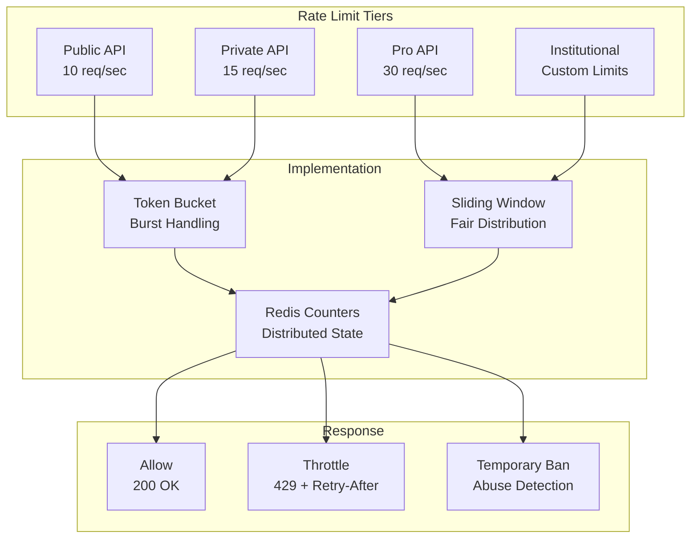
```mermaid
flowchart TD
    subgraph "Rate Limit Tiers"
        PUBLIC[Public API<br/>10 req/sec]
        PRIVATE[Private API<br/>15 req/sec]
        PRO[Pro API<br/>30 req/sec]
        INSTITUTIONAL[Institutional<br/>Custom Limits]
    end

    subgraph "Implementation"
        TOKEN[Token Bucket<br/>Burst Handling]
        SLIDING[Sliding Window<br/>Fair Distribution]
        REDIS_RL[Redis Counters<br/>Distributed State]
    end

    subgraph "Response"
        ALLOW[Allow<br/>200 OK]
        THROTTLE[Throttle<br/>429 + Retry-After]
        BAN[Temporary Ban<br/>Abuse Detection]
    end

    PUBLIC --> TOKEN
    PRIVATE --> TOKEN
    PRO --> SLIDING
    INSTITUTIONAL --> SLIDING

    TOKEN --> REDIS_RL
    SLIDING --> REDIS_RL

    REDIS_RL --> ALLOW
    REDIS_RL --> THROTTLE
    REDIS_RL --> BAN
```

### 3. High Availability

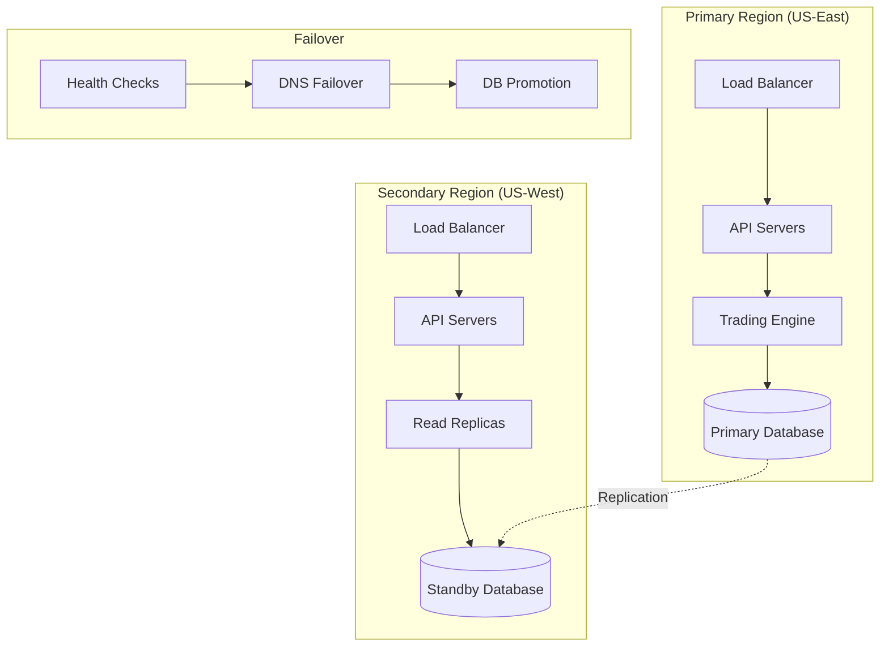
```mermaid
graph TD
    subgraph "Primary Region (US-East)"
        US_LB[Load Balancer]
        US_API[API Servers]
        US_TRADE[Trading Engine]
        US_DB[(Primary Database)]
    end

    subgraph "Secondary Region (US-West)"
        WEST_LB[Load Balancer]
        WEST_API[API Servers]
        WEST_READ[Read Replicas]
        WEST_DB[(Standby Database)]
    end

    subgraph "Failover"
        HEALTH[Health Checks]
        DNS[DNS Failover]
        PROMOTE[DB Promotion]
    end

    US_LB --> US_API
    US_API --> US_TRADE
    US_TRADE --> US_DB

    WEST_LB --> WEST_API
    WEST_API --> WEST_READ
    WEST_READ --> WEST_DB

    US_DB -.->|Replication| WEST_DB

    HEALTH --> DNS
    DNS --> PROMOTE
```

## Security Architecture

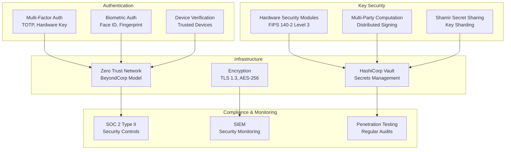
```mermaid
graph TB
    subgraph "Authentication"
        MFA[Multi-Factor Auth<br/>TOTP, Hardware Key]
        BIOMETRIC[Biometric Auth<br/>Face ID, Fingerprint]
        DEVICE[Device Verification<br/>Trusted Devices]
    end

    subgraph "Key Security"
        HSM[Hardware Security Modules<br/>FIPS 140-2 Level 3]
        MPC[Multi-Party Computation<br/>Distributed Signing]
        SHAMIR[Shamir Secret Sharing<br/>Key Sharding]
    end

    subgraph "Infrastructure"
        ZERO_TRUST[Zero Trust Network<br/>BeyondCorp Model]
        ENCRYPT[Encryption<br/>TLS 1.3, AES-256]
        VAULT_SEC[HashiCorp Vault<br/>Secrets Management]
    end

    subgraph "Compliance & Monitoring"
        SOC[SOC 2 Type II<br/>Security Controls]
        SIEM[SIEM<br/>Security Monitoring]
        PENTEST[Penetration Testing<br/>Regular Audits]
    end

    MFA --> ZERO_TRUST
    BIOMETRIC --> ZERO_TRUST
    DEVICE --> ZERO_TRUST

    HSM --> VAULT_SEC
    MPC --> VAULT_SEC
    SHAMIR --> VAULT_SEC

    ZERO_TRUST --> SOC
    ENCRYPT --> SIEM
    VAULT_SEC --> PENTEST
```

### Cold Storage Security
- **Air-gapped Systems**: No network connectivity
- **Geographic Distribution**: Keys across multiple locations
- **Multi-signature**: Requires multiple key holders
- **Time-delayed Withdrawals**: Large withdrawal delays

### Compliance
- **KYC/AML**: Identity verification, transaction monitoring
- **Travel Rule**: Cross-exchange information sharing
- **SAR Filing**: Suspicious activity reporting
- **State Licenses**: Money transmitter licenses

## Monitoring and Observability

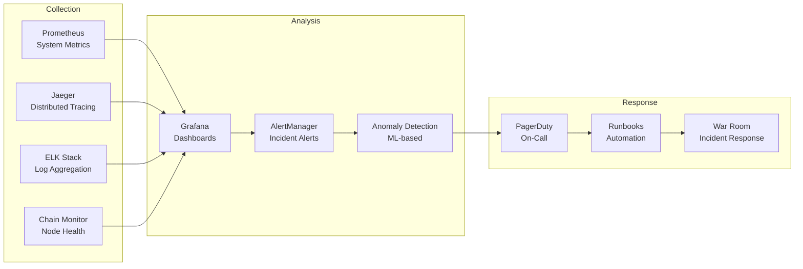
```mermaid
graph LR
    subgraph "Collection"
        METRICS[Prometheus<br/>System Metrics]
        TRACES[Jaeger<br/>Distributed Tracing]
        LOGS[ELK Stack<br/>Log Aggregation]
        BLOCKCHAIN[Chain Monitor<br/>Node Health]
    end

    subgraph "Analysis"
        GRAFANA[Grafana<br/>Dashboards]
        ALERT[AlertManager<br/>Incident Alerts]
        ANOMALY[Anomaly Detection<br/>ML-based]
    end

    subgraph "Response"
        PAGER[PagerDuty<br/>On-Call]
        RUNBOOK[Runbooks<br/>Automation]
        WAR_ROOM[War Room<br/>Incident Response]
    end

    METRICS --> GRAFANA
    TRACES --> GRAFANA
    LOGS --> GRAFANA
    BLOCKCHAIN --> GRAFANA

    GRAFANA --> ALERT
    ALERT --> ANOMALY

    ANOMALY --> PAGER
    PAGER --> RUNBOOK
    RUNBOOK --> WAR_ROOM
```

### Key Metrics
- **Trading Latency**: Order-to-fill time
- **Blockchain Sync**: Node lag behind chain tip
- **Wallet Balance**: Hot wallet thresholds
- **API Availability**: Uptime and error rates

## Deployment and DevOps

### Continuous Integration/Continuous Deployment

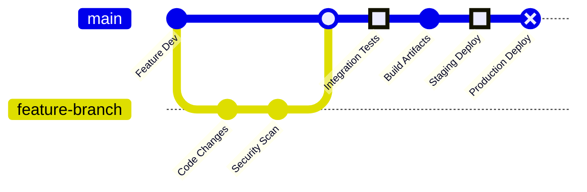
```mermaid
gitGraph
    commit id: "Feature Dev"
    branch feature-branch
    checkout feature-branch
    commit id: "Code Changes"
    commit id: "Security Scan"
    checkout main
    merge feature-branch
    commit id: "Integration Tests" type: HIGHLIGHT
    commit id: "Build Artifacts"
    commit id: "Staging Deploy" type: HIGHLIGHT
    commit id: "Production Deploy" type: REVERSE
```

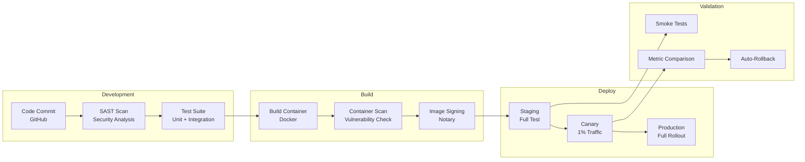
```mermaid
flowchart LR
    subgraph "Development"
        CODE[Code Commit<br/>GitHub]
        SAST[SAST Scan<br/>Security Analysis]
        TEST[Test Suite<br/>Unit + Integration]
    end

    subgraph "Build"
        BUILD[Build Container<br/>Docker]
        SCAN[Container Scan<br/>Vulnerability Check]
        SIGN[Image Signing<br/>Notary]
    end

    subgraph "Deploy"
        STAGING[Staging<br/>Full Test]
        CANARY[Canary<br/>1% Traffic]
        PROD[Production<br/>Full Rollout]
    end

    subgraph "Validation"
        SMOKE[Smoke Tests]
        MONITOR[Metric Comparison]
        ROLLBACK[Auto-Rollback]
    end

    CODE --> SAST
    SAST --> TEST
    TEST --> BUILD
    BUILD --> SCAN
    SCAN --> SIGN

    SIGN --> STAGING
    STAGING --> CANARY
    CANARY --> PROD

    STAGING --> SMOKE
    CANARY --> MONITOR
    MONITOR --> ROLLBACK
```

### Infrastructure
- **Kubernetes**: Container orchestration
- **AWS/GCP**: Multi-cloud deployment
- **Terraform**: Infrastructure as code
- **Vault**: Secrets management

### Chaos Engineering

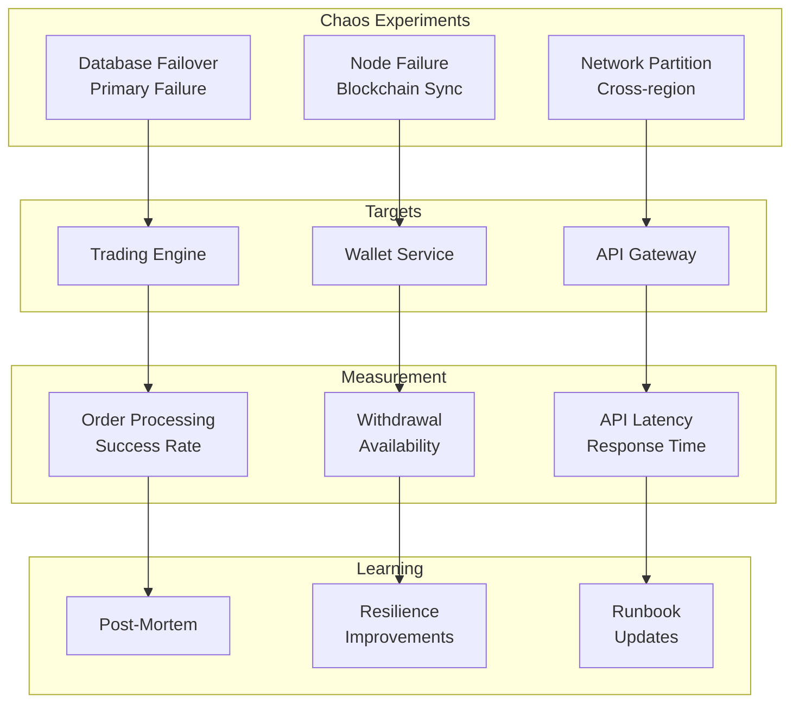
```mermaid
flowchart TD
    subgraph "Chaos Experiments"
        NODE[Node Failure<br/>Blockchain Sync]
        DB[Database Failover<br/>Primary Failure]
        NETWORK[Network Partition<br/>Cross-region]
    end

    subgraph "Targets"
        TRADE_SVC[Trading Engine]
        WALLET_SVC[Wallet Service]
        API_SVC[API Gateway]
    end

    subgraph "Measurement"
        ORDER_IMPACT[Order Processing<br/>Success Rate]
        WITHDRAWAL[Withdrawal<br/>Availability]
        LATENCY[API Latency<br/>Response Time]
    end

    subgraph "Learning"
        POSTMORTEM[Post-Mortem]
        IMPROVE[Resilience<br/>Improvements]
        RUNBOOK[Runbook<br/>Updates]
    end

    NODE --> WALLET_SVC
    DB --> TRADE_SVC
    NETWORK --> API_SVC

    TRADE_SVC --> ORDER_IMPACT
    WALLET_SVC --> WITHDRAWAL
    API_SVC --> LATENCY

    ORDER_IMPACT --> POSTMORTEM
    WITHDRAWAL --> IMPROVE
    LATENCY --> RUNBOOK
```

**Practices:**
- **GameDay Exercises**: Quarterly disaster simulations
- **Blockchain Fork Handling**: Chain reorganization tests
- **Hot Wallet Compromise**: Security incident drills
- **Trading Halt**: Circuit breaker testing

## Analytics and Machine Learning

### Data Pipeline

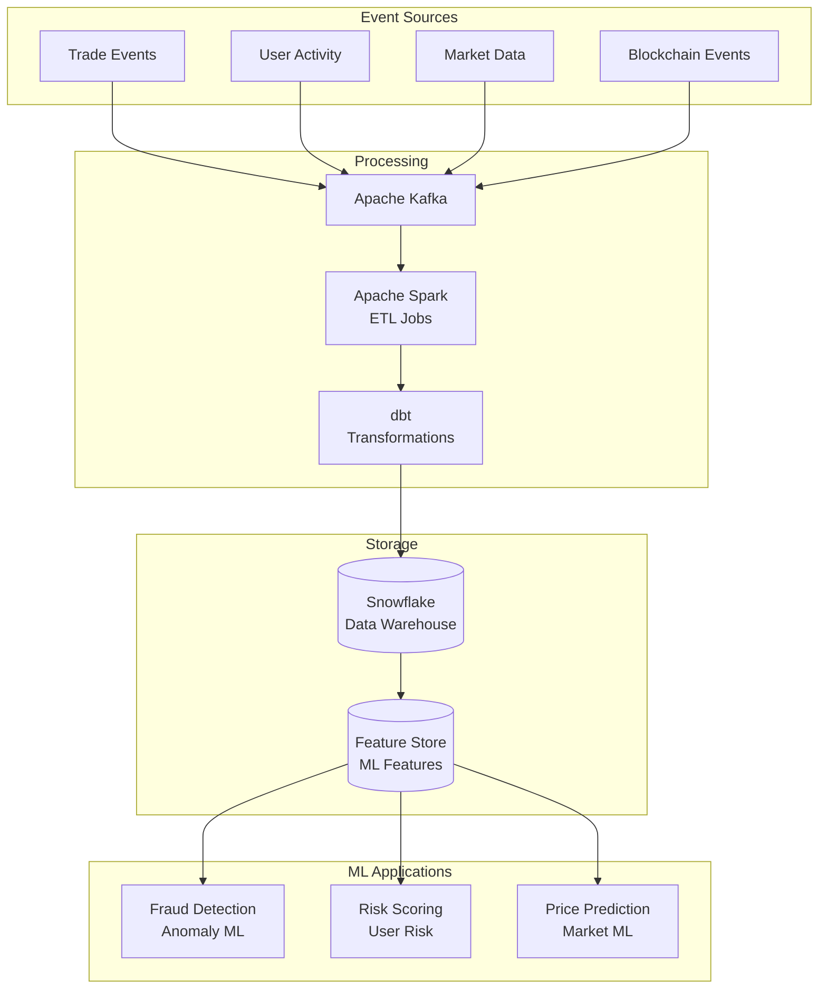
```mermaid
flowchart TD
    subgraph "Event Sources"
        TRADE_LOG[Trade Events]
        USER_LOG[User Activity]
        MARKET_LOG[Market Data]
        CHAIN_LOG[Blockchain Events]
    end

    subgraph "Processing"
        KAFKA[Apache Kafka]
        SPARK[Apache Spark<br/>ETL Jobs]
        DBT[dbt<br/>Transformations]
    end

    subgraph "Storage"
        WAREHOUSE[(Snowflake<br/>Data Warehouse)]
        FEATURE[(Feature Store<br/>ML Features)]
    end

    subgraph "ML Applications"
        FRAUD[Fraud Detection<br/>Anomaly ML]
        RISK[Risk Scoring<br/>User Risk]
        PRICE[Price Prediction<br/>Market ML]
    end

    TRADE_LOG --> KAFKA
    USER_LOG --> KAFKA
    MARKET_LOG --> KAFKA
    CHAIN_LOG --> KAFKA

    KAFKA --> SPARK
    SPARK --> DBT
    DBT --> WAREHOUSE

    WAREHOUSE --> FEATURE
    FEATURE --> FRAUD
    FEATURE --> RISK
    FEATURE --> PRICE
```

### ML Use Cases
- **Fraud Detection**: Suspicious transaction patterns
- **Account Takeover Prevention**: Login anomaly detection
- **Market Manipulation**: Wash trading detection
- **Risk Scoring**: User and transaction risk assessment
- **Price Alerts**: Intelligent notification timing

## Cost Optimization

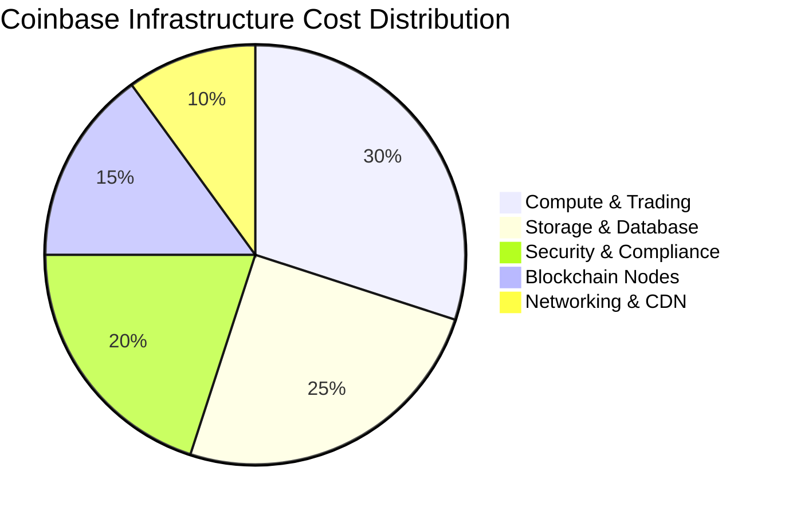
```mermaid
pie title Coinbase Infrastructure Cost Distribution
    "Compute & Trading" : 30
    "Storage & Database" : 25
    "Security & Compliance" : 20
    "Blockchain Nodes" : 15
    "Networking & CDN" : 10
```

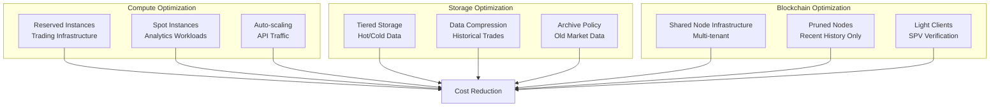
```mermaid
graph TD
    subgraph "Compute Optimization"
        RESERVED[Reserved Instances<br/>Trading Infrastructure]
        SPOT[Spot Instances<br/>Analytics Workloads]
        AUTOSCALE[Auto-scaling<br/>API Traffic]
    end

    subgraph "Storage Optimization"
        TIERED[Tiered Storage<br/>Hot/Cold Data]
        COMPRESS[Data Compression<br/>Historical Trades]
        ARCHIVE[Archive Policy<br/>Old Market Data]
    end

    subgraph "Blockchain Optimization"
        SHARED_NODES[Shared Node Infrastructure<br/>Multi-tenant]
        PRUNED[Pruned Nodes<br/>Recent History Only]
        LIGHT[Light Clients<br/>SPV Verification]
    end

    RESERVED --> COST[Cost Reduction]
    SPOT --> COST
    AUTOSCALE --> COST
    TIERED --> COST
    COMPRESS --> COST
    ARCHIVE --> COST
    SHARED_NODES --> COST
    PRUNED --> COST
    LIGHT --> COST
```

### Key Strategies
- **Reserved Capacity**: Predictable trading infrastructure costs
- **Blockchain Node Optimization**: Shared infrastructure where possible
- **Market Data Tiering**: Archive old tick data
- **Geographic Optimization**: Region-based cost efficiency

## Future Architecture Considerations

### Emerging Technologies
- **Layer 2 Scaling**: Lightning Network, Optimistic Rollups
- **DeFi Integration**: Protocol integration, yield products
- **NFT Infrastructure**: Marketplace and minting
- **CBDC Readiness**: Central bank digital currency support

### Platform Evolution
- **Base L2**: Ethereum Layer 2 scaling solution
- **International Expansion**: New market regulatory compliance
- **Institutional Products**: Prime brokerage services
- **Staking Services**: Proof-of-stake validation

### Infrastructure Roadmap
- **Multi-Cloud**: Enhanced resilience across providers
- **Edge Computing**: Reduced latency for global users
- **Zero-Knowledge Proofs**: Privacy-preserving compliance
- **Quantum Resistance**: Post-quantum cryptography

## Conclusion

Coinbase's architecture demonstrates how to build a secure, compliant cryptocurrency exchange at scale. The combination of robust trading infrastructure, industry-leading security practices, and comprehensive compliance systems enables Coinbase to serve millions of users while maintaining regulatory trust.

The platform continues to evolve with new blockchain integrations, Layer 2 solutions, and expanded institutional services, all while maintaining the security and reliability that users expect from a regulated financial institution.

> There might be iterations needed, current data is as close I could get.
