## High-Level Architecture


## Core Components

### 1. Document Management System


**Key Features:**
- Multi-format document support (PDF, DOCX, PNG, JPG)
- Automatic PDF conversion and optimization
- OCR for scanned documents
- Document versioning and audit trails
- Technologies: Python, PyPDF2, Apache PDFBox, Tesseract OCR

### 2. E-Signature Engine


**Signature Components:**
- Multiple signature capture methods
- Biometric data collection (velocity, pressure)
- PKI-based digital signatures
- Tamper-evident technology
- Technologies: OpenSSL, BouncyCastle, PKCS#7, PDF/A

### 3. Workflow Engine


**Workflow Features:**
- Flexible signing order configuration
- Role-based access control
- Automated reminders and notifications
- Conditional logic and branching
- SLA tracking and escalation
- Technologies: Temporal.io, Redis, PostgreSQL

### 4. Template System


**Template Capabilities:**
- Visual drag-and-drop template builder
- Reusable document templates
- Role assignment and field mapping
- Conditional logic and calculations
- Technologies: React, Node.js, MongoDB

### 5. Authentication & Identity Verification


**Security Features:**
- Multi-factor authentication support
- Identity verification integrations
- Role-based access control (RBAC)
- OAuth 2.0 and SAML 2.0 support
- Technologies: Auth0, Okta, JWT, OAuth2

## Data Architecture

### 1. PostgreSQL (Primary Database)


**Database Design:**
- Normalized schema for core entities
- Time-series partitioning for audit logs
- Write-ahead logging for durability
- Read replicas for analytics workloads

### 2. MongoDB (Document Storage)


**Document Structure:**
- Flexible schema for workflow state
- Embedded documents for nested data
- Horizontal sharding for scalability
- Time-to-live indexes for auto-cleanup

### 3. Redis Cache Layer


**Caching Strategies:**
- Session management and JWT tokens
- Document metadata caching
- Template rendering cache
- Distributed locking for workflows
- Rate limiting counters

### 4. Amazon S3 (Document Storage)


**Storage Features:**
- Encrypted document storage (AES-256)
- Automatic lifecycle management
- Cross-region replication for DR
- Versioning for document history
- Compliance with retention policies

## PDF Processing Pipeline

### 1. Document Processing Workflow


### 2. PDF Manipulation Engine

```mermaid
graph TD
    subgraph "PDF Operations"
        CONVERT[Format Conversion<br/>DOCX, PNG, JPG → PDF]
        MERGE[Document Merging<br/>Multiple PDFs]
        SPLIT[Document Splitting<br/>Extract Pages]
        FLATTEN[Form Flattening<br/>Lock Fields]
    end
    
    subgraph "PDF Enhancement"
        OCR_PROC[OCR Processing<br/>Text Recognition]
        COMPRESS[PDF Compression<br/>Size Optimization]
        LINEARIZE[PDF Linearization<br/>Fast Web View]
        OPTIMIZE[Image Optimization<br/>Quality vs Size]
    end
    
    subgraph "Field Management"
        FIELD_DETECT[Field Detection<br/>Auto-detect Forms]
        FIELD_ADD[Add Fields<br/>Signature, Text, Date]
        FIELD_POSITION[Field Positioning<br/>Coordinate System]
        FIELD_RENDER[Field Rendering<br/>Visual Display]
    end
    
    subgraph "Signature Integration"
        SIG_OVERLAY[Signature Overlay<br/>PDF Layer]
        CERT_EMBED[Certificate Embedding<br/>Digital Signature]
        SEAL_APPLY[Tamper Seal<br/>Hash Lock]
        METADATA_ADD[Metadata Addition<br/>Signature Info]
    end
    
    CONVERT --> OCR_PROC
    MERGE --> COMPRESS
    SPLIT --> LINEARIZE
    FLATTEN --> OPTIMIZE
    
    OCR_PROC --> FIELD_DETECT
    COMPRESS --> FIELD_ADD
    LINEARIZE --> FIELD_POSITION
    OPTIMIZE --> FIELD_RENDER
    
    FIELD_DETECT --> SIG_OVERLAY
    FIELD_ADD --> CERT_EMBED
    FIELD_POSITION --> SEAL_APPLY
    FIELD_RENDER --> METADATA_ADD
```



**PDF Technologies:**
- Apache PDFBox for PDF manipulation
- Ghostscript for conversion and optimization
- Tesseract OCR for text extraction
- iText/PDFtk for digital signatures
- ImageMagick for thumbnail generation

## Security & Compliance

### 1. Security Architecture


### 2. Compliance Framework


### 3. Audit Trail System


**Audit Features:**
- Immutable audit logs with cryptographic sealing
- Comprehensive event tracking (WHO, WHAT, WHEN, WHERE)
- Tamper-evident log storage
- Long-term retention (7+ years)
- Real-time anomaly detection

## Integration & API Platform

### 1. API Architecture


### 2. Integration Ecosystem


### 3. Webhook System


**Webhook Features:**
- Real-time event notifications
- Automatic retry with exponential backoff
- Event filtering and subscriptions
- HMAC signature validation
- Delivery tracking and analytics

## Notification System

### 1. Multi-channel Notification Architecture


### 2. Smart Reminder System


## Scalability & Performance

### 1. Auto-scaling Architecture

```mermaid
graph TD
    subgraph "Application Tier Scaling"
        WEB_ASG[Web Servers<br/>2-50 instances]
        API_ASG[API Servers<br/>5-100 instances]
        WORKER_ASG[Background Workers<br/>10-200 instances]
        PDF_ASG[PDF Workers<br/>20-500 instances]
    end
    
    subgraph "Scaling Metrics"
        CPU_METRIC[CPU Utilization<br/>Target: 70%]
        MEMORY_METRIC[Memory Usage<br/>Target: 80%]
        QUEUE_DEPTH[Queue Depth<br/>Target: < 1000]
        LATENCY_METRIC[API Latency<br/>Target: < 500ms]
    end
    
    subgraph "Scaling Policies"
        PREDICTIVE[Predictive Scaling<br/>ML-based Forecast]
        SCHEDULED[Scheduled Scaling<br/>Business Hours]
        TARGET_TRACK[Target Tracking<br/>Metric-based]
        STEP_SCALE[Step Scaling<br/>Graduated Response]
    end
    
    subgraph "Cost Optimization"
        SPOT_INSTANCES[Spot Instances<br/>70% Savings]
        RESERVED[Reserved Instances<br/>Long-term Capacity]
        SAVINGS_PLAN[Savings Plans<br/>Flexible Commitment]
        RIGHT_SIZE[Right Sizing<br/>Resource Optimization]
    end
    
    WEB_ASG --> CPU_METRIC
    API_ASG --> MEMORY_METRIC
    WORKER_ASG --> QUEUE_DEPTH
    PDF_ASG --> LATENCY_METRIC
    
    CPU_METRIC --> PREDICTIVE
    MEMORY_METRIC --> SCHEDULED
    QUEUE_DEPTH --> TARGET_TRACK
    LATENCY_METRIC --> STEP_SCALE
    
    PREDICTIVE --> SPOT_INSTANCES
    SCHEDULED --> RESERVED
    TARGET_TRACK --> SAVINGS_PLAN
    STEP_SCALE --> RIGHT_SIZE
```

### 2. Caching Strategy

```mermaid
graph LR
    subgraph "Cache Layers"
        L1[Browser Cache<br/>Static Assets<br/>1 year TTL]
        L2[CDN Cache<br/>Documents & Images<br/>24 hour TTL]
        L3[Application Cache<br/>Redis<br/>1 hour TTL]
        L4[Database Cache<br/>Query Results<br/>15 min TTL]
    end
    
    subgraph "Cache Invalidation"
        EVENT_BASED[Event-based<br/>Immediate Purge]
        TIME_BASED[Time-based<br/>TTL Expiration]
        MANUAL[Manual<br/>Admin Control]
        PATTERN[Pattern-based<br/>Wildcard Purge]
    end
    
    subgraph "Cache Performance"
        HIT_RATE[Cache Hit Rate<br/>Target: > 85%]
        MISS_RATE[Cache Miss Rate<br/>Target: < 15%]
        EVICTION[Eviction Rate<br/>LRU Policy]
        WARMING[Cache Warming<br/>Pre-population]
    end
    
    L1 --> L2
    L2 --> L3
    L3 --> L4
    
    L2 --> EVENT_BASED
    L3 --> TIME_BASED
    L4 --> MANUAL
    L1 --> PATTERN
    
    EVENT_BASED --> HIT_RATE
    TIME_BASED --> MISS_RATE
    MANUAL --> EVICTION
    PATTERN --> WARMING
```

### 3. Database Performance Optimization

```mermaid
graph TD
    subgraph "Read Optimization"
        READ_REPLICA[Read Replicas<br/>5 Replicas]
        QUERY_CACHE[Query Cache<br/>PostgreSQL]
        INDEX_OPT[Index Optimization<br/>Strategic Indexes]
        MATERIALIZED[Materialized Views<br/>Pre-computed]
    end
    
    subgraph "Write Optimization"
        BATCH_WRITES[Batch Writes<br/>Bulk Operations]
        ASYNC_WRITES[Async Writes<br/>Non-critical Data]
        WRITE_BUFFER[Write Buffer<br/>Memory Buffering]
        CONNECTION_POOL[Connection Pooling<br/>PgBouncer]
    end
    
    subgraph "Query Optimization"
        EXPLAIN_ANALYZE[Query Analysis<br/>Execution Plans]
        SLOW_QUERY[Slow Query Log<br/>Performance Monitoring]
        QUERY_REWRITE[Query Rewriting<br/>Optimization]
        PREPARED_STMT[Prepared Statements<br/>Plan Caching]
    end
    
    subgraph "Partitioning Strategy"
        TIME_PARTITION[Time-based<br/>Monthly Partitions]
        HASH_PARTITION[Hash-based<br/>User Distribution]
        RANGE_PARTITION[Range-based<br/>Status Partitions]
        LIST_PARTITION[List-based<br/>Region Partitions]
    end
    
    READ_REPLICA --> BATCH_WRITES
    QUERY_CACHE --> ASYNC_WRITES
    INDEX_OPT --> WRITE_BUFFER
    MATERIALIZED --> CONNECTION_POOL
    
    BATCH_WRITES --> EXPLAIN_ANALYZE
    ASYNC_WRITES --> SLOW_QUERY
    WRITE_BUFFER --> QUERY_REWRITE
    CONNECTION_POOL --> PREPARED_STMT
    
    EXPLAIN_ANALYZE --> TIME_PARTITION
    SLOW_QUERY --> HASH_PARTITION
    QUERY_REWRITE --> RANGE_PARTITION
    PREPARED_STMT --> LIST_PARTITION
```

## Monitoring & Observability

### 1. Comprehensive Monitoring Stack

```mermaid
graph TD
    subgraph "Metrics Collection"
        PROMETHEUS[Prometheus<br/>Time-series Metrics]
        CLOUDWATCH[CloudWatch<br/>AWS Metrics]
        STATSD[StatsD<br/>Application Metrics]
        CUSTOM_METRICS[Custom Metrics<br/>Business KPIs]
    end
    
    subgraph "Logging Infrastructure"
        FLUENTD[Fluentd<br/>Log Aggregation]
        ELASTICSEARCH_LOG[Elasticsearch<br/>Log Storage]
        KIBANA[Kibana<br/>Log Visualization]
        CLOUDWATCH_LOGS[CloudWatch Logs<br/>AWS Integration]
    end
    
    subgraph "Distributed Tracing"
        JAEGER[Jaeger<br/>Request Tracing]
        OPENTELEMETRY[OpenTelemetry<br/>Instrumentation]
        ZIPKIN[Zipkin<br/>Trace Collector]
        XRAY[AWS X-Ray<br/>Service Map]
    end
    
    subgraph "Application Performance"
        NEWRELIC_APM[New Relic<br/>APM Suite]
        DATADOG_APM[Datadog<br/>Full Stack]
        SENTRY[Sentry<br/>Error Tracking]
        PAGERDUTY[PagerDuty<br/>Incident Management]
    end
    
    subgraph "Visualization & Alerting"
        GRAFANA[Grafana<br/>Dashboards]
        ALERT_MANAGER[Alert Manager<br/>Alert Routing]
        SLACK_ALERTS[Slack<br/>Team Notifications]
        ONCALL[On-call Rotation<br/>Engineer Assignment]
    end
    
    PROMETHEUS --> FLUENTD
    CLOUDWATCH --> ELASTICSEARCH_LOG
    STATSD --> KIBANA
    CUSTOM_METRICS --> CLOUDWATCH_LOGS
    
    FLUENTD --> JAEGER
    ELASTICSEARCH_LOG --> OPENTELEMETRY
    KIBANA --> ZIPKIN
    CLOUDWATCH_LOGS --> XRAY
    
    JAEGER --> NEWRELIC_APM
    OPENTELEMETRY --> DATADOG_APM
    ZIPKIN --> SENTRY
    XRAY --> PAGERDUTY
    
    NEWRELIC_APM --> GRAFANA
    DATADOG_APM --> ALERT_MANAGER
    SENTRY --> SLACK_ALERTS
    PAGERDUTY --> ONCALL
```

### 2. Key Performance Indicators

```mermaid
graph TD
    subgraph "User Experience KPIs"
        PAGE_LOAD[Page Load Time<br/>Target: < 2s]
        SIGN_TIME[Signature Completion<br/>Target: < 60s]
        API_RESPONSE[API Response Time<br/>Target: < 500ms]
        UPTIME[System Uptime<br/>Target: 99.99%]
    end
    
    subgraph "Business KPIs"
        DOCS_SENT[Documents Sent<br/>Daily Volume]
        COMPLETION_RATE[Completion Rate<br/>Target: > 80%]
        TIME_TO_COMPLETE[Average Time to Complete<br/>Benchmark]
        USER_ADOPTION[User Adoption<br/>Active Users]
    end
    
    subgraph "System Performance KPIs"
        PDF_PROCESS[PDF Processing Time<br/>Target: < 30s]
        QUEUE_TIME[Queue Wait Time<br/>Target: < 5s]
        ERROR_RATE_KPI[Error Rate<br/>Target: < 0.1%]
        THROUGHPUT[System Throughput<br/>Docs per Minute]
    end
    
    subgraph "Infrastructure KPIs"
        CPU_USAGE_KPI[CPU Usage<br/>Target: < 75%]
        MEMORY_USAGE_KPI[Memory Usage<br/>Target: < 85%]
        DISK_USAGE[Disk Usage<br/>Target: < 80%]
        COST_PER_DOC[Cost per Document<br/>Optimization]
    end
    
    PAGE_LOAD --> DOCS_SENT
    SIGN_TIME --> COMPLETION_RATE
    API_RESPONSE --> TIME_TO_COMPLETE
    UPTIME --> USER_ADOPTION
    
    DOCS_SENT --> PDF_PROCESS
    COMPLETION_RATE --> QUEUE_TIME
    TIME_TO_COMPLETE --> ERROR_RATE_KPI
    USER_ADOPTION --> THROUGHPUT
    
    PDF_PROCESS --> CPU_USAGE_KPI
    QUEUE_TIME --> MEMORY_USAGE_KPI
    ERROR_RATE_KPI --> DISK_USAGE
    THROUGHPUT --> COST_PER_DOC
```

### 3. Alerting Strategy

```mermaid
graph TD
    subgraph "Alert Severity"
        P0[P0 - Critical<br/>Service Down<br/>< 5 min response]
        P1[P1 - High<br/>Degraded Service<br/>< 15 min response]
        P2[P2 - Medium<br/>Performance Issues<br/>< 1 hour response]
        P3[P3 - Low<br/>Warnings<br/>< 24 hour response]
    end
    
    subgraph "Alert Types"
        AVAILABILITY[Availability Alerts<br/>Uptime Monitoring]
        PERFORMANCE[Performance Alerts<br/>Latency Spikes]
        SECURITY[Security Alerts<br/>Suspicious Activity]
        BUSINESS[Business Alerts<br/>KPI Thresholds]
    end
    
    subgraph "Notification Channels"
        PAGERDUTY_ALERT[PagerDuty<br/>Critical Alerts]
        SLACK_CHANNEL[Slack<br/>Team Channels]
        EMAIL_ALERT[Email<br/>Reports]
        SMS_ALERT[SMS<br/>On-call Engineers]
    end
    
    subgraph "Response Teams"
        SRE_TEAM[SRE Team<br/>Infrastructure]
        BACKEND_TEAM[Backend Team<br/>Services]
        SECURITY_TEAM[Security Team<br/>Threats]
        PRODUCT_TEAM[Product Team<br/>Business Metrics]
    end
    
    P0 --> AVAILABILITY
    P1 --> PERFORMANCE
    P2 --> SECURITY
    P3 --> BUSINESS
    
    AVAILABILITY --> PAGERDUTY_ALERT
    PERFORMANCE --> SLACK_CHANNEL
    SECURITY --> EMAIL_ALERT
    BUSINESS --> SMS_ALERT
    
    PAGERDUTY_ALERT --> SRE_TEAM
    SLACK_CHANNEL --> BACKEND_TEAM
    EMAIL_ALERT --> SECURITY_TEAM
    SMS_ALERT --> PRODUCT_TEAM
```

## Deployment & DevOps

### 1. CI/CD Pipeline

```mermaid
flowchart TD
    subgraph "Source Control"
        GITHUB_REPO[GitHub<br/>Source Repository]
        BRANCH[Feature Branch<br/>Development]
        PR[Pull Request<br/>Code Review]
        MERGE[Merge to Main<br/>Approved]
    end
    
    subgraph "Continuous Integration"
        TRIGGER[GitHub Actions<br/>Workflow Trigger]
        LINT[Linting<br/>Code Quality]
        UNIT_TEST[Unit Tests<br/>Component Testing]
        INTEGRATION_TEST[Integration Tests<br/>API Testing]
        SECURITY_SCAN[Security Scan<br/>SAST/DAST]
        BUILD_IMAGE[Build Docker Image<br/>Containerization]
    end
    
    subgraph "Artifact Management"
        ECR[Amazon ECR<br/>Container Registry]
        VERSION[Version Tagging<br/>Semantic Versioning]
        SCAN_IMAGE[Image Scanning<br/>Vulnerability Check]
    end
    
    subgraph "Continuous Deployment"
        DEPLOY_DEV[Deploy to Dev<br/>Automated]
        DEPLOY_STAGING[Deploy to Staging<br/>Manual Approval]
        SMOKE_TEST[Smoke Tests<br/>Basic Functionality]
        CANARY[Canary Deployment<br/>5% Traffic]
        MONITOR_CANARY[Monitor Metrics<br/>Error Rates]
        DEPLOY_PROD[Deploy to Production<br/>100% Traffic]
    end
    
    subgraph "Rollback Strategy"
        DETECT_ISSUE[Issue Detection<br/>Automated Monitoring]
        AUTO_ROLLBACK[Automatic Rollback<br/>Previous Version]
        POSTMORTEM[Post-mortem<br/>Root Cause Analysis]
    end
    
    GITHUB_REPO --> BRANCH
    BRANCH --> PR
    PR --> MERGE
    
    MERGE --> TRIGGER
    TRIGGER --> LINT
    LINT --> UNIT_TEST
    UNIT_TEST --> INTEGRATION_TEST
    INTEGRATION_TEST --> SECURITY_SCAN
    SECURITY_SCAN --> BUILD_IMAGE
    
    BUILD_IMAGE --> ECR
    ECR --> VERSION
    VERSION --> SCAN_IMAGE
    
    SCAN_IMAGE --> DEPLOY_DEV
    DEPLOY_DEV --> DEPLOY_STAGING
    DEPLOY_STAGING --> SMOKE_TEST
    SMOKE_TEST --> CANARY
    CANARY --> MONITOR_CANARY
    MONITOR_CANARY --> DEPLOY_PROD
    
    MONITOR_CANARY --> DETECT_ISSUE
    DETECT_ISSUE --> AUTO_ROLLBACK
    AUTO_ROLLBACK --> POSTMORTEM
```

### 2. Infrastructure as Code

```mermaid
graph TD
    subgraph "IaC Tools"
        TERRAFORM[Terraform<br/>Infrastructure Provisioning]
        CLOUDFORMATION[CloudFormation<br/>AWS Native]
        ANSIBLE[Ansible<br/>Configuration Management]
        HELM[Helm<br/>Kubernetes Packages]
    end
    
    subgraph "Environment Management"
        DEV_ENV[Development<br/>Sandbox Testing]
        STAGING_ENV[Staging<br/>Pre-production]
        PROD_ENV[Production<br/>Live Environment]
        DR_ENV[Disaster Recovery<br/>Standby Region]
    end
    
    subgraph "GitOps Workflow"
        ARGOCD[ArgoCD<br/>Kubernetes CD]
        FLUX_CD[Flux<br/>GitOps Operator]
        CONFIG_REPO[Config Repository<br/>Git as Source of Truth]
        SYNC[Auto Sync<br/>Drift Detection]
    end
    
    subgraph "Secret Management"
        VAULT_SECRET[HashiCorp Vault<br/>Secret Storage]
        AWS_SECRETS[AWS Secrets Manager<br/>Cloud Secrets]
        SEALED_SECRETS[Sealed Secrets<br/>Kubernetes]
        ROTATION_POLICY[Rotation Policy<br/>Automated Updates]
    end
    
    TERRAFORM --> DEV_ENV
    CLOUDFORMATION --> STAGING_ENV
    ANSIBLE --> PROD_ENV
    HELM --> DR_ENV
    
    DEV_ENV --> ARGOCD
    STAGING_ENV --> FLUX_CD
    PROD_ENV --> CONFIG_REPO
    DR_ENV --> SYNC
    
    ARGOCD --> VAULT_SECRET
    FLUX_CD --> AWS_SECRETS
    CONFIG_REPO --> SEALED_SECRETS
    SYNC --> ROTATION_POLICY
```

### 3. Container Orchestration

```mermaid
graph TD
    subgraph "Kubernetes Architecture"
        MASTER[Master Nodes<br/>Control Plane<br/>HA Setup]
        WORKER[Worker Nodes<br/>Application Pods<br/>Auto-scaled]
        ETCD_CLUSTER[etcd Cluster<br/>State Storage<br/>Distributed]
    end
    
    subgraph "Workload Types"
        DEPLOYMENT_K8S[Deployments<br/>Stateless Services]
        STATEFULSET_K8S[StatefulSets<br/>Databases]
        DAEMONSET_K8S[DaemonSets<br/>System Services]
        CRONJOB[CronJobs<br/>Scheduled Tasks]
    end
    
    subgraph "Service Mesh"
        ISTIO[Istio<br/>Traffic Management]
        ENVOY[Envoy Proxy<br/>Sidecar Pattern]
        TRAFFIC_SPLIT[Traffic Splitting<br/>A/B Testing]
        CIRCUIT_BREAKER[Circuit Breaker<br/>Fault Tolerance]
    end
    
    subgraph "Observability"
        PROMETHEUS_K8S[Prometheus<br/>Metrics]
        JAEGER_K8S[Jaeger<br/>Tracing]
        FLUENTBIT[Fluent Bit<br/>Logging]
        KIALI[Kiali<br/>Service Graph]
    end
    
    MASTER --> WORKER
    WORKER --> ETCD_CLUSTER
    
    DEPLOYMENT_K8S --> ISTIO
    STATEFULSET_K8S --> ENVOY
    DAEMONSET_K8S --> TRAFFIC_SPLIT
    CRONJOB --> CIRCUIT_BREAKER
    
    ISTIO --> PROMETHEUS_K8S
    ENVOY --> JAEGER_K8S
    TRAFFIC_SPLIT --> FLUENTBIT
    CIRCUIT_BREAKER --> KIALI
```

## Disaster Recovery & Business Continuity

### 1. Backup Strategy

```mermaid
graph TD
    subgraph "Backup Types"
        FULL_BACKUP[Full Backup<br/>Weekly<br/>Complete System]
        INCREMENTAL_BACKUP[Incremental Backup<br/>Daily<br/>Changes Only]
        CONTINUOUS_BACKUP[Continuous Backup<br/>Real-time<br/>Transaction Logs]
        SNAPSHOT_BACKUP[Snapshots<br/>Hourly<br/>Point-in-time]
    end
    
    subgraph "Backup Storage"
        PRIMARY_BACKUP[Primary Backup<br/>Same Region<br/>Quick Restore]
        SECONDARY_BACKUP[Secondary Backup<br/>Different Region<br/>DR Site]
        ARCHIVE_BACKUP[Archive Backup<br/>S3 Glacier<br/>Long-term]
        OFFSITE_BACKUP[Offsite Backup<br/>Third-party<br/>Extra Protection]
    end
    
    subgraph "Recovery Procedures"
        POINT_IN_TIME_RECOVERY[Point-in-time Recovery<br/>Granular Restore<br/>< 1 hour]
        FULL_RECOVERY[Full System Recovery<br/>Complete Restore<br/>< 4 hours]
        SELECTIVE_RECOVERY[Selective Recovery<br/>Specific Data<br/>< 30 minutes]
        CROSS_REGION_RECOVERY[Cross-region Recovery<br/>DR Activation<br/>< 2 hours]
    end
    
    subgraph "Testing & Validation"
        MONTHLY_TEST[Monthly DR Test<br/>Full Simulation]
        QUARTERLY_TEST[Quarterly Restore<br/>Data Validation]
        ANNUAL_TEST[Annual Full DR<br/>Complete Failover]
        CONTINUOUS_VALIDATION[Continuous Validation<br/>Automated Checks]
    end
    
    FULL_BACKUP --> PRIMARY_BACKUP
    INCREMENTAL_BACKUP --> SECONDARY_BACKUP
    CONTINUOUS_BACKUP --> ARCHIVE_BACKUP
    SNAPSHOT_BACKUP --> OFFSITE_BACKUP
    
    PRIMARY_BACKUP --> POINT_IN_TIME_RECOVERY
    SECONDARY_BACKUP --> FULL_RECOVERY
    ARCHIVE_BACKUP --> SELECTIVE_RECOVERY
    OFFSITE_BACKUP --> CROSS_REGION_RECOVERY
    
    POINT_IN_TIME_RECOVERY --> MONTHLY_TEST
    FULL_RECOVERY --> QUARTERLY_TEST
    SELECTIVE_RECOVERY --> ANNUAL_TEST
    CROSS_REGION_RECOVERY --> CONTINUOUS_VALIDATION
```

### 2. High Availability Design

```mermaid
graph TD
    subgraph "Availability Targets"
        WEB_TIER[Web Tier<br/>99.99% Uptime<br/>52 min/year downtime]
        API_TIER[API Tier<br/>99.99% Uptime<br/>Business Critical]
        DATA_TIER[Data Tier<br/>99.999% Uptime<br/>5 min/year downtime]
        STORAGE_TIER[Storage Tier<br/>99.999999999% Durability<br/>11 nines]
    end
    
    subgraph "Redundancy"
        MULTI_AZ[Multi-AZ Deployment<br/>3 Availability Zones]
        MULTI_REGION[Multi-Region Setup<br/>Active-Active]
        LOAD_BALANCING_HA[Load Balancing<br/>Health-based Routing]
        AUTO_FAILOVER[Automatic Failover<br/>< 30 seconds]
    end
    
    subgraph "Data Replication"
        SYNC_REPLICATION[Synchronous Replication<br/>Zero Data Loss]
        ASYNC_REPLICATION[Asynchronous Replication<br/>Cross-region]
        MULTI_MASTER[Multi-master<br/>Write Anywhere]
        CONFLICT_RESOLUTION[Conflict Resolution<br/>CRDT Algorithm]
    end
    
    subgraph "Recovery Metrics"
        RTO[Recovery Time Objective<br/>< 2 hours<br/>Maximum Downtime]
        RPO[Recovery Point Objective<br/>< 15 minutes<br/>Maximum Data Loss]
        MTTR[Mean Time to Repair<br/>< 1 hour<br/>Average Recovery]
        MTBF[Mean Time Between Failures<br/>> 2000 hours<br/>System Reliability]
    end
    
    WEB_TIER --> MULTI_AZ
    API_TIER --> MULTI_REGION
    DATA_TIER --> LOAD_BALANCING_HA
    STORAGE_TIER --> AUTO_FAILOVER
    
    MULTI_AZ --> SYNC_REPLICATION
    MULTI_REGION --> ASYNC_REPLICATION
    LOAD_BALANCING_HA --> MULTI_MASTER
    AUTO_FAILOVER --> CONFLICT_RESOLUTION
    
    SYNC_REPLICATION --> RTO
    ASYNC_REPLICATION --> RPO
    MULTI_MASTER --> MTTR
    CONFLICT_RESOLUTION --> MTBF
```

### 3. Disaster Recovery Scenarios

```mermaid
flowchart TD
    subgraph "Disaster Types"
        AZ_FAILURE[Availability Zone<br/>Failure]
        REGION_FAILURE[Regional<br/>Outage]
        DATA_CORRUPTION[Data<br/>Corruption]
        SECURITY_BREACH[Security<br/>Breach]
    end
    
    subgraph "Detection & Response"
        MONITORING[Health Monitoring<br/>Automated Detection]
        ALERT_TEAM[Alert On-call Team<br/>Immediate Notification]
        ASSESS[Assess Impact<br/>Scope Analysis]
        DECISION[Decide Action<br/>Recovery Plan]
    end
    
    subgraph "Recovery Actions"
        FAILOVER_AZ[Failover to<br/>Healthy AZ]
        FAILOVER_REGION[Activate DR<br/>Region]
        RESTORE_DATA[Restore from<br/>Backup]
        INCIDENT_RESPONSE[Security Incident<br/>Response]
    end
    
    subgraph "Validation & Communication"
        VALIDATE[Validate Services<br/>Health Checks]
        COMMUNICATE[Communicate Status<br/>Status Page]
        DOCUMENT[Document Incident<br/>Post-mortem]
        IMPROVE[Improve Systems<br/>Preventive Measures]
    end
    
    AZ_FAILURE --> MONITORING
    REGION_FAILURE --> MONITORING
    DATA_CORRUPTION --> MONITORING
    SECURITY_BREACH --> MONITORING
    
    MONITORING --> ALERT_TEAM
    ALERT_TEAM --> ASSESS
    ASSESS --> DECISION
    
    DECISION --> FAILOVER_AZ
    DECISION --> FAILOVER_REGION
    DECISION --> RESTORE_DATA
    DECISION --> INCIDENT_RESPONSE
    
    FAILOVER_AZ --> VALIDATE
    FAILOVER_REGION --> VALIDATE
    RESTORE_DATA --> VALIDATE
    INCIDENT_RESPONSE --> VALIDATE
    
    VALIDATE --> COMMUNICATE
    COMMUNICATE --> DOCUMENT
    DOCUMENT --> IMPROVE
```

## Mobile Architecture

### 1. Mobile App Architecture

```mermaid
graph TD
    subgraph "Mobile Platforms"
        IOS[iOS App<br/>Swift/SwiftUI]
        ANDROID[Android App<br/>Kotlin]
        REACT_NATIVE[React Native<br/>Cross-platform]
    end
    
    subgraph "Mobile Features"
        CAMERA[Camera Integration<br/>Document Scanning]
        BIOMETRIC[Biometric Auth<br/>Face ID/Fingerprint]
        OFFLINE[Offline Mode<br/>Local Storage]
        PUSH_MOBILE[Push Notifications<br/>FCM/APNs]
    end
    
    subgraph "Mobile SDK"
        SIGNING_SDK[Signing SDK<br/>Native Components]
        PDF_VIEWER[PDF Viewer<br/>Rendering Engine]
        SIGNATURE_CAPTURE[Signature Capture<br/>Touch Interface]
        CRYPTO_MOBILE[Cryptography<br/>Security Library]
    end
    
    subgraph "Backend Services"
        MOBILE_API[Mobile API Gateway<br/>Optimized Endpoints]
        SYNC_SERVICE[Sync Service<br/>Data Synchronization]
        MEDIA_SERVICE[Media Service<br/>Image Processing]
        AUTH_SERVICE_MOBILE[Auth Service<br/>Mobile OAuth]
    end
    
    IOS --> CAMERA
    ANDROID --> BIOMETRIC
    REACT_NATIVE --> OFFLINE
    
    CAMERA --> SIGNING_SDK
    BIOMETRIC --> PDF_VIEWER
    OFFLINE --> SIGNATURE_CAPTURE
    PUSH_MOBILE --> CRYPTO_MOBILE
    
    SIGNING_SDK --> MOBILE_API
    PDF_VIEWER --> SYNC_SERVICE
    SIGNATURE_CAPTURE --> MEDIA_SERVICE
    CRYPTO_MOBILE --> AUTH_SERVICE_MOBILE
```

### 2. Offline Support

```mermaid
graph TD
    subgraph "Local Storage"
        SQLITE[SQLite Database<br/>Structured Data]
        REALM[Realm<br/>Object Database]
        FILES[File System<br/>Documents & PDFs]
        CACHE_MOBILE[Cache Layer<br/>Images & Assets]
    end
    
    subgraph "Sync Strategy"
        CONFLICT_FREE[Conflict-free<br/>Replicated Data Types]
        OPTIMISTIC[Optimistic Updates<br/>Local First]
        BATCH_SYNC[Batch Sync<br/>Efficient Transfer]
        DELTA_SYNC[Delta Sync<br/>Changes Only]
    end
    
    subgraph "Queue Management"
        UPLOAD_QUEUE[Upload Queue<br/>Pending Documents]
        ACTION_QUEUE[Action Queue<br/>Signatures, Updates]
        RETRY_LOGIC[Retry Logic<br/>Exponential Backoff]
        PRIORITY_QUEUE[Priority Queue<br/>Important First]
    end
    
    subgraph "Online Detection"
        REACHABILITY[Network Reachability<br/>Connection Monitor]
        BACKGROUND_SYNC[Background Sync<br/>iOS/Android APIs]
        MANUAL_SYNC[Manual Sync<br/>User Triggered]
        AUTO_SYNC[Auto Sync<br/>On Connection]
    end
    
    SQLITE --> CONFLICT_FREE
    REALM --> OPTIMISTIC
    FILES --> BATCH_SYNC
    CACHE_MOBILE --> DELTA_SYNC
    
    CONFLICT_FREE --> UPLOAD_QUEUE
    OPTIMISTIC --> ACTION_QUEUE
    BATCH_SYNC --> RETRY_LOGIC
    DELTA_SYNC --> PRIORITY_QUEUE
    
    UPLOAD_QUEUE --> REACHABILITY
    ACTION_QUEUE --> BACKGROUND_SYNC
    RETRY_LOGIC --> MANUAL_SYNC
    PRIORITY_QUEUE --> AUTO_SYNC
```

## Analytics & Business Intelligence

### 1. Analytics Pipeline

```mermaid
flowchart TD
    subgraph "Data Sources"
        APP_EVENTS[Application Events<br/>User Actions]
        SYSTEM_LOGS[System Logs<br/>Technical Events]
        BUSINESS_EVENTS[Business Events<br/>Document Lifecycle]
        THIRD_PARTY[Third-party Data<br/>Integrations]
    end
    
    subgraph "Data Ingestion"
        KAFKA_STREAM[Kafka Streams<br/>Real-time Pipeline]
        KINESIS[AWS Kinesis<br/>Data Streaming]
        BATCH_IMPORT[Batch Import<br/>Scheduled Jobs]
        API_INGESTION[API Ingestion<br/>Webhooks]
    end
    
    subgraph "Data Processing"
        SPARK_STREAMING[Spark Streaming<br/>Real-time Processing]
        SPARK_BATCH[Spark Batch<br/>ETL Jobs]
        DBT[dbt<br/>Data Transformation]
        AIRFLOW[Apache Airflow<br/>Workflow Orchestration]
    end
    
    subgraph "Data Warehouse"
        SNOWFLAKE[Snowflake<br/>Cloud Data Warehouse]
        REDSHIFT[Amazon Redshift<br/>Analytics Database]
        BIGQUERY[Google BigQuery<br/>Serverless Analytics]
    end
    
    subgraph "Analytics & Visualization"
        TABLEAU[Tableau<br/>BI Dashboards]
        LOOKER[Looker<br/>Data Exploration]
        METABASE[Metabase<br/>Self-service Analytics]
        JUPYTER[Jupyter<br/>Data Science]
    end
    
    APP_EVENTS --> KAFKA_STREAM
    SYSTEM_LOGS --> KINESIS
    BUSINESS_EVENTS --> BATCH_IMPORT
    THIRD_PARTY --> API_INGESTION
    
    KAFKA_STREAM --> SPARK_STREAMING
    KINESIS --> SPARK_BATCH
    BATCH_IMPORT --> DBT
    API_INGESTION --> AIRFLOW
    
    SPARK_STREAMING --> SNOWFLAKE
    SPARK_BATCH --> REDSHIFT
    DBT --> BIGQUERY
    AIRFLOW --> SNOWFLAKE
    
    SNOWFLAKE --> TABLEAU
    REDSHIFT --> LOOKER
    BIGQUERY --> METABASE
    SNOWFLAKE --> JUPYTER
```

### 2. Key Metrics & Reports

```mermaid
graph TD
    subgraph "Usage Metrics"
        DAILY_ACTIVE[Daily Active Users<br/>Engagement]
        DOCS_CREATED[Documents Created<br/>Volume]
        SIGNATURES_COMPLETED[Signatures Completed<br/>Success Rate]
        API_CALLS[API Calls<br/>Integration Usage]
    end
    
    subgraph "Performance Metrics"
        TIME_TO_SIGN[Average Time to Sign<br/>Efficiency]
        COMPLETION_RATE_METRIC[Completion Rate<br/>Conversion]
        REJECTION_RATE[Rejection Rate<br/>Quality]
        EXPIRATION_RATE[Expiration Rate<br/>Urgency]
    end
    
    subgraph "Business Metrics"
        REVENUE[Monthly Recurring Revenue<br/>Growth]
        CUSTOMER_ACQUISITION[Customer Acquisition Cost<br/>Marketing Efficiency]
        LIFETIME_VALUE[Customer Lifetime Value<br/>Retention]
        CHURN_RATE[Churn Rate<br/>Attrition]
    end
    
    subgraph "Operational Metrics"
        SYSTEM_UPTIME[System Uptime<br/>Reliability]
        ERROR_RATE_ANALYTICS[Error Rate<br/>Quality]
        SUPPORT_TICKETS[Support Tickets<br/>Customer Service]
        INFRASTRUCTURE_COST[Infrastructure Cost<br/>Efficiency]
    end
    
    DAILY_ACTIVE --> TIME_TO_SIGN
    DOCS_CREATED --> COMPLETION_RATE_METRIC
    SIGNATURES_COMPLETED --> REJECTION_RATE
    API_CALLS --> EXPIRATION_RATE
    
    TIME_TO_SIGN --> REVENUE
    COMPLETION_RATE_METRIC --> CUSTOMER_ACQUISITION
    REJECTION_RATE --> LIFETIME_VALUE
    EXPIRATION_RATE --> CHURN_RATE
    
    REVENUE --> SYSTEM_UPTIME
    CUSTOMER_ACQUISITION --> ERROR_RATE_ANALYTICS
    LIFETIME_VALUE --> SUPPORT_TICKETS
    CHURN_RATE --> INFRASTRUCTURE_COST
```

### 3. Machine Learning Applications

```mermaid
graph TD
    subgraph "Predictive Analytics"
        COMPLETION_PREDICTION[Completion Prediction<br/>ML Model]
        FRAUD_DETECTION[Fraud Detection<br/>Anomaly Detection]
        CHURN_PREDICTION[Churn Prediction<br/>Customer Retention]
        USAGE_FORECAST[Usage Forecasting<br/>Capacity Planning]
    end
    
    subgraph "Document Intelligence"
        FIELD_DETECTION[Auto Field Detection<br/>Computer Vision]
        TEXT_EXTRACTION[Text Extraction<br/>NLP Models]
        DOCUMENT_CLASSIFICATION[Document Classification<br/>Type Recognition]
        TEMPLATE_SUGGESTION[Template Suggestion<br/>Recommendation]
    end
    
    subgraph "User Experience"
        PERSONALIZATION_ML[Personalization<br/>User Preferences]
        SMART_ROUTING[Smart Routing<br/>Optimal Workflow]
        TIME_OPTIMIZATION[Time Optimization<br/>Best Send Time]
        CONTENT_OPTIMIZATION[Content Optimization<br/>A/B Testing]
    end
    
    subgraph "Operational Intelligence"
        ANOMALY_DETECTION[Anomaly Detection<br/>System Monitoring]
        CAPACITY_PREDICTION[Capacity Prediction<br/>Resource Planning]
        COST_OPTIMIZATION_ML[Cost Optimization<br/>FinOps]
        PERFORMANCE_PREDICTION[Performance Prediction<br/>SLA Management]
    end
    
    COMPLETION_PREDICTION --> FIELD_DETECTION
    FRAUD_DETECTION --> TEXT_EXTRACTION
    CHURN_PREDICTION --> DOCUMENT_CLASSIFICATION
    USAGE_FORECAST --> TEMPLATE_SUGGESTION
    
    FIELD_DETECTION --> PERSONALIZATION_ML
    TEXT_EXTRACTION --> SMART_ROUTING
    DOCUMENT_CLASSIFICATION --> TIME_OPTIMIZATION
    TEMPLATE_SUGGESTION --> CONTENT_OPTIMIZATION
    
    PERSONALIZATION_ML --> ANOMALY_DETECTION
    SMART_ROUTING --> CAPACITY_PREDICTION
    TIME_OPTIMIZATION --> COST_OPTIMIZATION_ML
    CONTENT_OPTIMIZATION --> PERFORMANCE_PREDICTION
```

## Cost Optimization

### 1. Cost Management Strategy

```mermaid
pie title HelloSign Infrastructure Cost Distribution
    "Compute (EC2, ECS, Lambda)" : 30
    "Storage (S3, EBS, Glacier)" : 25
    "Database (RDS, DynamoDB)" : 20
    "Data Transfer & CDN" : 15
    "Monitoring & Analytics" : 5
    "Third-party Services" : 5
```

```mermaid
graph TD
    subgraph "Compute Optimization"
        SPOT_COMPUTE[Spot Instances<br/>PDF Processing<br/>70% Savings]
        RESERVED_COMPUTE[Reserved Instances<br/>Steady-state Workloads<br/>40% Savings]
        LAMBDA[Lambda Functions<br/>Event-driven<br/>Pay-per-use]
        FARGATE[AWS Fargate<br/>Serverless Containers<br/>No Server Management]
    end
    
    subgraph "Storage Optimization"
        S3_INTELLIGENT[S3 Intelligent Tiering<br/>Auto-optimization]
        LIFECYCLE_MGMT[Lifecycle Management<br/>Auto-archival]
        COMPRESSION_STORAGE[Data Compression<br/>Reduced Size]
        DEDUP_STORAGE[Deduplication<br/>Eliminate Redundancy]
    end
    
    subgraph "Database Optimization"
        READ_REPLICAS_OPT[Read Replicas<br/>Offload Reads]
        CACHING_OPT[Aggressive Caching<br/>Reduce DB Load]
        QUERY_OPT[Query Optimization<br/>Faster Execution]
        ARCHIVAL[Data Archival<br/>Cold Data to S3]
    end
    
    subgraph "Network Optimization"
        CDN_OPT[CDN Caching<br/>Reduced Origin Load]
        COMPRESSION_NET[Content Compression<br/>Bandwidth Savings]
        REGIONAL_ENDPOINTS[Regional Endpoints<br/>Reduced Transfer]
        PRIVATE_LINK[AWS PrivateLink<br/>No Internet Cost]
    end
    
    subgraph "Monitoring & Control"
        COST_EXPLORER[Cost Explorer<br/>Analysis & Insights]
        BUDGETS[AWS Budgets<br/>Spend Alerts]
        TAGGING[Resource Tagging<br/>Cost Allocation]
        RIGHTSIZE[Right-sizing<br/>Resource Optimization]
    end
    
    SPOT_COMPUTE --> S3_INTELLIGENT
    RESERVED_COMPUTE --> LIFECYCLE_MGMT
    LAMBDA --> COMPRESSION_STORAGE
    FARGATE --> DEDUP_STORAGE
    
    S3_INTELLIGENT --> READ_REPLICAS_OPT
    LIFECYCLE_MGMT --> CACHING_OPT
    COMPRESSION_STORAGE --> QUERY_OPT
    DEDUP_STORAGE --> ARCHIVAL
    
    READ_REPLICAS_OPT --> CDN_OPT
    CACHING_OPT --> COMPRESSION_NET
    QUERY_OPT --> REGIONAL_ENDPOINTS
    ARCHIVAL --> PRIVATE_LINK
    
    CDN_OPT --> COST_EXPLORER
    COMPRESSION_NET --> BUDGETS
    REGIONAL_ENDPOINTS --> TAGGING
    PRIVATE_LINK --> RIGHTSIZE
```

## Future Architecture Considerations

### 1. Emerging Technologies

```mermaid
graph TD
    subgraph "AI & Automation"
        AI_ASSISTANT[AI Document Assistant<br/>Natural Language Interaction]
        AUTO_FIELD_FILL[Auto Field Population<br/>Data Extraction]
        SMART_TEMPLATES[Smart Templates<br/>AI-generated]
        VOICE_SIGNING[Voice Signatures<br/>Voice Biometrics]
    end
    
    subgraph "Blockchain & Web3"
        BLOCKCHAIN_AUDIT[Blockchain Audit Trail<br/>Immutable Records]
        SMART_CONTRACTS[Smart Contracts<br/>Automated Execution]
        NFT_CERTIFICATES[NFT Certificates<br/>Digital Provenance]
        DECENTRALIZED_STORAGE[Decentralized Storage<br/>IPFS Integration]
    end
    
    subgraph "Advanced Security"
        QUANTUM_CRYPTO[Quantum-resistant Crypto<br/>Future-proof Security]
        ZERO_KNOWLEDGE[Zero-knowledge Proofs<br/>Privacy Preservation]
        HOMOMORPHIC[Homomorphic Encryption<br/>Compute on Encrypted]
        FEDERATED_LEARNING[Federated Learning<br/>Privacy-first ML]
    end
    
    subgraph "Enhanced Collaboration"
        VR_SIGNING[VR Signing Rooms<br/>Immersive Experience]
        REALTIME_COLLAB[Real-time Co-signing<br/>Multiple Parties]
        VIDEO_VERIFICATION[Video Verification<br/>Live Identity Check]
        HOLOGRAPHIC[Holographic Signatures<br/>3D Biometrics]
    end
    
    subgraph "Platform Evolution"
        LOW_CODE[Low-code Builder<br/>Citizen Developers]
        MICRO_FRONTENDS[Micro Frontends<br/>Modular UI]
        EDGE_COMPUTING[Edge Computing<br/>Reduced Latency]
        5G_OPTIMIZATION[5G Optimization<br/>Enhanced Mobile]
    end
    
    AI_ASSISTANT --> BLOCKCHAIN_AUDIT
    AUTO_FIELD_FILL --> SMART_CONTRACTS
    SMART_TEMPLATES --> NFT_CERTIFICATES
    VOICE_SIGNING --> DECENTRALIZED_STORAGE
    
    BLOCKCHAIN_AUDIT --> QUANTUM_CRYPTO
    SMART_CONTRACTS --> ZERO_KNOWLEDGE
    NFT_CERTIFICATES --> HOMOMORPHIC
    DECENTRALIZED_STORAGE --> FEDERATED_LEARNING
    
    QUANTUM_CRYPTO --> VR_SIGNING
    ZERO_KNOWLEDGE --> REALTIME_COLLAB
    HOMOMORPHIC --> VIDEO_VERIFICATION
    FEDERATED_LEARNING --> HOLOGRAPHIC
    
    VR_SIGNING --> LOW_CODE
    REALTIME_COLLAB --> MICRO_FRONTENDS
    VIDEO_VERIFICATION --> EDGE_COMPUTING
    HOLOGRAPHIC --> 5G_OPTIMIZATION
```

### 2. Scalability Roadmap

```mermaid
timeline
    title HelloSign Architecture Evolution Roadmap
    
    2024 Q1 : Security Enhancement
           : Quantum-resistant Crypto
           : Zero-trust Architecture
           
    2024 Q2 : AI Integration
           : AI Document Assistant
           : Smart Template Generation
           
    2024 Q3 : Blockchain Pilot
           : Immutable Audit Trail
           : Smart Contract Integration
           
    2024 Q4 : Global Expansion
           : New Regional Data Centers
           : Local Compliance
           
    2025 Q1 : Advanced Biometrics
           : Voice Signature Support
           : Video Identity Verification
           
    2025 Q2 : Platform Modernization
           : Micro Frontend Architecture
           : Edge Computing Rollout
```

### 3. Compliance Evolution

```mermaid
graph TD
    subgraph "Current Compliance"
        CURRENT_ESIGN[ESIGN Act<br/>US Federal]
        CURRENT_EIDAS[eIDAS<br/>EU Standard]
        CURRENT_GDPR[GDPR<br/>Data Privacy]
        CURRENT_SOC2[SOC 2<br/>Security Controls]
    end
    
    subgraph "Expanding Compliance"
        EXPAND_APAC[APAC Regulations<br/>Regional Standards]
        EXPAND_LATAM[LATAM Compliance<br/>Local Laws]
        EXPAND_AFRICA[Africa Standards<br/>Emerging Markets]
        EXPAND_MIDDLE_EAST[Middle East<br/>Regional Requirements]
    end
    
    subgraph "Industry-Specific"
        HEALTHCARE[Healthcare<br/>HIPAA, HL7]
        FINANCE[Financial Services<br/>PCI DSS, SOX]
        GOVERNMENT[Government<br/>FedRAMP, StateRAMP]
        LEGAL[Legal Industry<br/>ABA Standards]
    end
    
    subgraph "Future Standards"
        AI_GOVERNANCE[AI Governance<br/>EU AI Act]
        QUANTUM_STANDARDS[Quantum Standards<br/>Post-quantum Crypto]
        CARBON_NEUTRAL[Carbon Neutral<br/>Green IT]
        ETHICAL_AI[Ethical AI<br/>Responsible Computing]
    end
    
    CURRENT_ESIGN --> EXPAND_APAC
    CURRENT_EIDAS --> EXPAND_LATAM
    CURRENT_GDPR --> EXPAND_AFRICA
    CURRENT_SOC2 --> EXPAND_MIDDLE_EAST
    
    EXPAND_APAC --> HEALTHCARE
    EXPAND_LATAM --> FINANCE
    EXPAND_AFRICA --> GOVERNMENT
    EXPAND_MIDDLE_EAST --> LEGAL
    
    HEALTHCARE --> AI_GOVERNANCE
    FINANCE --> QUANTUM_STANDARDS
    GOVERNMENT --> CARBON_NEUTRAL
    LEGAL --> ETHICAL_AI
```

## Conclusion

HelloSign's (Dropbox Sign) architecture represents a comprehensive e-signature platform designed to handle the complex requirements of secure, legally binding digital document workflows. The system successfully manages:

- **Legal Compliance** with global e-signature regulations (ESIGN, UETA, eIDAS)
- **Document Security** through multi-layer encryption and PKI infrastructure
- **Scalable Processing** of millions of documents with high reliability
- **Flexible Workflows** supporting various signing scenarios
- **Comprehensive Audit Trails** for legal evidence and compliance
- **Global Availability** with multi-region deployment
- **Rich Integrations** with CRM, storage, and business applications

### Key Architectural Strengths:

1. **Security-First Design**
   - End-to-end encryption for documents
   - PKI-based digital signatures
   - Comprehensive audit trails
   - Multi-factor authentication

2. **Legal Compliance**
   - Adherence to ESIGN Act, UETA, eIDAS
   - GDPR and data privacy compliance
   - Industry-specific certifications (SOC 2, ISO 27001)
   - Tamper-evident technology

3. **Scalable Infrastructure**
   - Microservices architecture for flexibility
   - Horizontal scaling for compute and storage
   - Multi-region deployment for global reach
   - CDN for optimal document delivery

4. **Developer-Friendly**
   - Comprehensive REST API
   - Multiple SDK languages
   - Webhook notifications
   - Extensive documentation

5. **User Experience**
   - Intuitive signing interface
   - Mobile-first design
   - Offline support
   - Template-based workflows

### Operational Excellence:

- **99.99% Uptime SLA** through multi-AZ deployment
- **< 2 hour RTO** for disaster recovery
- **< 15 minute RPO** for data protection
- **Real-time monitoring** and alerting
- **Automated incident response** and recovery

The platform continues to evolve with emerging technologies like AI-powered document intelligence, blockchain-based audit trails, and quantum-resistant cryptography, ensuring it remains at the forefront of secure digital signature solutions.

HelloSign's architecture demonstrates how to build a highly secure, compliant, and scalable platform for sensitive business workflows while maintaining excellent user experience and developer accessibility.