## High-Level Architecture

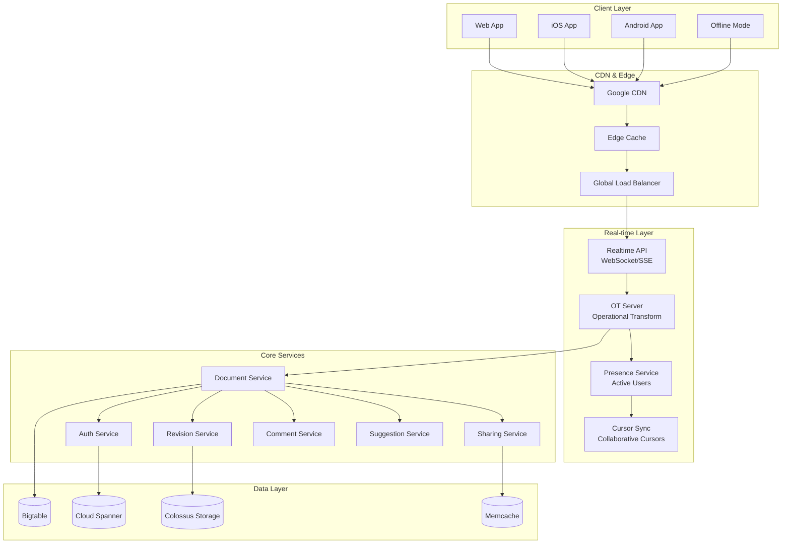
```mermaid
graph TB
    subgraph "Client Layer"
        WEB[Web App]
        IOS[iOS App]
        ANDROID[Android App]
        OFFLINE[Offline Mode]
    end

    subgraph "CDN & Edge"
        GOOGLE_CDN[Google CDN]
        EDGE_CACHE[Edge Cache]
        LOAD_BALANCER[Global Load Balancer]
    end

    subgraph "Real-time Layer"
        REALTIME_API[Realtime API<br/>WebSocket/SSE]
        OT_SERVER[OT Server<br/>Operational Transform]
        PRESENCE[Presence Service<br/>Active Users]
        CURSOR[Cursor Sync<br/>Collaborative Cursors]
    end

    subgraph "Core Services"
        DOC_SERVICE[Document Service]
        AUTH[Auth Service]
        SHARE[Sharing Service]
        REVISION[Revision Service]
        COMMENT[Comment Service]
        SUGGEST[Suggestion Service]
    end

    subgraph "Data Layer"
        BIGTABLE[(Bigtable)]
        SPANNER[(Cloud Spanner)]
        COLOSSUS[(Colossus Storage)]
        MEMCACHE[(Memcache)]
    end

    WEB --> GOOGLE_CDN
    IOS --> GOOGLE_CDN
    ANDROID --> GOOGLE_CDN
    OFFLINE --> GOOGLE_CDN

    GOOGLE_CDN --> EDGE_CACHE
    EDGE_CACHE --> LOAD_BALANCER
    LOAD_BALANCER --> REALTIME_API

    REALTIME_API --> OT_SERVER
    OT_SERVER --> PRESENCE
    PRESENCE --> CURSOR

    OT_SERVER --> DOC_SERVICE
    DOC_SERVICE --> AUTH
    DOC_SERVICE --> SHARE
    DOC_SERVICE --> REVISION
    DOC_SERVICE --> COMMENT
    DOC_SERVICE --> SUGGEST

    DOC_SERVICE --> BIGTABLE
    AUTH --> SPANNER
    REVISION --> COLOSSUS
    SHARE --> MEMCACHE
```

## Core Components

### 1. Operational Transformation (OT) Engine

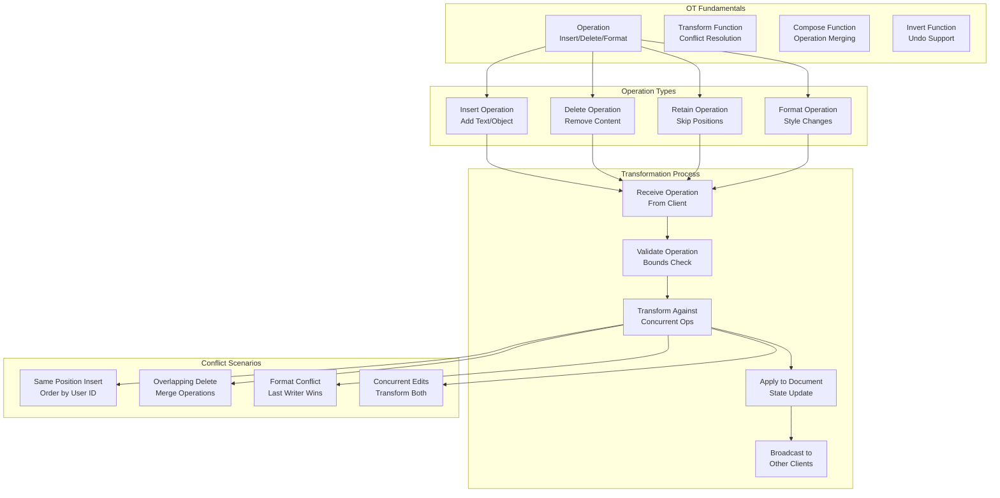
```mermaid
graph TD
    subgraph "OT Fundamentals"
        OPERATION[Operation<br/>Insert/Delete/Format]
        TRANSFORM[Transform Function<br/>Conflict Resolution]
        COMPOSE[Compose Function<br/>Operation Merging]
        INVERT[Invert Function<br/>Undo Support]
    end

    subgraph "Operation Types"
        INSERT[Insert Operation<br/>Add Text/Object]
        DELETE[Delete Operation<br/>Remove Content]
        RETAIN[Retain Operation<br/>Skip Positions]
        FORMAT[Format Operation<br/>Style Changes]
    end

    subgraph "Transformation Process"
        RECEIVE[Receive Operation<br/>From Client]
        VALIDATE[Validate Operation<br/>Bounds Check]
        TRANSFORM_OP[Transform Against<br/>Concurrent Ops]
        APPLY[Apply to Document<br/>State Update]
        BROADCAST[Broadcast to<br/>Other Clients]
    end

    subgraph "Conflict Scenarios"
        SAME_POS[Same Position Insert<br/>Order by User ID]
        OVERLAP[Overlapping Delete<br/>Merge Operations]
        FORMAT_CONFLICT[Format Conflict<br/>Last Writer Wins]
        CONCURRENT[Concurrent Edits<br/>Transform Both]
    end

    OPERATION --> INSERT
    OPERATION --> DELETE
    OPERATION --> RETAIN
    OPERATION --> FORMAT

    INSERT --> RECEIVE
    DELETE --> RECEIVE
    RETAIN --> RECEIVE
    FORMAT --> RECEIVE

    RECEIVE --> VALIDATE
    VALIDATE --> TRANSFORM_OP
    TRANSFORM_OP --> APPLY
    APPLY --> BROADCAST

    TRANSFORM_OP --> SAME_POS
    TRANSFORM_OP --> OVERLAP
    TRANSFORM_OP --> FORMAT_CONFLICT
    TRANSFORM_OP --> CONCURRENT
```

**OT Algorithm Details:**

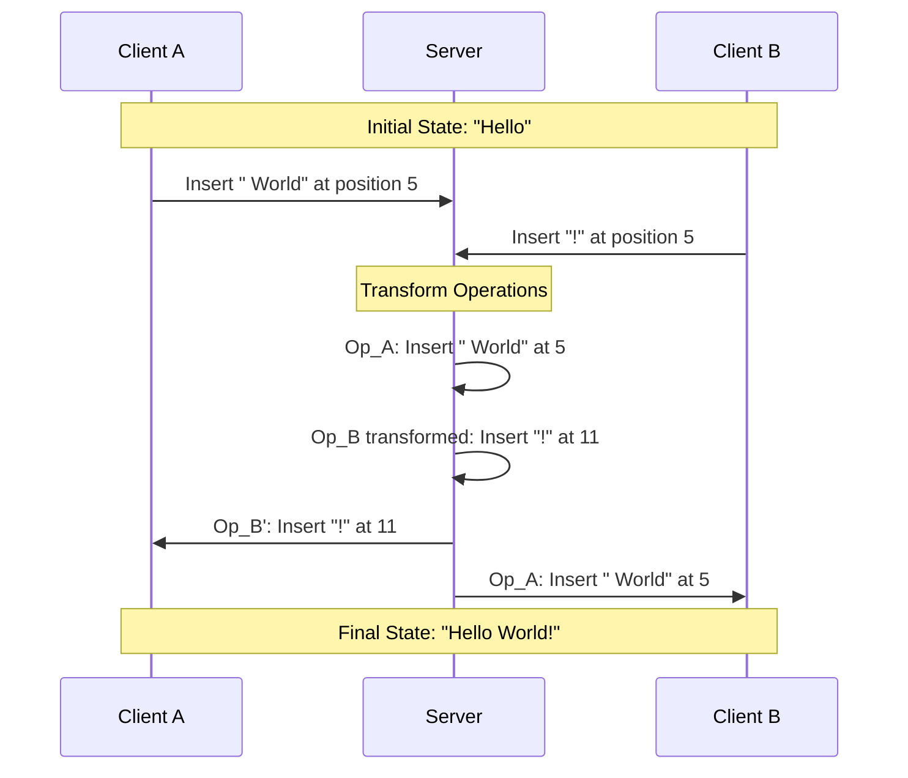
```mermaid
sequenceDiagram
    participant Client_A as Client A
    participant Server
    participant Client_B as Client B

    Note over Client_A,Client_B: Initial State: "Hello"

    Client_A->>Server: Insert " World" at position 5
    Client_B->>Server: Insert "!" at position 5

    Note over Server: Transform Operations

    Server->>Server: Op_A: Insert " World" at 5
    Server->>Server: Op_B transformed: Insert "!" at 11

    Server->>Client_A: Op_B': Insert "!" at 11
    Server->>Client_B: Op_A: Insert " World" at 5

    Note over Client_A,Client_B: Final State: "Hello World!"
```

**Key OT Features:**
- Intention preservation
- Convergence guarantee
- Causality maintenance
- Undo/redo support
- Technologies: Custom OT implementation, Protocol Buffers

### 2. Real-time Collaboration Engine

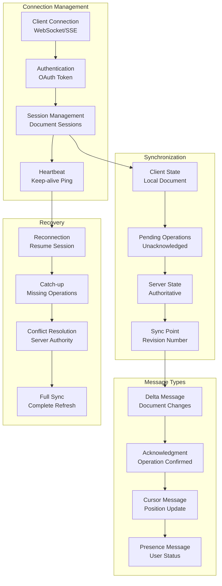
```mermaid
graph TD
    subgraph "Connection Management"
        CONNECT[Client Connection<br/>WebSocket/SSE]
        AUTH_WS[Authentication<br/>OAuth Token]
        SESSION[Session Management<br/>Document Sessions]
        HEARTBEAT[Heartbeat<br/>Keep-alive Ping]
    end

    subgraph "Synchronization"
        CLIENT_STATE[Client State<br/>Local Document]
        PENDING_OPS[Pending Operations<br/>Unacknowledged]
        SERVER_STATE[Server State<br/>Authoritative]
        SYNC_POINT[Sync Point<br/>Revision Number]
    end

    subgraph "Message Types"
        DELTA[Delta Message<br/>Document Changes]
        ACK[Acknowledgment<br/>Operation Confirmed]
        CURSOR_MSG[Cursor Message<br/>Position Update]
        PRESENCE_MSG[Presence Message<br/>User Status]
    end

    subgraph "Recovery"
        RECONNECT[Reconnection<br/>Resume Session]
        CATCH_UP[Catch-up<br/>Missing Operations]
        CONFLICT_RESOLVE[Conflict Resolution<br/>Server Authority]
        FULL_SYNC[Full Sync<br/>Complete Refresh]
    end

    CONNECT --> AUTH_WS
    AUTH_WS --> SESSION
    SESSION --> HEARTBEAT

    SESSION --> CLIENT_STATE
    CLIENT_STATE --> PENDING_OPS
    PENDING_OPS --> SERVER_STATE
    SERVER_STATE --> SYNC_POINT

    SYNC_POINT --> DELTA
    DELTA --> ACK
    ACK --> CURSOR_MSG
    CURSOR_MSG --> PRESENCE_MSG

    HEARTBEAT --> RECONNECT
    RECONNECT --> CATCH_UP
    CATCH_UP --> CONFLICT_RESOLVE
    CONFLICT_RESOLVE --> FULL_SYNC
```

### 3. Document Model

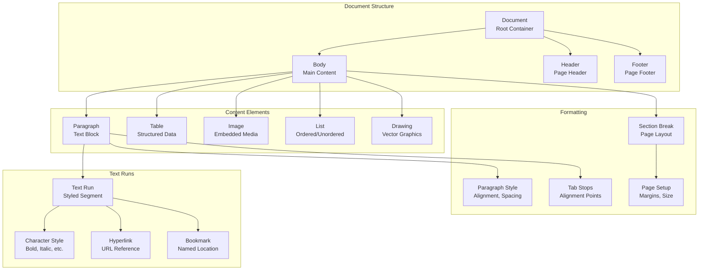
```mermaid
graph TD
    subgraph "Document Structure"
        DOC[Document<br/>Root Container]
        BODY[Body<br/>Main Content]
        HEADER[Header<br/>Page Header]
        FOOTER[Footer<br/>Page Footer]
    end

    subgraph "Content Elements"
        PARAGRAPH[Paragraph<br/>Text Block]
        TABLE[Table<br/>Structured Data]
        IMAGE[Image<br/>Embedded Media]
        LIST[List<br/>Ordered/Unordered]
        DRAWING[Drawing<br/>Vector Graphics]
    end

    subgraph "Text Runs"
        RUN[Text Run<br/>Styled Segment]
        STYLE[Character Style<br/>Bold, Italic, etc.]
        LINK[Hyperlink<br/>URL Reference]
        BOOKMARK[Bookmark<br/>Named Location]
    end

    subgraph "Formatting"
        PARAGRAPH_STYLE[Paragraph Style<br/>Alignment, Spacing]
        SECTION[Section Break<br/>Page Layout]
        PAGE_SETUP[Page Setup<br/>Margins, Size]
        TAB_STOP[Tab Stops<br/>Alignment Points]
    end

    DOC --> BODY
    DOC --> HEADER
    DOC --> FOOTER

    BODY --> PARAGRAPH
    BODY --> TABLE
    BODY --> IMAGE
    BODY --> LIST
    BODY --> DRAWING

    PARAGRAPH --> RUN
    RUN --> STYLE
    RUN --> LINK
    RUN --> BOOKMARK

    PARAGRAPH --> PARAGRAPH_STYLE
    BODY --> SECTION
    SECTION --> PAGE_SETUP
    PARAGRAPH --> TAB_STOP
```

### 4. Revision History System

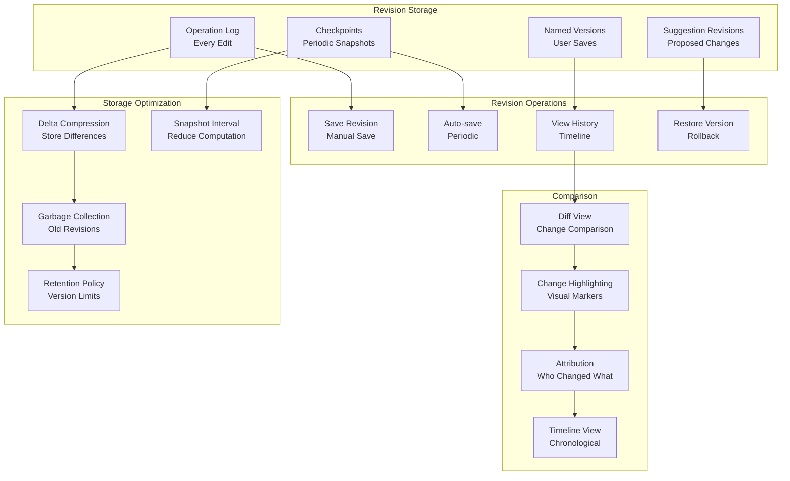
```mermaid
graph TD
    subgraph "Revision Storage"
        OPERATION_LOG[Operation Log<br/>Every Edit]
        CHECKPOINT[Checkpoints<br/>Periodic Snapshots]
        NAMED_VERSION[Named Versions<br/>User Saves]
        SUGGESTION_REV[Suggestion Revisions<br/>Proposed Changes]
    end

    subgraph "Revision Operations"
        SAVE_REV[Save Revision<br/>Manual Save]
        AUTO_SAVE[Auto-save<br/>Periodic]
        VIEW_HISTORY[View History<br/>Timeline]
        RESTORE[Restore Version<br/>Rollback]
    end

    subgraph "Comparison"
        DIFF[Diff View<br/>Change Comparison]
        HIGHLIGHT[Change Highlighting<br/>Visual Markers]
        BLAME[Attribution<br/>Who Changed What]
        TIMELINE[Timeline View<br/>Chronological]
    end

    subgraph "Storage Optimization"
        DELTA_COMPRESSION[Delta Compression<br/>Store Differences]
        SNAPSHOT_INTERVAL[Snapshot Interval<br/>Reduce Computation]
        GARBAGE_COLLECT[Garbage Collection<br/>Old Revisions]
        RETENTION[Retention Policy<br/>Version Limits]
    end

    OPERATION_LOG --> SAVE_REV
    CHECKPOINT --> AUTO_SAVE
    NAMED_VERSION --> VIEW_HISTORY
    SUGGESTION_REV --> RESTORE

    VIEW_HISTORY --> DIFF
    DIFF --> HIGHLIGHT
    HIGHLIGHT --> BLAME
    BLAME --> TIMELINE

    OPERATION_LOG --> DELTA_COMPRESSION
    CHECKPOINT --> SNAPSHOT_INTERVAL
    DELTA_COMPRESSION --> GARBAGE_COLLECT
    GARBAGE_COLLECT --> RETENTION
```

**Revision Features:**
- Unlimited revision history
- View changes by any user
- Restore any previous version
- Named versions for milestones
- Delta-based storage optimization

### 5. Sharing & Permissions System

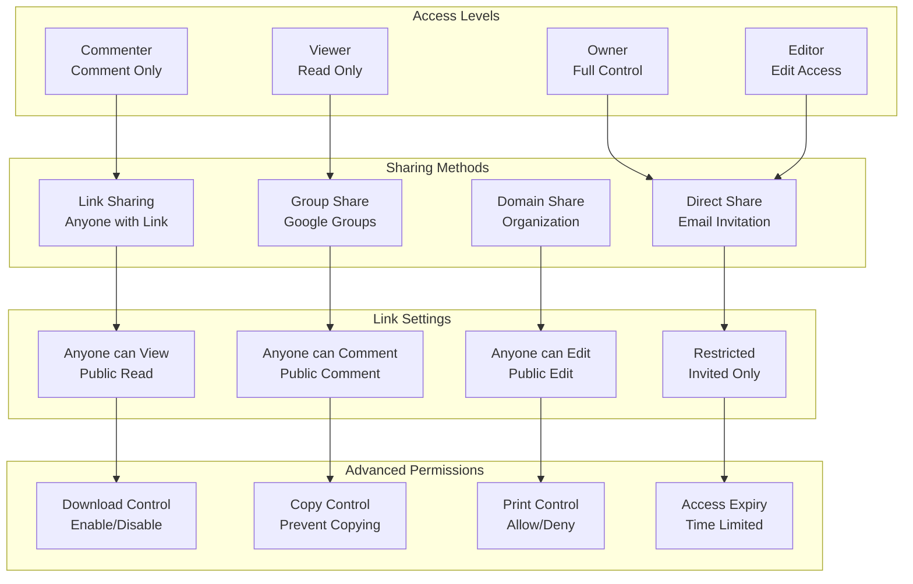
```mermaid
graph TD
    subgraph "Access Levels"
        OWNER[Owner<br/>Full Control]
        EDITOR[Editor<br/>Edit Access]
        COMMENTER[Commenter<br/>Comment Only]
        VIEWER[Viewer<br/>Read Only]
    end

    subgraph "Sharing Methods"
        DIRECT[Direct Share<br/>Email Invitation]
        LINK[Link Sharing<br/>Anyone with Link]
        GROUP[Group Share<br/>Google Groups]
        DOMAIN[Domain Share<br/>Organization]
    end

    subgraph "Link Settings"
        RESTRICTED[Restricted<br/>Invited Only]
        ANYONE_VIEW[Anyone can View<br/>Public Read]
        ANYONE_COMMENT[Anyone can Comment<br/>Public Comment]
        ANYONE_EDIT[Anyone can Edit<br/>Public Edit]
    end

    subgraph "Advanced Permissions"
        DOWNLOAD[Download Control<br/>Enable/Disable]
        COPY[Copy Control<br/>Prevent Copying]
        PRINT[Print Control<br/>Allow/Deny]
        EXPIRY[Access Expiry<br/>Time Limited]
    end

    OWNER --> DIRECT
    EDITOR --> DIRECT
    COMMENTER --> LINK
    VIEWER --> GROUP

    DIRECT --> RESTRICTED
    LINK --> ANYONE_VIEW
    GROUP --> ANYONE_COMMENT
    DOMAIN --> ANYONE_EDIT

    ANYONE_VIEW --> DOWNLOAD
    ANYONE_COMMENT --> COPY
    ANYONE_EDIT --> PRINT
    RESTRICTED --> EXPIRY
```

### 6. Comments & Suggestions System

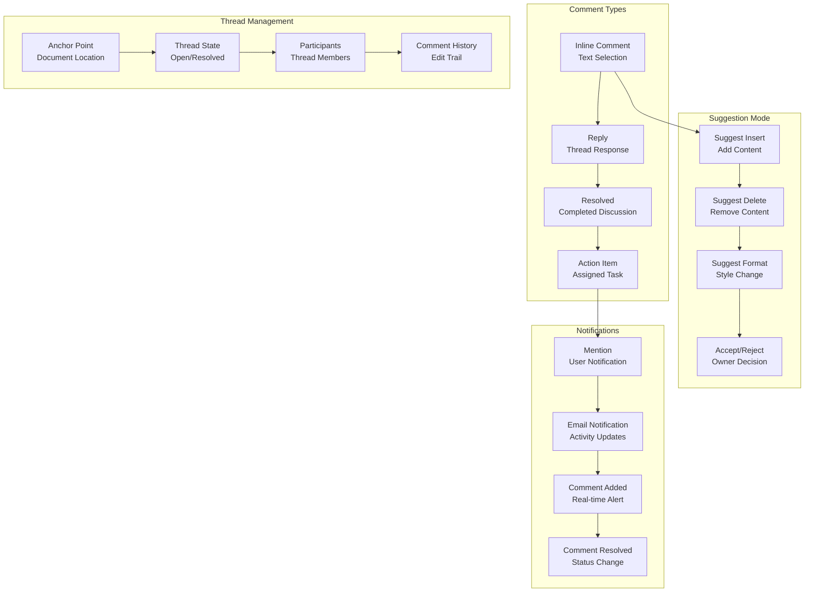
```mermaid
graph TD
    subgraph "Comment Types"
        INLINE[Inline Comment<br/>Text Selection]
        REPLY[Reply<br/>Thread Response]
        RESOLVED[Resolved<br/>Completed Discussion]
        ACTION_ITEM[Action Item<br/>Assigned Task]
    end

    subgraph "Suggestion Mode"
        SUGGEST_INSERT[Suggest Insert<br/>Add Content]
        SUGGEST_DELETE[Suggest Delete<br/>Remove Content]
        SUGGEST_FORMAT[Suggest Format<br/>Style Change]
        ACCEPT_REJECT[Accept/Reject<br/>Owner Decision]
    end

    subgraph "Notifications"
        MENTION[Mention<br/>User Notification]
        EMAIL_NOTIFY[Email Notification<br/>Activity Updates]
        COMMENT_NOTIFY[Comment Added<br/>Real-time Alert]
        RESOLVED_NOTIFY[Comment Resolved<br/>Status Change]
    end

    subgraph "Thread Management"
        ANCHOR[Anchor Point<br/>Document Location]
        THREAD_STATE[Thread State<br/>Open/Resolved]
        PARTICIPANTS[Participants<br/>Thread Members]
        HISTORY[Comment History<br/>Edit Trail]
    end

    INLINE --> REPLY
    REPLY --> RESOLVED
    RESOLVED --> ACTION_ITEM

    INLINE --> SUGGEST_INSERT
    SUGGEST_INSERT --> SUGGEST_DELETE
    SUGGEST_DELETE --> SUGGEST_FORMAT
    SUGGEST_FORMAT --> ACCEPT_REJECT

    ACTION_ITEM --> MENTION
    MENTION --> EMAIL_NOTIFY
    EMAIL_NOTIFY --> COMMENT_NOTIFY
    COMMENT_NOTIFY --> RESOLVED_NOTIFY

    ANCHOR --> THREAD_STATE
    THREAD_STATE --> PARTICIPANTS
    PARTICIPANTS --> HISTORY
```

## Data Architecture

### 1. Bigtable (Document Storage)

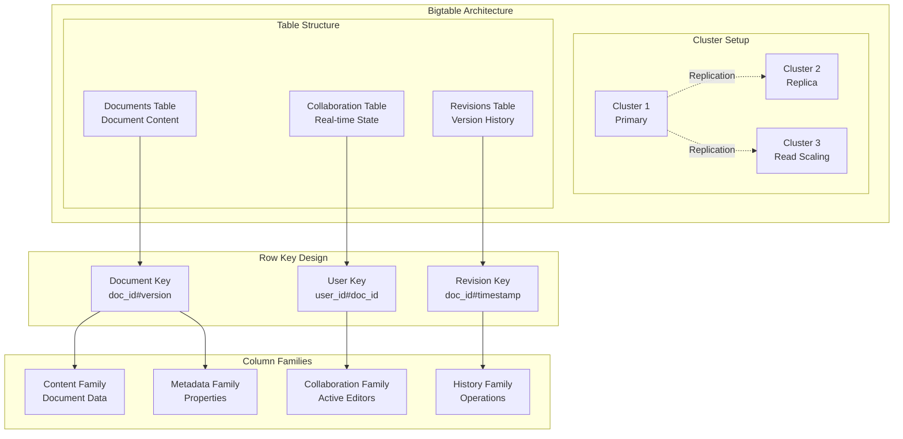
```mermaid
graph TD
    subgraph "Bigtable Architecture"
        subgraph "Cluster Setup"
            CLUSTER1[Cluster 1<br/>Primary]
            CLUSTER2[Cluster 2<br/>Replica]
            CLUSTER3[Cluster 3<br/>Read Scaling]
        end

        subgraph "Table Structure"
            DOC_TABLE[Documents Table<br/>Document Content]
            REVISION_TABLE[Revisions Table<br/>Version History]
            COLLAB_TABLE[Collaboration Table<br/>Real-time State]
        end
    end

    subgraph "Row Key Design"
        DOC_KEY[Document Key<br/>doc_id#version]
        USER_KEY[User Key<br/>user_id#doc_id]
        REVISION_KEY[Revision Key<br/>doc_id#timestamp]
    end

    subgraph "Column Families"
        CONTENT_CF[Content Family<br/>Document Data]
        META_CF[Metadata Family<br/>Properties]
        COLLAB_CF[Collaboration Family<br/>Active Editors]
        HISTORY_CF[History Family<br/>Operations]
    end

    CLUSTER1 -.->|Replication| CLUSTER2
    CLUSTER1 -.->|Replication| CLUSTER3

    DOC_TABLE --> DOC_KEY
    REVISION_TABLE --> REVISION_KEY
    COLLAB_TABLE --> USER_KEY

    DOC_KEY --> CONTENT_CF
    DOC_KEY --> META_CF
    USER_KEY --> COLLAB_CF
    REVISION_KEY --> HISTORY_CF
```

### 2. Cloud Spanner (Metadata)

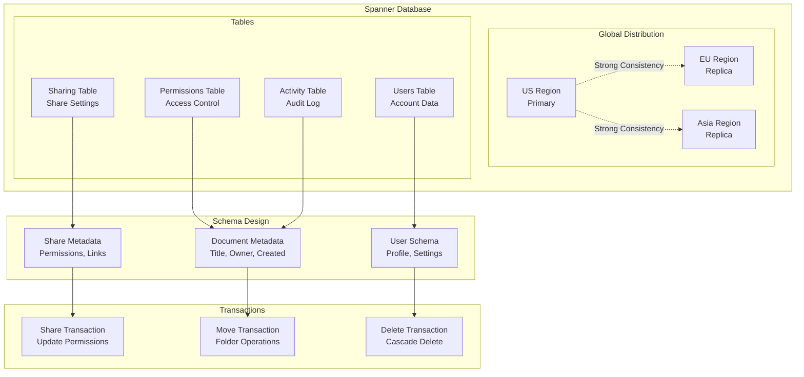
```mermaid
graph TD
    subgraph "Spanner Database"
        subgraph "Global Distribution"
            REGION1[US Region<br/>Primary]
            REGION2[EU Region<br/>Replica]
            REGION3[Asia Region<br/>Replica]
        end

        subgraph "Tables"
            USERS[Users Table<br/>Account Data]
            PERMISSIONS[Permissions Table<br/>Access Control]
            SHARING[Sharing Table<br/>Share Settings]
            ACTIVITY[Activity Table<br/>Audit Log]
        end
    end

    subgraph "Schema Design"
        USER_SCHEMA[User Schema<br/>Profile, Settings]
        DOC_META[Document Metadata<br/>Title, Owner, Created]
        SHARE_META[Share Metadata<br/>Permissions, Links]
    end

    subgraph "Transactions"
        SHARE_TX[Share Transaction<br/>Update Permissions]
        MOVE_TX[Move Transaction<br/>Folder Operations]
        DELETE_TX[Delete Transaction<br/>Cascade Delete]
    end

    REGION1 -.->|Strong Consistency| REGION2
    REGION1 -.->|Strong Consistency| REGION3

    USERS --> USER_SCHEMA
    PERMISSIONS --> DOC_META
    SHARING --> SHARE_META
    ACTIVITY --> DOC_META

    SHARE_META --> SHARE_TX
    DOC_META --> MOVE_TX
    USER_SCHEMA --> DELETE_TX
```

### 3. Colossus (File Storage)

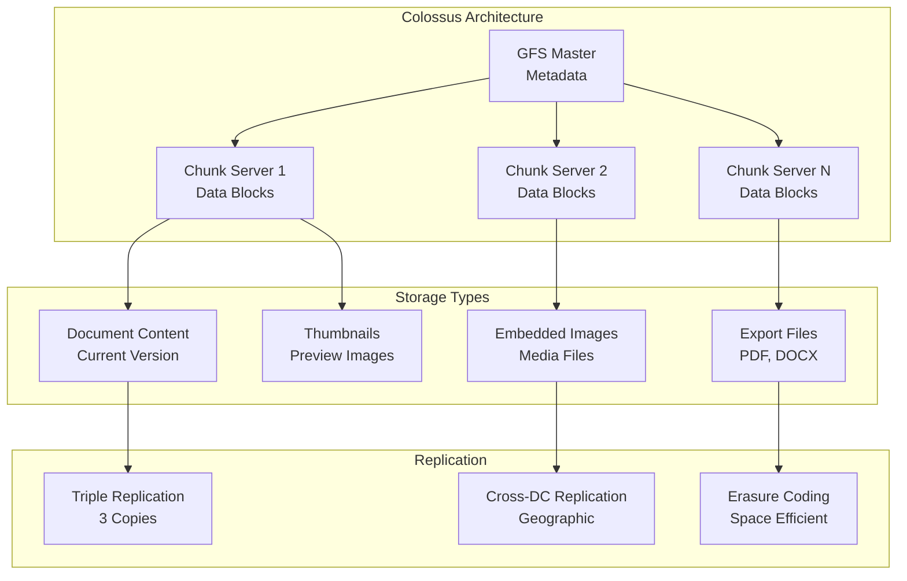
```mermaid
graph TD
    subgraph "Colossus Architecture"
        GFS_MASTER[GFS Master<br/>Metadata]
        CHUNK_SERVER1[Chunk Server 1<br/>Data Blocks]
        CHUNK_SERVER2[Chunk Server 2<br/>Data Blocks]
        CHUNK_SERVER3[Chunk Server N<br/>Data Blocks]
    end

    subgraph "Storage Types"
        DOC_CONTENT[Document Content<br/>Current Version]
        IMAGES[Embedded Images<br/>Media Files]
        EXPORTS[Export Files<br/>PDF, DOCX]
        THUMBNAILS[Thumbnails<br/>Preview Images]
    end

    subgraph "Replication"
        TRIPLE_REP[Triple Replication<br/>3 Copies]
        CROSS_DC[Cross-DC Replication<br/>Geographic]
        ERASURE[Erasure Coding<br/>Space Efficient]
    end

    GFS_MASTER --> CHUNK_SERVER1
    GFS_MASTER --> CHUNK_SERVER2
    GFS_MASTER --> CHUNK_SERVER3

    CHUNK_SERVER1 --> DOC_CONTENT
    CHUNK_SERVER2 --> IMAGES
    CHUNK_SERVER3 --> EXPORTS
    CHUNK_SERVER1 --> THUMBNAILS

    DOC_CONTENT --> TRIPLE_REP
    IMAGES --> CROSS_DC
    EXPORTS --> ERASURE
```

### 4. Memcache (Caching Layer)

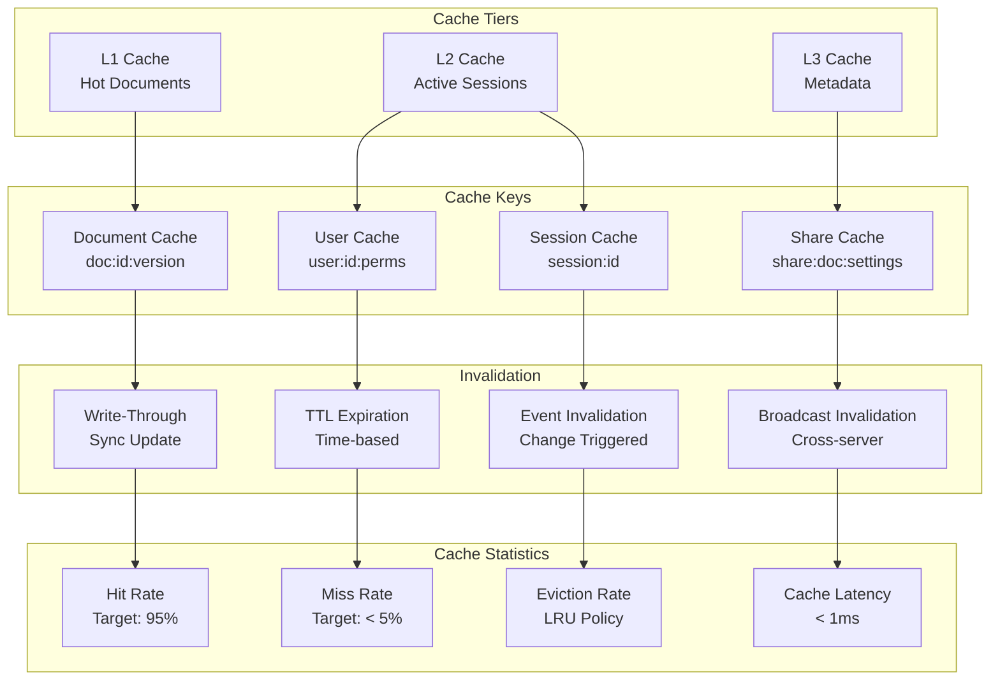
```mermaid
graph TD
    subgraph "Cache Tiers"
        L1_CACHE[L1 Cache<br/>Hot Documents]
        L2_CACHE[L2 Cache<br/>Active Sessions]
        L3_CACHE[L3 Cache<br/>Metadata]
    end

    subgraph "Cache Keys"
        DOC_CACHE[Document Cache<br/>doc:id:version]
        USER_CACHE[User Cache<br/>user:id:perms]
        SESSION_CACHE[Session Cache<br/>session:id]
        SHARE_CACHE[Share Cache<br/>share:doc:settings]
    end

    subgraph "Invalidation"
        WRITE_THROUGH[Write-Through<br/>Sync Update]
        TTL_EXPIRE[TTL Expiration<br/>Time-based]
        EVENT_INVALID[Event Invalidation<br/>Change Triggered]
        BROADCAST[Broadcast Invalidation<br/>Cross-server]
    end

    subgraph "Cache Statistics"
        HIT_RATE[Hit Rate<br/>Target: 95%]
        MISS_RATE[Miss Rate<br/>Target: < 5%]
        EVICTION[Eviction Rate<br/>LRU Policy]
        LATENCY_CACHE[Cache Latency<br/>< 1ms]
    end

    L1_CACHE --> DOC_CACHE
    L2_CACHE --> USER_CACHE
    L2_CACHE --> SESSION_CACHE
    L3_CACHE --> SHARE_CACHE

    DOC_CACHE --> WRITE_THROUGH
    USER_CACHE --> TTL_EXPIRE
    SESSION_CACHE --> EVENT_INVALID
    SHARE_CACHE --> BROADCAST

    WRITE_THROUGH --> HIT_RATE
    TTL_EXPIRE --> MISS_RATE
    EVENT_INVALID --> EVICTION
    BROADCAST --> LATENCY_CACHE
```

## Offline Support

### 1. Offline Architecture

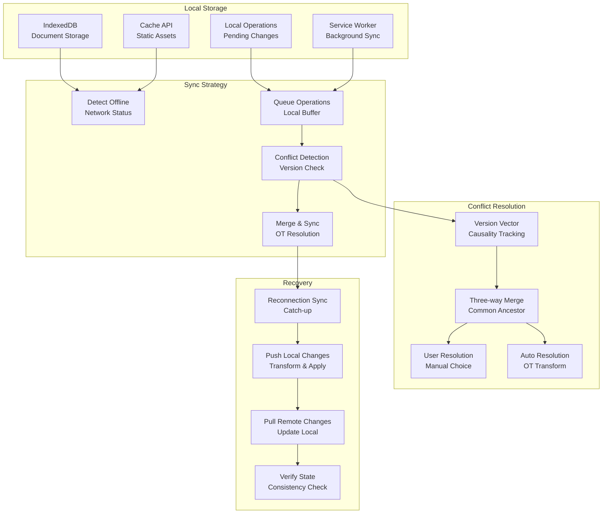
```mermaid
graph TD
    subgraph "Local Storage"
        INDEXEDDB[IndexedDB<br/>Document Storage]
        CACHE_API[Cache API<br/>Static Assets]
        LOCAL_OPS[Local Operations<br/>Pending Changes]
        SERVICE_WORKER[Service Worker<br/>Background Sync]
    end

    subgraph "Sync Strategy"
        DETECT_OFFLINE[Detect Offline<br/>Network Status]
        QUEUE_OPS[Queue Operations<br/>Local Buffer]
        CONFLICT_DETECT[Conflict Detection<br/>Version Check]
        MERGE_SYNC[Merge & Sync<br/>OT Resolution]
    end

    subgraph "Conflict Resolution"
        VERSION_VECTOR[Version Vector<br/>Causality Tracking]
        THREE_WAY_MERGE[Three-way Merge<br/>Common Ancestor]
        USER_RESOLVE[User Resolution<br/>Manual Choice]
        AUTO_RESOLVE[Auto Resolution<br/>OT Transform]
    end

    subgraph "Recovery"
        RECONNECT_SYNC[Reconnection Sync<br/>Catch-up]
        PUSH_LOCAL[Push Local Changes<br/>Transform & Apply]
        PULL_REMOTE[Pull Remote Changes<br/>Update Local]
        VERIFY_STATE[Verify State<br/>Consistency Check]
    end

    INDEXEDDB --> DETECT_OFFLINE
    CACHE_API --> DETECT_OFFLINE
    LOCAL_OPS --> QUEUE_OPS
    SERVICE_WORKER --> QUEUE_OPS

    QUEUE_OPS --> CONFLICT_DETECT
    CONFLICT_DETECT --> MERGE_SYNC

    CONFLICT_DETECT --> VERSION_VECTOR
    VERSION_VECTOR --> THREE_WAY_MERGE
    THREE_WAY_MERGE --> USER_RESOLVE
    THREE_WAY_MERGE --> AUTO_RESOLVE

    MERGE_SYNC --> RECONNECT_SYNC
    RECONNECT_SYNC --> PUSH_LOCAL
    PUSH_LOCAL --> PULL_REMOTE
    PULL_REMOTE --> VERIFY_STATE
```

**Offline Features:**
- Full document editing offline
- Automatic sync on reconnection
- Conflict detection and resolution
- Service worker for background sync
- Progressive Web App (PWA) support

## Scalability & Performance

### 1. Global Infrastructure

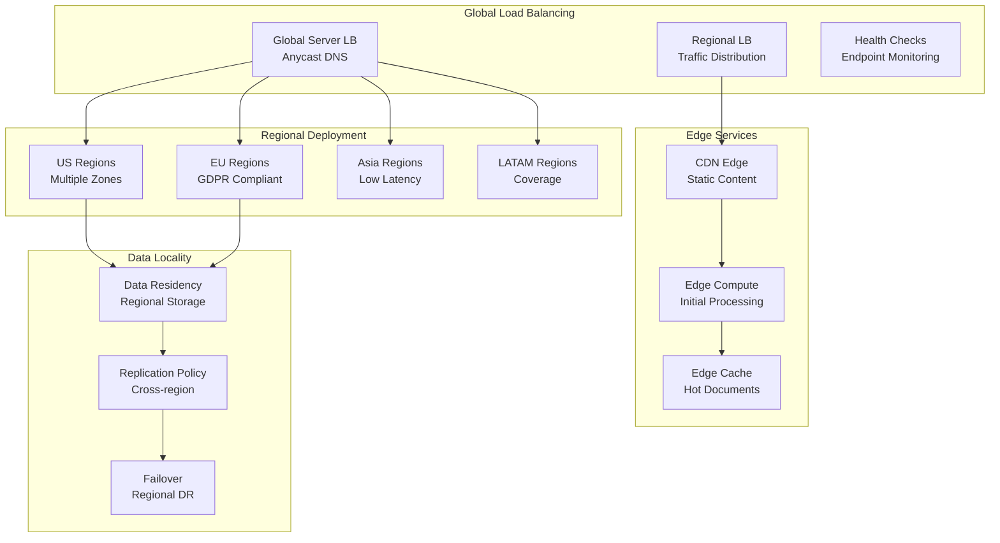
```mermaid
graph TB
    subgraph "Global Load Balancing"
        GSLB[Global Server LB<br/>Anycast DNS]
        REGIONAL_LB[Regional LB<br/>Traffic Distribution]
        HEALTH_CHECK[Health Checks<br/>Endpoint Monitoring]
    end

    subgraph "Regional Deployment"
        US_REGION[US Regions<br/>Multiple Zones]
        EU_REGION[EU Regions<br/>GDPR Compliant]
        ASIA_REGION[Asia Regions<br/>Low Latency]
        LATAM_REGION[LATAM Regions<br/>Coverage]
    end

    subgraph "Edge Services"
        CDN_EDGE[CDN Edge<br/>Static Content]
        EDGE_COMPUTE[Edge Compute<br/>Initial Processing]
        EDGE_CACHE[Edge Cache<br/>Hot Documents]
    end

    subgraph "Data Locality"
        DATA_RESIDENCY[Data Residency<br/>Regional Storage]
        REPLICATION_POLICY[Replication Policy<br/>Cross-region]
        FAILOVER[Failover<br/>Regional DR]
    end

    GSLB --> US_REGION
    GSLB --> EU_REGION
    GSLB --> ASIA_REGION
    GSLB --> LATAM_REGION

    REGIONAL_LB --> CDN_EDGE
    CDN_EDGE --> EDGE_COMPUTE
    EDGE_COMPUTE --> EDGE_CACHE

    US_REGION --> DATA_RESIDENCY
    EU_REGION --> DATA_RESIDENCY
    DATA_RESIDENCY --> REPLICATION_POLICY
    REPLICATION_POLICY --> FAILOVER
```

### 2. Auto-Scaling

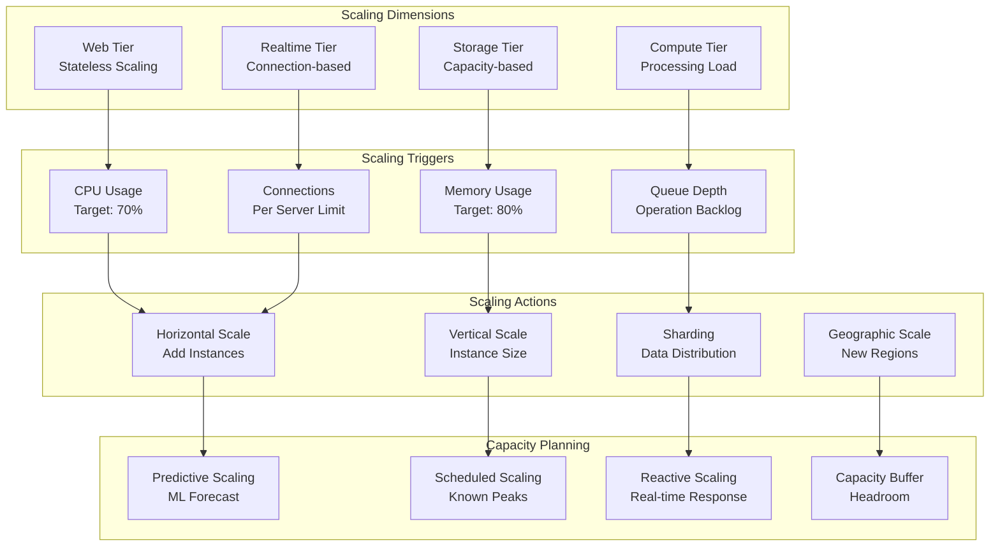
```mermaid
graph TD
    subgraph "Scaling Dimensions"
        WEB_SCALE[Web Tier<br/>Stateless Scaling]
        REALTIME_SCALE[Realtime Tier<br/>Connection-based]
        STORAGE_SCALE[Storage Tier<br/>Capacity-based]
        COMPUTE_SCALE[Compute Tier<br/>Processing Load]
    end

    subgraph "Scaling Triggers"
        CPU_TRIGGER[CPU Usage<br/>Target: 70%]
        MEMORY_TRIGGER[Memory Usage<br/>Target: 80%]
        CONNECTION_TRIGGER[Connections<br/>Per Server Limit]
        QUEUE_TRIGGER[Queue Depth<br/>Operation Backlog]
    end

    subgraph "Scaling Actions"
        HORIZONTAL[Horizontal Scale<br/>Add Instances]
        VERTICAL[Vertical Scale<br/>Instance Size]
        GEOGRAPHIC[Geographic Scale<br/>New Regions]
        SHARD[Sharding<br/>Data Distribution]
    end

    subgraph "Capacity Planning"
        PREDICT[Predictive Scaling<br/>ML Forecast]
        SCHEDULED[Scheduled Scaling<br/>Known Peaks]
        REACTIVE[Reactive Scaling<br/>Real-time Response]
        BUFFER[Capacity Buffer<br/>Headroom]
    end

    WEB_SCALE --> CPU_TRIGGER
    REALTIME_SCALE --> CONNECTION_TRIGGER
    STORAGE_SCALE --> MEMORY_TRIGGER
    COMPUTE_SCALE --> QUEUE_TRIGGER

    CPU_TRIGGER --> HORIZONTAL
    CONNECTION_TRIGGER --> HORIZONTAL
    MEMORY_TRIGGER --> VERTICAL
    QUEUE_TRIGGER --> SHARD

    HORIZONTAL --> PREDICT
    VERTICAL --> SCHEDULED
    SHARD --> REACTIVE
    GEOGRAPHIC --> BUFFER
```

### 3. Performance Optimization

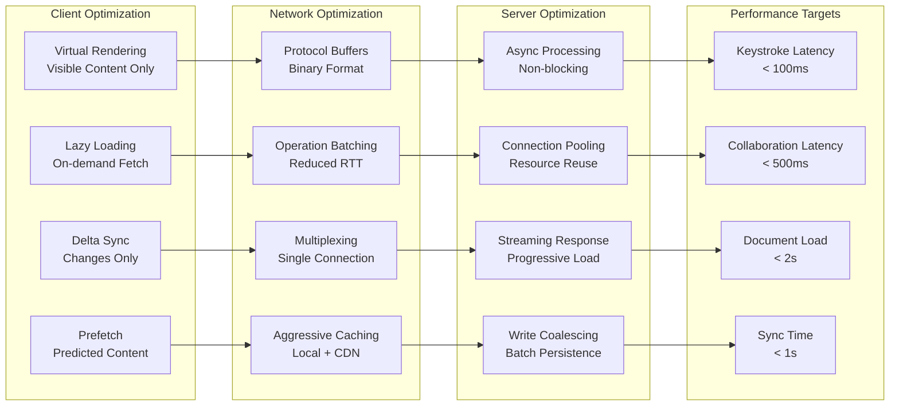
```mermaid
graph LR
    subgraph "Client Optimization"
        VIRTUAL_RENDER[Virtual Rendering<br/>Visible Content Only]
        LAZY_LOAD[Lazy Loading<br/>On-demand Fetch]
        DELTA_SYNC[Delta Sync<br/>Changes Only]
        PREFETCH[Prefetch<br/>Predicted Content]
    end

    subgraph "Network Optimization"
        COMPRESSION[Protocol Buffers<br/>Binary Format]
        BATCHING[Operation Batching<br/>Reduced RTT]
        MULTIPLEXING[Multiplexing<br/>Single Connection]
        CACHING[Aggressive Caching<br/>Local + CDN]
    end

    subgraph "Server Optimization"
        ASYNC_PROCESSING[Async Processing<br/>Non-blocking]
        CONNECTION_POOL[Connection Pooling<br/>Resource Reuse]
        STREAMING[Streaming Response<br/>Progressive Load]
        COALESCING[Write Coalescing<br/>Batch Persistence]
    end

    subgraph "Performance Targets"
        KEYSTROKE[Keystroke Latency<br/>< 100ms]
        COLLAB_LATENCY[Collaboration Latency<br/>< 500ms]
        LOAD_TIME[Document Load<br/>< 2s]
        SYNC_TIME[Sync Time<br/>< 1s]
    end

    VIRTUAL_RENDER --> COMPRESSION
    LAZY_LOAD --> BATCHING
    DELTA_SYNC --> MULTIPLEXING
    PREFETCH --> CACHING

    COMPRESSION --> ASYNC_PROCESSING
    BATCHING --> CONNECTION_POOL
    MULTIPLEXING --> STREAMING
    CACHING --> COALESCING

    ASYNC_PROCESSING --> KEYSTROKE
    CONNECTION_POOL --> COLLAB_LATENCY
    STREAMING --> LOAD_TIME
    COALESCING --> SYNC_TIME
```

## Security Architecture

### 1. Multi-Layer Security

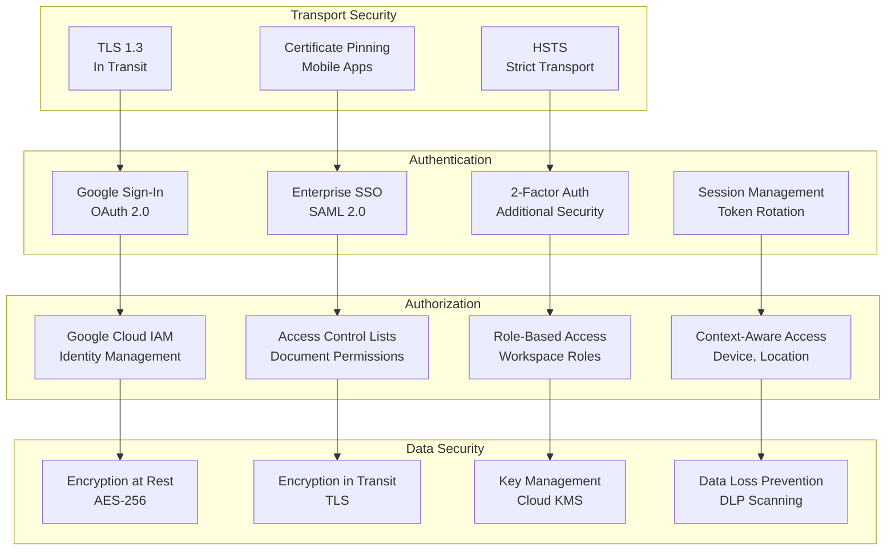
```mermaid
graph TB
    subgraph "Transport Security"
        TLS[TLS 1.3<br/>In Transit]
        CERT_PIN[Certificate Pinning<br/>Mobile Apps]
        HSTS[HSTS<br/>Strict Transport]
    end

    subgraph "Authentication"
        GOOGLE_AUTH[Google Sign-In<br/>OAuth 2.0]
        SSO[Enterprise SSO<br/>SAML 2.0]
        TWO_FACTOR[2-Factor Auth<br/>Additional Security]
        SESSION_MGMT[Session Management<br/>Token Rotation]
    end

    subgraph "Authorization"
        IAM[Google Cloud IAM<br/>Identity Management]
        ACL[Access Control Lists<br/>Document Permissions]
        RBAC[Role-Based Access<br/>Workspace Roles]
        CONTEXT[Context-Aware Access<br/>Device, Location]
    end

    subgraph "Data Security"
        ENCRYPT_REST[Encryption at Rest<br/>AES-256]
        ENCRYPT_TRANSIT[Encryption in Transit<br/>TLS]
        KEY_MGMT[Key Management<br/>Cloud KMS]
        DATA_LOSS[Data Loss Prevention<br/>DLP Scanning]
    end

    TLS --> GOOGLE_AUTH
    CERT_PIN --> SSO
    HSTS --> TWO_FACTOR

    GOOGLE_AUTH --> IAM
    SSO --> ACL
    TWO_FACTOR --> RBAC
    SESSION_MGMT --> CONTEXT

    IAM --> ENCRYPT_REST
    ACL --> ENCRYPT_TRANSIT
    RBAC --> KEY_MGMT
    CONTEXT --> DATA_LOSS
```

### 2. Enterprise Security

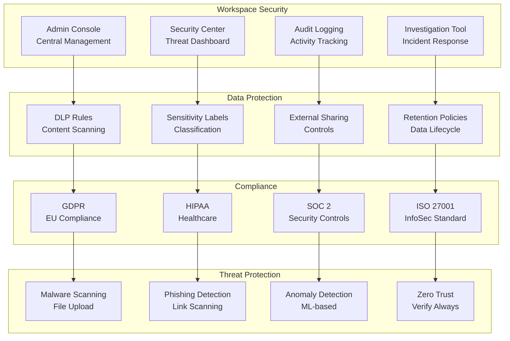
```mermaid
graph TD
    subgraph "Workspace Security"
        ADMIN_CONSOLE[Admin Console<br/>Central Management]
        SECURITY_CENTER[Security Center<br/>Threat Dashboard]
        AUDIT_LOG[Audit Logging<br/>Activity Tracking]
        INVESTIGATION[Investigation Tool<br/>Incident Response]
    end

    subgraph "Data Protection"
        DLP_RULES[DLP Rules<br/>Content Scanning]
        SENSITIVITY_LABELS[Sensitivity Labels<br/>Classification]
        EXTERNAL_SHARE[External Sharing<br/>Controls]
        RETENTION[Retention Policies<br/>Data Lifecycle]
    end

    subgraph "Compliance"
        GDPR[GDPR<br/>EU Compliance]
        HIPAA[HIPAA<br/>Healthcare]
        SOC2[SOC 2<br/>Security Controls]
        ISO27001[ISO 27001<br/>InfoSec Standard]
    end

    subgraph "Threat Protection"
        MALWARE_SCAN[Malware Scanning<br/>File Upload]
        PHISHING[Phishing Detection<br/>Link Scanning]
        ANOMALY[Anomaly Detection<br/>ML-based]
        ZERO_TRUST[Zero Trust<br/>Verify Always]
    end

    ADMIN_CONSOLE --> DLP_RULES
    SECURITY_CENTER --> SENSITIVITY_LABELS
    AUDIT_LOG --> EXTERNAL_SHARE
    INVESTIGATION --> RETENTION

    DLP_RULES --> GDPR
    SENSITIVITY_LABELS --> HIPAA
    EXTERNAL_SHARE --> SOC2
    RETENTION --> ISO27001

    GDPR --> MALWARE_SCAN
    HIPAA --> PHISHING
    SOC2 --> ANOMALY
    ISO27001 --> ZERO_TRUST
```

## Monitoring & Observability

### 1. Monitoring Stack

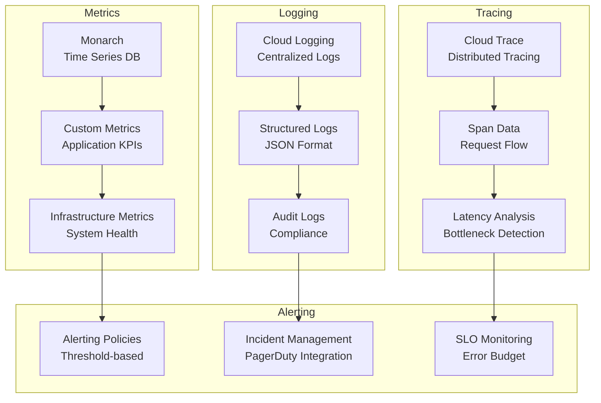
```mermaid
graph TD
    subgraph "Metrics"
        MONARCH[Monarch<br/>Time Series DB]
        CUSTOM_METRICS[Custom Metrics<br/>Application KPIs]
        INFRA_METRICS[Infrastructure Metrics<br/>System Health]
    end

    subgraph "Logging"
        CLOUD_LOGGING[Cloud Logging<br/>Centralized Logs]
        STRUCTURED[Structured Logs<br/>JSON Format]
        AUDIT_LOGS[Audit Logs<br/>Compliance]
    end

    subgraph "Tracing"
        CLOUD_TRACE[Cloud Trace<br/>Distributed Tracing]
        SPAN_DATA[Span Data<br/>Request Flow]
        LATENCY_ANALYSIS[Latency Analysis<br/>Bottleneck Detection]
    end

    subgraph "Alerting"
        MONITORING_ALERT[Alerting Policies<br/>Threshold-based]
        INCIDENT_MGMT[Incident Management<br/>PagerDuty Integration]
        SLO_MONITOR[SLO Monitoring<br/>Error Budget]
    end

    MONARCH --> CUSTOM_METRICS
    CUSTOM_METRICS --> INFRA_METRICS

    CLOUD_LOGGING --> STRUCTURED
    STRUCTURED --> AUDIT_LOGS

    CLOUD_TRACE --> SPAN_DATA
    SPAN_DATA --> LATENCY_ANALYSIS

    INFRA_METRICS --> MONITORING_ALERT
    AUDIT_LOGS --> INCIDENT_MGMT
    LATENCY_ANALYSIS --> SLO_MONITOR
```

### 2. Key Metrics

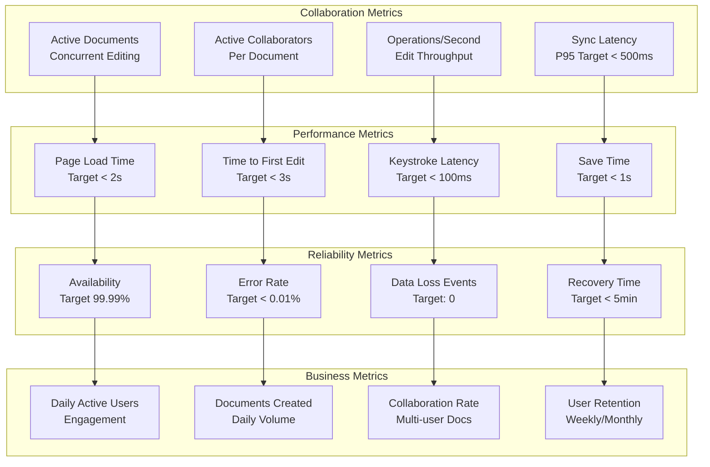
```mermaid
graph TD
    subgraph "Collaboration Metrics"
        ACTIVE_DOCS[Active Documents<br/>Concurrent Editing]
        ACTIVE_USERS[Active Collaborators<br/>Per Document]
        OPS_PER_SEC[Operations/Second<br/>Edit Throughput]
        SYNC_LATENCY[Sync Latency<br/>P95 Target < 500ms]
    end

    subgraph "Performance Metrics"
        PAGE_LOAD[Page Load Time<br/>Target < 2s]
        TIME_TO_EDIT[Time to First Edit<br/>Target < 3s]
        KEYSTROKE_LAT[Keystroke Latency<br/>Target < 100ms]
        SAVE_TIME[Save Time<br/>Target < 1s]
    end

    subgraph "Reliability Metrics"
        AVAILABILITY[Availability<br/>Target 99.99%]
        ERROR_RATE[Error Rate<br/>Target < 0.01%]
        DATA_LOSS[Data Loss Events<br/>Target: 0]
        RECOVERY_TIME[Recovery Time<br/>Target < 5min]
    end

    subgraph "Business Metrics"
        DAU_METRIC[Daily Active Users<br/>Engagement]
        DOCS_CREATED[Documents Created<br/>Daily Volume]
        COLLAB_RATE[Collaboration Rate<br/>Multi-user Docs]
        RETENTION[User Retention<br/>Weekly/Monthly]
    end

    ACTIVE_DOCS --> PAGE_LOAD
    ACTIVE_USERS --> TIME_TO_EDIT
    OPS_PER_SEC --> KEYSTROKE_LAT
    SYNC_LATENCY --> SAVE_TIME

    PAGE_LOAD --> AVAILABILITY
    TIME_TO_EDIT --> ERROR_RATE
    KEYSTROKE_LAT --> DATA_LOSS
    SAVE_TIME --> RECOVERY_TIME

    AVAILABILITY --> DAU_METRIC
    ERROR_RATE --> DOCS_CREATED
    DATA_LOSS --> COLLAB_RATE
    RECOVERY_TIME --> RETENTION
```

## Mobile Architecture

### 1. Mobile App Design

```mermaid
graph TD
    subgraph "Mobile Platforms"
        IOS_APP[iOS App<br/>Swift/UIKit]
        ANDROID_APP[Android App<br/>Kotlin]
    end

    subgraph "Core Features"
        EDITOR[Document Editor<br/>Rich Text]
        OFFLINE_MODE[Offline Mode<br/>Local Editing]
        COLLAB_MOBILE[Collaboration<br/>Real-time Sync]
        CAMERA[Camera Integration<br/>Document Scan]
    end

    subgraph "Sync Strategy"
        BACKGROUND_SYNC[Background Sync<br/>iOS/Android APIs]
        CONFLICT_MOBILE[Conflict Resolution<br/>Auto-merge]
        DELTA_MOBILE[Delta Sync<br/>Bandwidth Efficient]
        PRIORITY_SYNC[Priority Queue<br/>Important First]
    end

    subgraph "Performance"
        NATIVE_RENDER[Native Rendering<br/>Smooth Scrolling]
        MEMORY_MGT[Memory Management<br/>Large Documents]
        BATTERY_OPT[Battery Optimization<br/>Efficient Sync]
        NETWORK_OPT[Network Optimization<br/>Compression]
    end

    IOS_APP --> EDITOR
    ANDROID_APP --> EDITOR
    EDITOR --> OFFLINE_MODE
    OFFLINE_MODE --> COLLAB_MOBILE
    COLLAB_MOBILE --> CAMERA

    CAMERA --> BACKGROUND_SYNC
    BACKGROUND_SYNC --> CONFLICT_MOBILE
    CONFLICT_MOBILE --> DELTA_MOBILE
    DELTA_MOBILE --> PRIORITY_SYNC

    PRIORITY_SYNC --> NATIVE_RENDER
    NATIVE_RENDER --> MEMORY_MGT
    MEMORY_MGT --> BATTERY_OPT
    BATTERY_OPT --> NETWORK_OPT
```

## Deployment and DevOps

### 1. Continuous Deployment Pipeline

```mermaid
gitGraph
    commit id: "Feature Dev"
    branch feature-branch
    checkout feature-branch
    commit id: "Code Changes"
    commit id: "Unit Tests"
    checkout main
    merge feature-branch
    commit id: "Integration Tests" type: HIGHLIGHT
    commit id: "Build & Package"
    commit id: "Canary Deploy" type: HIGHLIGHT
    commit id: "Global Rollout" type: REVERSE
```

```mermaid
flowchart LR
    subgraph "Development"
        CODE[Code Commit]
        BUILD[Build & Test<br/>Hermetic Builds]
        ARTIFACT[Binary Artifact<br/>Container Image]
    end

    subgraph "Deployment Pipeline"
        CANARY[Canary Deployment<br/>Small % Users]
        MONITOR[Monitor Metrics<br/>Error Rate, Latency]
        ROLLOUT[Progressive Rollout<br/>Region by Region]
    end

    subgraph "Rollback Strategy"
        ALERT[Alert Triggered]
        ROLLBACK[Automatic Rollback]
        POSTMORTEM[Post-mortem Analysis]
    end

    CODE --> BUILD
    BUILD --> ARTIFACT
    ARTIFACT --> CANARY
    CANARY --> MONITOR
    MONITOR --> ROLLOUT
    MONITOR --> ALERT
    ALERT --> ROLLBACK
    ROLLBACK --> POSTMORTEM
```

- **Borg**: Google's container orchestration system
- **Canary releases**: Percentage-based traffic splitting
- **Feature flags**: Gradual feature rollout
- **Automated rollback**: Error-rate triggered

### 2. Infrastructure as Code
- **Borgcfg**: Infrastructure configuration
- **Terraform**: Cloud resource provisioning
- **Protocol Buffers**: Service definitions

### 3. Chaos Engineering

```mermaid
flowchart TD
    subgraph "Chaos Scenarios"
        REGION_FAIL[Region Failure<br/>Geographic Outage]
        SERVICE_KILL[Service Kill<br/>Random Termination]
        NETWORK_DELAY[Network Delay<br/>Latency Injection]
        DB_FAILOVER[Database Failover<br/>Spanner/Bigtable]
    end

    subgraph "Target Systems"
        OT_SERVERS[OT Servers]
        REALTIME_SVC[Realtime Service]
        STORAGE_SVC[Storage Service]
        AUTH_SVC[Auth Service]
    end

    subgraph "Monitoring"
        SYNC_METRICS[Sync Metrics]
        LATENCY_TRACK[Latency Tracking]
        ERROR_RATES[Error Rates]
    end

    subgraph "Response"
        AUTO_FAILOVER[Auto Failover<br/>Regional Switch]
        RECOVERY[Recovery Validation]
        LEARN[System Improvement]
    end

    REGION_FAIL --> OT_SERVERS
    SERVICE_KILL --> REALTIME_SVC
    NETWORK_DELAY --> STORAGE_SVC
    DB_FAILOVER --> AUTH_SVC

    OT_SERVERS --> SYNC_METRICS
    REALTIME_SVC --> LATENCY_TRACK
    STORAGE_SVC --> ERROR_RATES

    SYNC_METRICS --> AUTO_FAILOVER
    LATENCY_TRACK --> RECOVERY
    AUTO_FAILOVER --> LEARN
```

- **DiRT (Disaster Recovery Testing)**: Google's chaos engineering program
- **Regional failover drills**: Simulated region outages
- **Database switchover**: Spanner leader elections
- **Network partition testing**: Cross-region latency

## Analytics and Machine Learning

### 1. Data Pipeline

```mermaid
flowchart TD
    subgraph "Data Sources"
        USER_ACTIONS[User Actions<br/>Edits, Comments]
        DOCUMENT_EVENTS[Document Events<br/>Create, Share]
        QUALITY_METRICS[Quality Metrics<br/>Latency, Errors]
        USAGE_PATTERNS[Usage Patterns<br/>Features, Flows]
    end

    subgraph "Processing"
        FLUME[Flume Pipeline<br/>Batch Processing]
        MILLWHEEL[MillWheel<br/>Stream Processing]
        DREMEL[Dremel<br/>Interactive Query]
    end

    subgraph "ML Applications"
        SMART_COMPOSE[Smart Compose<br/>Text Prediction]
        GRAMMAR[Grammar Check<br/>Language Model]
        FORMATTING[Auto Formatting<br/>Style Suggestions]
        SEARCH_ML[Smart Search<br/>Document Discovery]
    end

    subgraph "Outputs"
        RECOMMENDATIONS[Recommendations<br/>Template Suggestions]
        QUALITY_IMPROVE[Quality Improvement<br/>Performance Tuning]
        FEATURE_USAGE[Feature Analytics<br/>Product Decisions]
    end

    USER_ACTIONS --> FLUME
    DOCUMENT_EVENTS --> FLUME
    QUALITY_METRICS --> MILLWHEEL
    USAGE_PATTERNS --> MILLWHEEL

    FLUME --> DREMEL
    MILLWHEEL --> DREMEL

    DREMEL --> SMART_COMPOSE
    DREMEL --> GRAMMAR
    DREMEL --> FORMATTING
    DREMEL --> SEARCH_ML

    SMART_COMPOSE --> RECOMMENDATIONS
    GRAMMAR --> QUALITY_IMPROVE
    FORMATTING --> FEATURE_USAGE
```

### 2. ML Use Cases
- **Smart Compose**: AI-powered text suggestions
- **Grammar & Spelling**: Context-aware corrections
- **Voice Typing**: Speech-to-text transcription
- **Explore**: Smart document insights
- **Template suggestions**: Content recommendations

## Cost Optimization

### 1. Infrastructure Cost Distribution

```mermaid
pie title Google Docs Infrastructure Cost Distribution
    "Compute (Serving, OT)" : 30
    "Storage (Bigtable, Colossus)" : 25
    "Network & CDN" : 20
    "Database (Spanner)" : 15
    "ML & Analytics" : 7
    "Monitoring & Operations" : 3
```

### 2. Cost Optimization Strategies

```mermaid
graph TD
    subgraph "Compute Optimization"
        BORG_EFFICIENCY[Borg Efficiency<br/>Resource Packing]
        AUTO_SCALE[Auto-scaling<br/>Demand-based]
        PREEMPTIBLE[Preemptible VMs<br/>Batch Jobs]
        CACHING[Aggressive Caching<br/>Reduce Compute]
    end

    subgraph "Storage Optimization"
        TIERED_STORAGE[Tiered Storage<br/>Hot/Cold/Archive]
        COMPRESSION[Compression<br/>Delta Storage]
        DEDUP[Deduplication<br/>Shared Content]
        LIFECYCLE[Lifecycle Policies<br/>Auto Archive]
    end

    subgraph "Network Optimization"
        DELTA_SYNC_OPT[Delta Sync<br/>Minimal Transfer]
        EDGE_CACHE[Edge Caching<br/>Static Assets]
        PROTOCOL_OPT[Protocol Buffers<br/>Efficient Encoding]
        BATCHING_OPT[Operation Batching<br/>Reduced RTTs]
    end

    subgraph "Operational Efficiency"
        SRE_AUTOMATION[SRE Automation<br/>Self-healing]
        PREDICTIVE_SCALING[Predictive Scaling<br/>Anticipate Load]
        MULTI_TENANCY[Multi-tenancy<br/>Resource Sharing]
    end

    BORG_EFFICIENCY --> TIERED_STORAGE
    AUTO_SCALE --> COMPRESSION
    PREEMPTIBLE --> DEDUP
    CACHING --> LIFECYCLE

    TIERED_STORAGE --> DELTA_SYNC_OPT
    COMPRESSION --> EDGE_CACHE
    DEDUP --> PROTOCOL_OPT
    LIFECYCLE --> BATCHING_OPT

    DELTA_SYNC_OPT --> SRE_AUTOMATION
    EDGE_CACHE --> PREDICTIVE_SCALING
    PROTOCOL_OPT --> MULTI_TENANCY
```

## Future Architecture Considerations

### 1. Emerging Technologies

```mermaid
graph TD
    subgraph "AI-Powered Features"
        GEMINI_DOCS[Gemini in Docs<br/>AI Assistant]
        HELP_WRITE[Help Me Write<br/>Content Generation]
        SUMMARIZE[Summarization<br/>Document Summary]
        TRANSLATE_AI[AI Translation<br/>Real-time]
    end

    subgraph "Collaboration Evolution"
        VIDEO_COLLAB[Video Collaboration<br/>In-doc Meetings]
        VOICE_EDIT[Voice Editing<br/>Natural Language]
        AR_DOCS[AR Documents<br/>Spatial Editing]
        ASYNC_VIDEO[Async Video<br/>Video Comments]
    end

    subgraph "Platform Evolution"
        CANVAS[Canvas Mode<br/>Freeform Layout]
        NO_CODE[No-Code Apps<br/>Doc-based Apps]
        WORKFLOW[Workflow Builder<br/>Doc Automation]
        INTEGRATION[Deep Integration<br/>Third-party Apps]
    end

    subgraph "Technical Evolution"
        CRDT_ADOPTION[CRDT Adoption<br/>Better Offline]
        WEBGPU[WebGPU<br/>Client Performance]
        WASM[WebAssembly<br/>Native Speed]
        EDGE_COMPUTE[Edge Computing<br/>Low Latency]
    end

    GEMINI_DOCS --> VIDEO_COLLAB
    HELP_WRITE --> VOICE_EDIT
    SUMMARIZE --> AR_DOCS
    TRANSLATE_AI --> ASYNC_VIDEO

    VIDEO_COLLAB --> CANVAS
    VOICE_EDIT --> NO_CODE
    AR_DOCS --> WORKFLOW
    ASYNC_VIDEO --> INTEGRATION

    CANVAS --> CRDT_ADOPTION
    NO_CODE --> WEBGPU
    WORKFLOW --> WASM
    INTEGRATION --> EDGE_COMPUTE
```

## Add-ons & Integrations

### 1. Add-on Architecture

```mermaid
graph TD
    subgraph "Add-on Types"
        EDITOR_ADDON[Editor Add-ons<br/>Document Tools]
        SIDEBAR[Sidebar Add-ons<br/>Panel Interface]
        MENU[Menu Add-ons<br/>Custom Menus]
        TRIGGER[Triggers<br/>Automation]
    end

    subgraph "Apps Script"
        GAS[Google Apps Script<br/>JavaScript Runtime]
        SERVICES[Built-in Services<br/>Drive, Gmail, etc.]
        LIBRARIES[External Libraries<br/>npm Packages]
        TRIGGERS_SCRIPT[Script Triggers<br/>Event-driven]
    end

    subgraph "API Integration"
        DOCS_API[Docs API<br/>REST Interface]
        DRIVE_API[Drive API<br/>File Operations]
        SHEETS_API[Sheets API<br/>Data Integration]
        SLIDES_API[Slides API<br/>Presentation Link]
    end

    subgraph "Security"
        OAUTH_SCOPE[OAuth Scopes<br/>Permission Request]
        SANDBOX[Sandbox Execution<br/>Isolated Runtime]
        REVIEW[Add-on Review<br/>Security Check]
        AUDIT[Usage Audit<br/>Activity Logging]
    end

    EDITOR_ADDON --> GAS
    SIDEBAR --> GAS
    MENU --> GAS
    TRIGGER --> GAS

    GAS --> DOCS_API
    SERVICES --> DRIVE_API
    LIBRARIES --> SHEETS_API
    TRIGGERS_SCRIPT --> SLIDES_API

    DOCS_API --> OAUTH_SCOPE
    DRIVE_API --> SANDBOX
    SHEETS_API --> REVIEW
    SLIDES_API --> AUDIT
```

## Conclusion

Google Docs' architecture represents a masterclass in building real-time collaborative applications at global scale. The system successfully manages:

- **Real-time Collaboration**: Sub-second synchronization for millions of concurrent users
- **Conflict Resolution**: Operational Transformation for seamless multi-user editing
- **Global Scale**: Billions of documents with 99.99% availability
- **Offline Support**: Full editing capability without connectivity
- **Enterprise Security**: Comprehensive compliance and data protection

### Key Architectural Principles:

1. **Operational Transformation**
   - Intention-preserving conflict resolution
   - Convergent document state
   - Undo/redo support
   - Real-time synchronization

2. **Global Distribution**
   - Multi-region deployment
   - Data residency compliance
   - Low-latency access worldwide
   - Regional failover

3. **Storage Architecture**
   - Bigtable for document content
   - Spanner for metadata
   - Colossus for file storage
   - Multi-tier caching

4. **Security & Compliance**
   - End-to-end encryption
   - Fine-grained permissions
   - Enterprise DLP
   - Audit logging

5. **Offline-First Design**
   - Local-first editing
   - Automatic sync on reconnection
   - Conflict detection and resolution
   - Progressive Web App support

The platform continues to evolve with AI-powered features like Smart Compose, grammar suggestions, and intelligent formatting, while maintaining the core principles of seamless real-time collaboration.

> This architecture represents Google Docs' known systems and best practices. Actual implementation details may vary.
