## High-Level Architecture

## Core Components

### 1. File Upload Pipeline

Google Drive handles billions of file uploads daily with resumable upload support.

**Upload Features:**
- **Resumable Uploads**: Recover from network failures
- **Chunked Transfer**: Efficient large file handling
- **Deduplication**: Storage optimization across users
- **Virus Scanning**: Automatic malware detection

### 2. Sync Engine

Powers desktop and mobile sync with conflict resolution.

**Sync Architecture:**
- **Delta Sync**: Only sync changed portions of files
- **Change Tokens**: Efficient polling with page tokens
- **Conflict Resolution**: Automatic conflict copy creation
- **Offline Support**: Queue changes for later sync

### 3. Sharing and Permissions

Complex permission model supporting organizational hierarchies.

### 4. Real-time Collaboration

Powers Google Docs, Sheets, Slides with operational transformation.

**Collaboration Features:**
- **Operational Transformation**: Conflict-free concurrent editing
- **Real-time Cursors**: See collaborator positions
- **Presence Awareness**: Active user indicators
- **Version History**: Full revision tracking

## Data Storage Architecture

### Colossus (Distributed File System)

**Features:**
- **Exabyte Scale**: Global distributed storage
- **Erasure Coding**: 1.5x storage overhead vs 3x replication
- **Automatic Repair**: Self-healing data corruption
- **Tiered Storage**: Hot, warm, cold data tiers

### Bigtable (Metadata Store)

### Cloud Spanner (Permissions)

## Stream Processing Architecture

### Event Processing
- **Cloud Pub/Sub**: Millions of events per second
- **Cloud Dataflow**: Real-time and batch processing
- **Activity Feed**: Sub-second updates
- **Quota Tracking**: Real-time storage calculations

## Scalability Patterns

### 1. Content Addressing

**Benefits:**
- **Storage Efficiency**: Single copy of duplicate content
- **Fast Uploads**: Skip already-uploaded content
- **Bandwidth Savings**: Only transfer unique data

### 2. Hierarchical Caching

### 3. Quotas and Rate Limiting

## Security Architecture

### Enterprise Security
- **Data Loss Prevention**: Content inspection rules
- **Information Rights Management**: Download/copy controls
- **Google Vault**: Legal hold and eDiscovery
- **Admin Console**: Centralized security management

### File Protection
- **Client-side encryption option**: BYOK support
- **Link expiration**: Time-limited shares
- **Download prevention**: View-only mode
- **Watermarking**: Document tracking

## Monitoring and Observability

## Deployment and DevOps

### Continuous Integration/Continuous Deployment

```mermaid
flowchart LR
    subgraph "Development"
        CODE[Code Commit<br/>Piper/CitC]
        BUILD[Blaze Build]
        TEST[TAP Tests]
    end

    subgraph "Release"
        CANARY[Canary Release<br/>0.1% Traffic]
        REGIONAL[Regional Rollout<br/>US → EU → Asia]
        GLOBAL[Global Release]
    end

    subgraph "Safety"
        ROLLBACK[Auto-Rollback<br/>Error Spike]
        FEATURE_FLAG[Feature Flags<br/>Kill Switch]
        DARK_LAUNCH[Dark Launch<br/>Shadow Traffic]
    end

    CODE --> BUILD
    BUILD --> TEST
    TEST --> CANARY
    CANARY --> REGIONAL
    REGIONAL --> GLOBAL

    CANARY --> ROLLBACK
    REGIONAL --> FEATURE_FLAG
    GLOBAL --> DARK_LAUNCH
```

### Infrastructure (Borg)
- **Container Orchestration**: Borg for all services
- **Auto-scaling**: Traffic-based scaling
- **Multi-region**: Global deployment
- **Zero-downtime**: Rolling updates

### Chaos Engineering

**Practices:**
- **DiRT (Disaster Recovery Testing)**: Annual large-scale tests
- **Dependency Injection**: Simulated service failures
- **Data Corruption Tests**: Storage integrity validation
- **Regional Failovers**: Cross-region traffic migration

## Analytics and Machine Learning

### Data Pipeline

### ML Use Cases
- **Quick Access**: Predict files users need
- **Search Ranking**: ML-powered search relevance
- **Smart Compose**: Autocomplete in Docs
- **Priority Inbox**: Important file notifications
- **Abuse Detection**: Spam and malware identification

## Cost Optimization

### Key Strategies
- **Content-Addressed Storage**: 30%+ storage savings
- **Delta Sync**: 90%+ bandwidth reduction for edits
- **Tiered Storage**: Automatic archival of old files
- **Thumbnail Optimization**: Efficient preview generation

## Future Architecture Considerations

### Emerging Technologies
- **AI Integration**: Gemini for document understanding
- **Offline-First**: Enhanced offline capabilities
- **Real-time Search**: Instant search results
- **Cross-Platform**: Universal file access

### Platform Evolution
- **Workspace Integration**: Deeper Google Workspace ties
- **Third-Party Ecosystem**: Enhanced API capabilities
- **Enterprise Features**: Advanced admin controls
- **Compliance**: New regulatory requirements

### Infrastructure Roadmap
- **Edge Computing**: Faster sync near users
- **Green Storage**: Energy-efficient data centers
- **Quantum-Safe**: Post-quantum encryption
- **Multi-Cloud DR**: Cross-cloud disaster recovery

## Conclusion

Google Drive's architecture showcases Google's infrastructure expertise in building a globally distributed, highly available storage system. The combination of Colossus distributed storage, real-time collaboration via operational transformation, and intelligent features powered by ML enables Drive to serve billions of users reliably.

The platform continues to evolve with deeper AI integration, enhanced collaboration features, and improved enterprise capabilities, all while maintaining the simplicity and reliability that users expect.

> There might be iterations needed, current data is as close I could get.
