## High-Level Architecture

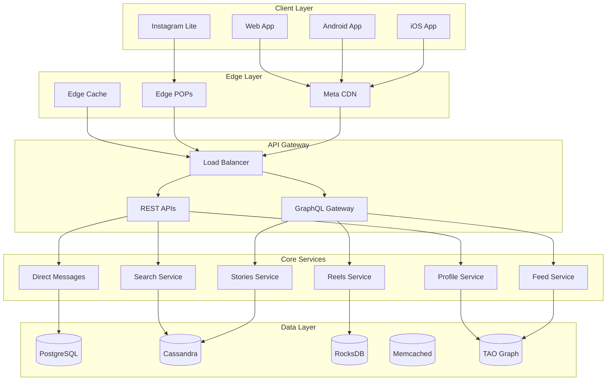

## Core Components

### 1. Feed Generation Pipeline

Instagram's feed processes billions of posts to create personalized timelines.

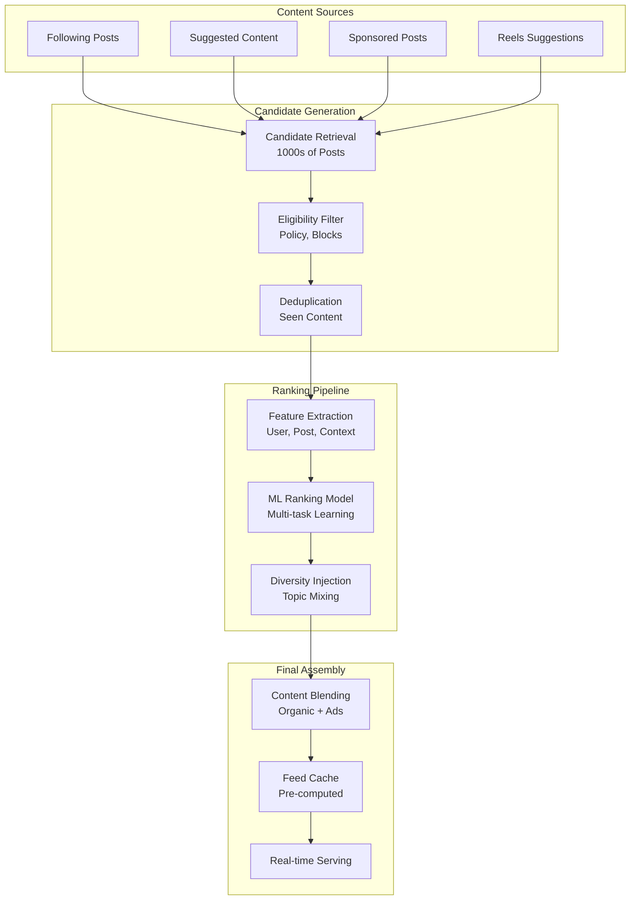

**Components:**
- **Candidate Generation**: Retrieves 1000+ potential posts
- **Ranking Model**: Multi-objective optimization (engagement, time spent)
- **Diversity Engine**: Prevents feed monotony
- **Real-time Updates**: Sub-second feed refresh

**Key Features:**
- Personalized ranking per user
- Real-time content freshness
- Ad integration without disruption
- Explore page discovery

### 2. Stories Pipeline

Handles 500M+ daily Stories with 24-hour expiration.

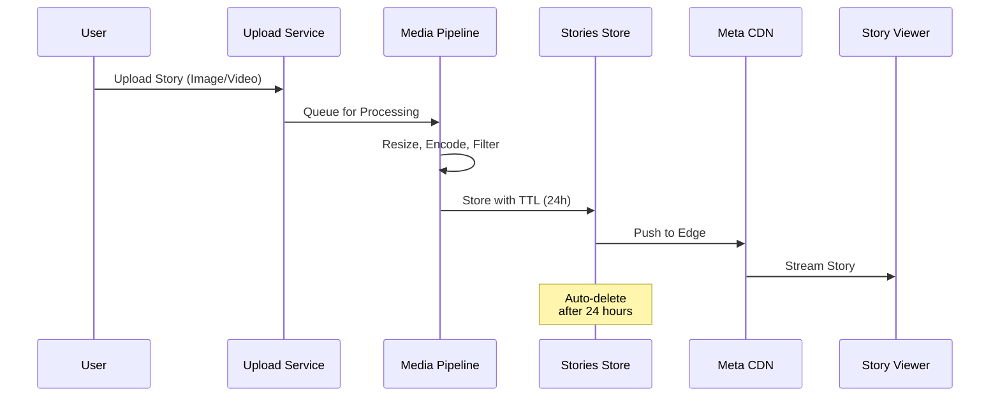

**Architecture Details:**
- **Ephemeral Storage**: 24-hour TTL with automatic deletion
- **Sticker/Filter Pipeline**: Real-time AR processing
- **Story Tray Ranking**: ML-based ordering
- **View Tracking**: Real-time viewer list updates

### 3. Reels Processing

Video-first content with TikTok-style discovery.

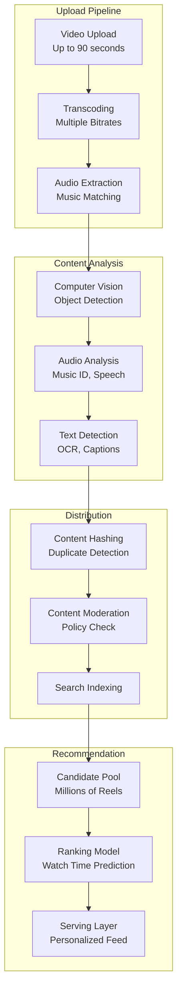

**Key Technologies:**
- **Video Encoding**: H.264/H.265 adaptive bitrate
- **Music Integration**: Audio fingerprinting with music library
- **AR Effects**: Real-time face/body tracking
- **Discovery Engine**: Interest-based recommendation

### 4. Direct Messages (DM)

End-to-end encrypted messaging for 2B+ users.

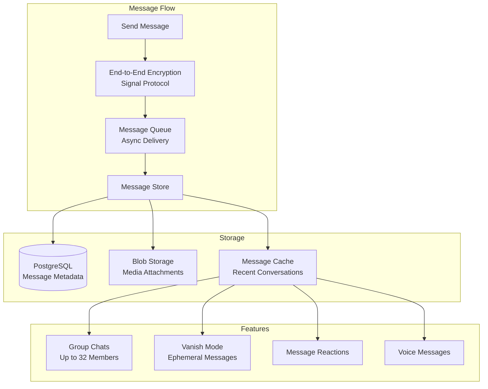

## Data Storage Architecture

### TAO (The Associations and Objects)

Meta's distributed graph database powering Instagram's social graph.

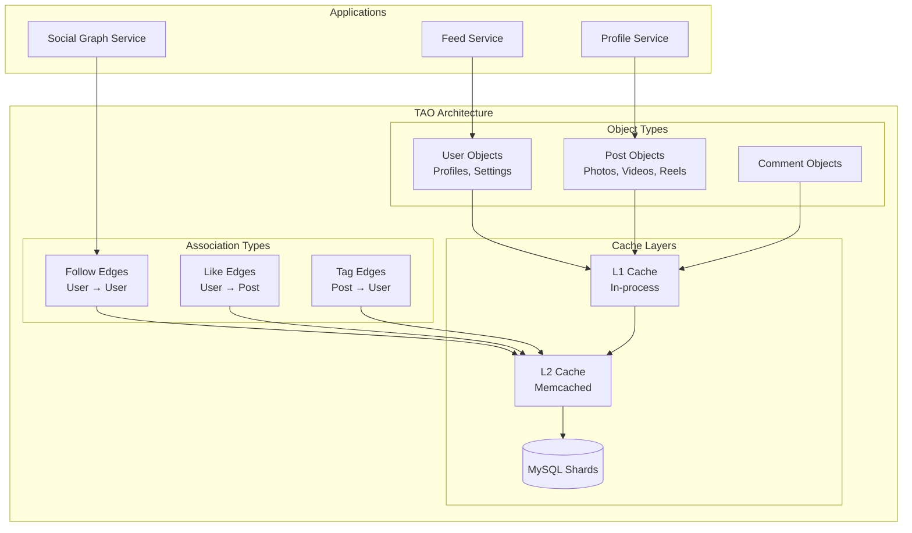

**Characteristics:**
- **Read-optimized**: 99.9% read operations
- **Write-through caching**: Consistency guarantees
- **Sharded by object ID**: Horizontal scalability
- **Billions of objects**: Users, posts, comments, likes

### Cassandra (Time-Series Data)

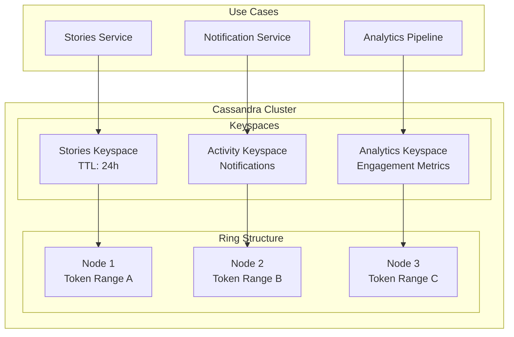

**Use Cases:**
- Stories with automatic expiration (TTL)
- Activity feed and notifications
- Real-time engagement metrics
- Time-series analytics data

### PostgreSQL (Transactional Data)

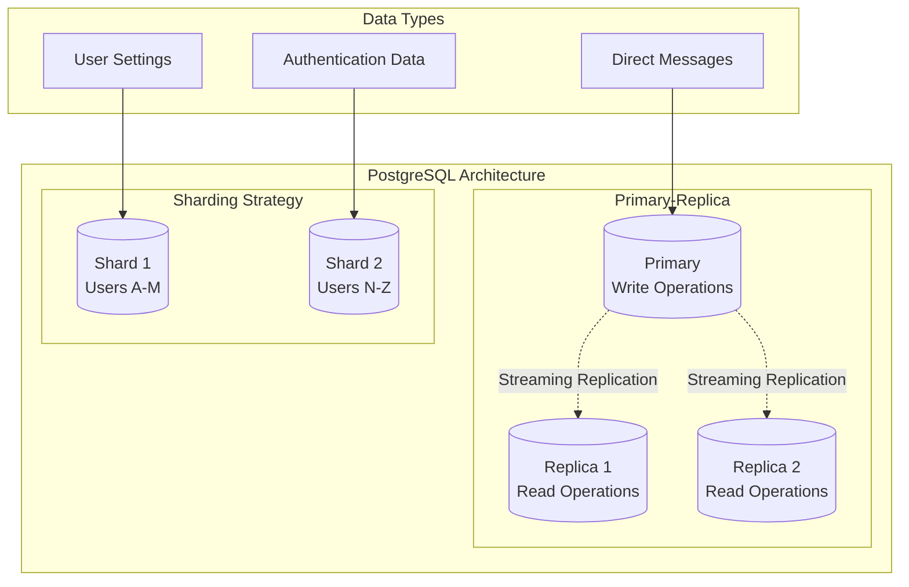

## Stream Processing Architecture

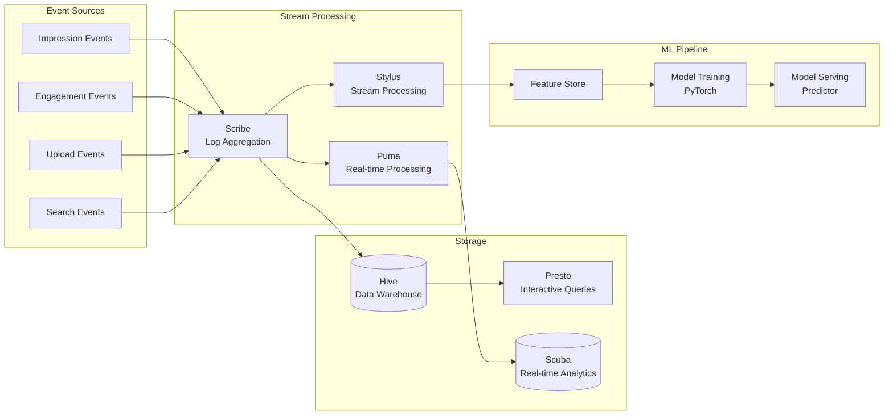

### Meta's Stream Infrastructure
- **Scribe**: Distributed log aggregation (100s of PB/day)
- **Puma**: Real-time stream processing
- **Stylus**: Complex event processing
- **Scuba**: Sub-second analytics queries

## Scalability Patterns

### 1. Sharding Strategy

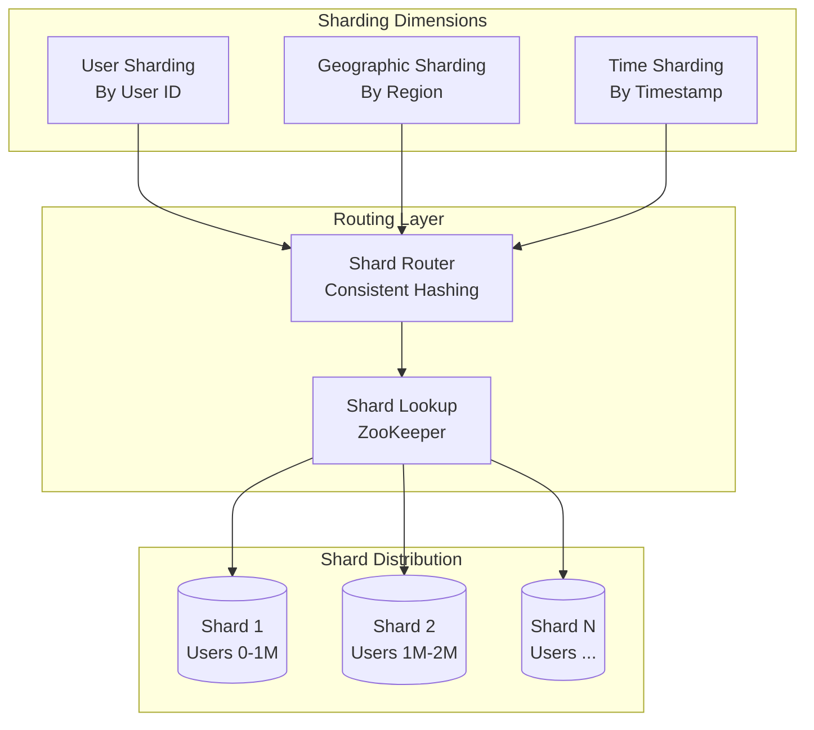

**Sharding Strategies:**
- **User-based sharding**: Even distribution of load
- **Geographic sharding**: Data locality for latency
- **Time-based sharding**: Efficient queries for recent data

### 2. Caching Architecture

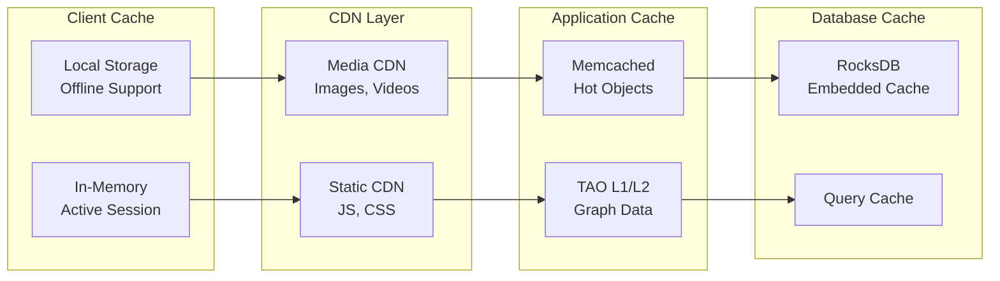

### 3. Rate Limiting

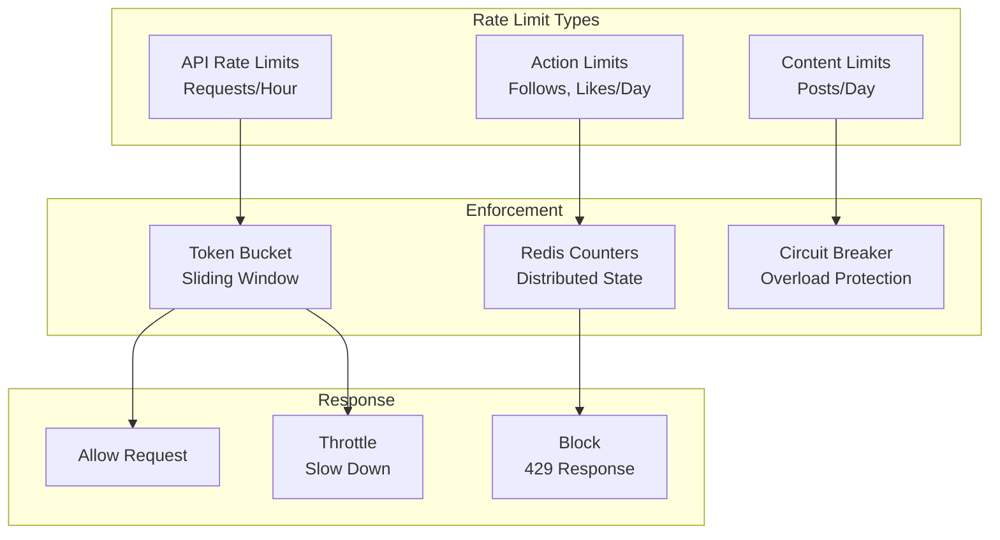

## Security Architecture

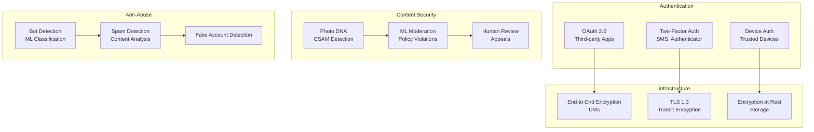

### Content Integrity
- **PhotoDNA**: Hash matching for harmful content
- **ML Classifiers**: Real-time content moderation
- **User Reports**: Community-driven moderation
- **Appeals Process**: Human review for decisions

### Account Security
- **Login Alerts**: Notification of new device logins
- **Suspicious Activity**: Automated account protection
- **Recovery Options**: Multiple recovery methods
- **Privacy Controls**: Granular sharing settings

## Monitoring and Observability

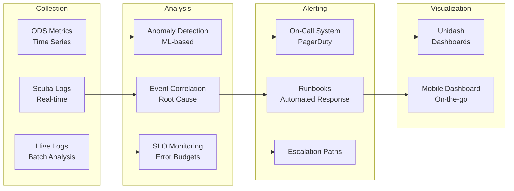

## Deployment and DevOps

### Continuous Integration/Continuous Deployment

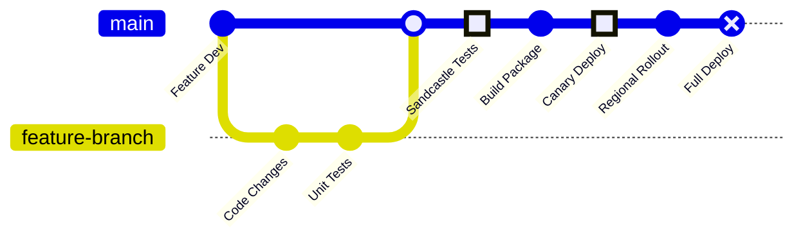

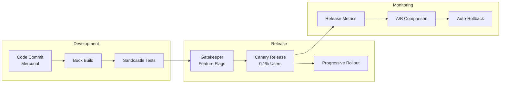

### Gatekeeper (Feature Flags)
- **Gradual Rollouts**: Percentage-based feature exposure
- **A/B Testing**: Controlled experiments
- **Kill Switches**: Instant feature disabling
- **Targeting**: User segment-specific features

### Chaos Engineering

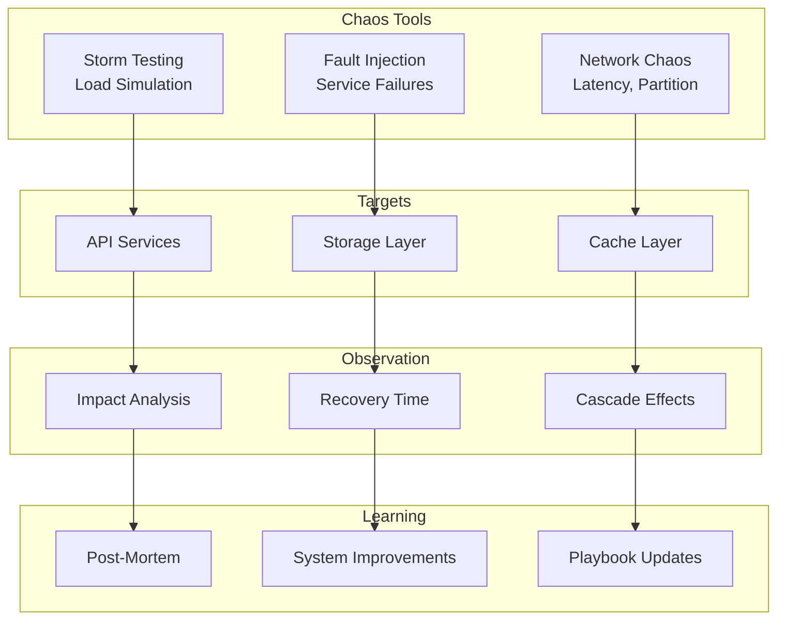

## Analytics and Machine Learning

### Data Pipeline

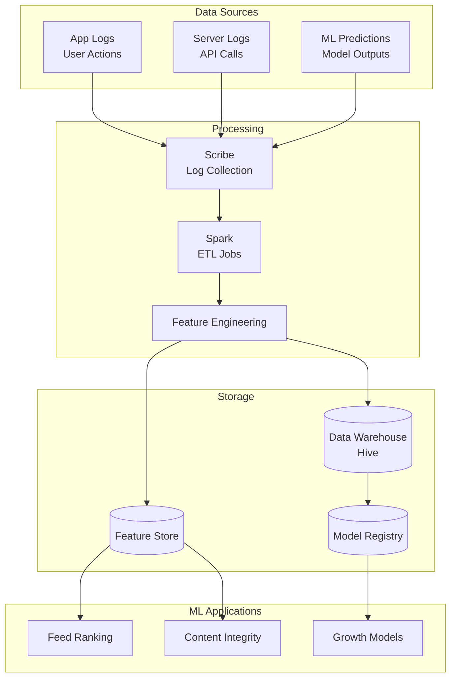

### ML Use Cases
- **Feed Ranking**: Personalized content ordering
- **Explore Recommendations**: Interest-based discovery
- **Content Moderation**: Policy violation detection
- **Ad Targeting**: Relevance and engagement optimization
- **Spam Detection**: Bot and fake account identification

## Cost Optimization

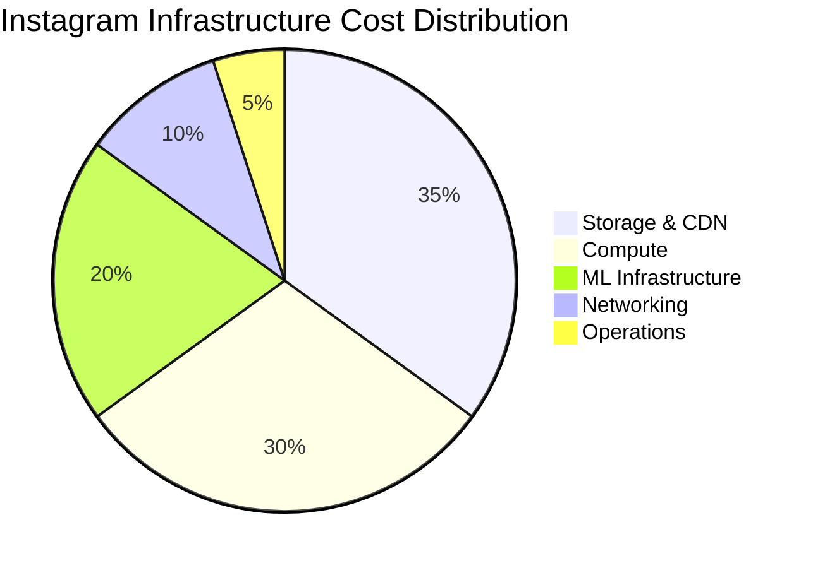

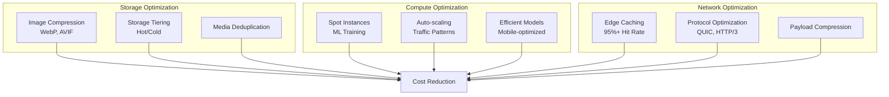

### Key Strategies
- **Image Format Evolution**: WebP for 30% smaller images
- **Video Compression**: H.265/HEVC for efficient streaming
- **ML Model Optimization**: Quantization for mobile inference
- **Predictive Scaling**: Traffic pattern-based capacity

## Future Architecture Considerations

### Emerging Technologies
- **AR/VR Integration**: Meta Quest integration, AR filters
- **AI Content Creation**: Generative AI for creators
- **Decentralized Identity**: Fediverse compatibility
- **Edge AI**: On-device ML for privacy

### Platform Evolution
- **Creator Economy**: Enhanced monetization tools
- **Shopping Integration**: Native commerce features
- **Threads Integration**: Cross-platform social graph
- **Long-form Video**: Competing with YouTube

### Infrastructure Roadmap
- **Sustainability**: Carbon-neutral data centers
- **Efficiency**: ML-optimized resource allocation
- **Privacy**: Enhanced encryption and data minimization
- **Global Expansion**: Emerging market optimization

## Conclusion

Instagram's architecture demonstrates Meta's ability to scale visual social networking to billions of users. The combination of TAO's graph database, efficient media pipelines, and sophisticated ML systems enables Instagram to deliver personalized experiences at massive scale.

The platform continues to evolve with new features like Reels, enhanced shopping capabilities, and tighter integration with the broader Meta ecosystem, all while maintaining the performance and reliability users expect.

> There might be iterations needed, current data is as close I could get.
