## High-Level Architecture

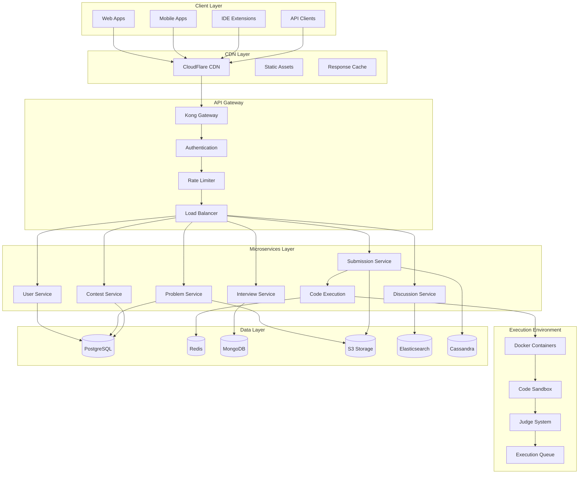
```mermaid
graph TB
    subgraph "Client Layer"
        WEB[Web Apps]
        MOBILE[Mobile Apps]
        IDE[IDE Extensions]
        API_CLIENTS[API Clients]
    end
    
    subgraph "CDN Layer"
        CLOUDFLARE[CloudFlare CDN]
        ASSETS[Static Assets]
        CACHE[Response Cache]
    end
    
    subgraph "API Gateway"
        KONG[Kong Gateway]
        AUTH[Authentication]
        RATE[Rate Limiter]
        LB[Load Balancer]
    end
    
    subgraph "Microservices Layer"
        USER[User Service]
        PROBLEM[Problem Service]
        SUBMISSION[Submission Service]
        EXECUTE[Code Execution]
        CONTEST[Contest Service]
        INTERVIEW[Interview Service]
        DISCUSSION[Discussion Service]
    end
    
    subgraph "Execution Environment"
        DOCKER[Docker Containers]
        SANDBOX[Code Sandbox]
        JUDGE[Judge System]
        QUEUE[Execution Queue]
    end
    
    subgraph "Data Layer"
        POSTGRES[(PostgreSQL)]
        REDIS[(Redis)]
        MONGODB[(MongoDB)]
        S3[(S3 Storage)]
        ELASTIC[(Elasticsearch)]
        CASSANDRA[(Cassandra)]
    end
    
    WEB --> CLOUDFLARE
    MOBILE --> CLOUDFLARE
    IDE --> CLOUDFLARE
    API_CLIENTS --> CLOUDFLARE
    
    CLOUDFLARE --> KONG
    KONG --> AUTH
    AUTH --> RATE
    RATE --> LB
    
    LB --> USER
    LB --> PROBLEM
    LB --> SUBMISSION
    LB --> CONTEST
    LB --> INTERVIEW
    LB --> DISCUSSION
    
    SUBMISSION --> EXECUTE
    EXECUTE --> DOCKER
    DOCKER --> SANDBOX
    SANDBOX --> JUDGE
    JUDGE --> QUEUE
    
    USER --> POSTGRES
    PROBLEM --> POSTGRES
    SUBMISSION --> CASSANDRA
    EXECUTE --> REDIS
    CONTEST --> POSTGRES
    INTERVIEW --> MONGODB
    DISCUSSION --> ELASTIC
    
    PROBLEM --> S3
    SUBMISSION --> S3
```

## Core Components

### 1. User Management System

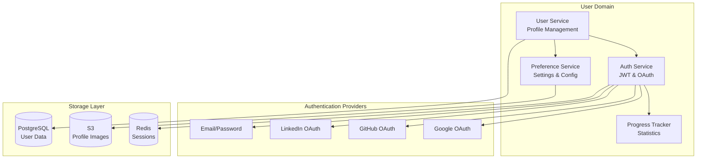
```mermaid
graph TD
    subgraph "User Domain"
        US[User Service<br/>Profile Management]
        AUTH[Auth Service<br/>JWT & OAuth]
        PREF[Preference Service<br/>Settings & Config]
        PROGRESS[Progress Tracker<br/>Statistics]
    end
    
    subgraph "Authentication Providers"
        GOOGLE[Google OAuth]
        GITHUB[GitHub OAuth]
        LINKEDIN[LinkedIn OAuth]
        EMAIL[Email/Password]
    end
    
    subgraph "Storage Layer"
        POSTGRES[(PostgreSQL<br/>User Data)]
        REDIS[(Redis<br/>Sessions)]
        S3[(S3<br/>Profile Images)]
    end
    
    US --> AUTH
    US --> PREF
    AUTH --> PROGRESS
    
    AUTH --> GOOGLE
    AUTH --> GITHUB
    AUTH --> LINKEDIN
    AUTH --> EMAIL
    
    US --> POSTGRES
    AUTH --> REDIS
    PREF --> S3
```

**Responsibilities:**
- User registration and authentication
- Profile management and preferences
- Progress tracking and statistics
- Social authentication integration
- Technologies: Java Spring Boot, JWT, OAuth 2.0

### 2. Problem Management System

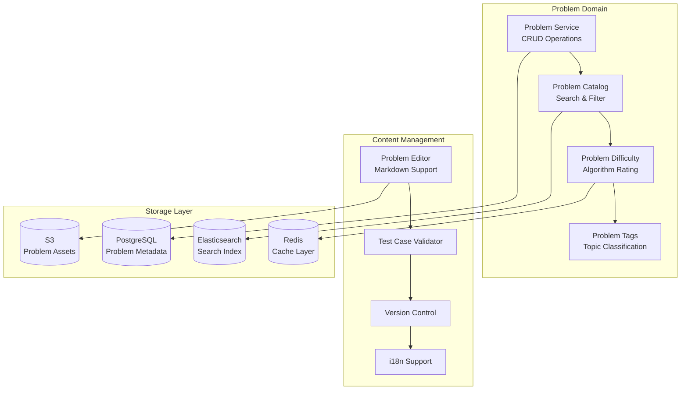
```mermaid
graph TD
    subgraph "Problem Domain"
        PS[Problem Service<br/>CRUD Operations]
        PC[Problem Catalog<br/>Search & Filter]
        PD[Problem Difficulty<br/>Algorithm Rating]
        PT[Problem Tags<br/>Topic Classification]
    end
    
    subgraph "Content Management"
        EDITOR[Problem Editor<br/>Markdown Support]
        VALIDATOR[Test Case Validator]
        VERSIONING[Version Control]
        LOCALIZATION[i18n Support]
    end
    
    subgraph "Storage Layer"
        POSTGRES[(PostgreSQL<br/>Problem Metadata)]
        S3[(S3<br/>Problem Assets)]
        ELASTIC[(Elasticsearch<br/>Search Index)]
        REDIS[(Redis<br/>Cache Layer)]
    end
    
    PS --> PC
    PC --> PD
    PD --> PT
    
    EDITOR --> VALIDATOR
    VALIDATOR --> VERSIONING
    VERSIONING --> LOCALIZATION
    
    PS --> POSTGRES
    EDITOR --> S3
    PC --> ELASTIC
    PD --> REDIS
```

**Key Features:**
- 3000+ problems across difficulty levels
- Rich text editor with markdown support
- Multi-language problem descriptions
- Automated difficulty rating algorithm
- Technologies: Python Django, Elasticsearch, Redis

### 3. Code Execution Engine

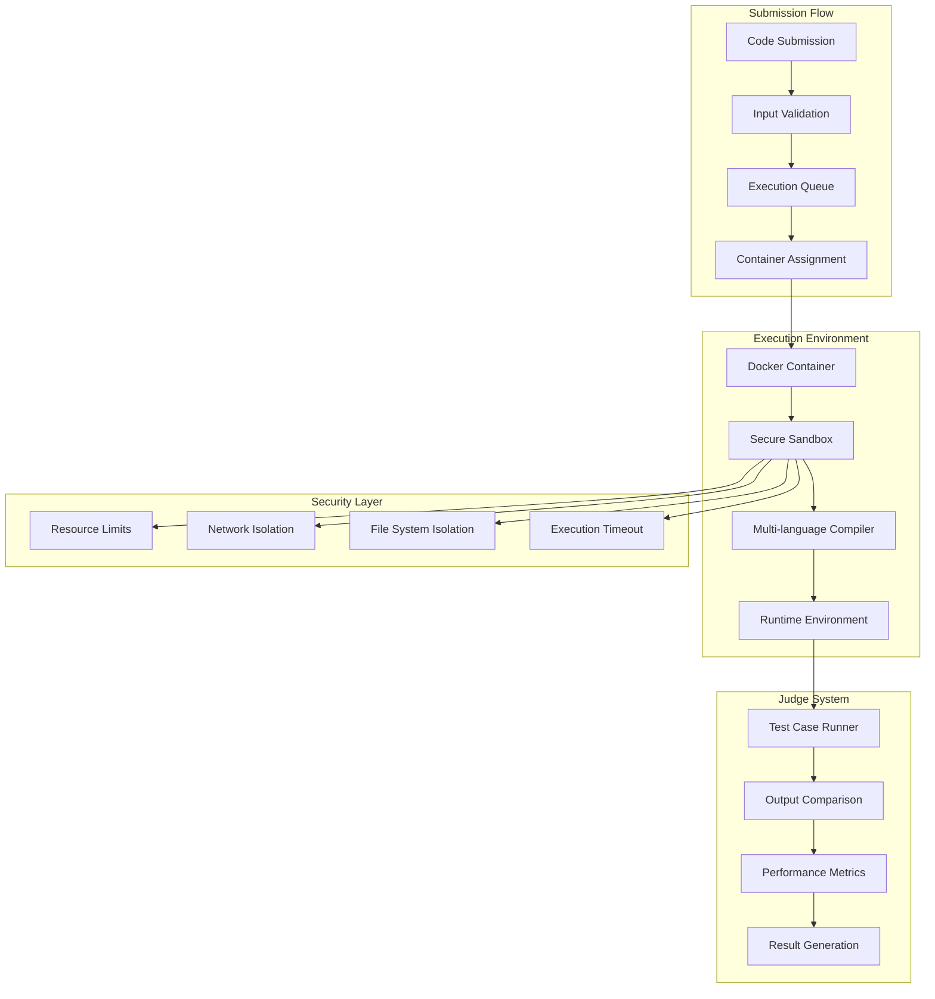
```mermaid
graph TD
    subgraph "Submission Flow"
        SUBMIT[Code Submission]
        VALIDATE[Input Validation]
        QUEUE[Execution Queue]
        ASSIGN[Container Assignment]
    end
    
    subgraph "Execution Environment"
        DOCKER[Docker Container]
        SANDBOX[Secure Sandbox]
        COMPILER[Multi-language Compiler]
        RUNTIME[Runtime Environment]
    end
    
    subgraph "Judge System"
        TESTCASE[Test Case Runner]
        COMPARE[Output Comparison]
        METRICS[Performance Metrics]
        RESULT[Result Generation]
    end
    
    subgraph "Security Layer"
        RESOURCE[Resource Limits]
        NETWORK[Network Isolation]
        FILESYSTEM[File System Isolation]
        TIMEOUT[Execution Timeout]
    end
    
    SUBMIT --> VALIDATE
    VALIDATE --> QUEUE
    QUEUE --> ASSIGN
    ASSIGN --> DOCKER
    
    DOCKER --> SANDBOX
    SANDBOX --> COMPILER
    COMPILER --> RUNTIME
    
    RUNTIME --> TESTCASE
    TESTCASE --> COMPARE
    COMPARE --> METRICS
    METRICS --> RESULT
    
    SANDBOX --> RESOURCE
    SANDBOX --> NETWORK
    SANDBOX --> FILESYSTEM
    SANDBOX --> TIMEOUT
```

**Architecture Details:**

#### Docker-based Execution
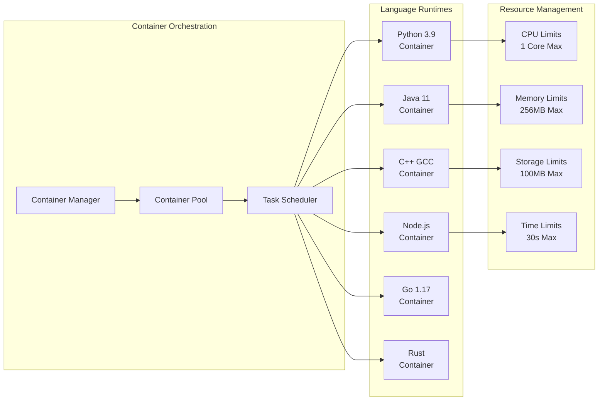
```mermaid
graph LR
    subgraph "Container Orchestration"
        MANAGER[Container Manager]
        POOL[Container Pool]
        SCHEDULER[Task Scheduler]
    end
    
    subgraph "Language Runtimes"
        PYTHON[Python 3.9<br/>Container]
        JAVA[Java 11<br/>Container]
        CPP[C++ GCC<br/>Container]
        JS[Node.js<br/>Container]
        GO[Go 1.17<br/>Container]
        RUST[Rust<br/>Container]
    end
    
    subgraph "Resource Management"
        CPU[CPU Limits<br/>1 Core Max]
        MEMORY[Memory Limits<br/>256MB Max]
        STORAGE[Storage Limits<br/>100MB Max]
        TIME[Time Limits<br/>30s Max]
    end
    
    MANAGER --> POOL
    POOL --> SCHEDULER
    
    SCHEDULER --> PYTHON
    SCHEDULER --> JAVA
    SCHEDULER --> CPP
    SCHEDULER --> JS
    SCHEDULER --> GO
    SCHEDULER --> RUST
    
    PYTHON --> CPU
    JAVA --> MEMORY
    CPP --> STORAGE
    JS --> TIME
```

**Supported Languages:**
- Python (3.x)
- Java (8, 11, 17)
- C++ (GCC, Clang)
- JavaScript (Node.js)
- C# (.NET)
- Go
- Rust
- Swift
- Kotlin
- TypeScript

**Security Measures:**
- Container isolation with minimal attack surface
- Resource limits (CPU, memory, disk, network)
- Execution timeouts
- System call filtering
- Network isolation

### 4. Real-time Collaboration System

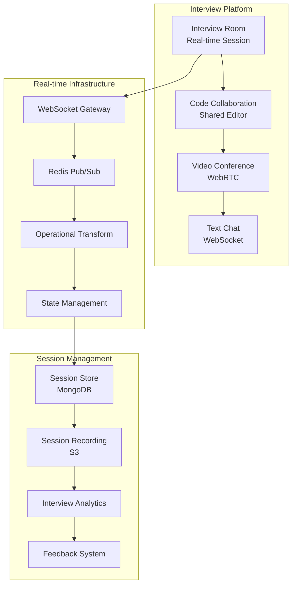
```mermaid
graph TD
    subgraph "Interview Platform"
        ROOM[Interview Room<br/>Real-time Session]
        COLLAB[Code Collaboration<br/>Shared Editor]
        VIDEO[Video Conference<br/>WebRTC]
        CHAT[Text Chat<br/>WebSocket]
    end
    
    subgraph "Real-time Infrastructure"
        WS[WebSocket Gateway]
        REDIS_PUBSUB[Redis Pub/Sub]
        SYNC[Operational Transform]
        STATE[State Management]
    end
    
    subgraph "Session Management"
        SESSION[Session Store<br/>MongoDB]
        RECORDING[Session Recording<br/>S3]
        ANALYTICS[Interview Analytics]
        FEEDBACK[Feedback System]
    end
    
    ROOM --> COLLAB
    COLLAB --> VIDEO
    VIDEO --> CHAT
    
    ROOM --> WS
    WS --> REDIS_PUBSUB
    REDIS_PUBSUB --> SYNC
    SYNC --> STATE
    
    STATE --> SESSION
    SESSION --> RECORDING
    RECORDING --> ANALYTICS
    ANALYTICS --> FEEDBACK
```

**Real-time Features:**
- Collaborative code editing with conflict resolution
- Live cursor positions and selections
- Real-time compilation and execution
- Video/audio communication via WebRTC
- Session recording and playback

### 5. Contest Management System

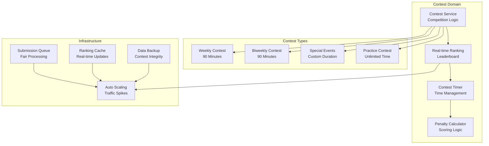
```mermaid
graph TD
    subgraph "Contest Domain"
        CONTEST[Contest Service<br/>Competition Logic]
        RANKING[Real-time Ranking<br/>Leaderboard]
        TIMER[Contest Timer<br/>Time Management]
        PENALTY[Penalty Calculator<br/>Scoring Logic]
    end
    
    subgraph "Contest Types"
        WEEKLY[Weekly Contest<br/>90 Minutes]
        BIWEEKLY[Biweekly Contest<br/>90 Minutes]
        SPECIAL[Special Events<br/>Custom Duration]
        PRACTICE[Practice Contest<br/>Unlimited Time]
    end
    
    subgraph "Infrastructure"
        SCALING[Auto Scaling<br/>Traffic Spikes]
        QUEUE[Submission Queue<br/>Fair Processing]
        CACHE[Ranking Cache<br/>Real-time Updates]
        BACKUP[Data Backup<br/>Contest Integrity]
    end
    
    CONTEST --> RANKING
    RANKING --> TIMER
    TIMER --> PENALTY
    
    CONTEST --> WEEKLY
    CONTEST --> BIWEEKLY
    CONTEST --> SPECIAL
    CONTEST --> PRACTICE
    
    RANKING --> SCALING
    QUEUE --> SCALING
    CACHE --> SCALING
    BACKUP --> SCALING
```

**Contest Features:**
- Real-time leaderboards with live updates
- Anti-cheating measures and plagiarism detection
- Dynamic problem difficulty adjustment
- Global and regional rankings
- Prize distribution and rating calculations

## Data Architecture

### 1. PostgreSQL (Primary Database)

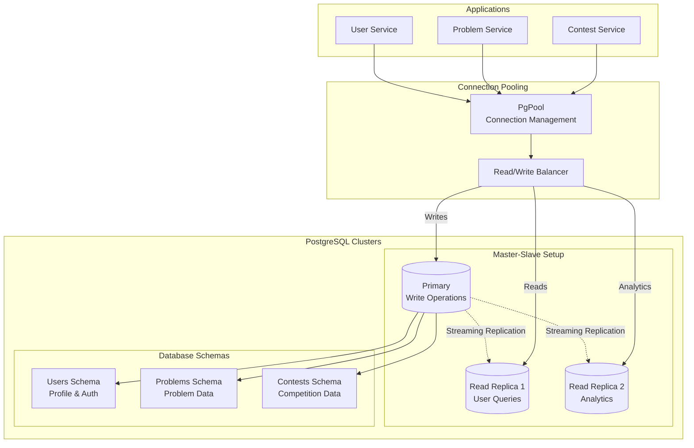
```mermaid
graph TD
    subgraph "PostgreSQL Clusters"
        subgraph "Master-Slave Setup"
            MASTER[(Primary<br/>Write Operations)]
            SLAVE1[(Read Replica 1<br/>User Queries)]
            SLAVE2[(Read Replica 2<br/>Analytics)]
        end
        
        subgraph "Database Schemas"
            USERS[Users Schema<br/>Profile & Auth]
            PROBLEMS[Problems Schema<br/>Problem Data]
            CONTESTS[Contests Schema<br/>Competition Data]
        end
    end
    
    subgraph "Connection Pooling"
        PGPOOL[PgPool<br/>Connection Management]
        BALANCER[Read/Write Balancer]
    end
    
    subgraph "Applications"
        USER_SERVICE[User Service]
        PROBLEM_SERVICE[Problem Service]
        CONTEST_SERVICE[Contest Service]
    end
    
    MASTER -.->|Streaming Replication| SLAVE1
    MASTER -.->|Streaming Replication| SLAVE2
    
    USER_SERVICE --> PGPOOL
    PROBLEM_SERVICE --> PGPOOL
    CONTEST_SERVICE --> PGPOOL
    
    PGPOOL --> BALANCER
    BALANCER -->|Writes| MASTER
    BALANCER -->|Reads| SLAVE1
    BALANCER -->|Analytics| SLAVE2
    
    MASTER --> USERS
    MASTER --> PROBLEMS
    MASTER --> CONTESTS
```

**Schema Design:**
- Users: Profile, preferences, subscription data
- Problems: Metadata, test cases, editorial content
- Submissions: Code, results, performance metrics
- Contests: Rules, participants, rankings

### 2. Cassandra (Submission Storage)

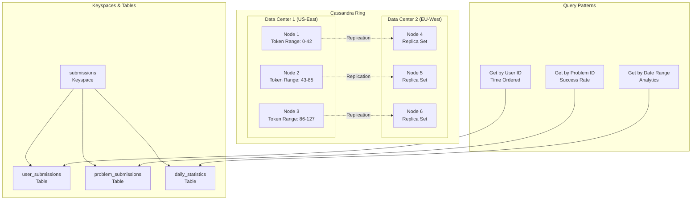
```mermaid
graph TD
    subgraph "Cassandra Ring"
        subgraph "Data Center 1 (US-East)"
            C1[Node 1<br/>Token Range: 0-42]
            C2[Node 2<br/>Token Range: 43-85]
            C3[Node 3<br/>Token Range: 86-127]
        end
        
        subgraph "Data Center 2 (EU-West)"
            C4[Node 4<br/>Replica Set]
            C5[Node 5<br/>Replica Set]
            C6[Node 6<br/>Replica Set]
        end
    end
    
    subgraph "Keyspaces & Tables"
        SUBMISSIONS[submissions<br/>Keyspace]
        USER_SUB[user_submissions<br/>Table]
        PROBLEM_SUB[problem_submissions<br/>Table]
        DAILY_STATS[daily_statistics<br/>Table]
    end
    
    subgraph "Query Patterns"
        BY_USER[Get by User ID<br/>Time Ordered]
        BY_PROBLEM[Get by Problem ID<br/>Success Rate]
        BY_DATE[Get by Date Range<br/>Analytics]
    end
    
    C1 -.->|Replication| C4
    C2 -.->|Replication| C5
    C3 -.->|Replication| C6
    
    SUBMISSIONS --> USER_SUB
    SUBMISSIONS --> PROBLEM_SUB
    SUBMISSIONS --> DAILY_STATS
    
    BY_USER --> USER_SUB
    BY_PROBLEM --> PROBLEM_SUB
    BY_DATE --> DAILY_STATS
```

**Data Modeling:**
- Partition by user_id and problem_id
- Time-series data for submission history
- Efficient range queries for analytics
- Replication factor of 3 across regions

### 3. Redis Cache Layer

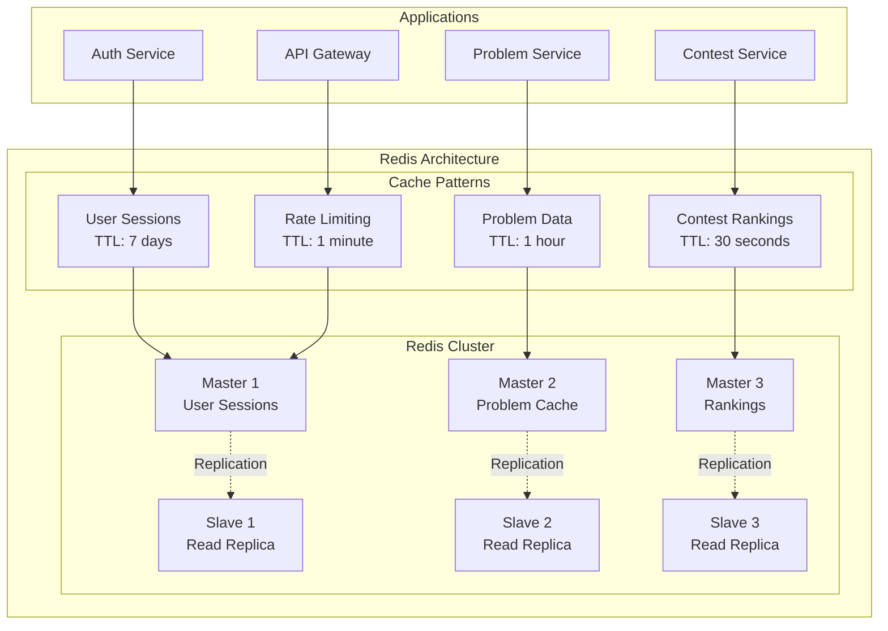
```mermaid
graph TD
    subgraph "Redis Architecture"
        subgraph "Redis Cluster"
            MASTER1[Master 1<br/>User Sessions]
            SLAVE1[Slave 1<br/>Read Replica]
            MASTER2[Master 2<br/>Problem Cache]
            SLAVE2[Slave 2<br/>Read Replica]
            MASTER3[Master 3<br/>Rankings]
            SLAVE3[Slave 3<br/>Read Replica]
        end
        
        subgraph "Cache Patterns"
            SESSIONS[User Sessions<br/>TTL: 7 days]
            PROBLEMS[Problem Data<br/>TTL: 1 hour]
            RANKINGS[Contest Rankings<br/>TTL: 30 seconds]
            RATE_LIMIT[Rate Limiting<br/>TTL: 1 minute]
        end
    end
    
    subgraph "Applications"
        AUTH_SERVICE[Auth Service]
        PROBLEM_SERVICE[Problem Service]
        CONTEST_SERVICE[Contest Service]
        API_GATEWAY[API Gateway]
    end
    
    MASTER1 -.->|Replication| SLAVE1
    MASTER2 -.->|Replication| SLAVE2
    MASTER3 -.->|Replication| SLAVE3
    
    AUTH_SERVICE --> SESSIONS
    PROBLEM_SERVICE --> PROBLEMS
    CONTEST_SERVICE --> RANKINGS
    API_GATEWAY --> RATE_LIMIT
    
    SESSIONS --> MASTER1
    PROBLEMS --> MASTER2
    RANKINGS --> MASTER3
    RATE_LIMIT --> MASTER1
```

**Cache Strategies:**
- Session management and authentication tokens
- Problem metadata and test cases
- Real-time contest rankings
- Rate limiting counters
- API response caching

### 4. MongoDB (Interview Data)

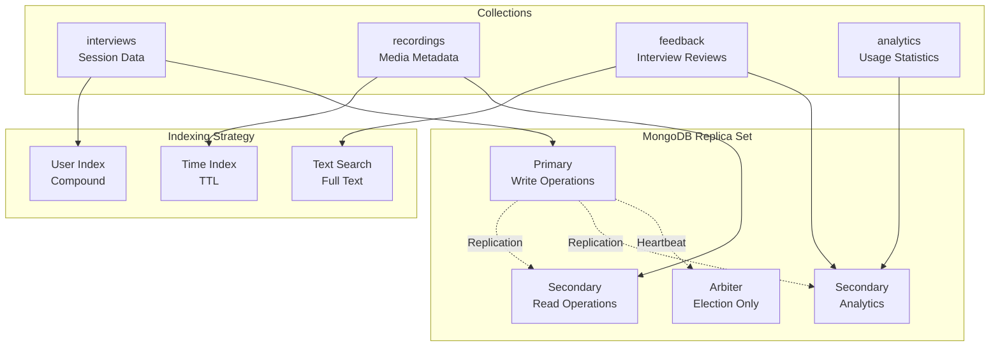
```mermaid
graph TD
    subgraph "MongoDB Replica Set"
        PRIMARY[Primary<br/>Write Operations]
        SECONDARY1[Secondary<br/>Read Operations]
        SECONDARY2[Secondary<br/>Analytics]
        ARBITER[Arbiter<br/>Election Only]
    end
    
    subgraph "Collections"
        INTERVIEWS[interviews<br/>Session Data]
        RECORDINGS[recordings<br/>Media Metadata]
        FEEDBACK[feedback<br/>Interview Reviews]
        ANALYTICS_COL[analytics<br/>Usage Statistics]
    end
    
    subgraph "Indexing Strategy"
        USER_IDX[User Index<br/>Compound]
        TIME_IDX[Time Index<br/>TTL]
        SEARCH_IDX[Text Search<br/>Full Text]
    end
    
    PRIMARY -.->|Replication| SECONDARY1
    PRIMARY -.->|Replication| SECONDARY2
    PRIMARY -.->|Heartbeat| ARBITER
    
    INTERVIEWS --> USER_IDX
    RECORDINGS --> TIME_IDX
    FEEDBACK --> SEARCH_IDX
    
    INTERVIEWS --> PRIMARY
    RECORDINGS --> SECONDARY1
    FEEDBACK --> SECONDARY2
    ANALYTICS_COL --> SECONDARY2
```

**Document Structure:**
- Interview sessions with participant data
- Real-time collaboration events
- Video/audio recording metadata
- Feedback and evaluation data

## Execution Infrastructure

### 1. Code Execution Pipeline

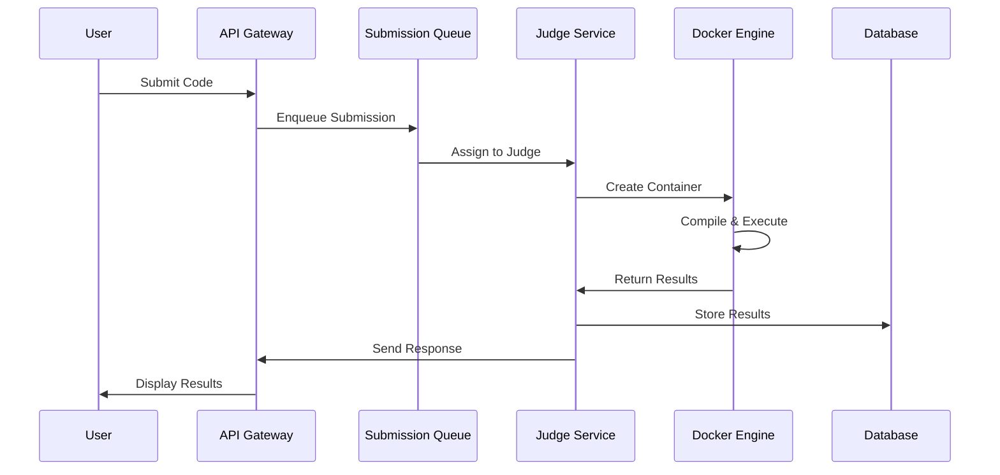
```mermaid
sequenceDiagram
    participant User
    participant API as API Gateway
    participant Queue as Submission Queue
    participant Judge as Judge Service
    participant Docker as Docker Engine
    participant DB as Database
    
    User->>API: Submit Code
    API->>Queue: Enqueue Submission
    Queue->>Judge: Assign to Judge
    Judge->>Docker: Create Container
    Docker->>Docker: Compile & Execute
    Docker->>Judge: Return Results
    Judge->>DB: Store Results
    Judge->>API: Send Response
    API->>User: Display Results
```

### 2. Container Management

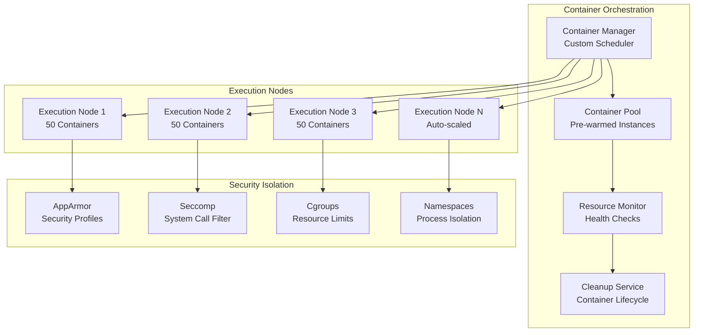
```mermaid
graph TD
    subgraph "Container Orchestration"
        MANAGER[Container Manager<br/>Custom Scheduler]
        POOL[Container Pool<br/>Pre-warmed Instances]
        MONITOR[Resource Monitor<br/>Health Checks]
        CLEANUP[Cleanup Service<br/>Container Lifecycle]
    end
    
    subgraph "Execution Nodes"
        NODE1[Execution Node 1<br/>50 Containers]
        NODE2[Execution Node 2<br/>50 Containers]
        NODE3[Execution Node 3<br/>50 Containers]
        NODEN[Execution Node N<br/>Auto-scaled]
    end
    
    subgraph "Security Isolation"
        APPARMOR[AppArmor<br/>Security Profiles]
        SECCOMP[Seccomp<br/>System Call Filter]
        CGROUPS[Cgroups<br/>Resource Limits]
        NAMESPACE[Namespaces<br/>Process Isolation]
    end
    
    MANAGER --> POOL
    POOL --> MONITOR
    MONITOR --> CLEANUP
    
    MANAGER --> NODE1
    MANAGER --> NODE2
    MANAGER --> NODE3
    MANAGER --> NODEN
    
    NODE1 --> APPARMOR
    NODE2 --> SECCOMP
    NODE3 --> CGROUPS
    NODEN --> NAMESPACE
```

**Container Specifications:**
- Base images for each language runtime
- Resource limits: 1 CPU core, 256MB RAM, 100MB disk
- Network isolation and no internet access
- Execution timeout: 30 seconds maximum
- File system restrictions and read-only access

### 3. Judge System Architecture

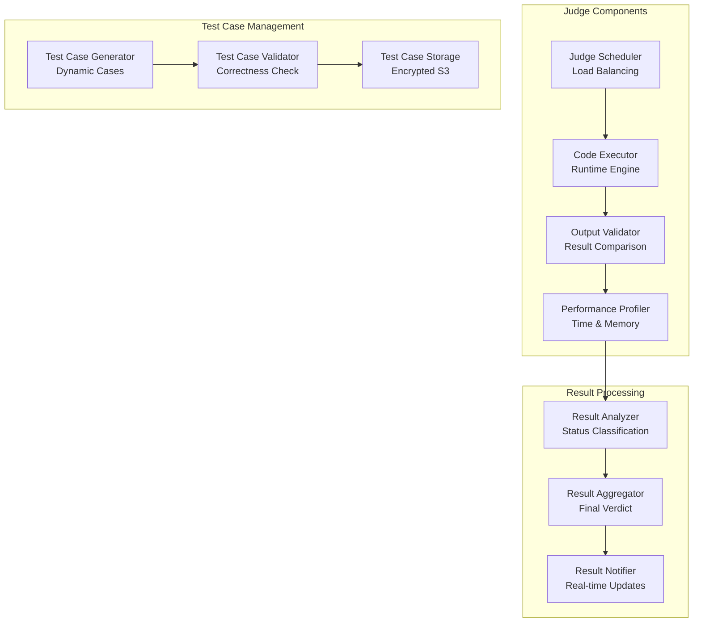
```mermaid
graph TD
    subgraph "Judge Components"
        SCHEDULER[Judge Scheduler<br/>Load Balancing]
        EXECUTOR[Code Executor<br/>Runtime Engine]
        VALIDATOR[Output Validator<br/>Result Comparison]
        PROFILER[Performance Profiler<br/>Time & Memory]
    end
    
    subgraph "Test Case Management"
        GENERATOR[Test Case Generator<br/>Dynamic Cases]
        VALIDATOR_TC[Test Case Validator<br/>Correctness Check]
        STORAGE_TC[Test Case Storage<br/>Encrypted S3]
    end
    
    subgraph "Result Processing"
        ANALYZER[Result Analyzer<br/>Status Classification]
        AGGREGATOR[Result Aggregator<br/>Final Verdict]
        NOTIFIER[Result Notifier<br/>Real-time Updates]
    end
    
    SCHEDULER --> EXECUTOR
    EXECUTOR --> VALIDATOR
    VALIDATOR --> PROFILER
    
    GENERATOR --> VALIDATOR_TC
    VALIDATOR_TC --> STORAGE_TC
    
    PROFILER --> ANALYZER
    ANALYZER --> AGGREGATOR
    AGGREGATOR --> NOTIFIER
```

**Judge Verdict Types:**
- Accepted (AC): Correct solution
- Wrong Answer (WA): Incorrect output
- Time Limit Exceeded (TLE): Execution timeout
- Memory Limit Exceeded (MLE): Memory overflow
- Runtime Error (RE): Program crashed
- Compilation Error (CE): Code compilation failed
- Presentation Error (PE): Output format issue

## Scalability and Performance

### 1. Auto-scaling Strategy

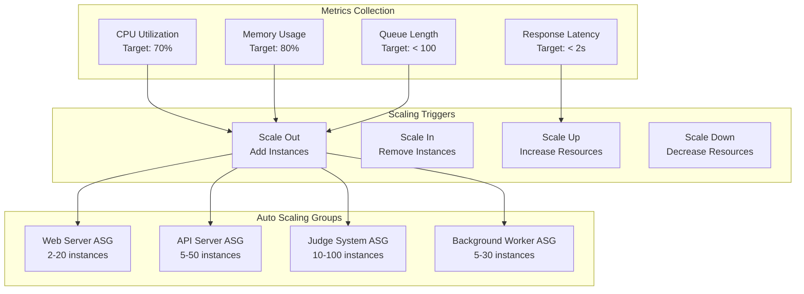
```mermaid
graph TD
    subgraph "Metrics Collection"
        CPU[CPU Utilization<br/>Target: 70%]
        MEMORY[Memory Usage<br/>Target: 80%]
        QUEUE[Queue Length<br/>Target: < 100]
        LATENCY[Response Latency<br/>Target: < 2s]
    end
    
    subgraph "Scaling Triggers"
        SCALE_OUT[Scale Out<br/>Add Instances]
        SCALE_IN[Scale In<br/>Remove Instances]
        SCALE_UP[Scale Up<br/>Increase Resources]
        SCALE_DOWN[Scale Down<br/>Decrease Resources]
    end
    
    subgraph "Auto Scaling Groups"
        WEB_ASG[Web Server ASG<br/>2-20 instances]
        API_ASG[API Server ASG<br/>5-50 instances]
        JUDGE_ASG[Judge System ASG<br/>10-100 instances]
        WORKER_ASG[Background Worker ASG<br/>5-30 instances]
    end
    
    CPU --> SCALE_OUT
    MEMORY --> SCALE_OUT
    QUEUE --> SCALE_OUT
    LATENCY --> SCALE_UP
    
    SCALE_OUT --> WEB_ASG
    SCALE_OUT --> API_ASG
    SCALE_OUT --> JUDGE_ASG
    SCALE_OUT --> WORKER_ASG
```

**Scaling Policies:**
- Horizontal scaling based on queue depth
- Vertical scaling for compute-intensive tasks
- Predictive scaling for contest traffic
- Multi-region deployment for global reach

### 2. Caching Strategy

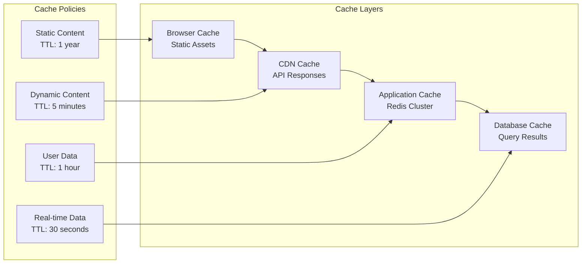
```mermaid
graph LR
    subgraph "Cache Layers"
        L1[Browser Cache<br/>Static Assets]
        L2[CDN Cache<br/>API Responses]
        L3[Application Cache<br/>Redis Cluster]
        L4[Database Cache<br/>Query Results]
    end
    
    subgraph "Cache Policies"
        STATIC[Static Content<br/>TTL: 1 year]
        DYNAMIC[Dynamic Content<br/>TTL: 5 minutes]
        USER_DATA[User Data<br/>TTL: 1 hour]
        REALTIME[Real-time Data<br/>TTL: 30 seconds]
    end
    
    L1 --> L2
    L2 --> L3
    L3 --> L4
    
    STATIC --> L1
    DYNAMIC --> L2
    USER_DATA --> L3
    REALTIME --> L4
```

**Cache Hit Ratios:**
- Static assets: 95%+
- Problem data: 85%+
- User sessions: 90%+
- API responses: 70%+

### 3. Database Optimization

```mermaid
graph TD
    subgraph "Read Optimization"
        READ_REPLICA[Read Replicas<br/>Geographic Distribution]
        QUERY_CACHE[Query Cache<br/>Frequently Accessed]
        INDEX_OPT[Index Optimization<br/>Query Performance]
    end
    
    subgraph "Write Optimization"
        BATCH_WRITE[Batch Writes<br/>Reduced Latency]
        ASYNC_WRITE[Async Writes<br/>Non-critical Data]
        PARTITION[Table Partitioning<br/>Time-based]
    end
    
    subgraph "Data Lifecycle"
        HOT[Hot Data<br/>Recent Submissions]
        WARM[Warm Data<br/>6 Month Archive]
        COLD[Cold Data<br/>Long-term Storage]
    end
    
    READ_REPLICA --> QUERY_CACHE
    QUERY_CACHE --> INDEX_OPT
    
    BATCH_WRITE --> ASYNC_WRITE
    ASYNC_WRITE --> PARTITION
    
    HOT --> WARM
    WARM --> COLD
```

## Security Architecture

### 1. Multi-layer Security

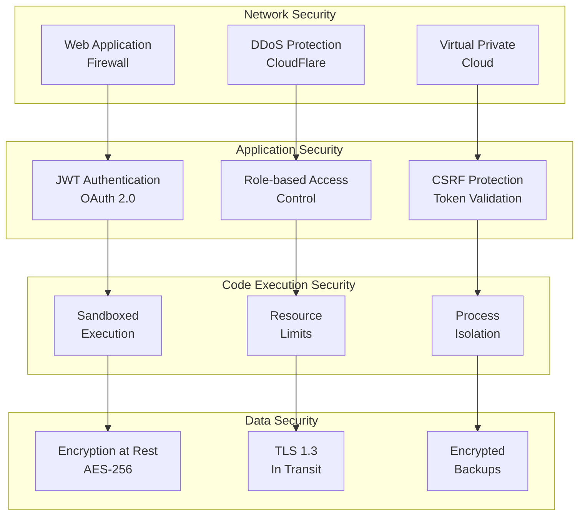
```mermaid
graph TB
    subgraph "Network Security"
        WAF[Web Application<br/>Firewall]
        DDOS[DDoS Protection<br/>CloudFlare]
        VPC[Virtual Private<br/>Cloud]
    end
    
    subgraph "Application Security"
        AUTH[JWT Authentication<br/>OAuth 2.0]
        RBAC[Role-based Access<br/>Control]
        CSRF[CSRF Protection<br/>Token Validation]
    end
    
    subgraph "Code Execution Security"
        SANDBOX[Sandboxed<br/>Execution]
        RESOURCE[Resource<br/>Limits]
        ISOLATION[Process<br/>Isolation]
    end
    
    subgraph "Data Security"
        ENCRYPT[Encryption at Rest<br/>AES-256]
        TLS[TLS 1.3<br/>In Transit]
        BACKUP[Encrypted<br/>Backups]
    end
    
    WAF --> AUTH
    DDOS --> RBAC
    VPC --> CSRF
    
    AUTH --> SANDBOX
    RBAC --> RESOURCE
    CSRF --> ISOLATION
    
    SANDBOX --> ENCRYPT
    RESOURCE --> TLS
    ISOLATION --> BACKUP
```

### 2. Code Execution Security

```mermaid
graph TD
    subgraph "Container Security"
        BASE[Minimal Base Images<br/>Alpine Linux]
        USER[Non-root User<br/>Execution]
        READONLY[Read-only<br/>File System]
        TEMP[Temporary<br/>Storage]
    end
    
    subgraph "System Security"
        SECCOMP[Seccomp Filter<br/>System Calls]
        APPARMOR[AppArmor<br/>Access Control]
        CGROUPS[Control Groups<br/>Resource Limits]
        NAMESPACE[Namespace<br/>Isolation]
    end
    
    subgraph "Network Security"
        NO_INTERNET[No Internet<br/>Access]
        LOCAL_ONLY[Local Network<br/>Only]
        PORT_RESTRICT[Port<br/>Restrictions]
    end
    
    BASE --> USER
    USER --> READONLY
    READONLY --> TEMP
    
    SECCOMP --> APPARMOR
    APPARMOR --> CGROUPS
    CGROUPS --> NAMESPACE
    
    NO_INTERNET --> LOCAL_ONLY
    LOCAL_ONLY --> PORT_RESTRICT
```

## Real-time Features

### 1. WebSocket Architecture

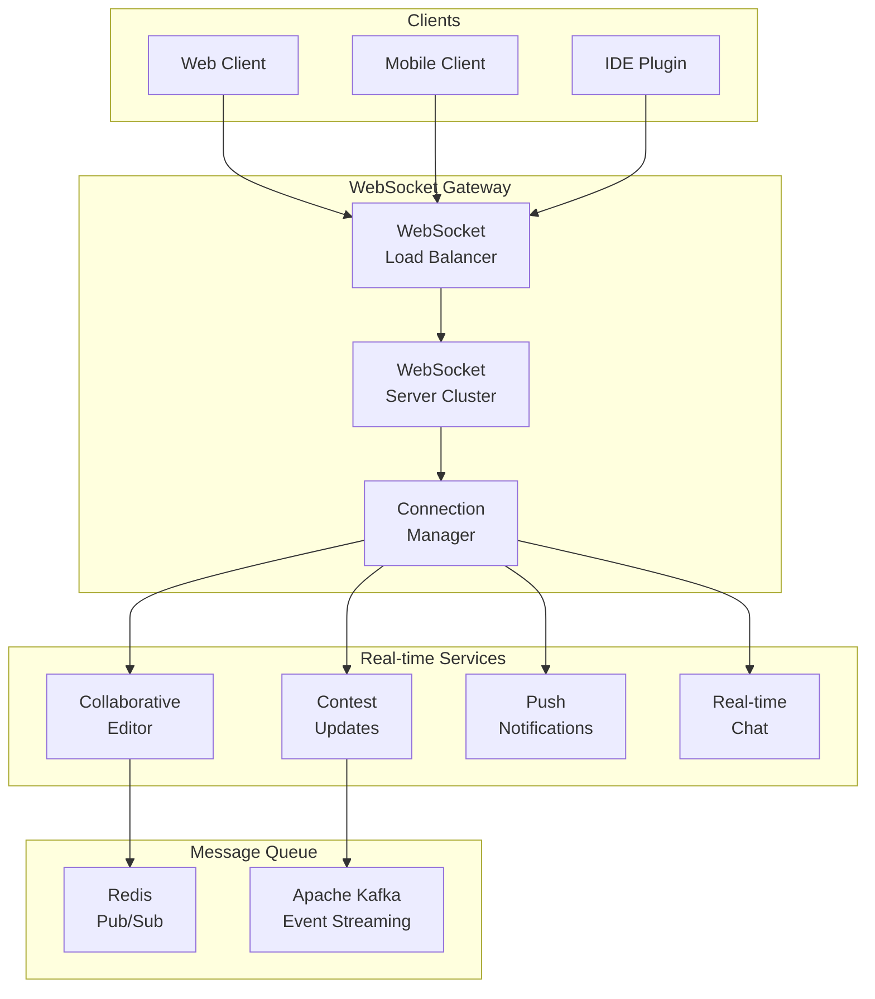
```mermaid
graph TD
    subgraph "WebSocket Gateway"
        WS_LB[WebSocket<br/>Load Balancer]
        WS_SERVER[WebSocket<br/>Server Cluster]
        CONNECTION[Connection<br/>Manager]
    end
    
    subgraph "Real-time Services"
        COLLAB[Collaborative<br/>Editor]
        CONTEST[Contest<br/>Updates]
        NOTIFICATION[Push<br/>Notifications]
        CHAT[Real-time<br/>Chat]
    end
    
    subgraph "Message Queue"
        REDIS_PUBSUB[Redis<br/>Pub/Sub]
        KAFKA[Apache Kafka<br/>Event Streaming]
    end
    
    subgraph "Clients"
        WEB_CLIENT[Web Client]
        MOBILE_CLIENT[Mobile Client]
        IDE_PLUGIN[IDE Plugin]
    end
    
    WEB_CLIENT --> WS_LB
    MOBILE_CLIENT --> WS_LB
    IDE_PLUGIN --> WS_LB
    
    WS_LB --> WS_SERVER
    WS_SERVER --> CONNECTION
    
    CONNECTION --> COLLAB
    CONNECTION --> CONTEST
    CONNECTION --> NOTIFICATION
    CONNECTION --> CHAT
    
    COLLAB --> REDIS_PUBSUB
    CONTEST --> KAFKA
```

### 2. Operational Transform

```mermaid
sequenceDiagram
    participant User1
    participant Server
    participant User2
    
    Note over User1,User2: Initial state: "hello"
    
    User1->>Server: Insert "world" at position 5
    User2->>Server: Insert "!" at position 5
    
    Server->>Server: Transform operations
    Note over Server: Op1: Insert "world" at 5<br/>Op2: Insert "!" at 10 (transformed)
    
    Server->>User1: Op2: Insert "!" at 10
    Server->>User2: Op1: Insert "world" at 5
    
    Note over User1,User2: Final state: "helloworld!"
```

## Contest System

### 1. Contest Infrastructure

```mermaid
graph TD
    subgraph "Contest Management"
        SCHEDULER[Contest<br/>Scheduler]
        TIMER[Global<br/>Timer]
        RANKING[Real-time<br/>Ranking]
        ANTI_CHEAT[Anti-cheat<br/>System]
    end
    
    subgraph "Problem Distribution"
        PROBLEM_SET[Problem Set<br/>Generator]
        DIFFICULTY[Difficulty<br/>Balancer]
        LOCALIZATION[Multi-language<br/>Support]
    end
    
    subgraph "Submission Handling"
        CONTEST_QUEUE[Contest<br/>Queue]
        PRIORITY[Priority<br/>Processing]
        RESULT[Result<br/>Aggregation]
    end
    
    subgraph "Analytics & Monitoring"
        STATS[Real-time<br/>Statistics]
        MONITOR[System<br/>Monitoring]
        ALERTS[Alert<br/>System]
    end
    
    SCHEDULER --> TIMER
    TIMER --> RANKING
    RANKING --> ANTI_CHEAT
    
    PROBLEM_SET --> DIFFICULTY
    DIFFICULTY --> LOCALIZATION
    
    CONTEST_QUEUE --> PRIORITY
    PRIORITY --> RESULT
    
    STATS --> MONITOR
    MONITOR --> ALERTS
```

### 2. Anti-cheat Measures

```mermaid
graph TD
    subgraph "Code Analysis"
        SIMILARITY[Code Similarity<br/>Detection]
        PATTERN[Pattern<br/>Recognition]
        TIMING[Submission<br/>Timing Analysis]
    end
    
    subgraph "Behavioral Analysis"
        KEYSTROKE[Keystroke<br/>Analysis]
        BROWSER[Browser<br/>Fingerprinting]
        IP_TRACK[IP Address<br/>Tracking]
    end
    
    subgraph "Machine Learning"
        ANOMALY[Anomaly<br/>Detection]
        CLUSTERING[User<br/>Clustering]
        PREDICTION[Cheating<br/>Prediction]
    end
    
    subgraph "Response Actions"
        WARNING[Warning<br/>System]
        PENALTY[Penalty<br/>Application]
        BAN[Account<br/>Suspension]
    end
    
    SIMILARITY --> ANOMALY
    PATTERN --> CLUSTERING
    TIMING --> PREDICTION
    
    KEYSTROKE --> ANOMALY
    BROWSER --> CLUSTERING
    IP_TRACK --> PREDICTION
    
    ANOMALY --> WARNING
    CLUSTERING --> PENALTY
    PREDICTION --> BAN
```

**Anti-cheat Features:**
- Code similarity detection using AST comparison
- Typing pattern analysis and behavioral biometrics
- Multiple account detection via device fingerprinting
- Real-time monitoring during contests
- Machine learning models for cheating prediction

## Analytics and Machine Learning

### 1. Data Pipeline

```mermaid
flowchart TD
    subgraph "Event Generation"
        USER_EVENTS[User Events<br/>Login, Navigation]
        CODE_EVENTS[Code Events<br/>Submission, Execution]
        SYSTEM_EVENTS[System Events<br/>Performance, Errors]
        CONTEST_EVENTS[Contest Events<br/>Participation, Results]
    end
    
    subgraph "Event Processing"
        KAFKA[Apache Kafka<br/>Event Streaming]
        SPARK[Apache Spark<br/>Stream Processing]
        FLINK[Apache Flink<br/>Real-time Analytics]
    end
    
    subgraph "Data Storage"
        DATA_LAKE[Data Lake<br/>S3 + Hadoop]
        DATA_WAREHOUSE[Data Warehouse<br/>Snowflake]
        FEATURE_STORE[Feature Store<br/>ML Features]
    end
    
    subgraph "ML Pipeline"
        TRAINING[Model Training<br/>TensorFlow/PyTorch]
        SERVING[Model Serving<br/>TensorFlow Serving]
        MONITORING[Model Monitoring<br/>Drift Detection]
    end
    
    USER_EVENTS --> KAFKA
    CODE_EVENTS --> KAFKA
    SYSTEM_EVENTS --> KAFKA
    CONTEST_EVENTS --> KAFKA
    
    KAFKA --> SPARK
    KAFKA --> FLINK
    
    SPARK --> DATA_LAKE
    FLINK --> DATA_WAREHOUSE
    DATA_WAREHOUSE --> FEATURE_STORE
    
    FEATURE_STORE --> TRAINING
    TRAINING --> SERVING
    SERVING --> MONITORING
```

### 2. Machine Learning Applications

```mermaid
graph TD
    subgraph "Recommendation Systems"
        PROBLEM_REC[Problem<br/>Recommendations]
        DIFFICULTY_REC[Difficulty<br/>Progression]
        TOPIC_REC[Topic<br/>Suggestions]
    end
    
    subgraph "Performance Prediction"
        SUCCESS_PRED[Success Rate<br/>Prediction]
        TIME_PRED[Solve Time<br/>Estimation]
        SKILL_ASSESS[Skill Level<br/>Assessment]
    end
    
    subgraph "Content Optimization"
        PROBLEM_GEN[Problem<br/>Generation]
        TEST_CASE_GEN[Test Case<br/>Generation]
        EDITORIAL_GEN[Editorial<br/>Enhancement]
    end
    
    subgraph "User Experience"
        PERSONALIZATION[UI<br/>Personalization]
        ADAPTIVE[Adaptive<br/>Learning Path]
        FEEDBACK[Intelligent<br/>Feedback]
    end
    
    PROBLEM_REC --> SUCCESS_PRED
    DIFFICULTY_REC --> TIME_PRED
    TOPIC_REC --> SKILL_ASSESS
    
    SUCCESS_PRED --> PROBLEM_GEN
    TIME_PRED --> TEST_CASE_GEN
    SKILL_ASSESS --> EDITORIAL_GEN
    
    PROBLEM_GEN --> PERSONALIZATION
    TEST_CASE_GEN --> ADAPTIVE
    EDITORIAL_GEN --> FEEDBACK
```

**ML Models Used:**
- Collaborative filtering for problem recommendations
- Gradient boosting for difficulty prediction
- Neural networks for code similarity detection
- NLP models for problem classification
- Reinforcement learning for adaptive learning paths

### 3. Analytics Dashboard

```mermaid
graph TD
    subgraph "User Analytics"
        ENGAGEMENT[User Engagement<br/>Metrics]
        RETENTION[Retention<br/>Analysis]
        PROGRESSION[Learning<br/>Progression]
    end
    
    subgraph "System Analytics"
        PERFORMANCE[System<br/>Performance]
        CAPACITY[Capacity<br/>Planning]
        ERROR_RATE[Error Rate<br/>Monitoring]
    end
    
    subgraph "Business Analytics"
        CONVERSION[Conversion<br/>Funnel]
        REVENUE[Revenue<br/>Analytics]
        CHURN[Churn<br/>Prediction]
    end
    
    subgraph "Operational Analytics"
        COSTS[Infrastructure<br/>Costs]
        SLA[SLA<br/>Monitoring]
        ALERTS[Alert<br/>Analysis]
    end
    
    ENGAGEMENT --> PERFORMANCE
    RETENTION --> CAPACITY
    PROGRESSION --> ERROR_RATE
    
    PERFORMANCE --> CONVERSION
    CAPACITY --> REVENUE
    ERROR_RATE --> CHURN
    
    CONVERSION --> COSTS
    REVENUE --> SLA
    CHURN --> ALERTS
```

## Monitoring and Observability

### 1. Comprehensive Monitoring Stack

```mermaid
graph LR
    subgraph "Metrics Collection"
        PROMETHEUS[Prometheus<br/>Time Series DB]
        GRAFANA[Grafana<br/>Visualization]
        ALERTMANAGER[Alert Manager<br/>Notification]
    end
    
    subgraph "Logging"
        FILEBEAT[Filebeat<br/>Log Shipping]
        ELASTICSEARCH[Elasticsearch<br/>Log Storage]
        KIBANA[Kibana<br/>Log Analysis]
    end
    
    subgraph "Tracing"
        JAEGER[Jaeger<br/>Distributed Tracing]
        OPENTRACING[OpenTracing<br/>Instrumentation]
        ZIPKIN[Zipkin<br/>Trace Collection]
    end
    
    subgraph "APM"
        NEWRELIC[New Relic<br/>Application Monitoring]
        DATADOG[Datadog<br/>Infrastructure Monitoring]
        SENTRY[Sentry<br/>Error Tracking]
    end
    
    PROMETHEUS --> GRAFANA
    GRAFANA --> ALERTMANAGER
    
    FILEBEAT --> ELASTICSEARCH
    ELASTICSEARCH --> KIBANA
    
    JAEGER --> OPENTRACING
    OPENTRACING --> ZIPKIN
    
    NEWRELIC --> DATADOG
    DATADOG --> SENTRY
```

### 2. Key Performance Indicators

```mermaid
graph TD
    subgraph "User Experience KPIs"
        RESPONSE_TIME[Response Time<br/>< 2 seconds]
        AVAILABILITY[Availability<br/>99.9% uptime]
        SUCCESS_RATE[Success Rate<br/>> 99% submissions]
    end
    
    subgraph "System Performance KPIs"
        THROUGHPUT[Throughput<br/>10K submissions/min]
        QUEUE_TIME[Queue Time<br/>< 30 seconds]
        ERROR_RATE_KPI[Error Rate<br/>< 0.1%]
    end
    
    subgraph "Business KPIs"
        USER_GROWTH[User Growth<br/>Month over Month]
        ENGAGEMENT[Daily Active Users<br/>Retention Rate]
        CONVERSION_KPI[Premium Conversion<br/>Free to Paid]
    end
    
    subgraph "Infrastructure KPIs"
        CPU_USAGE[CPU Usage<br/>< 80%]
        MEMORY_USAGE[Memory Usage<br/>< 85%]
        COST_EFFICIENCY[Cost per User<br/>Optimization]
    end
    
    RESPONSE_TIME --> THROUGHPUT
    AVAILABILITY --> QUEUE_TIME
    SUCCESS_RATE --> ERROR_RATE_KPI
    
    THROUGHPUT --> USER_GROWTH
    QUEUE_TIME --> ENGAGEMENT
    ERROR_RATE_KPI --> CONVERSION_KPI
    
    USER_GROWTH --> CPU_USAGE
    ENGAGEMENT --> MEMORY_USAGE
    CONVERSION_KPI --> COST_EFFICIENCY
```

### 3. Alerting Strategy

```mermaid
graph TD
    subgraph "Alert Severity Levels"
        P1[P1 - Critical<br/>System Down]
        P2[P2 - High<br/>Service Degraded]
        P3[P3 - Medium<br/>Performance Issues]
        P4[P4 - Low<br/>Maintenance Needed]
    end
    
    subgraph "Notification Channels"
        PAGERDUTY[PagerDuty<br/>On-call Engineers]
        SLACK[Slack<br/>Team Channels]
        EMAIL[Email<br/>Stakeholders]
        SMS[SMS<br/>Critical Alerts]
    end
    
    subgraph "Response Teams"
        SRE[SRE Team<br/>Infrastructure Issues]
        BACKEND[Backend Team<br/>Service Issues]
        FRONTEND[Frontend Team<br/>UI Issues]
        DEVOPS[DevOps Team<br/>Deployment Issues]
    end
    
    P1 --> PAGERDUTY
    P1 --> SMS
    P2 --> SLACK
    P3 --> EMAIL
    
    PAGERDUTY --> SRE
    SLACK --> BACKEND
    EMAIL --> FRONTEND
    SMS --> DEVOPS
```

## Deployment and DevOps

### 1. CI/CD Pipeline

```mermaid
flowchart TD
    subgraph "Source Control"
        GITHUB[GitHub<br/>Source Code]
        PR[Pull Request<br/>Code Review]
        MERGE[Merge to Main<br/>Approved Changes]
    end
    
    subgraph "Build Pipeline"
        TRIGGER[Webhook Trigger<br/>GitHub Actions]
        BUILD[Build & Test<br/>Unit & Integration]
        SECURITY[Security Scan<br/>SAST & Dependency]
        ARTIFACT[Build Artifact<br/>Docker Images]
    end
    
    subgraph "Deployment Pipeline"
        STAGING[Staging Deploy<br/>Full System Test]
        CANARY[Canary Deploy<br/>1% Production Traffic]
        MONITOR_DEPLOY[Monitor Metrics<br/>Error Rates & Latency]
        PRODUCTION[Full Production<br/>100% Traffic]
    end
    
    subgraph "Rollback Strategy"
        ALERT_TRIGGER[Alert Triggered<br/>Automated Detection]
        ROLLBACK[Automatic Rollback<br/>Previous Version]
        INVESTIGATE[Root Cause<br/>Analysis]
    end
    
    GITHUB --> PR
    PR --> MERGE
    MERGE --> TRIGGER
    
    TRIGGER --> BUILD
    BUILD --> SECURITY
    SECURITY --> ARTIFACT
    
    ARTIFACT --> STAGING
    STAGING --> CANARY
    CANARY --> MONITOR_DEPLOY
    MONITOR_DEPLOY --> PRODUCTION
    
    MONITOR_DEPLOY --> ALERT_TRIGGER
    ALERT_TRIGGER --> ROLLBACK
    ROLLBACK --> INVESTIGATE
```

### 2. Infrastructure as Code

```mermaid
graph TD
    subgraph "Infrastructure Management"
        TERRAFORM[Terraform<br/>Infrastructure Provisioning]
        ANSIBLE[Ansible<br/>Configuration Management]
        HELM[Helm Charts<br/>Kubernetes Deployments]
    end
    
    subgraph "Environment Management"
        DEV[Development<br/>Environment]
        STAGING[Staging<br/>Environment]
        PROD[Production<br/>Environment]
    end
    
    subgraph "GitOps"
        ARGOCD[ArgoCD<br/>Deployment Automation]
        FLUX[Flux<br/>Continuous Delivery]
        POLICIES[Policy as Code<br/>OPA Gatekeeper]
    end
    
    subgraph "Secret Management"
        VAULT[HashiCorp Vault<br/>Secret Storage]
        SEALED[Sealed Secrets<br/>Kubernetes Secrets]
        ROTATION[Secret Rotation<br/>Automated Updates]
    end
    
    TERRAFORM --> DEV
    ANSIBLE --> STAGING
    HELM --> PROD
    
    DEV --> ARGOCD
    STAGING --> FLUX
    PROD --> POLICIES
    
    ARGOCD --> VAULT
    FLUX --> SEALED
    POLICIES --> ROTATION
```

### 3. Container Orchestration

```mermaid
graph TD
    subgraph "Kubernetes Cluster"
        MASTER[Master Nodes<br/>Control Plane]
        WORKER[Worker Nodes<br/>Application Pods]
        ETCD[etcd<br/>State Storage]
    end
    
    subgraph "Workload Types"
        DEPLOYMENT[Deployments<br/>Stateless Services]
        STATEFULSET[StatefulSets<br/>Databases]
        DAEMONSET[DaemonSets<br/>System Services]
        JOB[Jobs<br/>Batch Processing]
    end
    
    subgraph "Networking"
        INGRESS[Ingress Controller<br/>Load Balancing]
        SERVICE[Services<br/>Service Discovery]
        CNI[CNI Plugin<br/>Pod Networking]
    end
    
    subgraph "Storage"
        PV[Persistent Volumes<br/>Storage Abstraction]
        SC[Storage Classes<br/>Dynamic Provisioning]
        CSI[CSI Drivers<br/>Storage Plugins]
    end
    
    MASTER --> WORKER
    WORKER --> ETCD
    
    DEPLOYMENT --> INGRESS
    STATEFULSET --> SERVICE
    DAEMONSET --> CNI
    JOB --> CNI
    
    INGRESS --> PV
    SERVICE --> SC
    CNI --> CSI
```

## Global Infrastructure

### 1. Multi-Region Deployment

```mermaid
graph TB
    subgraph "US-East (Primary)"
        USE_API[API Services<br/>Primary Region]
        USE_DB[(Database<br/>Master)]
        USE_CACHE[Cache Layer<br/>Redis Cluster]
        USE_JUDGE[Judge System<br/>Primary Pool]
    end
    
    subgraph "US-West (Secondary)"
        USW_API[API Services<br/>Hot Standby]
        USW_DB[(Database<br/>Read Replica)]
        USW_CACHE[Cache Layer<br/>Local Cache]
        USW_JUDGE[Judge System<br/>Secondary Pool]
    end
    
    subgraph "EU-Central"
        EU_API[API Services<br/>Regional]
        EU_DB[(Database<br/>Read Replica)]
        EU_CACHE[Cache Layer<br/>Regional Cache]
        EU_JUDGE[Judge System<br/>EU Pool]
    end
    
    subgraph "Asia-Pacific"
        APAC_API[API Services<br/>Regional]
        APAC_DB[(Database<br/>Read Replica)]
        APAC_CACHE[Cache Layer<br/>Regional Cache]
        APAC_JUDGE[Judge System<br/>APAC Pool]
    end
    
    subgraph "Global Services"
        GLOBAL_DNS[Global DNS<br/>Route 53]
        GLOBAL_LB[Global Load Balancer<br/>Traffic Manager]
        CDN[Content Delivery Network<br/>CloudFlare]
    end
    
    GLOBAL_DNS --> GLOBAL_LB
    GLOBAL_LB --> CDN
    
    CDN --> USE_API
    CDN --> USW_API
    CDN --> EU_API
    CDN --> APAC_API
    
    USE_DB -.->|Replication| USW_DB
    USE_DB -.->|Replication| EU_DB
    USE_DB -.->|Replication| APAC_DB
```

### 2. Traffic Routing Strategy

```mermaid
graph TD
    subgraph "DNS Resolution"
        USER[User Request]
        DNS_QUERY[DNS Query<br/>leetcode.com]
        GEOLOCATION[Geo-location<br/>Based Routing]
        HEALTH_CHECK[Health Check<br/>Endpoint Status]
    end
    
    subgraph "Load Balancing"
        PRIMARY[Primary Region<br/>US-East]
        SECONDARY[Secondary Region<br/>US-West]
        REGIONAL[Regional Endpoints<br/>EU, APAC]
    end
    
    subgraph "Failover Logic"
        MONITOR[Health Monitoring<br/>Real-time Status]
        FAILOVER[Automatic Failover<br/>< 30 seconds]
        RECOVERY[Service Recovery<br/>Traffic Restoration]
    end
    
    USER --> DNS_QUERY
    DNS_QUERY --> GEOLOCATION
    GEOLOCATION --> HEALTH_CHECK
    
    HEALTH_CHECK --> PRIMARY
    HEALTH_CHECK --> SECONDARY
    HEALTH_CHECK --> REGIONAL
    
    PRIMARY --> MONITOR
    SECONDARY --> MONITOR
    REGIONAL --> MONITOR
    
    MONITOR --> FAILOVER
    FAILOVER --> RECOVERY
```

## Performance Optimization

### 1. Database Optimization

```mermaid
graph TD
    subgraph "Query Optimization"
        INDEX[Strategic Indexing<br/>Query Performance]
        PARTITION[Table Partitioning<br/>Data Distribution]
        MATERIALIZED[Materialized Views<br/>Pre-computed Results]
        CACHE_QUERY[Query Caching<br/>Repeated Queries]
    end
    
    subgraph "Connection Optimization"
        POOLING[Connection Pooling<br/>Resource Efficiency]
        READONLY[Read-only Replicas<br/>Load Distribution]
        SHARDING[Database Sharding<br/>Horizontal Scaling]
    end
    
    subgraph "Data Lifecycle"
        HOT_DATA[Hot Data<br/>SSD Storage]
        WARM_DATA[Warm Data<br/>Standard Storage]
        COLD_DATA[Cold Data<br/>Archive Storage]
        COMPRESSION[Data Compression<br/>Storage Efficiency]
    end
    
    INDEX --> POOLING
    PARTITION --> READONLY
    MATERIALIZED --> SHARDING
    CACHE_QUERY --> SHARDING
    
    POOLING --> HOT_DATA
    READONLY --> WARM_DATA
    SHARDING --> COLD_DATA
    
    HOT_DATA --> COMPRESSION
    WARM_DATA --> COMPRESSION
    COLD_DATA --> COMPRESSION
```

### 2. API Performance

```mermaid
graph TD
    subgraph "Response Optimization"
        COMPRESSION[Response Compression<br/>Gzip, Brotli]
        PAGINATION[Smart Pagination<br/>Efficient Data Transfer]
        FILTERING[Response Filtering<br/>Required Fields Only]
        BATCHING[Request Batching<br/>Reduced Round Trips]
    end
    
    subgraph "Caching Strategy"
        HTTP_CACHE[HTTP Caching<br/>Browser & CDN]
        REDIS_CACHE[Redis Caching<br/>Application Level]
        MEMORY_CACHE[In-Memory Cache<br/>Hot Data]
        EDGE_CACHE[Edge Caching<br/>Geographic Distribution]
    end
    
    subgraph "Network Optimization"
        HTTP2[HTTP/2<br/>Multiplexing]
        KEEP_ALIVE[Connection Keep-Alive<br/>Reduced Overhead]
        CDN_OPT[CDN Optimization<br/>Global Distribution]
    end
    
    COMPRESSION --> HTTP_CACHE
    PAGINATION --> REDIS_CACHE
    FILTERING --> MEMORY_CACHE
    BATCHING --> EDGE_CACHE
    
    HTTP_CACHE --> HTTP2
    REDIS_CACHE --> KEEP_ALIVE
    MEMORY_CACHE --> CDN_OPT
    EDGE_CACHE --> CDN_OPT
```

## Cost Optimization

### 1. Infrastructure Cost Management

```mermaid
pie title LeetCode Cost Distribution
    "Compute (Containers & VMs)" : 35
    "Database & Storage" : 25
    "Content Delivery Network" : 20
    "Networking & Load Balancing" : 10
    "Monitoring & Analytics" : 5
    "Third-party Services" : 5
```

```mermaid
graph TD
    subgraph "Compute Optimization"
        SPOT[Spot Instances<br/>70% Cost Reduction]
        RESERVED[Reserved Instances<br/>Long-term Commitment]
        AUTO_SCALE[Auto Scaling<br/>Dynamic Allocation]
        RIGHTSIZING[Right Sizing<br/>Resource Optimization]
    end
    
    subgraph "Storage Optimization"
        LIFECYCLE[Data Lifecycle<br/>Automated Tiering]
        COMPRESSION_COST[Data Compression<br/>Reduced Storage]
        DEDUPLICATION[Deduplication<br/>Eliminate Redundancy]
        ARCHIVAL[Cold Storage<br/>Long-term Archive]
    end
    
    subgraph "Network Optimization"
        EDGE_COMPUTING[Edge Computing<br/>Reduced Bandwidth]
        TRAFFIC_OPT[Traffic Optimization<br/>Efficient Routing]
        COMPRESSION_NET[Content Compression<br/>Bandwidth Savings]
    end
    
    subgraph "Monitoring & Control"
        COST_ALERTS[Cost Alerts<br/>Budget Monitoring]
        RESOURCE_TAGS[Resource Tagging<br/>Cost Allocation]
        USAGE_ANALYTICS[Usage Analytics<br/>Optimization Insights]
    end
    
    SPOT --> LIFECYCLE
    RESERVED --> COMPRESSION_COST
    AUTO_SCALE --> DEDUPLICATION
    RIGHTSIZING --> ARCHIVAL
    
    LIFECYCLE --> EDGE_COMPUTING
    COMPRESSION_COST --> TRAFFIC_OPT
    DEDUPLICATION --> COMPRESSION_NET
    
    EDGE_COMPUTING --> COST_ALERTS
    TRAFFIC_OPT --> RESOURCE_TAGS
    COMPRESSION_NET --> USAGE_ANALYTICS
```

### 2. Resource Efficiency

```mermaid
graph TD
    subgraph "Container Optimization"
        RESOURCE_LIMITS[Resource Limits<br/>CPU & Memory]
        IMAGE_OPT[Image Optimization<br/>Minimal Base Images]
        LAYER_CACHE[Layer Caching<br/>Build Efficiency]
        MULTI_TENANCY[Multi-tenancy<br/>Resource Sharing]
    end
    
    subgraph "Execution Efficiency"
        WARM_CONTAINERS[Container Warming<br/>Reduced Startup Time]
        RESOURCE_POOL[Resource Pooling<br/>Shared Infrastructure]
        BATCH_PROCESSING[Batch Processing<br/>Improved Throughput]
        SMART_SCHEDULING[Smart Scheduling<br/>Load Balancing]
    end
    
    subgraph "Data Efficiency"
        CACHING_EFF[Intelligent Caching<br/>Reduced Database Load]
        COMPRESSION_DATA[Data Compression<br/>Network & Storage]
        LAZY_LOADING[Lazy Loading<br/>On-demand Resources]
        PREFETCHING[Smart Prefetching<br/>Predictive Loading]
    end
    
    RESOURCE_LIMITS --> WARM_CONTAINERS
    IMAGE_OPT --> RESOURCE_POOL
    LAYER_CACHE --> BATCH_PROCESSING
    MULTI_TENANCY --> SMART_SCHEDULING
    
    WARM_CONTAINERS --> CACHING_EFF
    RESOURCE_POOL --> COMPRESSION_DATA
    BATCH_PROCESSING --> LAZY_LOADING
    SMART_SCHEDULING --> PREFETCHING
```

## Future Architecture Considerations

### 1. Emerging Technologies

```mermaid
graph TD
    subgraph "AI & ML Integration"
        CODE_ASSISTANT[AI Code Assistant<br/>Real-time Suggestions]
        AUTOMATED_GRADING[Automated Grading<br/>Code Quality Assessment]
        PERSONALIZED_LEARNING[Personalized Learning<br/>Adaptive Pathways]
        INTELLIGENT_HINTS[Intelligent Hints<br/>Contextual Help]
    end
    
    subgraph "Next-Gen Execution"
        WASM[WebAssembly<br/>Browser-based Execution]
        SERVERLESS[Serverless Computing<br/>Event-driven Architecture]
        QUANTUM[Quantum Computing<br/>Algorithm Research]
        GPU_COMPUTE[GPU Computing<br/>Parallel Processing]
    end
    
    subgraph "Advanced Collaboration"
        VR_INTERVIEWS[VR Interviews<br/>Immersive Experience]
        REALTIME_COLLAB[Enhanced Collaboration<br/>Multi-user Editing]
        VOICE_CODING[Voice Coding<br/>Speech-to-Code]
        GESTURE_CONTROL[Gesture Control<br/>Intuitive Interaction]
    end
    
    subgraph "Platform Evolution"
        MOBILE_FIRST[Mobile-first Design<br/>Touch Optimization]
        OFFLINE_MODE[Offline Mode<br/>Progressive Web App]
        BLOCKCHAIN[Blockchain Certificates<br/>Verified Achievements]
        IOT_INTEGRATION[IoT Integration<br/>Wearable Devices]
    end
    
    CODE_ASSISTANT --> WASM
    AUTOMATED_GRADING --> SERVERLESS
    PERSONALIZED_LEARNING --> QUANTUM
    INTELLIGENT_HINTS --> GPU_COMPUTE
    
    WASM --> VR_INTERVIEWS
    SERVERLESS --> REALTIME_COLLAB
    QUANTUM --> VOICE_CODING
    GPU_COMPUTE --> GESTURE_CONTROL
    
    VR_INTERVIEWS --> MOBILE_FIRST
    REALTIME_COLLAB --> OFFLINE_MODE
    VOICE_CODING --> BLOCKCHAIN
    GESTURE_CONTROL --> IOT_INTEGRATION
```

### 2. Scalability Roadmap

```mermaid
timeline
    title LeetCode Architecture Evolution
    
    2024 Q1 : Enhanced Security
           : Container Isolation
           : Anti-cheat ML Models
           
    2024 Q2 : Global Expansion
           : Multi-region Deployment
           : Local Language Support
           
    2024 Q3 : AI Integration
           : Code Assistant Beta
           : Intelligent Hints
           
    2024 Q4 : Performance Optimization
           : WebAssembly Support
           : Advanced Caching
           
    2025 Q1 : Next-Gen Features
           : VR Interview Rooms
           : Quantum Algorithm Support
           
    2025 Q2 : Mobile Revolution
           : Native Mobile Execution
           : Offline Problem Solving
```

## Disaster Recovery and Business Continuity

### 1. Backup and Recovery Strategy

```mermaid
graph TD
    subgraph "Backup Types"
        FULL[Full Backup<br/>Weekly Schedule]
        INCREMENTAL[Incremental Backup<br/>Daily Schedule]
        LOG[Transaction Log Backup<br/>15-minute Interval]
        SNAPSHOT[Database Snapshots<br/>Hourly Schedule]
    end
    
    subgraph "Storage Locations"
        PRIMARY[Primary Storage<br/>Same Region]
        SECONDARY[Secondary Storage<br/>Different Region]
        OFFSITE[Offsite Storage<br/>Cloud Archive]
        TAPE[Tape Archive<br/>Long-term Storage]
    end
    
    subgraph "Recovery Scenarios"
        POINT_IN_TIME[Point-in-time Recovery<br/>Granular Restoration]
        FULL_RESTORE[Full System Restore<br/>Complete Recovery]
        SELECTIVE[Selective Recovery<br/>Specific Components]
        CROSS_REGION[Cross-region Recovery<br/>Disaster Scenario]
    end
    
    FULL --> PRIMARY
    INCREMENTAL --> SECONDARY
    LOG --> OFFSITE
    SNAPSHOT --> TAPE
    
    PRIMARY --> POINT_IN_TIME
    SECONDARY --> FULL_RESTORE
    OFFSITE --> SELECTIVE
    TAPE --> CROSS_REGION
```

### 2. High Availability Design

```mermaid
graph TD
    subgraph "Availability Targets"
        APP_TIER[Application Tier<br/>99.95% Uptime]
        DATA_TIER[Data Tier<br/>99.99% Uptime]
        EXEC_TIER[Execution Tier<br/>99.9% Uptime]
        CDN_TIER[CDN Tier<br/>99.99% Uptime]
    end
    
    subgraph "Redundancy Strategy"
        ACTIVE_ACTIVE[Active-Active<br/>Multiple Regions]
        ACTIVE_PASSIVE[Active-Passive<br/>Standby Systems]
        LOAD_BALANCING[Load Balancing<br/>Traffic Distribution]
        FAILOVER[Automatic Failover<br/>Health-based Routing]
    end
    
    subgraph "Recovery Metrics"
        RTO[Recovery Time Objective<br/>< 5 minutes]
        RPO[Recovery Point Objective<br/>< 1 minute]
        MTTR[Mean Time to Repair<br/>< 30 minutes]
        MTBF[Mean Time Between Failures<br/>> 720 hours]
    end
    
    APP_TIER --> ACTIVE_ACTIVE
    DATA_TIER --> ACTIVE_PASSIVE
    EXEC_TIER --> LOAD_BALANCING
    CDN_TIER --> FAILOVER
    
    ACTIVE_ACTIVE --> RTO
    ACTIVE_PASSIVE --> RPO
    LOAD_BALANCING --> MTTR
    FAILOVER --> MTBF
```

## Conclusion

LeetCode's architecture represents a sophisticated distributed system designed to handle the unique challenges of online coding platforms. The system successfully manages:

- **Secure code execution** at massive scale with container isolation
- **Real-time collaboration** for technical interviews
- **High-throughput submission processing** during contests
- **Global availability** with regional optimization
- **Advanced anti-cheat mechanisms** for fair competition
- **Intelligent recommendation systems** for personalized learning

The architecture continues to evolve with emerging technologies like AI-powered coding assistance, WebAssembly execution, and immersive VR interview experiences. The platform's success lies in its ability to balance performance, security, and user experience while maintaining cost efficiency and operational reliability.

Key architectural principles that make LeetCode successful:

1. **Security-first design** with multiple layers of isolation
2. **Horizontal scalability** for handling traffic spikes
3. **Multi-region deployment** for global performance
4. **Comprehensive monitoring** for operational excellence
5. **Continuous optimization** based on data-driven insights

The platform serves as an excellent example of how to build and operate a large-scale technical platform that combines education, assessment, and competitive programming in a unified, secure, and performant system.

> There might be iterations needed, current data is as close I could get.