## High-Level Architecture

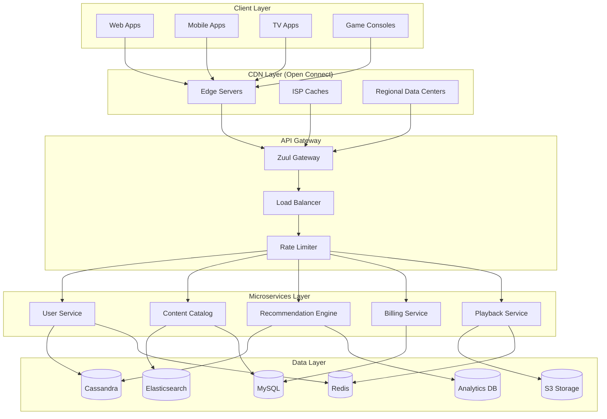
```mermaid
graph TB
    subgraph "Client Layer"
        WEB[Web Apps]
        MOBILE[Mobile Apps]
        TV[TV Apps]
        CONSOLE[Game Consoles]
    end
    
    subgraph "CDN Layer (Open Connect)"
        EDGE[Edge Servers]
        ISP[ISP Caches]
        REGIONAL[Regional Data Centers]
    end
    
    subgraph "API Gateway"
        ZUUL[Zuul Gateway]
        LB[Load Balancer]
        RATE[Rate Limiter]
    end
    
    subgraph "Microservices Layer"
        USER[User Service]
        CONTENT[Content Catalog]
        RECOMMEND[Recommendation Engine]
        BILLING[Billing Service]
        PLAYBACK[Playback Service]
    end
    
    subgraph "Data Layer"
        CASSANDRA[(Cassandra)]
        MYSQL[(MySQL)]
        ELASTIC[(Elasticsearch)]
        REDIS[(Redis)]
        S3[(S3 Storage)]
        ANALYTICS[(Analytics DB)]
    end
    
    WEB --> EDGE
    MOBILE --> EDGE
    TV --> EDGE
    CONSOLE --> EDGE
    
    EDGE --> ZUUL
    ISP --> ZUUL
    REGIONAL --> ZUUL
    
    ZUUL --> LB
    LB --> RATE
    RATE --> USER
    RATE --> CONTENT
    RATE --> RECOMMEND
    RATE --> BILLING
    RATE --> PLAYBACK
    
    USER --> CASSANDRA
    USER --> REDIS
    CONTENT --> ELASTIC
    CONTENT --> MYSQL
    RECOMMEND --> CASSANDRA
    RECOMMEND --> ANALYTICS
    BILLING --> MYSQL
    PLAYBACK --> S3
    PLAYBACK --> REDIS
```

## Core Components

### 1. Content Delivery Network (Open Connect)

Netflix's custom CDN that handles 95% of all traffic.

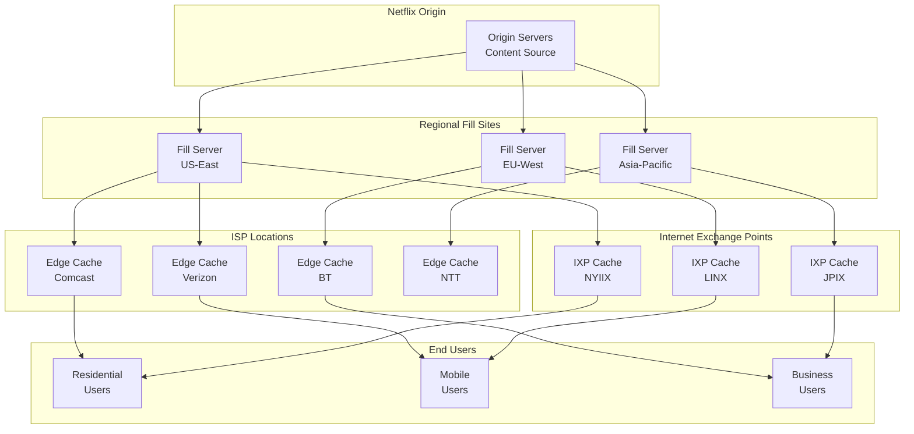
```mermaid
graph TD
    subgraph "Netflix Origin"
        ORIGIN[Origin Servers<br/>Content Source]
    end
    
    subgraph "Regional Fill Sites"
        FILL1[Fill Server<br/>US-East]
        FILL2[Fill Server<br/>EU-West]
        FILL3[Fill Server<br/>Asia-Pacific]
    end
    
    subgraph "ISP Locations"
        ISP1[Edge Cache<br/>Comcast]
        ISP2[Edge Cache<br/>Verizon]
        ISP3[Edge Cache<br/>BT]
        ISP4[Edge Cache<br/>NTT]
    end
    
    subgraph "Internet Exchange Points"
        IXP1[IXP Cache<br/>NYIIX]
        IXP2[IXP Cache<br/>LINX]
        IXP3[IXP Cache<br/>JPIX]
    end
    
    subgraph "End Users"
        USER1[Residential<br/>Users]
        USER2[Mobile<br/>Users]
        USER3[Business<br/>Users]
    end
    
    ORIGIN --> FILL1
    ORIGIN --> FILL2
    ORIGIN --> FILL3
    
    FILL1 --> ISP1
    FILL1 --> ISP2
    FILL1 --> IXP1
    
    FILL2 --> ISP3
    FILL2 --> IXP2
    
    FILL3 --> ISP4
    FILL3 --> IXP3
    
    ISP1 --> USER1
    ISP2 --> USER2
    ISP3 --> USER3
    IXP1 --> USER1
    IXP2 --> USER2
    IXP3 --> USER3
```

**Components:**
- **Edge Servers**: Deployed at ISPs and internet exchange points
- **Fill Servers**: Cache popular content from origin servers
- **Regional Centers**: Serve less popular content

**Key Features:**
- 17,000+ servers in 1,000+ locations
- Intelligent routing based on network conditions
- Predictive caching using machine learning
- Supports HTTP/2 and QUIC protocols

### 2. API Gateway (Zuul)

Entry point for all client requests with intelligent routing.

**Architecture Pattern:**
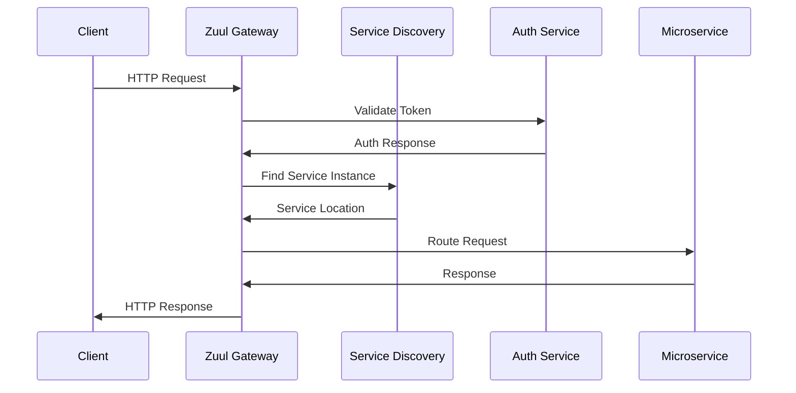
```mermaid
sequenceDiagram
    participant Client
    participant Zuul as Zuul Gateway
    participant Discovery as Service Discovery
    participant Auth as Auth Service
    participant Service as Microservice
    
    Client->>Zuul: HTTP Request
    Zuul->>Auth: Validate Token
    Auth->>Zuul: Auth Response
    Zuul->>Discovery: Find Service Instance
    Discovery->>Zuul: Service Location
    Zuul->>Service: Route Request
    Service->>Zuul: Response
    Zuul->>Client: HTTP Response
```

**Responsibilities:**
- Authentication and authorization
- Request routing and load balancing
- Rate limiting and circuit breaking
- Request/response transformation
- Logging and monitoring

### 3. Microservices Architecture

Netflix operates 700+ microservices in production.

#### Core Services:

#### User Profile Service

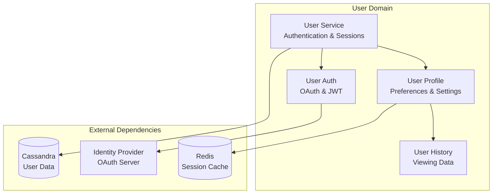
```mermaid
graph TD
    subgraph "User Domain"
        US[User Service<br/>Authentication & Sessions]
        UP[User Profile<br/>Preferences & Settings]
        UA[User Auth<br/>OAuth & JWT]
        UH[User History<br/>Viewing Data]
    end
    
    subgraph "External Dependencies"
        CASSANDRA[(Cassandra<br/>User Data)]
        REDIS[(Redis<br/>Session Cache)]
        AUTH_PROVIDER[Identity Provider<br/>OAuth Server]
    end
    
    US --> UP
    US --> UA
    UP --> UH
    
    US --> CASSANDRA
    UA --> AUTH_PROVIDER
    UP --> REDIS
```

- User authentication and session management
- Profile creation and management
- Viewing preferences and parental controls
- Technologies: Java, Spring Boot, Cassandra

#### Content Catalog Service

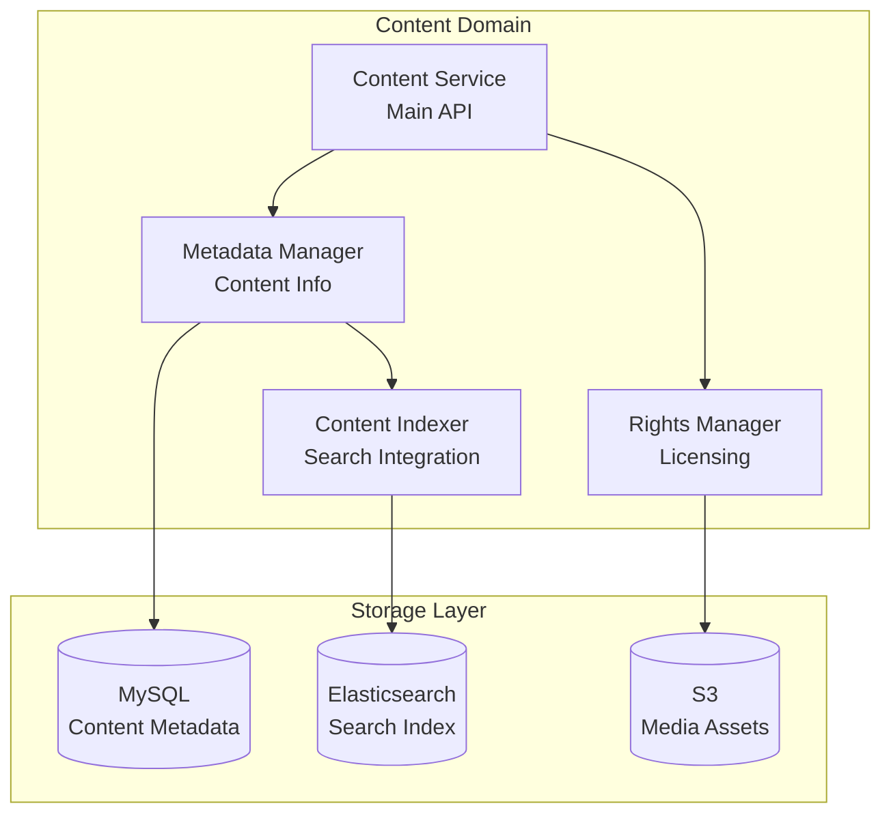
```mermaid
graph TD
    subgraph "Content Domain"
        CS[Content Service<br/>Main API]
        CM[Metadata Manager<br/>Content Info]
        CR[Rights Manager<br/>Licensing]
        CI[Content Indexer<br/>Search Integration]
    end
    
    subgraph "Storage Layer"
        MYSQL[(MySQL<br/>Content Metadata)]
        ELASTIC[(Elasticsearch<br/>Search Index)]
        S3[(S3<br/>Media Assets)]
    end
    
    CS --> CM
    CS --> CR
    CM --> CI
    
    CM --> MYSQL
    CI --> ELASTIC
    CR --> S3
```

- Metadata management for movies/TV shows
- Content versioning and localization
- Search indexing and faceted search
- Technologies: Java, Elasticsearch, MySQL

#### Recommendation Engine

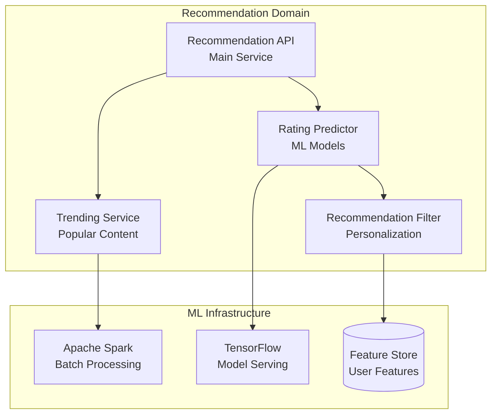
```mermaid
graph TD
    subgraph "Recommendation Domain"
        RE[Recommendation API<br/>Main Service]
        RP[Rating Predictor<br/>ML Models]
        RT[Trending Service<br/>Popular Content]
        RF[Recommendation Filter<br/>Personalization]
    end
    
    subgraph "ML Infrastructure"
        SPARK[Apache Spark<br/>Batch Processing]
        TENSORFLOW[TensorFlow<br/>Model Serving]
        FEATURE_STORE[(Feature Store<br/>User Features)]
    end
    
    RE --> RP
    RE --> RT
    RP --> RF
    
    RP --> TENSORFLOW
    RT --> SPARK
    RF --> FEATURE_STORE
```

- Personalized content recommendations
- Collaborative and content-based filtering
- Real-time and batch processing pipelines
- Technologies: Python, Scala, Apache Spark, TensorFlow

#### Billing Service

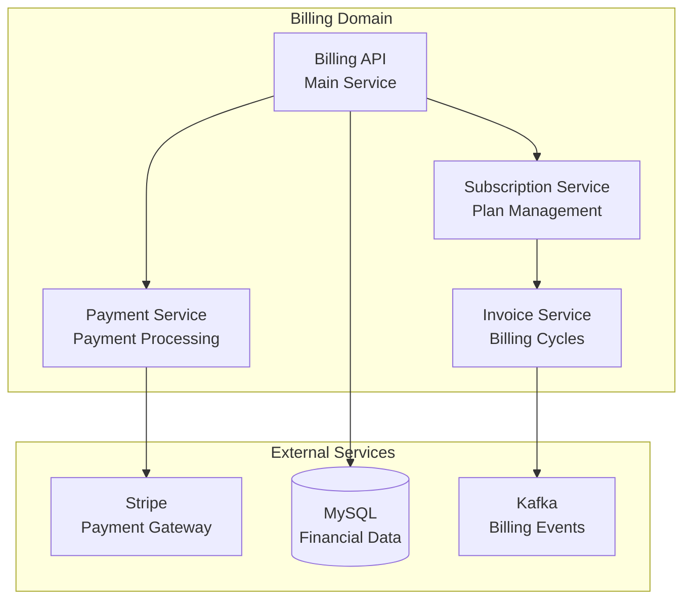
```mermaid
graph TD
    subgraph "Billing Domain"
        BS[Billing API<br/>Main Service]
        PS[Payment Service<br/>Payment Processing]
        SS[Subscription Service<br/>Plan Management]
        IS[Invoice Service<br/>Billing Cycles]
    end
    
    subgraph "External Services"
        STRIPE[Stripe<br/>Payment Gateway]
        MYSQL[(MySQL<br/>Financial Data)]
        KAFKA[Kafka<br/>Billing Events]
    end
    
    BS --> PS
    BS --> SS
    SS --> IS
    
    PS --> STRIPE
    BS --> MYSQL
    IS --> KAFKA
```

- Subscription management
- Payment processing and billing cycles
- Regional pricing and tax calculations
- Technologies: Java, MySQL, Apache Kafka

#### Playback Service

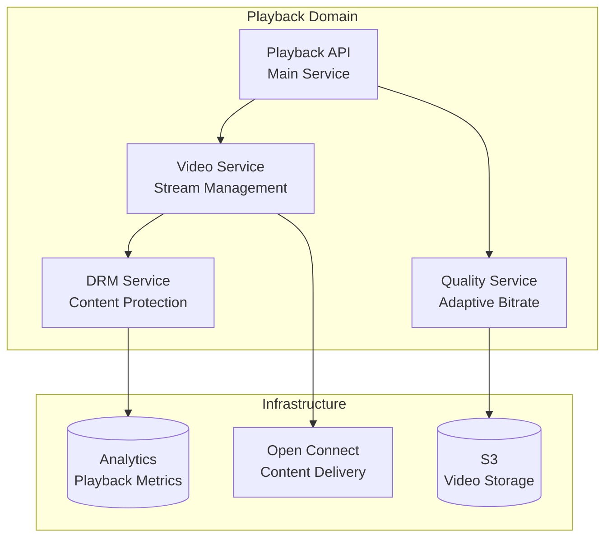
```mermaid
graph TD
    subgraph "Playback Domain"
        PB[Playback API<br/>Main Service]
        VS[Video Service<br/>Stream Management]
        QS[Quality Service<br/>Adaptive Bitrate]
        DRM[DRM Service<br/>Content Protection]
    end
    
    subgraph "Infrastructure"
        CDN[Open Connect<br/>Content Delivery]
        S3[(S3<br/>Video Storage)]
        ANALYTICS[(Analytics<br/>Playback Metrics)]
    end
    
    PB --> VS
    PB --> QS
    VS --> DRM
    
    VS --> CDN
    QS --> S3
    DRM --> ANALYTICS
```

- Video streaming and adaptive bitrate
- DRM and content protection
- Quality metrics and analytics
- Technologies: C++, Java, MPEG-DASH, Widevine

### 4. Data Storage Architecture

#### Cassandra (Primary Database)

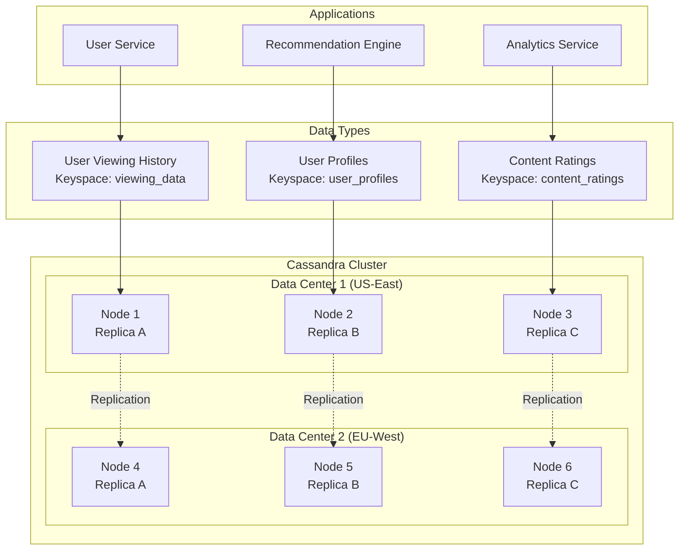
```mermaid
graph TD
    subgraph "Cassandra Cluster"
        subgraph "Data Center 1 (US-East)"
            C1[Node 1<br/>Replica A]
            C2[Node 2<br/>Replica B]
            C3[Node 3<br/>Replica C]
        end
        
        subgraph "Data Center 2 (EU-West)"
            C4[Node 4<br/>Replica A]
            C5[Node 5<br/>Replica B]
            C6[Node 6<br/>Replica C]
        end
    end
    
    subgraph "Data Types"
        VIEWING[User Viewing History<br/>Keyspace: viewing_data]
        PROFILES[User Profiles<br/>Keyspace: user_profiles]
        RATINGS[Content Ratings<br/>Keyspace: content_ratings]
    end
    
    subgraph "Applications"
        USER_SERVICE[User Service]
        REC_ENGINE[Recommendation Engine]
        ANALYTICS[Analytics Service]
    end
    
    C1 -.->|Replication| C4
    C2 -.->|Replication| C5
    C3 -.->|Replication| C6
    
    USER_SERVICE --> VIEWING
    REC_ENGINE --> PROFILES
    ANALYTICS --> RATINGS
    
    VIEWING --> C1
    PROFILES --> C2
    RATINGS --> C3
```

- User viewing history and preferences
- Content metadata and ratings
- Horizontally scalable across multiple regions
- Eventually consistent with tunable consistency levels

#### MySQL

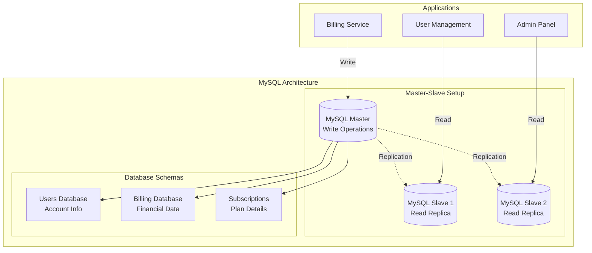
```mermaid
graph TD
    subgraph "MySQL Architecture"
        subgraph "Master-Slave Setup"
            MASTER[(MySQL Master<br/>Write Operations)]
            SLAVE1[(MySQL Slave 1<br/>Read Replica)]
            SLAVE2[(MySQL Slave 2<br/>Read Replica)]
        end
        
        subgraph "Database Schemas"
            USERS[Users Database<br/>Account Info]
            BILLING[Billing Database<br/>Financial Data]
            SUBSCRIPTIONS[Subscriptions<br/>Plan Details]
        end
    end
    
    subgraph "Applications"
        BILLING_SERVICE[Billing Service]
        USER_MGMT[User Management]
        ADMIN_PANEL[Admin Panel]
    end
    
    MASTER -.->|Replication| SLAVE1
    MASTER -.->|Replication| SLAVE2
    
    BILLING_SERVICE -->|Write| MASTER
    USER_MGMT -->|Read| SLAVE1
    ADMIN_PANEL -->|Read| SLAVE2
    
    MASTER --> USERS
    MASTER --> BILLING
    MASTER --> SUBSCRIPTIONS
```

- Financial data and billing information
- User account information
- ACID compliance for critical transactions

#### Elasticsearch

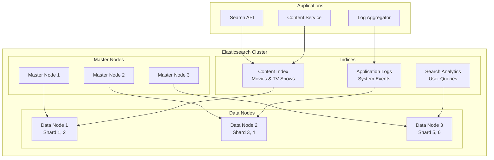
```mermaid
graph TD
    subgraph "Elasticsearch Cluster"
        subgraph "Master Nodes"
            M1[Master Node 1]
            M2[Master Node 2]
            M3[Master Node 3]
        end
        
        subgraph "Data Nodes"
            D1[Data Node 1<br/>Shard 1, 2]
            D2[Data Node 2<br/>Shard 3, 4]
            D3[Data Node 3<br/>Shard 5, 6]
        end
        
        subgraph "Indices"
            CONTENT[Content Index<br/>Movies & TV Shows]
            LOGS[Application Logs<br/>System Events]
            SEARCH[Search Analytics<br/>User Queries]
        end
    end
    
    subgraph "Applications"
        SEARCH_API[Search API]
        CONTENT_SERVICE[Content Service]
        LOG_AGGREGATOR[Log Aggregator]
    end
    
    M1 --> D1
    M2 --> D2
    M3 --> D3
    
    SEARCH_API --> CONTENT
    CONTENT_SERVICE --> CONTENT
    LOG_AGGREGATOR --> LOGS
    
    CONTENT --> D1
    LOGS --> D2
    SEARCH --> D3
```

- Content search and discovery
- Log aggregation and analysis
- Real-time search capabilities

#### Redis

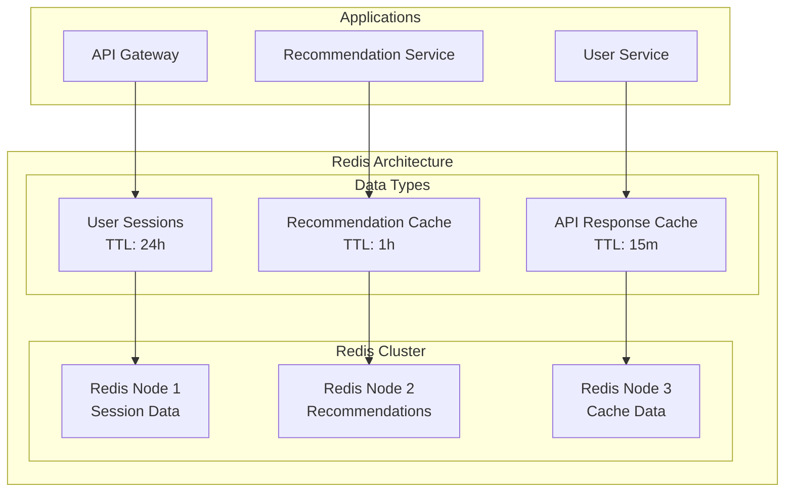
```mermaid
graph TD
    subgraph "Redis Architecture"
        subgraph "Redis Cluster"
            R1[Redis Node 1<br/>Session Data]
            R2[Redis Node 2<br/>Recommendations]
            R3[Redis Node 3<br/>Cache Data]
        end
        
        subgraph "Data Types"
            SESSIONS[User Sessions<br/>TTL: 24h]
            REC_CACHE[Recommendation Cache<br/>TTL: 1h]
            API_CACHE[API Response Cache<br/>TTL: 15m]
        end
    end
    
    subgraph "Applications"
        API_GATEWAY[API Gateway]
        REC_SERVICE[Recommendation Service]
        USER_SERVICE[User Service]
    end
    
    API_GATEWAY --> SESSIONS
    REC_SERVICE --> REC_CACHE
    USER_SERVICE --> API_CACHE
    
    SESSIONS --> R1
    REC_CACHE --> R2
    API_CACHE --> R3
```

- Session caching
- Temporary data storage
- Real-time recommendation caching

#### Amazon S3

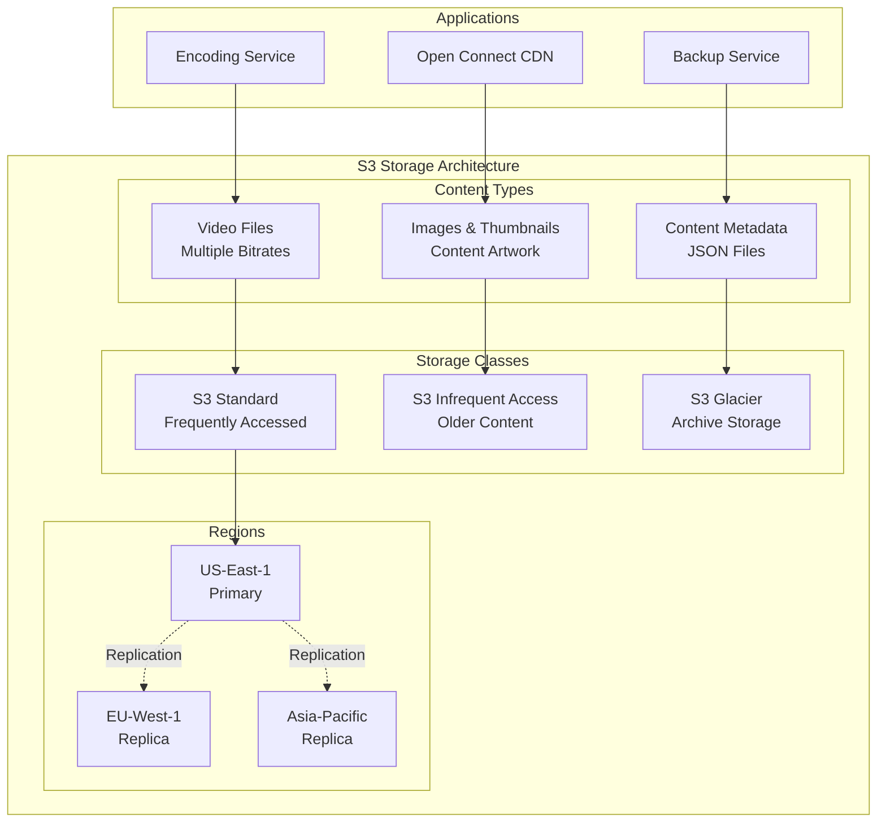
```mermaid
graph TD
    subgraph "S3 Storage Architecture"
        subgraph "Storage Classes"
            S3_STANDARD[S3 Standard<br/>Frequently Accessed]
            S3_IA[S3 Infrequent Access<br/>Older Content]
            S3_GLACIER[S3 Glacier<br/>Archive Storage]
        end
        
        subgraph "Content Types"
            VIDEO[Video Files<br/>Multiple Bitrates]
            IMAGES[Images & Thumbnails<br/>Content Artwork]
            METADATA[Content Metadata<br/>JSON Files]
        end
        
        subgraph "Regions"
            US_EAST[US-East-1<br/>Primary]
            EU_WEST[EU-West-1<br/>Replica]
            ASIA_PAC[Asia-Pacific<br/>Replica]
        end
    end
    
    subgraph "Applications"
        ENCODING[Encoding Service]
        CDN[Open Connect CDN]
        BACKUP[Backup Service]
    end
    
    ENCODING --> VIDEO
    CDN --> IMAGES
    BACKUP --> METADATA
    
    VIDEO --> S3_STANDARD
    IMAGES --> S3_IA
    METADATA --> S3_GLACIER
    
    S3_STANDARD --> US_EAST
    US_EAST -.->|Replication| EU_WEST
    US_EAST -.->|Replication| ASIA_PAC
```

- Content storage (videos, images, metadata)
- Data backup and archival
- Cross-region replication

### 5. Stream Processing Architecture

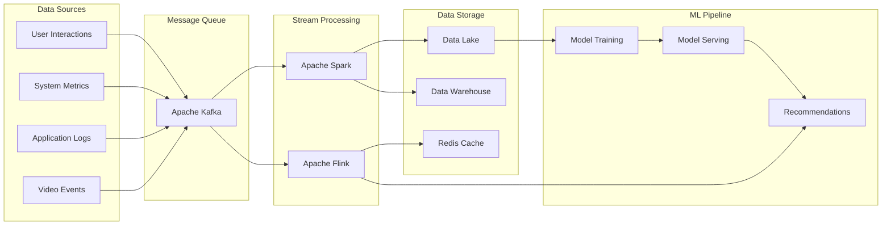
```mermaid
graph LR
    subgraph "Data Sources"
        UI[User Interactions]
        SYS[System Metrics]
        LOG[Application Logs]
        VID[Video Events]
    end
    
    subgraph "Message Queue"
        KAFKA[Apache Kafka]
    end
    
    subgraph "Stream Processing"
        SPARK[Apache Spark]
        FLINK[Apache Flink]
    end
    
    subgraph "Data Storage"
        DL[Data Lake]
        DW[Data Warehouse]
        CACHE[Redis Cache]
    end
    
    subgraph "ML Pipeline"
        TRAIN[Model Training]
        SERVE[Model Serving]
        REC[Recommendations]
    end
    
    UI --> KAFKA
    SYS --> KAFKA
    LOG --> KAFKA
    VID --> KAFKA
    
    KAFKA --> SPARK
    KAFKA --> FLINK
    
    SPARK --> DL
    SPARK --> DW
    FLINK --> CACHE
    FLINK --> REC
    
    DL --> TRAIN
    TRAIN --> SERVE
    SERVE --> REC
```

#### Apache Kafka
- Real-time event streaming
- User interaction events
- System metrics and logs
- Handles billions of events daily

#### Apache Spark
- Batch processing for recommendations
- ETL operations for data warehousing
- Machine learning model training

#### Apache Flink
- Real-time stream processing
- Complex event processing
- Low-latency data pipelines

## Scalability Patterns

### 1. Horizontal Scaling

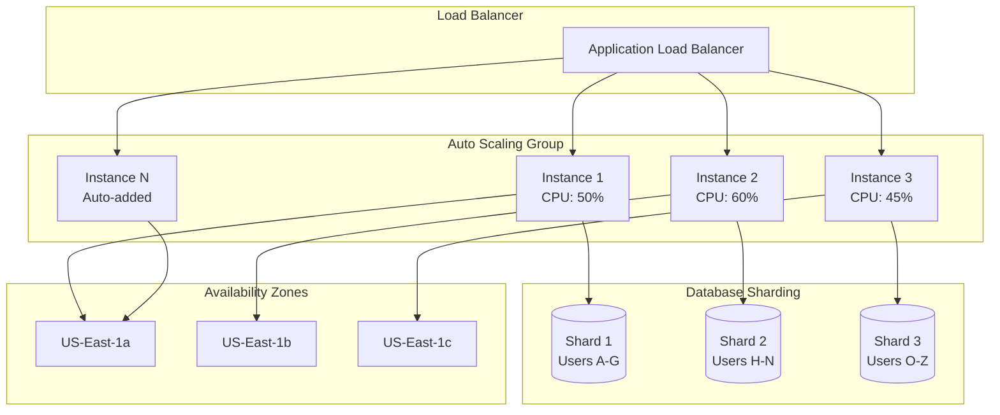
```mermaid
graph TD
    subgraph "Load Balancer"
        LB[Application Load Balancer]
    end
    
    subgraph "Auto Scaling Group"
        ASG1[Instance 1<br/>CPU: 50%]
        ASG2[Instance 2<br/>CPU: 60%]
        ASG3[Instance 3<br/>CPU: 45%]
        ASG4[Instance N<br/>Auto-added]
    end
    
    subgraph "Database Sharding"
        SHARD1[(Shard 1<br/>Users A-G)]
        SHARD2[(Shard 2<br/>Users H-N)]
        SHARD3[(Shard 3<br/>Users O-Z)]
    end
    
    subgraph "Availability Zones"
        AZ1[US-East-1a]
        AZ2[US-East-1b]
        AZ3[US-East-1c]
    end
    
    LB --> ASG1
    LB --> ASG2
    LB --> ASG3
    LB --> ASG4
    
    ASG1 --> SHARD1
    ASG2 --> SHARD2
    ASG3 --> SHARD3
    
    ASG1 --> AZ1
    ASG2 --> AZ2
    ASG3 --> AZ3
    ASG4 --> AZ1
```

- Auto-scaling groups based on CPU/memory metrics
- Database sharding by user ID or geographic region
- Microservices deployed across multiple availability zones

### 2. Caching Strategy
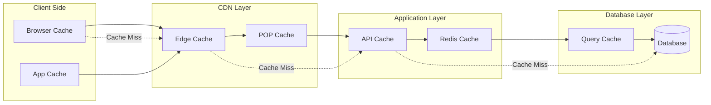
```mermaid
graph LR
    subgraph "Client Side"
        BC[Browser Cache]
        AC[App Cache]
    end
    
    subgraph "CDN Layer"
        EDGE[Edge Cache]
        POP[POP Cache]
    end
    
    subgraph "Application Layer"
        API[API Cache]
        REDIS[Redis Cache]
    end
    
    subgraph "Database Layer"
        QC[Query Cache]
        DB[(Database)]
    end
    
    BC --> EDGE
    AC --> EDGE
    EDGE --> POP
    POP --> API
    API --> REDIS
    REDIS --> QC
    QC --> DB
    
    BC -.->|Cache Miss| EDGE
    EDGE -.->|Cache Miss| API
    API -.->|Cache Miss| DB
```

**Cache Levels:**
- **L1**: Browser cache (static assets)
- **L2**: CDN edge cache (video content)
- **L3**: Application cache (API responses)
- **L4**: Database query cache

### 3. Circuit Breaker Pattern

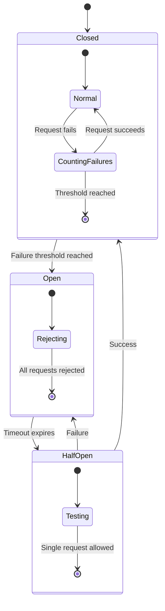
```mermaid
stateDiagram-v2
    [*] --> Closed
    Closed --> Open : Failure threshold reached
    Open --> HalfOpen : Timeout expires
    HalfOpen --> Closed : Success
    HalfOpen --> Open : Failure
    
    state Closed {
        [*] --> Normal
        Normal --> CountingFailures : Request fails
        CountingFailures --> Normal : Request succeeds
        CountingFailures --> [*] : Threshold reached
    }
    
    state Open {
        [*] --> Rejecting
        Rejecting --> [*] : All requests rejected
    }
    
    state HalfOpen {
        [*] --> Testing
        Testing --> [*] : Single request allowed
    }
```

- Hystrix library for fault tolerance
- Automatic failover to cached responses
- Graceful degradation of non-critical features

## Security Architecture

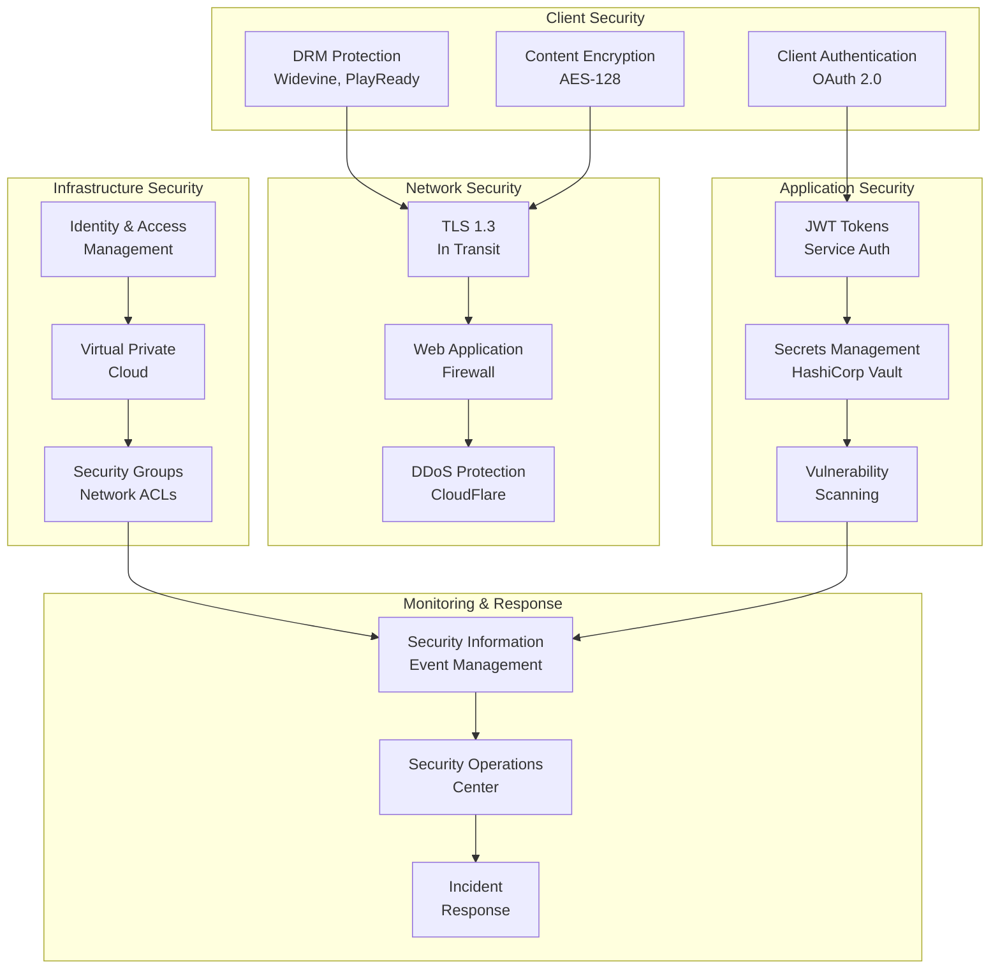
```mermaid
graph TB
    subgraph "Client Security"
        DRM[DRM Protection<br/>Widevine, PlayReady]
        ENCRYPT[Content Encryption<br/>AES-128]
        AUTH[Client Authentication<br/>OAuth 2.0]
    end
    
    subgraph "Network Security"
        TLS[TLS 1.3<br/>In Transit]
        WAF[Web Application<br/>Firewall]
        DDOS[DDoS Protection<br/>CloudFlare]
    end
    
    subgraph "Infrastructure Security"
        IAM[Identity & Access<br/>Management]
        VPC[Virtual Private<br/>Cloud]
        SG[Security Groups<br/>Network ACLs]
    end
    
    subgraph "Application Security"
        JWT[JWT Tokens<br/>Service Auth]
        VAULT[Secrets Management<br/>HashiCorp Vault]
        SCAN[Vulnerability<br/>Scanning]
    end
    
    subgraph "Monitoring & Response"
        SIEM[Security Information<br/>Event Management]
        SOC[Security Operations<br/>Center]
        INCIDENT[Incident<br/>Response]
    end
    
    DRM --> TLS
    ENCRYPT --> TLS
    AUTH --> JWT
    
    TLS --> WAF
    WAF --> DDOS
    
    IAM --> VPC
    VPC --> SG
    
    JWT --> VAULT
    VAULT --> SCAN
    
    SG --> SIEM
    SCAN --> SIEM
    SIEM --> SOC
    SOC --> INCIDENT
```

### Content Protection
- **DRM**: Widevine, PlayReady, FairPlay
- **Multi-layer encryption**: AES-128, SSL/TLS
- **Geo-blocking**: Region-specific content licensing
- **Anti-piracy**: Forensic watermarking

### Infrastructure Security
- **Zero-trust network**: Service-to-service authentication
- **IAM roles**: Least privilege access control
- **Security groups**: Network-level firewalls
- **Vulnerability scanning**: Automated security testing

## Monitoring and Observability

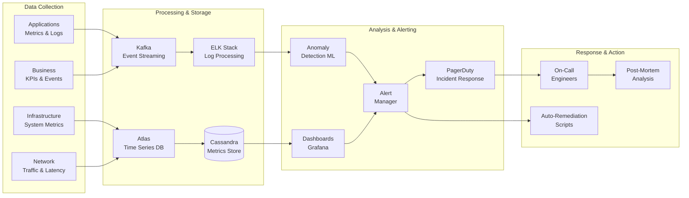
```mermaid
graph LR
    subgraph "Data Collection"
        APPS[Applications<br/>Metrics & Logs]
        INFRA[Infrastructure<br/>System Metrics]
        NETWORK[Network<br/>Traffic & Latency]
        BUSINESS[Business<br/>KPIs & Events]
    end
    
    subgraph "Processing & Storage"
        ATLAS[Atlas<br/>Time Series DB]
        ELK[ELK Stack<br/>Log Processing]
        KAFKA[Kafka<br/>Event Streaming]
        CASSANDRA[(Cassandra<br/>Metrics Store)]
    end
    
    subgraph "Analysis & Alerting"
        ANOMALY[Anomaly<br/>Detection ML]
        ALERTS[Alert<br/>Manager]
        DASH[Dashboards<br/>Grafana]
        PAGER[PagerDuty<br/>Incident Response]
    end
    
    subgraph "Response & Action"
        ONCALL[On-Call<br/>Engineers]
        AUTO[Auto-Remediation<br/>Scripts]
        POSTMORTEM[Post-Mortem<br/>Analysis]
    end
    
    APPS --> KAFKA
    INFRA --> ATLAS
    NETWORK --> ATLAS
    BUSINESS --> KAFKA
    
    KAFKA --> ELK
    ATLAS --> CASSANDRA
    ELK --> ANOMALY
    CASSANDRA --> DASH
    
    ANOMALY --> ALERTS
    DASH --> ALERTS
    ALERTS --> PAGER
    
    PAGER --> ONCALL
    ALERTS --> AUTO
    ONCALL --> POSTMORTEM
```

### Metrics Collection
- **Atlas**: Real-time operational insights
- **Custom metrics**: Business and technical KPIs
- **Distributed tracing**: Request flow across services

### Alerting System
- **PagerDuty integration**: Critical alert routing
- **Anomaly detection**: Machine learning-based alerts
- **Escalation policies**: Multi-tier support structure

### Logging
- **Centralized logging**: ELK stack (Elasticsearch, Logstash, Kibana)
- **Structured logging**: JSON format for parsing
- **Log retention**: Configurable based on compliance needs

## Deployment and DevOps

### Continuous Integration/Continuous Deployment

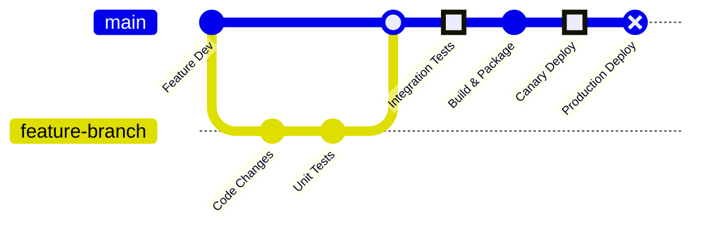
```mermaid
gitGraph
    commit id: "Feature Dev"
    branch feature-branch
    checkout feature-branch
    commit id: "Code Changes"
    commit id: "Unit Tests"
    checkout main
    merge feature-branch
    commit id: "Integration Tests" type: HIGHLIGHT
    commit id: "Build & Package"
    commit id: "Canary Deploy" type: HIGHLIGHT
    commit id: "Production Deploy" type: REVERSE
```

```mermaid
flowchart LR
    subgraph "Development"
        CODE[Code Commit]
        BUILD[Build & Test]
        ARTIFACT[Create Artifact]
    end
    
    subgraph "Deployment Pipeline"
        CANARY[Canary Deployment<br/>1% Traffic]
        MONITOR[Monitor Metrics]
        ROLLOUT[Full Rollout<br/>100% Traffic]
    end
    
    subgraph "Rollback Strategy"
        ALERT[Alert Triggered]
        ROLLBACK[Automatic Rollback]
        INVESTIGATE[Investigate Issues]
    end
    
    CODE --> BUILD
    BUILD --> ARTIFACT
    ARTIFACT --> CANARY
    CANARY --> MONITOR
    MONITOR --> ROLLOUT
    MONITOR --> ALERT
    ALERT --> ROLLBACK
    ROLLBACK --> INVESTIGATE
```

- **Spinnaker**: Multi-cloud deployment platform
- **Canary deployments**: Gradual rollout strategy
- **Blue-green deployments**: Zero-downtime releases

### Infrastructure as Code
- **Terraform**: Infrastructure provisioning
- **Ansible**: Configuration management
- **Docker containers**: Application packaging

### Chaos Engineering

```mermaid
flowchart TD
    subgraph "Chaos Tools"
        CM[Chaos Monkey<br/>Service Failures]
        CK[Chaos Kong<br/>Region Failures]
        CG[Chaos Gorilla<br/>AZ Failures]
    end
    
    subgraph "Target Systems"
        MS[Microservices]
        AZ[Availability Zones]
        REGION[Regions]
    end
    
    subgraph "Monitoring"
        METRICS[System Metrics]
        ALERTS[Alert System]
        DASH[Dashboards]
    end
    
    subgraph "Response"
        AUTO[Auto-Recovery]
        MANUAL[Manual Intervention]
        LEARN[Learn & Improve]
    end
    
    CM --> MS
    CG --> AZ
    CK --> REGION
    
    MS --> METRICS
    AZ --> METRICS
    REGION --> METRICS
    
    METRICS --> ALERTS
    ALERTS --> DASH
    DASH --> AUTO
    DASH --> MANUAL
    
    AUTO --> LEARN
    MANUAL --> LEARN
```

- **Chaos Monkey**: Random service failures
- **Chaos Kong**: Entire region failures
- **Chaos Gorilla**: Availability zone failures

## Performance Optimization

### Video Encoding and Delivery

```mermaid
flowchart LR
    subgraph "Content Ingestion"
        SOURCE[Source Video<br/>4K, HDR, Dolby Vision]
    end
    
    subgraph "Encoding Pipeline"
        TRANSCODE[Transcoding<br/>Multiple Resolutions]
        OPTIMIZE[Per-Title Optimization]
        PACKAGE[Packaging<br/>MPEG-DASH, HLS]
    end
    
    subgraph "Storage & CDN"
        STORE[Content Storage<br/>Amazon S3]
        CDN[Open Connect CDN]
    end
    
    subgraph "Client Delivery"
        ADAPTIVE[Adaptive Bitrate<br/>Streaming]
        PLAYER[Video Player]
    end
    
    SOURCE --> TRANSCODE
    TRANSCODE --> OPTIMIZE
    OPTIMIZE --> PACKAGE
    PACKAGE --> STORE
    STORE --> CDN
    CDN --> ADAPTIVE
    ADAPTIVE --> PLAYER
    
    subgraph "Quality Levels"
        Q240[240p - 300 Kbps]
        Q480[480p - 750 Kbps]
        Q720[720p - 1.5 Mbps]
        Q1080[1080p - 3 Mbps]
        Q4K[4K - 15 Mbps]
    end
    
    TRANSCODE --> Q240
    TRANSCODE --> Q480
    TRANSCODE --> Q720
    TRANSCODE --> Q1080
    TRANSCODE --> Q4K
```

**Encoding Pipeline:**
1. **Source ingestion**: 4K, HDR, Dolby Vision
2. **Transcoding**: Multiple resolutions (240p to 4K)
3. **Optimization**: Per-title encoding
4. **Packaging**: MPEG-DASH, HLS formats

### Network Optimization
- **TCP optimization**: Custom congestion control
- **QUIC protocol**: Reduced connection latency
- **HTTP/2**: Multiplexed connections
- **Compression**: Gzip, Brotli for text content

### Client-Side Optimization
- **Prefetching**: Predict and cache next episodes
- **Offline downloads**: Mobile data optimization
- **Adaptive streaming**: Quality adjustment based on network

## Regional Architecture

### Multi-Region Deployment

```mermaid
graph TB
    subgraph "US-East (Primary)"
        USE_API[API Services]
        USE_DB[(Primary Database)]
        USE_CDN[CDN Nodes]
    end
    
    subgraph "EU-West"
        EUW_API[API Services]
        EUW_DB[(Replica Database)]
        EUW_CDN[CDN Nodes]
    end
    
    subgraph "Asia-Pacific"
        APAC_API[API Services]
        APAC_DB[(Replica Database)]
        APAC_CDN[CDN Nodes]
    end
    
    subgraph "Latin America"
        LATAM_API[API Services]
        LATAM_DB[(Replica Database)]
        LATAM_CDN[CDN Nodes]
    end
    
    subgraph "Global Services"
        DNS[Global DNS]
        LB[Global Load Balancer]
        MONITOR[Global Monitoring]
    end
    
    DNS --> LB
    LB --> USE_API
    LB --> EUW_API
    LB --> APAC_API
    LB --> LATAM_API
    
    USE_DB -.->|Replication| EUW_DB
    USE_DB -.->|Replication| APAC_DB
    USE_DB -.->|Replication| LATAM_DB
    
    MONITOR --> USE_API
    MONITOR --> EUW_API
    MONITOR --> APAC_API
    MONITOR --> LATAM_API
```

**Regional Components:**
- **Control Plane**: User management, billing
- **Data Plane**: Content delivery, streaming
- **Cross-region replication**: User data sync

### Disaster Recovery

```mermaid
flowchart TD
    subgraph "Primary Region"
        PRIMARY[Primary Services<br/>US-East-1]
        PRI_DB[(Primary Database)]
        PRI_STORAGE[Primary Storage]
    end
    
    subgraph "Secondary Region"
        SECONDARY[Standby Services<br/>US-West-2]
        SEC_DB[(Replica Database)]
        SEC_STORAGE[Replica Storage]
    end
    
    subgraph "Monitoring"
        HEALTH[Health Checks]
        FAILOVER[Failover Logic]
        DNS_SWITCH[DNS Switching]
    end
    
    subgraph "Recovery Process"
        DETECT[Outage Detection<br/>< 2 minutes]
        SWITCH[Traffic Switch<br/>< 10 minutes]
        VALIDATE[Service Validation<br/>< 30 minutes]
        RECOVER[Full Recovery<br/>< 4 hours]
    end
    
    PRIMARY -.->|Continuous Replication| SECONDARY
    PRI_DB -.->|Real-time Sync| SEC_DB
    PRI_STORAGE -.->|Cross-region Sync| SEC_STORAGE
    
    HEALTH --> FAILOVER
    FAILOVER --> DNS_SWITCH
    DNS_SWITCH --> SECONDARY
    
    HEALTH --> DETECT
    DETECT --> SWITCH
    SWITCH --> VALIDATE
    VALIDATE --> RECOVER
```

- **RTO**: Recovery Time Objective < 4 hours
- **RPO**: Recovery Point Objective < 1 hour
- **Automated failover**: Cross-region traffic routing
- **Data backup**: Multiple geographic locations

## Analytics and Machine Learning

### Data Pipeline

```mermaid
flowchart TD
    subgraph "Event Generation"
        UE[User Events<br/>Play, Pause, Rate]
        SE[System Events<br/>Errors, Performance]
        CE[Content Events<br/>Views, Completions]
    end
    
    subgraph "Real-time Processing"
        KAFKA[Apache Kafka<br/>Event Streaming]
        FLINK[Apache Flink<br/>Stream Processing]
    end
    
    subgraph "Batch Processing"
        SPARK[Apache Spark<br/>ETL & Analytics]
        HDFS[Hadoop HDFS<br/>Data Lake]
    end
    
    subgraph "Machine Learning"
        FEATURE[Feature Store]
        TRAIN[Model Training<br/>TensorFlow]
        SERVE[Model Serving<br/>TensorFlow Serving]
    end
    
    subgraph "Applications"
        REC[Recommendations]
        SEARCH[Content Search]
        PERSONALIZE[Personalization]
    end
    
    UE --> KAFKA
    SE --> KAFKA
    CE --> KAFKA
    
    KAFKA --> FLINK
    KAFKA --> SPARK
    
    FLINK --> FEATURE
    SPARK --> HDFS
    HDFS --> TRAIN
    
    FEATURE --> TRAIN
    TRAIN --> SERVE
    SERVE --> REC
    SERVE --> SEARCH
    SERVE --> PERSONALIZE
    
    FLINK -.->|Real-time| REC
```

**Components:**
- **Real-time processing**: Kafka Streams
- **Batch processing**: Apache Spark
- **Data lake**: Amazon S3 + Hadoop
- **Model serving**: TensorFlow Serving

### ML Use Cases
- **Personalized recommendations**: Content discovery
- **Content optimization**: Thumbnail selection
- **Quality prediction**: Video encoding optimization
- **Anomaly detection**: System monitoring

## Cost Optimization

```mermaid
pie title Netflix Cost Distribution
    "Content & Licensing" : 70
    "Technology Infrastructure" : 15
    "Marketing & Customer Acquisition" : 10
    "Operations & Support" : 5
```

```mermaid
graph TD
    subgraph "Infrastructure Optimization"
        RESERVED[Reserved Instances<br/>70% Cost Savings]
        SPOT[Spot Instances<br/>Batch Processing]
        AUTOSCALE[Auto-Scaling<br/>Dynamic Allocation]
    end
    
    subgraph "Content Delivery Optimization"
        CACHE[Predictive Caching<br/>Reduced Bandwidth]
        COMPRESS[Content Compression<br/>H.265, AV1]
        EDGE[Edge Computing<br/>Local Processing]
    end
    
    subgraph "Data Optimization"
        LIFECYCLE[Data Lifecycle<br/>Automated Archival]
        DEDUP[Deduplication<br/>Storage Efficiency]
        TIERED[Tiered Storage<br/>Hot/Warm/Cold]
    end
    
    subgraph "Monitoring & Analytics"
        COST_TRACK[Cost Tracking<br/>Per Service]
        USAGE[Usage Analytics<br/>Resource Optimization]
        FORECAST[Cost Forecasting<br/>Budget Planning]
    end
    
    RESERVED --> AUTOSCALE
    SPOT --> AUTOSCALE
    CACHE --> EDGE
    COMPRESS --> EDGE
    LIFECYCLE --> TIERED
    DEDUP --> TIERED
    COST_TRACK --> FORECAST
    USAGE --> FORECAST
```

### Cloud Economics
- **Reserved instances**: Long-term capacity planning
- **Spot instances**: Cost-effective batch processing
- **Auto-scaling**: Dynamic resource allocation
- **Resource tagging**: Cost allocation and tracking

### Content Delivery Optimization
- **Predictive caching**: Reduce origin server load
- **Compression algorithms**: Bandwidth optimization
- **Edge computing**: Reduced data transfer costs

## Future Architecture Considerations

### Emerging Technologies
- **5G optimization**: Ultra-low latency streaming
- **Edge AI**: Real-time content personalization
- **Quantum computing**: Advanced recommendation algorithms
- **WebRTC**: Interactive content experiences

### Scalability Roadmap
- **Global expansion**: New market penetration
- **Content diversity**: Live sports, gaming integration
- **Technology evolution**: 8K content, VR/AR support

## Conclusion

Netflix's architecture represents a masterclass in building scalable, resilient, and high-performance distributed systems. The combination of microservices, intelligent caching, advanced analytics, and robust operational practices enables Netflix to deliver exceptional user experiences at global scale.

The architecture continues to evolve, incorporating new technologies and patterns to meet growing demands while maintaining the reliability and performance that users expect from the platform.

> There might be iterations needed, current data is as close I could get.