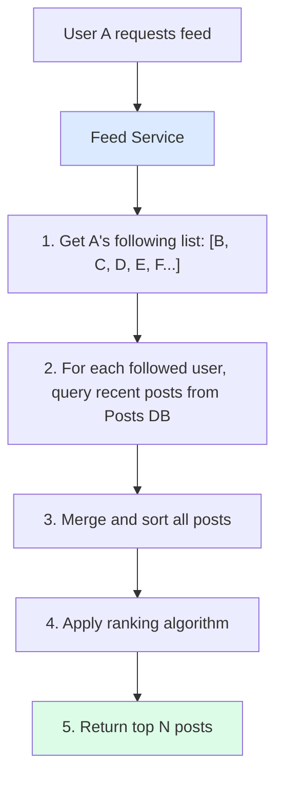
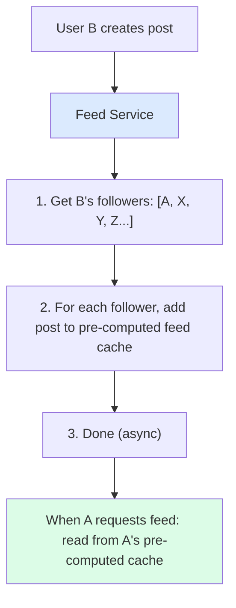
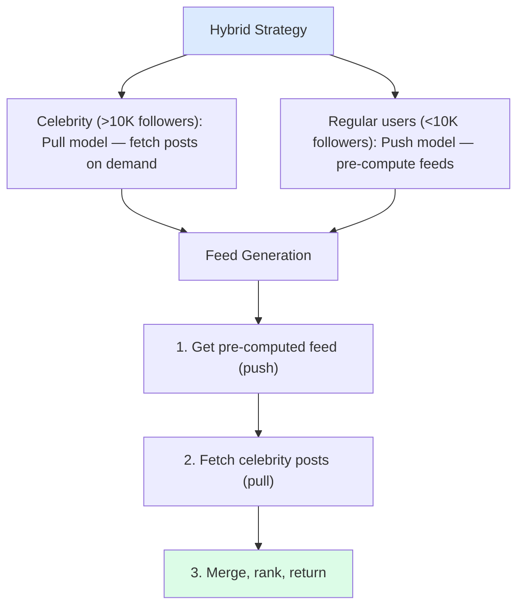
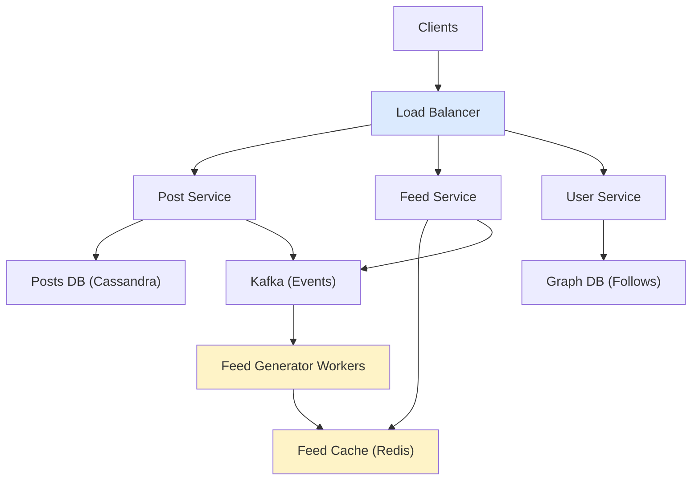
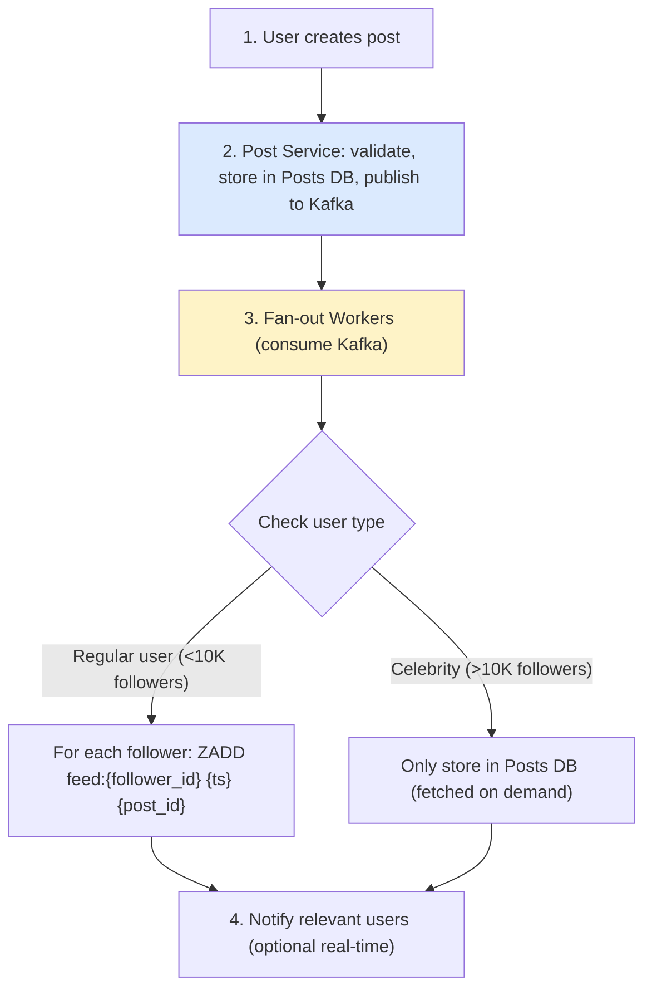
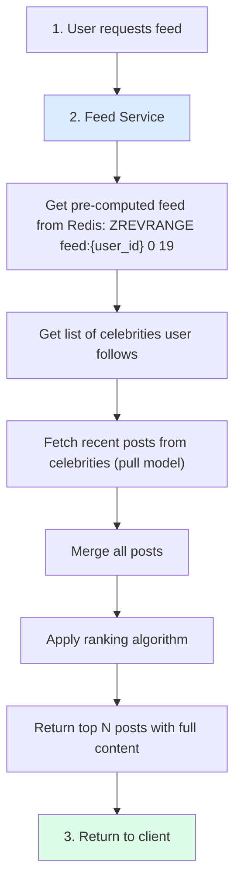
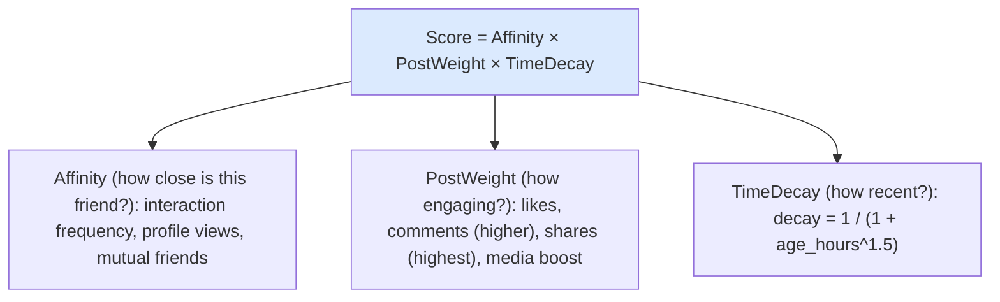
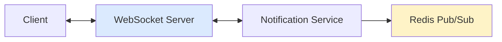
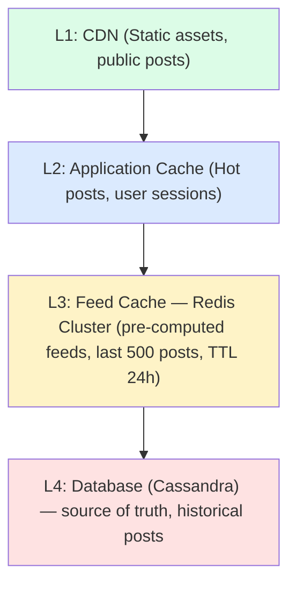

## Problem Statement

Design a news feed system that displays personalized content from friends/followers in real-time.

---

## Requirements

### Functional Requirements
- User can create posts
- User sees feed of posts from people they follow
- Feed sorted by relevance/time
- Support likes, comments, shares
- Real-time updates

### Non-Functional Requirements
- Low latency: under 200ms feed load
- High availability
- Handle 500M+ daily active users
- Scalable to billions of posts

---

## Capacity Estimation

```
Assumptions:
- 500M DAU
- Average user follows 200 people
- Average user creates 2 posts/day
- Average user checks feed 10 times/day

Traffic:
- Writes: 500M × 2 = 1B posts/day ≈ 12K/sec
- Reads: 500M × 10 = 5B feeds/day ≈ 58K/sec
- Read:Write ratio ≈ 5:1

Storage:
- Post: 1 KB average (text, metadata)
- Daily posts: 1B × 1 KB = 1 TB/day
- 5 years: 1.8 PB (without media)
```

---

## Feed Generation Approaches

### Pull Model (Fan-out on Read)



Pros: Simple, storage efficient
Cons: Slow for users following many people

### Push Model (Fan-out on Write)



Pros: Fast reads
Cons: Celebrity problem (millions of followers)

### Hybrid Approach (Recommended)



---

## High-Level Architecture



---

## Database Schema

### Posts Table (Cassandra)

```sql
CREATE TABLE posts (
    post_id UUID,
    user_id UUID,
    content TEXT,
    media_urls LIST<TEXT>,
    created_at TIMESTAMP,
    likes_count INT,
    comments_count INT,
    shares_count INT,
    PRIMARY KEY (user_id, created_at, post_id)
) WITH CLUSTERING ORDER BY (created_at DESC);

-- For fetching specific user's posts
CREATE TABLE posts_by_id (
    post_id UUID PRIMARY KEY,
    user_id UUID,
    content TEXT,
    media_urls LIST<TEXT>,
    created_at TIMESTAMP
);
```

### Feed Cache (Redis)

```
Key: feed:{user_id}
Value: Sorted Set of post_ids with scores (timestamp/rank)

ZADD feed:user123 1705312800 post:abc123
ZADD feed:user123 1705312700 post:def456

ZREVRANGE feed:user123 0 19  # Get top 20 posts
```

### Social Graph (Neo4j / Graph DB)

```
(User A)-[:FOLLOWS]->(User B)
(User A)-[:FOLLOWS]->(User C)
(User B)-[:FOLLOWS]->(User A)

Query followers:
MATCH (u:User {id: 'userB'})<-[:FOLLOWS]-(follower)
RETURN follower.id
```

---

## Feed Generation Flow

### Publishing a Post



### Reading Feed



---

## Ranking Algorithm

```
Score = Affinity × PostWeight × TimeDecay
```



ML-Based Ranking:
- Use historical data to train model
- Features: user interactions, post features, context
- Predict: probability of engagement

---

## Real-Time Updates



Flow:
1. User B posts
2. Fan-out adds to followers' feeds
3. Publish notification to Redis Pub/Sub
4. WebSocket server receives, pushes to connected clients
5. Client shows "New posts available" or auto-refreshes

---

## Caching Strategy



---

## Handling Edge Cases

### New User

```
Problem: New user with no pre-computed feed

Solution:
1. Check for pre-computed feed → Empty
2. Generate cold-start feed:
   - Popular posts from followed users
   - Trending posts globally
   - Content based on interests
3. Trigger async feed generation
```

### Celebrity Following

```
Problem: User follows celebrity with 100M followers

Solution:
1. Don't fan-out to celebrity's followers
2. When user requests feed:
   - Pull celebrity posts on demand
   - Merge with pre-computed feed
3. Cache celebrity posts aggressively (shared by many)
```

---

## Interview Tips

- Explain push vs pull trade-offs
- Discuss hybrid approach for celebrities
- Cover ranking algorithm basics
- Mention real-time updates strategy
- Discuss caching layers
- Handle cold start for new users
