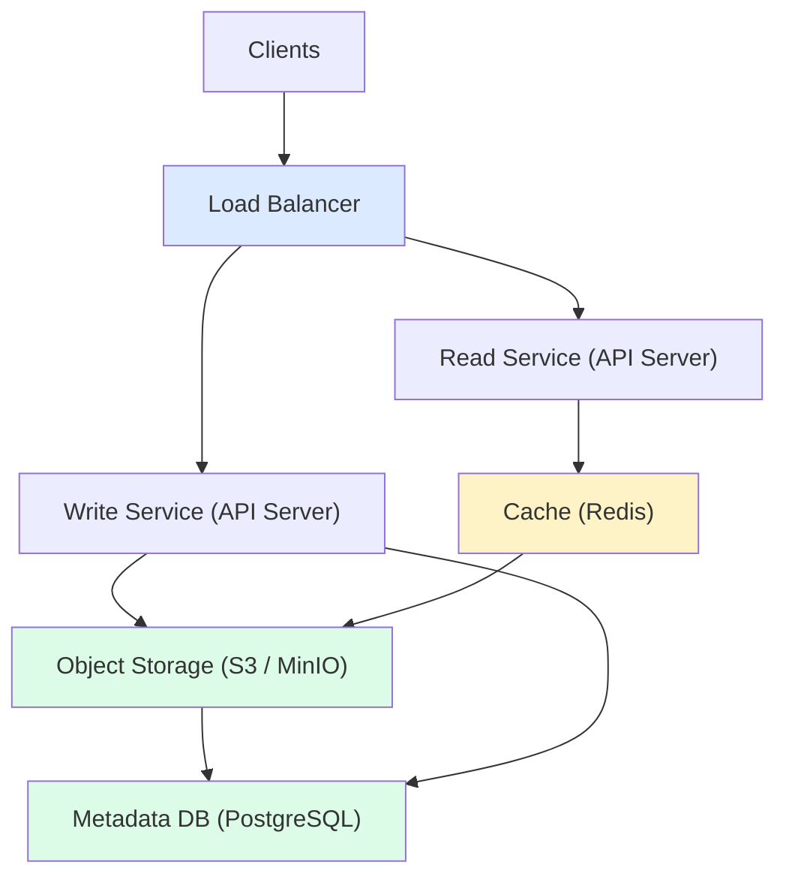
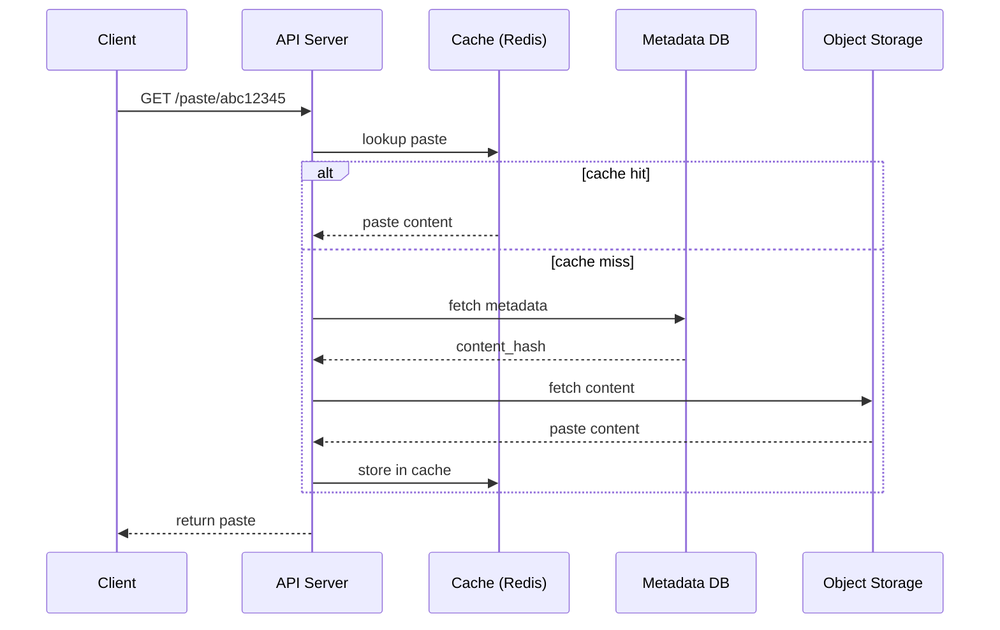
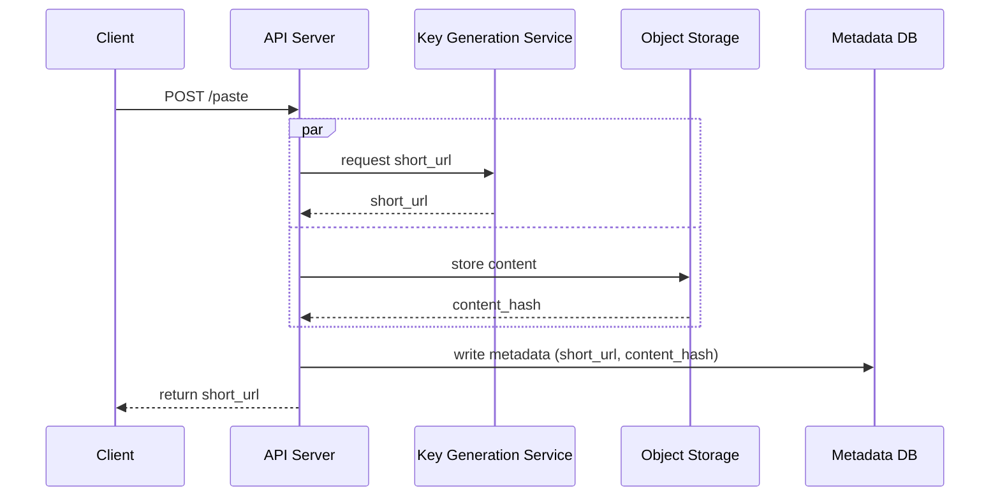
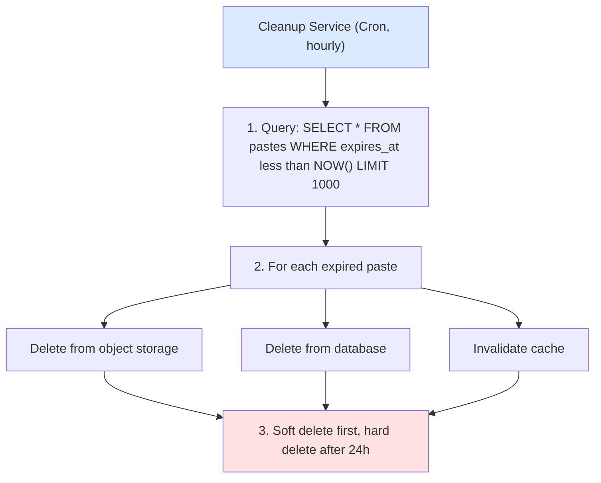
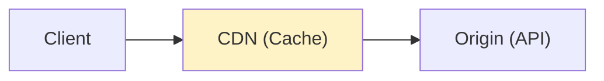

## Problem Statement

Design a system like Pastebin where users can share text snippets via unique URLs.

---

## Requirements

### Functional Requirements
- Create paste with text content
- Generate unique short URL
- Retrieve paste by URL
- Set expiration time (optional)
- Syntax highlighting (optional)

### Non-Functional Requirements
- High availability
- Low latency reads
- Handle high read:write ratio (100:1)
- Paste size limit: 10 MB

---

## Capacity Estimation

```
Assumptions:
- 1M new pastes/day
- 100M reads/day (100:1 ratio)
- Average paste size: 10 KB
- Retention: 5 years

Traffic:
- Writes: 1M/day ≈ 12 writes/sec
- Reads: 100M/day ≈ 1200 reads/sec

Storage:
- Daily: 1M × 10 KB = 10 GB/day
- 5 years: 10 GB × 365 × 5 = 18 TB

Bandwidth:
- Write: 12 × 10 KB = 120 KB/s
- Read: 1200 × 10 KB = 12 MB/s
```

---

## High-Level Design



---

## Database Schema

```sql
CREATE TABLE pastes (
    id BIGINT PRIMARY KEY,
    short_url VARCHAR(8) UNIQUE NOT NULL,
    content_hash VARCHAR(64) NOT NULL,  -- Reference to object storage
    content_type VARCHAR(50) DEFAULT 'text/plain',
    syntax VARCHAR(50),
    created_at TIMESTAMP DEFAULT NOW(),
    expires_at TIMESTAMP,
    user_id BIGINT,  -- Optional, for registered users
    views INT DEFAULT 0,
    is_private BOOLEAN DEFAULT FALSE,
    password_hash VARCHAR(255)  -- Optional password protection

    INDEX idx_short_url (short_url),
    INDEX idx_expires_at (expires_at),
    INDEX idx_user_id (user_id)
);

CREATE TABLE users (
    id BIGINT PRIMARY KEY,
    email VARCHAR(255) UNIQUE,
    api_key VARCHAR(64) UNIQUE,
    created_at TIMESTAMP DEFAULT NOW()
);
```

---

## URL Generation

```
Options for short URL:

1. Base62 Encoding of Counter
   Counter: 1000000 → "4c92"
   Characters: [a-z, A-Z, 0-9] = 62 chars
   8 chars = 62^8 = 218 trillion combinations

2. MD5/SHA Hash (truncated)
   hash(content + timestamp)[:8]
   Problem: Collisions possible

3. Pre-generated Keys
   Generate random keys in advance
   Store in separate table
   Mark as used when assigned

Recommended: Counter-based with encoding — Counter Service (atomic increment): ID 1000001 → Base62 → "4c93"
```

---

## API Design

### Create Paste

```
POST /api/v1/paste

Request:
{
  "content": "print('Hello World')",
  "syntax": "python",
  "expires_in": 3600,  // seconds
  "is_private": false
}

Response:
{
  "short_url": "abc12345",
  "url": "https://paste.io/abc12345",
  "expires_at": "2024-01-15T11:30:00Z"
}
```

### Get Paste

```
GET /api/v1/paste/{short_url}

Response:
{
  "content": "print('Hello World')",
  "syntax": "python",
  "created_at": "2024-01-15T10:30:00Z",
  "expires_at": "2024-01-15T11:30:00Z",
  "views": 42
}
```

---

## Read Flow

`GET /paste/abc12345`



---

## Write Flow

`POST /paste`



---

## Content Storage

```
For large pastes (>1KB), store in object storage:

┌─────────────────────────────────────────────────────┐
│              Object Storage (S3)                     │
├─────────────────────────────────────────────────────┤
│  Bucket: pastes                                     │
│  ├── 2024/                                          │
│  │   ├── 01/                                        │
│  │   │   ├── 15/                                    │
│  │   │   │   ├── abc12345.txt                       │
│  │   │   │   ├── def67890.txt                       │
│  │   │   │   └── ...                                │
└─────────────────────────────────────────────────────┘

Path format: {year}/{month}/{day}/{short_url}.txt

Benefits:
- Unlimited storage
- Built-in redundancy
- Cost-effective
- CDN integration
```

---

## Caching Strategy

```
Cache Layer (Redis):

Key: paste:{short_url}
Value: {
  content: "...",
  metadata: {...}
}
TTL: min(24 hours, expires_at - now)

Cache Policy:
- Cache popular pastes
- LRU eviction
- Write-through for new pastes
- Invalidate on deletion

Hot Content Detection:
- Track view counts
- Pre-warm cache for trending pastes
```

---

## Expiration Handling



---

## Scaling Considerations

### Database Sharding

```
Shard by short_url hash:
- shard_id = hash(short_url) % num_shards
- Each shard handles subset of data
- Consistent hashing for rebalancing
```

### CDN for Reads



CDN caches:
- Public pastes
- Static assets (syntax highlighting)
- Read-heavy traffic reduction

---

## Security Considerations

| **Concern** | **Solution** |
|------------|--------------|
| Spam | Rate limiting, CAPTCHA |
| Malware | Content scanning |
| Private pastes | Password protection, expiry |
| Abuse | Report mechanism, moderation |
| XSS | Content sanitization |

---

## Interview Tips

- Focus on URL shortening/generation
- Discuss storage trade-offs (DB vs Object Storage)
- Cover caching for read-heavy workload
- Mention expiration handling
- Consider CDN for global access
