## High-Level Architecture

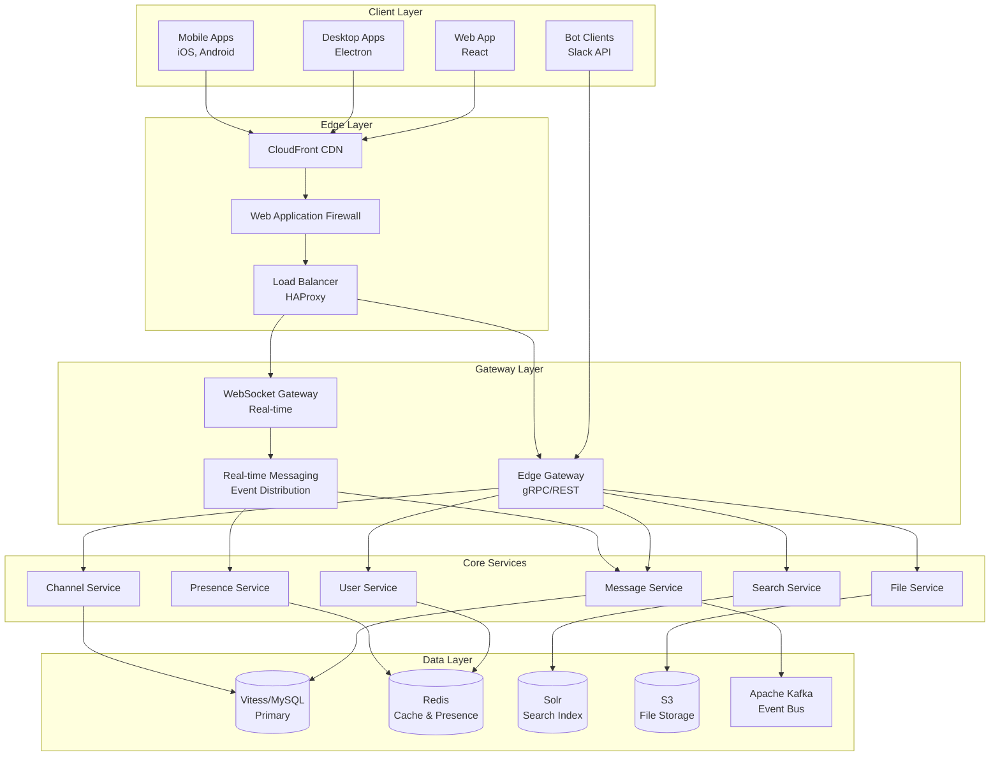
```mermaid
graph TB
    subgraph "Client Layer"
        WEB[Web App<br/>React]
        DESKTOP[Desktop Apps<br/>Electron]
        MOBILE[Mobile Apps<br/>iOS, Android]
        BOT[Bot Clients<br/>Slack API]
    end

    subgraph "Edge Layer"
        CDN[CloudFront CDN]
        WAF[Web Application Firewall]
        LB[Load Balancer<br/>HAProxy]
    end

    subgraph "Gateway Layer"
        EDGE[Edge Gateway<br/>gRPC/REST]
        WEBSOCKET[WebSocket Gateway<br/>Real-time]
        RTM[Real-time Messaging<br/>Event Distribution]
    end

    subgraph "Core Services"
        MSG[Message Service]
        CHANNEL[Channel Service]
        USER[User Service]
        SEARCH[Search Service]
        FILE[File Service]
        PRESENCE[Presence Service]
    end

    subgraph "Data Layer"
        VITESS[(Vitess/MySQL<br/>Primary)]
        REDIS[(Redis<br/>Cache & Presence)]
        SOLR[(Solr<br/>Search Index)]
        S3[(S3<br/>File Storage)]
        KAFKA[Apache Kafka<br/>Event Bus]
    end

    WEB --> CDN
    DESKTOP --> CDN
    MOBILE --> CDN
    BOT --> EDGE

    CDN --> WAF
    WAF --> LB

    LB --> EDGE
    LB --> WEBSOCKET
    WEBSOCKET --> RTM

    EDGE --> MSG
    EDGE --> CHANNEL
    EDGE --> USER
    RTM --> MSG
    RTM --> PRESENCE
    EDGE --> SEARCH
    EDGE --> FILE

    MSG --> VITESS
    MSG --> KAFKA
    CHANNEL --> VITESS
    USER --> REDIS
    SEARCH --> SOLR
    FILE --> S3
    PRESENCE --> REDIS
```

## Core Components

### 1. Real-time Message Delivery

Slack's core real-time messaging system delivers billions of messages daily.

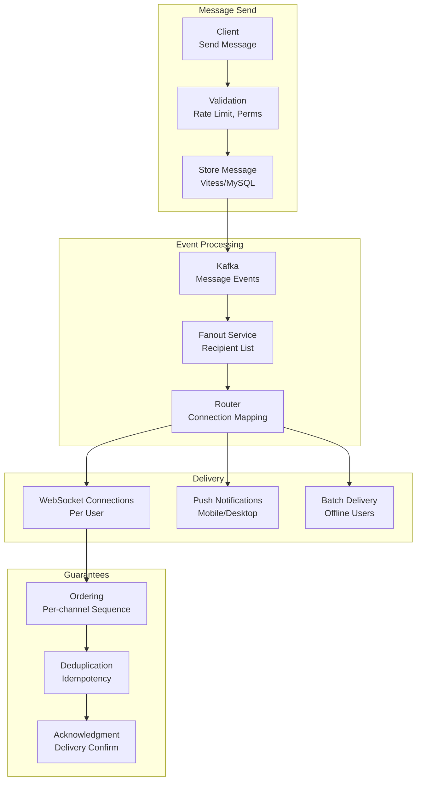
```mermaid
flowchart TD
    subgraph "Message Send"
        CLIENT[Client<br/>Send Message]
        VALIDATE[Validation<br/>Rate Limit, Perms]
        STORE[Store Message<br/>Vitess/MySQL]
    end

    subgraph "Event Processing"
        KAFKA[Kafka<br/>Message Events]
        FANOUT[Fanout Service<br/>Recipient List]
        ROUTE[Router<br/>Connection Mapping]
    end

    subgraph "Delivery"
        WS_CONN[WebSocket Connections<br/>Per User]
        PUSH[Push Notifications<br/>Mobile/Desktop]
        BATCH[Batch Delivery<br/>Offline Users]
    end

    subgraph "Guarantees"
        ORDER[Ordering<br/>Per-channel Sequence]
        DEDUPE[Deduplication<br/>Idempotency]
        ACK[Acknowledgment<br/>Delivery Confirm]
    end

    CLIENT --> VALIDATE
    VALIDATE --> STORE
    STORE --> KAFKA

    KAFKA --> FANOUT
    FANOUT --> ROUTE

    ROUTE --> WS_CONN
    ROUTE --> PUSH
    ROUTE --> BATCH

    WS_CONN --> ORDER
    ORDER --> DEDUPE
    DEDUPE --> ACK
```

**Real-time Features:**
- **Sub-100ms Delivery**: P99 message latency
- **WebSocket Connections**: Persistent bi-directional channels
- **Ordered Delivery**: Consistent message ordering per channel
- **Reconnection Handling**: Seamless recovery from disconnects

### 2. WebSocket Gateway

Manages millions of concurrent connections.

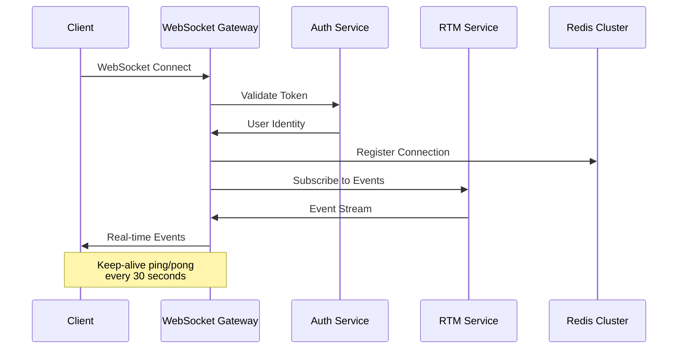
```mermaid
sequenceDiagram
    participant Client
    participant Gateway as WebSocket Gateway
    participant Auth as Auth Service
    participant RTM as RTM Service
    participant Redis as Redis Cluster

    Client->>Gateway: WebSocket Connect
    Gateway->>Auth: Validate Token
    Auth->>Gateway: User Identity
    Gateway->>Redis: Register Connection
    Gateway->>RTM: Subscribe to Events
    RTM->>Gateway: Event Stream
    Gateway->>Client: Real-time Events
    Note over Client,Gateway: Keep-alive ping/pong<br/>every 30 seconds
```

**Gateway Architecture:**
- **Connection Management**: 500K+ connections per server
- **Protocol**: WebSocket with custom binary protocol
- **Heartbeat**: Keep-alive for connection health
- **Graceful Degradation**: Fallback to long-polling

### 3. Channel Architecture

Supports channels with 10K+ members efficiently.

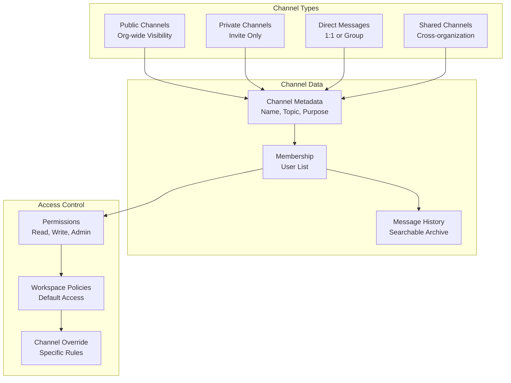
```mermaid
graph TD
    subgraph "Channel Types"
        PUBLIC[Public Channels<br/>Org-wide Visibility]
        PRIVATE[Private Channels<br/>Invite Only]
        DM[Direct Messages<br/>1:1 or Group]
        SHARED[Shared Channels<br/>Cross-organization]
    end

    subgraph "Channel Data"
        META[Channel Metadata<br/>Name, Topic, Purpose]
        MEMBERS[Membership<br/>User List]
        HISTORY[Message History<br/>Searchable Archive]
    end

    subgraph "Access Control"
        PERMS[Permissions<br/>Read, Write, Admin]
        INHERIT[Workspace Policies<br/>Default Access]
        OVERRIDE[Channel Override<br/>Specific Rules]
    end

    PUBLIC --> META
    PRIVATE --> META
    DM --> META
    SHARED --> META

    META --> MEMBERS
    MEMBERS --> HISTORY

    MEMBERS --> PERMS
    PERMS --> INHERIT
    INHERIT --> OVERRIDE
```

### 4. Presence System

Real-time user status across the platform.

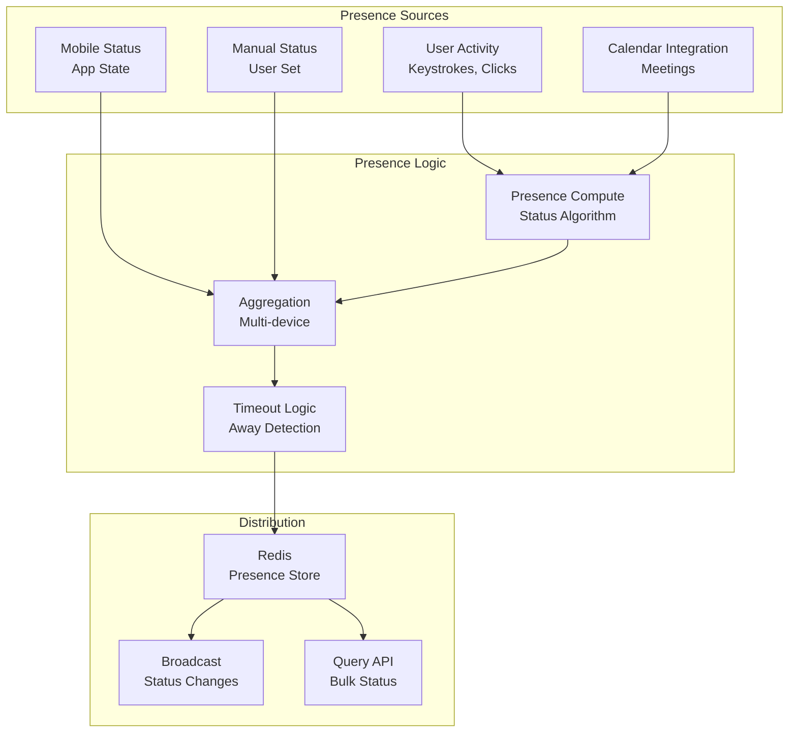
```mermaid
graph TD
    subgraph "Presence Sources"
        ACTIVITY[User Activity<br/>Keystrokes, Clicks]
        CALENDAR[Calendar Integration<br/>Meetings]
        MOBILE[Mobile Status<br/>App State]
        MANUAL[Manual Status<br/>User Set]
    end

    subgraph "Presence Logic"
        COMPUTE[Presence Compute<br/>Status Algorithm]
        AGGREGATE[Aggregation<br/>Multi-device]
        TIMEOUT[Timeout Logic<br/>Away Detection]
    end

    subgraph "Distribution"
        REDIS_PRESENCE[Redis<br/>Presence Store]
        BROADCAST[Broadcast<br/>Status Changes]
        QUERY[Query API<br/>Bulk Status]
    end

    ACTIVITY --> COMPUTE
    CALENDAR --> COMPUTE
    MOBILE --> AGGREGATE
    MANUAL --> AGGREGATE

    COMPUTE --> AGGREGATE
    AGGREGATE --> TIMEOUT
    TIMEOUT --> REDIS_PRESENCE

    REDIS_PRESENCE --> BROADCAST
    REDIS_PRESENCE --> QUERY
```

**Presence Features:**
- **Real-time Updates**: Instant status propagation
- **Multi-device**: Aggregate presence across devices
- **Custom Status**: Emoji and text status
- **DND Mode**: Notification suppression

## Data Storage Architecture

### Vitess (MySQL Sharding)

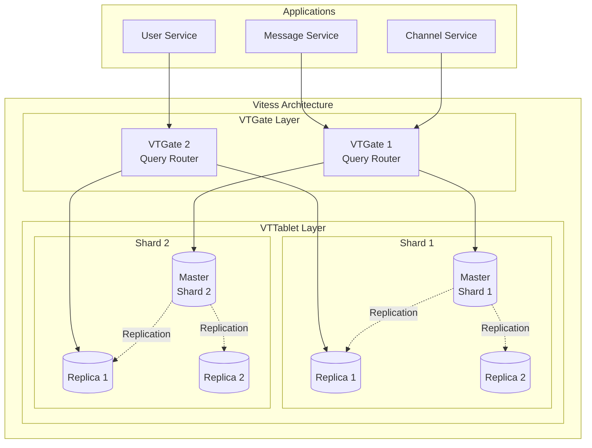
```mermaid
graph TD
    subgraph "Vitess Architecture"
        subgraph "VTGate Layer"
            VTG1[VTGate 1<br/>Query Router]
            VTG2[VTGate 2<br/>Query Router]
        end

        subgraph "VTTablet Layer"
            subgraph "Shard 1"
                S1_M[(Master<br/>Shard 1)]
                S1_R1[(Replica 1)]
                S1_R2[(Replica 2)]
            end

            subgraph "Shard 2"
                S2_M[(Master<br/>Shard 2)]
                S2_R1[(Replica 1)]
                S2_R2[(Replica 2)]
            end
        end
    end

    subgraph "Applications"
        MSG_SVC[Message Service]
        CHANNEL_SVC[Channel Service]
        USER_SVC[User Service]
    end

    MSG_SVC --> VTG1
    CHANNEL_SVC --> VTG1
    USER_SVC --> VTG2

    VTG1 --> S1_M
    VTG1 --> S2_M
    VTG2 --> S1_R1
    VTG2 --> S2_R1

    S1_M -.->|Replication| S1_R1
    S1_M -.->|Replication| S1_R2
    S2_M -.->|Replication| S2_R1
    S2_M -.->|Replication| S2_R2
```

**Vitess Benefits:**
- **Horizontal Scaling**: Shard by workspace/channel
- **Connection Pooling**: Efficient MySQL connections
- **Query Routing**: Automatic shard selection
- **Online Resharding**: Zero-downtime splits

### Redis (Cache & Presence)

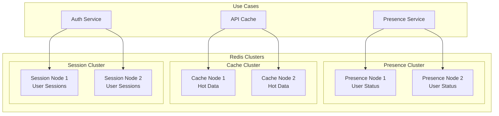
```mermaid
graph TD
    subgraph "Redis Clusters"
        subgraph "Presence Cluster"
            P1[Presence Node 1<br/>User Status]
            P2[Presence Node 2<br/>User Status]
        end

        subgraph "Cache Cluster"
            C1[Cache Node 1<br/>Hot Data]
            C2[Cache Node 2<br/>Hot Data]
        end

        subgraph "Session Cluster"
            S1[Session Node 1<br/>User Sessions]
            S2[Session Node 2<br/>User Sessions]
        end
    end

    subgraph "Use Cases"
        PRESENCE_SVC[Presence Service]
        API[API Cache]
        AUTH[Auth Service]
    end

    PRESENCE_SVC --> P1
    PRESENCE_SVC --> P2
    API --> C1
    API --> C2
    AUTH --> S1
    AUTH --> S2
```

### Solr (Search Infrastructure)

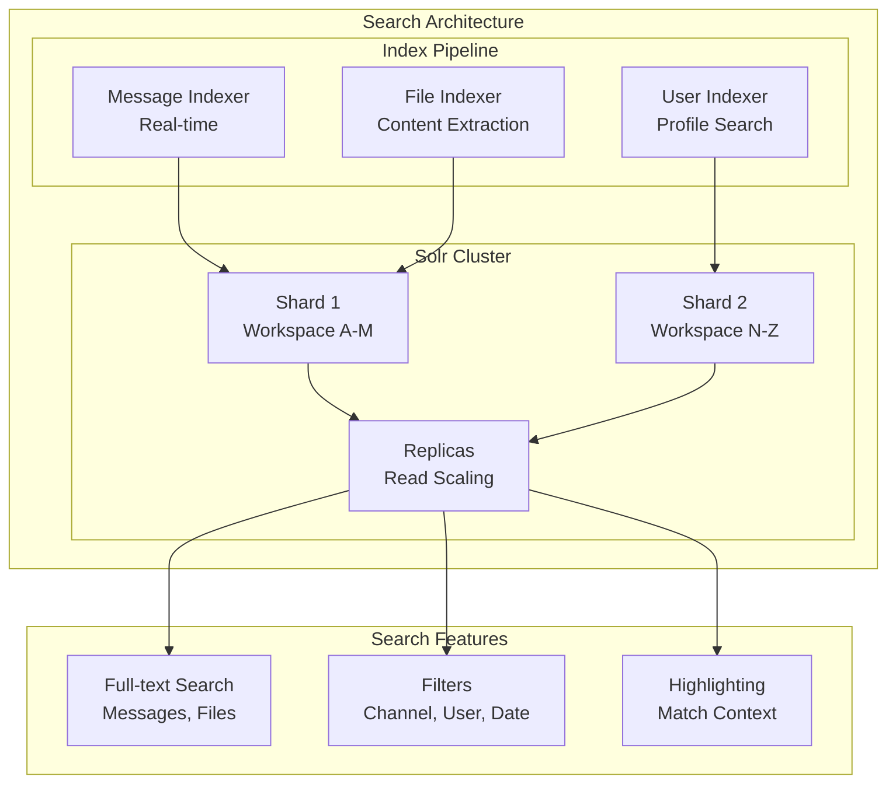
```mermaid
graph TD
    subgraph "Search Architecture"
        subgraph "Index Pipeline"
            MSG_INDEX[Message Indexer<br/>Real-time]
            FILE_INDEX[File Indexer<br/>Content Extraction]
            USER_INDEX[User Indexer<br/>Profile Search]
        end

        subgraph "Solr Cluster"
            SHARD1[Shard 1<br/>Workspace A-M]
            SHARD2[Shard 2<br/>Workspace N-Z]
            REPLICA[Replicas<br/>Read Scaling]
        end
    end

    subgraph "Search Features"
        FULL_TEXT[Full-text Search<br/>Messages, Files]
        FILTER[Filters<br/>Channel, User, Date]
        HIGHLIGHT[Highlighting<br/>Match Context]
    end

    MSG_INDEX --> SHARD1
    FILE_INDEX --> SHARD1
    USER_INDEX --> SHARD2

    SHARD1 --> REPLICA
    SHARD2 --> REPLICA

    REPLICA --> FULL_TEXT
    REPLICA --> FILTER
    REPLICA --> HIGHLIGHT
```

## Stream Processing Architecture

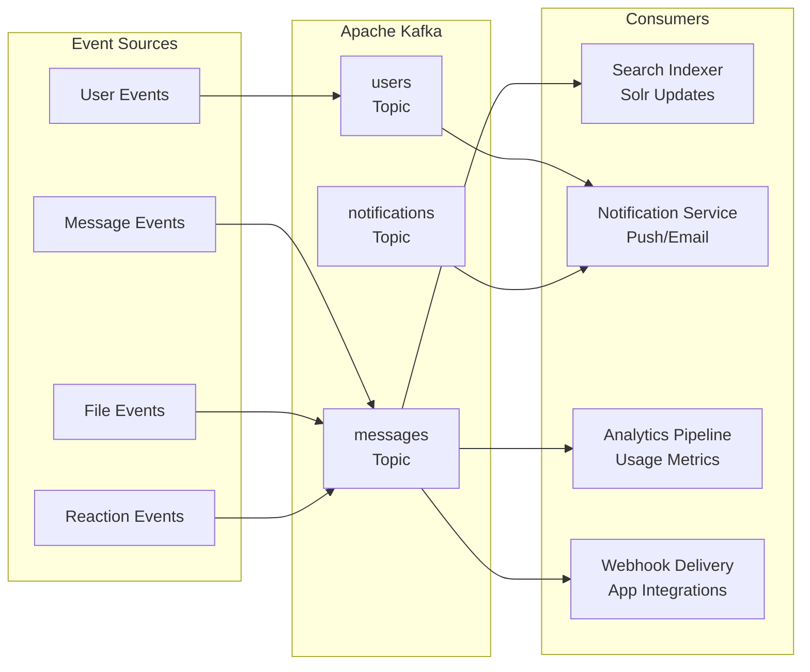
```mermaid
graph LR
    subgraph "Event Sources"
        MSG_EVT[Message Events]
        USER_EVT[User Events]
        FILE_EVT[File Events]
        REACT_EVT[Reaction Events]
    end

    subgraph "Apache Kafka"
        TOPIC_MSG[messages<br/>Topic]
        TOPIC_USER[users<br/>Topic]
        TOPIC_NOTIFY[notifications<br/>Topic]
    end

    subgraph "Consumers"
        SEARCH_CONSUMER[Search Indexer<br/>Solr Updates]
        NOTIFY_CONSUMER[Notification Service<br/>Push/Email]
        ANALYTICS[Analytics Pipeline<br/>Usage Metrics]
        WEBHOOK[Webhook Delivery<br/>App Integrations]
    end

    MSG_EVT --> TOPIC_MSG
    USER_EVT --> TOPIC_USER
    FILE_EVT --> TOPIC_MSG
    REACT_EVT --> TOPIC_MSG

    TOPIC_MSG --> SEARCH_CONSUMER
    TOPIC_USER --> NOTIFY_CONSUMER
    TOPIC_NOTIFY --> NOTIFY_CONSUMER
    TOPIC_MSG --> ANALYTICS
    TOPIC_MSG --> WEBHOOK
```

### Event Processing
- **Kafka**: Millions of events per second
- **Real-time Indexing**: Sub-second search updates
- **Webhook Delivery**: Reliable app notifications
- **Analytics**: Real-time usage tracking

## Scalability Patterns

### 1. Connection Scaling

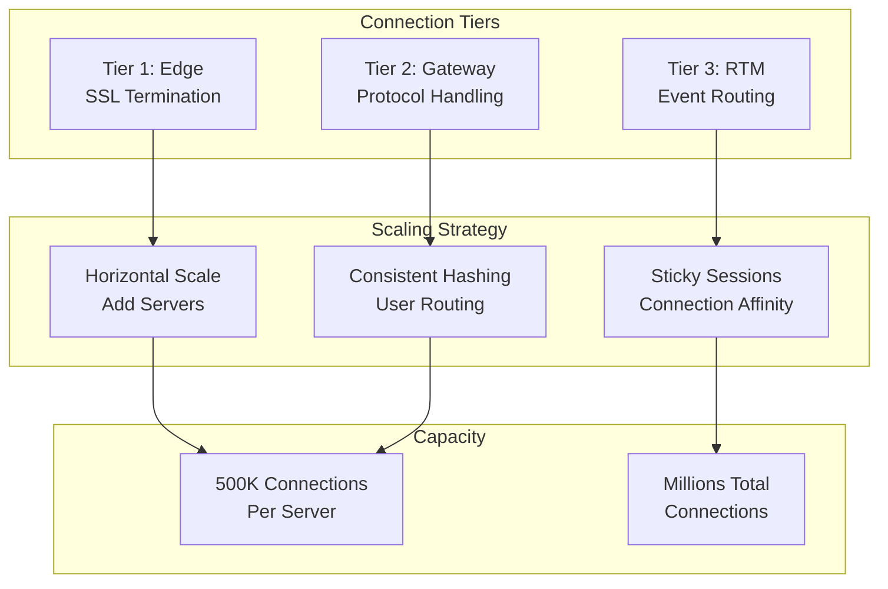
```mermaid
flowchart TD
    subgraph "Connection Tiers"
        TIER1[Tier 1: Edge<br/>SSL Termination]
        TIER2[Tier 2: Gateway<br/>Protocol Handling]
        TIER3[Tier 3: RTM<br/>Event Routing]
    end

    subgraph "Scaling Strategy"
        HORIZONTAL[Horizontal Scale<br/>Add Servers]
        CONSISTENT[Consistent Hashing<br/>User Routing]
        STICKY[Sticky Sessions<br/>Connection Affinity]
    end

    subgraph "Capacity"
        PER_SERVER[500K Connections<br/>Per Server]
        TOTAL[Millions Total<br/>Connections]
    end

    TIER1 --> HORIZONTAL
    TIER2 --> CONSISTENT
    TIER3 --> STICKY

    HORIZONTAL --> PER_SERVER
    CONSISTENT --> PER_SERVER
    STICKY --> TOTAL
```

### 2. Message Fanout

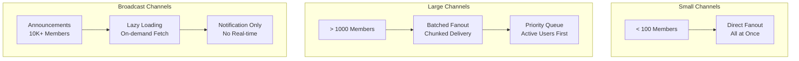
```mermaid
flowchart TD
    subgraph "Small Channels"
        SMALL[< 100 Members]
        DIRECT_FAN[Direct Fanout<br/>All at Once]
    end

    subgraph "Large Channels"
        LARGE[> 1000 Members]
        BATCHED[Batched Fanout<br/>Chunked Delivery]
        PRIORITY[Priority Queue<br/>Active Users First]
    end

    subgraph "Broadcast Channels"
        ANNOUNCE[Announcements<br/>10K+ Members]
        LAZY[Lazy Loading<br/>On-demand Fetch]
        NOTIFY[Notification Only<br/>No Real-time]
    end

    SMALL --> DIRECT_FAN
    LARGE --> BATCHED
    BATCHED --> PRIORITY
    ANNOUNCE --> LAZY
    LAZY --> NOTIFY
```

### 3. Database Sharding

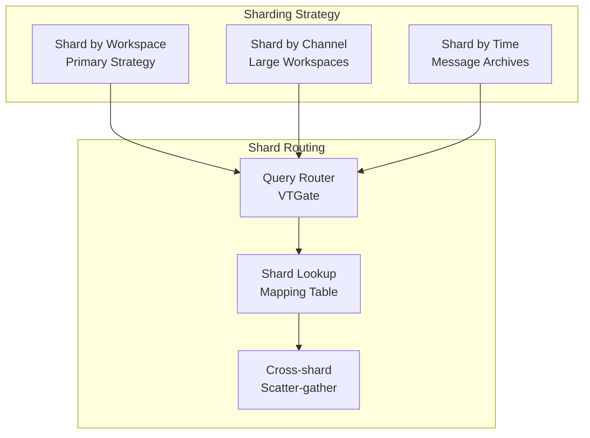
```mermaid
graph TD
    subgraph "Sharding Strategy"
        WORKSPACE[Shard by Workspace<br/>Primary Strategy]
        CHANNEL[Shard by Channel<br/>Large Workspaces]
        TIME[Shard by Time<br/>Message Archives]
    end

    subgraph "Shard Routing"
        ROUTER[Query Router<br/>VTGate]
        LOOKUP[Shard Lookup<br/>Mapping Table]
        CROSS[Cross-shard<br/>Scatter-gather]
    end

    WORKSPACE --> ROUTER
    CHANNEL --> ROUTER
    TIME --> ROUTER

    ROUTER --> LOOKUP
    LOOKUP --> CROSS
```

## Security Architecture

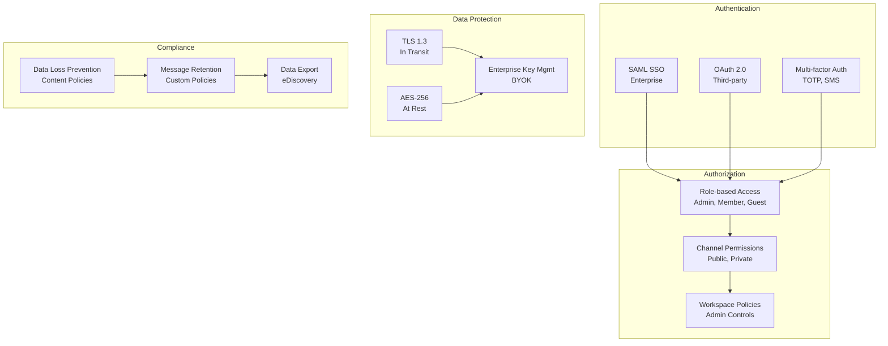
```mermaid
graph TB
    subgraph "Authentication"
        SAML[SAML SSO<br/>Enterprise]
        OAUTH[OAuth 2.0<br/>Third-party]
        MFA[Multi-factor Auth<br/>TOTP, SMS]
    end

    subgraph "Authorization"
        RBAC[Role-based Access<br/>Admin, Member, Guest]
        CHANNEL_PERMS[Channel Permissions<br/>Public, Private]
        WORKSPACE[Workspace Policies<br/>Admin Controls]
    end

    subgraph "Data Protection"
        ENCRYPT_TRANSIT[TLS 1.3<br/>In Transit]
        ENCRYPT_REST[AES-256<br/>At Rest]
        EKM[Enterprise Key Mgmt<br/>BYOK]
    end

    subgraph "Compliance"
        DLP[Data Loss Prevention<br/>Content Policies]
        RETENTION[Message Retention<br/>Custom Policies]
        EXPORT[Data Export<br/>eDiscovery]
    end

    SAML --> RBAC
    OAUTH --> RBAC
    MFA --> RBAC

    RBAC --> CHANNEL_PERMS
    CHANNEL_PERMS --> WORKSPACE

    ENCRYPT_TRANSIT --> EKM
    ENCRYPT_REST --> EKM

    DLP --> RETENTION
    RETENTION --> EXPORT
```

### Enterprise Security
- **Enterprise Key Management**: Customer-controlled keys
- **Data Residency**: Region-specific data storage
- **Audit Logs**: Comprehensive activity tracking
- **DLP Integration**: Third-party DLP support

### Compliance
- **SOC 2 Type II**: Security controls audit
- **GDPR**: European data protection
- **HIPAA**: Healthcare compliance (Enterprise Grid)
- **FedRAMP**: Government authorization

## Monitoring and Observability

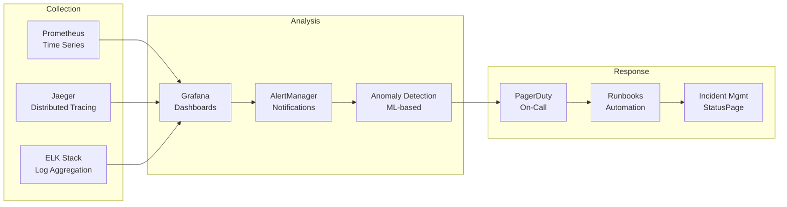
```mermaid
graph LR
    subgraph "Collection"
        METRICS[Prometheus<br/>Time Series]
        TRACES[Jaeger<br/>Distributed Tracing]
        LOGS[ELK Stack<br/>Log Aggregation]
    end

    subgraph "Analysis"
        GRAFANA[Grafana<br/>Dashboards]
        ALERT[AlertManager<br/>Notifications]
        ANOMALY[Anomaly Detection<br/>ML-based]
    end

    subgraph "Response"
        ONCALL[PagerDuty<br/>On-Call]
        RUNBOOK[Runbooks<br/>Automation]
        INCIDENT[Incident Mgmt<br/>StatusPage]
    end

    METRICS --> GRAFANA
    TRACES --> GRAFANA
    LOGS --> GRAFANA

    GRAFANA --> ALERT
    ALERT --> ANOMALY

    ANOMALY --> ONCALL
    ONCALL --> RUNBOOK
    RUNBOOK --> INCIDENT
```

### Key Metrics
- **Message Delivery Latency**: P50, P95, P99
- **WebSocket Connection Health**: Success rate, reconnections
- **API Latency**: Endpoint-level response times
- **Search Latency**: Query response times

## Deployment and DevOps

### Continuous Integration/Continuous Deployment

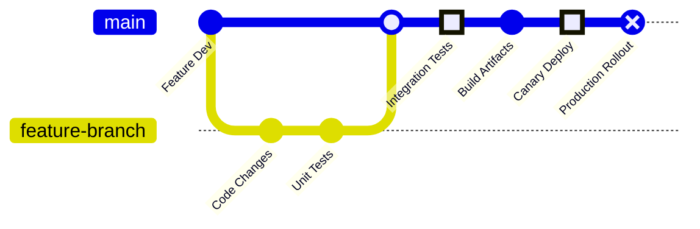
```mermaid
gitGraph
    commit id: "Feature Dev"
    branch feature-branch
    checkout feature-branch
    commit id: "Code Changes"
    commit id: "Unit Tests"
    checkout main
    merge feature-branch
    commit id: "Integration Tests" type: HIGHLIGHT
    commit id: "Build Artifacts"
    commit id: "Canary Deploy" type: HIGHLIGHT
    commit id: "Production Rollout" type: REVERSE
```

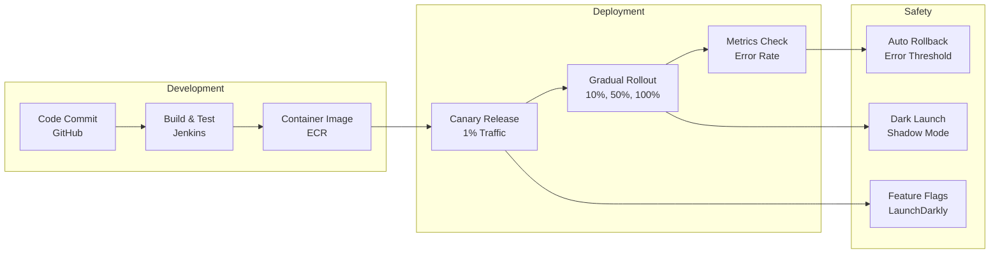
```mermaid
flowchart LR
    subgraph "Development"
        CODE[Code Commit<br/>GitHub]
        BUILD[Build & Test<br/>Jenkins]
        ARTIFACT[Container Image<br/>ECR]
    end

    subgraph "Deployment"
        CANARY[Canary Release<br/>1% Traffic]
        GRADUAL[Gradual Rollout<br/>10%, 50%, 100%]
        MONITOR[Metrics Check<br/>Error Rate]
    end

    subgraph "Safety"
        ROLLBACK[Auto Rollback<br/>Error Threshold]
        FEATURE_FLAG[Feature Flags<br/>LaunchDarkly]
        DARK[Dark Launch<br/>Shadow Mode]
    end

    CODE --> BUILD
    BUILD --> ARTIFACT
    ARTIFACT --> CANARY
    CANARY --> GRADUAL
    GRADUAL --> MONITOR

    MONITOR --> ROLLBACK
    CANARY --> FEATURE_FLAG
    GRADUAL --> DARK
```

### Infrastructure
- **Kubernetes**: Container orchestration
- **AWS**: Primary cloud provider
- **Terraform**: Infrastructure as code
- **Consul**: Service discovery

### Chaos Engineering

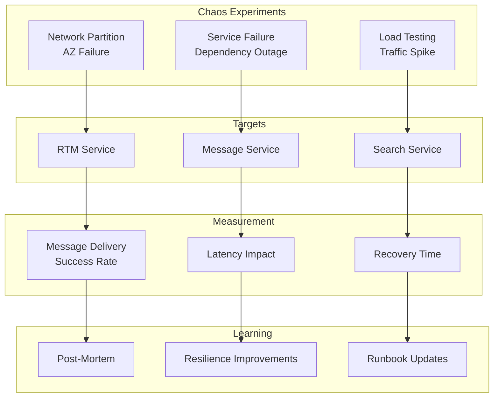
```mermaid
flowchart TD
    subgraph "Chaos Experiments"
        NETWORK[Network Partition<br/>AZ Failure]
        SERVICE[Service Failure<br/>Dependency Outage]
        LOAD[Load Testing<br/>Traffic Spike]
    end

    subgraph "Targets"
        RTM_SVC[RTM Service]
        MSG_SVC[Message Service]
        SEARCH_SVC[Search Service]
    end

    subgraph "Measurement"
        DELIVERY[Message Delivery<br/>Success Rate]
        LATENCY[Latency Impact]
        RECOVERY[Recovery Time]
    end

    subgraph "Learning"
        POSTMORTEM[Post-Mortem]
        IMPROVE[Resilience Improvements]
        DOCUMENT[Runbook Updates]
    end

    NETWORK --> RTM_SVC
    SERVICE --> MSG_SVC
    LOAD --> SEARCH_SVC

    RTM_SVC --> DELIVERY
    MSG_SVC --> LATENCY
    SEARCH_SVC --> RECOVERY

    DELIVERY --> POSTMORTEM
    LATENCY --> IMPROVE
    RECOVERY --> DOCUMENT
```

**Practices:**
- **GameDay Exercises**: Quarterly failure simulations
- **Chaos Monkey**: Random service termination
- **Load Testing**: 10x normal traffic simulation
- **AZ Failover**: Regular availability zone drills

## Analytics and Machine Learning

### Data Pipeline

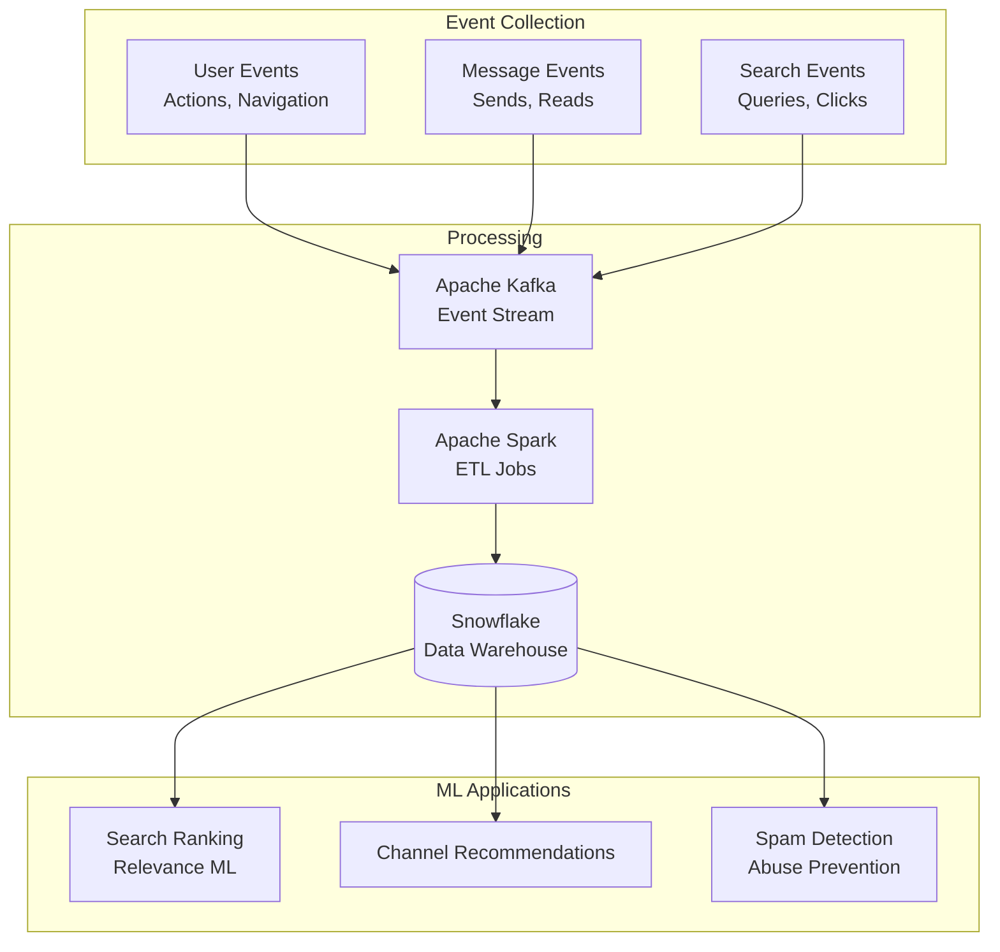
```mermaid
flowchart TD
    subgraph "Event Collection"
        USER_EVENTS[User Events<br/>Actions, Navigation]
        MSG_EVENTS[Message Events<br/>Sends, Reads]
        SEARCH_EVENTS[Search Events<br/>Queries, Clicks]
    end

    subgraph "Processing"
        KAFKA[Apache Kafka<br/>Event Stream]
        SPARK[Apache Spark<br/>ETL Jobs]
        WAREHOUSE[(Snowflake<br/>Data Warehouse)]
    end

    subgraph "ML Applications"
        SEARCH_RANK[Search Ranking<br/>Relevance ML]
        CHANNEL_REC[Channel Recommendations]
        SPAM[Spam Detection<br/>Abuse Prevention]
    end

    USER_EVENTS --> KAFKA
    MSG_EVENTS --> KAFKA
    SEARCH_EVENTS --> KAFKA

    KAFKA --> SPARK
    SPARK --> WAREHOUSE

    WAREHOUSE --> SEARCH_RANK
    WAREHOUSE --> CHANNEL_REC
    WAREHOUSE --> SPAM
```

### ML Use Cases
- **Search Ranking**: Personalized result ordering
- **Channel Suggestions**: Recommend relevant channels
- **Spam Detection**: Automated abuse prevention
- **Smart Notifications**: Intelligent alert timing
- **Emoji Predictions**: Suggested reactions

## Cost Optimization

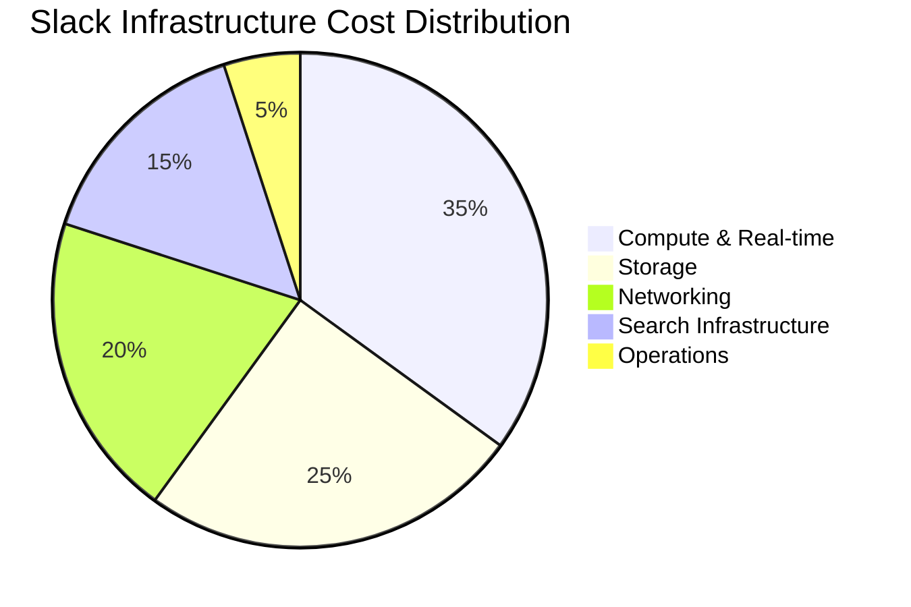
```mermaid
pie title Slack Infrastructure Cost Distribution
    "Compute & Real-time" : 35
    "Storage" : 25
    "Networking" : 20
    "Search Infrastructure" : 15
    "Operations" : 5
```

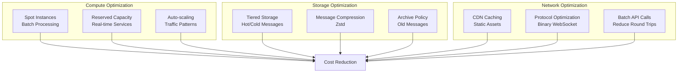
```mermaid
graph TD
    subgraph "Compute Optimization"
        SPOT[Spot Instances<br/>Batch Processing]
        RESERVED[Reserved Capacity<br/>Real-time Services]
        AUTOSCALE[Auto-scaling<br/>Traffic Patterns]
    end

    subgraph "Storage Optimization"
        TIERED[Tiered Storage<br/>Hot/Cold Messages]
        COMPRESS[Message Compression<br/>Zstd]
        ARCHIVE[Archive Policy<br/>Old Messages]
    end

    subgraph "Network Optimization"
        CDN[CDN Caching<br/>Static Assets]
        PROTOCOL[Protocol Optimization<br/>Binary WebSocket]
        BATCH[Batch API Calls<br/>Reduce Round Trips]
    end

    SPOT --> COST[Cost Reduction]
    RESERVED --> COST
    AUTOSCALE --> COST
    TIERED --> COST
    COMPRESS --> COST
    ARCHIVE --> COST
    CDN --> COST
    PROTOCOL --> COST
    BATCH --> COST
```

### Key Strategies
- **Message Compression**: 40% storage reduction
- **Connection Multiplexing**: Efficient WebSocket usage
- **Tiered Storage**: Archive old messages to cold storage
- **Reserved Instances**: Predictable baseline costs

## Future Architecture Considerations

### Emerging Technologies
- **WebRTC Integration**: Native audio/video calls
- **AI Assistance**: Smart message suggestions
- **Workflow Automation**: No-code automation tools
- **Edge Computing**: Lower latency for global users

### Platform Evolution
- **Salesforce Integration**: Deeper CRM integration
- **Canvas**: Rich document collaboration
- **Clips**: Async video messaging
- **Huddles**: Lightweight audio calls

### Infrastructure Roadmap
- **Multi-Cloud**: Resilience through cloud diversity
- **Global Expansion**: New regions for data residency
- **Zero-Trust Security**: Enhanced security model
- **Sustainable Computing**: Carbon-neutral operations

## Conclusion

Slack's architecture demonstrates how to build a real-time collaboration platform at scale. The combination of WebSocket-based real-time messaging, Vitess-powered database sharding, and efficient presence tracking enables Slack to deliver reliable communication for millions of teams.

The platform continues to evolve with deeper enterprise integrations, enhanced AI capabilities, and improved collaboration features, all while maintaining the real-time responsiveness that users depend on for productive teamwork.

> There might be iterations needed, current data is as close I could get.
