## High-Level Architecture

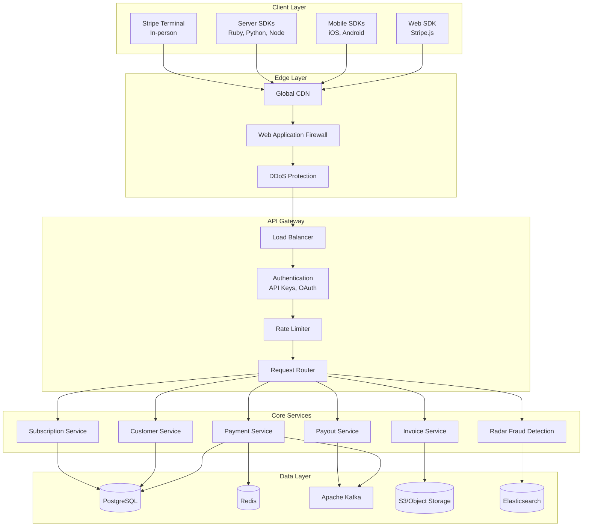

## Core Components

### 1. Payment Processing Pipeline

Stripe's core payment flow processes millions of transactions per minute.

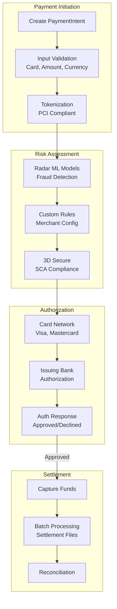

**Components:**
- **PaymentIntent**: Tracks payment lifecycle from creation to confirmation
- **Tokenization**: PCI-DSS compliant card data handling
- **Radar**: ML-powered fraud detection (prevents $25B+ in fraud annually)
- **Network Routing**: Intelligent routing for optimal authorization rates

**Key Features:**
- Idempotency for safe retries
- Automatic card network selection
- Dynamic 3D Secure authentication
- Real-time fraud scoring

### 2. Subscription & Billing Engine

Handles complex recurring billing scenarios.

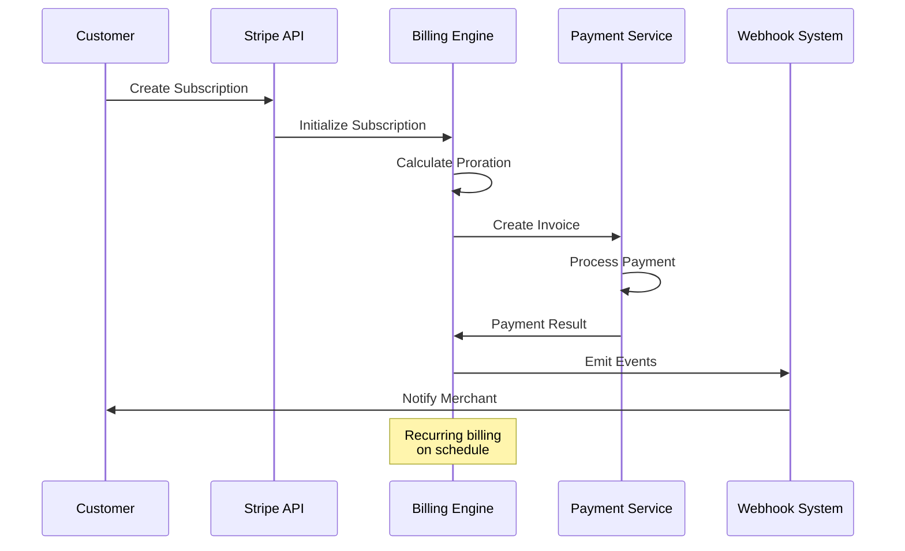

**Billing Features:**
- **Proration**: Automatic pro-rated charges for plan changes
- **Usage-based Billing**: Metered billing support
- **Trials**: Free trial period management
- **Dunning**: Smart retry logic for failed payments

### 3. Fraud Detection (Radar)

ML-powered fraud prevention system.

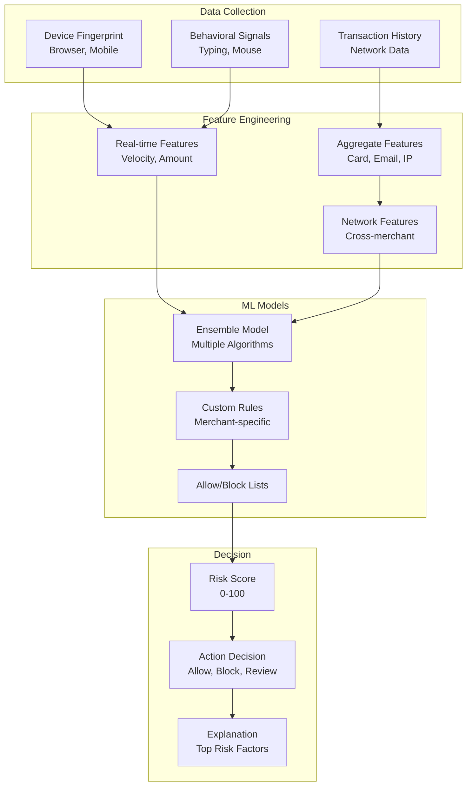

**Radar Capabilities:**
- **Network Effect**: Learns from billions of transactions
- **Adaptive ML**: Continuously updates with new fraud patterns
- **Custom Rules**: Merchant-configurable rule engine
- **3D Secure Integration**: Smart authentication triggers

### 4. Payout System

Distributes funds to millions of connected accounts.

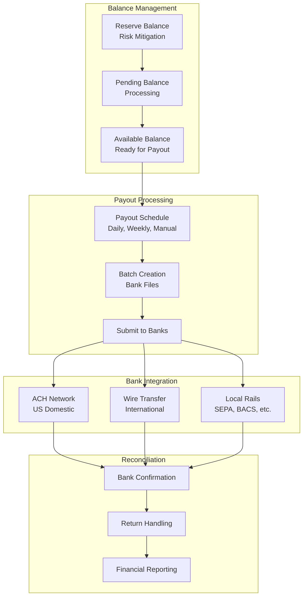

## Data Storage Architecture

### PostgreSQL (Primary Database)

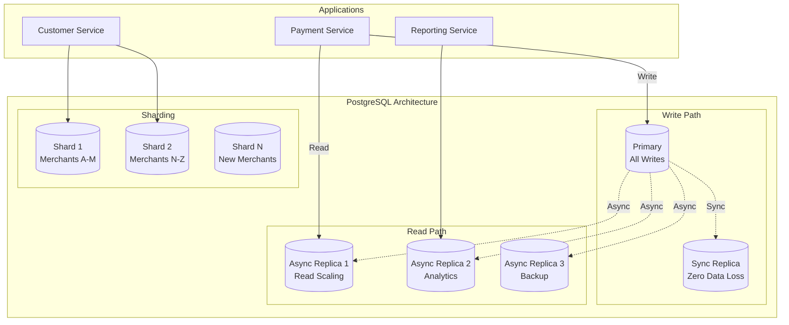

**Database Practices:**
- **Synchronous Replication**: Zero data loss for transactions
- **Sharding by Merchant**: Horizontal scalability
- **Connection Pooling**: PgBouncer for efficient connections
- **Encryption**: AES-256 at rest, TLS in transit

### Redis (Caching & Queues)

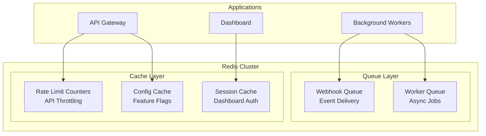

### Apache Kafka (Event Streaming)

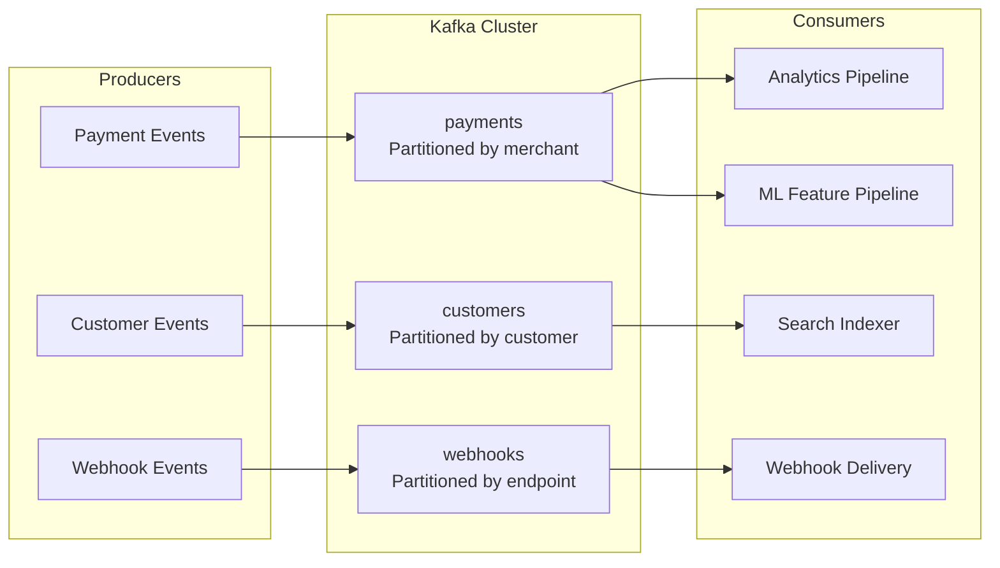

## Stream Processing Architecture

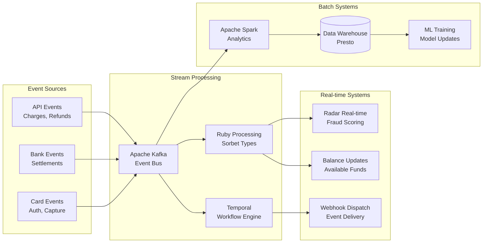

### Temporal (Workflow Orchestration)
- **Durable Execution**: Workflows survive process failures
- **Payout Workflows**: Multi-step payout processing
- **Subscription Lifecycle**: Complex billing state machines
- **Retry Policies**: Configurable retry strategies

## Scalability Patterns

### 1. API Rate Limiting

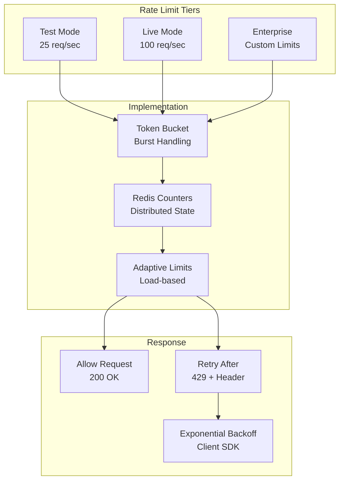

### 2. Idempotency

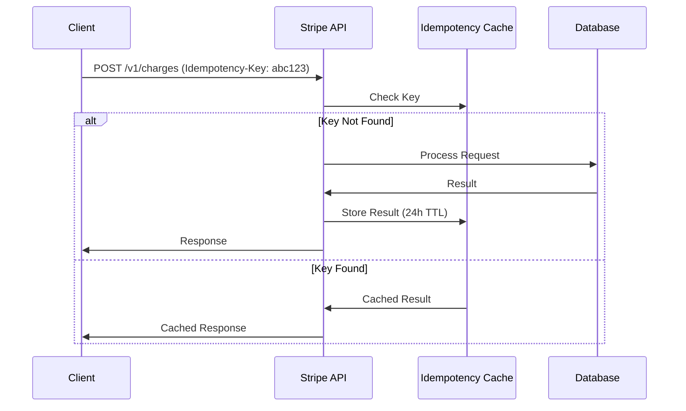

**Idempotency Features:**
- **24-hour key validity**: Safe retries within window
- **Atomic operations**: Prevents duplicate charges
- **Response caching**: Consistent responses for same key

### 3. Geographic Distribution

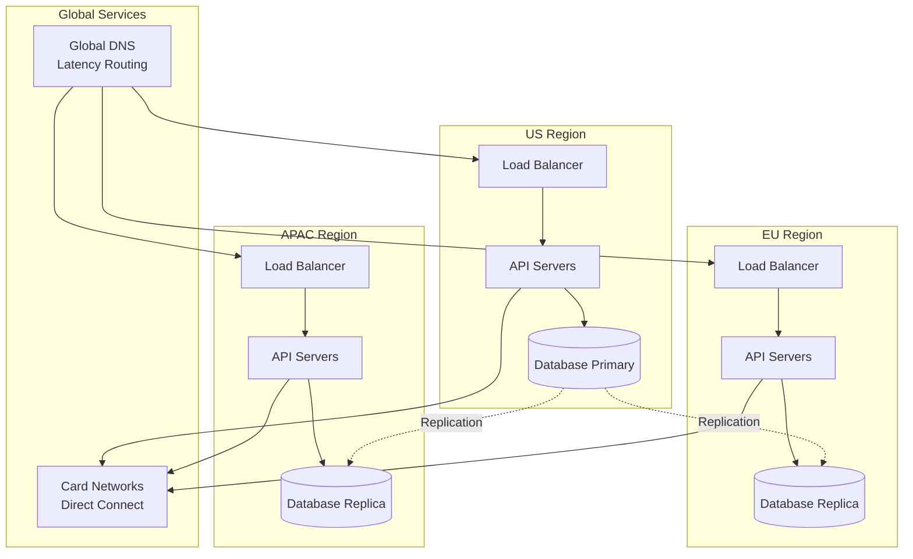

## Security Architecture

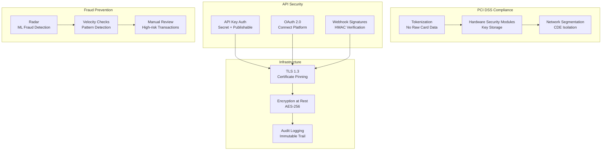

### PCI DSS Level 1
- **Tokenization**: Card data never touches merchant servers
- **HSM-backed encryption**: Hardware security for keys
- **Annual audits**: Third-party security assessments
- **Penetration testing**: Regular security testing

### API Security
- **Secret keys**: Server-side only, never exposed
- **Publishable keys**: Client-side, limited scope
- **Restricted keys**: Granular permission control
- **Webhook verification**: HMAC signature validation

## Monitoring and Observability

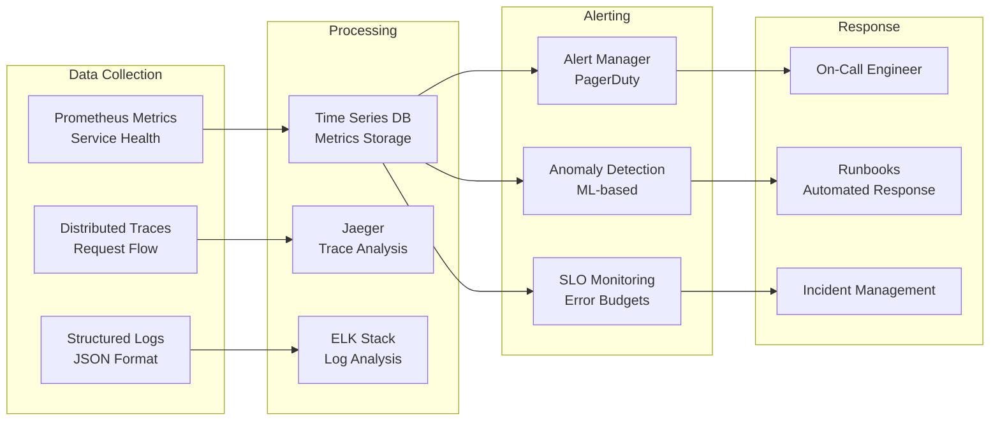

### Key Metrics
- **API Latency**: p50, p95, p99 response times
- **Error Rates**: 4xx, 5xx by endpoint
- **Payment Success Rate**: Authorization rate by network
- **Webhook Delivery**: Success rate and latency

## Deployment and DevOps

### Continuous Integration/Continuous Deployment

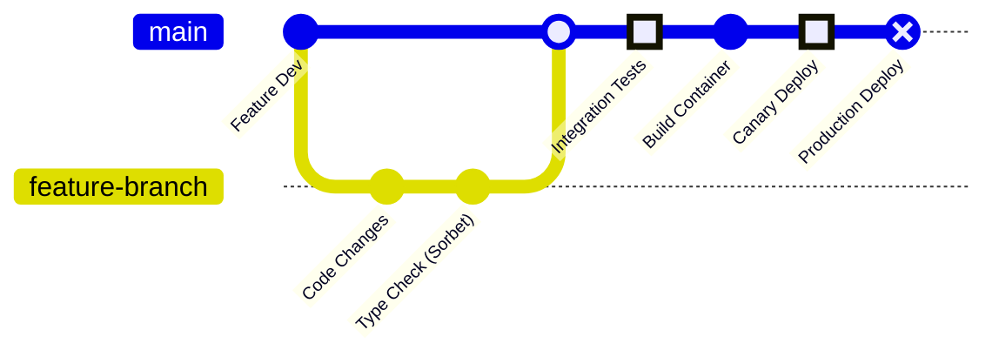

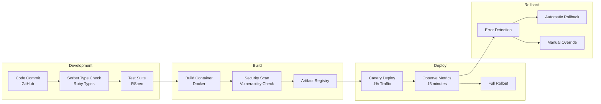

### Infrastructure
- **Kubernetes**: Container orchestration
- **Sorbet**: Gradual typing for Ruby
- **Temporal**: Workflow orchestration
- **Terraform**: Infrastructure as code

### Chaos Engineering

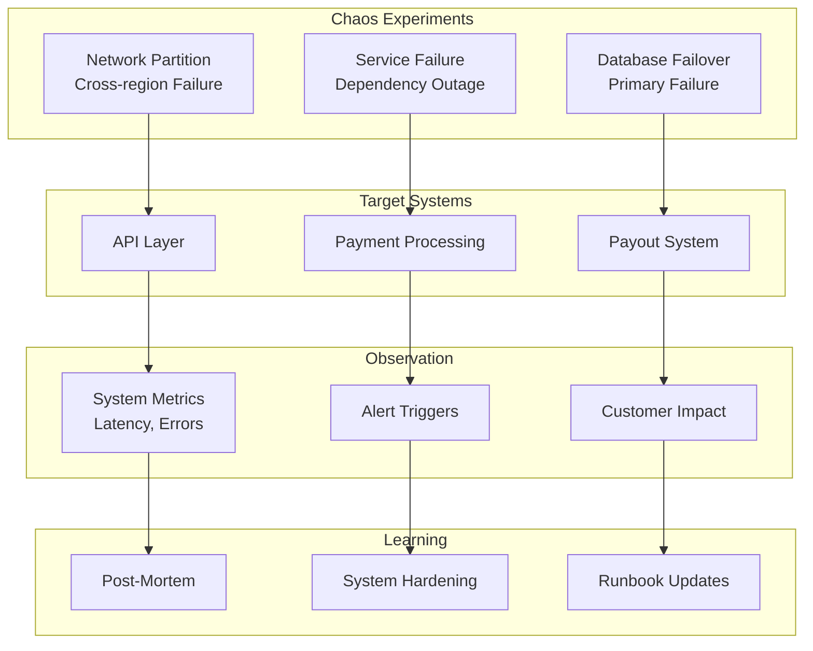

**Chaos Practices:**
- **GameDay Exercises**: Quarterly disaster recovery drills
- **Dependency Failures**: Simulated network/bank outages
- **Database Failovers**: Automated primary promotion
- **Load Testing**: 10x traffic simulation

## Analytics and Machine Learning

### Data Pipeline

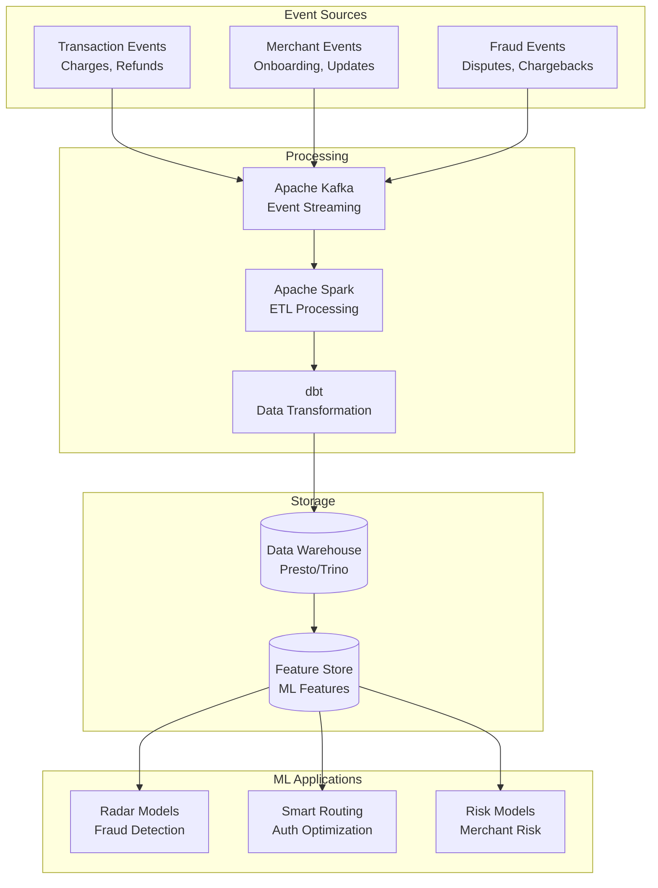

### ML Use Cases
- **Fraud Detection (Radar)**: Real-time transaction scoring
- **Authorization Optimization**: Network routing for success rate
- **Risk Assessment**: Merchant and account risk scoring
- **Revenue Recovery**: Smart retry timing for failed payments
- **Anomaly Detection**: System health and abuse detection

## Cost Optimization

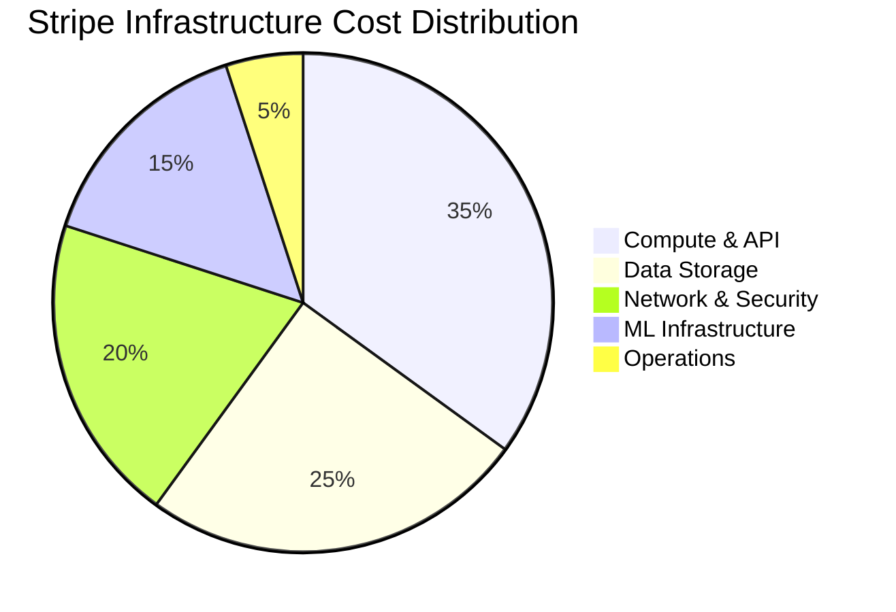

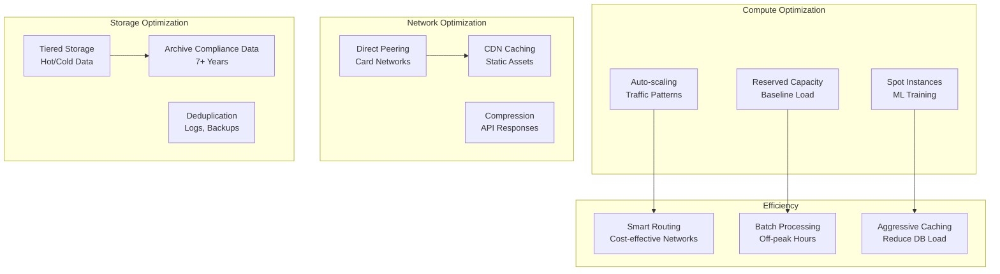

### Key Strategies
- **Interchange Optimization**: Intelligent card network routing
- **Reserved Capacity**: Predictable baseline costs
- **Data Lifecycle**: Automated archival for compliance data
- **ML Efficiency**: Model optimization for inference cost

## Future Architecture Considerations

### Emerging Technologies
- **Real-time Payments**: FedNow, RTP network integration
- **Cryptocurrency**: Stablecoin and crypto payment support
- **Embedded Finance**: Banking-as-a-Service expansion
- **AI/ML**: Enhanced fraud detection and routing

### Platform Evolution
- **Global Expansion**: New payment methods and currencies
- **Vertical Solutions**: Industry-specific payment products
- **Developer Experience**: Enhanced APIs and tools
- **Compliance Automation**: RegTech integration

### Infrastructure Roadmap
- **Edge Computing**: Reduced latency for global merchants
- **Green Computing**: Carbon-neutral infrastructure
- **Zero-Trust Security**: Enhanced security posture
- **Multi-Cloud**: Resilience through cloud diversity

## Conclusion

Stripe's architecture demonstrates how to build financial infrastructure at scale while maintaining the highest standards of security, reliability, and developer experience. The combination of robust payment processing, ML-powered fraud detection, and global reach enables millions of businesses to accept payments worldwide.

The platform continues to evolve with new payment methods, enhanced fraud prevention, and expanded financial services, all while maintaining the API simplicity and reliability that developers depend on.

> There might be iterations needed, current data is as close I could get.
